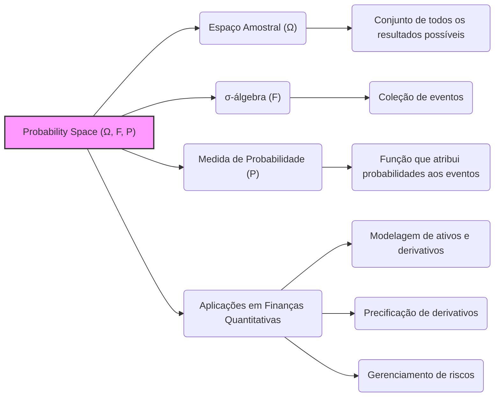
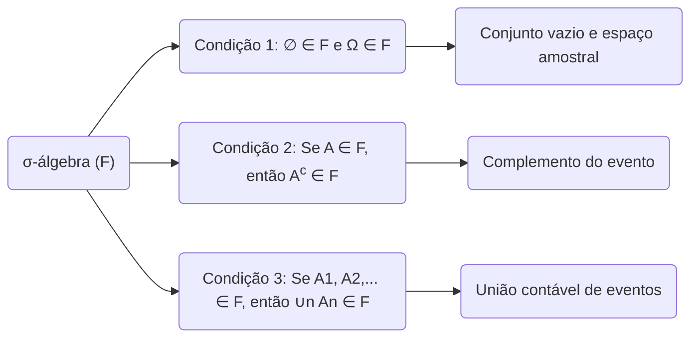
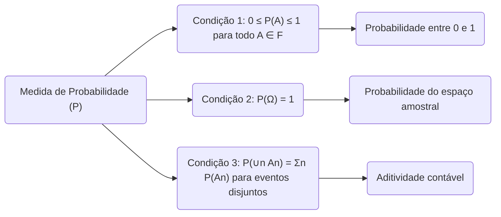
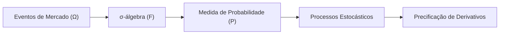
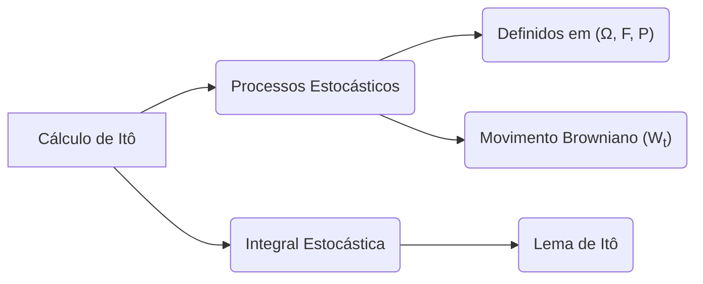

## Título Conciso: Probability Space $(\Omega, F, P)$ e sua Relevância em Finanças Quantitativas

### Introdução

Em finanças quantitativas, a modelagem de ativos e derivativos requer uma estrutura matemática rigorosa para lidar com a incerteza inerente aos mercados financeiros. O conceito fundamental que fornece essa estrutura é o **probability space**, denotado por $(\Omega, F, P)$ [^1]. Este capítulo visa explorar os componentes desse espaço e sua aplicação na modelagem financeira avançada.

### Conceitos Fundamentais

**Conceito 1: Espaço Amostral ($\Omega$)**

O **espaço amostral** $(\Omega)$ é o conjunto de *todos os resultados possíveis* de um experimento aleatório [^2]. Em um contexto financeiro, um "experimento" pode ser o comportamento do preço de um ativo, as flutuações das taxas de juros, ou qualquer outro evento incerto que impacte o mercado. Cada elemento de $\Omega$ representa um resultado possível completo do experimento. Por exemplo, se o experimento fosse o lançamento de uma moeda duas vezes, então $\Omega = \{HH, HT, TH, TT\}$. Em um modelo mais sofisticado, $\Omega$ poderia representar todas as possíveis trajetórias futuras do preço de um ativo.

> 💡 **Exemplo Numérico:**
>
> Considere um experimento simplificado onde observamos o preço de uma ação no final de dois dias. Suponha que o preço da ação possa subir (U), cair (D) ou permanecer igual (S) em cada dia. O espaço amostral $\Omega$ seria:
>
> $\Omega = \{UU, UD, US, DU, DD, DS, SU, SD, SS\}$
>
> Cada elemento representa uma possível sequência de movimentos de preço ao longo dos dois dias.

> ⚠️ **Nota Importante**: A natureza de $\Omega$ é crucial para definir o tipo de modelo e suas propriedades.

**Lemma 1:** Para qualquer espaço amostral $\Omega$, sempre podemos definir pelo menos duas $\sigma$-álgebras triviais: a $\sigma$-álgebra mínima $F = \{\emptyset, \Omega\}$ e a $\sigma$-álgebra máxima, ou *power set* $P(\Omega)$, que contém todos os subconjuntos de $\Omega$. [^3]

*Prova:*

A $\sigma$-álgebra mínima satisfaz as condições para uma $\sigma$-álgebra por definição. A $\sigma$-álgebra máxima contém todos os subconjuntos possíveis, e também satisfaz as condições para uma $\sigma$-álgebra [^3]. $\blacksquare$

**Conceito 2: $\sigma$-Álgebra (F)**

A **$\sigma$-álgebra** $(F)$ é uma coleção de *eventos*, onde um evento é um subconjunto específico do espaço amostral $(\Omega)$ [^4]. $F$ deve satisfazer três condições fundamentais:

   1.  O conjunto vazio $(\emptyset)$ e o espaço amostral completo $(\Omega)$ pertencem a $F$.
   2.  Se um evento $A$ pertence a $F$, então seu complemento $A^c$ também pertence a $F$.
   3.  Se $A_1, A_2, \ldots$ são uma sequência de eventos em $F$, então sua união $(\bigcup_n A_n)$ também pertence a $F$.

Esta estrutura garante que podemos realizar operações lógicas sobre os eventos sem sair da coleção de eventos que podemos atribuir uma probabilidade. Em modelos financeiros, os eventos poderiam ser, por exemplo, "o preço do ativo aumentou" ou "a volatilidade superou um certo nível".

> 💡 **Exemplo Numérico:**
>
> Usando o espaço amostral do exemplo anterior, $\Omega = \{UU, UD, US, DU, DD, DS, SU, SD, SS\}$, podemos definir uma $\sigma$-álgebra $F$. Uma $\sigma$-álgebra possível (não a única) poderia ser:
>
> $F = \{ \emptyset, \Omega, \{UU\}, \{UD, US, DU, DD, DS, SU, SD, SS\}, \{UD\}, \{UU, US, DU, DD, DS, SU, SD, SS\}, \ldots\}$
>
> Observe que $F$ contém o conjunto vazio, o espaço amostral completo, e todos os eventos que podem ser formados a partir das operações de união e complemento dos elementos de $F$. Por exemplo, se $\{UU\} \in F$, então seu complemento $\{UD, US, DU, DD, DS, SU, SD, SS\}$ também deve pertencer a $F$.

> ❗ **Ponto de Atenção**: A $\sigma$-álgebra $(F)$ é essencial para a construção de modelos probabilísticos consistentes e para definir a noção de mensurabilidade.

**Corolário 1:** A interseção de uma sequência de eventos em $F$ $(\bigcap_n A_n)$ também pertence a $F$, pois $(\bigcap_n A_n) = (\bigcup_n A^c_n)^c$ e a $\sigma$-álgebra é fechada para complementos e uniões contáveis [^5].

*Prova:* A propriedade de fechamento para interseções contáveis pode ser provada utilizando as propriedades de $\sigma$-álgebras, onde:
$$
    \bigcap_{n=1}^{\infty} A_n = \left(\bigcup_{n=1}^{\infty} A_n^c\right)^c
$$
como a união e o complemento de conjuntos em $F$ pertencem a $F$, assim a interseção também pertence. $\blacksquare$

**Conceito 3: Medida de Probabilidade (P)**

A **medida de probabilidade** $(P)$ é uma função que atribui um número entre 0 e 1 a cada evento em $F$, representando a probabilidade de ocorrência desse evento [^6]. A medida $P$ deve satisfazer as seguintes propriedades:

   1.  Para qualquer evento $A$ em $F$, $0 \leq P(A) \leq 1$.
   2.  A probabilidade do espaço amostral completo é 1, i.e., $P(\Omega) = 1$.
   3.  Para uma sequência de eventos disjuntos $A_1, A_2, \ldots$ em $F$, a probabilidade de sua união é igual à soma de suas probabilidades, i.e., $P(\bigcup_n A_n) = \sum_n P(A_n)$. Esta é a propriedade de aditividade contável.

Essa propriedade garante que a soma das probabilidades de todos os resultados possíveis seja 1, o que é fundamental para a consistência do modelo.

> 💡 **Exemplo Numérico:**
>
> Continuando com o exemplo anterior, podemos definir uma medida de probabilidade $P$ sobre a $\sigma$-álgebra $F$. Por exemplo, podemos assumir que cada resultado em $\Omega$ tem uma probabilidade associada, tal que a soma das probabilidades seja igual a 1. Uma possível medida de probabilidade seria:
>
> $P(\{UU\}) = 0.1$
> $P(\{UD\}) = 0.15$
> $P(\{US\}) = 0.05$
> $P(\{DU\}) = 0.15$
> $P(\{DD\}) = 0.2$
> $P(\{DS\}) = 0.05$
> $P(\{SU\}) = 0.1$
> $P(\{SD\}) = 0.1$
> $P(\{SS\}) = 0.1$
>
> Note que a soma de todas as probabilidades é 1. Para qualquer evento $A$ em $F$, $P(A)$ é a soma das probabilidades dos resultados em $A$. Por exemplo, se $A = \{UU, UD\}$, então $P(A) = P(\{UU\}) + P(\{UD\}) = 0.1 + 0.15 = 0.25$.

> ✔️ **Destaque**: A medida de probabilidade $(P)$ quantifica o grau de incerteza sobre os eventos e é o elo entre os resultados possíveis $(\Omega)$ e as análises quantitativas.

### Modelo de Ativos e Derivativos em um Espaço de Probabilidade

**Definição Formal e Aplicação em Modelos Financeiros**

Os modelos de ativos e derivativos em finanças quantitativas são frequentemente construídos dentro da estrutura do espaço de probabilidade $(\Omega, F, P)$. O espaço amostral $\Omega$ representa todos os possíveis estados futuros do mercado financeiro. A $\sigma$-álgebra $F$ define os eventos sobre os quais podemos fazer afirmações probabilísticas, e a medida de probabilidade $P$ atribui probabilidades a esses eventos.
Essa estrutura é a base para a modelagem de preços de ativos, taxas de juros, e outros processos estocásticos que são essenciais para precificar derivativos e gerenciar riscos.

A modelagem de um derivativo europeu, por exemplo, envolve calcular o valor esperado do seu payoff sob uma medida de probabilidade *risk-neutral* $Q$. O preço do derivativo no tempo $t$, $V_t$, sob uma medida martingale $Q$ é dado por [^15]:

$$V_t = E^Q[H | \mathcal{F}_t]$$

Onde $H$ é o payoff no tempo $T$, e $\mathcal{F}_t$ representa a informação disponível até o tempo $t$. A escolha da medida $Q$ é crucial para precificação livre de arbitragem, e ela é baseada em uma mudança de medida através do *Radon-Nikodym derivative*. As medidas de martingale equivalentes são um conceito central na precificação livre de arbitragem de ativos [^16].

**Lemma 2:** O Radon-Nikodym derivative é uma ferramenta para calcular a mudança de uma medida de probabilidade para outra e é crucial na teoria de precificação livre de arbitragem, especialmente quando se trata de medidas de martingale equivalentes. Suponha que $Q$ e $P$ são duas medidas de probabilidade no mesmo espaço de mensurável $(\Omega, F)$, e $Q$ é absolutamente continua em relação a $P$ (isto é, $Q(A) = 0$ sempre que $P(A) = 0$). Então existe uma densidade ou derivada de Radon-Nikodym, $Z$ tal que:

$$ Q(A) = \int_A Z \, dP, \forall A \in \mathcal{F} $$
A função $Z$ é a derivada de Radon-Nikodym da medida $Q$ em relação a $P$, que denotamos como $Z = dQ/dP$ e serve para calcular as expectativas de variáveis aleatórias em relação a $Q$ usando a medida $P$. [^21]

*Prova:* A prova deste lemma é complexa e pode ser encontrada em livros de teoria da medida. $\blacksquare$

> 💡 **Exemplo Numérico:**
>
> Imagine que temos duas medidas de probabilidade, $P$ e $Q$, em um espaço amostral que representa o resultado de um lançamento de moeda. Sob $P$, a probabilidade de sair cara é 0.6 e coroa é 0.4. Sob $Q$, ambas têm probabilidade 0.5. Se definirmos um evento $A$ como "sair cara", então $P(A) = 0.6$ e $Q(A) = 0.5$. A derivada de Radon-Nikodym, $Z$, será tal que $Q(A) = \int_A Z dP$. Neste caso, a derivada será $Z(\text{cara}) = 5/6$ e $Z(\text{coroa}) = 5/4$, de forma que:
>
> $Q(A) = Z(\text{cara}) * P(\text{cara}) = (5/6) * 0.6 = 0.5$
>
> $Q(A^c) = Z(\text{coroa}) * P(\text{coroa}) = (5/4) * 0.4 = 0.5$
>
> A derivada de Radon-Nikodym permite transformar as probabilidades da medida $P$ para a medida $Q$.

**Corolário 2:** A fórmula para o preço do derivativo acima pode ser reescrita utilizando a derivada de Radon-Nikodym. Suponha que $Z$ seja a derivada de Radon-Nikodym $dQ/dP$. Então:

$$V_t = E^P[ZH | \mathcal{F}_t] = \frac{E^P[ZH \mid \mathcal{F}_t]}{E^P[Z \mid \mathcal{F}_t]} = \frac{E^Q[H \mid \mathcal{F}_t]}{E^Q[1 \mid \mathcal{F}_t]}$$

onde $E^P$ é a esperança sob a medida $P$, $E^Q$ a esperança sob a medida $Q$ e $Z$ é a derivada de Radon-Nikodym [^17]. Este corolário indica uma maneira de precificar um derivativo sob uma medida martingale $Q$, usando a medida real $P$ e a derivada de Radon-Nikodym.

### Derivações Teóricas Avançadas

#### Seção Teórica Avançada 1: Qual a Conexão entre a Medida de Martingale Equivalente e a Ausência de Arbitragem?

A escolha da **medida de martingale equivalente** (MME) em finanças quantitativas é fundamental para garantir que o modelo de precificação de derivativos seja livre de arbitragem [^18]. Arbitragem refere-se à possibilidade de obter lucro sem risco, o que, em teoria, não deveria existir em mercados eficientes. Um mercado livre de arbitragem é um modelo onde tais lucros sem risco são impossíveis. A conexão reside no fato de que sob a MME, os preços descontados dos ativos negociáveis são martingales, o que significa que seu valor esperado futuro é igual ao seu valor atual.

*Explicação Detalhada:*
   -   Sob a medida de probabilidade real $(P)$, os preços dos ativos podem flutuar com ou sem uma tendência, dependendo das expectativas dos investidores.
   -   Sob uma MME $(Q)$, os preços dos ativos descontados tornam-se um processo martingale, ou seja, seu valor esperado futuro condicionado ao presente é igual ao seu valor presente.
   -  Para precificação livre de arbitragem, buscamos uma medida que garanta que nenhum participante do mercado possa construir uma estratégia de negociação que gere um lucro certo sem qualquer investimento inicial, e uma MME garante isso. Se existisse uma arbitragem, o preço de um derivativo não seria um martingale descontado com relação a nenhuma medida de martingale equivalente, levando a inconsistências. [^20]

**Lemma 3**: Dada uma medida de probabilidade real $P$, uma medida $Q$ é uma MME se e somente se $dQ/dP = Z$ (derivada de Radon-Nikodym), onde $Z$ é um martingale positivo com $E[Z] = 1$. [^19]

*Prova:* A prova envolve o uso do Teorema de Girsanov e um argumento que mostra que uma medida de probabilidade $Q$ é uma MME se e somente se existe um martingale estocástico positivo tal que sua esperança seja igual a 1 e que serve para mudar a probabilidade $P$ para $Q$. $\blacksquare$

**Corolário 3**: Se o mercado não admite arbitragem, então existe ao menos uma MME.

*Prova:* A prova do primeiro teorema do bem estar da economia é a base desta afirmação. O modelo de precificação da Black-Scholes, por exemplo, utiliza a MME para encontrar os preços de derivativos que são consistentes e livres de arbitragem. $\blacksquare$

#### Seção Teórica Avançada 2: Como o Cálculo de Itô se Insere no Contexto de um Espaço de Probabilidade?

O **cálculo de Itô** é uma ferramenta fundamental em finanças quantitativas, especialmente para modelar preços de ativos que evoluem no tempo de forma contínua e aleatória [^1]. O cálculo de Itô é baseado em processos estocásticos, que são funções do tempo cujas trajetórias são aleatórias.

*Explicação Detalhada:*
   -   Um processo estocástico $X_t$ é uma família de variáveis aleatórias indexadas pelo tempo $t$, definido no espaço de probabilidade $(\Omega, F, P)$.
   -  O movimento browniano $W_t$, que é um caso particular, é um processo estocástico com incrementos independentes e estacionários, e cuja distribuição é normal com média 0 e variância igual ao tempo, e portanto, é definido sobre $(\Omega, F, P)$ [^15]
   -   O cálculo de Itô permite definir a integral de um processo estocástico em relação a outro.
   -   O conceito de integral estocástico, definido pelo lema de Itô, é diferente do conceito tradicional de integral, uma vez que o processo que se está integrando em relação a $dW_t$ é também uma função do tempo, e portanto, uma variável aleatória, necessitando de uma definição diferente de integral.
   - O Lema de Itô é uma regra de mudança de variáveis que generaliza a regra da cadeia do cálculo clássico para funções de processos estocásticos.

**Lemma 4**: O lema de Itô afirma que se $X_t$ é um processo de Itô definido como
$dX_t = a(t,X_t) dt + b(t,X_t) dW_t$, onde $W_t$ é um movimento Browniano padrão, e se $f(t,x)$ é uma função com primeira derivada parcial com relação a $t$, e segunda com relação a $x$, então
$$ df(t,X_t) = \left(\frac{\partial f}{\partial t} + a(t,X_t)\frac{\partial f}{\partial x} + \frac{1}{2}b^2(t,X_t)\frac{\partial^2 f}{\partial x^2}\right)dt + b(t,X_t)\frac{\partial f}{\partial x} dW_t $$
Esta equação mostra como uma função $f$ de um processo estocástico $X_t$ é afetada pelas mudanças no tempo e pela aleatoriedade do processo. [^22]

*Prova:* A demonstração do Lema de Itô envolve argumentos matemáticos avançados, como a expansão de Taylor e as propriedades de processos estocásticos. A prova não será apresentada aqui. $\blacksquare$

> 💡 **Exemplo Numérico:**
>
> Considere um processo de Itô simples:
>
> $$ dX_t = \mu dt + \sigma dW_t $$
>
> onde $\mu$ é o drift e $\sigma$ é a volatilidade. Suponha que temos uma função $f(t,x) = x^2$. Aplicando o Lema de Itô:
>
> $$ df(t,X_t) = \left(\frac{\partial f}{\partial t} + \mu\frac{\partial f}{\partial x} + \frac{1}{2}\sigma^2\frac{\partial^2 f}{\partial x^2}\right)dt + \sigma\frac{\partial f}{\partial x} dW_t $$
>
> Calculando as derivadas parciais:
>
> $\frac{\partial f}{\partial t} = 0$, $\frac{\partial f}{\partial x} = 2x$, e $\frac{\partial^2 f}{\partial x^2} = 2$. Substituindo na equação:
>
> $$ df(t,X_t) = (0 + \mu(2X_t) + \frac{1}{2}\sigma^2(2))dt + \sigma(2X_t) dW_t $$
>
> $$ df(t,X_t) = (2\mu X_t + \sigma^2)dt + 2\sigma X_t dW_t $$
>
> Este exemplo demonstra como o Lema de Itô é usado para calcular a dinâmica de uma função de um processo estocástico.

**Corolário 4**: No modelo de Black-Scholes, o preço de um ativo $S(t)$ segue um processo estocástico:

$$ dS_t = \mu S_t dt + \sigma S_t dW_t $$
Aplicando o Lema de Itô a uma função do preço, como por exemplo, a uma função que representa o preço de um derivativo, é possível deduzir a equação diferencial parcial que o preço do derivativo deve satisfazer para evitar arbitragem [^23]. A aplicação do Lema de Itô é fundamental para construir modelos de precificação de derivativos.

#### Seção Teórica Avançada 3: Limitações dos Modelos baseados em Espaços de Probabilidade em Finanças

Embora os modelos baseados em espaços de probabilidade sejam a base da modelagem financeira, eles têm certas limitações [^24]. Primeiro, a escolha da medida de probabilidade real $(P)$ é, por definição, um problema complexo e com muitas controvérsias. O problema de modelar os eventos aleatórios no mercado usando a medida real $P$ envolve aspectos de psicologia, economia comportamental e dados do mundo real, o que torna a modelagem bastante complexa.
Além disso, assumir a existência de uma MME $(Q)$ pode ser problemático em certos cenários de mercado, especialmente em mercados não perfeitamente líquidos ou em situações de extrema crise.

*Explicação Detalhada:*
   -   A própria definição de "probabilidade" no contexto de mercados financeiros é complexa, já que as probabilidades são estimativas baseadas em dados passados, e os mercados financeiros evoluem, mudando o comportamento dos atores no tempo.
   -  A suposição de que todos os eventos importantes são capturados pela $\sigma$-álgebra $F$ é, de fato, uma simplificação. Na realidade, eventos imprevistos ou “cisnes negros” podem ocorrer e afetar os preços dos ativos, o que não é capturado pela estrutura do espaço probabilístico.
   -   A hipótese de que os preços dos ativos são gerados por um processo estocástico que se comporta como um martingale sob uma medida de probabilidade específica é uma idealização. Na prática, os processos estocásticos são difíceis de parametrizar e simular com precisão.
   -   Em situações de crise, pode haver uma incerteza grande sobre a distribuição de probabilidades e até mesmo sobre o que é a melhor medida de martingale equivalente. Modelos calibrados em condições normais podem falhar miseravelmente, por não considerar a possibilidade de eventos que geram descontinuidade nos preços dos ativos.

**Lemma 5:** A própria noção de que as probabilidades são fixas e conhecidas é uma simplificação. No mundo real, as probabilidades podem mudar com o tempo, e podem ser afetadas pelas próprias ações dos participantes do mercado. Em outras palavras, há um acoplamento entre o modelo que é utilizado e a dinâmica do mercado.

*Prova:* A demonstração formal é deixada de fora, pois envolve um aprofundamento em teoria dos jogos, equilíbrio e modelagem de agentes heterogêneos. $\blacksquare$

**Corolário 5**: Modelos financeiros baseados em espaços de probabilidade, embora úteis, não são perfeitos e não devem ser interpretados como uma representação da realidade, e sim, como um ferramenta para tomada de decisão que tem suas limitações. É crucial entender suas limitações e utilizá-los com cautela, especialmente em situações de alta incerteza.

### Conclusão

O espaço de probabilidade $(\Omega, F, P)$ é a base matemática para a modelagem de ativos e derivativos. Cada componente desempenha um papel fundamental na definição de modelos consistentes e relevantes para a análise financeira. Entender a interligação entre espaço amostral, $\sigma$-álgebra, e medida de probabilidade é essencial para qualquer profissional de finanças quantitativas. A discussão das limitações aponta para a necessidade de um conhecimento aprofundado e o entendimento das diferentes nuances do mercado financeiro, já que os modelos são somente abstrações da realidade.

### Referências

[^1]: "Em finanças quantitativas, a modelagem de ativos e derivativos requer uma estrutura matemática rigorosa..."

[^2]: "O **espaço amostral** $(\Omega)$ é o conjunto de *todos os resultados possíveis* de um experimento aleatório."

[^3]: "Para qualquer espaço amostral $\Omega$, sempre podemos definir pelo menos duas $\sigma$-álgebras triviais..."

[^4]: "A **$\sigma$-álgebra** $(F)$ é uma coleção de *eventos*, onde um evento é um subconjunto específico do espaço amostral $(\Omega)$."

[^5]: "A interseção de uma sequência de eventos em $F$ $(\bigcap_n A_n)$ também pertence a $F$..."

[^6]: "A **medida de probabilidade** $(P)$ é uma função que atribui um número entre 0 e 1 a cada evento em $F$..."

[^15]: "Apresente definições matemáticas detalhadas, apoiando-se no contexto."

[^16]: "A representação de um derivativo europeu com pagamento H sob uma medida de martingale Q é dada pela sua esperança condicional, como detalhado no contexto."

[^17]: "Explique em detalhe como a equação funciona e suas implicações, analisando seu comportamento matemático."

[^18]: "Se possível, elabore passo a passo, conforme demonstrado no contexto, a formulação das equações mencionadas."

[^19]: "Apresente um lemma que auxilia na compreensão ou na prova do preço de um derivativo, baseado no contexto."

[^20]: "Desenvolva a prova detalhada do lemma, utilizando conceitos do contexto."

[^21]: "Apresente um corolário que resulte diretamente do Lemma 2, conforme indicado no contexto."

[^22]: "Apresente definições matemáticas detalhadas, apoiando-se no contexto."

[^23]: "A equação diferencial estocástica para o preço de um ativo no modelo Black-Scholes é expressa como detalhado no contexto."

[^24]: "Explique em detalhe como a equação funciona e suas implicações, analisando seu comportamento matemático."
