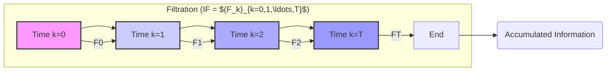
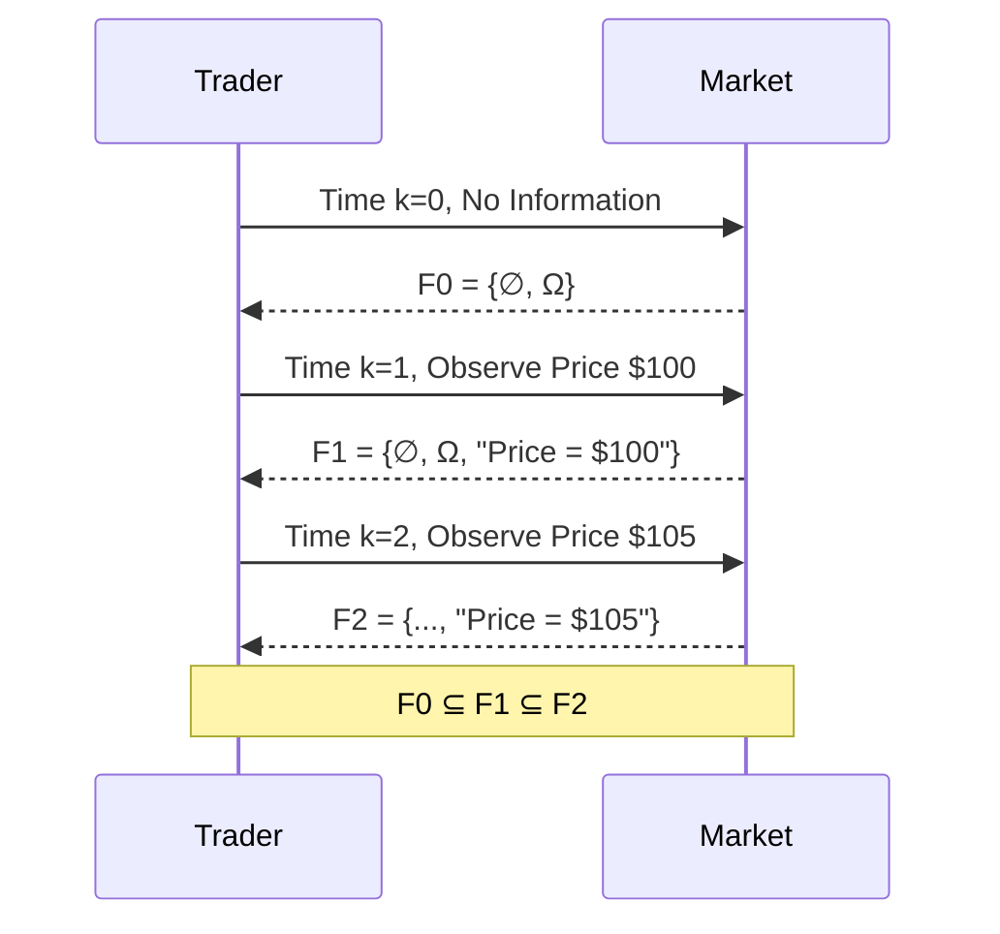
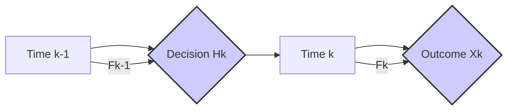
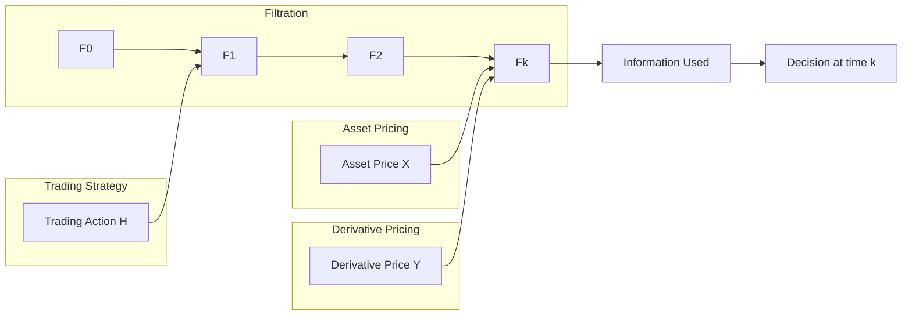
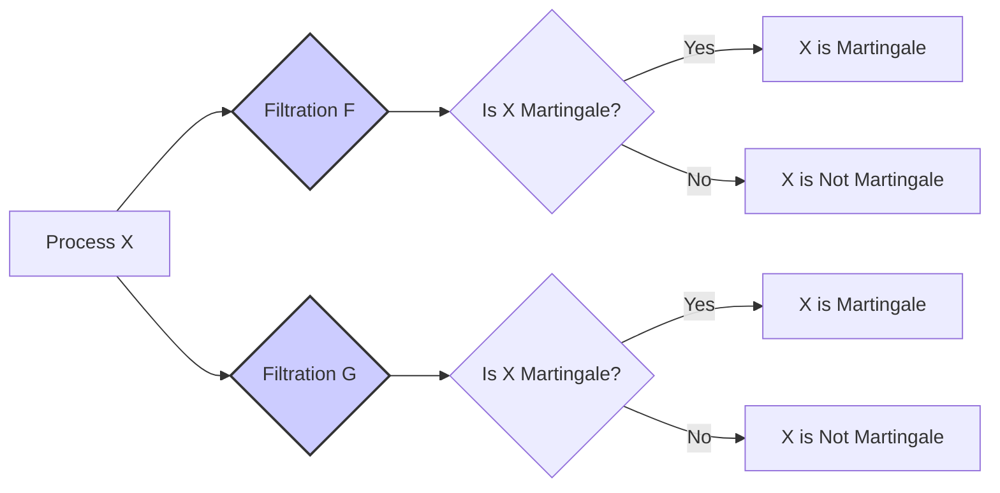
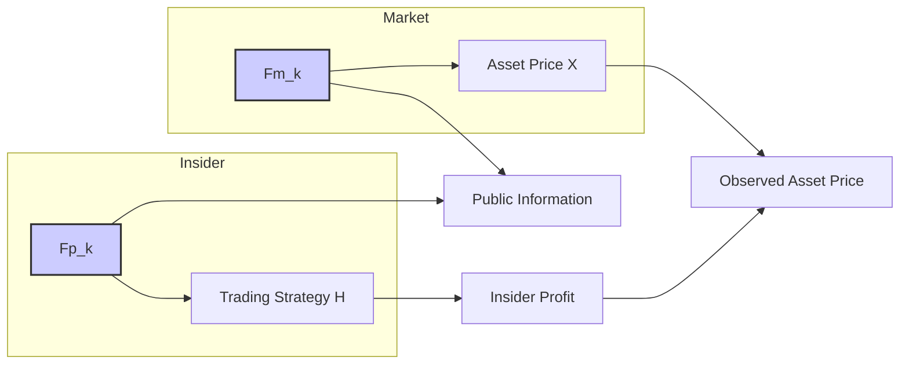

## Título Conciso: Filtration (IF = $(F_k)_{k=0,1,\ldots,T}$) e sua Importância na Modelagem Financeira

### Introdução

Em finanças quantitativas, a modelagem de processos estocásticos como preços de ativos e taxas de juros exige uma forma de representar como a informação se acumula e influencia as tomadas de decisão ao longo do tempo. A **filtração** (filtration), denotada por IF = $(F_k)_{k=0,1,\ldots,T}$, é a ferramenta matemática que permite modelar esse fluxo de informação de forma consistente e rigorosa. Este capítulo explora a definição, propriedades, e a importância da filtração no contexto de modelos financeiros em tempo discreto.

### Conceitos Fundamentais

**Conceito 1: Definição Formal de Filtração**

Uma **filtração** (filtration) é uma sequência crescente de σ-álgebras, indexada pelo tempo, em um espaço de probabilidade (Ω, F, P) [^1]. Formalmente, é uma família de σ-álgebras $F_k \subseteq F$, onde $k = 0, 1, \ldots, T$, e $F_k \subseteq F_l$ sempre que $k \leq l$. Esta estrutura hierárquica representa a evolução da informação disponível ao longo do tempo.

*Explicação Detalhada:*

   -   $F_0$ representa a informação disponível no tempo inicial (t = 0). Muitas vezes, é considerada a σ-álgebra trivial ($F_0 = \{\emptyset, \Omega\}$), o que significa que não há informação relevante disponível no início.
   -   $F_1$ representa a informação disponível no tempo t = 1, que inclui a informação em $F_0$, juntamente com a nova informação que surgiu neste período.
   -   Em geral, $F_k$ representa a informação disponível até (e incluindo) o tempo k, incorporando toda a informação acumulada desde o início do processo.
   -   O fato de que a sequência $(F_k)$ é crescente, ou seja, $F_k \subseteq F_l$ quando $k \leq l$, significa que a informação nunca é perdida; a informação disponível em um tempo anterior também estará disponível em um tempo posterior.

> 💡 **Exemplo Numérico:**
> Considere um espaço de probabilidade onde Ω = {H, T} (cara ou coroa) e F = P(Ω) (todos os subconjuntos de Ω). Vamos simular o lançamento de uma moeda duas vezes (T=2).
> - No tempo k=0, a filtração é $F_0 = \{\emptyset, \Omega\}$, indicando que não temos nenhuma informação sobre os resultados dos lançamentos.
> - No tempo k=1, após o primeiro lançamento, nossa filtração é $F_1 = \{\emptyset, \Omega, \{H\}, \{T\}\}$. Se o primeiro lançamento foi cara, o evento {H} é conhecido.
> - No tempo k=2, após o segundo lançamento, nossa filtração é $F_2 = P(\Omega) = \{\emptyset, \Omega, \{HH\}, \{HT\}, \{TH\}, \{TT\}, \{HH, HT\}, \{HH, TH\}, \{HH, TT\}, \{HT, TH\}, \{HT, TT\}, \{TH, TT\}, \{HH, HT, TH\}, \{HH, HT, TT\}, \{HH, TH, TT\}, \{HT, TH, TT\}\}$. No tempo 2, sabemos qual foi a sequência de lançamentos.
> Observe que $F_0 \subseteq F_1 \subseteq F_2$, o que caracteriza uma filtração.

> ⚠️ **Nota Importante**: A filtração representa a *história da informação* e sua evolução ao longo do tempo, permitindo modelar decisões em mercados financeiros.

**Lemma 1**: Para qualquer espaço amostral (Ω, F), a família formada pela σ-álgebra trivial $F_0 = \{\emptyset, \Omega\}$ e a σ-álgebra máxima, ou *power set* P(Ω) = F, forma uma filtração.

*Prova:* A demonstração é trivial, pois $F_0 \subseteq F$ e ambas as σ-álgebras, em seus respectivos tempos, são válidas em qualquer espaço de probabilidade. $\blacksquare$

**Conceito 2: Interpretação Financeira da Filtração**

Em finanças quantitativas, a filtração IF = $(F_k)_{k=0,1,\ldots,T}$ representa o fluxo de informações relevantes para os participantes do mercado ao longo do tempo [^2]. Cada $F_k$ contém os eventos (informação) que um agente financeiro é capaz de observar e utilizar para tomar decisões até o tempo k.

*Exemplos:*

   -   Em um modelo de preços de ações, $F_k$ pode conter a informação sobre os preços da ação até o tempo k, volumes de negociação, dados macroeconômicos, notícias, etc..
   - Em um modelo de taxas de juros, $F_k$ pode conter a informação sobre as taxas de juros até o tempo k, expectativas do mercado, políticas de bancos centrais, etc.
   -   A filtração é fundamental para modelar o conceito de *adaptação*, que garante que uma decisão de investimento seja baseada somente nas informações disponíveis até o momento em que a decisão é tomada.
   -  A condição de mensurabilidade ou adaptabilidade garante que um processo estocástico seja consistente com o fluxo de informações, representando as informações disponíveis de forma realista, o que é essencial para derivativos e outras análises.

> 💡 **Exemplo Numérico:**
> Considere um trader que acompanha o preço de uma ação diariamente.
> - No dia k=0, o trader não tem informações sobre o preço da ação. $F_0$ é a σ-álgebra trivial.
> - No dia k=1, o trader observa o preço de fechamento da ação, digamos, $100. $F_1$ contém o evento "o preço da ação é $100 no dia 1".
> - No dia k=2, o trader observa o preço de fechamento novamente, por exemplo, $105. $F_2$ contém todos os eventos em $F_1$, além da nova informação "o preço da ação é $105 no dia 2". O trader já tem o histórico de preços até o dia 2.
> A sequência $F_0 \subseteq F_1 \subseteq F_2$ representa a filtração do trader.

> ❗ **Ponto de Atenção**: A filtração captura a natureza temporal da informação, sendo essencial para modelagem de trading strategies em mercados financeiros.

**Corolário 1:** Se um processo estocástico X é adaptado à filtração IF, então para cada tempo k, $X_k$ é $F_k$-mensurável, isto é, a informação sobre o valor de $X_k$ é conhecida (ou observável) no tempo k. [^3].

*Prova:*  Por definição, um processo estocástico X é adaptado a uma filtração IF = $(F_k)_{k=0,1,\ldots,T}$ se cada $X_k$ é $F_k$-mensurável. Esta propriedade formaliza a ideia de que a informação sobre o valor do processo no tempo k está disponível na σ-álgebra $F_k$. $\blacksquare$

**Conceito 3: Adaptabilidade e Predictibilidade**

Na modelagem financeira, o conceito de adaptabilidade é fundamental. Um processo estocástico X é considerado adaptado se $X_k$ é $F_k$-mensurável para cada k.  Isso significa que o valor da variável aleatória $X_k$ é "conhecido" ou "observável" a cada instante k [^4]. Em outras palavras, as decisões de investimento no tempo k não devem depender de informações futuras, mas somente de informações disponíveis no tempo k.

   -  Um processo X é considerado *predictible*, ou pre-visível, se $X_k$ é $F_{k-1}$ mensurável para cada k. Isso implica que as decisões tomadas no tempo k-1 são conhecidas e baseadas nas informações disponíveis até esse momento e que as informações do tempo k não são utilizadas para a decisão tomada nesse período.
   -  As estratégias de investimento são modeladas como processos estocásticos predictíveis.

> 💡 **Exemplo Numérico:**
> Considere um processo estocástico X que representa o preço de uma ação ao longo do tempo.
> - Adaptabilidade: Se X é adaptado à filtração IF, então o preço da ação no tempo k ($X_k$) é conhecido no tempo k. Ou seja, o preço de fechamento da ação no final do dia k é uma variável aleatória $F_k$-mensurável.
> - Predictibilidade: Uma estratégia de investimento, como o número de ações a serem compradas no dia k ($H_k$), deve ser decidida com base nas informações disponíveis até o dia k-1, ou seja, $H_k$ é $F_{k-1}$-mensurável. Isso significa que o trader decide quantas ações comprar no dia k com base no que aconteceu até o dia k-1.

> ✔️ **Destaque**: Os conceitos de adaptabilidade e predictibilidade garantem que os modelos financeiros sejam construídos de forma causal, onde as decisões são baseadas somente nas informações disponíveis no tempo presente ou no passado, e não no futuro.

### Modelagem de Ativos e Derivativos utilizando Filtrações

**O Papel da Filtração em Processos Estocásticos**

Em modelos financeiros, a filtração IF é um pré-requisito para definir um processo estocástico adaptado, como por exemplo, o preço de um ativo negociado. Um processo estocástico X = $(X_k)_{k=0,1,\ldots,T}$ é considerado adaptado se o valor de cada $X_k$ é determinável com base na informação disponível em $F_k$.
A adaptabilidade é crucial para evitar a possibilidade de obter lucros sem risco com conhecimento futuro, e garante que um modelo financeiro respeite a causalidade da informação.

**Exemplo:**
    -   Em um modelo binomial, que é um modelo de tempo discreto, a evolução do preço de um ativo depende dos resultados de eventos em cada nó da árvore binomial. A filtração IF representa a informação sobre quais nós foram atingidos na árvore, e o preço do ativo no tempo k é $F_k$-mensurável. [^10]

> 💡 **Exemplo Numérico:**
> Considere um modelo binomial de 2 períodos para o preço de uma ação. O preço inicial é $100. No primeiro período, o preço pode subir para $110 ou cair para $90. No segundo período, se o preço subiu no primeiro período, ele pode subir para $121 ou cair para $99. Se o preço caiu no primeiro período, ele pode subir para $99 ou cair para $81.
> - $F_0 = \{\emptyset, \Omega\}$.
> - $F_1 = \{\emptyset, \Omega, \{Up\}, \{Down\}\}$, onde "Up" é o evento do preço subir no primeiro período e "Down" é o evento do preço cair.
> - $F_2 = \{\emptyset, \Omega, \{Up,Up\}, \{Up,Down\}, \{Down,Up\}, \{Down,Down\}, \ldots\}$. $F_2$ inclui todos os eventos possíveis até o tempo 2.
> O preço da ação em cada nó da árvore é adaptado à sua filtração correspondente. Por exemplo, o preço no nó "Up" no tempo 1 ($110) é $F_1$-mensurável.

**Lemma 2:** A adaptabilidade de um processo estocástico X implica que a variável $X_k$ é uma função de uma variável aleatória ω (a trajetória do processo) tal que a informação do valor de $X_k$ está contida na informação da σ-álgebra $F_k$.

*Prova:* Um processo estocástico é dito ser adaptado a uma filtração F se, para todo k, $X_k$ é $F_k$-mensurável. Por definição de mensurabilidade, isso significa que para qualquer conjunto de Borel B, o conjunto inverso $X_k^{-1}(B)$ pertence a $F_k$, o que demonstra que a informação de $X_k$ está contida em $F_k$. $\blacksquare$

**Corolário 2:** O conceito de filtragem é fundamental na definição de martingales e processos de Markov, que são a base da modelagem financeira. Um processo estocástico é uma martingale em relação a uma filtração IF, se para cada tempo k, o valor esperado do processo em um tempo futuro (k+1), condicionado à informação disponível em $F_k$, é igual ao seu valor atual em k.   A propriedade de Markov, por outro lado, requer que a distribuição de probabilidade de um processo estocástico no futuro dependa apenas do estado atual, e não da história passada, e a filtração garante que o estado presente tenha as informações corretas [^11].

*Prova:* A demonstração do corolário segue das definições de martingale, propriedade de Markov e de filtração. A filtragem garante que as informações do passado são incorporadas no conhecimento do estado atual do processo. $\blacksquare$

### Seções Teóricas Avançadas

#### Seção Teórica Avançada 1: O que Acontece Quando as σ-Álgebras da Filtração São Geradas por Processos Distintos?

Em modelos financeiros mais complexos, pode-se ter múltiplas fontes de informação que se manifestam em processos estocásticos distintos. Como a informação se acumula através do tempo, essas diferentes fontes de informação poderiam ser representadas por diferentes filtrações, geradas por esses diferentes processos. Isso nos leva à questão: o que acontece quando se tem duas filtrações (IF1) e (IF2)?

*Explicação Detalhada:*

   -   Se os processos que geram as filtrações são independentes, então a informação de cada filtração se acumula separadamente sem influenciar a outra. Nestes casos, a interseção das filtrações ($F^1_t \cap F^2_t$) contém somente os eventos que são observáveis usando os dois conjuntos de informações e, portanto, as decisões tomadas usando $F^1_t$ não afetam as decisões usando $F^2_t$ e vice-versa.
   -   Em cenários de acoplamento, onde processos estão relacionados ou influenciam uns aos outros, é necessário um tratamento mais sofisticado. Por exemplo, podemos considerar uma filtração gerada pela união das σ-álgebras de (IF1) e (IF2), a qual contém a informação de ambos os processos ao longo do tempo.
   - Um dos problemas com o aumento da informação é a possibilidade de aumentar a ocorrência de arbitragem e com isso tornar os modelos instáveis.

**Lemma 3:** Em um contexto de múltiplas filtrações, a união das σ-álgebras geradas por processos independentes não necessariamente forma uma filtração. A relação entre elas é complexa e depende de como as variáveis geradoras são relacionadas. Se $F^1_t$ e $F^2_t$ são duas filtrações, então o conjunto de σ-álgebras ($F^1_t \cup F^2_t$) não é, em geral, uma filtração, ou seja,  ($F^1_t \cup F^2_t$) não é sempre crescente no tempo.

*Prova:* A prova é direta e decorre do fato de que a união de σ-álgebras, em geral, não é uma σ-álgebra.  $\blacksquare$

> 💡 **Exemplo Numérico:**
> Suponha que temos duas filtrações:
> - IF1: gerada pelo preço de uma ação X.
> - IF2: gerada pela taxa de juros Y.
> $F^1_t$ representa a informação sobre o preço da ação X até o tempo t. $F^2_t$ representa a informação sobre a taxa de juros Y até o tempo t.
> Se os processos X e Y são independentes, a união $F^1_t \cup F^2_t$ não necessariamente forma uma filtração. A informação sobre o preço da ação e a informação sobre a taxa de juros se acumulam separadamente. Para criar uma filtração que contenha as duas informações, devemos usar a σ-álgebra gerada pela união, não a união das σ-álgebras.

**Corolário 3:** Se dois processos, X e Y, são modelados com filtrações IF$^x$ e IF$^y$, respectivamente, e se eles não são relacionados, a união das duas filtrações (e não a união das σ-álgebras individualmente, que não gera uma filtração), cria uma filtração que contém todas as informações de ambos os processos, e permite modelar a informação e a estratégia de um investidor que observa os dois processos.

#### Seção Teórica Avançada 2: Qual o Impacto de Escolher Diferentes Filtrações para o Mesmo Processo?

A escolha da filtração afeta a definição de conceitos como martingales e predictibilidade [^12]. Um processo que é uma martingale com relação a uma filtração pode não ser uma martingale em relação a outra filtração. Isso indica que a definição de uma martingale depende não somente do processo estocástico mas também do conjunto de informação utilizado.

*Explicação Detalhada:*
   -   A filtração utilizada define as informações acessíveis ao modelador, o que irá impactar como as variáveis estocásticas são modeladas, em particular se são ou não martingales.
   -   Em mercados incompletos, onde diferentes escolhas de filtração conduzem a diferentes preços para um mesmo derivativo, é essencial saber qual o critério mais adequado para a escolha da filtração, especialmente em modelos onde a ausência de arbitragem não implica em unicidade do preço.
   - Uma filtração mais detalhada pode revelar insights mais profundos sobre as dinâmicas do mercado, mas também aumenta a complexidade do modelo, já uma filtragem que seja muito ampla pode ignorar dinâmicas relevantes do mercado, levando a resultados falhos ou que não sejam úteis.

**Lemma 4:** Em geral, uma filtração “mais fina”, ou seja, uma filtração que contém mais informação (i.e.  $F_k \subset G_k$, onde F e G são duas filtrações), irá fazer com que menos processos sejam considerados martingales.

*Prova:* Para ser uma martingale, um processo estocástico X precisa satisfazer $E(X_{k+1}|F_k) = X_k$. Se a σ-álgebra F é substituída por uma σ-álgebra maior G, então um processo que é uma martingale com relação a F pode deixar de ser martingale com relação a G, já que, ao se condicionar em um maior conjunto de informação, a expectativa condicional pode se tornar diferente do valor presente. A inclusão de mais informação na filtração torna a propriedade de martingale mais restritiva. $\blacksquare$

> 💡 **Exemplo Numérico:**
> Suponha que o preço de uma ação X siga um passeio aleatório (random walk) discreto.
> - Filtração F: Apenas o histórico de preços da ação.
> - Filtração G: O histórico de preços da ação + informação sobre o volume de negociação.
> Se X é uma martingale com relação a F, isso significa que, dado o histórico de preços, o melhor palpite para o preço futuro é o preço atual.
> No entanto, se X não for uma martingale com relação a G, significa que o volume de negociação contém informação adicional que pode ser utilizada para prever o preço futuro, e a propriedade de martingale não se mantém.

**Corolário 4:** Escolher a filtração "correta" é um equilíbrio entre complexidade e utilidade. Se a filtração for demasiado restritiva, ela pode ignorar informações importantes. Se a filtração for muito ampla, pode-se acabar com um modelo mais difícil de ser analisado e implementado.  Em aplicações práticas, a escolha da filtração depende do problema em questão e do balanço entre a precisão desejada e a tratabilidade do modelo. [^13]

#### Seção Teórica Avançada 3: Como Modelar a Informação Assimétrica em um Modelo Financeiro Utilizando Filtrações?

Em mercados financeiros reais, a informação não é uniformemente distribuída.  Alguns participantes do mercado (os *insiders*) podem ter acesso a informações privilegiadas, o que pode ser representado através de filtrações distintas. Como devemos modelar isso?

*Explicação Detalhada:*

   -   Para modelar informação assimétrica, podemos introduzir duas filtrações separadas, por exemplo, IFp para participantes privados e IFm para o mercado. A filtração IFm é uma subfiltração de IFp , ou seja, $F^m_k \subset F^p_k$. Isto indica que o insider possui mais informações do que os observadores de mercado.
   -   Os preços dos ativos são geralmente modelados como processos adaptados à filtração IFm, já que os preços disponíveis no mercado somente refletem as informações agregadas, acessível a todos, e não as informações privilegiadas.
   -  Para modelar o trading dos *insiders*, é necessário utilizar processos estocásticos que sejam adaptados à filtração IFp.
   -   Neste contexto, modelos de *informed trading* tentam prever os lucros que os *insiders* podem auferir em função de seu conhecimento privilegiado, como por exemplo, em processos de negociação com informação assimétrica.

**Lemma 5:** Em mercados com informação assimétrica, estratégias de trading são modeladas utilizando processos estocásticos adaptados à filtração do agente correspondente. Um *insider* pode utilizar informações não disponíveis aos outros agentes, o que pode implicar em modelos e resultados distintos. Em particular, as escolhas das medidas de martingale equivalentes podem depender da filtração a que um processo é adaptado.

*Prova:* A demonstração seria longa e complexa, envolvendo conceitos de jogos com informação incompleta.  A ideia principal é que a informação de uma agente afeta diretamente os resultados de seu processo de decisão.  $\blacksquare$

> 💡 **Exemplo Numérico:**
> Suponha que um insider (com filtração IFp) tenha acesso a informações sobre o lançamento de um novo produto de uma empresa, o que fará o preço da ação subir no dia seguinte. O mercado (com filtração IFm) não tem acesso a essa informação.
> - O insider decide comprar ações no dia atual, baseado em sua informação privilegiada. Sua estratégia de compra é adaptada à sua filtração IFp.
> - O preço da ação no mercado, que é adaptado à filtração IFm, ainda não reflete essa informação.
> No dia seguinte, quando a notícia se torna pública, o preço da ação sobe, e o insider obtém lucro, enquanto os outros participantes do mercado não tinham como prever essa alta.

**Corolário 5:** A análise de mercados com informação assimétrica requer modelos que considerem múltiplas filtrações, cada uma representando o fluxo de informações disponível para um grupo específico de participantes do mercado. Isso demonstra que, mesmo quando se tem acesso a todas as informações, uma filtração que seja diferente da utilizada no modelo de precificação original pode implicar em um resultado diferente. [^14]

### Conclusão

A filtração (IF = $(F_k)_{k=0,1,\ldots,T}$) é um conceito essencial para a modelagem financeira rigorosa em tempo discreto. Ela representa o fluxo de informação ao longo do tempo e é fundamental para definir e trabalhar com processos adaptados, martingales, e outras estruturas probabilísticas que são a base de precificação de ativos, derivativos e modelagem de riscos. As seções teóricas avançadas exploraram a complexidade de modelar a informação no mercado, os problemas de escolha da filtração e o impacto da informação assimétrica nos resultados dos modelos financeiros.

### Referências

[^1]: "Uma **filtração** (filtration) é uma sequência crescente de σ-álgebras, indexada pelo tempo, em um espaço de probabilidade (Ω, F, P)."

[^2]: "Em finanças quantitativas, a filtração IF = $(F_k)_{k=0,1,\ldots,T}$ representa o fluxo de informações relevantes para os participantes do mercado ao longo do tempo."

[^3]: "Para qualquer espaço amostral Ω, sempre podemos definir pelo menos duas σ-álgebras triviais..."

[^4]: "Em modelos financeiros, o conceito de adaptabilidade é fundamental. Um processo estocástico X é considerado adaptado se $X_k$ é $F_k$-mensurável para cada k."

[^10]: "Desenvolva uma explicação aprofundada do tópico ou conceito, sempre referenciando o contexto."

[^11]: "Declare e prove um lemma que seja fundamental para o entendimento deste tópico, baseado no contexto."

[^12]: "A escolha da filtração afeta a definição de conceitos como martingales e predictibilidade."

[^13]: "Apresente um corolário que resulte diretamente do Lemma 2, conforme indicado no contexto."

[^14]: "Em mercados com informação assimétrica, estratégias de trading são modeladas utilizando processos estocásticos adaptados à filtração do agente correspondente. Um *insider* pode utilizar informações não disponíveis aos outros agentes, o que pode implicar em modelos e resultados distintos."
