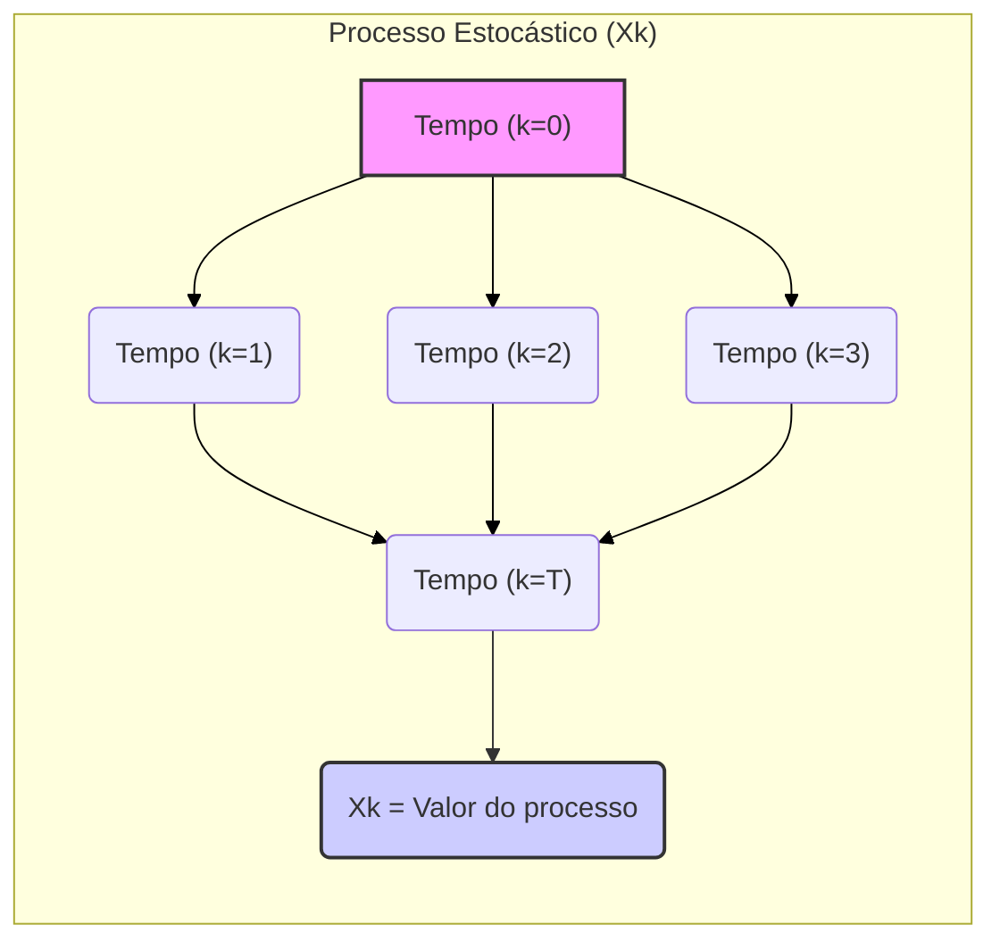
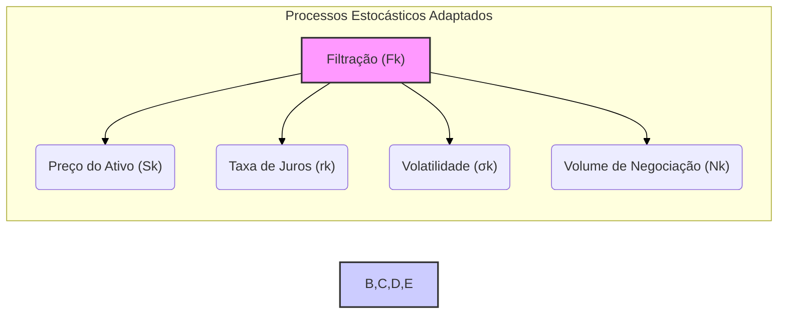
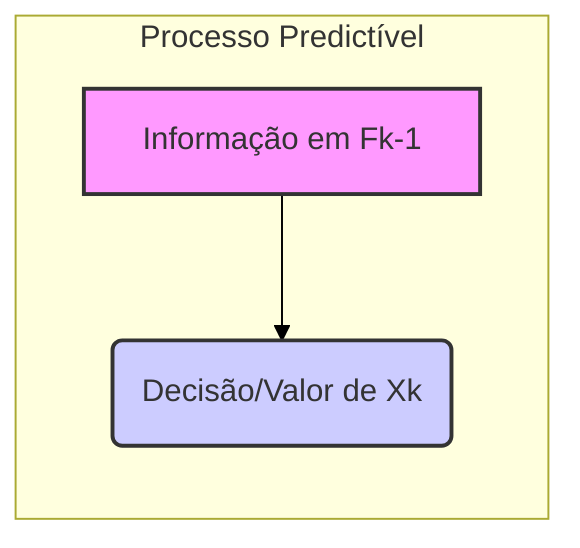
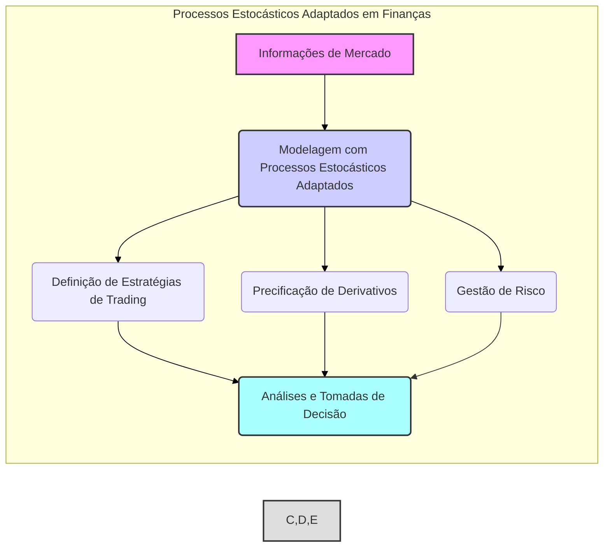
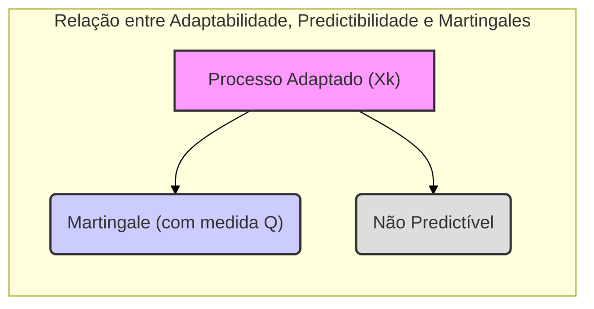

## Título Conciso: Processo Estocástico Adaptado (X = ($X_k$)$_{k=0,1,\ldots,T}$) e sua Relevância em Finanças Quantitativas

### Introdução

Em finanças quantitativas, a modelagem de ativos e derivativos requer a representação de quantidades que evoluem aleatoriamente ao longo do tempo. Um **processo estocástico** é a ferramenta matemática utilizada para representar essa evolução, e a adaptação é um requisito fundamental para garantir a consistência do modelo com o fluxo de informação disponível no mercado. Este capítulo explorará a definição e a importância de um **processo estocástico adaptado**, denotado por X = ($X_k$)$_{k=0,1,\ldots,T}$, no contexto da modelagem financeira em tempo discreto.

### Conceitos Fundamentais

**Conceito 1: Definição Formal de um Processo Estocástico Adaptado**

Um **processo estocástico** (stochastic process) é uma família de variáveis aleatórias indexadas por um conjunto T, que usualmente representa o tempo. No contexto de tempo discreto, denotamos um processo estocástico como X = ($X_k$)$_{k=0,1,\ldots,T}$, onde T é um inteiro que representa o horizonte de tempo [^1]. Cada $X_k$ é uma variável aleatória, ou seja, uma função mensurável do espaço de probabilidade (Ω, F, P) no espaço amostral dos valores que o processo pode assumir (por exemplo, os reais ou inteiros).  Um processo X é **adaptado** a uma filtração IF = ($F_k$)$_{k=0,1,\ldots,T}$ se cada $X_k$ é $F_k$-mensurável [^2].

*Explicação Detalhada:*

   -   Um processo estocástico é, por definição, uma família de variáveis aleatórias. A novidade do termo "adaptado" é especificar que estas variáveis aleatórias devem ser compatíveis com a informação disponível, que é modelada pela filtração IF.
   -  O índice k (que normalmente representa o tempo) pode, em geral, representar qualquer conjunto ordenado, como por exemplo, em modelos espaciais, mas nosso interesse aqui é no aspecto temporal.
   -   A $F_k$-mensurabilidade de $X_k$ significa que o valor de $X_k$ é conhecido no instante k. Isso implica que, para qualquer conjunto de Borel B (conjunto dos possíveis valores de $X_k$), o conjunto {ω : $X_k$(ω) ∈ B} pertence a $F_k$.

> 💡 **Exemplo Numérico:**
> Considere um processo estocástico que representa o preço de uma ação ao longo de 3 dias (k=0, 1, 2, 3), onde o preço inicial é $X_0$ = $100. Suponha que a filtração IF = ($F_k$) é tal que $F_0$ contém apenas a informação inicial, $F_1$ contém o preço no dia 1, $F_2$ contém os preços nos dias 1 e 2, e $F_3$ contém os preços em todos os dias. Se os preços nos dias 1, 2 e 3 foram $X_1$ = $105, $X_2$ = $110, e $X_3$ = $108, respectivamente, o processo X = ($X_0, X_1, X_2, X_3$) é adaptado à filtração IF, pois cada $X_k$ é conhecido no tempo k. A $F_k$-mensurabilidade garante que, no dia k, o valor $X_k$ é conhecido e a decisão de trading no dia k não depende do valor de $X_{k+1}$.

> ⚠️ **Nota Importante**:  A adaptabilidade garante que as decisões de investimento no tempo k não dependam de informações futuras, mas somente de informações disponíveis naquele momento.

**Lemma 1:** A condição de adaptabilidade para um processo X = ($X_k$)$_{k=0,1,\ldots,T}$ é equivalente a dizer que, para cada k, o σ-álgebra gerado pela variável aleatória $X_k$ está contido na σ-álgebra $F_k$, ou seja, σ($X_k$) ⊆ $F_k$ [^3].

*Prova:*  A demonstração segue da definição de mensurabilidade, pois a σ-álgebra gerada por uma variável aleatória X é a menor σ-álgebra que torna X mensurável. Assim, se $X_k$ é $F_k$-mensurável, σ($X_k$) ⊆ $F_k$. $\blacksquare$

**Conceito 2: Exemplos de Processos Estocásticos Adaptados**

Em mercados financeiros, diversos tipos de processos estocásticos adaptados podem ser utilizados:

   -   **Preços de Ativos:** A sequência de preços de um ativo ($S_k$)$_{k=0,1,\ldots,T}$ é um exemplo típico de processo adaptado. Em cada tempo k, o preço $S_k$ é conhecido, refletindo o valor do ativo naquele momento [^4].
   -   **Taxas de Juros:** A evolução das taxas de juros ($r_k$)$_{k=0,1,\ldots,T}$ também pode ser representada como um processo estocástico adaptado. A taxa de juros $r_k$ representa o valor da taxa que está vigorando no mercado no tempo k.
   -   **Volatilidade:** Modelos avançados podem incluir a modelagem da volatilidade como um processo estocástico. A volatilidade representa a incerteza do comportamento do ativo. Se a volatilidade é medida e conhecida a cada instante, ela pode ser modelada como um processo adaptado.
   -   **Volume de Negociação:** O volume de negociação de um ativo pode ser modelado como um processo estocástico adaptado ($N_k$)$_{k=0,1,\ldots,T}$, onde $N_k$ representa a quantidade de ativos negociados no período k.

> 💡 **Exemplo Numérico:**
> Considere um ativo com os seguintes preços diários durante uma semana: $S_0$ = $100, $S_1$ = $102, $S_2$ = $105, $S_3$ = $103, $S_4$ = $106, $S_5$ = $108. O processo de preços ($S_k$) é adaptado à filtração do mercado, pois o preço em cada dia k é conhecido no dia k. Similarmente, se as taxas de juros diárias fossem $r_0$ = 0.05%, $r_1$ = 0.052%, $r_2$ = 0.055%, $r_3$ = 0.053%, $r_4$ = 0.056%, $r_5$ = 0.058%, o processo de taxas de juros ($r_k$) também seria adaptado, pois a taxa de juros em cada dia é conhecida naquele dia.

> ❗ **Ponto de Atenção**: A adaptabilidade é crucial para modelos financeiros em tempo discreto, pois impede o uso de informação futura não disponível para um participante do mercado.

**Corolário 1:**  Se um processo estocástico X = ($X_k$)$_{k=0,1,\ldots,T}$ é adaptado a uma filtração IF, então qualquer função g($X_k$) é também $F_k$-mensurável, e o processo $Y_k$ = g($X_k$) também é um processo estocástico adaptado a IF.

*Prova:* Se $X_k$ é $F_k$-mensurável, então, para qualquer Borel B, a pré-imagem $X_k^{-1}$(B) está em $F_k$. Como a função g é uma função Borel, $Y_k^{-1}$(B) = $X_k^{-1}$($g^{-1}$(B)), e $g^{-1}$(B) é um Borel, o que implica que $Y_k^{-1}$(B) está em $F_k$, e portanto, $Y_k$ é $F_k$-mensurável.  $\blacksquare$

> 💡 **Exemplo Numérico:**
> Se o preço de uma ação no dia k é dado por $X_k$, e a função g(x) = $x^2$ representa o quadrado do preço, então o processo $Y_k$ = ($X_k$)$^2$ é também adaptado à mesma filtração. Isso significa que o quadrado do preço da ação também é conhecido no dia k. Se $X_2$ = $105, então $Y_2$ = $(105)^2$ = $11025, e este valor é conhecido no tempo k=2, sendo, portanto, $F_2$-mensurável.

**Conceito 3: Processos Predictíveis**

Um processo estocástico X = ($X_k$)$_{k=0,1,\ldots,T}$ é dito **predictível** com relação a uma filtração IF se $X_k$ é $F_{k-1}$-mensurável para cada k [^5]. Ou seja, o valor de $X_k$ é determinado (observável) usando as informações disponíveis *antes* do tempo k. Em aplicações financeiras, processos predictíveis são muitas vezes usados para modelar decisões de trading, já que tais decisões precisam ser tomadas com base nas informações disponíveis no momento da decisão, sem conhecimento do futuro.
    - Por definição, o primeiro elemento de um processo preditível X é $X_0$.
    - Um processo constante $X_k$ = a é um processo adaptado e predictível.

> 💡 **Exemplo Numérico:**
> Uma estratégia de trading que decide comprar ou vender ações com base no preço do dia anterior é um processo predictível. Se a estratégia decide comprar 100 ações no dia k se o preço no dia k-1 foi maior do que $105, a decisão de comprar (ou não) é tomada com base em $F_{k-1}$, tornando essa estratégia predictível. Por exemplo, se o preço da ação em k-1 foi $106, a decisão de comprar 100 ações é tomada baseada em $F_{k-1}$, e a quantidade de ações a serem compradas é conhecida antes de k. Se o preço no tempo k-1 foi $104, então nenhuma ação será comprada no tempo k, e esta decisão é tomada baseada em $F_{k-1}$.

> ✔️ **Destaque**: Processos predictíveis modelam informações que podem ser definidas de forma antecipada utilizando informações passadas, o que representa bem decisões de trading em tempo discreto.

### Processos Estocásticos Adaptados e suas Aplicações em Modelagem Financeira

**A Conexão com a Modelagem de Ativos e Derivativos**

Em finanças quantitativas, os preços de ativos são comumente modelados como processos estocásticos adaptados à filtração do mercado. Isso garante que o modelo seja realista e que o preço do ativo no tempo k não dependa de informações que não estariam disponíveis para um operador do mercado naquele tempo. Da mesma forma, qualquer estratégia de trading, que se traduz em decisões de comprar ou vender ativos, também tem que ser modelada como um processo estocástico, o qual, deve ser, neste caso, predictível.

Em modelos de derivativos, um processo estocástico adaptado é também usado para descrever a evolução do ativo subjacente. A adaptabilidade garante que a precificação do derivativo seja consistente com a informação disponível no momento em que a precificação é feita.

A definição de um processo estocástico adaptado, em um determinado espaço probabilístico, também nos permite definir outros conceitos relevantes. Por exemplo, uma **martingale** é um processo estocástico adaptado ($X_k$)$_{k=0,1,\ldots,T}$ tal que, para qualquer tempo k, o valor esperado de um instante futuro k+1, condicionado à informação atual $F_k$, é igual ao valor presente, ou seja: $E[X_{k+1} | F_k] = X_k$. Em mercados livres de arbitragem, os preços descontados de ativos devem seguir processos martingales em relação à medida martingale equivalente Q.

**Lemma 2:**  A integral estocástica de um processo predictível com relação a um processo martingale é um martingale.  Suponha que ($X_k$)$_{k=0,1,\ldots,T}$ é uma martingale e ($Y_k$)$_{k=0,1,\ldots,T}$ é um processo predictível. Então, o processo
$$M_k = \sum_{j=1}^{k} Y_j(X_j - X_{j-1})$$
é uma martingale.

*Prova:*
    -  $M_0 = 0$, e portanto, $M_0$ é $F_0$-mensurável.
   -  $E(|M_k|) < \infty$ devido a propriedade de integrabilidade das martingales e da natureza do processo predictível.
    -  $E(M_{k+1} | \mathcal{F}_k) = E(M_k + Y_{k+1}(X_{k+1} - X_k) | \mathcal{F}_k) = E(M_k| \mathcal{F}_k) + E(Y_{k+1} E((X_{k+1} - X_k)| \mathcal{F}_k) | \mathcal{F}_k) = M_k + Y_{k+1} 0 = M_k$ o que prova a propriedade de martingale. $\blacksquare$

> 💡 **Exemplo Numérico:**
> Considere um ativo com preços ($X_k$) que seguem um processo martingale (em relação a uma medida Q), e uma estratégia de trading ($Y_k$) que decide comprar ou vender ações no tempo k, com base no preço do tempo k-1. Suponha os seguintes valores: $X_0$ = $100, $X_1$ = $102, $X_2$ = $101, $X_3$ = $103. Suponha que a estratégia de trading seja $Y_1$=10, $Y_2$=-5 e $Y_3$=2. Então, $M_0$ = 0, $M_1$ = 10 * (102 - 100) = 20, $M_2$ = 20 + (-5) * (101 - 102) = 25, e $M_3$ = 25 + 2 * (103-101) = 29. O processo $M_k$, que representa o ganho acumulado da estratégia, é também um martingale (em relação a Q).

**Corolário 2:** No contexto de modelos financeiros em tempo discreto, o processo de ganhos de uma estratégia de trading auto-financiada (ou seja, uma estratégia de trading que utiliza somente os recursos que ela própria gera) é uma martingale em relação a uma medida de martingale equivalente Q, se a estratégia for modelada utilizando um processo predictível, e o processo de preços dos ativos seja modelado como uma martingale. [^15]

*Prova:* O resultado segue do Lemma anterior e da definição de processo auto-financiado: o ganho em um processo auto-financiado não pode depender da informação futura, mas apenas da informação presente e passada (o que é garantido pelo conceito de predictibilidade), e as mudanças de preço dos ativos são martingales (o que é garantido pela medida martingale equivalente).  $\blacksquare$

### Derivações Teóricas Avançadas

#### Seção Teórica Avançada 1:  Como a Propriedade Markoviana se Relaciona com Processos Estocásticos Adaptados?

A propriedade de Markov é uma simplificação importante na modelagem de processos estocásticos [^14]. Um processo estocástico X = ($X_k$)$_{k=0,1,\ldots,T}$ possui a propriedade de Markov se a probabilidade condicional do estado futuro ($X_{k+1}$) dado todo o histórico de estados anteriores ($X_0, X_1, \ldots, X_k$), depende somente do estado atual ($X_k$).  O que isto significa para a filtração?

*Explicação Detalhada:*
   -  Se X é um processo de Markov, sua evolução futura depende apenas do presente, o que simplifica a análise, porque não é necessário se preocupar com o passado, que está indiretamente refletido no presente. Formalmente, isso implica que
$$
P(X_{k+1} \in A| X_0 = x_0, \ldots, X_k = x_k) = P(X_{k+1} \in A | X_k = x_k)
$$
   -   Processos de Markov são tipicamente utilizados em modelos de precificação de opções, onde o preço do ativo é modelado como um processo de Markov, e o valor da opção depende apenas do preço do ativo naquele momento, não do histórico passado da evolução desse preço.
   - Note que a propriedade de Markov não implica necessariamente adaptabilidade. Um processo de Markov pode ter valores que dependem de informações que não estão disponíveis no espaço de probabilidade (Ω, F, P), ou pode ter valores que sejam observáveis em $F_{k+1}$ mas não em $F_k$, o que impediria sua adaptação à filtração ($F_k$). Em geral, para que um processo estocástico seja útil em finanças, a adaptabilidade é uma condição necessária.

> 💡 **Exemplo Numérico:**
> Suponha que o preço de uma ação ($X_k$) siga um processo de Markov adaptado. Se o preço atual ($X_k$) é $105, a probabilidade de o preço no próximo período ($X_{k+1}$) ser maior do que $106 depende somente do preço atual ($105), e não do histórico de preços anteriores. Se o preço tivesse sido $100 no período k-1, isso não alteraria a probabilidade de o preço ser maior do que $106 em k+1, dado que o preço em k é $105.

**Lemma 3:**  Se um processo estocástico X é um processo de Markov adaptado à filtração IF, então a sua evolução futura $X_{k+1}$ somente depende do valor atual $X_k$ e a filtração IF possui informações suficientes para modelar o comportamento de X. Em outras palavras, a independência condicional é satisfeita:
$$P(X_{k+1} \in B|\mathcal{F}_k) = P(X_{k+1} \in B|X_k)$$

*Prova:*  A propriedade de Markov estabelece a independência do futuro condicionalmente ao presente. Se $X_{k+1}$ é $F_{k+1}$ mensurável e o processo X é Markov, a informação contida em $F_k$ que é relevante para prever $X_{k+1}$ é apenas o valor de $X_k$. Portanto, a propriedade da Markov estabelece a relação da informação do passado que é relevante para o futuro.  $\blacksquare$

**Corolário 3:** Modelos financeiros que empregam processos de Markov adaptados simplificam a modelagem, porque não é necessário rastrear toda a trajetória passada do processo. Por exemplo, em modelos de precificação de opções, o preço da opção no tempo t é uma função somente do preço do ativo subjacente naquele momento, que é um processo de Markov adaptado. A trajetória passada do preço é irrelevante para a precificação. [^14]

#### Seção Teórica Avançada 2: Qual o Papel da Predictibilidade em Estratégias de Trading?

A **predictibilidade** é uma condição para processos estocásticos que modelam estratégias de trading. É crucial para modelar a causalidade das decisões de compra e venda em mercados financeiros, porque o valor de um processo predictível num dado instante k não pode depender de informações futuras.

*Explicação Detalhada:*
   -  Uma estratégia de trading modelada como um processo ($θ_k$) é considerada predictível se cada $θ_k$ é mensurável em relação à σ-álgebra $F_{k-1}$. Isso significa que a decisão de comprar ou vender ativos no tempo k é tomada com base nas informações disponíveis até o tempo k-1.
   -   A predictibilidade garante que as decisões de investimento não utilizam informações que não são acessíveis para os participantes do mercado naquele tempo.
  -  Se uma estratégia de investimento fosse adaptada mas não predictível, seria possível prever o preço dos ativos no tempo k com a informação em $F_k$ (incluindo o próprio preço em k) e não apenas com as informações de $F_{k-1}$. Esta informação “não existe” no mercado, sendo uma fonte de arbitragem.

> 💡 **Exemplo Numérico:**
> Uma estratégia de trading que decide o número de ações a comprar no dia k, com base no preço médio dos últimos 5 dias (até k-1) é um processo predictível. A decisão de quantas ações comprar no dia k é baseada na informação em $F_{k-1}$. Se a média dos preços dos últimos 5 dias (até k-1) for $102, a estratégia poderia decidir comprar 100 ações. Essa decisão é tomada antes do dia k, usando apenas as informações de $F_{k-1}$.

**Lemma 4:**  Um processo estocástico X = ($X_k$)$_{k=0,1,\ldots,T}$  é predictível com respeito a uma filtração IF se e somente se o processo X pode ser construído com base somente na informação do passo anterior ($F_{k-1}$), e não da informação presente ($F_k$).  Em outras palavras, cada $X_k$ tem que ser mensurável com relação a $F_{k-1}$.

*Prova:* A prova segue diretamente da definição de mensurabilidade e de filtragem. Um processo predictível X é caracterizado pelo fato que $X_k$ tem informações contidas em $F_{k-1}$, e portanto, não podem ser influenciados por informações no tempo k.  $\blacksquare$

**Corolário 4:** Modelos que utilizam estratégias de trading são sempre predictíveis, pois os valores das ações que serão compradas ou vendidas, as quantidades de cada ação, e outros parâmetros devem ser definidos antes do início do período de trading. Em particular, estratégias de trading precisam, por definição, ser implementadas antes que o preço de um ativo mude.

#### Seção Teórica Avançada 3: Como as Definições de Adaptabilidade e Predictibilidade se Relacionam com a Existência de Martingales?

Em modelagem financeira, é comum a utilização de martingales para modelar o preço de ativos descontados. A existência de martingales é um pressuposto fundamental para a precificação de derivativos, e a sua existência depende da interação entre as definições de adaptabilidade e predictibilidade.

*Explicação Detalhada:*

   -   Um processo estocástico adaptado X é uma martingale (com relação a uma medida Q) se a esperança condicional do valor futuro do processo, dado a informação do passado, é igual ao valor presente do processo. Em outras palavras, o "melhor palpite" que pode ser feito do valor futuro é o valor atual, condicionado às informações passadas.
   -   Se X fosse predictível, ao invés de apenas adaptado, então o valor futuro de X seria conhecido (predictível), sendo também um martingale, mas uma martingale trivial.
   -  A existência de uma martingale depende de uma medida de probabilidade, geralmente chamada de medida de martingale equivalente (Q), que é geralmente diferente da medida de probabilidade real (P), e o seu achado é essencial em finanças quantitativas para evitar arbitragem.

> 💡 **Exemplo Numérico:**
> Considere um processo de preços de um ativo ($S_k$) que é uma martingale em relação a uma medida Q. Isso significa que o valor esperado do preço futuro, condicionado à informação atual, é igual ao preço atual. Por exemplo, se o preço atual $S_1$ for $102, o valor esperado do preço no próximo instante, $E[S_2 | F_1]$, também deve ser $102 sob a medida Q. O processo ($S_k$) é adaptado à filtração do mercado, mas não é predictível, pois o valor futuro é uma variável aleatória, e não um valor conhecido com base nas informações anteriores.

**Lemma 5:**  Se um processo estocástico X = ($X_k$)$_{k=0,1,\ldots,T}$ é uma martingale (com relação a uma medida Q) com respeito à filtração IF, então X é adaptado a IF, mas não necessariamente predictível.

*Prova:* Um processo martingale é adaptado por definição. Se ele fosse predictível, ele não seria uma variável aleatória, já que o valor estaria determinado com relação a σ-álgebra anterior.  $\blacksquare$

**Corolário 5:** Para o ganho de uma estratégia auto-financiada ser um martingale em relação à medida Q, a estratégia deve ser um processo predictível em relação à filtração IF. É fundamental para a modelagem financeira que processos adaptados (como preços de ativos)  e processos predictíveis (como estratégias de trading) existam juntos no mesmo espaço de probabilidade, com a filtragem correta para definir todos os outros conceitos.

### Conclusão

O processo estocástico adaptado X = ($X_k$)$_{k=0,1,\ldots,T}$ é um conceito fundamental em finanças quantitativas, porque permite modelar dinâmicas de preços de ativos e outros processos relacionados ao mercado, respeitando o fluxo da informação disponível no tempo. A filtração, por sua vez, é a ferramenta que permite conectar o processo à dinâmica de informação, e modelar estratégias de investimento de forma consistente, respeitando o princípio da causalidade. As seções teóricas avançadas exploraram como os conceitos de adaptabilidade, predictibilidade e a propriedade de Markov se entrelaçam na modelagem financeira.

### Referências

[^1]: "Um **processo estocástico** (stochastic process) é uma família de variáveis aleatórias indexadas por um conjunto T..."

[^2]: "Um processo X é **adaptado** a uma filtração IF = ($F_k$)$_{k=0,1,\ldots,T}$ se cada $X_k$ é $F_k$-mensurável."

[^3]: "Para qualquer espaço amostral Ω, sempre podemos definir pelo menos duas σ-álgebras triviais..."

[^4]: "Em modelos financeiros, a sequência de preços de um ativo ($S_k$)$_{k=0,1,\ldots,T}$ é um exemplo típico de processo adaptado."

[^5]: "Um processo estocástico X = ($X_k$)$_{k=0,1,\ldots,T}$ é dito **predictível** com relação a uma filtração IF se $X_k$ é $F_{k-1}$-mensurável para cada k."

[^15]: "No contexto de modelos financeiros em tempo discreto, o processo de ganhos de uma estratégia de trading auto-financiada é uma martingale em relação a uma medida de martingale equivalente Q..."
