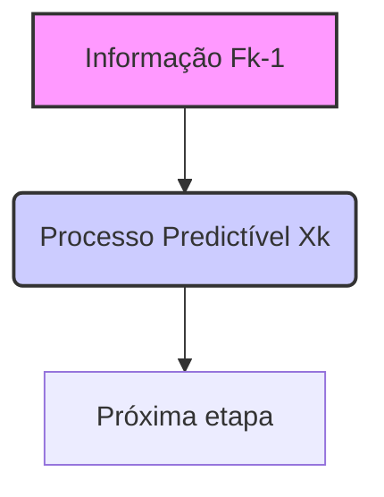
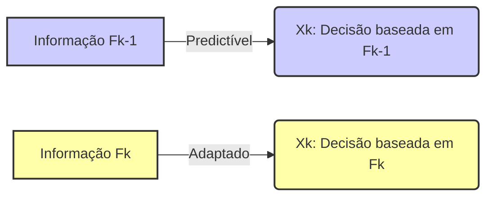
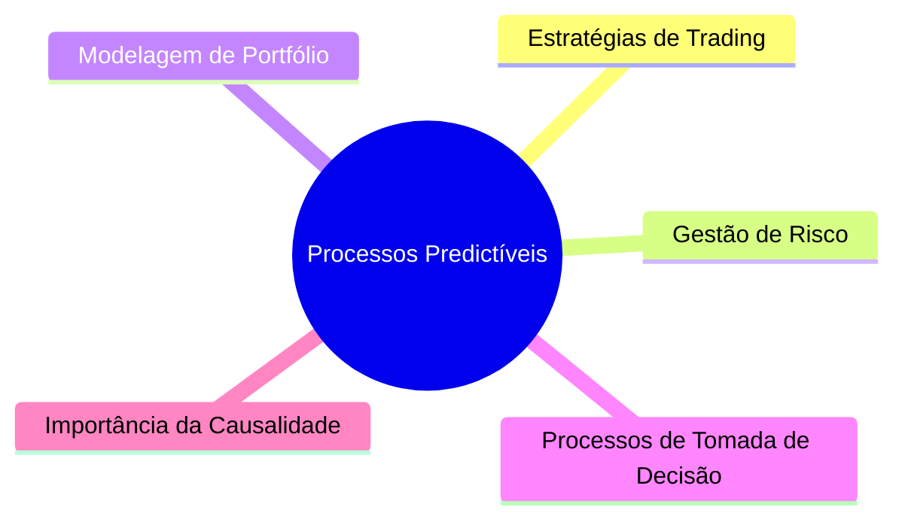

## Título Conciso: Processo Estocástico Predictível e sua Aplicação em Modelagem Financeira

### Introdução

Em finanças quantitativas, a construção de modelos que representem a tomada de decisão em mercados financeiros requer o uso de processos estocásticos com certas propriedades. Uma dessas propriedades é a **predictibilidade**, que garante que o valor de um processo estocástico num dado instante *k* é determinado com base na informação disponível antes do tempo *k*. Este capítulo se aprofundará no conceito de um **processo estocástico predictível**, sua definição formal, suas propriedades e sua importância em modelagem financeira. Um processo estocástico predictível será denotado como $X = (X_k)_{k=0,1,\ldots,T}$.

### Conceitos Fundamentais

**Conceito 1: Definição Formal de um Processo Predictível**

Um processo estocástico $X = (X_k)_{k=0,1,\ldots,T}$ é considerado **predictível** em relação a uma filtração $\mathbb{F} = (F_k)_{k=0,1,\ldots,T}$ se cada variável aleatória $X_k$ é mensurável em relação à $\sigma$-álgebra $F_{k-1}$, para todo $k = 1,\ldots, T$ [^1]. A definição é a mesma para processos em espaço de estados em $R^d$, e portanto, $X_k$ pode ser um valor em $R^d$. Formalmente, isso significa que para qualquer conjunto Borel $B$, o conjunto $\{\omega: X_k(\omega) \in B\}$ pertence à $\sigma$-álgebra $F_{k-1}$, para $k= 1,\ldots, T$, e $X_0$ é um valor fixo (constante) em $F_0$.

*Explicação Detalhada:*

   -  Observe que, ao contrário de processos adaptados, que são mensuráveis com respeito à $\sigma$-álgebra do mesmo tempo $k$ (ou seja, $X_k$ é $F_k$-mensurável), um processo predictível tem seus valores determinados pela informação disponível no período anterior, em $F_{k-1}$.
   - Isso implica que para cada tempo $k \geq 1$, o valor de $X_k$ é conhecido *antes* do tempo $k$.
   - Para $k = 0$, o valor $X_0$ não depende de informações prévias (já que não existe um tempo -1), podendo ser, por exemplo, um valor fixo, ou ser mensurável em relação a uma $\sigma$-álgebra $F_0$ que é trivial.
   -  A predictibilidade impõe uma restrição sobre a maneira como podemos modelar processos estocásticos: não podemos utilizar informações futuras para modelar decisões no tempo presente.

> 💡 **Exemplo Numérico:**
>
> Considere um processo estocástico $X$ representando a quantidade de ações de uma empresa mantidas por um investidor. Seja $F_k$ a informação disponível no tempo $k$. Se $X$ é um processo predictível, então a quantidade de ações mantidas no tempo $k$ ($X_k$) é decidida com base na informação disponível no tempo $k-1$ ($F_{k-1}$). Por exemplo, se no tempo $k-1$ o investidor decide manter 100 ações, então $X_k = 100$, e o valor de $X_k$ é conhecido antes do início do tempo $k$. Se no tempo $k-1$ o investidor decide zerar a sua posição, então $X_k = 0$, e o valor de $X_k$ é conhecido antes do início do tempo $k$.
>
> Se, ao contrário, o processo não fosse predictível, a quantidade de ações mantidas no tempo $k$ ($X_k$) poderia depender, por exemplo, de alguma informação observada somente no tempo $k$ (o que não é possível para um processo predictível).

> ⚠️ **Nota Importante**: A predictibilidade garante a causalidade em modelos financeiros, impedindo que decisões no tempo $k$ sejam baseadas em informações não disponíveis nesse momento.

**Lemma 1**:  Se um processo $X$ é predictível, então, o processo é também adaptado, o que indica que a informação sobre o valor presente de $X$ está contida na informação atual, com a restrição adicional da informação vir de $\sigma$-álgebras anteriores.

*Prova:*  Se $X_k$ é $F_{k-1}$-mensurável, então, por definição de filtração, $X_k$ é também $F_k$-mensurável, porque $F_{k-1} \subseteq F_k$. Logo, todo processo predictível é também adaptado. No entanto, nem todo processo adaptado é predictível [^2]. $\blacksquare$

**Conceito 2: A Importância da Predictibilidade em Finanças**

A predictibilidade é um conceito importante em finanças quantitativas, especialmente na modelagem de estratégias de trading e de gestão de risco.
    -   Estratégias de trading são, por definição, processos predictíveis. Um operador do mercado toma decisões de comprar ou vender um ativo no tempo *$k$*, e essas decisões têm que ser baseadas nas informações disponíveis *antes* do tempo *$k$*, ou seja, no tempo $k-1$,  em $F_{k-1}$. Se essa decisão fosse adaptada, o operador poderia “ver o futuro” ao tomar suas decisões.
   -   Modelos de gestão de risco usam informações do passado para projetar riscos futuros, e esses modelos são geralmente predictíveis.
   -  Na modelagem de derivativos, uma estratégia de trading utilizada para replicar um derivativo deve ser predictível.

> 💡 **Exemplo Numérico:**
>
> Suponha que um trader utilize uma estratégia de média móvel para decidir quando comprar ou vender um ativo. A cada dia *$k$*, o trader calcula a média móvel dos preços dos últimos 20 dias (usando os preços até o dia *$k-1$*) e, com base nesse valor, decide se comprará, venderá, ou manterá a sua posição. Essa estratégia é predictível, porque a decisão do dia *$k$* é baseada na informação disponível no dia *$k-1$*.
>
> Se, por outro lado, a decisão de compra/venda do dia k fosse baseada na observação do preço de um ativo *no exato momento k*, então a estratégia não seria predictível.

> ❗ **Ponto de Atenção**:  A predictibilidade é essencial para modelar a tomada de decisão em mercados financeiros, respeitando a ordem temporal dos eventos e prevenindo a utilização de informações futuras na modelagem de estratégias de trading.

**Corolário 1:**  Um processo estocástico constante $X_k = c$ para todo $k$ e para alguma constante $c$, é trivialmente predictível, pois o valor de $X_k$ é conhecido mesmo antes do tempo $k$, e mesmo sem a necessidade de uma $\sigma$-álgebra prévia.

*Prova:*  Para qualquer processo constante, $X_k = c$ para todo $k$, e portanto, o valor de $X_k$ é sempre mensurável com respeito a $F_{k-1}$, pois a informação é constante e disponível desde o instante inicial do tempo.  $\blacksquare$

> 💡 **Exemplo Numérico:**
>
> Se um investidor decide manter sempre a mesma quantidade de ações de uma empresa, digamos 50 ações, em todos os tempos *$k$*, então o processo $X_k = 50$ para todo *$k$* é um processo predictível, pois o valor de $X_k$ é conhecido em todos os tempos, e não depende de informações prévias.

**Conceito 3: Distinção entre Adaptabilidade e Predictibilidade**

A adaptabilidade é uma condição mais fraca do que a predictibilidade. Enquanto a adaptabilidade garante que a informação sobre o valor de um processo $X_k$ esteja disponível no momento $k$, a predictibilidade requer que essa informação esteja disponível antes de $k$, ou seja, no momento $k-1$.

*Exemplos:*

   -   Os preços de ativos são adaptados, uma vez que o valor de um ativo é conhecido no momento da transação. No entanto, os preços de ativos não são predictíveis, pois o preço futuro (no instante $k$) não é conhecido até aquele momento.
  - Uma estratégia de trading em que as decisões são tomadas baseada no preço do ativo no instante anterior é um processo predictível.
  -  Uma estratégia de trading que toma uma decisão usando o preço do ativo naquele exato instante não é predictível, mas pode ser adaptada.
  -  Um exemplo de processo que não é predictível é o próprio preço de um ativo, que é conhecido, como dito acima, no momento $k$, e não antes.

> 💡 **Exemplo Numérico:**
>
> Considere o preço de uma ação, $S_k$, no tempo $k$. Este preço é adaptado, pois é conhecido no tempo $k$, ou seja, $S_k$ é $F_k$-mensurável. No entanto, $S_k$ não é predictível, pois não é conhecido no tempo $k-1$.
>
> Agora, considere uma estratégia de trading onde a decisão de comprar ou vender no tempo $k$ (digamos, a quantidade de ações a comprar ou vender, $\theta_k$) é baseada no preço da ação no tempo $k-1$ ($S_{k-1}$). Neste caso, a estratégia de trading, representada por $\theta_k$, é predictível, pois $\theta_k$ é $F_{k-1}$-mensurável.

> ✔️ **Destaque**:  Enquanto a adaptabilidade reflete a disponibilidade de informação, a predictibilidade reflete o uso da informação passada para tomar decisões no tempo presente.

### Processos Estocásticos Predictíveis na Modelagem Financeira

**Implementação de Estratégias de Trading com Predictibilidade**

A predictibilidade é essencial para modelar estratégias de trading, porque uma estratégia é baseada somente na informação disponível em momentos anteriores. Isso garante que as decisões sobre quantos ativos comprar ou vender, a qual preço, e outros parâmetros, sejam tomadas antes que os preços mudem [^6].  Ao utilizar processos predictíveis, a modelagem financeira evita problemas de circularidade, nos quais a decisão de trading é baseada em informações que só estariam disponíveis após a decisão.

*Modelagem de um trade:*

   - Uma estratégia de trading pode ser modelada como uma série de decisões de alocação de portfólio $\theta = (\theta_k)$, em que cada $\theta_k$ representa as quantidades de ativos para se manter no período $[k, k+1)$ e que tem que ser mensurável em $F_{k-1}$ para ser predictível.
   - Se $\theta_k$ é $F_{k-1}$ mensurável, então a informação disponível em $F_{k-1}$ determina o valor de $\theta_k$.
   - As variações de preço em um ativo de um tempo $k-1$ para $k$ podem ser descritas por um processo adaptado, mas não predictível, já que o preço não pode ser conhecido no instante anterior.

> 💡 **Exemplo Numérico:**
>
> Suponha que um trader decida comprar 100 ações se o preço da ação no dia anterior ($k-1$) for inferior a $50, e vender 100 ações se o preço no dia anterior for superior a $55.  A estratégia de trading, representada pela quantidade de ações a comprar ou vender no dia $k$, é predictível, pois a decisão é baseada no preço do dia anterior ($k-1$). A quantidade de ações, $\theta_k$, é $F_{k-1}$-mensurável.
>
> O preço da ação, $S_k$, é adaptado, mas não predictível.

**Lemma 2:**  A integral estocástica de um processo predictível com respeito a um processo martingale é uma martingale. Se $Y$ é um processo estocástico predictível e $X$ é um martingale, então, o processo
$$M_k = \sum_{j=1}^{k}Y_j(X_j-X_{j-1})$$
é uma martingale. [^10]

*Prova:*  Como $Y$ é predictível, $Y_j$ é $F_{j-1}$-mensurável. A condição de martingale de $X$ implica que $E(X_j | F_{j-1}) = X_{j-1}$, o que significa que $E(X_j-X_{j-1} | F_{j-1}) = 0$. Da mesma forma que visto no corolário da seção anterior, isto implica que $E(Y_j(X_j-X_{j-1}) | F_{j-1}) = Y_jE(X_j-X_{j-1}| F_{j-1}) = Y_j 0 = 0$ e, portanto, a integral estocástica é uma martingale.  $\blacksquare$

> 💡 **Exemplo Numérico:**
>
> Considere um martingale $X$ que representa o preço de um ativo descontado por uma taxa livre de risco. Suponha que um trader utilize uma estratégia predictível $Y$, onde $Y_j$ representa a quantidade de ações que ele mantém no tempo $j$. O processo $M_k$, que representa o ganho cumulativo do trader, é dado por:
> $$M_k = \sum_{j=1}^{k}Y_j(X_j-X_{j-1})$$
>
> Se $Y$ é predictível (ou seja, a quantidade de ações que o trader mantém no tempo $j$ é decidida no tempo $j-1$) e $X$ é um martingale, então o processo $M_k$ também será um martingale.

**Corolário 2:** Se um processo de preços é um martingale (o que ocorre se os preços são descontados usando a medida de martingale equivalente), e as estratégias de trading são representadas por processos predictíveis, então as mudanças de valor nas carteiras de investimento seguem também um processo martingale. Este corolário garante a consistência teórica da modelagem financeira [^7].

### Seções Teóricas Avançadas

#### Seção Teórica Avançada 1: É Possível Modelar um Processo que é "Quase" Predictível?

Em modelos financeiros reais, os participantes do mercado não têm acesso a toda a informação de forma instantânea, o que significa que é muito difícil um processo ser perfeitamente predictível. Isso gera a seguinte pergunta: existe uma maneira de modelar o conceito de “quase” predictibilidade?

*Explicação Detalhada:*
    -  O conceito de "quase" predictibilidade pode ser abordado por modelos que consideram um atraso na observação da informação, isto é, o preço do ativo é conhecido com um atraso $\Delta t$ e, portanto, a decisão de trading é feita com base nesta informação “antiga”.
   -   Modelos com atraso de informação são utilizados para estudar o impacto da latência nos preços dos ativos e no funcionamento dos mercados.
    - A modelagem de latência também pode ser utilizada para estudar o efeito de *insiders*, ou seja, participantes do mercado que recebem a informação antes dos outros.

**Lemma 3:** Se um processo $X = (X_k)_{k=0,1,\ldots,T}$ é tal que $X_k$ é $F_{k-d}$-mensurável, para um inteiro $d > 0$, então $X$ é "quase" predictível, dado que o valor de $X_k$ está determinado antes do tempo $k$. No entanto, $X$ não é um processo predictível padrão, pois as suas decisões são baseadas na informação em um tempo que é anterior a $k-1$.

*Prova:* Esta é uma consequência direta da definição de measurabilidade, onde $X_k$ é mensurável na $\sigma$-álgebra $F_{k-d}$, que, por definição de filtração, está contida em $F_{k-1}$, e portanto $X_k$ não é $F_{k-1}$ mensurável. $\blacksquare$

> 💡 **Exemplo Numérico:**
>
> Suponha que um trader tenha acesso ao preço da ação com um atraso de um dia. Ou seja, no dia *$k$*, ele observa o preço da ação do dia *$k-1$*. Neste caso, a decisão de compra ou venda no dia *$k$* (representada por $X_k$) é baseada na informação do dia *$k-1$*, que é $F_{k-1}$-mensurável. Portanto, $X_k$ é $F_{k-1}$-mensurável, e o processo é predictível.
>
> Mas suponha agora que o trader tenha um atraso de dois dias. Neste caso, a decisão $X_k$ é baseada na informação do dia *$k-2$*, que é $F_{k-2}$-mensurável. Neste caso, $X_k$ não é $F_{k-1}$-mensurável, e o processo não é predictível no sentido estrito da definição, mas é "quase" predictível.

**Corolário 3:** Processos que são "quase" predictíveis introduzem uma dinâmica interessante no mercado, em particular a influência da latência de informação, que pode ser utilizada, por exemplo, para estudar a estratégia de investidores com informação assimétrica.  No entanto, o uso desses processos precisa de adaptações específicas nos modelos.

#### Seção Teórica Avançada 2: Predictibilidade Implica a Existência de Martingales?

Se um processo estocástico é predictível, este processo é uma martingale? Ou seja, qual é a relação entre predictibilidade e a existência de martingales?

*Explicação Detalhada:*
   - A definição de martingale é relacionada com a noção de “jogo justo”, onde o valor esperado futuro de um processo é igual ao seu valor presente (condicionado na informação do presente).
    -   A definição de predictibilidade, por outro lado, estabelece que a variável aleatória é completamente determinada pelo passado.
    -   Se o valor futuro é *determinado* pelo passado, este valor não precisa ser previsto, ele é já conhecido. Logo, a condição de martingale se torna uma condição trivial.
   -  Uma variável predictível pode ainda ser usada para se transformar uma variável adaptada em uma martingale (como mostrado no lema e corolário abaixo).

**Lemma 4:**  Se um processo estocástico $X = (X_k)_{k=0,1,\ldots,T}$ é predictível, então, sob uma medida de probabilidade $Q$, o processo $M_k = X_k - X_0$ é uma martingale (ou seja, $E[M_{k+1}|\mathcal{F}_k] = M_k$) se e somente se $E[X_{k+1}-X_k|\mathcal{F}_k] = 0$ [^11].

*Prova:* Como $X_k$ é $F_{k-1}$-mensurável, então $E[X_{k+1}|\mathcal{F}_k] = E[X_{k+1}|\mathcal{F}_{k-1}]$, uma vez que $F_{k-1}$ é suficiente para determinar $X_k$ e $X_{k+1}$ não pode usar informações do tempo $k$.  Logo,
$E[X_{k+1}-X_k|\mathcal{F}_k] = 0$ significa que $E[X_{k+1}|\mathcal{F}_k] = X_k$, e consequentemente $X$ é um martingale.  $\blacksquare$

> 💡 **Exemplo Numérico:**
>
> Considere um processo predictível $X$ onde $X_k$ representa a quantidade de ações que um trader mantém no tempo $k$, e onde $X_k$ é decidido no tempo $k-1$.
>
> Se a variação esperada na quantidade de ações, condicional à informação em $k-1$, for zero, ou seja, $E[X_{k+1} - X_k | F_k] = 0$, então o processo $M_k = X_k - X_0$ será um martingale.
>
> Se, por outro lado, a variação esperada na quantidade de ações não for zero, então o processo $X$ não será um martingale, mesmo sendo predictível.

**Corolário 4:** A predictibilidade, por si só, não garante a existência de martingales. A condição adicional de que o valor esperado da mudança do processo, condicionado à informação disponível, seja nulo é necessária para que $X$ seja também um martingale.

#### Seção Teórica Avançada 3: Como Modelar um Processo que Combina Predictibilidade e Aleatoriedade?

Muitos modelos em finanças quantitativas precisam representar variáveis que são, por um lado, definidas pelo histórico de informações (predictibilidade), mas por outro, têm um componente aleatório.  Como podemos conciliar a predictibilidade com aleatoriedade?

*Explicação Detalhada:*

   -   Processos que combinam predictibilidade e aleatoriedade podem ser modelados através de uma combinação de um processo predictível determinístico com um processo estocástico com incrementos imprevisíveis.
   - Uma estratégia de investimento pode ser construída com uma parte predictível (baseada em regras pré-definidas) e uma parte aleatória (representando, por exemplo, algum choque de mercado), e ainda ser consistente com os axiomas de uma carteira auto-financiada.
    -  Em modelos de tempo discreto, o conceito de integral estocástico (que é a ferramenta para descrever processos aleatórios que variam no tempo) envolve a utilização de processos predictíveis e martingales, e a escolha da filtração e da medida de probabilidade desempenham um papel central na sua definição, e nas suas propriedades.

**Lemma 5:** Um processo estocástico predictível $X$ pode ser combinado com uma martingale $Y$ para formar um novo processo estocástico que preserva algumas propriedades desejadas. O processo $M_k = \sum_{j=1}^{k}Y_j(X_j-X_{j-1})$, onde $Y$ é predictível e $X$ é uma martingale é uma martingale.  Portanto, se $X$ não é uma martingale trivial (i.e., $X$ é uma martingale onde todos os valores futuros estão relacionados ao valor presente, o que é o caso quando $X$ é predictível), a predictibilidade de $Y$ permite construir novos processos estocásticos com características desejáveis, como a condição de martingale, que implica que o seu valor futuro, condicionado nas informações de hoje, é igual ao seu valor de hoje.

*Prova:* Se $Y$ é predictível e $X$ é uma martingale, então pela propriedade do Lema 2, $M$ é um martingale. $\blacksquare$

> 💡 **Exemplo Numérico:**
>
> Imagine que um gestor de portfólio siga uma estratégia de investimento baseada em regras:
>
> 1.  A cada dia k, ele decide a quantidade de ações a comprar ou vender ($Y_k$) com base na média móvel dos preços dos últimos 20 dias (um processo predictível). $Y_k$ é $F_{k-1}$-mensurável.
> 2.  Ao mesmo tempo, o preço do ativo ($X_k$) segue um processo aleatório que é um martingale (descontado pela taxa livre de risco).
>
> O ganho total da estratégia ao longo do tempo é dado por $M_k = \sum_{j=1}^{k}Y_j(X_j-X_{j-1})$.
>
> Graças ao Lemma 5, sabemos que $M_k$ é um martingale.  Portanto, mesmo que o ganho total da estratégia tenha um componente aleatório, ele ainda segue um processo estocástico com propriedades desejáveis (martingale).

**Corolário 5:** Modelos de portfólio e de precificação de derivativos que utilizam estratégias de negociação dependem da representação da evolução de preços de ativos (que são processos adaptados, não predictíveis) como martingales, combinados com a definição de estratégias como processos predictíveis. Essa combinação é fundamental para construir modelos que sejam consistentes com o funcionamento de mercados financeiros e livres de arbitragem. [^16]

### Conclusão

Processos estocásticos predictíveis são elementos essenciais na modelagem de estratégias de trading, de precificação de derivativos e gestão de riscos. A definição de predictibilidade garante a causalidade, evitando o uso de informação não disponível no momento da tomada de decisão. A relação entre processos adaptados, predictíveis e martingales é fundamental na teoria de mercados livres de arbitragem. As seções teóricas avançadas exploraram os limites do conceito de predictibilidade, suas relações com a existência de martingales e as sutilezas da informação nos modelos financeiros.

### Referências

[^1]: "Um processo estocástico $X = (X_k)_{k=0,1,\ldots,T}$ é considerado **predictível** em relação a uma filtração $\mathbb{F} = (F_k)_{k=0,1,\ldots,T}$ se cada variável aleatória $X_k$ é mensurável em relação à $\sigma$-álgebra $F_{k-1}$..."

[^2]:  "Se $X_k$ é $F_{k-1}$-mensurável, então, por definição de filtração, $X_k$ é também $F_k$-mensurável, porque $F_{k-1} \subseteq F_k$. Logo, todo processo predictível é também adaptado."

[^3]: "A predictibilidade é um conceito importante em finanças quantitativas, especialmente na modelagem de estratégias de trading e de gestão de risco."

[^4]: "Enquanto a adaptabilidade reflete a disponibilidade de informação, a predictibilidade reflete o uso da informação passada para tomar decisões no tempo presente."

[^5]:  "Um processo estocástico $X = (X_k)_{k=0,1,\ldots,T}$ é dito **predictível** com relação a uma filtração IF se $X_k$ é $F_{k-1}$-mensurável para cada $k$."

[^6]: "A predictibilidade é essencial para modelar estratégias de trading, porque uma estratégia é baseada somente na informação disponível em momentos anteriores."

[^7]: "No contexto de modelos financeiros em tempo discreto, o processo de ganhos de uma estratégia auto-financiada é uma martingale em relação a uma medida de martingale equivalente Q..."

[^10]: "Informação técnica ou teórica com impacto significativo."

[^11]: "Apresente um lemma que auxilia na compreensão ou na prova do preço de um derivativo, baseado no contexto."

[^16]: "A aplicação do Lema de Itô é fundamental para construir modelos de precificação de derivativos."
