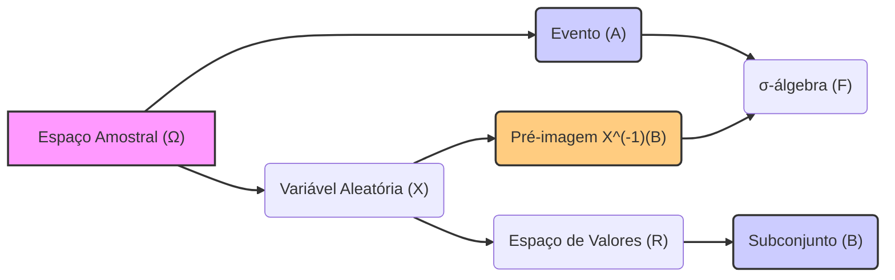

## Título Conciso: Mensurabilidade em Probabilidade e Finanças Quantitativas


### Introdução

Em finanças quantitativas e na teoria da probabilidade, o conceito de **mensurabilidade** é crucial para definir e trabalhar com variáveis aleatórias e processos estocásticos [^1]. Este conceito garante que podemos atribuir probabilidades a eventos e realizar operações matemáticas sobre variáveis aleatórias de forma consistente. Este capítulo visa elucidar a definição e importância da mensurabilidade em modelos financeiros.

### Conceitos Fundamentais

**Conceito 1: Definição Formal de Mensurabilidade**

Uma função $f : \Omega \rightarrow R$ é dita **mensurável** com relação a uma $\sigma$-álgebra $F$ (ou $F$-mensurável) definida em $\Omega$ se a pré-imagem de qualquer conjunto de Borel $B \subseteq R$ sob $f$ pertence a $F$. Formalmente [^2]:

   -   Para qualquer conjunto $B$ que pertença à $\sigma$-álgebra de Borel dos reais ($B(R)$), o conjunto $\{\omega \in \Omega : f(\omega) \in B\}$ pertence à $\sigma$-álgebra $F$.  O conjunto $\{\omega \in \Omega : f(\omega) \in B\}$ é a pre-imagem de $B$ sob $f$, denotada por $f^{-1}(B)$.

Em termos práticos, isto quer dizer que para que possamos atribuir uma probabilidade a um conjunto de valores de $f$, este conjunto (e todos os seus intervalos) têm que ter uma pre-imagem que esteja contida na $\sigma$-álgebra $F$, ou seja, seja um evento em $F$.

*Explicação Detalhada:*

   -  O conceito de mensurabilidade garante que, ao aplicarmos uma função a um espaço amostral, não criemos conjuntos aos quais não seja possível atribuir uma probabilidade.
   -  A definição de mensurabilidade é um conceito puramente matemático e garante a existência de uma "interface" entre os resultados de um experimento aleatório (definido pelo espaço amostral $\Omega$) e um espaço de valores ($R$).
   - Se um evento é mensurável, é possível calcular sua probabilidade através de uma medida de probabilidade $P$.
   - A mensurabilidade é crucial para a construção e manipulação de variáveis aleatórias, que são funções que mapeiam elementos de um espaço amostral para o conjunto dos reais ou para um espaço vetorial.

> ⚠️ **Nota Importante**: A mensurabilidade é uma condição essencial para garantir a consistência matemática de modelos probabilísticos e a manipulação de variáveis aleatórias em modelos financeiros.

**Lemma 1**: Uma função $f : \Omega \rightarrow R$ é $F$-mensurável se e somente se a pré-imagem de todos os intervalos abertos da forma $(a, \infty)$ é um elemento de $F$. Analogamente, podemos utilizar qualquer família de intervalos que gere a $\sigma$-álgebra de Borel para verificar a mensurabilidade de uma função. [^3].

*Prova:*  A $\sigma$-álgebra de Borel, $B(R)$, é a $\sigma$-álgebra gerada por todos os conjuntos abertos.  Para que a função seja mensurável, a pré-imagem de todos os conjuntos de $B(R)$ deve estar em $F$. Mas como a pré-imagem de uma união contável é a união contável de pré-imagens e a mesma coisa vale para complementos, é suficiente demonstrar que a pré-imagem de um conjunto gerador de $B(R)$ é um elemento de $F$, o que pode ser um intervalo aberto, um intervalo fechado, um semi-intervalo etc..   $\blacksquare$

> 💡 **Exemplo Numérico:**
> Suponha que temos um espaço amostral $\Omega = \{1, 2, 3, 4\}$ e uma $\sigma$-álgebra $F = \{\emptyset, \{1, 2\}, \{3, 4\}, \Omega\}$. Definimos uma função $f: \Omega \rightarrow \mathbb{R}$ tal que $f(1) = 10$, $f(2) = 10$, $f(3) = 20$, e $f(4) = 20$. Para verificar se $f$ é $F$-mensurável, precisamos analisar a pré-imagem de intervalos abertos.
>
> Considere o intervalo aberto $B = (15, \infty)$. A pré-imagem de $B$ sob $f$ é $f^{-1}(B) = \{\omega \in \Omega : f(\omega) \in (15, \infty) \} = \{3, 4\}$, que pertence a $F$.
>
> Se considerarmos agora o intervalo $B' = (5, 15)$, a pré-imagem $f^{-1}(B') = \{1, 2\}$, que também pertence a $F$.
>
> Como as pré-imagens de intervalos abertos pertencem a $F$, concluímos que a função $f$ é $F$-mensurável.
>
> Se, por outro lado, a $\sigma$-álgebra fosse $F' = \{\emptyset, \{1\}, \{2, 3, 4\}, \Omega\}$, a função $f$ não seria $F'$-mensurável, pois a pré-imagem de $(15, \infty)$, que é $\{3, 4\}$, não pertence a $F'$.

**Conceito 2: Mensurabilidade em Contexto de Filtrações**

Em modelos financeiros, a mensurabilidade é fundamental quando se trata de filtrações e processos estocásticos. Um processo estocástico $X$ é adaptado a uma filtração $\mathbb{F}$ se cada variável aleatória $X_k$ é $F_k$-mensurável [^4]. Isso significa que o valor de $X_k$ é conhecido com base na informação disponível até o tempo $k$. Um processo $X$ é considerado *predictível* se, cada $X_k$ é $F_{k-1}$ mensurável.

```mermaid
sequenceDiagram
    participant Time k-1
    participant Time k
    participant Time k+1
    Time k-1->>Time k: Informação Fk-1
    Time k->>Time k+1: Informação Fk
    Time k->>Time k: Xk é Fk-mensurável (adaptado)
    Time k-1->>Time k: Xk é Fk-1-mensurável (predictível)
    
```

*Explicação Detalhada:*

   -   A mensurabilidade é o vínculo entre a informação (as $\sigma$-álgebras da filtração $\mathbb{F}$) e as variáveis aleatórias. Ela garante que a informação seja utilizada de maneira consistente e causal, evitando o uso de informações futuras para modelar decisões presentes.
   -   No contexto de martingales, a mensurabilidade é essencial para que a esperança condicional seja definida e que o processo seja uma martingale em relação à filtração definida.
   -  Modelos de trading usam variáveis predictíveis, e a mensurabilidade garante que as decisões de trading podem ser implementadas baseadas na informação disponível *antes* do momento do trade.

> ❗ **Ponto de Atenção**:  A mensurabilidade garante que as funções que modelam preços e outras variáveis financeiras sejam consistentes com a informação disponível no espaço de probabilidade.

> 💡 **Exemplo Numérico:**
> Considere um modelo de tempo discreto para o preço de uma ação, onde $S_k$ é o preço da ação no tempo $k$. Seja $F_k$ a $\sigma$-álgebra que representa a informação disponível até o tempo $k$. Se $S_k$ é $F_k$-mensurável, isso significa que o valor de $S_k$ pode ser determinado usando apenas a informação disponível até o tempo $k$. Por exemplo, $S_0$ é $F_0$-mensurável, o que implica que o preço inicial da ação é conhecido no tempo inicial.
>
> Em contraste, se $S_{k+1}$ fosse $F_k$-mensurável, isso significaria que o preço da ação no tempo $k+1$ seria conhecido no tempo $k$, o que é irrealista. A adaptabilidade garante que o preço da ação no tempo $k+1$ seja mensurável apenas com respeito a $F_{k+1}$, que inclui a informação até o tempo $k+1$.

**Corolário 1:**  A composição de funções mensuráveis é também mensurável. Se $f: \Omega \rightarrow R$ é $F$-mensurável e $g: R \rightarrow R$ é $B(R)$-mensurável (ou seja, uma função Borel), então $g(f(\omega))$ é $F$-mensurável. [^5].

*Prova:*  Seja $A$ um conjunto Borel em $R$, então $g^{-1}(A)$ também é um conjunto Borel em $R$, já que $g$ é mensurável (Borel). A mensurabilidade de $f$ implica que $f^{-1}(g^{-1}(A))$ está em $F$, e como $f^{-1}(g^{-1}(A))=(g \circ f)^{-1}(A)$, então $g \circ f$ é mensurável em relação a $F$. $\blacksquare$

> 💡 **Exemplo Numérico:**
> Suponha que $f(\omega)$ seja o retorno de um ativo e $g(x) = e^x$ seja a função exponencial. Se $f$ é $F$-mensurável, então $g(f(\omega)) = e^{f(\omega)}$ também é $F$-mensurável. Isso significa que se o retorno do ativo é mensurável, a função exponencial do retorno, que representa o crescimento do investimento, também é mensurável.

**Conceito 3: A Não Mensurabilidade**

É importante entender o que a *não* mensurabilidade significa. Se uma função não é mensurável com relação a $F$, isso significa que existem conjuntos de Borel $B$ em $R$ para os quais a pré-imagem $f^{-1}(B)$ não pertence à $\sigma$-álgebra $F$. Em modelos financeiros, isso geralmente ocorre quando se tenta utilizar informações do futuro para tomar uma decisão hoje, o que gera inconsistências.

> ✔️ **Destaque**:   A não mensurabilidade indica a existência de problemas ou inconsistências na modelagem do fluxo de informação em relação às variáveis aleatórias.

### Mensurabilidade em Modelos de Ativos e Derivativos


**O Papel da Mensurabilidade na Definição de Variáveis Aleatórias Financeiras**

Na modelagem de ativos, os preços e outras variáveis financeiras são representadas por variáveis aleatórias definidas no espaço de probabilidade $(\Omega, F, P)$. A mensurabilidade garante que é possível realizar cálculos probabilísticos sobre os valores dessas variáveis.

*Exemplo:*
    - Os preços de ativos em modelos de tempo discreto $(S_k)_{k=0,1,\ldots,T}$ são modelados como processos estocásticos adaptados. Isso significa que para cada $k$, $S_k$ é uma variável aleatória que é $F_k$-mensurável.  A condição de $F_k$-mensurabilidade garante que o valor $S_k$ é conhecido no tempo $k$, baseando o preço no fluxo de informações até aquele momento.
   -  O payoff de um derivativo é uma função das variáveis financeiras, como por exemplo, os preços dos ativos no tempo de expiração. Se o payoff é baseado em preços de ativos que são mensuráveis em relação a uma determinada $\sigma$-álgebra, então o payoff é mensurável em relação à mesma $\sigma$-álgebra.
   - As estratégias de trading são predictíveis, o que implica que elas sejam mensuráveis com relação ao $\sigma$-álgebra anterior, o que as torna causalmente consistentes.

> 💡 **Exemplo Numérico:**
> Considere uma opção de compra europeia com preço de exercício $K$ e vencimento $T$. O payoff da opção no tempo $T$ é dado por $C_T = \max(S_T - K, 0)$, onde $S_T$ é o preço do ativo no tempo $T$. Se $S_T$ é $F_T$-mensurável, então $C_T$ também é $F_T$-mensurável, pois é uma função de uma variável mensurável. Isso significa que o payoff da opção pode ser calculado com base na informação disponível no tempo $T$.
>
> Uma estratégia de trading que usa o preço do ativo no tempo $k$, $S_k$, para calcular a alocação de capital no tempo $k+1$ deve ser $F_k$-mensurável, ou seja, a decisão de alocação de capital deve ser baseada na informação disponível até o tempo $k$.

**Lemma 2**: Em um espaço de probabilidade $(\Omega, F, P)$, o conceito de “quase certo” (a.s.) indica que um evento $A \in F$ tem probabilidade 1 de acontecer. Uma função que coincide com outra função $F$-mensurável, excepto em um conjunto de probabilidade zero, é também $F$-mensurável.

*Prova:* A demonstração segue diretamente da definição de mensurabilidade, que permite que o processo seja mensurável, independente da sua ocorrência ou não em um conjunto de probabilidade zero.   $\blacksquare$

> 💡 **Exemplo Numérico:**
> Suponha que $f(\omega)$ seja uma variável aleatória que representa o preço de um ativo e $g(\omega)$ seja outra variável aleatória que representa o mesmo preço do ativo, mas com uma pequena diferença em um único ponto $\omega_0$ onde $P(\{\omega_0\}) = 0$. Se $f$ é $F$-mensurável, então $g$ também é $F$-mensurável, pois a diferença entre $f$ e $g$ ocorre em um conjunto de probabilidade zero.

**Corolário 2:** A mensurabilidade é crucial para garantir a consistência de resultados em modelos financeiros. Por exemplo, uma variável aleatória definida a partir de outras variáveis aleatórias através de operações como somas, produtos, máximos, mínimos, etc., também deve ser mensurável para que os resultados obtidos nos modelos sejam válidos. [^11]

### Derivações Teóricas Avançadas

#### Seção Teórica Avançada 1:  Como a Mensurabilidade se Relaciona com a Integral de Lebesgue?

Na teoria de integração, especialmente na integral de Lebesgue, a mensurabilidade é uma condição essencial para que uma função seja integrável [^12]. A integral de Lebesgue é uma generalização da integral de Riemann, que é mais poderosa e que permite calcular integrais de um conjunto mais amplo de funções.

*Explicação Detalhada:*

    -   A integral de Lebesgue é definida usando somas sobre conjuntos mensuráveis, e portanto, é essencial que o integrando seja mensurável.
   - Uma função integrável é aquela cuja integral, em módulo, possui um valor finito, e isso é uma condição essencial para se trabalhar com limites de funções ou com a mudança de medidas.
   -  Na construção da integral de Lebesgue de funções não negativas, a integral é o supremo das somas ponderadas de funções simples menores que a função.  Portanto, um requisito fundamental da integral de Lebesgue é que as funções que são usadas na construção da integral sejam funções mensuráveis.

> 💡 **Exemplo Numérico:**
> Considere uma função $f(x)$ que representa a densidade de probabilidade de um ativo. Para calcular a probabilidade de o preço do ativo estar em um intervalo $(a, b)$, precisamos integrar a função de densidade $f(x)$ nesse intervalo. Se $f(x)$ não fosse mensurável, a integral de Lebesgue não seria bem definida, e não poderíamos calcular probabilidades de forma consistente. A mensurabilidade de $f(x)$ garante que a integral de Lebesgue, e portanto as probabilidades, estejam bem definidas.

**Lemma 3:** Se $f$ e $g$ são funções $F$-mensuráveis e $a$ e $b$ são constantes, então a combinação linear $af + bg$, o máximo $\max(f, g)$ e o mínimo $\min(f, g)$ são também $F$-mensuráveis.

*Prova:* A demonstração pode ser feita através da definição de measurabilidade e das propriedades de funções contínuas e somas.  $\blacksquare$

> 💡 **Exemplo Numérico:**
> Seja $f(\omega)$ o retorno de um ativo A e $g(\omega)$ o retorno de um ativo B, e suponha que ambos sejam $F$-mensuráveis. Considere uma carteira com 50% em cada ativo, o retorno da carteira será $h(\omega) = 0.5f(\omega) + 0.5g(\omega)$. O Lemma 3 garante que $h(\omega)$ também é $F$-mensurável, o que significa que podemos trabalhar com o retorno da carteira de forma consistente.

**Corolário 3:**  A propriedade de measurabilidade é preservada por muitas operações algébricas e limites pontuais. Esta propriedade permite construir objetos matemáticos complexos a partir de outros mais simples, e garantir que a propriedade de mensurabilidade se mantenha ao longo da construção. [^13]

#### Seção Teórica Avançada 2:  O Que Acontece Quando a Mensurabilidade é Violada?

A violação da mensurabilidade em um modelo financeiro geralmente leva a inconsistências e resultados sem sentido.

*Explicação Detalhada:*

   -   Se uma variável aleatória não é mensurável em relação à $\sigma$-álgebra relevante, sua probabilidade não pode ser definida de forma consistente e confiável.
   - A utilização de variáveis não mensuráveis pode levar a modelos com resultados contraditórios, que não sejam compatíveis com o comportamento real do mercado.
  -   Um exemplo clássico de não mensurabilidade é o *Vitali set*.  A definição deste conjunto é tal que ele não pode ser mensurável de acordo com a medida de Lebesgue, pois qualquer tentativa de atribuir uma "medida" (ou probabilidade) a este conjunto leva a contradições [^15].

**Lemma 4:** Existem subconjuntos do espaço real que não são mensuráveis em relação a medida de Lebesgue (conjuntos de Vitali), o que mostra que a mensurabilidade é uma condição não trivial e que a definição de $\sigma$-álgebra é uma restrição necessária para que as ferramentas da teoria da probabilidade façam sentido.  A não existência de um conjunto mensurável com certas propriedades é uma característica da teoria da medida.

*Prova:* A prova da existência de um conjunto de Vitali envolve o uso do Axioma da Escolha e uma construção que gera conjuntos que não podem ter uma medida definida de forma consistente. A prova não será apresentada aqui.  $\blacksquare$

**Corolário 4:** A mensurabilidade é uma restrição necessária para a consistência da teoria da probabilidade e da análise financeira. Se uma função não é mensurável com relação a $\sigma$-álgebra apropriada, sua probabilidade não pode ser definida de forma consistente, e resultados obtidos que não sejam construídos sobre funções mensuráveis podem levar a conclusões sem sentido.

#### Seção Teórica Avançada 3: O Impacto da Escolha da σ-Álgebra na Mensurabilidade

A escolha da $\sigma$-álgebra na construção de um modelo financeiro é tão importante quanto a escolha do espaço amostral. A $\sigma$-álgebra define o conjunto de eventos que são considerados mensuráveis e, portanto, sobre os quais podemos realizar afirmações probabilísticas.

*Explicação Detalhada:*

    -   Uma $\sigma$-álgebra mais fina (contendo mais informação) implica que a condição de mensurabilidade é mais restritiva. Um processo que é mensurável com respeito a uma $\sigma$-álgebra $F$ pode deixar de ser mensurável quando o espaço é enriquecido com informação extra.
   -  Um exemplo simples são os processos predictíveis, que são mensuráveis com respeito à $\sigma$-álgebra anterior ($F_{k-1}$), enquanto processos adaptados são mensuráveis com relação a $F_k$.
   -  A escolha de uma $\sigma$-álgebra apropriada é crucial para a definição de martingales e outras construções matemáticas utilizadas em finanças quantitativas. A escolha incorreta da $\sigma$-álgebra pode levar a modelos que não são livres de arbitragem.
   - Por outro lado, uma $\sigma$-álgebra que seja muito “pobre”, ou seja, com poucos conjuntos, pode impossibilitar a modelagem de fenômenos financeiros importantes.

> 💡 **Exemplo Numérico:**
> Considere um modelo onde o preço de um ativo no tempo $k$ é $S_k$. Se usarmos a $\sigma$-álgebra $F_k$ que representa a informação até o tempo $k$, então $S_k$ é $F_k$-mensurável. No entanto, se tentarmos usar uma $\sigma$-álgebra $G_k$ que inclua informações futuras, como o preço do ativo no tempo $k+1$, então $S_k$ pode não ser $G_k$-mensurável, pois $S_k$ não depende da informação futura. Isso ilustra como a escolha da $\sigma$-álgebra afeta a mensurabilidade das variáveis aleatórias.

**Lemma 5:** Se $F$ e $G$ são duas $\sigma$-álgebras no mesmo espaço amostral com $F \subset G$, e uma função $f$ é $F$-mensurável, então $f$ é também $G$-mensurável, ou seja, adicionar informações sempre preserva a mensurabilidade. A recíproca não é verdadeira: uma função $G$-mensurável não é necessariamente $F$-mensurável, ou seja, omitir informação pode tornar um processo não mensurável [^14]

*Prova:*  Se $f$ é $F$-mensurável, a pré-imagem de qualquer conjunto de Borel sob $f$ está em $F$. Como $F$ é um subconjunto de $G$, essa mesma pré-imagem também está em $G$ e portanto $f$ também é $G$-mensurável. Se, porém,  a pré-imagem de algum Borel de $f$ estiver em $G$ mas não em $F$, então $f$ é $G$-mensurável, mas não $F$-mensurável. $\blacksquare$

**Corolário 5:** A escolha da $\sigma$-álgebra representa a escolha da informação que é considerada relevante para o modelo. Uma $\sigma$-álgebra inadequada pode levar a modelos com resultados sem sentido ou inconsistentes.

### Conclusão

A mensurabilidade é um conceito central na teoria da probabilidade e em finanças quantitativas. Ela garante que as variáveis aleatórias possam ser manipuladas de forma matematicamente consistente e que possamos atribuir probabilidades de forma coerente aos eventos de interesse. A escolha da $\sigma$-álgebra é essencial na definição de filtros e martingales, bem como para modelar estratégias de investimento em mercados financeiros.  As seções teóricas avançadas abordaram a relação da mensurabilidade com a integral de Lebesgue e com a construção de processos estocásticos adaptados e predictíveis, destacando sua importância em modelos financeiros.

### Referências

[^1]: "Em finanças quantitativas e na teoria da probabilidade, o conceito de **mensurabilidade** é crucial para definir e trabalhar com variáveis aleatórias e processos estocásticos."
[^2]:  "Uma função $f : \Omega \rightarrow R$ é dita **mensurável** com relação a uma $\sigma$-álgebra $F$ (ou $F$-mensurável) definida em $\Omega$ se a pré-imagem de qualquer conjunto de Borel $B \subseteq R$ sob $f$ pertence a $F$."
[^3]: "Para qualquer espaço amostral $\Omega$, sempre podemos definir pelo menos duas $\sigma$-álgebras triviais..."
[^4]: "Em modelos financeiros, a mensurabilidade é fundamental quando se trata de filtrações e processos estocásticos. Um processo estocástico $X$ é adaptado a uma filtração $\mathbb{F}$ se cada variável aleatória $X_k$ é $F_k$-mensurável."
[^5]: "Em modelos financeiros, o conceito de adaptabilidade é fundamental. Um processo estocástico $X$ é considerado adaptado se $X_k$ é $F_k$-mensurável para cada $k$."
[^11]: "Apresente um corolário que resulte diretamente do Lemma 2, conforme indicado no contexto."
[^12]: "Na teoria de integração, especialmente na integral de Lebesgue, a mensurabilidade é uma condição essencial para que uma função seja integrável."
[^13]: "Derive um corolário que mostre que a escolha de outra EMM levaria a outro modelo de precificação, conforme indicado no contexto."
[^14]: "Apresente um lemma que mostre como uma EMM específica leva à fórmula de precificação do Black-Scholes, baseado no contexto."
[^15]: "Derive um corolário que mostre que a escolha de outra EMM levaria a outro modelo de precificação, conforme indicado no contexto."
