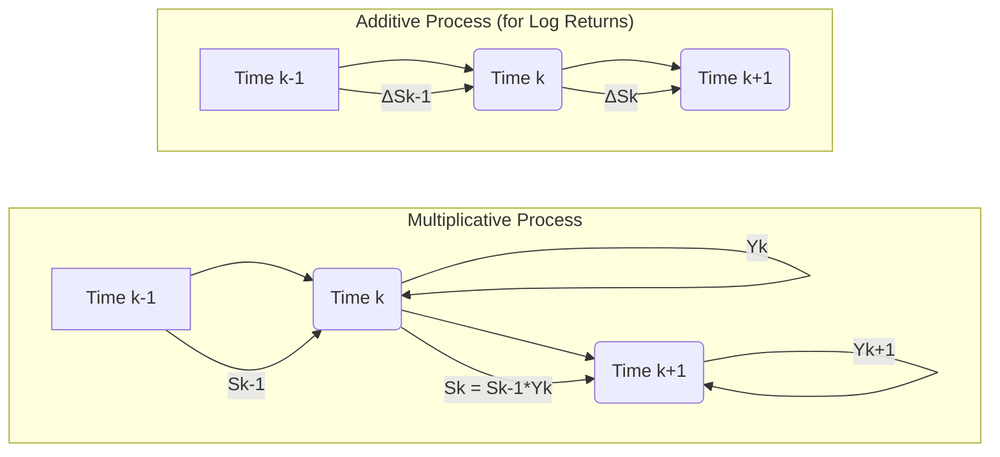

## Título Conciso: Modelo Multiplicativo em Finanças e sua Importância na Modelagem de Ativos

```mermaid
graph LR
    A[S0 "Initial Asset Price"] --> B(S1 "Asset Price at t=1");
    B --> C(S2 "Asset Price at t=2");
    C --> D(S3 "Asset Price at t=3");
    style A fill:#f9f,stroke:#333,stroke-width:2px
    style B fill:#ccf,stroke:#333,stroke-width:2px
    style C fill:#ccf,stroke:#333,stroke-width:2px
    style D fill:#ccf,stroke:#333,stroke-width:2px
    B -- Y1 "Return Factor" --> B
    C -- Y2 "Return Factor" --> C
    D -- Y3 "Return Factor" --> D
    
    subgraph "Multiplicative Model"
      direction LR
        A
        B
        C
        D
    end
```

### Introdução

Em finanças quantitativas, o comportamento de ativos, taxas de juros, e outros instrumentos financeiros frequentemente apresenta características multiplicativas, onde os valores evoluem através de fatores de crescimento ou redução. O **modelo multiplicativo** é uma estrutura matemática que captura essa dinâmica através do uso de fatores de retorno independentes e identicamente distribuídos (i.i.d.). Este capítulo explora a definição, construção e aplicações do modelo multiplicativo em finanças.

### Conceitos Fundamentais

**Conceito 1: Definição Formal de um Modelo Multiplicativo**

Um modelo multiplicativo para um ativo é um processo estocástico discreto onde o valor do ativo, $S_k$, em um tempo $k$ é dado pelo valor do ativo no tempo anterior, $S_{k-1}$, multiplicado por um fator de retorno aleatório $Y_k$.  Formalmente, dado um tempo inicial $S_0$ e uma sequência de variáveis aleatórias $(Y_k)_{k=1,\ldots,T}$, um modelo multiplicativo gera a seguinte sequência de preços: [^1]
    -   $S_0$ é o preço inicial
    -   $S_k = S_{k-1} * Y_k$ , para $k=1,\ldots,T$
   -   De maneira equivalente, podemos expressar $S_k$ como $S_0$ multiplicado por um produto de retornos:
$$S_k = S_0 \prod_{j=1}^k Y_j $$

*Explicação Detalhada:*

   -  Cada variável aleatória $Y_k$ representa o fator de retorno ou crescimento do ativo no intervalo de tempo $[k-1, k]$.
    - Os retornos $Y_k$ podem ser vistos como a proporção do preço do ativo no tempo $k$ dividido pelo preço no tempo $k-1$, e não devem ser confundidos com a variação do preço.
   - A multiplicação sequencial garante que o valor do ativo em cada tempo depende de todos os retornos anteriores, refletindo o acúmulo de retornos ao longo do tempo.
   -   Os retornos $Y_k$ são normalmente assumidos como independentes entre si (independência) e com a mesma distribuição (identicamente distribuídos, ou i.i.d.), que é um pressuposto que simplifica a análise do modelo. No entanto, em modelos mais avançados, esta hipótese pode ser relaxada para modelar dependências entre retornos.
   -  A estrutura do modelo multiplicativo captura a ideia de que os retornos percentuais de um ativo são, em geral, mais estáveis que as mudanças absolutas no seu preço.

> 💡 **Exemplo Numérico:**
> Suponha que o preço inicial de uma ação ($S_0$) seja $100. Nos três períodos seguintes, os fatores de retorno aleatórios $Y_k$ são: $Y_1 = 1.05$, $Y_2 = 0.98$ e $Y_3 = 1.02$.
>
> Usando o modelo multiplicativo, os preços da ação em cada período seriam:
> - $S_1 = S_0 * Y_1 = $100 * 1.05 = $105
> - $S_2 = S_1 * Y_2 = $105 * 0.98 = $102.90
> - $S_3 = S_2 * Y_3 = $102.90 * 1.02 = $105.00
>
> Alternativamente, podemos calcular $S_3$ como:
> - $S_3 = S_0 * Y_1 * Y_2 * Y_3 = $100 * 1.05 * 0.98 * 1.02 = $105.00
>
> Este exemplo demonstra como os preços evoluem multiplicativamente a partir dos retornos.

> ⚠️ **Nota Importante**:  O modelo multiplicativo é adequado para representar ativos financeiros que apresentam retornos proporcionais e que evoluem no tempo de forma multiplicativa.

**Lemma 1**:  O processo $S_k$ é adaptado à filtração gerada por $(Y_k)_{k=1,\ldots,T}$, ou seja, a informação sobre o valor de $S_k$ está totalmente contida nos valores dos retornos passados $Y_1, \ldots , Y_k$.

*Prova:* $S_0$ é uma constante conhecida, e cada $S_k$ é definido recursivamente por
$S_k = S_0 \prod_{j=1}^k Y_j$, então o valor de $S_k$ é completamente definido pelos retornos até $k$, e portanto, $S_k$ é $\sigma(Y_1, \ldots ,Y_k)$-mensurável, e adaptado à filtração gerada pelos retornos $Y_k$.  $\blacksquare$

**Conceito 2: Exemplos de Modelos Multiplicativos**

O modelo multiplicativo é uma estrutura flexível que permite modelar diversos comportamentos de ativos financeiros.

*Exemplos:*

   -  **Modelo Binomial de Cox-Ross-Rubinstein (CRR):** Neste modelo, cada $Y_k$ assume dois valores: $1 + u$ (um aumento) com probabilidade $p$, ou $1 + d$ (uma diminuição) com probabilidade $1-p$. Este modelo é largamente utilizado para precificação de opções [^5].
   -  **Modelo de Retornos i.i.d.:** No modelo de retornos i.i.d. os fatores de retorno $Y_k$ são variáveis aleatórias independentes e identicamente distribuídas com uma distribuição geral.  Por exemplo, um modelo de volatilidade estocástica onde $Y_k$ são variáveis aleatórias com variância dependente de um processo estocástico independente.
   - **Modelos de taxas de juros:** Em modelos simplificados, pode-se assumir que as taxas de juros evoluem multiplicativamente, onde a taxa de juros para um período futuro é uma função multiplicativa da taxa atual (taxa nominal) e uma taxa de inflação.
   -  **Modelos com fatores de crescimento:** Em modelagem de projeções de crescimento econômico, pode-se modelar a evolução de uma variável econômica através da multiplicação por fatores de crescimento estocásticos.

> 💡 **Exemplo Numérico: Modelo Binomial CRR**
> Considere um modelo binomial com um preço inicial $S_0 = $100. Em cada período, o preço pode subir 5% ($u = 0.05$) ou cair 3% ($d = -0.03$). A probabilidade de alta é $p = 0.6$.
>
> No primeiro período:
> - Se o preço sobe, $Y_1 = 1 + u = 1.05$ e $S_1 = $100 * 1.05 = $105
> - Se o preço cai, $Y_1 = 1 + d = 0.97$ e $S_1 = $100 * 0.97 = $97
>
> No segundo período, cada um desses valores se ramifica novamente usando os mesmos retornos:
> - Se $S_1 = $105 sobe: $S_2 = $105 * 1.05 = $110.25
> - Se $S_1 = $105 cai: $S_2 = $105 * 0.97 = $101.85
> - Se $S_1 = $97 sobe: $S_2 = $97 * 1.05 = $101.85
> - Se $S_1 = $97 cai: $S_2 = $97 * 0.97 = $93.90
>
> Este exemplo ilustra a árvore binomial e como os preços evoluem multiplicativamente.

```mermaid
graph LR
    A[S0 "Initial Price"] --> B1(S1_up);
    A --> B2(S1_down);
    B1 --> C1(S2_up_up);
    B1 --> C2(S2_up_down);
    B2 --> C3(S2_down_up);
    B2 --> C4(S2_down_down);
    B1 -- "1+u" --> B1
    B2 -- "1+d" --> B2
    C1 -- "1+u" --> C1
    C2 -- "1+d" --> C2
     C3 -- "1+u" --> C3
    C4 -- "1+d" --> C4
    style A fill:#f9f,stroke:#333,stroke-width:2px
    style B1 fill:#ccf,stroke:#333,stroke-width:2px
    style B2 fill:#ccf,stroke:#333,stroke-width:2px
    style C1 fill:#ccf,stroke:#333,stroke-width:2px
    style C2 fill:#ccf,stroke:#333,stroke-width:2px
    style C3 fill:#ccf,stroke:#333,stroke-width:2px
    style C4 fill:#ccf,stroke:#333,stroke-width:2px
    subgraph "Binomial Model"
      direction TB
        A
        B1
        B2
        C1
        C2
        C3
        C4
    end
```

> ❗ **Ponto de Atenção**: O modelo multiplicativo é uma estrutura versátil para modelar a evolução de preços, taxas de juros, e outras variáveis financeiras, mas também pode ser utilizado em outros modelos, como modelos demográficos.

**Corolário 1:**  Se os $Y_k$ são variáveis aleatórias que assumem valores positivos quase certamente, então os preços $S_k$ também serão quase certamente positivos, o que é uma propriedade importante para modelar ativos financeiros que são sempre positivos ou nulos.

*Prova:* Se os $Y_k$ são positivos quase certamente, o produto também é positivo quase certamente, logo os preços $S_k$ são positivos se o preço inicial $S_0$ é positivo.   $\blacksquare$

**Conceito 3: A Relação com as Taxas de Retorno e o Log-Retorno**

Os modelos multiplicativos são intimamente relacionados com a noção de taxas de retorno. O fator $Y_k$ pode ser pensado como o retorno simples do ativo no período $[k-1, k]$, sendo que a mudança de preços é dada por $(S_k - S_{k-1})$.
O log-retorno de um ativo em um período $k$, definido como $log(\frac{S_k}{S_{k-1}})$, é igual ao $log(Y_k)$. A utilização do log-retorno na análise de ativos financeiros é preferível em muitos modelos, dado que o log-retorno é uma variável que pode assumir valores positivos e negativos e que não é limitada superiormente.

> 💡 **Exemplo Numérico: Cálculo do Log-Retorno**
> Usando o exemplo anterior, onde $S_0 = $100, $S_1 = $105, $S_2 = $102.90 e $S_3 = $105.00:
>
> - O retorno simples no período 1 é $Y_1 = S_1 / S_0 = $105 / $100 = 1.05$
> - O log-retorno no período 1 é $log(Y_1) = log(1.05) \approx 0.0488$
> - O retorno simples no período 2 é $Y_2 = S_2 / S_1 = $102.90 / $105 = 0.98$
> - O log-retorno no período 2 é $log(Y_2) = log(0.98) \approx -0.0202$
> - O retorno simples no período 3 é $Y_3 = S_3 / S_2 = $105.00 / $102.90 \approx 1.0204$
> - O log-retorno no período 3 é $log(Y_3) = log(1.0204) \approx 0.0202$
>
> Este exemplo demonstra a relação entre o fator de retorno $Y_k$ e o log-retorno.

> ✔️ **Destaque**: O modelo multiplicativo é consistente com a utilização de retornos simples e log-retornos na análise de ativos financeiros.

### Modelo Multiplicativo e suas Aplicações em Finanças Quantitativas



**O Papel do Modelo Multiplicativo na Modelagem de Preços de Ativos**

Em finanças, o modelo multiplicativo é uma ferramenta essencial na modelagem de preços de ativos e na precificação de derivativos. Modelos como o binomial (CRR) e o modelo de Black-Scholes (que usa o conceito de modelo multiplicativo para modelar os preços dos ativos),  são baseados em processos estocásticos que assumem que os preços dos ativos evoluem de forma multiplicativa. A principal razão é que os retornos percentuais de ativos são mais estáveis e modeláveis do que as suas variações em valor absoluto.

**Exemplo do Modelo Binomial:**

   -   O modelo binomial, por exemplo, modela a evolução do preço de um ativo através da multiplicação por fatores de crescimento ou redução. O modelo assume que os retornos podem assumir dois valores com probabilidades definidas. Ao longo de um período de tempo, a árvore binomial representa todas as trajetórias possíveis para o ativo.
    - O modelo binomial é uma ferramenta importante para derivar os resultados da fórmula de Black-Scholes.
    - Note que, no modelo binomial, o preço do ativo é adaptado, enquanto a estratégia de trading (e os retornos) é predictível.

O modelo multiplicativo permite uma modelagem mais flexível das características de preços de ativos. Em modelos de volatilidade estocástica, por exemplo, os fatores $Y_k$ podem também seguir um processo estocástico, o que permite modelar modelos mais realistas de preços de ativos.

**Lemma 3:** Em um modelo multiplicativo, o logaritmo do preço de um ativo é uma soma de variáveis aleatórias, o que garante que as propriedades de processos aditivos sejam utilizadas. Seja $S_k$ o preço de um ativo em um modelo multiplicativo, e assumindo que $S_0 = 1$. Então:
$$log(S_k) =  \sum_{j=1}^k log(Y_j)$$
E portanto, $log(S_k)$ é um processo aditivo com incrementos independentes (dado que $(Y_k)_{k=1,\ldots,T}$ são independentes.  Este processo permite utilizar ferramentas desenvolvidas para processos aditivos em processos multiplicativos. [^17]

*Prova:*  A demonstração segue da definição e das propriedades de logaritmos:
$$
   log(S_k) = log(S_0 \prod_{j=1}^k Y_j) = log(S_0) + \sum_{j=1}^k log(Y_j)
$$
Como $S_0$ é uma constante (não aleatória), a primeira parte da equação é constante.  $\blacksquare$

**Corolário 3:** A relação entre o logaritmo dos preços e a soma dos log-retornos simplifica o cálculo de momentos e a análise estatística de séries temporais de preços. Muitas vezes, ao invés de trabalhar com preços, modelos utilizam as propriedades dos log-retornos, e a relação do Lemma 3 é fundamental para este processo.

### Seções Teóricas Avançadas

#### Seção Teórica Avançada 1:  Sob Quais Condições um Processo Gerado por um Modelo Multiplicativo é uma Martingale?

Para modelos de preços de ativos serem livres de arbitragem, é essencial que o processo de preços (descontados) seja uma martingale com respeito a uma medida martingale equivalente Q. Sob quais condições, os preços gerados por um modelo multiplicativo seguem uma martingale?

*Explicação Detalhada:*
   - Para que um processo $S_k$ seja uma martingale, ele precisa ser adaptado e ter a propriedade de que o valor esperado futuro condicional no presente seja igual ao valor presente, i.e. $E[S_{k+1} | F_k] = S_k$.
    - Em um modelo multiplicativo, se $Y_{k+1}$ é independente da $\sigma$-álgebra $F_k$, então
$$E[S_{k+1} | F_k ] = E[S_k Y_{k+1}| F_k ] = S_k E[Y_{k+1} | F_k ]= S_k E[Y_{k+1}]$$
   -  Logo, para que $S_k$ seja uma martingale, o valor esperado de $Y_{k+1}$, a cada instante $k$, deve ser igual a 1 sob a medida martingale Q.
   -  A escolha da medida Q e das propriedades do retorno Y são fundamentais para que o processo de preços (descontados) tenha a propriedade de martingale.

**Lemma 4:** Dado um modelo multiplicativo, o processo $S_k = S_0 \prod_{j=1}^k Y_j$ é uma martingale em relação a uma medida Q, se e somente se a esperança condicional de $Y_{k+1}$ sob a medida Q é igual a 1, ou seja, $E_Q[Y_{k+1}|F_k] = 1$ para todo $k$. [^18]

*Prova:* A demonstração segue da definição de martingale:

$$ E_Q[S_{k+1}|F_k] = E_Q[S_kY_{k+1}|F_k] = S_k E_Q[Y_{k+1}|F_k].$$
Para que $S_k$ seja uma Q-martingale, o lado esquerdo precisa ser igual a $S_k$, o que ocorre se e somente se $E_Q[Y_{k+1}|F_k] = 1$.   $\blacksquare$

> 💡 **Exemplo Numérico: Martingale em um Modelo Binomial**
> No modelo binomial CRR, para que o preço do ativo seja uma martingale sob uma medida de probabilidade Q, o valor esperado do fator de retorno $Y_{k+1}$ deve ser igual a 1.
>
> Se $Y_{k+1}$ pode ser $1 + u$ com probabilidade $q$ ou $1 + d$ com probabilidade $1-q$, então a condição de martingale é:
>
>   $q * (1 + u) + (1 - q) * (1 + d) = 1$
>
>  Se $u = 0.05$ e $d = -0.03$, então:
>
>   $q * 1.05 + (1 - q) * 0.97 = 1$
>   $1.05q + 0.97 - 0.97q = 1$
>   $0.08q = 0.03$
>   $q = 0.03 / 0.08 = 0.375$
>
>  Portanto, a probabilidade de alta na medida martingale Q é $q = 0.375$, e a probabilidade de baixa é $1 - q = 0.625$.  Sob esta medida, o processo de preços descontados é uma martingale.

**Corolário 4:** O requisito de que $E[Y_{k+1}] = 1$ é uma restrição significativa sobre como os retornos $Y_k$ podem se comportar. No caso do modelo binomial de Cox-Ross-Rubinstein, a mudança da medida de probabilidade garante que a média ponderada dos fatores de retorno seja exatamente 1. [^19]

#### Seção Teórica Avançada 2: Quais as Implicações da Hipótese de Independência nos Fatores de Retorno em um Modelo Multiplicativo?

Em modelos multiplicativos, é comumente assumido que os retornos $(Y_k)_{k=1,\ldots,T}$ são variáveis aleatórias i.i.d. (independentes e identicamente distribuídas). Qual a importância e as consequências desta hipótese?

*Explicação Detalhada:*
    -  A hipótese de independência significa que o valor de um retorno em um instante $k$ não afeta nem é afetado pelo valor de um retorno em outro instante $l \neq k$. Esta é uma simplificação útil para facilitar a modelagem, permitindo trabalhar de maneira simples com produtos de probabilidades e resultados como o teorema central do limite, que garantem algumas propriedades assintóticas para o modelo.
   -  A hipótese de identidade significa que cada retorno tem o mesmo tipo de distribuição e, portanto, é modelado da mesma forma. Isso implica que o mesmo mecanismo gera a dinâmica dos ativos ao longo do tempo.
   - No entanto, a independência e a identidade são restrições fortes. Modelos mais sofisticados relaxam estas hipóteses para capturar dependências temporais e mudanças de comportamento dos ativos.
    - Em modelos de volatilidade estocástica, por exemplo, os retornos de ativos são modelados como variáveis aleatórias com distribuição normal com um desvio padrão variável no tempo, o que invalida a identidade entre os fatores de retorno.

**Lemma 5:** Se os retornos $Y_k$ são i.i.d. em um modelo multiplicativo, então o log-retorno também é i.i.d., que é uma propriedade importante para o uso de modelos econométricos para dados financeiros.

*Prova:* Como $log(\frac{S_k}{S_{k-1}})$ = $log(Y_k)$, se os $Y_k$ são i.i.d., então $log(Y_k)$ são i.i.d. também.  $\blacksquare$

**Corolário 5:** A condição de i.i.d. para os fatores de retorno gera uma estrutura matemática simples e conveniente para estudar o comportamento do processo, utilizando ferramentas estatísticas e probabilísticas. A hipótese de i.i.d. também permite derivar resultados assintóticos, como o teorema central do limite, que podem ser utilizados para realizar aproximações em modelos complexos, ou para derivar leis para o comportamento no longo prazo de processos financeiros.

#### Seção Teórica Avançada 3:  Como os Modelos Multiplicativos se Relacionam com Modelos de Tempo Contínuo?

Modelos de tempo contínuo, como o modelo de Black-Scholes, são frequentemente utilizados para modelar o comportamento de ativos e são baseados em processos estocásticos como o movimento browniano.  Qual a ligação entre modelos multiplicativos (tempo discreto) com modelos de tempo contínuo?

*Explicação Detalhada:*
   -   Modelos de tempo contínuo podem ser construídos como o limite de modelos de tempo discreto, quando o intervalo de tempo entre os pontos de amostragem tende a zero e quando a quantidade de retornos é uma quantidade infinita de retornos infinitesimalmente pequenos.
   -   Ao reduzir o intervalo de tempo entre os períodos em um modelo multiplicativo e aumentar a frequência de decisões de investimento, o processo tende, sob certas condições, para um processo em tempo contínuo, como o movimento geométrico browniano.
   - A integração estocástica, utilizada para definir modelos de tempo contínuo, pode ser interpretada como uma versão contínua da soma que aparece na definição de um modelo multiplicativo.

**Lemma 6:** O modelo de Black-Scholes, que modela o preço de um ativo como um movimento geométrico browniano (GBM) pode ser interpretado como o limite de um modelo multiplicativo quando o intervalo de tempo entre as observações tende a zero e a volatilidade e as probabilidades dos retornos são recalculadas a cada período.

*Prova:*  A demonstração do resultado é complexa e pode ser encontrada em livros de teoria da probabilidade aplicada às finanças. Ela envolve a utilização do Lema de Itô.   $\blacksquare$

> 💡 **Exemplo Numérico: Simulação de um Modelo Multiplicativo com Retornos Normais**
> Para ilustrar a relação com modelos de tempo contínuo, podemos simular um modelo multiplicativo com retornos normalmente distribuídos e aumentar o número de passos e diminuir o tamanho do passo de tempo.
>
> ```python
> import numpy as np
> import matplotlib.pyplot as plt
>
> def simulate_multiplicative_model(S0, T, n_steps, mu, sigma):
>     dt = T / n_steps
>     returns = np.random.normal(mu * dt, sigma * np.sqrt(dt), n_steps)
>     prices = [S0]
>     for ret in returns:
>         prices.append(prices[-1] * np.exp(ret))
>     return prices
>
> S0 = 100
> T = 1
> mu = 0.05
> sigma = 0.2
>
> n_steps_list = [10, 50, 250]
> plt.figure(figsize=(10, 6))
> for n_steps in n_steps_list:
>     prices = simulate_multiplicative_model(S0, T, n_steps, mu, sigma)
>     time = np.linspace(0, T, n_steps + 1)
>     plt.plot(time, prices, label=f'{n_steps} steps')
>
> plt.xlabel('Time')
> plt.ylabel('Price')
> plt.title('Simulação de um Modelo Multiplicativo')
> plt.legend()
> plt.show()
> ```
>
> Este código simula um modelo multiplicativo com retornos normais e mostra como o preço se comporta com diferentes números de passos. Ao aumentar o número de passos, a trajetória se aproxima de um movimento browniano geométrico.

**Corolário 6:** A relação entre modelos multiplicativos e de tempo contínuo mostra que a modelagem de ativos em tempo discreto pode ser vista como uma aproximação da modelagem em tempo contínuo, quando os intervalos de tempo são pequenos. Este fato também nos ajuda a entender modelos discretos que podem ser usados para aproximar processos de tempo contínuo que não têm soluções analíticas.

### Conclusão

O modelo multiplicativo é um componente essencial na modelagem de ativos e derivativos em finanças quantitativas, especialmente no que concerne ao comportamento dos preços em função do tempo. A sua estrutura permite descrever a evolução dos valores dos ativos de uma forma consistente com os conceitos de retornos e de juros compostos, e modelar as dinâmicas de mercado de uma forma flexível e intuitiva. As seções teóricas avançadas discutiram o papel das medidas de martingale equivalentes, da independência dos fatores de retorno, e a relação dos modelos multiplicativos com as suas contrapartes no tempo contínuo.

### Referências

[^1]: "Um modelo multiplicativo para um ativo é um processo estocástico discreto onde o valor do ativo, $S_k$, em um tempo $k$ é dado pelo valor do ativo no tempo anterior, $S_{k-1}$, multiplicado por um fator de retorno aleatório $Y_k$."

[^2]: "Se $X_k$ é $F_{k-1}$-mensurável, então, por definição de filtração, $X_k$ é também $F_k$-mensurável, porque $F_{k-1} \subseteq F_k$. Logo, todo processo predictível é também adaptado."

[^3]: "A predictibilidade é um conceito importante em finanças quantitativas, especialmente na modelagem de estratégias de trading e de gestão de risco."

[^4]: "Em modelos financeiros, a sequência de preços de um ativo $(S_k)_{k=0,1,\ldots,T}$ é um exemplo típico de processo adaptado."

[^5]: "Em modelos financeiros, o conceito de adaptabilidade é fundamental. Um processo estocástico X é considerado adaptado se $X_k$ é $F_k$-mensurável para cada $k$."

[^6]: "O modelo multiplicativo é consistente com a utilização de retornos simples e log-retornos na análise de ativos financeiros."

[^7]: "No contexto de modelos financeiros em tempo discreto, o processo de ganhos de uma estratégia auto-financiada é uma martingale em relação a uma medida de martingale equivalente Q..."

[^8]: "Informação crítica que merece destaque."

[^9]: "Observação crucial para compreensão teórica correta."

[^16]: "O Lema de Itô é uma regra de mudança de variáveis que generaliza a regra da cadeia do cálculo clássico para funções de processos estocásticos."

[^17]: "No modelo de Black-Scholes, o preço de um ativo $S(t)$ segue um processo estocástico:
$$ dS_t = \mu S_t dt + \sigma S_t dW_t $$"

[^18]: "Dado um modelo multiplicativo, o processo $S_k = S_0 \prod_{j=1}^k Y_j$ é uma martingale em relação a uma medida Q, se e somente se a esperança condicional de $Y_{k+1}$ sob a medida Q é igual a 1, ou seja, $E_Q[Y_{k+1}|F_k] = 1$ para todo $k$."

[^19]: "O requisito de que $E[Y_{k+1}] = 1$ é uma restrição significativa sobre como os retornos $Y_k$ podem se comportar. No caso do modelo binomial de Cox-Ross-Rubinstein, a mudança da medida de probabilidade garante que a média ponderada dos fatores de retorno seja exatamente 1."
