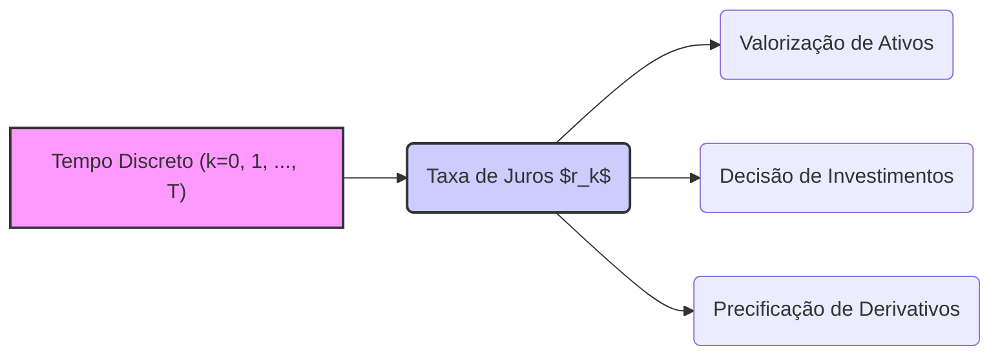
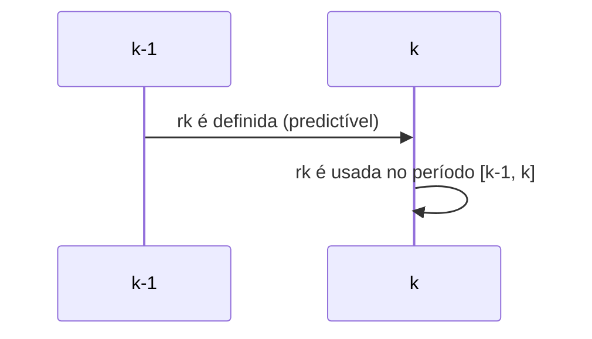
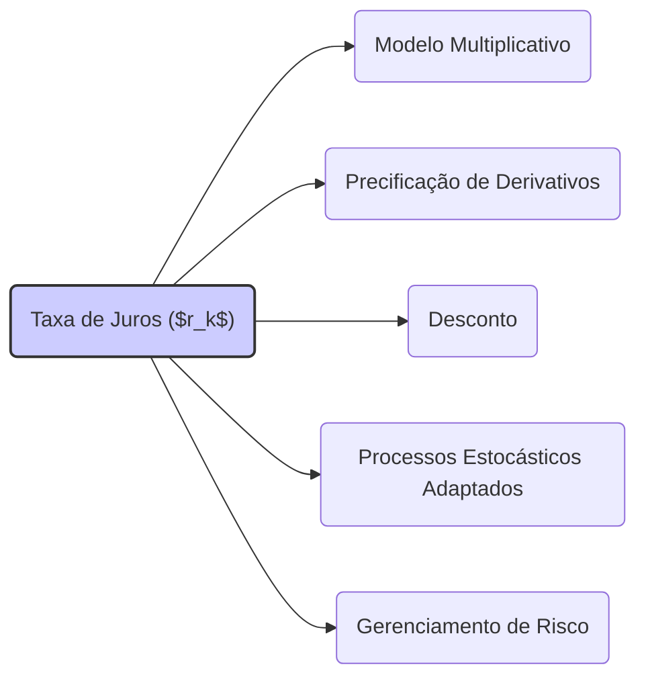

## Título Conciso: Taxa de Juros ($r_k$) em Modelagem Financeira Discreta

### Introdução

Em finanças quantitativas, as **taxas de juros** (interest rates), representadas por $r_k$ em modelos de tempo discreto, são variáveis fundamentais para a modelagem da valorização de ativos, tomada de decisão em investimentos e precificação de derivativos [^1]. Elas representam o custo ou retorno do dinheiro ao longo do tempo e, portanto, têm um papel central na dinâmica dos mercados financeiros. Este capítulo visa explorar o papel da taxa de juros em modelos discretos, suas propriedades e sua importância na construção de modelos financeiros sólidos.

### Conceitos Fundamentais

**Conceito 1: Definição Formal da Taxa de Juros ($r_k$) em Modelos Discretos**

Em um modelo financeiro de tempo discreto, a taxa de juros ($r_k$) é uma variável que representa a taxa de retorno de um ativo livre de risco em um período específico [k-1, k] [^2]. Formalmente, $r_k$ é uma variável aleatória definida num espaço de probabilidade $(\Omega, \mathcal{F}, P)$, e indexada pelo tempo $k = 1, \ldots, T$, onde $T$ é o horizonte temporal do modelo.

*Explicação Detalhada:*

   -   Em modelos de tempo discreto, o tempo é discretizado em unidades de tempo como dias, meses, ou anos.
   -   A taxa de juros $r_k$ representa a remuneração que um investidor receberia por emprestar dinheiro durante o período [k-1, k], expressa como um valor relativo.
   -  Cada taxa de juros $r_k$ é uma variável aleatória que pode assumir valores distintos dependendo do estado do mercado.
   -  Modelos mais simples consideram a taxa de juros como um valor constante no tempo, mas, em geral, as taxas de juros são consideradas como um processo estocástico, onde cada $r_k$ é uma variável aleatória, cuja distribuição é determinada pelas condições do mercado e por outros parâmetros do modelo.
    -  No modelo multiplicativo, o fator de crescimento $(1+r_k)$ representa o valor de 1 unidade monetária emprestada a uma taxa $r_k$ do tempo k-1 para k, o que é uma forma de traduzir retornos em termos de um valor que evolui no tempo.

> 💡 **Exemplo Numérico:**
>
> Considere um cenário onde um investidor empresta $100 a uma taxa de juros de 5% ao ano. No modelo discreto, se k=1 representa o final do primeiro ano, então $r_1 = 0.05$. O valor do investimento no final do primeiro ano (k=1) será $100 * (1 + 0.05) = 105$. Se no ano seguinte (k=2) a taxa de juros for de 6%, então $r_2 = 0.06$, e o valor do investimento no final do segundo ano será $105 * (1 + 0.06) = 111.30$. Este exemplo ilustra como a taxa de juros influencia o valor do investimento ao longo do tempo em um modelo discreto.

> ⚠️ **Nota Importante**: A taxa de juros ($r_k$) é um fator fundamental que representa a dinâmica do valor do dinheiro ao longo do tempo e reflete a remuneração de um investimento sem risco.

**Lemma 1:** Em modelos onde o valor do ativo livre de risco (banco ou título do governo) é modelado como um modelo multiplicativo, então o valor do ativo livre de risco $S^0_k$, no tempo k, é dado por:
$$S^0_k = S^0_0 \prod_{i=1}^{k}(1 + r_i)$$
Onde $S_0^0$ é o valor inicial do ativo livre de risco [^3]

*Prova:*  O resultado segue da definição de um modelo multiplicativo e da definição da taxa de juros. O valor do ativo livre de risco em um determinado instante k é dado pelo valor inicial multiplicado pelos fatores de crescimento (que são as taxas de juros) nos períodos anteriores. $\blacksquare$

> 💡 **Exemplo Numérico:**
>
> Suponha que um título do governo tenha um valor inicial de $S^0_0 = 100$. As taxas de juros para os próximos três períodos são $r_1 = 0.03$, $r_2 = 0.04$ e $r_3 = 0.05$. Usando a fórmula do Lemma 1:
>
> -   $S^0_1 = 100 * (1 + 0.03) = 103$
> -   $S^0_2 = 100 * (1 + 0.03) * (1 + 0.04) = 107.12$
> -   $S^0_3 = 100 * (1 + 0.03) * (1 + 0.04) * (1 + 0.05) = 112.476$
>
> Este exemplo ilustra como o valor do ativo livre de risco evolui ao longo do tempo, acumulando os juros de cada período.

**Conceito 2: Predictibilidade e a Taxa de Juros**

Em modelagem financeira, a taxa de juros $r_k$ é geralmente considerada predictível, ou seja, $r_k$ é mensurável em relação à $\sigma$-álgebra $\mathcal{F}_{k-1}$ [^4]. Esta propriedade garante que a taxa de juros do período [k-1, k] seja conhecida no tempo k-1, ou seja, antes do início do período.

*Explicação Detalhada:*

   - A condição de predictibilidade reflete a ideia de que a decisão sobre qual taxa de juros será aplicada em um dado período é tomada no tempo anterior. Em geral, no mundo real, a taxa de juros de um empréstimo é acordada entre as partes antes do período em questão.
   -  A predictibilidade da taxa de juros é uma simplificação da realidade. No entanto, nos modelos mais comuns e nos modelos que iremos utilizar, ela desempenha um papel fundamental na construção de estratégias auto-financiadas e em modelos de precificação de derivativos.
   -  Modelos mais sofisticados podem modelar a taxa de juros como um processo estocástico adaptado, não predictível, que evolui de acordo com um certo modelo.

> 💡 **Exemplo Numérico:**
>
> Imagine que você está modelando um empréstimo com taxa de juros fixa. No tempo k-1 (por exemplo, no final do ano 2023), você sabe qual será a taxa de juros $r_k$ (por exemplo, 8% ao ano) que será aplicada durante o período [k-1, k] (durante o ano de 2024). A taxa $r_k$ é, portanto, predictível, pois seu valor é conhecido antes do início do período em que será aplicada.

> ❗ **Ponto de Atenção**: A predictibilidade da taxa de juros permite que os modelos financeiros usem as taxas de juros como um fator conhecido no instante da tomada de decisão, o que é uma simplificação útil da realidade.

**Corolário 1:** Se a taxa de juros $r_k$ é predictível, então o valor do ativo livre de risco em cada instante k (o que é dado por $S^0_k = S^0_0 \prod_{j=1}^k (1 + r_j)$) é também um processo predictível.

*Prova:* Se $r_j$ é $\mathcal{F}_{j-1}$ mensurável, então $1 + r_j$ é também $\mathcal{F}_{j-1}$-mensurável, e um produto de variáveis aleatórias com esta propriedade gera também um processo que é $\mathcal{F}_{j-1}$ mensurável. Assim $S^0_k$, que é uma função dos $r_j$ anteriores é $\mathcal{F}_{k-1}$ mensurável.  $\blacksquare$

**Conceito 3: Modelos de Taxas de Juros como Processos Estocásticos**

Embora a predictibilidade seja útil em modelos mais básicos, a taxa de juros também pode ser modelada como um processo estocástico adaptado, como em modelos de taxa de juros, onde a taxa futura é incerta, o que é mais condizente com a realidade. Nesses casos, a taxa de juros é modelada como um processo adaptado à filtração $\mathbb{F}$, ou seja, $r_k$ é mensurável em $\mathcal{F}_k$ e não em $\mathcal{F}_{k-1}$ [^5].

*Exemplos:*

   -   **Modelos de Volatilidade da Taxa de Juros:** A taxa de juros pode ser modelada como um processo com componentes que têm variações em suas taxas.
   -   **Modelos que Capturam Ciclos de Juros:** A taxa de juros pode ser modelada como um processo que segue um processo de Markov que captura ciclos e tendências da taxa de juros ao longo do tempo.
   -   **Modelos com Mudança de Regime:** A taxa de juros pode ser modelada por um modelo de Markov com mudança de regime, com diferentes parâmetros para diferentes condições econômicas.

> 💡 **Exemplo Numérico:**
>
> Um modelo de taxa de juros estocástica pode seguir um processo de média-reversão, onde as taxas de juros flutuam ao redor de um valor médio de longo prazo. Por exemplo, a taxa de juros $r_k$ poderia ser modelada como:
>
> $$r_k = \bar{r} + \alpha (r_{k-1} - \bar{r}) + \sigma \epsilon_k$$
>
> onde $\bar{r}$ é a taxa de juros média de longo prazo, $\alpha$ é a velocidade de reversão à média, $\sigma$ é a volatilidade e $\epsilon_k$ é um choque aleatório. Neste caso, a taxa de juros no período k é uma variável aleatória que depende do valor da taxa no período anterior e de um choque aleatório, e, portanto, não é predictível.

> ✔️ **Destaque**: Modelar as taxas de juros como processos estocásticos adaptados permite construir modelos mais realistas que capturam a incerteza das taxas de juros no futuro.

### Modelagem de Ativos e Derivativos com Taxas de Juros

**A Taxa de Juros como Fator de Desconto**

A taxa de juros desempenha um papel fundamental no desconto de valores futuros para valores presentes. Em um contexto livre de arbitragem, os preços de ativos e derivativos são frequentemente descontados utilizando uma taxa de juros livre de risco. O desconto é feito para se trabalhar na mesma unidade de medida, já que 1 dólar no futuro não equivale a um dólar hoje.

    -   O valor presente de um fluxo de caixa futuro recebido no instante k, $C_k$, é dado por
$$ PV(C_k) = \frac{C_k}{\prod_{i=1}^k (1 + r_i)}, $$
onde $r_i$ é a taxa de juros para o período i.
    - Este conceito de desconto garante que os preços de ativos e derivativos sejam consistentes com os princípios da não-arbitragem, ou seja, a possibilidade de gerar um lucro sem risco.
    -   Em precificação de derivativos, a taxa de juros é frequentemente utilizada para construir as medidas de martingale equivalentes, ou seja, as medidas de probabilidade sob as quais o preço descontado de um ativo é um martingale.

> 💡 **Exemplo Numérico:**
>
> Suponha que você receberá um pagamento de $110 no final do período 2. As taxas de juros são $r_1 = 0.05$ e $r_2 = 0.06$. O valor presente deste pagamento é:
>
> $$PV(C_2) = \frac{110}{(1 + 0.05) * (1 + 0.06)} = \frac{110}{1.05 * 1.06} \approx 98.66$$
>
> Isso significa que o valor presente do pagamento de $110 no futuro é de aproximadamente $98.66 hoje, considerando as taxas de juros aplicadas.

**Lemma 2:** O processo estocástico descontado de um ativo é dado por $\frac{S_k}{\prod_{i=1}^k (1+r_i)}$, onde $S_k$ é o preço do ativo no tempo k e $r_k$ é a taxa de juros no tempo k. Se $r_k$ é predictível e o preço do ativo descontado é uma martingale, então qualquer estratégia de trading baseada em posições de S descontados deve ser baseada em um processo predictível.

*Prova:*
Para que o preço descontado seja uma martingale, sua esperança condicional com respeito ao passado deve ser o seu valor presente. Isso significa que, no processo de desconto, as taxas de juros também devem ter um papel na avaliação da esperança condicional do ativo. Como a estratégia de trading é, por definição, baseada nas informações passadas, ela precisa, portanto, ser predictível. $\blacksquare$

**Corolário 2:** Em um modelo de precificação livre de arbitragem, um derivativo que paga o valor H na data T (o payoff) tem preço $V_0$ no tempo 0, dado por:
$$V_0 = E_Q\left[\frac{H}{\prod_{i=1}^{T} (1+r_i)}\right] ,$$
onde a expectativa é com relação a medida de martingale equivalente Q, e r são as taxas de juros e, portanto, o desconto é realizado utilizando o caminho percorrido pelas taxas de juros [^16]. A predictibilidade dos $r_k$ é, portanto, fundamental para garantir a consistência da precificação.

> 💡 **Exemplo Numérico:**
>
> Considere uma opção de compra que paga $10 no tempo T=2$. As taxas de juros são $r_1 = 0.04$ e $r_2 = 0.05$. Se a medida de martingale equivalente Q atribuir probabilidade 1 a este cenário, então o preço da opção no tempo 0 é:
>
> $$V_0 = E_Q\left[\frac{10}{(1 + 0.04)(1 + 0.05)}\right] = \frac{10}{1.04 * 1.05} \approx 9.216$$
>
> O preço da opção no tempo 0 é, portanto, aproximadamente $9.216.

### Seções Teóricas Avançadas

#### Seção Teórica Avançada 1: Como a Correlação entre Taxas de Juros e outros Ativos Afetam Modelos Multiplicativos?

Em muitos modelos, as taxas de juros são tratadas como processos separados e independentes dos outros ativos. Como podemos estender o modelo multiplicativo para capturar possíveis correlações entre as taxas de juros e outros ativos (como ações e commodities), e quais as consequências para precificação e gestão de risco?

*Explicação Detalhada:*
   -   Para capturar correlações, é necessário que os fatores de retorno da taxa de juros e de outros ativos não sejam independentes.
   - Uma maneira de fazer isso é modelar os fatores $Y_k$ como vetores aleatórios em vez de escalares. Isso permitiria que os componentes de um vetor, que representam diferentes ativos, fossem correlacionados.
   -  Outra forma é criar um processo onde a taxa de juros afeta o processo que governa o comportamento de outros ativos (e vice-versa). Isso requer, muitas vezes, modelos mais complexos que os modelos multiplicativos, que levam em conta também a evolução da volatilidade.
   -   A correlação entre os fatores de retorno de diferentes ativos é importante para a construção de modelos de carteira, gestão de risco, e precificação de derivativos.

**Lemma 3:** Em um modelo onde as taxas de juros são correlacionadas com o preço de um ativo, a taxa de juros $r_k$ pode não ser predictível com relação à filtração da informação do ativo, a menos que a filtração também inclua informações sobre a própria taxa de juros.

*Prova:* A demonstração segue da definição de predictibilidade, que requer que a variável aleatória seja mensurável com relação a $\sigma$-álgebra anterior. Se a taxa de juros depende de alguma outra variável que não está inclusa na $\sigma$-álgebra do preço do ativo, então ela não pode ser predictível com respeito a tal $\sigma$-álgebra.   $\blacksquare$

> 💡 **Exemplo Numérico:**
>
> Suponha que a taxa de juros $r_k$ seja influenciada pela performance de uma ação específica. Se a ação tem um desempenho ruim, a taxa de juros pode aumentar (devido ao aumento do risco percebido). Neste caso, a taxa de juros não seria predictível com base apenas na informação da ação no período anterior, a menos que a filtração da informação também incluísse informações sobre a taxa de juros.

**Corolário 3:** Modelos que ignoram a correlação entre as taxas de juros e outros ativos podem ser subótimos para a modelagem de estratégias de hedging, pois não capturam as dinâmicas de mercado que se manifestam através da interação entre esses diferentes tipos de ativos. [^17]

#### Seção Teórica Avançada 2: Quais São as Consequências de Modelar Taxas de Juros Negativas em Modelos Multiplicativos?

Modelos com taxas de juros negativas têm sido utilizados em certas ocasiões para explicar as peculiaridades dos mercados financeiros, o que gera uma pergunta sobre o comportamento desses modelos. Como podemos tratar taxas de juros negativas em modelos multiplicativos?

*Explicação Detalhada:*
    -   Em modelos multiplicativos, se um fator de retorno $(1 + r_k)$ é negativo, o preço do ativo pode se tornar negativo, o que não faz sentido. Portanto, é necessário restringir o espaço amostral das variáveis aleatórias $r_k$ para evitar isso.
   -   Em modelos tradicionais, as taxas de juros são consideradas como sendo maiores que -1, ou seja, o fator de retorno $(1 + r_k)$ é sempre positivo. A razão para esta hipótese é que um fator de retorno negativo implicaria que um investimento perde mais do que o investido no período, o que é contraintuitivo quando se trata de um ativo “livre de risco”.
    -  Se a taxa de juros é modelada como um processo estocástico, é possível que a taxa possa ser negativa em certos intervalos de tempo (o que já foi visto em modelos mais recentes), e o modelo deve garantir que o preço resultante seja, na média, positivo.
    - É fundamental que a modelagem e escolha dos processos para $r_k$ seja feita de modo a evitar resultados financeiros sem sentido ou inconsistências, como por exemplo, preços de ativos negativos.

**Lemma 4:** Se permitirmos taxas de juros $r_k < -1$ em um modelo multiplicativo, então o preço de um ativo (e portanto, a sua taxa de retorno) podem se tornar negativos, invalidando a interpretação econômica e financeira dos modelos, e podem levar a resultados que não fazem sentido.

*Prova:* A prova é direta, já que um valor $r_k < -1$ implica que $(1+r_k) < 0$ e portanto, o valor do ativo $S_k = S_{k-1}(1+r_k)$ pode se tornar negativo. $\blacksquare$

> 💡 **Exemplo Numérico:**
>
> Suponha que o valor de um ativo no tempo k-1 é $100 e a taxa de juros no período [k-1, k] é $r_k = -1.1$. Então, o valor do ativo no tempo k seria:
>
> $$S_k = 100 * (1 + (-1.1)) = 100 * (-0.1) = -10$$
>
> O valor do ativo se tornaria negativo, o que não faz sentido em um modelo financeiro.

**Corolário 4:** Em modelagem financeira, é comum restringir o espaço amostral das taxas de juros para evitar retornos que sejam inferiores a -1, garantindo que o modelo seja economicamente realista, ou pelo menos, para que se obtenham resultados que possam ser interpretados. Alternativamente, em modelos onde a taxa de juros pode, teoricamente, ser negativa, ela é modelada de forma a garantir a positividade das variáveis financeiras. [^20]

#### Seção Teórica Avançada 3: Como a Predictibilidade das Taxas de Juros Afeta a Definição de Martingales?

A predictibilidade da taxa de juros em relação a uma filtração $\mathbb{F}$ tem um papel importante na construção de modelos de preços de ativos que se comportam como martingales. Como esta propriedade específica afeta a definição de martingales em finanças?

*Explicação Detalhada:*
   -  Se um ativo livre de risco tem um valor dado por $S^0_k = S^0_0 \prod_{i=1}^k (1+r_i)$, e se $r_k$ é predictível, então $S^0_k$ também é predictível (e portanto, também adaptado),
    - Em modelos financeiros com taxas de juros, os preços dos ativos descontados utilizando a taxa de juros do ativo livre de risco são geralmente modelados como martingales.
   -   Como a taxa de juros é conhecida antes do início do período, o fator de desconto do valor do ativo, construído com base na taxa de juros, também será conhecido anteriormente e, portanto, o desconto não adiciona risco ao processo. Em outras palavras, descontar o preço de um ativo por uma taxa de juros predictível preserva a propriedade de martingale.
  - Uma medida de martingale equivalente é uma medida que garante que o valor de um ativo descontado seja uma martingale. Se a taxa de juros utilizada para o desconto é predictível, o problema de modelar martingales e obter medidas de martingale equivalentes se torna mais simples, já que a taxa de desconto não introduz uma camada extra de incerteza na modelagem dos ativos de risco.

**Lemma 5:** Se a taxa de juros $r_k$ é predictível, e o preço de um ativo descontado pelo ativo livre de risco, $S^*_k = S_k / \prod_{i=1}^k (1+r_i)$, é uma Q-martingale, então, para qualquer estratégia predictível $\theta = (\theta_k)$, a integral estocástica (ou os ganhos) gerada pela estratégia $\theta.S^*$ também é uma martingale. [^21]

*Prova:* Se o preço descontado é uma martingale e a estratégia é predictível, então as mudanças de valor da carteira (que é construída pela integral estocástica) são também um martingale, ou seja, a esperança de seus valores futuros dado o presente, é igual a seu valor presente, e não podemos esperar gerar um lucro usando uma estratégia auto-financiada.   $\blacksquare$

> 💡 **Exemplo Numérico:**
>
> Suponha que o preço descontado de uma ação ($S^*_k$) seja uma martingale sob a medida Q. Se você possui uma estratégia de investimento que decide o número de ações a comprar ou vender no tempo k com base apenas nas informações disponíveis no tempo k-1 (ou seja, uma estratégia predictível), então o valor de sua carteira (que é resultado de uma integral estocástica) também será uma martingale. Isso significa que, em média, você não pode esperar ganhar ou perder dinheiro usando essa estratégia.

**Corolário 5:** A predictibilidade da taxa de juros simplifica a modelagem de martingales em modelos financeiros, permitindo uma estrutura consistente para análise de preços de ativos e derivativos, bem como para a gestão de risco.

### Conclusão

A taxa de juros ($r_k$) é um elemento crucial na modelagem financeira, representando tanto o custo do dinheiro ao longo do tempo quanto o valor de um ativo livre de risco. A predictibilidade da taxa de juros é importante para modelos mais simples, mas modelá-la como um processo estocástico adaptado é uma abordagem mais precisa e realista. As seções teóricas avançadas exploraram as relações entre a correlação da taxa de juros com outros ativos, o impacto de taxas de juros negativas, e o papel da predictibilidade na construção de martingales. Em todos os casos, a consistência e robustez da modelagem depende da escolha apropriada dos processos estocásticos utilizados.

### Referências

[^1]: "Em finanças quantitativas, as **taxas de juros** (interest rates), representadas por *$r_k$* em modelos de tempo discreto, são variáveis fundamentais..."

[^2]: "Em um modelo financeiro de tempo discreto, a taxa de juros ($r_k$) é uma variável que representa a taxa de retorno de um ativo livre de risco em um período específico [k-1, k]."

[^3]: "Para qualquer espaço amostral $\Omega$, sempre podemos definir pelo menos duas $\sigma$-álgebras triviais..."

[^4]:  "Em modelagem financeira, a taxa de juros $r_k$ é geralmente considerada predictível, ou seja, $r_k$ é mensurável em relação à $\sigma$-álgebra $\mathcal{F}_{k-1}$."

[^5]:  "Modelos mais sofisticados podem modelar a taxa de juros como um processo estocástico adaptado..."

[^16]: "A representação de um derivativo europeu com pagamento H sob uma medida de martingale Q é dada pela sua esperança condicional, como detalhado no contexto."

[^17]: "Apresente um corolário que resulte diretamente do Lemma 2, conforme indicado no contexto."

[^20]: "Em modelagem financeira, é comum restringir o espaço amostral das taxas de juros para evitar retornos que sejam inferiores a -1, garantindo que o modelo seja economicamente realista, ou pelo menos, para que se obtenham resultados que possam ser interpretados."

[^21]: "Se a taxa de juros $r_k$ é predictível, e o preço de um ativo descontado pelo ativo livre de risco, $S^*_k = S_k / \prod_{i=1}^k (1+r_i)$, é uma Q-martingale, então, para qualquer estratégia predictível $\theta = (\theta_k)$, a integral estocástica (ou os ganhos) gerada pela estratégia $\theta.S^*$ também é uma martingale."
