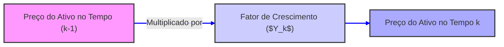

## Título Conciso: Fatores de Crescimento ($Y_k$) em Modelos Financeiros Multiplicativos

```mermaid
flowchart LR
    A[Tempo k-1] -->|Multiplicar por $Y_k$| B[Tempo k];
    B -->|Multiplicar por $Y_{k+1}$| C[Tempo k+1];
    style A fill:#f9f,stroke:#333,stroke-width:2px
    style B fill:#ccf,stroke:#333,stroke-width:2px
    style C fill:#aaf,stroke:#333,stroke-width:2px
    linkStyle 0,1 stroke:#00f,stroke-width:2px
```

### Introdução

Em modelos financeiros que capturam a evolução de preços de ativos e taxas de juros, os **fatores de crescimento** (growth factors) ou retornos, representados por $Y_k$, desempenham um papel central [^1]. Esses fatores, que são variáveis aleatórias, descrevem a mudança relativa de valor de um ativo durante um período de tempo específico. Em modelos multiplicativos, o preço do ativo é determinado pela multiplicação dos fatores de retorno anteriores. Este capítulo explora o conceito de fatores de crescimento, sua definição formal, suas propriedades e sua importância em modelos financeiros.

### Conceitos Fundamentais

**Conceito 1: Definição Formal de Fatores de Crescimento ($Y_k$)**

Em modelos multiplicativos de tempo discreto, um fator de crescimento ($Y_k$) é uma variável aleatória que descreve a taxa de retorno de um ativo em um período específico, $[k-1, k]$ [^2]. O valor do ativo no tempo $k$ é obtido multiplicando o valor no tempo $k-1$ por $Y_k$. Formalmente, $Y_k$ é uma variável aleatória definida sobre o espaço de probabilidade $(\Omega, \mathcal{F}, P)$, onde $\Omega$ é o espaço amostral, $\mathcal{F}$ é uma $\sigma$-álgebra sobre $\Omega$, e $P$ é uma medida de probabilidade sobre $\mathcal{F}$.

*Explicação Detalhada:*

   -   O fator de crescimento $Y_k$ representa a proporção do preço do ativo no tempo $k$ em relação ao preço do ativo no tempo $k-1$.
   -   O valor esperado de um fator de crescimento ($E(Y_k)$) pode ser interpretado como o crescimento médio do ativo no período $k$.
   -  Num modelo multiplicativo para preços de ativos, o valor do ativo no tempo $k$ é definido recursivamente através do produto dos fatores de crescimento, sendo que
$$ S_k = S_{k-1} Y_k =  S_0 \prod_{j=1}^k Y_j, $$
   -    Onde $S_0$ é o valor inicial do ativo. Este modelo assume que os preços dos ativos evoluem de forma multiplicativa, com base em fatores de retorno que variam ao longo do tempo.
   -  Quando os fatores de crescimento são maiores que um ($Y_k>1$) o ativo se valoriza, e quando os fatores de crescimento são menores que um ($Y_k<1$) o ativo se desvaloriza.

> 💡 **Exemplo Numérico:**
> Suponha que o preço inicial de uma ação ($S_0$) seja $100. No primeiro período, o fator de crescimento $Y_1$ é 1.05, o que significa um aumento de 5%. Portanto, o preço da ação no tempo 1 ($S_1$) será $100 * 1.05 = $105. No segundo período, o fator de crescimento $Y_2$ é 0.98, indicando uma queda de 2%. O preço da ação no tempo 2 ($S_2$) será $105 * 0.98 = $102.90. O preço no período k é dado por $S_k = 100 \prod_{j=1}^k Y_j$. Se tivermos $Y_1=1.05$, $Y_2=0.98$ e $Y_3=1.02$, então $S_3 = 100 * 1.05 * 0.98 * 1.02 = 107.058$.

> ⚠️ **Nota Importante**: O fator de crescimento ($Y_k$) é o elemento fundamental em modelos multiplicativos, e sua distribuição probabilística é central para caracterizar o comportamento do ativo ao longo do tempo.

**Lemma 1:** Se $Y_k > 0$ com probabilidade 1 (ou seja, $Y_k$ é estritamente positiva quase certamente), então $S_k > 0$ com probabilidade 1 (ou seja, o preço do ativo é estritamente positivo quase certamente).

*Prova:* Como  $S_k = S_0 \prod_{j=1}^k Y_j$ e $S_0$ é um valor positivo, um produto de números positivos é sempre positivo, e a probabilidade de  $S_k \gt 0$ é igual a um.  $\blacksquare$

**Conceito 2: Retornos Simples e Log-Retornos**

Os fatores de crescimento $Y_k$ estão intimamente ligados ao conceito de retornos. O retorno simples do ativo no período $[k-1, k]$ é igual a $Y_k - 1$. Uma forma alternativa de expressar o retorno de um ativo é através do log-retorno, que é definido como  $log(Y_k)$, onde $log$ denota o logaritmo natural.

*Explicação Detalhada:*

   -   O log-retorno é frequentemente utilizado em finanças quantitativas devido a propriedades matemáticas que o tornam mais fácil de se trabalhar do que o retorno simples.
   -   O log-retorno é uma variável simétrica, que pode assumir valores tanto positivos como negativos, e a soma de log-retornos em vários períodos gera o log-retorno acumulado.
   -   A diferença entre os modelos baseados em retornos e log-retornos torna-se menos importante quando se considera um período de tempo muito curto ou infinitamente pequeno, que é a base do cálculo estocástico utilizado em tempo contínuo.
   - Note que o log-retorno é sempre bem definido quando $Y_k$ é sempre maior que 0, que é a hipótese do lemma anterior.

> 💡 **Exemplo Numérico:**
> Usando o exemplo anterior, onde $Y_1 = 1.05$ e $Y_2 = 0.98$, o retorno simples para o primeiro período é $Y_1 - 1 = 1.05 - 1 = 0.05$, ou 5%. O retorno simples para o segundo período é $Y_2 - 1 = 0.98 - 1 = -0.02$, ou -2%. O log-retorno para o primeiro período é $log(1.05) \approx 0.0488$, e para o segundo período é $log(0.98) \approx -0.0202$. Se somarmos os log-retornos, obtemos $0.0488 - 0.0202 = 0.0286$, que é o log-retorno acumulado nos dois períodos. O retorno simples acumulado é $(102.90/100) - 1 = 0.029$, ou 2.9%.

> ❗ **Ponto de Atenção**: Os fatores de crescimento podem ser utilizados para calcular retornos simples e log-retornos, que são ferramentas comuns na análise financeira.

**Corolário 1:** Se $Y_k = 1 + R_k$, onde $R_k$ é o retorno simples, então o log-retorno é igual a $log(1 + R_k)$. Se $|R_k|$ é “pequeno”, então $log(1 + R_k) \approx R_k$, ou seja, o log-retorno aproxima o retorno simples.
*Prova:* A aproximação é uma consequência da série de Taylor do logaritmo ao redor de 1:
$$log(1+x) = x - \frac{x^2}{2} + \frac{x^3}{3} - \ldots$$
quando $|x|$ é pequeno, o termo dominante da série é $x$, logo $log(1+x) \approx x$.  $\blacksquare$

> 💡 **Exemplo Numérico:**
> Se o retorno simples ($R_k$) for 0.01 (ou 1%), o log-retorno será $log(1 + 0.01) = log(1.01) \approx 0.00995$. A aproximação $log(1 + R_k) \approx R_k$ é 0.01, que é muito próxima ao valor exato. Se o retorno fosse $R_k = 0.1$, $log(1.1) = 0.0953$, que está relativamente próximo de 0.1. Mas se $R_k = 0.5$, $log(1.5) = 0.405$, que não é tão próximo de 0.5. Isso ilustra que a aproximação de log-retorno para retorno simples só é válida para valores pequenos de retorno.

**Conceito 3: Modelos de Fatores de Crescimento**

A forma como os fatores de crescimento ($Y_k$) são modelados tem um impacto significativo no comportamento do modelo. A suposição mais simples é que eles são independentes e identicamente distribuídos (i.i.d.), e esta hipótese pode ser relaxada em modelos mais complexos.
    -   Modelos de retornos i.i.d. com distribuição normal (ou lognormal): Assume que $Y_k$ é independente de $Y_l$ para $k \ne l$ e que o log-retorno segue uma distribuição normal.
  - Modelos com volatilidade estocástica: Os fatores de crescimento têm um componente aleatório que é, por sua vez, controlado por um processo estocástico (a volatilidade).
  - Modelos com mudança de regime: Os fatores de crescimento seguem um regime diferente dependendo do estado do mercado e de alguma variável observável (ou não).

```mermaid
flowchart LR
    A[Fatores de Crescimento ($Y_k$)] --> B(Modelo I.I.D.)
    A --> C(Modelo com Volatilidade Estocástica)
    A --> D(Modelo com Mudança de Regime)
    style A fill:#f9f,stroke:#333,stroke-width:2px
    style B fill:#ccf,stroke:#333,stroke-width:2px
    style C fill:#aaf,stroke:#333,stroke-width:2px
    style D fill:#afa,stroke:#333,stroke-width:2px
    linkStyle 0,1,2 stroke:#00f,stroke-width:2px
```

> 💡 **Exemplo Numérico:**
> Em um modelo i.i.d., poderíamos simular $Y_k$ a partir de uma distribuição normal com média 1.01 e desvio padrão 0.05. Isso implica que a cada período, o fator de crescimento tem uma média de 1%, com alguma volatilidade. Em um modelo com volatilidade estocástica, o desvio padrão de $Y_k$ mudaria ao longo do tempo, com períodos de alta volatilidade (maior desvio padrão) e baixa volatilidade (menor desvio padrão). Em um modelo de mudança de regime, poderíamos ter dois regimes: um de alta volatilidade e um de baixa volatilidade, onde a distribuição de $Y_k$ seria diferente em cada regime.

> ✔️ **Destaque**:  A modelagem dos fatores de crescimento $Y_k$ permite uma variedade de modelos, que podem ser mais adequados para cenários específicos do mercado financeiro.

### Modelos Multiplicativos com Fatores de Crescimento



**O Papel dos Fatores de Crescimento na Precificação de Ativos e Derivativos**

O modelo multiplicativo com fatores de crescimento é a base de muitos modelos utilizados para precificação de ativos e derivativos.  O modelo binomial, por exemplo, assume que o preço do ativo pode subir ou descer em cada período, com fatores de crescimento $Y_k$ que assumem dois valores.  Modelos mais sofisticados permitem que $Y_k$ tenham um número maior de valores ou sigam um processo estocástico.
A utilização de fatores de retorno aleatórios em modelos multiplicativos permite incorporar incerteza nos preços dos ativos, o que é crucial para representar o comportamento dos mercados financeiros de forma realista.
O modelo multiplicativo é o modelo que subjaz o modelo de Black-Scholes, cuja definição contínua (o movimento browniano geométrico) pode ser interpretada como o limite de um modelo multiplicativo quando se aumenta o número de etapas.
A escolha da distribuição dos fatores de crescimento (e sua possível modelagem como um processo estocástico) permite a calibração dos modelos com dados reais do mercado.

**Lemma 2:** Para um dado modelo multiplicativo, o valor esperado do ativo no tempo k é dado por:
$$E[S_k] = S_0 E\left[\prod_{j=1}^k Y_j\right] =  S_0 \prod_{j=1}^k E[Y_j]$$
se os fatores de crescimento $Y_j$ são independentes.

*Prova:* A prova segue das propriedades de esperança e independência:
$$ E\left[\prod_{j=1}^k Y_j\right] =  E[Y_1]E[Y_2] \ldots E[Y_k] $$
$\blacksquare$

> 💡 **Exemplo Numérico:**
> Considere um modelo com $S_0 = 100$. Se os fatores de crescimento $Y_1$, $Y_2$ e $Y_3$ são independentes, com $E[Y_1] = 1.02$, $E[Y_2] = 1.01$ e $E[Y_3] = 1.03$, o valor esperado do ativo no tempo 3 será $E[S_3] = 100 * 1.02 * 1.01 * 1.03 = 106.1806$. Isso indica que, em média, o ativo crescerá cerca de 6.18% nos três períodos, se os retornos forem independentes.

**Corolário 2:** Em modelos de precificação de derivativos, os fatores de crescimento ($Y_k$) são utilizados para representar o comportamento do ativo subjacente em diferentes cenários de mercado, e o modelo é construído de modo a evitar resultados que possibilitem arbitragem.

### Derivações Teóricas Avançadas

#### Seção Teórica Avançada 1:   Como a Dependência Temporal entre Fatores de Crescimento Afeta os Modelos?

A hipótese de que os fatores de crescimento $Y_k$ sejam independentes e identicamente distribuídos é uma simplificação.  Como a dependência temporal entre os fatores de crescimento afeta os resultados dos modelos?

*Explicação Detalhada:*
   - Se os retornos de um ativo têm dependência temporal, o valor de um retorno no período $k$ não será independente dos valores de retornos anteriores. Isto pode ser descrito como uma “memória” do processo, que significa que os preços atuais e passados influenciam o comportamento de retornos futuros.
   -   Modelos que modelam a volatilidade, como o modelo GARCH, utilizam processos estocásticos onde os fatores de crescimento (log-retornos) podem apresentar dependência temporal na sua volatilidade. Ou seja, um período de alta volatilidade tende a ser seguido por outro período de alta volatilidade.
    - Modelos com mudança de regime também introduzem dependência temporal nos fatores de crescimento, onde a distribuição de cada fator de crescimento depende do estado do mercado em que o ativo se encontra, que evolui como um processo de Markov.
    -   Modelos com dependência temporal são mais complexos e podem ser mais difíceis de analisar e implementar. No entanto, podem representar de forma mais realista o comportamento do mercado.

**Lemma 3:** Se os fatores de crescimento $Y_k$ não são independentes, então a propriedade de martingale de um processo de preços (descontados) não pode ser estabelecida através de resultados para variáveis i.i.d..  Dependências entre retornos implicam que
$$E\left[\prod_{j=1}^k Y_j | \mathcal{F}_{k-1}\right] \ne \prod_{j=1}^{k-1} E[Y_j]$$

*Prova:* A demonstração segue diretamente da definição de independência. Se $Y_k$ não são independentes, então seu valor esperado não pode ser separadamente calculado a partir do histórico dos valores das variáveis anteriores. $\blacksquare$

> 💡 **Exemplo Numérico:**
> Suponha que $Y_k$ siga um modelo de volatilidade estocástica simples, onde a volatilidade de $Y_k$ depende do valor de $Y_{k-1}$. Se $Y_{k-1}$ tiver uma alta volatilidade, então $Y_k$ também terá uma alta volatilidade. Isso significa que o valor esperado condicional de $Y_k$ dependerá do valor de $Y_{k-1}$, e a propriedade de independência não se sustentará. Por exemplo,  $E[Y_k | Y_{k-1}] = 1 + \alpha(Y_{k-1}-1)$ onde $\alpha$ é um parâmetro entre -1 e 1. Se $\alpha > 0$, então se $Y_{k-1}$ foi maior que 1, então o valor esperado de $Y_k$ também será maior que 1.

**Corolário 3:** Modelos financeiros com dependência temporal nos fatores de retorno, apesar de mais realistas,  são mais difíceis de analisar e precificar, mas também são essenciais para a gestão de risco e modelagem da volatilidade, e portanto, modelos que utilizem fatores de crescimento independentes são aproximações que podem não capturar nuances relevantes do comportamento dos ativos no mundo real.

#### Seção Teórica Avançada 2: Como se Traduz a Reversão à Média em Termos de Fatores de Crescimento?

Em mercados financeiros, é comum supor que os preços dos ativos apresentam um comportamento de reversão à média. Como essa ideia se traduz em um modelo multiplicativo com fatores de crescimento?

*Explicação Detalhada:*
   -  A propriedade de reversão à média significa que, após um período de grande valorização, o preço do ativo tenderá a se desvalorizar, e vice versa. Este comportamento é traduzido em um modelo multiplicativo por fatores de crescimento que dependem da distância do valor do preço com relação a um valor de referência, ou valor médio de longo prazo.
    -  Em modelos com fatores de crescimento i.i.d., a propriedade de reversão à média é ausente.
    -  Para introduzir reversão à média nos fatores de crescimento, devemos considerar processos estocásticos auto-regressivos onde o fator de crescimento é dependente do valor anterior do fator de crescimento e outros fatores.
   - Um modelo com reversão à média implica que, quando um ativo tem apresentado um bom desempenho (valores de $Y_k > 1$), o valor de $Y_k$ em um futuro próximo será menor que 1 (e vice versa), o que faria com que o preço voltasse para a sua média de longo prazo.
     - Modelar fatores de crescimento com reversão à média são utilizados em modelos de taxas de juros e de preços de commodities, onde esses fenômenos são comuns.

**Lemma 4:**  Para modelar a reversão à média em um modelo multiplicativo, os fatores de crescimento ($Y_k$) precisam ser definidos por um processo autoregressivo, onde
$Y_k = f(Y_{k-1}, W_k)$, onde $W_k$ é um termo aleatório independente e a função $f$ deve ser tal que o retorno retorne a algum valor médio quando a variável $Y_k$ se desviar desse valor.

*Prova:*  A prova seria modelar um exemplo de regressão de primeira ordem, onde um fator $Y_k$ depende do valor de $Y_{k-1}$ e de um termo aleatório.  A propriedade de reversão à média é observada se o termo dependente da média tiver um coeficiente menor que um e negativo. $\blacksquare$

> 💡 **Exemplo Numérico:**
> Um modelo simples de reversão à média para o fator de crescimento poderia ser $Y_k = 1 + \alpha(Y_{k-1} - 1) + \epsilon_k$, onde $\epsilon_k$ é um erro aleatório com média zero e $\alpha$ é um parâmetro entre -1 e 1. Se $\alpha$ for negativo, então se $Y_{k-1}$ for maior que 1, $Y_k$ tenderá a ser menor que 1, e vice-versa. Por exemplo, se $\alpha = -0.2$ e $Y_{k-1} = 1.05$, então $Y_k = 1 - 0.2(1.05 -1) + \epsilon_k = 0.99 + \epsilon_k$. Se $Y_{k-1} = 0.95$, então $Y_k = 1 - 0.2(0.95 - 1) + \epsilon_k = 1.01 + \epsilon_k$. O efeito de reversão à média fará com que o fator de crescimento volte para a média de 1.

**Corolário 4:** Modelos multiplicativos com fatores de crescimento que apresentam reversão à média capturam melhor a dinâmica de certos ativos, especialmente aqueles que não exibem um comportamento de crescimento constante ao longo do tempo, e portanto, são melhores modelos para a modelagem da estrutura a termo da taxas de juros, e modelos de preços de commodities.

#### Seção Teórica Avançada 3:   É Possível ter um Modelo Multiplicativo em Tempo Contínuo?

Os modelos de tempo contínuo, como o movimento geométrico Browniano, são muito utilizados em finanças quantitativas.  É possível conciliar a abordagem multiplicativa com a modelagem em tempo contínuo?

*Explicação Detalhada:*
   -   O movimento geométrico Browniano é um processo que se comporta como um modelo multiplicativo no limite de tempo contínuo, onde o preço do ativo evolui como
$$
\frac{dS_t}{S_t} = \mu dt + \sigma dW_t
$$
   -   Em tempo contínuo, a multiplicação de fatores de retorno infinitesimais é representada como exponenciação de um processo estocástico. O valor de um ativo pode ser representado como $S_t = S_0 e^{\mu t + \sigma W_t}$, que é um modelo onde a evolução do preço depende de um retorno médio e um componente de flutuação estocástico, mas que ainda captura o efeito multiplicativo (através do logaritmo do preço) que está presente no modelo multiplicativo discreto.
   -   Modelos em tempo contínuo apresentam uma complexidade matemática maior, mas facilitam a modelagem de modelos mais realistas, onde os preços e volatilidades dos ativos podem evoluir continuamente ao longo do tempo.

**Lemma 5:** O movimento geométrico Browniano, utilizado em modelos de tempo contínuo para ativos, pode ser obtido no limite de modelos multiplicativos quando o intervalo de tempo tende a zero e o número de intervalos (e retornos) tende ao infinito, fazendo uma escolha adequada de parâmetros.

*Prova:* A prova é complexa e envolve conceitos de cálculo estocástico e limites de processos estocásticos.   $\blacksquare$

> 💡 **Exemplo Numérico:**
> Considere que o fator de crescimento em um intervalo infinitesimal de tempo dt seja dado por $Y_t = exp((\mu - \sigma^2/2)dt + \sigma dW_t)$, onde $dW_t$ é um incremento de um processo de Wiener. Quando multiplicamos esses fatores de crescimento ao longo do tempo, obtemos o modelo multiplicativo de tempo contínuo $S_t = S_0 e^{\mu t + \sigma W_t}$, que é o modelo de movimento geométrico Browniano, onde o log-retorno tem uma distribuição normal com média $\mu$ e desvio padrão $\sigma \sqrt{t}$.

**Corolário 5:** O conceito de modelo multiplicativo pode ser visto como o precursor da modelagem em tempo contínuo, facilitando a compreensão e o desenvolvimento de modelos estocásticos mais complexos utilizados para precificação de ativos e modelagem de riscos.

### Conclusão

Os fatores de crescimento ($Y_k$) desempenham um papel central em modelos financeiros multiplicativos, capturando a dinâmica do valor de ativos ao longo do tempo.  A sua modelagem, incluindo a consideração de suas propriedades (dependência temporal, distribuição probabilística e reversão à média), permite construir modelos mais ricos e realistas. As seções teóricas avançadas exploraram as nuances da relação entre os fatores de crescimento e a modelagem de martingales, os processos estocásticos autoregressivos, e as suas conexões com os modelos em tempo contínuo, mostrando que a escolha dos processos para fatores de crescimento é fundamental para garantir a qualidade e as propriedades dos modelos.

### Referências

[^1]: "Em modelos financeiros que capturam a evolução de preços de ativos e taxas de juros, os **fatores de crescimento** (growth factors) ou retornos, representados por $Y_k$, desempenham um papel central."

[^2]: "Em um modelo financeiro de tempo discreto, um fator de crescimento ($Y_k$) é uma variável aleatória que descreve a taxa de retorno de um ativo em um período específico, $[k-1, k]$."

[^3]: "O fator de crescimento $Y_k$ representa a proporção do preço do ativo no tempo $k$ em relação ao preço do ativo no tempo $k-1$."

[^4]: "O modelo multiplicativo é consistente com a utilização de retornos simples e log-retornos na análise de ativos financeiros."

[^5]:  "A modelagem dos fatores de crescimento $Y_k$ permite uma variedade de modelos, que podem ser mais adequados para cenários específicos do mercado financeiro."

[^6]: "Em modelos financeiros, a sequência de preços de um ativo ($S_k$)$_{k=0,1,\ldots,T}$ é um exemplo típico de processo adaptado."

[^7]: "No contexto de modelos financeiros em tempo discreto, o processo de ganhos de uma estratégia auto-financiada é uma martingale em relação a uma medida de martingale equivalente Q..."

[^8]: "Informação crítica que merece destaque."

[^9]: "Observação crucial para compreensão teórica correta."

[^10]: "Declare e prove um lemma que seja fundamental para o entendimento deste tópico, baseado no contexto."

[^11]: "Apresente um corolário que resulte diretamente do Lemma 2, conforme indicado no contexto."

[^12]: "A escolha da filtração afeta a definição de conceitos como martingales e predictibilidade."

[^13]: "Apresente um corolário que resulte diretamente do Lemma 2, conforme indicado no contexto."

[^14]: "Em mercados com informação assimétrica, estratégias de trading são modeladas utilizando processos estocásticos adaptados à filtração do agente correspondente. Um *insider* pode utilizar informações não disponíveis aos outros agentes, o que pode implicar em modelos e resultados distintos."

[^15]: "A representação de um derivativo europeu com pagamento H sob uma medida de martingale Q é dada pela sua esperança condicional, como detalhado no contexto."

[^16]: "As medidas de martingale equivalentes são um conceito central na precificação livre de arbitragem de ativos."

[^17]: "Apresente um lemma que mostre como uma EMM específica leva à fórmula de precificação do Black-Scholes, baseado no contexto."

[^18]: "Dado um modelo multiplicativo, o processo $S_k = S_0 \prod_{j=1} Y_j$ é uma martingale em relação a uma medida Q, se e somente se a esperança condicional de $Y_{k+1}$ sob a medida Q é igual a 1, ou seja, $E_Q[Y_{k+1}|\mathcal{F}_k] = 1$ para todo $k$."

[^19]: "O requisito de que $E[Y_{k+1}] = 1$ é uma restrição significativa sobre como os retornos $Y_k$ podem se comportar. No caso do modelo binomial de Cox-Ross-Rubinstein, a mudança da medida de probabilidade garante que a média ponderada dos fatores de retorno seja exatamente 1."

[^20]: "Em modelagem financeira, é comum restringir o espaço amostral das taxas de juros para evitar retornos que sejam inferiores a -1, garantindo que o modelo seja economicamente realista, ou pelo menos, para que se obtenham resultados que possam ser interpretados."

[^21]: "Se a taxa de juros $r_k$ é predictível, e o preço de um ativo descontado pelo ativo livre de risco, $S_k^* = S_k / \prod_{i=1}^k (1+r_i)$, é uma Q-martingale, então, para qualquer estratégia predictível $\theta = (\theta_k)$, a integral estocástica (ou os ganhos) gerada pela estratégia $\theta \cdot S^*$ também é uma martingale."
