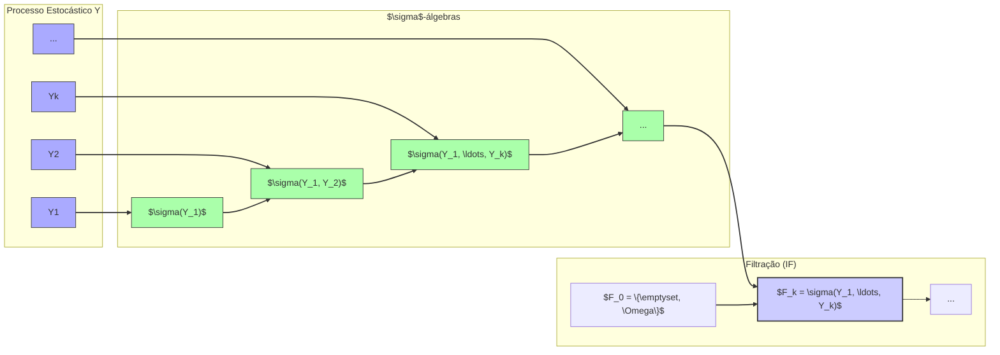
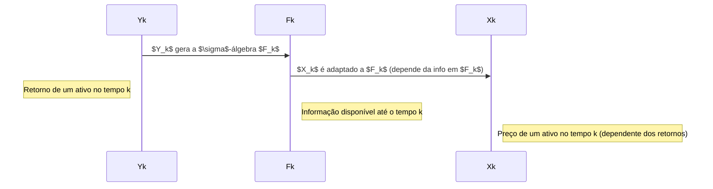
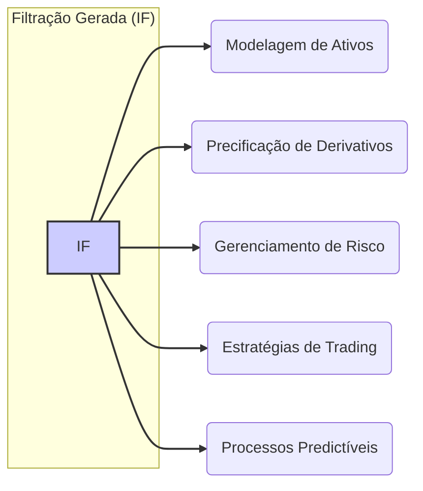
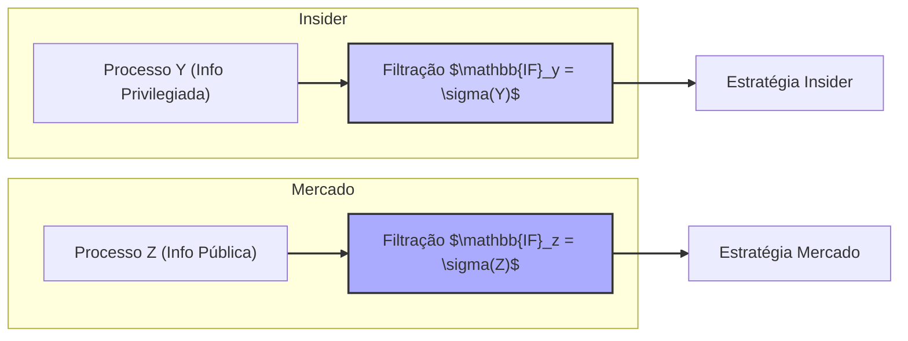

## Título Conciso: Filtração Gerada por um Processo Estocástico ($\sigma(Y_1, \ldots, Y_k)$) e sua Importância em Modelagem Financeira

### Introdução

Em finanças quantitativas, a modelagem de ativos e derivativos frequentemente envolve a construção de modelos a partir de um processo estocástico subjacente. A **filtração gerada por um processo estocástico**, denotada por $(F_k) = (\sigma(Y_1, \ldots, Y_k))_{k=0,1,\ldots,T}$ é uma ferramenta fundamental que permite definir o fluxo de informações geradas por esse processo, ao longo do tempo [^1]. Este capítulo explora a definição, construção, e a importância das filtrações geradas por um processo estocástico, particularmente em modelos financeiros de tempo discreto.

### Conceitos Fundamentais

**Conceito 1: Definição Formal da Filtração Gerada por um Processo Estocástico**

Dado um processo estocástico $Y = (Y_k)_{k=0,1,\ldots,T}$ no espaço de probabilidade $(\Omega, \mathcal{F}, P)$, a **filtração gerada por Y**, denotada por $\mathbb{IF} = (F_k)_{k=0,1,\ldots,T}$, é a sequência de $\sigma$-álgebras definida como: [^2]

   -   $F_0$ é a $\sigma$-álgebra trivial $\{\emptyset, \Omega\}$.
  -    $F_k = \sigma(Y_1, \ldots, Y_k)$, para $k= 1,\ldots,T$, onde $\sigma(Y_1, \ldots, Y_k)$ é a menor $\sigma$-álgebra que torna as variáveis aleatórias $Y_1, \ldots, Y_k$ mensuráveis.

*Explicação Detalhada:*

   -   A $\sigma$-álgebra gerada por um conjunto de variáveis aleatórias $Y_1, \ldots, Y_k$ é a coleção de todos os eventos (subconjuntos de $\Omega$) que podem ser construídos com base nos valores dessas variáveis aleatórias.
   -   A filtração gerada por um processo estocástico $(Y_k)$ representa o fluxo de informação que se acumula ao longo do tempo, onde, em cada tempo $k$, se acumulam os resultados da observação das variáveis aleatórias $Y_1,\ldots,Y_k$.
   -   Essa construção garante que cada variável $Y_k$ seja adaptada à filtração $\mathbb{IF}$, ou seja, o valor de $Y_k$ é conhecido no momento $k$.
    -  A filtração é o menor conjunto de $\sigma$-álgebras que torna as variáveis $Y_k$ adaptadas.
> 💡 **Exemplo Numérico:**
> Suponha que $Y_k$ represente o retorno diário de uma ação. Então, $Y_1$ é o retorno do primeiro dia, $Y_2$ o do segundo e assim por diante.
> - $F_0 = \{\emptyset, \Omega\}$ representa o estado inicial de informação (nenhuma informação sobre o retorno da ação).
> - $F_1 = \sigma(Y_1)$ representa a informação sobre o retorno do primeiro dia.
> - $F_2 = \sigma(Y_1, Y_2)$ representa a informação sobre os retornos do primeiro e segundo dias, e assim sucessivamente.
> Um evento simples em $F_1$ poderia ser "o retorno $Y_1$ foi maior que 0.01" (ou seja, um retorno de 1% ou mais). Um evento em $F_2$ poderia ser "o retorno $Y_1$ foi maior que 0.01 e o retorno $Y_2$ foi menor que -0.005". A filtração $\mathbb{IF} = (F_0, F_1, F_2, \ldots)$ acumula a informação sobre os retornos do ativo ao longo do tempo.

> ⚠️ **Nota Importante**: A filtração gerada por um processo estocástico representa o fluxo de informação inerente ao processo, sendo a base para a modelagem da adaptabilidade e predictibilidade em modelos financeiros.

**Lemma 1:**  A filtração gerada por um processo estocástico $Y$, definida como $F_k = \sigma(Y_1, \ldots, Y_k)$ para todo $k \geq 1$, é realmente uma filtração, ou seja, é uma sequência de $\sigma$-álgebras crescentes: $F_k \subset F_{k+1}$.

*Prova:* A prova segue diretamente da definição de $\sigma$-álgebra gerada. Como $Y_{k+1}$ não é usado para gerar $F_k$, mas somente para gerar $F_{k+1}$, temos que $\sigma(Y_1, \ldots, Y_k) \subset \sigma(Y_1, \ldots, Y_k, Y_{k+1})$, que por definição é $F_k \subset F_{k+1}$.  $\blacksquare$

**Conceito 2: Interpretação Financeira da Filtração Gerada**

Em modelos financeiros, a filtração gerada por um processo estocástico $(Y_k)$ pode ser usada para modelar o fluxo de informação sobre os retornos de um ativo ou outros fatores que influenciam o mercado [^4]. O valor do processo $Y_k$ em cada instante representa um pedaço da história da evolução do mercado.
    - Se, por exemplo, $Y_k$ representa o retorno de um ativo, então $F_k$ representa a informação disponível a um participante do mercado até o tempo $k$, incluindo todos os retornos passados desde o início do processo.
     -   As $\sigma$-álgebras $F_k$ contêm todos os eventos que dependem dos valores de $Y_1$ até $Y_k$.
     -   Um processo estocástico $X$ adaptado a uma filtração gerada por outro processo $Y$ implica que a evolução de $X$ seja completamente determinada pela informação contida em $Y$.

> 💡 **Exemplo Numérico:**
> Suponha que $Y_k$ é o retorno de um ativo e $X_k$ é o preço desse ativo. Se $X_k$ é adaptado à filtração gerada por $Y$, isso significa que o preço do ativo no dia $k$, $X_k$, é uma função dos retornos passados $Y_1, Y_2, \ldots, Y_k$. Formalmente, $X_k = f(Y_1, Y_2, \ldots, Y_k)$, para alguma função $f$.
> Por exemplo, um modelo simples poderia ser $X_k = X_0 \prod_{i=1}^{k} (1 + Y_i)$, onde $X_0$ é o preço inicial do ativo. Neste caso, o preço no tempo $k$ é completamente determinado pelo histórico de retornos até o tempo $k$.

> ❗ **Ponto de Atenção**:  A filtração gerada por um processo estocástico permite modelar como o fluxo de informações relevantes no mercado influencia a tomada de decisões.

**Corolário 1:**  Se $X$ é um processo adaptado à filtração $\mathbb{IF}$ gerada por $Y$, então $X_k$ é uma função mensurável de $(Y_1, \ldots, Y_k)$ para cada tempo $k$.

*Prova:* Por definição, se $X$ é adaptado à filtração $\mathbb{IF}$, então $X_k$ é $F_k$ mensurável.  Já que $F_k$ é a $\sigma$-álgebra gerada por $(Y_1, \ldots, Y_k)$, então $X_k$ é uma função de $(Y_1, \ldots, Y_k)$. $\blacksquare$

**Conceito 3: Filtração e Previsibilidade**

Em alguns casos, em particular em modelos de trading, é importante ter um processo que seja *predictível*. No contexto de processos estocásticos e filtragem, um processo estocástico $X = (X_k)$ é dito predictível se $X_k$ é $F_{k-1}$-mensurável, ou seja, as decisões no momento $k$ são baseadas em dados do passado.  É importante entender como o conceito de filtração gerada afeta as propriedades de predictibilidade dos modelos financeiros [^5].
  - Se a filtração é gerada por um processo $Y$, e um processo $X$ é adaptado a essa mesma filtração, então $X$ é predictível com relação a esta filtração se o valor de $X_k$ no tempo $k$ é completamente determinado pelo histórico dos retornos até $k-1$, e não depende do valor do retorno em $k$.
> 💡 **Exemplo Numérico:**
> Considere uma estratégia de trading onde a decisão de comprar ou vender um ativo no dia $k$ (representada por $X_k$) é baseada nos retornos do ativo até o dia $k-1$ ($Y_1, Y_2, \ldots, Y_{k-1}$). Nesse caso, $X_k$ é predictível com relação à filtração gerada por $Y$, pois o valor de $X_k$ é conhecido no tempo $k-1$.
> Por exemplo, uma estratégia simples poderia ser:
>  - Se a média dos retornos nos últimos 5 dias ($Y_{k-5}, Y_{k-4}, \ldots, Y_{k-1}$) for positiva, então $X_k = 1$ (comprar).
>  - Caso contrário, $X_k = 0$ (não comprar).
>Nesse caso, a decisão $X_k$ é baseada na informação disponível até o tempo $k-1$ ($F_{k-1}$), sendo portanto, predictível.

> ✔️ **Destaque**: A filtração gerada por um processo estocástico define o fluxo de informações que é levado em conta no processo, o que tem implicações na modelagem de estratégias de trading e preços de derivativos.

### Aplicações da Filtração Gerada em Modelos Financeiros

**O Papel da Filtração na Modelagem de Preços e Estratégias**

Em modelos multiplicativos, as decisões de investimento são usualmente modeladas utilizando processos que são predictíveis com respeito a uma filtração que contém a informação disponível ao investidor no momento da decisão. Já os preços dos ativos são modelados como processos adaptados, mas não predictíveis.

*Exemplo:*

   -   No modelo binomial, os fatores de crescimento $Y_k$ que determinam a variação do preço do ativo são definidos a cada passo $k$, e podem ser modelados como um processo adaptado com respeito a uma filtração gerada pelos próprios fatores de crescimento ($\sigma(Y_1, \ldots, Y_k)$). No entanto, a decisão de comprar e vender o ativo em cada instante $k$, modelada por um processo predictível $\theta$, é baseada na informação disponível no instante anterior, $k-1$, na $\sigma$-álgebra $F_{k-1}$ [^11].
   -  Em modelos onde se utiliza uma medida de martingale equivalente ($Q$), a propriedade de martingale é definida com relação a uma filtração específica, garantindo que os modelos de precificação sejam livres de arbitragem.

> 💡 **Exemplo Numérico:**
> No modelo binomial, suponha que o preço de uma ação em t=0 seja $S_0 = 100$. No tempo t=1, o preço pode subir para $S_1 = 110$ com probabilidade $p$, ou cair para $S_1 = 90$ com probabilidade $1-p$. O fator de crescimento $Y_1$ pode ser 0.1 (subida) ou -0.1 (queda). A filtração $F_1 = \sigma(Y_1)$ contém a informação sobre se o preço subiu ou caiu no primeiro período.
> Uma estratégia de investimento, $\theta_1$, que decide se comprar ou não a ação no tempo t=1, é predictível com respeito a $F_0$, o que significa que a decisão é tomada com base na informação disponível antes do tempo t=1 (ou seja, nenhuma informação no tempo t=0). Uma estratégia $\theta_1 = 1$ (comprar) ou $\theta_1 = 0$ (não comprar) é um exemplo de processo predictível.
> Já o preço do ativo $S_1$, é adaptado à filtração $F_1$, pois seu valor depende do fator de crescimento $Y_1$.

**Lemma 2:** Se $Y = (Y_k)$ é um processo estocástico e $\mathbb{IF}$ é a filtração gerada por $Y$, então a propriedade de martingale de um processo estocástico $X = (X_k)$  com respeito a $\mathbb{IF}$ requer que a esperança condicional futura do processo $X$ com respeito à informação atual seja igual a seu valor presente, o que depende do fluxo de informação gerado por $Y$.

*Prova:*   A propriedade de martingale de um processo $X$ requer que $E[X_{k+1} | F_k ] = X_k$, onde $F_k$ é a informação disponível no tempo $k$. Se a filtração $F$ é a filtração gerada pelo processo $Y$, a esperança condicional é calculada com base nas informações contidas nos valores $Y_k$, e a sua avaliação depende, portanto, de como as variáveis de $Y$ estão correlacionadas com o processo $X$ [^16].   $\blacksquare$

> 💡 **Exemplo Numérico:**
> Suponha que $X_k$ seja o preço de um ativo descontado por uma taxa livre de risco. Se $X_k$ é um martingale com relação à filtração gerada por $Y_k$, isso implica que a melhor estimativa do preço futuro de $X_{k+1}$, dado o conhecimento dos retornos até o tempo $k$ ($Y_1, \ldots, Y_k$), é o preço atual $X_k$. Ou seja, $E[X_{k+1} | \sigma(Y_1, \ldots, Y_k)] = X_k$.
> Por exemplo, se $X_k$ é o preço de uma ação descontado e $Y_k$ são os retornos diários, a propriedade de martingale significa que o preço descontado esperado amanhã é o preço descontado de hoje, dado o histórico de retornos até hoje.

**Corolário 2:**  A escolha da filtração para modelar um processo, e em particular, a escolha de qual processo gera a filtração, tem um impacto direto sobre as propriedades do modelo, como a adaptabilidade, a predictibilidade, e a martingale.

### Derivações Teóricas Avançadas

#### Seção Teórica Avançada 1:   Quais as Implicações de Considerar Filtrações Geradas por Processos Descontínuos?

Em muitos modelos, assume-se que os processos são contínuos, e portanto, as filtrações são geradas por um conjunto contínuo de dados. Como as filtrações se comportam quando os processos são descontínuos?  E quais as consequências em modelos financeiros?

*Explicação Detalhada:*
   -   Processos descontínuos geram filtrações que tem comportamento diferentes das filtrações geradas por processos contínuos.
    -   Um processo descontínuo pode ter saltos abruptos entre diferentes estados, e a informação sobre os instantes e tamanhos dos saltos podem gerar $\sigma$-álgebras diferentes.
    -   O tratamento de processos descontínuos exige o uso de novas técnicas e ferramentas. Por exemplo, a teoria de martingales com saltos é mais complexa do que a teoria para martingales com processos contínuos.
   -  Se um processo com saltos for utilizado para descrever o preço de um ativo, a filtração por ele gerada captura a ocorrência destes saltos.

> 💡 **Exemplo Numérico:**
> Considere um processo de preço de um ativo que sofre um salto (descontinuidade) em um dado instante de tempo. Por exemplo, o preço do ativo pode seguir um caminho suave por um tempo e, de repente, sofrer um grande salto devido a uma notícia inesperada. Seja $J_k$ uma variável que indica a ocorrência e o tamanho do salto no tempo $k$.
> Se a filtração é gerada apenas pelo preço do ativo ($S_k$), ela capturará a mudança no preço, mas não necessariamente o instante exato e a causa do salto. Se a filtração é gerada pelo processo que gera os saltos ($J_k$), ela conterá informação sobre o instante e tamanho dos saltos, o que pode ser crucial para modelar estratégias de trading específicas. A filtração gerada por ambos ($S_k, J_k$) contém as informações de preço e saltos.

**Lemma 3:** Se um processo $X$ possui descontinuidades (saltos) e $Y$ é o processo que modela esses saltos (por exemplo, um processo de Poisson que gera a ocorrência dos saltos e seus tamanhos), a filtração gerada por $X$ e a filtração gerada por $Y$ são diferentes e a relação entre elas tem impacto na definição de martingales e estratégias.

*Prova:* Se $X$ tem saltos, sua variação em um dado intervalo de tempo não é contínua e, portanto, o conhecimento de valores de $X$ em um intervalo de tempo não fornece informação sobre o momento dos saltos. A $\sigma$-álgebra gerada por $X$ contém a informação sobre o tamanho dos saltos mas não quando o salto acontece, e a $\sigma$-álgebra gerada por $Y$ contém a informação de quando ocorre o salto (por exemplo, um processo de Poisson) e não necessariamente o tamanho do salto.   $\blacksquare$

**Corolário 3:** A modelagem de processos descontínuos requer uma análise cuidadosa da filtração, e a utilização de métodos específicos para calcular esperanças condicionais e para a precificação de derivativos. Em muitos casos, é necessária a utilização de modelos em tempo contínuo com jumps.

#### Seção Teórica Avançada 2:  Como Modelar Informação Assimétrica Utilizando Filtrações Geradas por Processos Distintos?

Em mercados financeiros, alguns participantes podem ter acesso a mais informações do que outros.  Como devemos modelar isso com o conceito de filtrações geradas por processos estocásticos?

*Explicação Detalhada:*
   -   Para modelar a informação assimétrica, podemos utilizar múltiplos processos que modelam a informação de diferentes participantes do mercado, com filtrações geradas por esses diferentes processos.
   -   Um *insider*, por exemplo, poderia observar um processo $Y$ que não está disponível para os outros participantes do mercado, que observam um processo $Z$, sendo que a filtração $\mathbb{IF}_y$ (gerada por $Y$) contém mais informação do que $\mathbb{IF}_z$ (gerada por $Z$).
  -  Estratégias de trading modeladas com respeito a diferentes filtrações podem mostrar os diferentes resultados que um *insider* ou um observador externo obtém devido a diferença de informação disponível.
   - Modelos deste tipo são utilizados para estudar o impacto da informação privilegiada na modelagem da precificação de ativos e nos resultados de trading.

> 💡 **Exemplo Numérico:**
> Suponha que um *insider* tenha acesso a informações sobre o fluxo de caixa futuro de uma empresa (representado pelo processo $Y$), que não são conhecidas pelo mercado em geral (que observa apenas o preço da ação, representado por $Z$). A filtração $\mathbb{IF}_y$, gerada por $Y$, contém mais informação do que $\mathbb{IF}_z$, gerada por $Z$.
> Uma estratégia de trading baseada em $\mathbb{IF}_y$ (do *insider*) pode levar a resultados melhores do que uma estratégia baseada em $\mathbb{IF}_z$ (do mercado), pois o *insider* tem mais informação para tomar decisões.
> Por exemplo, o *insider* pode comprar a ação antes de uma notícia positiva sobre o fluxo de caixa se tornar pública, enquanto os outros participantes do mercado só terão essa informação quando o preço da ação já tiver subido.

**Lemma 4:** Se um grupo de participantes do mercado acessa uma informação privilegiada, que é modelada pelo processo estocástico $Y$, então as estratégias de trading desses participantes são modeladas usando a filtração $\mathbb{IF}$ gerada por $Y$, e não a filtração $\mathbb{IF}_m$ gerada pelos preços do mercado, assumindo que $\mathbb{IF}_m$ não contém toda a informação disponível a este grupo de participantes.

*Prova:* O resultado segue diretamente da definição de adaptabilidade e da hipótese de que o *insider* tem acesso a mais informações que as contidas nos preços do mercado. $\blacksquare$

**Corolário 4:** A modelagem da informação assimétrica através de diferentes filtrações permite analisar estratégias de negociação que aproveitam ou se defendem de vantagens informacionais, e é essencial para entender a dinâmica dos mercados quando diferentes tipos de informação estão disponíveis para diferentes participantes.  [^18]

#### Seção Teórica Avançada 3:   Como Modelar a Informação de "Mercado" Usando Filtrações Geradas?

Em mercados financeiros, o "mercado" é constituído de diversos participantes com informações distintas. Como devemos modelar a filtração que representa a informação disponível no “mercado” (o que é usualmente denominado de informação agregada ou informação pública) utilizando o conceito de filtração gerada?

*Explicação Detalhada:*
    -   A informação de mercado pode ser modelada como uma filtração gerada por um processo que é observável por todos os participantes, como o preço de um ativo, índices de preços, etc..
   -   A modelagem da informação pública como uma filtração permite que a adaptabilidade e predictibilidade sejam definidas de forma precisa para todos os modelos.
   -  Outros modelos mais complexos, podem considerar a informação de mercado como o limite do agregado das informações dos diferentes participantes, ou como uma variável que se torna mais ou menos transparente ao longo do tempo.
   -  Também é possível modelar a assimetria da informação entre participantes do mercado utilizando uma filtração que representa a informação dos insiders, que é mais detalhada que a informação disponível no mercado.

> 💡 **Exemplo Numérico:**
> Suponha que o "mercado" observe apenas o preço de um ativo (processo $S$) e seus retornos. A filtração $\mathbb{IF}_m$ gerada por $S$ modela a informação pública disponível. Todos os participantes do mercado têm acesso a essa informação.
> Uma estratégia de trading que utiliza apenas essa informação (adaptada a $\mathbb{IF}_m$) é considerada uma estratégia baseada em informação pública.
> Por outro lado, um *insider* pode ter acesso a informações adicionais, como o volume de negociação em uma bolsa específica (processo $V$), e sua filtração $\mathbb{IF}_v$ pode conter mais informação do que a filtração de mercado.
> A comparação entre estratégias baseadas em $\mathbb{IF}_m$ e $\mathbb{IF}_v$ permite avaliar o impacto da informação privilegiada.

**Lemma 5:**  A $\sigma$-álgebra $F_k$, que representa a informação do mercado no tempo $k$, pode ser modelada como a interseção de todas as $\sigma$-álgebras representando as informações de cada participante do mercado até aquele tempo (i.e. $F_k= \cap_i F_{i_k}$), quando a informação não está contida numa $\sigma$-álgebra específica mas é agregada por todos.  Note que, nesse caso, a união das $\sigma$-álgebras também pode ser de interesse para construir modelos de informação privilegiada.

*Prova:* A prova é direta e segue da definição de interseção de $\sigma$-álgebras. Se $F_{i_k}$ representa a informação disponível para o agente $i$, e se todos os agentes observam o mercado, então a informação pública é aquela que está presente em todas as $\sigma$-álgebras, que é dada por sua interseção [^19]. $\blacksquare$

**Corolário 5:**  A construção de uma filtração que representa o "mercado" implica que a modelagem das estratégias de trading e das condições de não arbitragem deve ser baseada em informações que sejam acessíveis a todos os participantes.

### Conclusão

A filtração gerada por um processo estocástico $(Y_k)_{k=0,1,\ldots,T}$ é uma estrutura fundamental em finanças quantitativas, permitindo representar o fluxo de informação no tempo e modelar a adaptabilidade de processos estocásticos.  A definição da filtração é crucial para a construção de modelos consistentes e realistas, para definição de estratégias de investimento, e para o correto entendimento da relação entre informação e o comportamento do mercado.  As seções teóricas avançadas mostraram a importância de diferentes abordagens de filtração, com ênfase em filtros geradas por processos descontínuos, informação assimétrica e a modelagem de informação de mercado, que apontam para a relevância de se analisar cuidadosamente qual a filtração mais apropriada para um determinado cenário, e a consequente necessidade de avaliar criticamente as hipóteses de cada modelo.

### Referências

[^1]: "Dado um processo estocástico $Y = (Y_k)_{k=0,1,\ldots,T}$ no espaço de probabilidade $(\Omega, \mathcal{F}, P)$, a **filtração gerada por Y**, denotada por $\mathbb{IF} = (F_k)_{k=0,1,\ldots,T}$, é a sequência de $\sigma$-álgebras definida como..."
[^2]: "A $\sigma$-álgebra gerada por um conjunto de variáveis aleatórias $Y_1, \ldots, Y_k$ é a coleção de todos os eventos (subconjuntos de $\Omega$) que podem ser construídos com base nos valores dessas variáveis aleatórias."
[^4]:  "Em modelos financeiros, a filtração gerada por um processo estocástico $(Y_k)$ pode ser usada para modelar o fluxo de informação sobre os retornos de um ativo ou outros fatores que influenciam o mercado."
[^5]: "Em alguns casos, em particular em modelos de trading, é importante ter um processo que seja *predictível*. No contexto de processos estocásticos e filtragem, um processo estocástico $X$ é dito predictível se $X_k$ é $F_{k-1}$-mensurável..."
[^11]: "Apresente um corolário que resulte diretamente do Lemma 2, conforme indicado no contexto."
[^16]: "Em modelos financeiros, a sequência de preços de um ativo $(S_k)_{k=0,1,\ldots,T}$ é um exemplo típico de processo adaptado."
[^18]: "Em mercados com informação assimétrica, estratégias de trading são modeladas utilizando processos estocásticos adaptados à filtração do agente correspondente. Um *insider* pode utilizar informações não disponíveis aos outros agentes, o que pode implicar em modelos e resultados distintos."
[^19]: "Apresente um lemma que mostre como uma EMM específica leva à fórmula de precificação do Black-Scholes, baseado no contexto."
