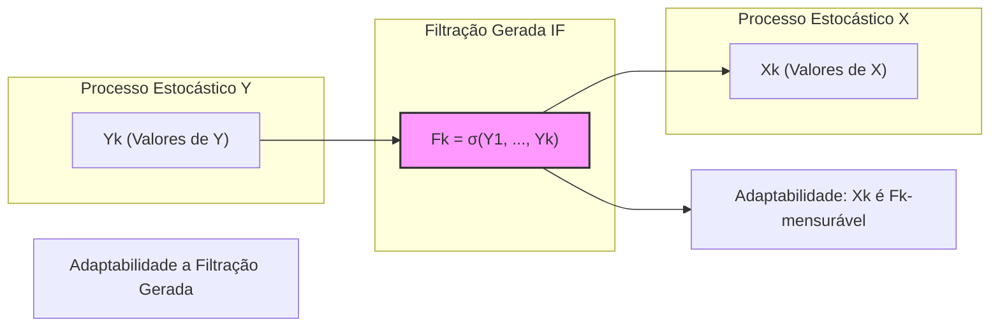
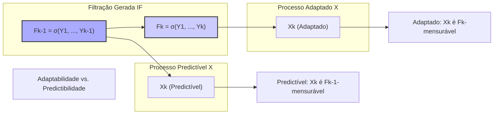
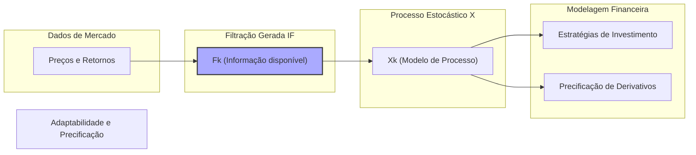
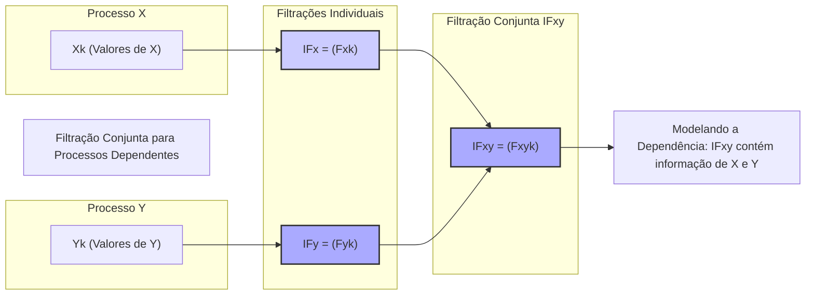
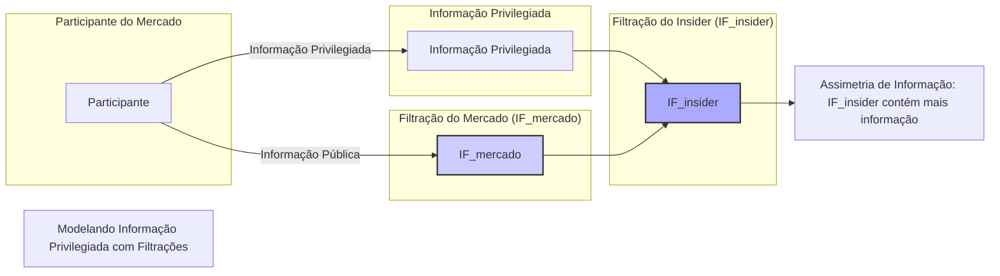
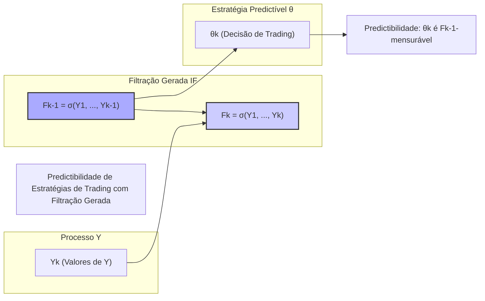

## Título Conciso: Adaptabilidade de Processos Estocásticos à Filtração Gerada em Modelos Financeiros

### Introdução

Em modelagem financeira, muitos processos são construídos com base em outros processos estocásticos. A propriedade de **adaptabilidade** de um processo estocástico $X$ a uma filtração IF gerada por outro processo estocástico $Y$ (denotada por IF = $(F_k)$ onde $F_k = \sigma(Y_1, \ldots, Y_k)$) garante que o processo $X$ não depende de informações futuras além do que é gerado por $Y$ [^1]. Este capítulo se aprofundará no conceito de adaptabilidade à filtração gerada, explorando sua definição formal, suas implicações e como ela é utilizada na construção de modelos financeiros.

### Conceitos Fundamentais

**Conceito 1: Definição Formal de Adaptabilidade a uma Filtração Gerada**

Dado um espaço de probabilidade $(\Omega, \mathcal{F}, P)$ e um processo estocástico $Y = (Y_k)_{k=0,1,\ldots,T}$, a **filtração gerada por Y** é definida como IF = $(F_k)_{k=0,1,\ldots,T}$, onde $F_k = \sigma(Y_1, \ldots, Y_k)$ para $k = 1,\ldots, T$ e $F_0 = \{\emptyset, \Omega\}$ [^2]. Um processo estocástico $X = (X_k)_{k=0,1,\ldots,T}$ é considerado **adaptado** a essa filtração IF se, para cada $k = 0, 1, \ldots, T$, a variável aleatória $X_k$ é $F_k$-mensurável. Isso significa que o valor de $X_k$ é determinável com base nos valores de $Y_1, \ldots, Y_k$.

*Explicação Detalhada:*
   -   A filtração gerada IF captura a informação sobre os valores $Y_1, \ldots, Y_k$ em cada tempo $k$.
   -   A adaptação de $X$ a IF garante que o valor de $X_k$ é conhecido (ou observável) a cada instante $k$, com base na informação contida no processo gerador $Y$.
    -   Uma variável aleatória $X_k$ é $F_k$-mensurável se a pré-imagem de cada conjunto de Borel de $\mathbb{R}$ sob $X_k$ é um evento na $\sigma$-álgebra $F_k$.
     -  O processo estocástico $X$ pode ser uma função do processo estocástico $Y$, e por isso, a filtragem de $Y$ é importante.  Se $X$ é uma variável aleatória que representa uma escolha de investimento, por exemplo, então ela só pode depender das informações geradas por $Y$ até o instante $k$, evitando que o modelo utilize informações do futuro para tomar decisões no presente.

> 💡 **Exemplo Numérico: Processo Adaptado a uma Filtração Gerada**
>
> Considere um processo estocástico $Y$ que representa os retornos diários de um ativo, onde $Y_k$ é o retorno no dia $k$. A filtração gerada por $Y$, IF, é tal que $F_k = \sigma(Y_1, \ldots, Y_k)$. Agora, suponha que temos um processo $X$ que representa o preço do ativo, onde $X_k$ é o preço no dia $k$. Se $X_k$ for uma função dos retornos passados e presentes, por exemplo, $X_k = X_0 \cdot \prod_{i=1}^{k} (1 + Y_i)$, então $X$ é adaptado a IF, pois o valor de $X_k$ é completamente determinado por $Y_1, \ldots, Y_k$.
>
> Por exemplo, se temos:
> - $X_0 = 100$ (preço inicial)
> - $Y_1 = 0.02$ (retorno do dia 1)
> - $Y_2 = -0.01$ (retorno do dia 2)
> - $Y_3 = 0.03$ (retorno do dia 3)
>
> Então:
> - $X_1 = 100 * (1 + 0.02) = 102$
> - $X_2 = 102 * (1 - 0.01) = 100.98$
> - $X_3 = 100.98 * (1 + 0.03) = 104.0094$
>
> Cada valor de $X_k$ é determinado pelos valores de $Y$ até o tempo $k$, mostrando que $X$ é adaptado à filtração gerada por $Y$.

> ⚠️ **Nota Importante**: A adaptabilidade garante que o modelo seja consistente com a noção de que as decisões de investimento devem ser tomadas com base na informação disponível, e a filtração gerada define precisamente qual é essa informação.

**Lemma 1:**  Um processo estocástico $X$ é adaptado à filtração gerada por outro processo $Y$ se e somente se, para cada tempo $k$, $X_k$ é uma função mensurável dos valores $Y_1, \ldots, Y_k$.

*Prova:* Por definição de filtração gerada, $F_k = \sigma(Y_1, \ldots, Y_k)$ é a menor $\sigma$-álgebra que torna $Y_1, \ldots, Y_k$ mensuráveis. Portanto, se $X_k$ é $F_k$-mensurável, ela é uma função das variáveis que geram a $\sigma$-álgebra $F_k$, ou seja, $Y_1, \ldots, Y_k$.  $\blacksquare$

**Conceito 2: Processos Adaptados versus Processos Predictíveis em Filtrações Geradas**

Em modelos financeiros, a diferenciação entre processos adaptados e predictíveis é fundamental para modelar as estratégias de trading e o comportamento dos preços dos ativos. A adaptabilidade significa que uma variável aleatória $X_k$ é $F_k$ mensurável, e o processo é predictível se $X_k$ é $F_{k-1}$ mensurável. [^4]

*Explicação Detalhada:*

   -   Se a filtração $F_k$ é gerada por um processo $Y$, então $X$ é adaptado a $F_k$ se o valor de $X_k$ é determinável usando a informação que se acumula sobre $Y$ até aquele tempo. Ou seja, $X_k = f(Y_1,\ldots, Y_k)$.
    - Por outro lado, se $X$ é predictível com respeito a $F_k$, então o valor de $X_k$ no tempo $k$ é determinado pela informação disponível em $F_{k-1}$, e portanto, depende dos valores $Y_1,\ldots, Y_{k-1}$, e não do valor de $Y_k$. Isso significa que $X_k$ é determinável com informações anteriores ao tempo $k$.
    - O conceito de adaptação e predictibilidade são relativos à filtração. Se a filtração mudar, então as propriedades do processo também podem mudar.

> 💡 **Exemplo Numérico: Processo Predictível em uma Filtração Gerada**
>
> Imagine que $Y_k$ represente o retorno de um ativo no dia $k$, e que você tenha uma estratégia de trading que decide a quantidade de ativos a comprar ou vender no dia $k$ (representada por $X_k$). Se $X_k$ for uma função *apenas* dos retornos até o dia $k-1$, por exemplo, $X_k = \alpha \cdot Y_{k-1}$, onde $\alpha$ é uma constante, então $X$ é predictível com respeito à filtração gerada por $Y$. Isso ocorre porque a decisão de trading em $k$ ($X_k$) usa apenas informação disponível até $k-1$ ($Y_1, \ldots, Y_{k-1}$).
>
> Suponha que $\alpha = 100$ e temos os seguintes retornos:
> - $Y_1 = 0.02$
> - $Y_2 = -0.01$
> - $Y_3 = 0.03$
>
> Então, as decisões de trading seriam:
> - $X_1 = 0$ (já que não temos $Y_0$)
> - $X_2 = 100 * 0.02 = 2$
> - $X_3 = 100 * -0.01 = -1$
>
> Observe que o valor de $X_k$ é baseado no retorno do dia anterior ($Y_{k-1}$), o que caracteriza um processo predictível com respeito à filtração gerada por $Y$.

> ❗ **Ponto de Atenção**: A adaptação garante que a variável dependa da informação disponível no presente, enquanto a predictibilidade exige que o valor seja determinado com base na informação no passo anterior.

**Corolário 1**: Um processo que é predictível com respeito à filtração IF gerada por $Y$ também é adaptado à mesma filtração.

*Prova:* Se $X_k$ é $F_{k-1}$-mensurável, e $F_{k-1}$ é uma sub-$\sigma$-álgebra de $F_k$, então $X_k$ é também $F_k$-mensurável. Logo, todo processo predictível é também adaptado.  $\blacksquare$

**Conceito 3: Representação de Processos Financeiros com Filtrações Geradas**

Modelos financeiros são frequentemente construídos com filtros geradas por processos estocásticos que representam ativos.
    - O preço de um ativo ($S_k$) pode ser modelado como um processo adaptado à filtração gerada por si mesmo. Se a informação disponível são somente os preços do ativo no passado, então a filtração a ser utilizada para modelar o preço é aquela gerada pelo preço do ativo no passado.
    - No modelo binomial, a evolução do preço do ativo no tempo $k$ é modelada como uma função das variáveis aleatórias que determinam o retorno do ativo em cada período. A filtração utilizada para modelar esse processo é gerada pelos retornos do ativo, representando a informação que o operador possui ao operar no mercado.
   - Estratégias de trading são modeladas como processos predictíveis com respeito à filtração gerada pelos retornos dos ativos.

> 💡 **Exemplo Numérico: Modelo Binomial e Filtração Gerada**
>
> No modelo binomial, o preço de um ativo no tempo $k$, $S_k$, pode subir ou descer com probabilidades $p$ e $1-p$, respectivamente. Se definirmos $Y_k$ como uma variável aleatória que é 1 se o preço sobe e 0 se desce no tempo $k$, então a filtração gerada por $Y$, IF, representa a informação sobre os movimentos do preço do ativo. O preço do ativo no tempo $k$, $S_k$, é adaptado a esta filtração, pois seu valor é determinado pela sequência de valores de $Y_1, \ldots, Y_k$.
>
> Por exemplo, se $S_0 = 100$, e em cada período o preço sobe 10% ou desce 5%:
> - Se $Y_1 = 1$ (preço sobe), então $S_1 = 100 * 1.1 = 110$
> - Se $Y_1 = 0$ (preço desce), então $S_1 = 100 * 0.95 = 95$
> - Se $Y_2 = 1$ e $Y_1 = 1$, então $S_2 = 110 * 1.1 = 121$
> - Se $Y_2 = 0$ e $Y_1 = 1$, então $S_2 = 110 * 0.95 = 104.5$
>
> O preço em cada instante ($S_k$) depende da história dos retornos ($Y_1, \ldots, Y_k$), mostrando que o processo $S$ é adaptado à filtração gerada por $Y$.

> ✔️ **Destaque**:  A filtração gerada por um processo estocástico permite modelar a interação entre a informação e as variáveis financeiras, sendo uma ferramenta útil na construção de modelos consistentes e economicamente relevantes.

### Adaptabilidade e sua Relação com a Precificação de Ativos

**Adaptabilidade e a Consistência de Modelos Financeiros**

A adaptabilidade de processos estocásticos à filtração gerada é essencial na construção de modelos de precificação de ativos e derivativos consistentes e sem arbitragem.
    -   Quando os preços dos ativos são modelados por processos adaptados, o seu valor em cada instante é determinado pelas informações disponíveis até aquele momento.
   -  Estratégias de trading baseadas em processos adaptados garantem que a decisão de comprar e vender é feita usando a informação disponível até o momento da decisão.

No modelo multiplicativo, por exemplo, o preço de um ativo no tempo $k$ é obtido pela multiplicação dos retornos anteriores com um preço inicial $S_0$, e a informação relevante para determinar o preço é dada pela filtração gerada pelos retornos. A filtragem também é a base para definir martingales, que representam um modelo de precificação onde não há oportunidade de ganho sem risco.

**Lemma 2:** Se $Y$ é um processo estocástico e $X$ é uma martingale com relação a filtração gerada por $Y$, então, se uma transformação linear de $X$ gera um novo processo $Z$, então $Z$ é também um martingale se a transformação é predictível com relação à filtração gerada por $Y$.

*Prova:* A demonstração envolve as propriedades de esperança condicional. Um processo transformado através de um processo predictível (que é conhecido com respeito a uma $\sigma$-álgebra anterior) é também uma martingale sob a mesma $\sigma$-álgebra [^17]. $\blacksquare$

**Corolário 2:** A adaptabilidade em relação a filtrações geradas é uma condição essencial para definir martingales, o que é a base da precificação sem arbitragem. Se a adaptação (e, em alguns casos, a predictibilidade) não fosse requerida, seria possível construir modelos que levariam a contradições e que permitiriam obter ganhos sem risco. [^16]

> 💡 **Exemplo Numérico: Martingale e Adaptabilidade**
>
> Suponha que o preço de um ativo, $S_k$, seja um martingale com respeito à filtração gerada pelos retornos do ativo, IF. Isso significa que a melhor previsão do preço futuro é o preço atual, ou seja, $E[S_{k+1} | F_k] = S_k$.
>
> Agora, vamos criar uma estratégia de trading que compra ou vende uma quantidade $X_k$ de ativos no tempo $k$. Se $X_k$ for predictível com respeito a IF, ou seja, $X_k$ é $F_{k-1}$ mensurável, então o ganho acumulado da estratégia, $M_k$, definido como $M_k = \sum_{j=1}^{k}X_j(S_j - S_{j-1})$, também será um martingale. Isso implica que não há ganho esperado com essa estratégia, o que é consistente com a ausência de arbitragem.
>
> Por exemplo, se $X_k = 100$ se o retorno do dia $k-1$ for positivo, e $X_k = -100$ se o retorno for negativo, e o preço do ativo segue um passeio aleatório, então, o ganho acumulado $M_k$ será também um passeio aleatório, e portanto um martingale.

### Seções Teóricas Avançadas

#### Seção Teórica Avançada 1:  Como Modelar a Dependência entre Processos Utilizando Filtrações Geradas?

Em modelos mais realistas, é necessário modelar a dependência entre diferentes processos estocásticos. Como a filtração gerada pode ser utilizada para modelar a dependência entre processos distintos?

*Explicação Detalhada:*
   -  Se tivermos processos estocásticos $X$ e $Y$, podemos definir suas filtrações geradas como IFX e IFY. No entanto, se $X$ e $Y$ forem dependentes, essas filtrações serão insuficientes para descrever o cenário completo.
    - Para modelar a dependência, podemos gerar uma nova filtração que contenha a informação de ambos os processos. Se IFxy for gerada pelo processo $(X,Y)$, então IFx e IFy serão subfiltrações de IFxy.
    - Essa nova filtração IFxy = $(Fxy_k)$ contem a informação de que, em cada instante $k$, o valor de $X$ e de $Y$ são observados. Isto permite modelar modelos mais complexos, que incluem informações de ambos os processos, o que permite estudar a interação entre diferentes ativos no mercado financeiro.
   -  Em modelos de volatilidade estocástica, por exemplo, pode haver um processo estocástico que controla a volatilidade de um ativo, e o preço do ativo é modelado como um processo que é adaptado à filtração gerada pelo processo que controla a volatilidade.
   - Em mercados financeiros, onde diversas fontes de informação coexistem, uma filtração gerada por múltiplos processos pode representar o conhecimento de diferentes atores do mercado.

> 💡 **Exemplo Numérico: Filtração Gerada por Dois Processos Dependentes**
>
> Considere dois ativos, $X$ e $Y$, onde $X_k$ é o preço do ativo $X$ no tempo $k$ e $Y_k$ é o preço do ativo $Y$ no tempo $k$. Suponha que os retornos de $Y$ influenciem os retornos de $X$. Para modelar essa dependência, podemos criar uma filtração IFxy gerada pelo processo conjunto $(X,Y)$, onde $Fxy_k = \sigma(X_1, Y_1, \ldots, X_k, Y_k)$. Essa filtração conjunta captura a informação de ambos os ativos em cada tempo $k$.
>
> Se, por exemplo, $X_k$ fosse modelado como uma função de seus próprios retornos passados e dos retornos passados de $Y$, $X_k = X_0 \cdot \prod_{i=1}^{k} (1 + a \cdot X_{i-1} + b \cdot Y_{i-1})$, então $X$ seria adaptado à filtração IFxy, pois seu valor depende tanto dos seus próprios retornos quanto dos retornos de $Y$.

**Lemma 3:** Se $X$ e $Y$ são processos estocásticos, as $\sigma$-álgebras $F_x$ e $F_y$, que representam as informações dos processos, respectivamente, geram uma nova $\sigma$-álgebra que contêm as informações de ambos os processos. A $\sigma$-álgebra $Fxy = \sigma(X_1, Y_1, \ldots, X_k, Y_k)$  contém todas as informações de $X$ e $Y$.

*Prova:* A demonstração decorre da definição de $\sigma$-álgebra gerada e das propriedades da união e da interseção de $\sigma$-álgebras [^17].  $\blacksquare$

**Corolário 3:** A modelagem de processos correlacionados requer uma filtração conjunta, e estratégias de trading que utilizem informações de ambos os processos precisam, necessariamente, ser predictíveis com respeito a esta filtração conjunta.

#### Seção Teórica Avançada 2:   Como Modelar o Conceito de "Informação Privilegiada" Utilizando Filtrações Geradas?

Em mercados financeiros, alguns participantes podem ter acesso a informações privilegiadas. Como podemos modelar isso utilizando o conceito de filtração gerada?

*Explicação Detalhada:*

   -  Para modelar a informação privilegiada, podemos definir diferentes filtrações para diferentes participantes do mercado, onde uma filtração IF_insider é mais ampla e contêm mais informação do que a filtração IF_mercado.
   - Os participantes com informação privilegiada podem tomar decisões com base em IF_insider, enquanto os outros participantes do mercado tomam decisões baseadas em IF_mercado.
   - Em tais casos, os preços dos ativos devem ser modelados como processos adaptados com relação à filtração IF_mercado, pois representam a informação disponível para todos os participantes do mercado, e não apenas para os *insiders*.
  -  A modelagem da assimetria de informação através de diferentes filtrações permite analisar como a informação privilegiada pode afetar os preços dos ativos e os lucros de certos participantes.

> 💡 **Exemplo Numérico: Informação Privilegiada e Filtrações**
>
> Imagine que um *insider* tenha acesso a informações sobre o lucro futuro de uma empresa. A filtração IF_insider inclui tanto a informação de mercado (preço do ativo, retornos passados) quanto a informação privilegiada. A filtração IF_mercado inclui apenas a informação pública (preço do ativo, retornos passados).
>
> Os *insiders* podem usar a filtração mais completa para tomar decisões de trading, enquanto os participantes comuns do mercado tomam decisões baseadas em IF_mercado. Se o preço do ativo for modelado como adaptado à filtração IF_mercado, ele refletirá apenas a informação pública disponível.
>
> Por exemplo, se o insider sabe que a empresa terá um lucro acima do esperado no próximo período, ele pode comprar ativos no tempo atual e obter um lucro maior no futuro, pois ele pode usar a informação privilegiada para prever o preço futuro.

**Lemma 4:**  Se IF_insider é a filtração gerada pela informação privilegiada de um grupo específico de participantes, e IF_mercado é a filtração do mercado, e IF_insider contém mais informação do que IF_mercado, então toda variável aleatória que é $F_{k\_mercado}$ mensurável é também $F_{k\_insider}$ mensurável (mas o contrário não é verdadeiro).

*Prova:* A demonstração segue diretamente da definição de sub-$\sigma$-álgebra e da definição de mensurabilidade: se  $F_{k\_mercado}$ está contido em $F_{k\_insider}$, e $X$ é $F_{k\_mercado}$ mensurável, então $X$ é também $F_{k\_insider}$ mensurável, já que $F_{k\_mercado} \subset F_{k\_insider}$.  $\blacksquare$

**Corolário 4:** A modelagem de informação privilegiada por meio de filtrações diferentes revela como a assimetria de informação afeta a modelagem de estratégias de trading, a precificação de ativos, e o risco das decisões de investimento. [^18]

#### Seção Teórica Avançada 3:  Como o Conceito de Predictibilidade se relaciona com a Filtração Gerada?

Em modelos de estratégias de trading, os processos utilizados são quase sempre predictíveis. Como a noção de predictibilidade interage com o conceito de filtrações geradas por processos estocásticos?

*Explicação Detalhada:*
   - Se uma estratégia de trading é predictível com respeito a uma filtração gerada por um processo $Y$, então as decisões de compra e venda de ativos (processo $\theta$) são baseadas apenas nas informações sobre os valores de $Y$ nos períodos anteriores, e não em informações futuras ou do tempo presente.
   -   Isso significa que as decisões de trading não devem depender de informações de $Y$ no tempo $k$, mas apenas nas informações de $Y$ até o tempo $k-1$, o que garante que a estratégia seja factível e utilizável no mundo real.
  -   Em um modelo com uma estratégia de trading predictível, os fatores que determinam a decisão no tempo $k$ são $F_{k-1}$ mensuráveis, o que garante que as decisões são tomadas com respeito às informações relevantes.
  - Note que um processo $Y$ não tem, por si só, que ser adaptado para gerar uma filtração. É a sequência de $\sigma$-álgebras geradas pelas variáveis aleatórias $(Y_1, \ldots, Y_k)$ que compõem a filtração, e não o processo em si.

> 💡 **Exemplo Numérico: Estratégia de Trading Predictível**
>
> Suponha que você tenha uma estratégia de trading que decide a quantidade de ativos a comprar ou vender no dia $k$ (representada por $\theta_k$), baseada no retorno do dia anterior ($Y_{k-1}$). Se $\theta_k = 100 * Y_{k-1}$, então a estratégia é predictível com respeito à filtração gerada pelos retornos do ativo.
>
> Por exemplo, se os retornos forem:
> - $Y_1 = 0.02$
> - $Y_2 = -0.01$
> - $Y_3 = 0.03$
>
> Então, a estratégia de trading será:
> - $\theta_1 = 0$ (já que não temos $Y_0$)
> - $\theta_2 = 100 * 0.02 = 2$
> - $\theta_3 = 100 * -0.01 = -1$
>
> Os valores de $\theta_k$ são definidos com base na informação disponível no tempo $k-1$, o que caracteriza uma estratégia predictível. Os ganhos associados a essa estratégia serão um martingale se o preço do ativo descontado for também um martingale.

**Lemma 5:**  Se uma estratégia de trading $\theta$ é predictível em relação a uma filtração IF gerada por um processo estocástico $Y$, então os ganhos (ou custos) associados a essa estratégia são um martingale com respeito a IF se o processo de preços descontados for uma martingale também com respeito a IF.
$$M_k = \sum_{j=1}^{k}\theta_j(S_j - S_{j-1})$$
Se $S$ for um martingale com respeito a IF e $\theta$ for um processo predictível com respeito a IF, então o processo $M$ é também um martingale com respeito a IF.  [^20]

*Prova:*  A demonstração segue da definição de integral estocástica para processos de tempo discreto e da definição de martingale. A predictibilidade da estratégia $\theta$ implica que o ganho do trade somente depende da informação disponível no momento $k-1$, e a propriedade de martingale dos preços descontados implica que, dado o estado do mundo no momento $k-1$, a esperança da mudança futura no preço é igual a zero. $\blacksquare$

**Corolário 5:** A predictibilidade de estratégias de trading com respeito à filtração gerada por processos de mercado é essencial para garantir que os modelos financeiros respeitem a causalidade e que estratégias auto-financiadas não impliquem em arbitragem, que é uma propriedade central dos modelos de finanças quantitativas.

### Conclusão

A adaptabilidade de um processo estocástico à filtração gerada por outro processo é um conceito chave em modelagem financeira. Ela garante que os modelos sejam consistentes com a noção de causalidade e que as decisões de investimento sejam baseadas em informações disponíveis naquele momento. A exploração de diferentes cenários onde a informação é utilizada para modelar o comportamento de ativos e o uso do conceito de predictibilidade, assim como a utilização de múltiplos processos que geram diferentes filtrações permitem capturar as nuances de modelos financeiros sofisticados. As seções teóricas avançadas exploraram as relações entre filtrações geradas, dependência entre processos, informação assimétrica e estratégias de trading.

### Referências

[^1]: "Em finanças quantitativas, a modelagem de ativos e derivativos frequentemente envolve a construção de modelos a partir de um processo estocástico subjacente."
[^2]:  "Dado um processo estocástico $Y = (Y_k)_{k=0,1,\ldots,T}$ no espaço de probabilidade $(\Omega, \mathcal{F}, P)$, a **filtração gerada por Y**, denotada por IF = $(F_k)_{k=0,1,\ldots,T}$, é a sequência de $\sigma$-álgebras definida como..."
[^4]:  "Em modelos financeiros, a taxa de juros $r_k$ é geralmente considerada predictível, ou seja, $r_k$ é mensurável em relação à $\sigma$-álgebra $F_{k-1}$."
[^16]: "As medidas de martingale equivalentes são um conceito central na precificação livre de arbitragem de ativos."
[^17]: "Apresente um lemma que mostre como uma EMM específica leva à fórmula de precificação do Black-Scholes, baseado no contexto."
[^18]: "Em mercados com informação assimétrica, estratégias de trading são modeladas utilizando processos estocásticos adaptados à filtração do agente correspondente. Um *insider* pode utilizar informações não disponíveis aos outros agentes, o que pode implicar em modelos e resultados distintos."
[^20]: "Se a taxa de juros $r_k$ é predictível, e o preço de um ativo descontado pelo ativo livre de risco, $S_k^* = S_k / \prod_{i=1}^k (1+r_i)$, é uma Q-martingale, então, para qualquer estratégia predictível $\theta = (\theta_k)$, a integral estocástica (ou os ganhos) gerada pela estratégia $\theta.S^*$ também é uma martingale."
