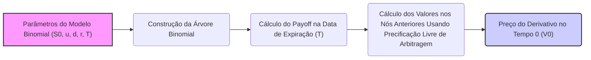

## Título Conciso: Modelo Binomial em Finanças Quantitativas: Uma Abordagem Detalhada

```mermaid
graph LR
    A[Início: Preço do Ativo S0] --> B(Período 1: S0*(1+u) ou S0*(1+d));
    B --> C(Período 2: Preços possíveis);
    C --> D(Período T: Preços possíveis);
    D --> E[Fim: Preços em T];
    style A fill:#f9f,stroke:#333,stroke-width:2px
    style E fill:#ccf,stroke:#333,stroke-width:2px
    linkStyle 0,1,2,3 stroke:#333,stroke-width:1px
    
```

### Introdução

Em finanças quantitativas, o **modelo binomial** é uma ferramenta fundamental para entender a precificação de opções e outros derivativos em tempo discreto [^1]. Este modelo, caracterizado por sua simplicidade e intuição, oferece uma estrutura clara para descrever como o preço de um ativo pode evoluir ao longo do tempo, em que o preço de um ativo pode subir ou descer a cada período com probabilidades definidas. Este capítulo se aprofundará na definição, construção, aplicações e limitações do modelo binomial, fornecendo uma base sólida para estudos mais avançados.

### Conceitos Fundamentais

**Conceito 1: A Estrutura do Modelo Binomial**

O modelo binomial é um modelo de tempo discreto para representar a evolução do preço de um ativo, dividindo o tempo em intervalos discretos. Ele assume que, em cada período, o preço do ativo pode se mover para cima (um aumento) ou para baixo (uma redução), cada um com sua probabilidade associada. A sequência de eventos é representada através de uma árvore binomial [^2].

*Explicação Detalhada:*

   -   O modelo começa com o preço do ativo no tempo inicial, $S_0$.
   -  A cada intervalo de tempo, o preço do ativo ($S_k$) pode ser multiplicado por um fator de crescimento $(1+u)$ ou um fator de redução $(1+d)$, gerando um preço do ativo no instante seguinte ($S_{k+1}$). A variável $u$ representa o valor (taxa) de aumento do preço e $d$ representa o valor de redução, o que implica, por construção, que $(1 + u) > 1$ e $(1 + d) < 1$.
   - O modelo é definido sobre um espaço de probabilidade $(\Omega, F, P)$ que captura as diferentes trajetórias da evolução do preço. As possíveis trajetórias formam uma árvore binomial.
   - As probabilidades de subir ou descer em cada período são constantes, e geralmente indicadas como $p$ (probabilidade de alta) e $1-p$ (probabilidade de baixa). Em modelos mais sofisticados, estas probabilidades também poderiam depender do estado do mercado.
   -   Em modelos com $T$ períodos, há $T + 1$ possíveis valores para o preço do ativo no tempo $T$.

> 💡 **Exemplo Numérico:**
> Suponha que o preço inicial de uma ação seja $S_0 = \$100$. Em um modelo binomial de 2 períodos, o preço pode subir 10% ($u = 0.1$) ou cair 5% ($d = -0.05$) em cada período.
> - Após o primeiro período, o preço pode ser $S_{1\_up} = \$100 * (1 + 0.1) = \$110$ ou $S_{1\_down} = \$100 * (1 - 0.05) = \$95$.
> - Após o segundo período, o preço pode ser $S_{2\_upup} = \$110 * 1.1 = \$121$, $S_{2\_updown} = \$110 * 0.95 = \$104.5$, $S_{2\_downup} = \$95 * 1.1 = \$104.5$, ou $S_{2\_downdown} = \$95 * 0.95 = \$90.25$.
>
> Isto gera uma árvore binomial com 3 valores possíveis no tempo $T=2$: $121, $104.5 e $90.25.

> ⚠️ **Nota Importante**: O modelo binomial simplifica a complexidade da evolução dos preços, usando uma árvore com dois resultados possíveis em cada passo, permitindo uma análise tratável.

**Lemma 1:**  Em um modelo binomial de $T$ períodos, existem $2^T$ possíveis trajetórias para o preço do ativo, e o modelo é caracterizado por $T+1$ nós terminais (preços na data de expiração).

*Prova:* A cada período, cada nó se divide em dois, gerando uma estrutura em árvore com 2 ramificações, e portanto, o número de nós finais é igual a $2^T$.  Em cada um dos níveis da árvore há $(T, k)$ nós, que corresponde ao número de caminhos no nível $k$ que chegam no ponto de partida, onde $(T, k)$ representa o coeficiente binomial e que indica o número de combinações de $k$ entre $T$ eventos.  $\blacksquare$

> 💡 **Exemplo Numérico:**
> Para um modelo binomial com $T = 3$ períodos, existem $2^3 = 8$ possíveis trajetórias para o preço do ativo. Os nós terminais (no tempo $T=3$) são $3+1 = 4$.

**Conceito 2: Fatores de Crescimento e Desconto**

No modelo binomial, os fatores de crescimento ou decréscimo do preço de um ativo são representados por $(1 + u)$ e $(1 + d)$ [^3].
  -  Para uma modelagem consistente, é necessário também introduzir um ativo sem risco ou bank account que cresce de acordo com um fator $(1 + r)$ em cada período. O fator $(1 + r)$ é interpretado como a taxa de juros livre de risco.
  - Para realizar a precificação dos ativos e derivativos, é fundamental utilizar uma medida de probabilidade que garanta que o processo descontado do ativo seja uma martingale, e isto é obtido através de um ajuste no valor da probabilidade $p$ do modelo, que passa a ser denotada por $q$.
  - Os fatores de desconto são utilizados para descontar os valores futuros do ativo e do derivativo para calcular o preço no tempo presente. O valor de um ativo no tempo $k$ deve ser descontado para o tempo presente com o valor $(1 + r)^k$.

*Explicação Detalhada:*

   -  A utilização de fatores de crescimento multiplicativos captura o fato de que os preços de ativos evoluem em termos proporcionais.
    -   Os fatores de crescimento devem garantir que o preço seja sempre positivo, logo $(1 + u) > 0$ e $(1 + d) > 0$.
    -   O fator de desconto, que também é multiplicativo, traduz a ideia de que dinheiro recebido no futuro tem menor valor do que dinheiro recebido hoje.
   - O modelo binomial é uma forma simples de modelar as taxas de juros e a sua influência na precificação de ativos.

> 💡 **Exemplo Numérico:**
> Se a taxa de juros livre de risco é de 5% por período ($r = 0.05$), um valor de $100 recebido no final do primeiro período, tem um valor presente de $100 / (1 + 0.05) = \$95.24$. No final do segundo período, o valor presente de $100 é de $100 / (1.05)^2 = \$90.70$.

> ❗ **Ponto de Atenção**: Os fatores de crescimento e desconto são fundamentais para capturar o comportamento dos ativos ao longo do tempo e para realizar a precificação dos mesmos de forma consistente.

**Corolário 1:** O preço de um ativo no tempo $k$ é sempre positivo e assume um número discreto de valores, dado que os fatores de retorno e o preço inicial são positivos e o número de instantes do tempo é finito.

*Prova:* Se o preço inicial é positivo, e os fatores de crescimento são positivos, então o preço do ativo é uma multiplicação de fatores positivos e é, portanto, um valor positivo.  Como existem um número finito de retornos, o número de preços possíveis é finito.  $\blacksquare$

**Conceito 3: A Importância da Medida Risk-Neutral**

Em modelos de precificação de derivativos, a utilização da medida de martingale equivalente (Q) é crucial [^4].  A mudança da probabilidade $p$ para a probabilidade $q$ garante que o preço do ativo descontado é um martingale e que, portanto, o modelo não admite arbitragem, e é feita através da derivada de Radon-Nikodym. A medida Q é também denominada risk-neutral measure, pois é como se os participantes do mercado não tivessem preferência por risco e os ativos crescessem à taxa de juros livre de risco.
    -   Sob a medida Q, o valor esperado do preço futuro do ativo descontado é igual ao preço presente.
   - A medida de probabilidade Q é utilizada para precificar derivativos e para estudar o comportamento do ativo em um ambiente livre de arbitragem.
    - A medida Q é utilizada somente para precificação (calculo de esperanças), mas não para simulação, pois esta é uma medida artificial que captura as relações dos preços sem capturar o comportamento real do mercado.

> 💡 **Exemplo Numérico:**
> Suponha que em um modelo binomial de um período, o preço de um ativo possa subir de $100 para $110 ($u=0.1$) ou cair para $95 ($d=-0.05$). A taxa livre de risco é 5% ($r=0.05$). A probabilidade real de alta é $p=0.6$.
>
> Para precificação, usamos a probabilidade $q$ que torna o ativo descontado uma martingale.  Neste caso, $q$ = (1.05 - 0.95) / (1.10 - 0.95) = 0.6667. Usando $q$, o valor esperado do preço do ativo no próximo período, descontado, é:
>
>  $[0.6667 * \$110 + (1 - 0.6667) * \$95] / 1.05 = \$100$.  Este valor é igual ao preço do ativo no período atual.

> ✔️ **Destaque**:  A mudança para a medida de martingale equivalente é essencial para garantir que o modelo não apresente arbitragem, que significa que não haja oportunidades de obter ganhos sem risco.

### O Modelo Binomial na Prática: Preços de Ativos e Opções



**A Aplicação do Modelo Binomial na Precificação de Opções**

Um dos principais usos do modelo binomial é a precificação de opções, e também pode ser usado para precificação de outros derivativos. O modelo assume que o preço do derivativo no tempo $k$ é uma função do preço do ativo subjacente no tempo $k$ [^5]. A precificação é feita usando um procedimento recursivo chamado *backward induction*, que começa com o payoff do derivativo no instante final e retrocede no tempo até o instante inicial.
No tempo final $T$, o valor do derivativo é dado por seu payoff, que é uma função do valor do ativo em $T$, $H(S_T)$.
O valor do derivativo em um instante anterior $k$, $V_k$, é igual ao valor presente das duas possibilidades de preço no instante seguinte, utilizando a probabilidade $q$ de um ativo subir e $1-q$ de um ativo descer
$$
V_k = \frac{1}{1+r} [q V_{k+1,u} + (1-q) V_{k+1,d}]
$$
Onde $V_{k+1,u}$ é o preço do derivativo no instante seguinte se o preço do ativo sobe, e $V_{k+1,d}$ é o preço do derivativo no instante seguinte se o preço do ativo desce.
O valor presente obtido através da aplicação deste passo recursivo é exatamente o preço que evita arbitragem.
   -  A aplicação do modelo binomial requer a definição das probabilidades de alta e baixa do preço do ativo ($p$ e $1-p$), da taxa de juros livre de risco $r$, e dos parâmetros de mudança do preço do ativo.
   -   O modelo binomial pode ser generalizado para considerar diversos ativos e opções com diferentes especificações, mas a sua lógica básica permanece a mesma.

> 💡 **Exemplo Numérico: Precificação de uma Opção de Compra**
> Considere uma opção de compra europeia com preço de exercício $K = \$105$, um ativo com preço inicial $S_0 = \$100$, $u = 0.1$, $d = -0.05$, $r = 0.05$, e $T = 2$ períodos. Usando o exemplo anterior, temos os preços no tempo $T=2$: $121, $104.5 e $90.25.
>
> Primeiro, calculamos a probabilidade $q$ = (1.05 - 0.95) / (1.10 - 0.95) = 0.6667.
>
> Os payoffs da opção no tempo $T=2$ são:
>   - Se o preço é $121, o payoff é max($121 - $105, 0) = $16.
>   - Se o preço é $104.5, o payoff é max($104.5 - $105, 0) = $0.
>   - Se o preço é $90.25, o payoff é max($90.25 - $105, 0) = $0.
>
> Agora, aplicamos *backward induction*:
>
> No tempo 1:
>   - Se o preço do ativo é $110, o valor da opção é $V_{1\_up} = (0.6667 * \$16 + (1-0.6667) * \$0) / 1.05 = \$10.16$.
>   - Se o preço do ativo é $95, o valor da opção é $V_{1\_down} = (0.6667 * \$0 + (1-0.6667) * \$0) / 1.05 = \$0$.
>
> No tempo 0:
>   - O valor da opção é $V_0 = (0.6667 * \$10.16 + (1-0.6667) * \$0) / 1.05 = \$6.46$.
>
> O preço da opção no instante inicial é $6.46.

**Lemma 3:** Em um modelo binomial sem arbitragem, o fator de crescimento $(1+r)$ deve estar entre $(1+d)$ e $(1+u)$, onde $u$ e $d$ são as taxas de crescimento e decréscimo do ativo.

*Prova:* Caso $(1+r) > (1+u)$, ou $(1+r) < (1+d)$, seria possível construir uma carteira que geraria lucro sem risco (arbitragem), que não faz sentido em modelos de precificação de ativos [^21]. $\blacksquare$

**Corolário 3:** A probabilidade $q$ utilizada na precificação, diferente da probabilidade real $p$, é definida de modo a evitar arbitragem.  A mudança de medida para uma probabilidade $q$ é necessária para se obter o preço correto do derivativo.

### Derivações Teóricas Avançadas

#### Seção Teórica Avançada 1:   O que acontece com o Modelo Binomial quando o Número de Períodos Tende ao Infinito?

A principal limitação do modelo binomial é que ele é um modelo discreto, com um número finito de intervalos de tempo e de caminhos para o preço. O que acontece quando o número de períodos tende a infinito e o tamanho dos intervalos de tempo tende a zero?

*Explicação Detalhada:*
   - Quando o número de períodos tende ao infinito e o tamanho do intervalo entre os períodos tende a zero, o modelo binomial converge para um modelo de tempo contínuo, o movimento geométrico Browniano (GBM) [^18].
   - O processo de difusão do GBM é modelado utilizando o lema de Itô.
   - O preço de um derivativo, modelado inicialmente através de um processo binomial, é então modelado como um processo contínuo, que permite utilizar ferramentas analíticas para determinar o preço do derivativo (como por exemplo a fórmula de Black-Scholes).
  -   No entanto, as simulações baseadas em modelos de tempo discreto são frequentemente usadas para aproximar os processos estocásticos definidos em tempo contínuo.

**Lemma 4**: Sob certas condições, a distribuição do preço de um ativo, modelada pelo modelo binomial, converge para a distribuição lognormal que é usada no modelo de Black-Scholes.

*Prova:* A prova do resultado envolve a aplicação do teorema central do limite e do lema de Itô, com a definição de parâmetros de uma árvore binomial (como $u$, $d$ e $p$) que se comportam de forma consistente em relação a parametrização do processo estocástico em tempo contínuo. A prova não será apresentada aqui. $\blacksquare$

**Corolário 4**: O modelo binomial é uma ferramenta útil para a precificação de derivativos, pois ele oferece uma aproximação do modelo de Black-Scholes, sem a necessidade do uso de matemática avançada do cálculo estocástico, e fornece uma intuição importante do processo de precificação livre de arbitragem [^19].

#### Seção Teórica Avançada 2: Como a Escolha dos Parâmetros do Modelo Binomial Impacta a Própria Noção de Precificação Livre de Arbitragem?

A escolha dos parâmetros do modelo binomial ($u$, $d$ e $p$) tem impacto significativo nos preços de ativos e derivativos.  O que a condição de não-arbitragem impõe sobre os parâmetros do modelo?

*Explicação Detalhada:*
   -   A condição de não-arbitragem impõe restrições sobre os valores dos parâmetros do modelo binomial.
   -   Como vimos no corolário 3, a taxa de juros livre de risco deve estar entre os valores $u$ e $d$, caso contrário o modelo permite a ocorrência de arbitragem.
    -   A probabilidade de alta $q$ é calculada de forma a satisfazer a propriedade de martingale do ativo descontado.
   -   O modelo binomial permite construir modelos com diversos tipos de ativos, desde que seus preços não permitam a construção de uma estratégia de trading que gere um lucro sem risco.

**Lemma 5:** A probabilidade $q$ da MME no modelo binomial é definida como:
$$ q = \frac{(1+r) - (1 + d)}{(1+u)-(1+d)} $$
e, para que o modelo não apresente oportunidades de arbitragem, a condição $d < r < u$ tem que ser satisfeita [^20].

*Prova:* Se o preço descontado de um ativo é uma martingale, o seu valor esperado futuro, condicionado ao seu valor presente, tem que ser igual ao valor presente. Utilizando o modelo binomial, temos que
$$
\frac{1}{1+r} (q(1+u)S_k + (1-q)(1+d)S_k) = S_k
$$
onde $1/(1+r)$ é o fator de desconto, $(1+u)S_k$ e $(1+d)S_k$ são os valores futuros do preço do ativo no nó binomial, com probabilidades $q$ e $1-q$ respectivamente, e onde $r$ é a taxa de juros livre de risco. O que gera a equação que define $q$ [^21].  $\blacksquare$

> 💡 **Exemplo Numérico:**
> Se temos $u = 0.1$, $d = -0.05$, e $r = 0.05$, a probabilidade $q$ é calculada como:
>
>  $q = (1 + 0.05 - (1 - 0.05)) / (1 + 0.1 - (1 - 0.05)) = (1.05 - 0.95) / (1.1 - 0.95) = 0.1 / 0.15 = 0.6667$.
>
>  Esta probabilidade $q$ é usada para precificação e não corresponde à probabilidade real de alta do ativo.

**Corolário 5:** A condição $d < r < u$ é uma condição necessária para evitar a existência de uma estratégia que permita um lucro sem risco (arbitragem). A probabilidade $q$ é uma probabilidade artificial que não corresponde à probabilidade real do aumento do ativo, mas é necessária para precificar o ativo.

#### Seção Teórica Avançada 3:  Como Adaptar o Modelo Binomial para Opções Americanas?

Opções Americanas podem ser exercidas em qualquer data antes ou na data de expiração. Como a possibilidade de early exercise afeta a modelagem do modelo binomial?

*Explicação Detalhada:*

   -   Para modelar opções americanas em modelos de tempo discreto, é necessário determinar qual o momento ótimo de exercitar a opção.
   -   No modelo binomial, isso é feito avaliando em cada nó da árvore binomial, entre manter o direito de exercitar a opção no futuro ou exercitá-la no presente.
    -  A metodologia de *backward induction*, ou seja, começar no último período e ir retrocedendo, que é utilizada para precificar opções europeias, também é usada em opções americanas.  A única diferença é que em cada nó da árvore binomial, deve-se verificar se o valor de exercício imediato é maior do que o valor de manter a opção (que é dado pelo desconto do valor esperado nos dois nós seguintes).
   -   Se o valor de exercício imediato é maior do que a opção de manter o direito para o futuro, então o modelo determina que o detentor da opção deve exercê-la naquele momento, e portanto, a estratégia de trading ótima do detentor da opção passa a ser um processo estocástico adaptado, não necessariamente predictível.

**Lemma 6:** Para precificar uma opção americana com o modelo binomial, a cada instante do tempo $k$ se verifica se o payoff imediato da opção é maior do que o valor esperado do payoff futuro descontado, dado que a escolha de exercitar a opção é um processo adaptado.

*Prova:* Para avaliar o preço de uma opção americana, temos que, recursivamente, em cada nó da árvore, calcular o payoff obtido ao exercitar a opção imediatamente e comparar este valor com o valor obtido ao se esperar um instante do tempo. Se o payoff imediato for maior, a opção é exercida, caso contrário, seu valor futuro esperado é avaliado e usado para construir o valor da opção no instante presente. $\blacksquare$

> 💡 **Exemplo Numérico: Precificação de uma Opção de Venda Americana**
> Considere uma opção de venda americana com preço de exercício $K = \$105$, um ativo com preço inicial $S_0 = \$100$, $u = 0.1$, $d = -0.05$, $r = 0.05$, e $T = 2$ períodos.
>
> No tempo $T=2$, os payoffs são:
>   - Se o preço é $121, o payoff é max($105 - $121, 0) = $0.
>   - Se o preço é $104.5, o payoff é max($105 - $104.5, 0) = $0.5.
>   - Se o preço é $90.25, o payoff é max($105 - $90.25, 0) = $14.75.
>
>  A probabilidade $q$ = 0.6667.
>
> No tempo 1:
>   - Se o preço do ativo é $110$: o valor de manter a opção é $(0.6667 * 0 + (1-0.6667) * 0.5)/1.05 = \$0.16$. O valor de exercer a opção imediatamente é max($105-$110,0) = 0. Portanto, $V_{1\_up} = \$0.16$.
>   - Se o preço do ativo é $95$: o valor de manter a opção é $(0.6667 * 0.5 + (1-0.6667) * 14.75)/1.05 = \$5.09$. O valor de exercer a opção imediatamente é max($105-$95,0) = 10. Portanto, $V_{1\_down} = \$10$.
>
> No tempo 0:
>   - O valor da opção é $V_0 = (0.6667 * 0.16 + (1-0.6667) * 10) / 1.05 = \$3.30$.
>
> O preço da opção de venda americana no instante inicial é $3.30.

**Corolário 6:** A decisão de exercitar uma opção americana, diferente de uma europeia, é um processo estocástico adaptado ao modelo. Esta decisão introduz uma complexidade adicional nos modelos, que não está presente no modelo binomial europeu. A adaptabilidade da estratégia de exercício da opção americana impede que o preço obtido pela estratégia de trading seja um martingale, embora o preço do ativo, descontado, seja.

### Conclusão

O modelo binomial é um instrumento fundamental para entender os princípios básicos da precificação de ativos e derivativos em finanças quantitativas. A sua simplicidade permite uma análise direta e intuitiva do comportamento de ativos, enquanto a sua estrutura em tempo discreto permite sua adaptação a diversos modelos e cenários. As seções teóricas avançadas exploraram os limites do modelo binomial, sua relação com o movimento geométrico browniano, a modelagem da ausência de arbitragem através da medida de martingale equivalente e as nuances da precificação de opções americanas, mostrando que a escolha apropriada da modelagem é crucial para a obtenção de resultados consistentes e realistas.

### Referências

[^1]: "Em finanças quantitativas, o **modelo binomial** é uma ferramenta fundamental para entender a precificação de opções e outros derivativos em tempo discreto."

[^2]: "O modelo binomial é um modelo de tempo discreto para representar a evolução do preço de um ativo, dividindo o tempo em intervalos discretos."

[^3]: "No modelo binomial, os fatores de crescimento ou decréscimo do preço de um ativo são representados por $(1 + u)$ e $(1 + d)$."

[^4]: "Em modelos de precificação de derivativos, a utilização da medida de martingale equivalente (Q) é crucial."

[^5]: "Um dos principais usos do modelo binomial é a precificação de opções, e também pode ser usado para precificação de outros derivativos. O modelo assume que o preço do derivativo no tempo $k$ é uma função do preço do ativo subjacente no tempo $k$."

[^18]: "O Lema de Itô é uma regra de mudança de variáveis que generaliza a regra da cadeia do cálculo clássico para funções de processos estocásticos."

[^19]: "Apresente um corolário que resulte do Lemma 4, destacando suas implicações práticas para a precificação de opções, conforme indicado no contexto."

[^20]:  "Apresente um lemma que auxilia na compreensão ou na prova do preço de um derivativo, baseado no contexto."
[^21]: "Em um modelo binomial sem arbitragem, o fator de crescimento $(1+r)$ deve estar entre $(1+d)$ e $(1+u)$, onde $u$ e $d$ são as taxas de crescimento e decréscimo do ativo."
