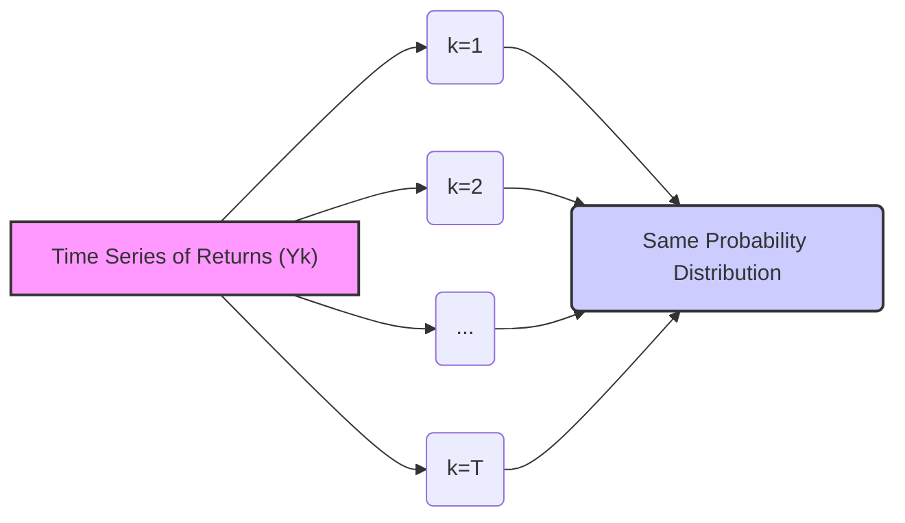
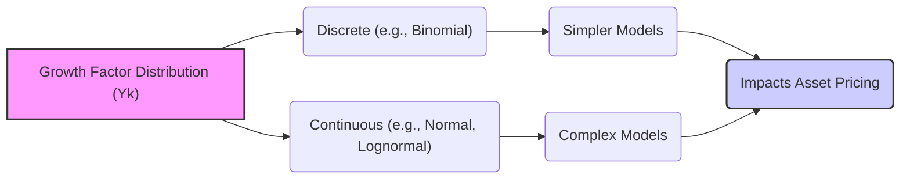
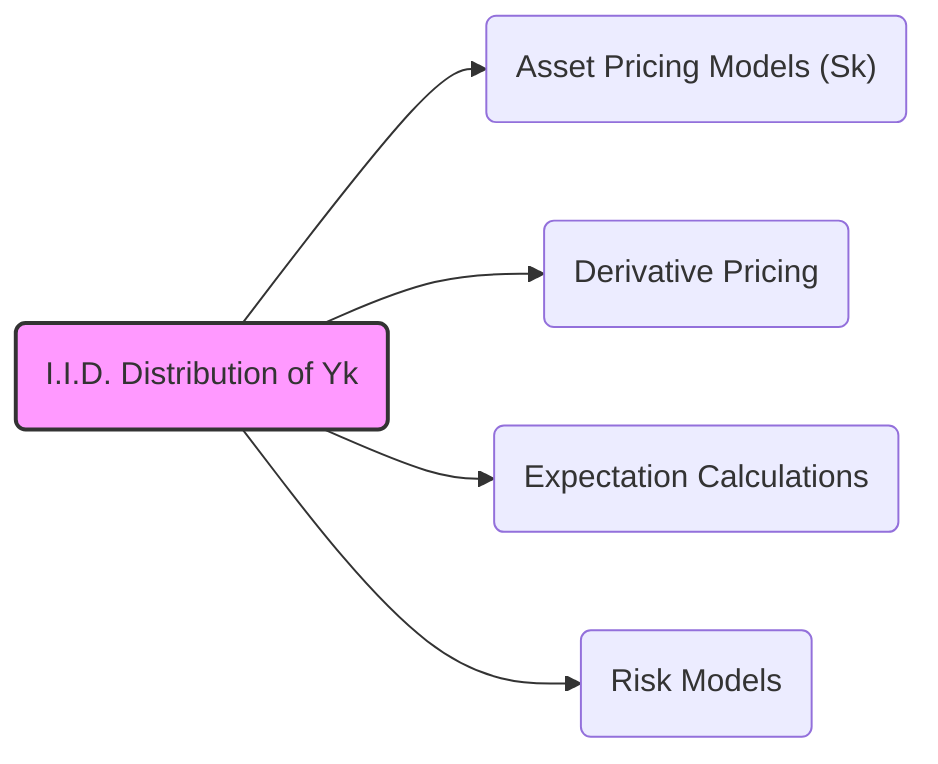
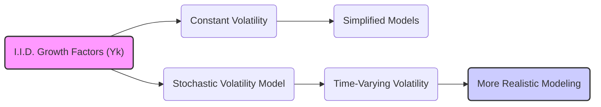

## Título Conciso: Retornos Identicamente Distribuídos (Yk) em Modelos Financeiros

### Introdução

Em modelagem financeira, a hipótese de que os retornos de um ativo (ou outros fatores que influenciam o mercado) sejam variáveis aleatórias **identicamente distribuídas** (i.d.d.), denotadas por $Y_k$, é comum e simplificadora [^1]. Essa hipótese, que implica que os retornos em cada período de tempo seguem a mesma distribuição probabilística, facilita a análise e a construção de modelos. Este capítulo explora a definição e as implicações da hipótese de retornos identicamente distribuídos, bem como suas limitações e o papel nos modelos financeiros.

### Conceitos Fundamentais

**Conceito 1: Definição Formal de Variáveis Aleatórias Identicamente Distribuídas**

Uma sequência de variáveis aleatórias $Y_1, Y_2, \ldots, Y_T$ é considerada **identicamente distribuída** (i.d.) se todas as variáveis aleatórias seguem a mesma distribuição de probabilidade [^2]. Isso significa que, para qualquer conjunto de Borel $B$, a probabilidade de $Y_k$ pertencer a $B$ é a mesma para todos os valores de $k = 1, \ldots, T$, ou seja, $P(Y_k \in B) = P(Y_j \in B)$ para qualquer $k,j \in \{1, \ldots, T\}$.

*Explicação Detalhada:*

   - A propriedade de distribuição idêntica não implica necessariamente que as variáveis aleatórias sejam independentes, ou seja, elas podem ou não ser dependentes.
    - Em contextos de finanças quantitativas, onde $Y_k$ representa o retorno de um ativo, a hipótese de que $Y_k$ são identicamente distribuídos indica que o processo de geração dos retornos é constante ao longo do tempo.
   - A definição formal de variáveis aleatórias identicamente distribuídas é uma condição sobre as medidas de probabilidade das variáveis e não sobre os seus valores propriamente.
   - Em modelos multiplicativos, os fatores de crescimento $Y_k$ são usualmente variáveis aleatórias, e portanto, cada $Y_k$ é uma função do espaço amostral $\Omega$ para os reais.

> 💡 **Exemplo Numérico:**
> Suponha que os retornos diários de uma ação sejam modelados como variáveis aleatórias $Y_k$. Se $Y_k$ segue uma distribuição normal com média 0.0005 (0.05%) e desvio padrão 0.01 (1%), então a hipótese de distribuição idêntica implica que cada retorno diário $Y_1, Y_2, Y_3\ldots$ segue esta mesma distribuição normal, ou seja, a mesma média e o mesmo desvio padrão. Isso significa que a probabilidade de um retorno diário estar dentro de um certo intervalo (por exemplo, entre -1% e 1%) é a mesma para qualquer dia $k$.

> ⚠️ **Nota Importante**: A hipótese de distribuição idêntica implica que a incerteza no comportamento de um ativo é modelada pela mesma distribuição de probabilidade em cada instante de tempo.

**Lemma 1:** Se $(Y_k)$ é uma sequência de variáveis aleatórias i.d., então para qualquer função Borel $f: \mathbb{R} \rightarrow \mathbb{R}$, a sequência $(f(Y_k))$ também é i.d.

*Prova:* Se $Y_k$ são i.d. e $f$ é uma função Borel, então  $P(f(Y_k) \in B) = P(Y_k \in f^{-1}(B))$ e como $f^{-1}(B)$ é um conjunto Borel, então todos os $f(Y_k)$ seguem a mesma distribuição de probabilidade.  $\blacksquare$

> 💡 **Exemplo Numérico:**
> Se $Y_k$ representa o retorno de um ativo e segue uma distribuição uniforme entre 0.9 e 1.1 (ou seja, retornos entre -10% e 10%), então a função $f(Y_k) = \log(Y_k)$ (log-retornos) também será identicamente distribuída. A distribuição de $\log(Y_k)$ será diferente da distribuição de $Y_k$, mas todos os log-retornos $\log(Y_1)$, $\log(Y_2)$, $\log(Y_3),...$ seguirão a mesma distribuição, mostrando que a propriedade i.d. é preservada pela função $f$.

**Conceito 2:  A Importância da Distribuição dos Fatores de Crescimento**

A distribuição dos fatores de crescimento ($Y_k$) tem um impacto direto nas propriedades do modelo e no comportamento dos preços de ativos e derivativos [^4].
     -   Em modelos mais simples, assume-se que os fatores de crescimento seguem uma distribuição discreta (por exemplo, a distribuição binomial).
    -    Em modelos mais complexos, os fatores de crescimento podem ter distribuições contínuas, como a normal ou lognormal.
   - A escolha apropriada da distribuição depende da natureza do ativo que está sendo modelado.
   -  A escolha da distribuição dos fatores de retorno também tem um impacto na construção dos modelos de precificação sem arbitragem.

> 💡 **Exemplo Numérico:**
> Em um modelo binomial, o fator de crescimento $Y_k$ pode assumir dois valores: 1.05 (alta de 5%) com probabilidade $p$ e 0.95 (queda de 5%) com probabilidade 1-$p$.  Em um modelo de Black-Scholes, os fatores de crescimento são modelados através de uma distribuição lognormal, com a volatilidade como parâmetro principal da distribuição.  A escolha entre uma distribuição binomial ou lognormal impacta diretamente o comportamento dos preços no modelo.

> ❗ **Ponto de Atenção**: A escolha da distribuição de $Y_k$ é crucial na representação da incerteza e das características do ativo que está sendo modelado.

**Corolário 1:** Se $(Y_k)$ é uma sequência de variáveis aleatórias i.d., então para qualquer função Borel $f: \mathbb{R} \rightarrow \mathbb{R}$, a sequência $(f(Y_k))$ também é i.d.

*Prova:* Se $Y_k$ são i.d. e $f$ é uma função Borel, então  $P(f(Y_k) \in B) = P(Y_k \in f^{-1}(B))$ e como $f^{-1}(B)$ é um conjunto Borel, então todos os $f(Y_k)$ seguem a mesma distribuição de probabilidade.  $\blacksquare$

> 💡 **Exemplo Numérico:**
> Suponha que os retornos diários de um ativo sejam i.i.d. e que a esperança de cada $Y_k$ seja $E[Y_k] = 1.001$ (ou seja, 0.1% de retorno médio diário). Se considerarmos um período de 10 dias, a esperança do produto dos retornos será $E[Y_1 * Y_2 * \ldots * Y_{10}] = (1.001)^{10} \approx 1.010045$. Isso significa que o retorno médio acumulado em 10 dias é aproximadamente 1.0045%, o que simplifica o cálculo da esperança do preço final do ativo.

**Conceito 3: Hipótese de i.i.d. e sua Validade em Mercados Financeiros**

A hipótese de fatores de crescimento serem independentes e identicamente distribuídos (i.i.d.) é uma simplificação da realidade que facilita os modelos financeiros. No entanto, em mercados reais, é comum que os retornos dos ativos apresentem algumas dependências temporais (como por exemplo, volatilidade estocástica) e outros comportamentos que fazem com que a hipótese de i.i.d. seja irrealista [^5].

*Limitações da Hipótese:*

   -  Os retornos de um ativo podem apresentar alguma dependência temporal, por exemplo, um período de alta volatilidade pode ser seguido por outro período de alta volatilidade.
   -   A hipótese de retornos com a mesma distribuição também é uma simplificação, já que as distribuições de retorno podem variar ao longo do tempo.
   -  A hipótese de i.i.d. muitas vezes não captura a assimetria nos retornos de alguns ativos, onde grandes perdas acontecem mais frequentemente do que grandes lucros, e que são conhecidas como "fat tails".
   -  A existência de *feedback loops* e eventos imprevistos podem fazer com que a independência dos retornos seja uma suposição irrealista.
   - Em modelos com mudança de regime, os fatores de crescimento podem mudar de distribuição dependendo da situação do mercado.

> 💡 **Exemplo Numérico:**
> Durante uma crise financeira, a volatilidade dos retornos de um ativo pode aumentar consideravelmente, e a distribuição dos retornos pode se tornar mais assimétrica (com "fat tails"). Isso significa que a hipótese de i.i.d. para os retornos não se sustenta, pois a distribuição dos retornos varia ao longo do tempo, e a independência dos retornos também é questionável.

> ✔️ **Destaque**:  A hipótese de que os fatores de crescimento são independentes e identicamente distribuídos é uma simplificação útil mas que, no entanto, pode não capturar a complexidade do comportamento de mercados reais.

### Modelagem de Ativos e Derivativos com Fatores de Crescimento I.I.D.

**Aplicações da Hipótese de i.i.d. na Construção de Modelos**

A hipótese de i.i.d. para os fatores de crescimento ($Y_k$) simplifica a construção de modelos financeiros, fornecendo uma base matemática para a precificação de ativos e derivativos, e facilitando a utilização de diversos resultados da teoria da probabilidade.
     -  Modelos como o de Black-Scholes e o binomial, quando os retornos são modelados de forma i.i.d., tornam a modelagem mais fácil de ser utilizada.  No entanto, em modelos mais complexos, esta hipótese é relaxada para modelar o comportamento dos ativos com maior precisão.
    -  A hipótese de retornos i.i.d. permite o uso de ferramentas analíticas para a obtenção da distribuição dos preços de ativos, e esta distribuição pode ser utilizada como entrada em modelos mais sofisticados.
    - A hipótese de i.i.d. para os log-retornos permite a construção de modelos GARCH para a volatilidade.

> 💡 **Exemplo Numérico:**
> No modelo de Black-Scholes, os log-retornos são assumidos como i.i.d. e normalmente distribuídos. Isso simplifica o cálculo do preço de uma opção, pois podemos usar as propriedades da distribuição normal para derivar uma fórmula analítica. No entanto, essa simplificação não captura a possibilidade de volatilidade estocástica, que é uma limitação do modelo.

**Lemma 2:** Se $Y_k$ são fatores de crescimento i.i.d., então o log-retorno acumulado entre tempos 0 e $T$ de um modelo multiplicativo pode ser expresso como a soma de $T$ variáveis aleatórias i.i.d. $\log(Y_k)$ , e portanto o teorema central do limite pode ser utilizado para aproximar a distribuição deste log-retorno acumulado com a distribuição normal.
*Prova:* O logaritmo do preço é uma soma de log-retornos, sendo que os log-retornos são obtidos através da aplicação de uma função em variáveis aleatórias i.i.d. e, portanto, os log-retornos são também i.i.d..  $\blacksquare$

> 💡 **Exemplo Numérico:**
> Se os log-retornos diários de um ativo são i.i.d. com média $\mu$ e variância $\sigma^2$, então o log-retorno acumulado em $T$ dias é a soma de $T$ variáveis i.i.d. com média $T\mu$ e variância $T\sigma^2$.  Pelo teorema central do limite, essa soma (o log-retorno acumulado) se aproxima de uma distribuição normal para valores grandes de $T$, o que nos permite calcular probabilidades de diferentes intervalos de retornos acumulados.

**Corolário 2:** A hipótese de retornos i.i.d. permite o uso de ferramentas estatísticas para análise do comportamento de ativos no tempo, como por exemplo, o cálculo de momentos e a estimação de parâmetros de modelos através de métodos econométricos.

> 💡 **Exemplo Numérico:**
> Dados os retornos diários de uma ação, podemos calcular a média e o desvio padrão amostrais dos retornos, e utilizar esses valores como estimativas para a média e o desvio padrão da distribuição dos retornos, assumindo que os retornos sejam i.i.d. Podemos também realizar testes estatísticos para verificar se a hipótese de normalidade dos retornos é razoável.

### Seções Teóricas Avançadas

#### Seção Teórica Avançada 1:  Como a Relaxação da Hipótese de Independência Impacta a Precificação Livre de Arbitragem?

A hipótese de fatores de crescimento i.i.d. pode ser relaxada para capturar certas dependências temporais que existem em mercados financeiros. Como essa relaxação impacta a precificação livre de arbitragem e os modelos de martingales?

*Explicação Detalhada:*
    - Se os fatores de crescimento $Y_k$ não são independentes, então o preço dos ativos descontados pode não ser um martingale sob a medida de probabilidade original $P$.
    -   A precificação livre de arbitragem requer a busca de uma nova medida de probabilidade, a medida de martingale equivalente ($Q$), que transforme os preços descontados em um martingale, mas esta transformação pode não ser tão fácil como no caso i.i.d., ou até mesmo não existir.
  -    A criação de modelos financeiros com retornos que não sejam independentes requer técnicas matemáticas mais sofisticadas para derivar as medidas de martingale equivalentes, e o uso de instrumentos como a derivada de Radon-Nikodym e o Teorema de Girsanov.
    - Em modelos mais gerais, que considerem processos estocásticos com dependência temporal, algumas das propriedades de martingales não valem mais, e algumas condições extras, em geral envolvendo integrabilidade uniforme, precisam ser satisfeitas para que os teoremas de convergência e de existência das medidas de martingale continuem valendo.

> 💡 **Exemplo Numérico:**
> Em um modelo onde os retornos de um ativo são correlacionados com os retornos de outro ativo, a independência dos fatores de crescimento não se sustenta. Para precificar derivativos nesse mercado, é necessário encontrar uma medida de probabilidade $Q$ sob a qual os preços descontados de ambos os ativos sejam martingales. A complexidade da precificação aumenta quando a dependência temporal entre os retornos é incorporada no modelo.

**Lemma 3:** Se o processo de fatores de crescimento $(Y_k)$ não for independente, a existência de uma medida de martingale equivalente $Q$ que transforme o processo de preços de um ativo em um martingale não é garantida pela modelagem dos retornos em si, mas requer que seja satisfeito um resultado do tipo Teorema de Girsanov.

*Prova:* A prova envolve o estudo das propriedades de processos estocásticos e a derivação de derivadas de Radon-Nikodym, o que está fora do escopo da discussão. $\blacksquare$

**Corolário 3:**  A hipótese de independência entre fatores de crescimento simplifica a construção de modelos livres de arbitragem, mas ela não é sempre realista, e em modelos mais complexos onde essa hipótese é relaxada, novas dificuldades matemáticas surgem.

#### Seção Teórica Avançada 2:  Como Modelar Volatilidade Estocástica em um Modelo Multiplicativo?

Um modelo multiplicativo com fatores de crescimento i.i.d. não captura um efeito importante observado nos mercados financeiros: a volatilidade estocástica, onde a variação do preço de um ativo varia ao longo do tempo. Como podemos modelar a volatilidade estocástica em um modelo multiplicativo?

*Explicação Detalhada:*
   -    Em modelos com volatilidade estocástica, os fatores de crescimento $Y_k$ dependem de um processo estocástico adicional que modela a volatilidade, e portanto, a hipótese de distribuição idêntica (i.i.d.) deixa de existir.
    - Modelos como o GARCH modelam a volatilidade como um processo autoregressivo, onde a volatilidade futura depende da volatilidade passada.
    - Outros modelos podem modelar a volatilidade como um processo estocástico independente.
  -   A volatilidade estocástica é fundamental para modelar a dinâmica dos mercados financeiros de forma mais precisa e para precificar derivativos de forma mais realista.

> 💡 **Exemplo Numérico:**
> Em um modelo GARCH(1,1), a volatilidade do retorno no período $k$, $\sigma_k$, é modelada como uma função da volatilidade do período anterior, $\sigma_{k-1}$, e do retorno do período anterior, $Y_{k-1}$. Isso significa que os fatores de crescimento $Y_k$ não são mais identicamente distribuídos, pois a distribuição de $Y_k$ depende do valor da volatilidade $\sigma_k$, que por sua vez é uma variável aleatória.

**Lemma 4:**  Em modelos com volatilidade estocástica, os fatores de crescimento $Y_k$ seguem uma distribuição que depende de um processo estocástico de volatilidade ($\sigma_k$)
$$ Y_k = e^{\mu + \sigma_k W_k}$$
onde $W_k$ é um ruído branco e $\sigma_k$ é a volatilidade estocástica.
e portanto, o modelo deixa de ter fatores i.i.d.

*Prova:* A derivação de modelos com volatilidade estocástica envolve o uso de cálculo estocástico e a teoria de difusão.  $\blacksquare$

> 💡 **Exemplo Numérico:**
> No modelo acima, se a volatilidade $\sigma_k$ segue um processo estocástico, como um modelo de média reversiva, então a distribuição de $Y_k$ muda a cada período, dependendo do valor de $\sigma_k$. Se $\sigma_k$ for alta, a distribuição de $Y_k$ terá uma maior variância do que se $\sigma_k$ for baixa, o que significa que os $Y_k$ não são identicamente distribuídos.

**Corolário 4:** A introdução da volatilidade estocástica nos modelos multiplicativos leva a modelos com maior precisão na modelagem do comportamento dos preços dos ativos, embora estes modelos sejam mais complexos de analisar.

#### Seção Teórica Avançada 3: Como o Conceito de Expectativa Condicional se Relaciona com os Fatores de Crescimento em Modelos Financeiros?

O conceito de expectativa condicional desempenha um papel fundamental em modelos multiplicativos. Como a esperança condicional se relaciona com os fatores de crescimento em um modelo multiplicativo, e quais as consequências para a precificação livre de arbitragem?

*Explicação Detalhada:*
    -  A propriedade de martingale é usualmente definida utilizando a esperança condicional, onde o valor esperado de uma variável no futuro, condicionado no presente, deve ser igual ao valor presente.
     -  Em um modelo multiplicativo, quando os preços são modelados como martingales (sob uma medida $Q$), o fator de crescimento deve satisfazer uma condição específica relacionada à expectativa condicional.
   - A expectativa condicional de um fator de crescimento $Y_{k+1}$ com respeito a uma $\sigma$-álgebra anterior, $F_k$, é um instrumento poderoso para modelar o comportamento esperado de um ativo em modelos mais complexos, e a ausência de arbitragem implica restrições sobre a esperança condicional.

> 💡 **Exemplo Numérico:**
> Em um modelo de precificação livre de arbitragem, o preço descontado de um ativo, $S^*_k$, sob a medida $Q$ deve ser um martingale. Isso significa que a expectativa condicional do preço descontado no tempo $k+1$, dado o conhecimento do tempo $k$, é igual ao preço descontado no tempo $k$, ou seja, $E_Q[S^*_{k+1} | F_k] = S^*_k$. Essa condição de martingale implica que a esperança condicional do fator de crescimento $Y_{k+1}$, dado o conhecimento do tempo $k$, deve ser igual a 1, ou seja, $E_Q[Y_{k+1} | F_k] = 1$.

**Lemma 5:** A condição de que um ativo descontado em um modelo multiplicativo seja uma Q-martingale,  implica que a esperança condicional dos fatores de retorno com respeito a uma filtração $F_k$ seja igual a um, ou seja
$$E_Q(Y_{k+1}|F_k) = 1$$

*Prova:* O resultado segue diretamente da definição de martingale. Se $S_k^* = S_k/\prod_{j=1}^{k}(1 + r_j)$ é uma Q-martingale, então $E_Q(S_{k+1}^*|F_k) = S_k^*$, o que implica que  $E_Q(S_k Y_{k+1}/ \prod_{j=1}^{k+1} (1+r_j) | F_k) = S_k /\prod_{j=1}^{k} (1+r_j)$. Como $S_k$ e $\prod_{j=1}^{k}(1 + r_j)$ são $F_k$-mensuráveis e a taxa de juros é predictível, $E_Q[Y_{k+1}|F_k] = 1$..  $\blacksquare$

**Corolário 5:** A expectativa condicional é uma ferramenta poderosa para modelar o conceito de equilíbrio financeiro (precificação livre de arbitragem) em modelos multiplicativos, e a sua aplicação é essencial para que o modelo possa gerar preços consistentes para ativos e derivativos.

### Conclusão

Os fatores de crescimento ($Y_k$), quando modelados como variáveis aleatórias i.i.d., geram uma estrutura conveniente e simplificadora para modelar a evolução de preços de ativos. A independência e a identidade das variáveis ($Y_k$)  permitem o uso de diversas ferramentas de estatística e da teoria da probabilidade para estudar suas propriedades e seu impacto na precificação de derivativos. No entanto, as seções teóricas avançadas mostraram que a relaxação das hipóteses i.i.d. e a inclusão de modelos de volatilidade estocástica permitem a construção de modelos mais realistas, embora seja necessário usar técnicas matemáticas mais sofisticadas, como a introdução de processos estocásticos auto-regressivos. A utilização da expectativa condicional, em todos os casos, é crucial para garantir a consistência entre os modelos e os dados do mercado.

### Referências

[^1]: "Em modelos financeiros que capturam a evolução de preços de ativos e taxas de juros, os **fatores de crescimento** (growth factors) ou retornos, representados por $Y_k$, desempenham um papel central."
[^2]: "Uma sequência de variáveis aleatórias $Y_1, Y_2, \ldots, Y_T$ é considerada **identicamente distribuída** (i.d.) se todas as variáveis aleatórias seguem a mesma distribuição de probabilidade."
[^4]:  "A distribuição dos fatores de crescimento ($Y_k$) tem um impacto direto nas propriedades do modelo e no comportamento dos preços de ativos e derivativos."
[^5]: "Em modelos financeiros, a sequência de preços de um ativo ($S_k$)$_{k=0,1,\ldots,T}$ é um exemplo típico de processo adaptado."
