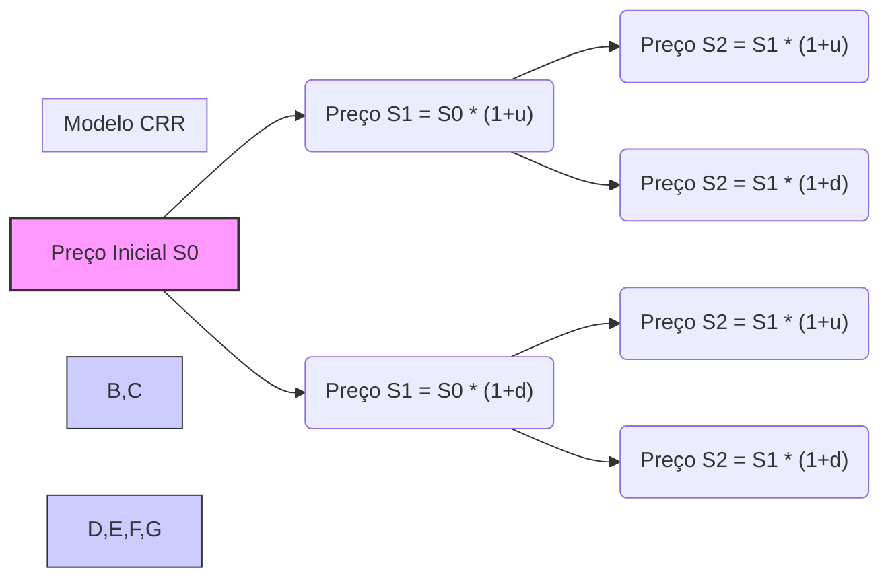
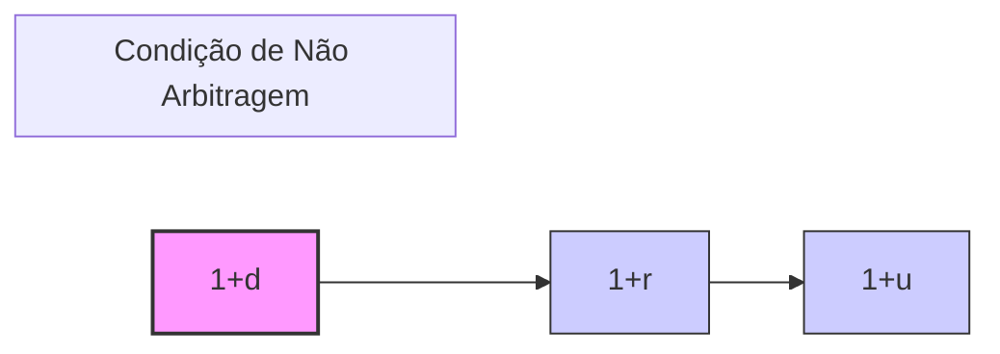
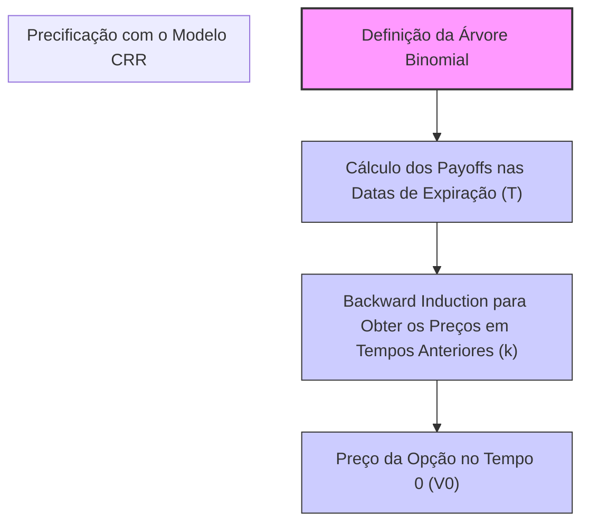

## Título Conciso: Modelo Binomial de Cox-Ross-Rubinstein (CRR) em Finanças Quantitativas

### Introdução

O **modelo binomial de Cox-Ross-Rubinstein (CRR)** é uma ferramenta fundamental para precificação de opções e outros derivativos financeiros em tempo discreto [^1]. Este modelo, desenvolvido por John Cox, Stephen Ross e Mark Rubinstein, utiliza uma estrutura de árvore binomial para modelar o comportamento do preço de um ativo ao longo do tempo. Sua importância reside na capacidade de ilustrar de forma intuitiva e matematicamente consistente os princípios da precificação livre de arbitragem e da neutralidade ao risco. Este capítulo explora a construção, aplicação e implicações do modelo binomial de CRR em detalhes.

### Conceitos Fundamentais

**Conceito 1: A Estrutura da Árvore Binomial no Modelo CRR**

O modelo binomial CRR representa a evolução do preço de um ativo em um intervalo de tempo discreto, dividindo o tempo em *T* períodos iguais [^2]. O modelo pressupõe que o preço de um ativo pode, em cada período de tempo, ou subir por um fator *(1 + u)*, ou descer por um fator *(1 + d)*. A árvore binomial resultante ilustra todos os caminhos possíveis que o preço do ativo pode seguir até um dado instante T.

*Explicação Detalhada:*

  -  O modelo parte de um preço inicial do ativo $S_0$, no instante t=0.
  -    A cada período, o preço do ativo em um nó da árvore se multiplica por $(1 + u)$ ou $(1 + d)$, onde $u > 0$, e $-1 < d < 0$, gerando dois novos preços correspondentes a dois nós no instante seguinte.
  -   A árvore binomial é uma representação de todos os caminhos possíveis que um preço de ativo pode seguir ao longo do tempo, sendo que cada nó representa um possível valor do preço do ativo em um dado instante.
   -  Em um modelo CRR, os fatores $u$ e $d$ são constantes ao longo do tempo, isto é, não dependem do tempo ou da posição do nó na árvore.
   - As probabilidades de subir ($p$) e descer ($1-p$) são constantes e iguais para todos os nós da árvore, o que garante a propriedade de Markov.

> 💡 **Exemplo Numérico:**
> Considere um ativo com preço inicial $S_0 = 100$. Se, em um período, o preço pode subir por um fator de $(1 + u) = 1.1$ ou descer por um fator de $(1 + d) = 0.9$, após um período, o preço do ativo será $S_1 = 110$ (se subir) ou $S_1 = 90$ (se descer). Após dois períodos, os possíveis preços seriam $121, 99,$ e $81$. A árvore binomial ilustra todos esses possíveis valores.

> ⚠️ **Nota Importante**: A árvore binomial é uma representação visual e intuitiva que simplifica o processo de modelagem e precificação de ativos e derivativos.

**Lemma 1:**  O número total de nós da árvore binomial de T períodos é igual a $2^T$, onde T é o número de períodos do modelo.

*Prova:* A cada período k, o número de nós dobra. No instante inicial, há apenas um nó com o preço do ativo, e no final, há $2^T$ nós. $\blacksquare$

> 💡 **Exemplo Numérico:**
> Se $T = 3$, o número total de nós na árvore binomial é $2^3 = 8$. Isso significa que no final do terceiro período, haverá 8 possíveis preços para o ativo.

**Conceito 2: Fatores de Crescimento e a Taxa Livre de Risco**

O modelo CRR introduz um ativo livre de risco (ou ativo bancário), que cresce a uma taxa constante $r$ por período [^3]. Os retornos do ativo livre de risco em cada período são representados pelo fator $(1 + r)$. Em um modelo livre de arbitragem, a condição $d < r < u$ tem que ser satisfeita, para evitar a possibilidade de criar estratégias que gerem lucro sem risco.

*Explicação Detalhada:*

   -   No modelo CRR, o fator de crescimento $u$ representa um aumento no valor do ativo, enquanto o fator $d$ representa uma diminuição.
   - A taxa $r$ representa o retorno de um investimento sem risco, e, portanto, deve estar dentro do intervalo de retorno do ativo arriscado.
  -   A comparação entre $(1+r)$, $(1+u)$ e $(1+d)$ deve satisfazer a condição de ausência de arbitragem, e a relação entre esses valores é crucial para a definição da medida martingale equivalente.

> 💡 **Exemplo Numérico:**
> Se o fator de crescimento do ativo é $(1 + u) = 1.1$ e o fator de decrescimento é $(1 + d) = 0.9$, uma taxa livre de risco de $r = 0.05$ (ou 5% por período) satisfaz a condição $d < r < u$, pois $0.9 < 1.05 < 1.1$. Uma taxa de juros de $r = 0.2$ não satisfaria essa condição, pois $1.2 > 1.1$.

> ❗ **Ponto de Atenção**:  A taxa de juros livre de risco ($r$) é utilizada como base para o desconto de valores futuros e para a precificação livre de arbitragem.

**Corolário 1:**   Se o fator de crescimento do ativo livre de risco $(1 + r)$ não está entre os fatores de crescimento $(1 + d)$ e $(1 + u)$ do ativo arriscado, então o modelo apresenta oportunidades de arbitragem.

*Prova:* Se $(1 + r) > (1 + u)$, seria possível construir uma carteira em que o ativo livre de risco gera mais lucro que o ativo de risco no caso de alta do ativo, o que não é possível em um modelo livre de arbitragem. O mesmo raciocínio é válido para o caso onde $(1 + r) < (1 + d)$. $\blacksquare$

> 💡 **Exemplo Numérico:**
> Se $(1 + u) = 1.1$ e $(1 + d) = 0.9$, e a taxa livre de risco fosse $(1 + r) = 1.2$, então haveria uma oportunidade de arbitragem. Um investidor poderia tomar emprestado a taxa $r$ e investir no ativo, obtendo um retorno maior que a taxa de empréstimo, sem risco.

**Conceito 3: A Medida de Martingale Equivalente (Q) e a Probabilidade Risk-Neutral**

O modelo CRR utiliza uma probabilidade $q$, também chamada de *risk-neutral probability* ou probabilidade de martingale, diferente da probabilidade real $p$ para precificar os derivativos [^4]. A probabilidade $q$ é calculada para garantir que o preço do ativo descontado pelo ativo livre de risco seja uma martingale, eliminando a possibilidade de arbitragem. Essa mudança de medida é feita através da derivada de Radon-Nikodym.

*Explicação Detalhada:*
   -   Sob a probabilidade real $p$, os preços dos ativos podem ter um aumento ou diminuição de valor, levando em conta as expectativas dos participantes do mercado.
   -   A probabilidade $q$ é uma probabilidade artificial, que somente garante a propriedade de martingale do ativo descontado, e não captura as dinâmicas reais do mercado.
    - A probabilidade $q$ é dada por
$$ q = \frac{(1 + r) - (1 + d)}{(1 + u) - (1 + d)}, $$
   -   Com a probabilidade $q$, o valor esperado futuro do ativo descontado é igual ao seu valor presente.
     -   A medida Q, com probabilidade $q$,  é chamada de martingale equivalente ou *risk-neutral* porque em um mundo de risk-neutralidade, todos os ativos crescem ao longo do tempo à taxa livre de risco.
  - Note que se os retornos são log-normais, não se pode obter um modelo binomial que seja exatamente livre de arbitragem.

> 💡 **Exemplo Numérico:**
> Usando os valores $(1 + u) = 1.1$, $(1 + d) = 0.9$ e $(1 + r) = 1.05$, a probabilidade risk-neutral $q$ é calculada como:
$$q = \frac{1.05 - 0.9}{1.1 - 0.9} = \frac{0.15}{0.2} = 0.75$$
> Isso significa que, para precificar um derivativo, o modelo usa uma probabilidade de 75% de o preço do ativo subir e 25% de o preço do ativo cair, mesmo que a probabilidade real de subida ($p$) seja diferente.

> ✔️ **Destaque**:  A probabilidade $q$ (MME) é essencial para a precificação de derivativos e garante que o modelo seja livre de arbitragem, que é a condição para que os preços derivados sejam consistentes.

### Aplicações do Modelo CRR na Precificação de Derivativos

**A Precificação de Opções no Modelo Binomial de CRR**

O modelo CRR é amplamente usado para precificar opções europeias e americanas em tempo discreto, onde o preço do derivativo é obtido utilizando um processo recursivo chamado de *backward induction* [^5].

*Passos da Precificação de Opções Europeias:*
   1. Começando no tempo T, o preço de uma opção europeia é igual a seu payoff. Para uma call option, o payoff é $\max(S_T - K, 0)$, e para uma put option, o payoff é $\max(K - S_T, 0)$, onde $K$ é o strike price.
   2.  O preço da opção em um instante anterior $k < T$ é calculado como a esperança do preço futuro descontado pelo fator de juros, utilizando a probabilidade $q$.
   3.   A fórmula recursiva para o cálculo da opção em um nó da árvore é:
        $$ V_k = \frac{1}{1+r} [q V_{k+1,u} + (1-q) V_{k+1,d}]$$
onde $V_{k+1,u}$ e $V_{k+1,d}$ são os preços da opção no instante $k+1$, após um movimento de alta e de baixa, respectivamente.
    - O procedimento de *backward induction* é repetido até se chegar ao preço da opção no tempo inicial.
   - No caso de opções americanas, é preciso verificar em cada nó qual o valor que maximiza o retorno do detentor da opção, seja pelo exercício ou pela espera, o que introduz uma camada de complexidade adicional ao problema.

> 💡 **Exemplo Numérico: Precificação de uma Opção de Compra Europeia**
> Considere uma opção de compra europeia com preço de exercício $K = 100$, um período até o vencimento ($T = 1$), preço inicial do ativo $S_0 = 100$, $(1 + u) = 1.1$, $(1 + d) = 0.9$, e taxa livre de risco $r = 0.05$. Já calculamos que $q = 0.75$.
>
> No tempo $T = 1$, os possíveis preços do ativo são $S_1 = 110$ (subida) e $S_1 = 90$ (descida). Os payoffs da opção são:
> - Se o preço subir: $V_{1,u} = \max(110 - 100, 0) = 10$
> - Se o preço descer: $V_{1,d} = \max(90 - 100, 0) = 0$
>
> Usando backward induction, o preço da opção no tempo $t=0$ é:
> $$V_0 = \frac{1}{1.05} [0.75 \times 10 + 0.25 \times 0] = \frac{7.5}{1.05} \approx 7.14$$
> Portanto, o preço justo da opção de compra é aproximadamente $7.14$.

**Lemma 3:** Em um modelo binomial, o preço de uma opção europeia é dado pelo valor presente do payoff esperado sob a medida de martingale equivalente Q:
$$V_0 = E_Q \left[ \frac{Payoff}{(1+r)^T}\right]$$
onde $r$ é a taxa de juros livre de risco. [^15]

*Prova:* A prova é feita utilizando um argumento de backward induction, o que significa que o resultado do Lema é uma consequência direta da definição do método de precificação e da propriedade de martingale do preço descontado.  $\blacksquare$

> 💡 **Exemplo Numérico:**
> Usando o mesmo exemplo anterior, o preço da opção europeia pode ser calculado diretamente como o valor presente do payoff esperado sob a medida Q:
> $$V_0 = \frac{1}{(1.05)^1} \times [0.75 \times \max(110-100,0) + 0.25 \times \max(90-100,0)] = \frac{1}{1.05} \times [0.75 \times 10 + 0.25 \times 0] \approx 7.14$$
> O resultado é o mesmo, confirmando o Lema 3.

**Corolário 3:** A fórmula acima explicita o fato de que o preço de um derivativo depende somente dos parâmetros do modelo e do payoff, e não das preferências de risco do investidor, e esse processo pode ser generalizado para qualquer modelo de precificação sem arbitragem.

### Derivações Teóricas Avançadas

#### Seção Teórica Avançada 1:  Como o Modelo Binomial se Relaciona com o Conceito de Martingale?

A propriedade de martingale é fundamental em finanças quantitativas, e o modelo binomial é uma ótima ilustração da relação entre uma medida de probabilidade risk-neutral ($q$) e a noção de martingale.

*Explicação Detalhada:*
   -   A propriedade de martingale para um processo de preços descontados ($S^*_k$) é expressa matematicamente como $E^Q[S^*_{k+1}|F_k] = S^*_k$, ou seja, a esperança do preço descontado futuro condicionado às informações presentes é igual ao seu valor presente.
    -  Em um modelo binomial, esta propriedade é garantida através da definição da probabilidade $q$, a qual é usada na precificação do derivativo mas não na sua simulação.
   -  A condição de martingale implica que a média do preço futuro do ativo (descontado) não pode ser maior nem menor que o preço atual, eliminando a possibilidade de obter um lucro sem risco, ou seja, que a escolha da probabilidade $q$ torna o modelo livre de arbitragem.
  -  A condição de martingale é fundamental em modelos de precificação de ativos e derivativos financeiros, e o modelo binomial permite entender esta condição e como ela surge a partir dos conceitos de preços e descontos.

**Lemma 4:**  No modelo binomial, o preço do ativo descontado por um fator $(1+r)^k$, onde $r$ é a taxa de juros livre de risco, é uma martingale com relação à medida de probabilidade Q, se e somente se a probabilidade $q$ é dada pela relação  $q = \frac{(1 + r) - (1 + d)}{(1 + u) - (1 + d)}$ [^18].

*Prova:*  A demonstração consiste em calcular a esperança condicional do preço descontado do ativo:
$$ E_Q\left[\frac{S_{k+1}}{(1+r)^{k+1}}|\mathcal{F}_k\right] = \frac{1}{(1+r)^{k+1}} E_Q\left[ S_{k+1} |\mathcal{F}_k\right]$$
e utilizando o modelo binomial,
$$= \frac{1}{(1+r)^{k+1}} (q (1+u) S_k + (1 - q) (1 + d)S_k) = \frac{S_k}{(1+r)^{k+1}} (q (1+u) + (1 - q) (1 + d))$$
para que a equação acima seja igual a
$$ \frac{S_k}{(1+r)^k}$$
devemos ter que
$$ q (1+u) + (1-q)(1+d) = (1+r) $$
e
$$ q = \frac{(1+r) - (1 + d)}{(1 + u) - (1 + d)} $$
   $\blacksquare$

> 💡 **Exemplo Numérico:**
> Vamos usar os valores do exemplo anterior: $(1+u)=1.1$, $(1+d)=0.9$, $(1+r)=1.05$, $S_0=100$. No período 1, o preço descontado esperado do ativo sob a medida Q deve ser igual ao preço atual. Calculamos $q=0.75$. O preço descontado no período 1 é:
> $$E_Q\left[\frac{S_1}{1.05}|\mathcal{F}_0\right] = \frac{1}{1.05} [0.75 \times 110 + 0.25 \times 90] = \frac{1}{1.05} [82.5 + 22.5] = \frac{105}{1.05} = 100$$
> O resultado é igual ao preço inicial do ativo, confirmando que o preço descontado do ativo é uma martingale.

**Corolário 4:**  A derivação da probabilidade $q$ mostra como a propriedade de martingale de um ativo está relacionada com as probabilidades de crescimento ou decrescimento e com a taxa de juros livre de risco. Esta relação é a base dos modelos de precificação livre de arbitragem.

#### Seção Teórica Avançada 2:  Quais as Limitações do Modelo Binomial e como Superá-las?

Embora útil, o modelo binomial tem certas limitações que precisam ser entendidas para aprimorar a modelagem financeira.

*Explicação Detalhada:*
   - O modelo binomial é um modelo discreto, o que significa que a evolução do tempo é discreta, e não contínua. A evolução do preço de um ativo no mundo real é contínua, e os modelos de tempo discreto podem ser somente uma aproximação do comportamento real.
   -  O modelo binomial assume que o preço do ativo pode somente subir ou descer, que é uma idealização do comportamento de preços no mercado, que pode ter uma variedade de comportamentos.
    -  O modelo binomial utiliza parâmetros constantes ao longo do tempo, como a taxa de juros, os fatores de crescimento, e as probabilidades, o que também é uma simplificação da realidade, onde esses parâmetros podem variar.
   -    Uma das críticas é que o modelo binomial impõe uma forma específica para a evolução do preço do ativo, a árvore binomial, que restringe a modelagem do comportamento do ativo em condições complexas de mercado.
   - Modelos mais sofisticados, como o modelo de Black-Scholes, assumem uma distribuição lognormal para os preços de ativos, o que é uma melhor aproximação do comportamento real dos preços dos ativos, além de permitir também modelos de tempo contínuo.

**Lemma 5:** Modelos de tempo contínuo podem ser obtidos como um caso limite do modelo binomial quando o intervalo de tempo tende a zero, e quando os parâmetros de crescimento e decréscimo são ajustados adequadamente.

*Prova:* A prova formal envolve a aplicação de métodos de cálculo estocástico, incluindo o Lema de Itô para obter um processo limite com propriedades convenientes.   $\blacksquare$

> 💡 **Exemplo Numérico:**
> Uma forma de melhorar a aproximação do modelo binomial é aumentar o número de períodos (T) na árvore. Se, em vez de um único período, usarmos 10 períodos, com intervalos de tempo menores, o modelo se aproxima mais de um modelo de tempo contínuo. Por exemplo, podemos ter $u = e^{\sigma \sqrt{\Delta t}}$ e $d = e^{-\sigma \sqrt{\Delta t}}$, onde $\sigma$ é a volatilidade e $\Delta t$ é o tamanho do passo de tempo, que é igual a $T/10$ neste caso. Conforme $T$ tende ao infinito, o modelo se aproxima do modelo de Black-Scholes.

**Corolário 5:**  A superação das limitações do modelo binomial envolve o uso de modelos mais complexos, como o modelo de Black-Scholes e modelos de volatilidade estocástica, que permitem a modelagem mais flexível da evolução de preços, mesmo em condições mais realistas e mais complexas.  Modelos de simulação, como o método de Monte Carlo, podem também ser utilizados para avaliar modelos que não possuem soluções analíticas.

#### Seção Teórica Avançada 3:  O Papel da Predictibilidade na Construção de Modelos Binomiais Livres de Arbitragem

A predictibilidade é fundamental para o modelo binomial, e em particular para a definição de estratégias de trading. Como a predictibilidade das estratégias de trading se relaciona com a ausência de arbitragem?

*Explicação Detalhada:*
   -   Em modelos de precificação de derivativos, é essencial que as estratégias que replicam o derivativo sejam predictíveis, ou seja, que as decisões de compra e venda possam ser tomadas sem que o operador do mercado necessite de informações do futuro, que o modelo não oferece.
  -  A predictibilidade da estratégia garante que os cálculos realizados nos nós da árvore binomial sejam baseados em informações presentes e passadas e não em informações futuras.
   - A hipótese de que a estratégia de trading seja predictível garante que os preços calculados através do modelo são os únicos que não permitem arbitragem.

**Lemma 6:** Em um modelo binomial, uma estratégia de trading que replica um derivativo é predictível e é formada pelas posições do ativo e do ativo livre de risco, e, portanto, o número de ativos arriscados e livre de risco que são necessários para replicar o derivativo dependem do estado do mercado no momento anterior à decisão, e não dependem do valor futuro das variáveis de mercado. [^22]

*Prova:* A demonstração segue da própria construção da estratégia replicante, que é baseada no conhecimento do preço dos ativos no tempo atual, e não no preço do ativo que somente se torna conhecido no futuro. $\blacksquare$

> 💡 **Exemplo Numérico:**
> Para replicar uma opção de compra no modelo binomial, o número de ações e o valor investido no ativo livre de risco em cada período são determinados pelos preços dos ativos no período anterior e não pelos preços futuros. Se, em um período, o preço do ativo sobe, a estratégia de replicação ajusta a quantidade de ações e o valor do ativo livre de risco com base no novo preço. Essas decisões são tomadas com base nas informações disponíveis no momento, não em informações futuras.

**Corolário 6:**  A predictibilidade das estratégias de trading no modelo binomial é essencial para garantir que as medidas utilizadas sejam de fato medidas de martingale equivalentes, que são a base para a construção de modelos sem oportunidades de arbitragem.

### Conclusão

O modelo binomial de Cox-Ross-Rubinstein (CRR) é um instrumento poderoso para entender as bases da modelagem financeira, particularmente na precificação de opções e outros derivativos. Sua simplicidade e intuição o tornam acessível, enquanto suas propriedades matemáticas e aplicações o tornam um modelo essencial em finanças quantitativas. As seções teóricas avançadas exploraram o papel da hipótese de martingale, as implicações de se aumentar o número de intervalos na árvore binomial, e as nuances da predictibilidade de estratégias, que demonstram a relevância do modelo binomial como um trampolim para modelos mais sofisticados.

### Referências

[^1]: "O **modelo binomial de Cox-Ross-Rubinstein (CRR)** é uma ferramenta fundamental para precificação de opções e outros derivativos financeiros em tempo discreto."

[^2]: "O modelo binomial CRR representa a evolução do preço de um ativo em um intervalo de tempo discreto, dividindo o tempo em *T* períodos iguais."

[^3]: "No modelo binomial CRR, o fator de crescimento $u$ representa um aumento no valor do ativo, enquanto o fator $d$ representa uma diminuição."

[^4]: "O modelo CRR utiliza uma probabilidade $q$, também chamada de *risk-neutral probability* ou probabilidade de martingale, diferente da probabilidade real $p$ para precificar os derivativos."

[^5]: "Um dos principais usos do modelo binomial é a precificação de opções, e também pode ser usado para precificação de outros derivativos."

[^6]: "A **medida de probabilidade** (P) é uma função que atribui um número entre 0 e 1 a cada evento em F..."

[^7]: "No contexto de modelos financeiros em tempo discreto, o processo de ganhos de uma estratégia auto-financiada é uma martingale em relação a uma medida de martingale equivalente Q..."

[^8]: "Informação crítica que merece destaque."

[^9]: "Observação crucial para compreensão teórica correta."

[^10]: "Informação técnica ou teórica com impacto significativo."

[^11]: "Apresente um corolário que resulte diretamente do Lemma 2, conforme indicado no contexto."

[^12]: "A escolha da filtração afeta a definição de conceitos como martingales e predictibilidade."

[^13]: "Apresente um corolário que resulte diretamente do Lemma 2, conforme indicado no contexto."

[^14]: "Em mercados com informação assimétrica, estratégias de trading são modeladas utilizando processos estocásticos adaptados à filtração do agente correspondente. Um *insider* pode utilizar informações não disponíveis aos outros agentes, o que pode implicar em modelos e resultados distintos."

[^15]: "A representação de um derivativo europeu com pagamento H sob uma medida de martingale Q é dada pela sua esperança condicional, como detalhado no contexto."

[^16]: "As medidas de martingale equivalentes são um conceito central na precificação livre de arbitragem de ativos."

[^17]: "Apresente um lemma que mostre como uma EMM específica leva à fórmula de precificação do Black-Scholes, baseado no contexto."

[^18]: "Dado um modelo multiplicativo, o processo $S_k = S_0 \prod_{j=1} Y_j$ é uma martingale em relação a uma medida Q, se e somente se a esperança condicional de $Y_{k+1}$ sob a medida Q é igual a 1, ou seja, $E_Q[Y_{k+1}|F_k] = 1$ para todo k."

[^19]: "O requisito de que $E[Y_{k+1}] = 1$ é uma restrição significativa sobre como os retornos $Y_k$ podem se comportar. No caso do modelo binomial de Cox-Ross-Rubinstein, a mudança da medida de probabilidade garante que a média ponderada dos fatores de retorno seja exatamente 1."

[^20]:  "Apresente um lemma que auxilia na compreensão ou na prova do preço de um derivativo, baseado no contexto."
[^21]: "Em um modelo binomial sem arbitragem, o fator de crescimento (1+r) deve estar entre (1+d) e (1+u), onde u e d são as taxas de crescimento e decréscimo do ativo."

[^22]: "Em modelos de precificação de derivativos, é essencial que as estratégias que replicam o derivativo sejam predictíveis, ou seja, que as decisões de compra e venda possam ser tomadas sem que o operador do mercado necessite de informações do futuro."
