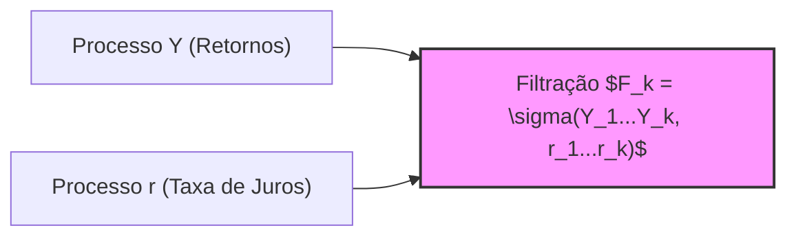
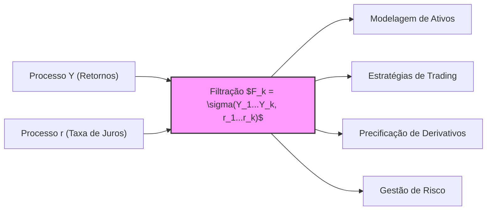
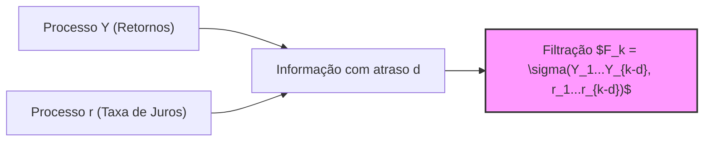

## Título Conciso: Filtração Gerada por Processos Estocásticos de Retornos e Taxa de Juros ($\sigma(Y_1, \ldots, Y_k, r_1, \ldots, r_k)$)



### Introdução

Em modelos financeiros mais avançados, tanto os retornos dos ativos ($Y_k$) quanto as taxas de juros ($r_k$) podem ser modelados como processos estocásticos. Nesses casos, é preciso utilizar uma **filtração** que capture a informação gerada por ambos os processos. Este capítulo visa explorar a definição, construção e aplicações da **filtração gerada por múltiplos processos estocásticos**, particularmente quando esses processos incluem fatores de crescimento e taxas de juros, denotada como $IF = (F_k)$ onde $F_k = \sigma(Y_1, \ldots, Y_k, r_1, \ldots, r_k)$.

### Conceitos Fundamentais

**Conceito 1: Definição Formal da Filtração Gerada por Dois Processos**

Dados dois processos estocásticos $Y = (Y_k)_{k=0,1,\ldots,T}$ e $r = (r_k)_{k=0,1,\ldots,T}$ definidos no mesmo espaço de probabilidade $(\Omega, \mathcal{F}, P)$, a **filtração gerada por ambos os processos** é denotada por $IF = (F_k)_{k=0,1,\ldots,T}$, onde cada $F_k$ é a $\sigma$-álgebra gerada por $Y_1, \ldots, Y_k$ e $r_1, \ldots, r_k$. Formalmente: [^1]

  -   $F_0$ é a $\sigma$-álgebra trivial $\{\emptyset, \Omega\}$.
   -  $F_k = \sigma(Y_1, \ldots, Y_k, r_1, \ldots, r_k)$, para $k = 1,\ldots,T$, onde $\sigma(Y_1, \ldots, Y_k, r_1, \ldots, r_k)$ é a menor $\sigma$-álgebra que torna mensuráveis as variáveis aleatórias $Y_1, \ldots, Y_k$ e $r_1, \ldots, r_k$.

*Explicação Detalhada:*

  -  A $\sigma$-álgebra $F_k$ contém todos os eventos (subconjuntos de $\Omega$) que podem ser construídos a partir dos valores das variáveis $Y_1, \ldots, Y_k$ (que podem representar fatores de crescimento do preço de um ativo) e das variáveis $r_1, \ldots, r_k$ (que podem representar taxas de juros livre de risco).
   -   A propriedade de que $F_k \subset F_{k+1}$ indica que a informação se acumula ao longo do tempo, sendo que a informação disponível no tempo $k$ é sempre um subconjunto da informação disponível no tempo $k+1$.
   -   Ao considerar a filtração gerada por dois processos, o modelo captura as informações de duas fontes distintas que afetam o mercado financeiro.
  -   Esta construção permite uma modelagem mais realista de mercados onde os preços dos ativos e as taxas de juros interagem.

> 💡 **Exemplo Numérico:**
> Suponha que $Y_k$ representa o retorno diário de uma ação e $r_k$ a taxa de juros diária de um título do governo. No dia 1, temos $Y_1 = 0.01$ (retorno de 1%) e $r_1 = 0.0002$ (taxa de juros de 0.02%). No dia 2, temos $Y_2 = -0.005$ (retorno de -0.5%) e $r_2 = 0.00025$ (taxa de juros de 0.025%). A filtração $F_1$ contém a informação de $Y_1$ e $r_1$, enquanto a filtração $F_2$ contém a informação de $Y_1$, $Y_2$, $r_1$ e $r_2$. Assim, $F_2$ contém mais informação que $F_1$, pois inclui os valores de $Y$ e $r$ em dois instantes de tempo.
>
> Formalmente, $F_1 = \sigma(Y_1, r_1)$ e $F_2 = \sigma(Y_1, Y_2, r_1, r_2)$. Os eventos em $F_1$ são construídos apenas com base nos valores de $Y_1$ e $r_1$, enquanto os eventos em $F_2$ são construídos com base nos valores de $Y_1$, $Y_2$, $r_1$ e $r_2$. Um exemplo de evento em $F_1$ poderia ser $\{Y_1 > 0\}$, e um evento em $F_2$ poderia ser $\{Y_1 > 0 \text{ e } Y_2 < 0\}$.

> ⚠️ **Nota Importante**: A filtração gerada por múltiplos processos captura a interconexão de diferentes fluxos de informação, fornecendo uma base para a modelagem de modelos financeiros mais complexos.

**Lemma 1:**  A filtração $F_k = \sigma(Y_1, \ldots, Y_k, r_1, \ldots, r_k)$ é a menor $\sigma$-álgebra que torna as variáveis $Y_1, \ldots, Y_k$ e $r_1, \ldots, r_k$ mensuráveis, e portanto, que contém a informação de todos esses processos até o tempo $k$.  Uma variável aleatória é $F_k$-mensurável se sua informação é completamente determinada pelas variáveis aleatórias $Y_1, \ldots, Y_k$ e $r_1, \ldots, r_k$ [^2].

*Prova:*  A prova decorre da definição de $\sigma$-álgebra gerada: a menor $\sigma$-álgebra que contém um conjunto de variáveis aleatórias torna essas variáveis mensuráveis.   $\blacksquare$

**Conceito 2: Adaptabilidade e Predictibilidade em Filtrações Geradas por Múltiplos Processos**

Num modelo com duas filtrações distintas, podemos definir tanto processos adaptados como processos predictíveis com relação a essas filtrações. Se um processo $X$ é adaptado a $IF$ (onde $IF$ é a filtração gerada por $Y$ e $r$), então $X_k$ é $F_k$-mensurável para todo $k$. Se um processo $X$ é predictível com relação a $IF$, então $X_k$ é $F_{k-1}$-mensurável [^3].  Em modelos onde os fatores de retorno e as taxas de juros são modelados como processos distintos, a noção de adaptabilidade e predictibilidade pode se tornar mais complexa.

*Explicação Detalhada:*

  -  Em geral, um processo é adaptado com respeito à filtração que contém as informações que determinam seus valores.
   -  Em mercados financeiros, a adaptação da variável que representa o preço de um ativo (ou de uma carteira de ativos) significa que essa variável depende da informação de todas as variáveis que influenciam o mercado até o tempo presente.
   -  Já a predictibilidade é uma condição mais forte que restringe a informação utilizada, ou seja, a decisão em um instante de tempo $k$ só pode utilizar a informação disponível no tempo anterior $k-1$.
    -   Em geral, as taxas de juros são tratadas como processos predictíveis para simular a ideia de que elas já são conhecidas no momento da decisão.

```mermaid
flowchart LR
    A[Informação em $F_{k-1}$] --> B("Xk (Predictível)");
    C[Informação em $F_k$] --> D("Xk (Adaptado)");
    style B fill:#ccf,stroke:#333,stroke-width:1px
    style D fill:#ccf,stroke:#333,stroke-width:1px
```

> 💡 **Exemplo Numérico:**
> Considere um preço de ação $S_k$. Se $S_k$ é adaptado à filtração $IF = (F_k)$, então o preço de ação no tempo $k$, $S_k$, é determinado pela informação contida em $F_k$, ou seja, os valores de $Y_1,\ldots,Y_k$ e $r_1,\ldots,r_k$. Isso significa que o preço da ação no tempo $k$ é uma função dessas variáveis. Por outro lado, se uma estratégia de trading, representada por $H_k$, é predictível com relação a $IF$, então $H_k$ é determinado pela informação contida em $F_{k-1}$, ou seja, os valores de $Y_1,\ldots,Y_{k-1}$ e $r_1,\ldots,r_{k-1}$. Isso significa que a decisão de alocação de ativos no tempo $k$ é baseada na informação disponível até o tempo $k-1$.

> ❗ **Ponto de Atenção**:  A distinção entre adaptabilidade e predictibilidade em filtros geradas por múltiplos processos é crucial para garantir que os modelos sejam consistentes com o fluxo de informação em mercados financeiros.

**Corolário 1:**   Se o processo $Y$ é adaptado à filtração gerada por $Y$, então qualquer função de $Y_k$ é adaptada à mesma filtração,  e o mesmo vale para o processo $r$.

*Prova:*  Se $Y_k$ é $F_k$ mensurável, então para qualquer função $g$, $g(Y_k)$ também é uma função $F_k$ mensurável, por propriedade de fechamento de funções Borel, e portanto, adaptada a $F_k$. A mesma lógica é válida para a função aplicada a $r_k$. $\blacksquare$

> 💡 **Exemplo Numérico:**
> Se $Y_k$ representa o retorno diário de uma ação e é adaptado à filtração gerada por $Y$, então uma função como $Y_k^2$ (o quadrado do retorno) também é adaptada à mesma filtração. Similarmente, se $r_k$ representa a taxa de juros diária e é adaptada à filtração gerada por $r$, então uma função como $\exp(r_k)$ (o exponencial da taxa de juros) também é adaptada à mesma filtração.

**Conceito 3:  A Relação entre a Filtração e Estratégias de Trading**

As estratégias de trading, que se traduzem em decisões de alocação de ativos, são tipicamente modeladas como processos estocásticos predictíveis [^4]. No entanto, se as estratégias utilizam informação dos retornos de ativos e das taxas de juros, elas devem ser modeladas com respeito à filtração gerada por ambos os processos. Isso requer uma modelagem mais complexa do que um modelo onde somente o retorno do ativo é relevante para a definição da estratégia.
   - Em mercados com taxas de juros e risco de crédito (onde há risco de default), uma estratégia que dependa tanto dos retornos do ativo quanto das taxas de juros deve ser modelada como um processo predictível com respeito a uma filtração gerada por ambos os processos.

> 💡 **Exemplo Numérico:**
> Considere uma estratégia de trading que decide o quanto investir em um ativo com base no retorno do ativo no dia anterior e na taxa de juros do dia anterior. Essa estratégia, representada por $H_k$, seria modelada como um processo predictível com respeito à filtração gerada por $Y$ e $r$. Isso significa que o valor de $H_k$ no tempo $k$ é determinado pela informação disponível em $F_{k-1}$, que inclui os retornos $Y_1, \ldots, Y_{k-1}$ e as taxas de juros $r_1, \ldots, r_{k-1}$.

> ✔️ **Destaque**: Modelar estratégias de trading através de processos predictíveis com relação à filtração gerada por fatores de crescimento e taxas de juros permite capturar a complexidade das decisões de investimento num cenário com variáveis estocásticas relacionadas.

### Modelagem de Ativos e Derivativos com Filtrações Geradas por Y e r



**A Importância da Filtração na Consistência dos Modelos**

A escolha apropriada da filtração é fundamental para que os modelos financeiros sejam consistentes e representem corretamente as informações disponíveis aos participantes do mercado. Ao usar a filtração gerada pelos processos de retornos ($Y$) e taxas de juros ($r$), a modelagem de processos estocásticos como preços de ativos, valores de derivativos e estratégias de trading respeitam a causalidade temporal e, portanto, evitam inconsistências lógicas.
No contexto de precificação de derivativos, por exemplo, os valores esperados devem ser calculados utilizando o conceito de esperança condicional, e a $\sigma$-álgebra da informação condicional (o que é conhecido)  é determinada pela filtração.  Em um modelo financeiro, o modelo deve ser consistente com a ideia de que as decisões de precificação sejam baseadas apenas nas informações disponíveis no tempo presente (ou no passado) e não em informações futuras.
Em modelos de avaliação de risco, a filtração serve para modelar como as informações afetam o risco de um ativo, onde as decisões de investimento são baseadas nos dados passados relevantes, mas a incerteza sobre o futuro é preservada.

**Lemma 3**: Se os processos $X$ e $Y$ são independentes e adaptados a sua própria filtração, então a filtração gerada por $X$ e $Y$ contém toda a informação que é utilizada para modelar suas propriedades individuais, ou seja,  $\sigma(X_k) \subseteq \sigma(X_1, \ldots, X_k, Y_1, \ldots, Y_k)$ e $\sigma(Y_k) \subseteq \sigma(X_1, \ldots, X_k, Y_1, \ldots, Y_k)$

*Prova:* O resultado segue da definição de $\sigma$-álgebra gerada. Como $F_k = \sigma(Y_1, \ldots, Y_k)$ e $G_k = \sigma(X_1, \ldots, X_k)$ então as $\sigma$-álgebras $F_k$ e $G_k$ são sub-$\sigma$-álgebras de $\sigma(X_1, \ldots, X_k, Y_1, \ldots, Y_k)$. $\blacksquare$

> 💡 **Exemplo Numérico:**
> Suponha que $X_k$ represente o preço de uma ação e $Y_k$ represente o preço de outra ação. Se $X$ e $Y$ são independentes e adaptados às suas próprias filtrações, então a filtração gerada por ambos, $\sigma(X_1, \ldots, X_k, Y_1, \ldots, Y_k)$, contém toda a informação relevante para modelar cada um individualmente. Por exemplo, se quisermos modelar o comportamento de $X_k$, podemos usar toda a informação disponível até o tempo $k$, incluindo os valores de $Y$, mas se $X$ e $Y$ fossem dependentes, essa dependência também precisaria ser modelada e capturada na filtração gerada.

**Corolário 3**: Em modelos financeiros, a utilização da filtração gerada pelos fatores de crescimento e pelas taxas de juros permite representar a interconexão desses elementos na modelagem do mercado, o que é essencial para construir modelos robustos, com resultados consistentes.

### Derivações Teóricas Avançadas

#### Seção Teórica Avançada 1: Qual o Impacto de Introduzir um Atraso na Informação (Latência) em uma Filtração Gerada?

Em mercados reais, a informação pode não estar disponível imediatamente, havendo um atraso (latência) na sua obtenção e processamento. Como a introdução de latência afeta a construção da filtração?

*Explicação Detalhada:*
   -  Em situações onde a informação não está disponível instantaneamente, a filtração gerada deve ser ajustada para refletir o atraso na obtenção da informação.
   -    Podemos definir uma nova filtração onde o processo $Y$ e $r$ são observáveis com um atraso de $d$ períodos, de modo que a $\sigma$-álgebra $F_k$ passa a ser $F_k = \sigma(Y_1, \ldots, Y_{k-d}, r_1, \ldots, r_{k-d})$.
   -  O atraso (latência) na observação de retornos e taxas de juros tem um impacto na modelagem das estratégias de trading, e portanto, no preço dos ativos e derivativos, e é também a base dos modelos de informação assimétrica.

> 💡 **Exemplo Numérico:**
> Suponha que a informação sobre os retornos de uma ação ($Y_k$) esteja disponível com um atraso de um dia ($d=1$). Isso significa que no tempo $k$, só temos acesso à informação de $Y_1,\ldots,Y_{k-1}$. Nesse caso, a filtração $F_k$ seria definida como $F_k = \sigma(Y_1, \ldots, Y_{k-1}, r_1, \ldots, r_{k-1})$. Se o atraso fosse de dois dias ($d=2$), a filtração seria $F_k = \sigma(Y_1, \ldots, Y_{k-2}, r_1, \ldots, r_{k-2})$. A introdução desse atraso significa que as decisões de trading e a precificação de derivativos devem ser feitas com base na informação disponível até o tempo $k-d$, e não $k$.



**Lemma 4:**  Se um processo estocástico $Y$ é observado com um atraso de $d$ períodos, a filtração $IF$ generada por esse processo contém menos informação do que a filtração sem atraso, ou seja, $F_k^{\text{atraso}}  \subset  F_k$.

*Prova:*   Se os valores $Y_k$ são observados somente a partir do instante $k+d$, então a informação utilizada no tempo $k+d$ é a informação em $F_k$, o que implica que a nova $\sigma$-álgebra é uma sub-$\sigma$-álgebra de $F_k$.   $\blacksquare$

**Corolário 4:**  Modelos financeiros que não levam em conta a latência da informação podem apresentar resultados imprecisos, e a consideração da latência é fundamental para simular o comportamento de mercados mais realistas.

#### Seção Teórica Avançada 2:  Como a Filtração Gerada por Múltiplos Processos Influencia o Conceito de Martingale?

No contexto de filtrações geradas por múltiplos processos, qual o impacto da correlação entre os processos na definição de martingales, e como isso afeta a precificação livre de arbitragem?

*Explicação Detalhada:*
   -  Se um ativo tem seu preço influenciado tanto por retornos como por taxas de juros, e a modelagem requer que o preço do ativo descontado seja um martingale, o cálculo da esperança condicional desse ativo deve ser feito com respeito a todas as variáveis relevantes, ou seja, com respeito à filtração gerada por ambos os processos, e não de forma separada.
    -   A utilização de uma filtração mais completa, que considere as interações entre os diversos fatores de influência do mercado, leva a modelos mais realistas, onde a condição de martingale é garantida através de uma modelagem mais precisa.
    -  Se os processos de fatores de retorno ($Y_k$) e taxas de juros ($r_k$) forem independentes, o trabalho para a construção da medida de martingale equivalente é mais simples, já que as esperanças condicionais podem ser separadas.  No entanto, se os processos forem dependentes, esse cálculo se torna mais complexo, requerendo o uso de modelos que capturam esta relação através de covariâncias entre os processos.

> 💡 **Exemplo Numérico:**
> Seja $S_k^*$ o preço descontado de um ativo no tempo $k$. Para que $S^*$ seja um martingale com respeito à filtração gerada por $Y$ e $r$, devemos ter $E[S_{k+1}^* | F_k] = S_k^*$. Se $Y_k$ e $r_k$ forem independentes, essa condição pode ser mais facilmente satisfeita. No entanto, se $Y_k$ e $r_k$ forem correlacionados, o cálculo da esperança condicional deve levar em conta essa dependência. Por exemplo, se um aumento na taxa de juros ($r_k$) está associado a uma queda no retorno do ativo ($Y_k$), isso deve ser considerado no cálculo da esperança condicional para garantir a condição de martingale.

**Lemma 5:** Se um processo estocástico $S$, representando o preço descontado de um ativo, é uma martingale em relação a uma filtração gerada por um processo estocástico $Y$ e um processo estocástico $r$, e esses processos não são independentes, então a esperança condicional do valor futuro de $S$ (tempo $k+1$), com relação à informação de $F_k$, depende da informação de ambos os processos.

*Prova:* Se o preço descontado do ativo $S^*$ é uma Q-martingale, então $E_Q[S_{k+1}^*|F_k] = S_k^*$.  Se a filtração é gerada por dois processos, a esperança condicional depende da informação contida em ambos os processos, ou seja, $Y_1, \ldots, Y_k, r_1,\ldots, r_k$. A independência entre os processos simplificaria essa condição, mas a ausência de independência impõe uma condição mais complexa sobre a medida de probabilidade. $\blacksquare$

**Corolário 5:** A modelagem da dependência entre múltiplos processos requer uma filtração que capture essa interconexão, o que tem impacto na escolha da medida de martingale equivalente para a precificação de ativos. A propriedade de martingale não depende apenas do preço do ativo, mas também do conjunto de informação utilizada para modelar a sua dinâmica. [^18]

#### Seção Teórica Avançada 3: Como se Utiliza Filtrações Geradas em Modelos de Equilíbrio e em Modelos Livres de Arbitragem?

Modelos de equilíbrio e modelos de precificação livre de arbitragem utilizam filtrações geradas como base para a modelagem do comportamento do mercado e das decisões de investimento. Como o conceito de filtrações geradas é utilizado nestes dois tipos de modelos?

*Explicação Detalhada:*
    -   Em modelos de equilíbrio, as expectativas dos participantes de mercado são modeladas como processos estocásticos adaptados a uma filtração, e os resultados que são calculados são obtidos quando o equilíbrio entre oferta e procura é alcançado, e isso é medido utilizando a informação que a filtração captura.
    -   Em modelos livres de arbitragem, as estratégias de trading precisam ser definidas como processos predictíveis com respeito à filtração gerada pelas variáveis que afetam o preço do ativo, e a escolha da medida de martingale equivalente (Q)  requer que os preços descontados sejam martingales, também com respeito a essa filtração.
   - A filtração gerada permite a derivação das condições necessárias para a existência de uma martingale e, portanto, para a precificação livre de arbitragem, o que impõe restrições sobre as propriedades das variáveis aleatórias que compõem os processos.
   -   Modelos com múltiplos participantes, com informações assimétricas (e portanto com filtrações diferentes) precisam definir cuidadosamente qual filtração deve ser utilizada como base do equilíbrio, e como as informações de cada participante devem ser agregadas na modelagem.

> 💡 **Exemplo Numérico:**
> Em um modelo de equilíbrio, as decisões de investimento de um agente são baseadas em suas expectativas sobre os retornos futuros dos ativos, que por sua vez são modeladas como processos estocásticos adaptados a uma filtração. Essa filtração captura a informação disponível ao agente no momento de tomar decisões. Em um modelo livre de arbitragem, a precificação de um derivativo é feita com base na informação contida na filtração gerada pelos processos relevantes (retornos e taxas de juros). A medida de martingale equivalente Q garante que o preço do derivativo seja um martingale sob essa medida, o que implica que o preço não pode ser arbitrado, dada a informação disponível.

**Lemma 6:**  Em modelos de precificação livre de arbitragem, a derivação da medida de martingale equivalente (Q) utiliza a informação gerada pela filtração que representa a informação disponível a todos os participantes do mercado.

*Prova:* A prova é complexa e envolve o uso do Teorema de Girsanov e outras ferramentas de cálculo estocástico. A construção da medida de martingale Q requer que a derivação do preço do derivativo seja baseada nas informações de mercado que estão capturadas pela filtração, e a derivada de Radon-Nikodym garante que a mudança da medida de probabilidade seja consistente com a dinâmica do mercado.  $\blacksquare$

**Corolário 6:** A filtração gerada serve como ponto de partida para a construção de modelos financeiros, garantindo que a modelagem do comportamento dos preços, das estratégias de trading, e da precificação de derivativos esteja baseada na informação disponível no momento de tomada de decisão.

### Conclusão

A filtração gerada por múltiplos processos ($Y$ e $r$), denotada como $\sigma(Y_1, \ldots, Y_k, r_1, \ldots, r_k)$, é uma ferramenta essencial em finanças quantitativas, permitindo modelar a evolução de ativos e taxas de juros em conjunto. Essa estrutura captura a interconexão de diferentes fontes de informação e é a base para modelos mais complexos de precificação de derivativos, estratégias de trading e gerenciamento de risco. As seções teóricas avançadas exploraram as implicações de atrasos na informação, a relação entre filtrações geradas e a definição de martingales, e como modelar diferentes tipos de informação em mercados financeiros através de filtrações distintas, mostrando a importância de uma escolha cuidadosa da filtração a ser usada para a construção de modelos consistentes e realistas.

### Referências

[^1]: "Dados dois processos estocásticos $Y = (Y_k)_{k=0,1,\ldots,T}$ e $r = (r_k)_{k=0,1,\ldots,T}$ definidos no mesmo espaço de probabilidade $(\Omega, \mathcal{F}, P)$, a **filtração gerada por ambos os processos** é denotada por $IF = (F_k)_{k=0,1,\ldots,T}$, onde cada $F_k$ é a $\sigma$-álgebra gerada por $Y_1, \ldots, Y_k$ e $r_1, \ldots, r_k$."

[^2]: "A $\sigma$-álgebra gerada por um conjunto de variáveis aleatórias $Y_1, \ldots, Y_k$ é a coleção de todos os eventos (subconjuntos de $\Omega$) que podem ser construídos com base nos valores dessas variáveis aleatórias."
[^3]: "Para qualquer espaço amostral $\Omega$, sempre podemos definir pelo menos duas $\sigma$-álgebras triviais..."

[^4]: "Em modelos financeiros, a taxa de juros $r_k$ é geralmente considerada predictível, ou seja, $r_k$ é mensurável em relação à $\sigma$-álgebra $F_{k-1}$."

[^18]: "Em mercados com informação assimétrica, estratégias de trading são modeladas utilizando processos estocásticos adaptados à filtração do agente correspondente. Um *insider* pode utilizar informações não disponíveis aos outros agentes, o que pode implicar em modelos e resultados distintos."
