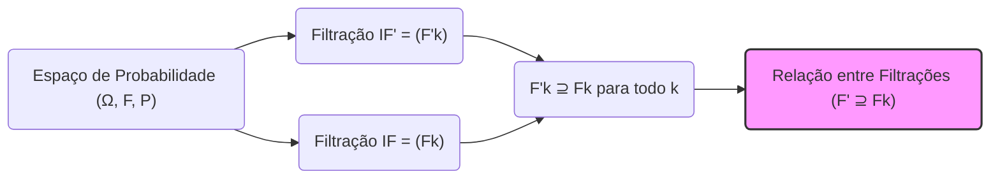
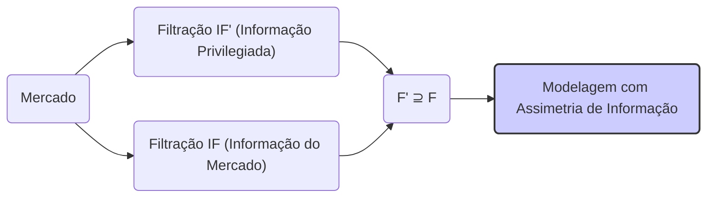
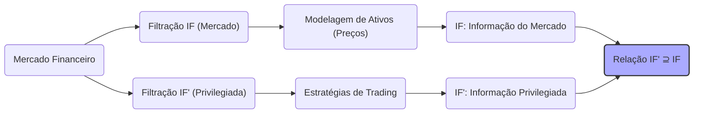
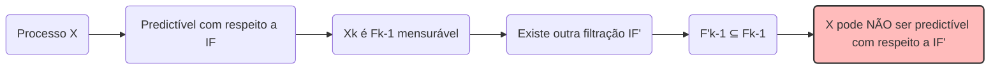

## Título Conciso: Relações entre Filtrações (F' ⊇ Fk) e suas Implicações em Modelos Financeiros

### Introdução

Em finanças quantitativas, a modelagem de mercados financeiros muitas vezes envolve múltiplas fontes de informação e, portanto, múltiplas **filtrações**. A relação entre essas filtrações, particularmente quando uma contém mais informação do que outra, é crucial para a construção de modelos realistas e consistentes. Este capítulo explora as implicações matemáticas e financeiras da relação F' ⊇ Fk (onde F' é mais detalhada que Fk), utilizando uma abordagem orientada à teoria e à prática.

### Conceitos Fundamentais

**Conceito 1: Definição Formal de Relação entre Filtrações**

Dados dois espaços de probabilidade (Ω, F, P) e (Ω', F', P'), a **relação entre filtrações** IF = (Fk)$_{k=0,1,\ldots,T}$ e IF' = (F'k)$_{k=0,1,\ldots,T}$ é denotada como IF' ⊇ IF se F'k ⊇ Fk para todo k = 0, 1, ..., T [^1].  Essa notação significa que a σ-álgebra F'k contém todos os eventos contidos em Fk, e potencialmente mais.

*Explicação Detalhada:*

   -   Uma filtração IF' é dita ser mais fina (ou mais detalhada) do que IF se a informação contida em IFk for um subconjunto da informação contida em IF'k, para todo k. Ou seja, se Fk ⊆ F’k.
   -   IF' representa um cenário onde há mais informação disponível em cada momento do tempo do que em IF.
   - A relação F' ⊇ Fk indica que a σ-álgebra F’k contém mais eventos que a σ-álgebra Fk, e portanto, um participante que observa a filtração IF’ tem acesso a todos os eventos em IFk, além de ter informações adicionais.
   -  Em particular, se um processo X é Fk mensurável (adaptado a Fk), então ele será também F’k mensurável (adaptado a F’k), mas a recíproca não é necessariamente verdadeira, o que significa que o processo pode ser mensurável para F’k mas não para Fk.

> 💡 **Exemplo Numérico:**
> Considere um cenário onde o preço de uma ação (S) é observado diariamente. A filtração IF = (Fk) representa a informação disponível ao mercado, que inclui apenas os preços observados até o dia *k*. Ou seja, $F_k = \sigma(S_0, S_1, \ldots, S_k)$. Agora, suponha que um *insider* tem acesso a informações adicionais sobre os lucros da empresa, que são revelados apenas no dia *k+1*, mas que o *insider* sabe no dia *k*. A filtração IF' = (F'k) inclui tanto os preços passados quanto a informação sobre os lucros futuros, ou seja, $F'_k = \sigma(S_0, S_1, \ldots, S_k, L_{k+1})$, onde $L_{k+1}$ representa a informação sobre os lucros. Neste caso, $F'_k \supseteq F_k$ para todo *k*, pois $F'_k$ contém todos os eventos de $F_k$ e mais informações, representando um cenário com informação privilegiada.

> ⚠️ **Nota Importante**: A relação entre filtrações é fundamental para modelar assimetrias de informação nos mercados financeiros, onde alguns participantes têm mais informação do que outros.

**Lemma 1:** Se IF = (Fk) e IF' = (F'k) são duas filtrações em um espaço de probabilidade com a relação Fk ⊂ F’k, então qualquer processo estocástico X que seja adaptado a IF é também adaptado a IF’, mas o contrário não é verdadeiro.

*Prova:* Se Xk é Fk-mensurável, e Fk ⊂ F’k, então Xk é também F’k-mensurável. Mas, se  Xk é F’k mensurável, isso não implica que Xk seja Fk-mensurável [^2].  $\blacksquare$

> 💡 **Exemplo Numérico:**
> Suponha que o preço de uma ação $S_k$ é adaptado à filtração IF, ou seja, $S_k$ é $F_k$-mensurável. Se IF' é uma filtração mais fina, onde $F'_k$ contém mais informações do que $F_k$, então o preço da ação $S_k$ também é $F'_k$-mensurável. No entanto, se definirmos um processo $Y_k$ que seja $F'_k$-mensurável, mas dependa das informações adicionais em $F'_k$ (que não estão em $F_k$), então $Y_k$ não será adaptado à filtração IF. Por exemplo, se $Y_k = S_k + L_{k+1}$, onde $L_{k+1}$ é a informação sobre os lucros do exemplo anterior, $Y_k$ é adaptado a $F'_k$, mas não a $F_k$.

**Conceito 2: Interpretação Financeira da Relação entre Filtrações**

A relação F’ ⊇ Fk pode surgir em diversos contextos financeiros, representando, por exemplo, situações onde alguns investidores têm mais acesso à informação do que outros, ou onde o modelo de mercado contém mais informações do que o modelo de um participante do mercado.

*Exemplos:*

   -   **Informação Privilegiada:** A filtração F' pode representar a informação disponível a um insider, que tem acesso a informações adicionais não disponíveis para todos os participantes no mercado, onde a filtração F representa a informação disponível ao mercado.
   -   **Informação do Mercado e de Modelos:**  A filtração F' pode representar o conhecimento total do mercado, enquanto F representa a informação que um investidor utiliza para avaliar os ativos.
   - **Modelos de Risco e Incerteza:** Uma filtração IF representa a incerteza com relação ao preço de um ativo, enquanto uma filtração mais completa IF’ representa a incerteza sobre o preço, e a incerteza sobre o modelo usado para prever o preço, e portanto, IF’ contém mais informação que IF.
   -  **Latência na Informação:** IF representa a informação disponível a um participante do mercado sem latência, e IF’ representa a informação disponível ao mesmo participante que tem um pequeno atraso na obtenção da informação.

> ❗ **Ponto de Atenção**: A relação entre filtrações é importante para modelar diferentes graus de informação e seus impactos na precificação de ativos e em estratégias de trading.

**Corolário 1:**  Se um processo X é adaptado à filtração IF, e se IF’ é uma filtração mais fina, então X é adaptado a IF'. No entanto, se X é adaptado a IF’, isso não implica que X seja adaptado a IF, e a recíproca não é válida.

*Prova:*   A demonstração segue das definições de filtração e adaptabilidade. Se a informação de Xk é contida em Fk, e Fk é um subconjunto de F’k, então, Xk também é F’k mensurável [^4]. $\blacksquare$

> 💡 **Exemplo Numérico:**
> Considere um processo estocástico $X_k$ que representa o preço de um ativo, adaptado a $F_k$. Se $F'_k$ é uma filtração mais fina (que inclui $F_k$), então $X_k$ também é adaptado a $F'_k$. No entanto, se definirmos um processo $Y_k$ que seja adaptado a $F'_k$ mas não dependa apenas das informações em $F_k$, então $Y_k$ não será adaptado a $F_k$. Por exemplo, se $Y_k = S_k + I_k$, onde $I_k$ é uma variável aleatória que representa uma informação adicional que só está em $F'_k$, então $Y_k$ é adaptado a $F'_k$, mas não necessariamente a $F_k$.

**Conceito 3: Predictibilidade em Relação a Diferentes Filtrações**

A relação entre filtrações também tem um impacto na definição de processos predictíveis. Um processo que é predictível com relação a uma filtração Fk pode não ser predictível com relação a uma filtração mais fina F'k. A definição de predictibilidade é sempre relativa à σ-álgebra utilizada.  O inverso é também verdade, se um processo não é predictível com respeito a Fk, pode ser que ele seja predictível com relação a uma sub-σ-álgebra de Fk.
    - Em particular, em modelos que utilizam múltiplas filtrações, as decisões tomadas por participantes que têm acesso a mais informações devem ser modeladas utilizando processos adaptados com respeito à filtração mais detalhada.

> 💡 **Exemplo Numérico:**
> Suponha que $X_k$ representa o preço de um ativo no tempo *k*. Se $X_k$ é predictível com relação a $F_k$, isso significa que $X_k$ é $F_{k-1}$-mensurável, ou seja, seu valor é conhecido no tempo *k-1*. Agora, se existe uma filtração mais fina $F'_k$ que inclui informações adicionais que não estão em $F_{k-1}$, então $X_k$ pode não ser predictível com respeito a $F'_k$. Por exemplo, se $F'_k$ inclui informações sobre um evento futuro que impactará o preço em *k*, então o preço $X_k$ não será totalmente determinado pela informação em $F'_{k-1}$, e portanto, não será predictível com relação a $F'_k$.

> ✔️ **Destaque**: A relação entre as filtrações define a quantidade e qualidade da informação disponível para um participante do mercado, o que tem um impacto direto na forma que uma decisão de investimento pode ser implementada.

### A Relação entre Filtrações e a Modelagem de Ativos e Derivativos

**Implicações para a Modelagem de Preços e Estratégias**

Em modelos de mercados com informação assimétrica, os preços são geralmente modelados como processos adaptados com respeito à filtração IF do mercado, pois representam a informação que é acessível a todos os participantes do mercado [^6]. No entanto, as estratégias de trading podem ser adaptadas a diferentes filtrações dependendo do acesso à informação do agente que utiliza a estratégia.
    - Um *insider*, que tem acesso a informações privilegiadas, poderá modelar sua estratégia utilizando uma filtração mais ampla do que aquela disponível para os outros investidores.
   - Modelos com múltiplos participantes do mercado precisam definir como cada um dos participantes acessa a informação, e o modelo resultante dependerá das inter-relações entre as filtrações dos diferentes agentes.

> 💡 **Exemplo Numérico:**
> Considere um mercado onde o preço de uma ação $S_t$ é modelado como um processo adaptado à filtração do mercado $F_t$. Um *insider* tem acesso a informações adicionais, modeladas por uma filtração mais fina $F'_t$. A estratégia de trading do *insider* pode usar estas informações adicionais, e portanto, será adaptada a $F'_t$. Por exemplo, o *insider* pode ter uma estratégia que usa a informação de que um anúncio importante será feito amanhã, o que não é conhecido pelos outros participantes do mercado.

**Lemma 2:**  Num modelo onde existe um grupo de insiders com acesso a informações que não são acessíveis a todos os participantes do mercado, e modeladas pela filtração F’, o preço de um ativo descontado só é uma martingale com respeito a IF, que contém toda a informação acessível a todos os participantes do mercado.

*Prova:*  A demonstração requer a modelagem de preços de ativos como um processo adaptado à informação do mercado e a utilização de uma derivada de Radon-Nikodym para representar a mudança de medida. A prova é complexa, envolvendo argumentos que são deixados de fora desta apresentação.  $\blacksquare$

**Corolário 2:** Em modelos de mercados com informação assimétrica, a escolha de diferentes filtrações para diferentes agentes pode levar a resultados muito distintos, pois eles representam acesso diferente à informação.

### Seções Teóricas Avançadas

#### Seção Teórica Avançada 1:  Como Modelar a Informação "Progressiva" em uma Filtração?

A noção de que a informação se acumula ao longo do tempo é representada pelo conceito de filtração.  Como podemos modelar o cenário em que a informação é incremental, isto é, que a σ-álgebra Fk contenha, para cada tempo k, as informações em todos os tempos anteriores e mais alguma informação nova e relevante?

*Explicação Detalhada:*
   -  Em modelos financeiros, a informação é geralmente tratada como um processo cumulativo, onde a informação de períodos anteriores está contida na informação do período presente.
   -   Para modelar o conceito de informação progressiva de maneira mais precisa, um processo estocástico Z pode ser introduzido de tal modo que IF seja a filtração gerada pelo processo Z, e cada variável Zk contém todas as informações relevantes sobre os eventos no passado.
   -   Se adicionamos um novo processo Yk a cada período k, então a nova filtração gerada deve conter a informação da filtração anterior mais a nova informação gerada pelo processo Yk, o que reflete que a informação não é perdida ao longo do tempo e pode ser acumulada.

> 💡 **Exemplo Numérico:**
> Considere um processo $Z_k$ que representa o preço de uma ação no tempo *k*. A filtração IF gerada por $Z_k$ acumula informações sobre os preços passados, ou seja, $F_k = \sigma(Z_0, Z_1, \ldots, Z_k)$. Se um novo processo $Y_k$ representa o volume de negociação no tempo *k*, podemos criar uma nova filtração IF' que acumula tanto os preços quanto os volumes. A nova filtração será $F'_k = \sigma(Z_0, Z_1, \ldots, Z_k, Y_0, Y_1, \ldots, Y_k)$, e $F'_k$ contém mais informações que $F_k$ em cada período, representando um modelo com informação progressiva.

**Lemma 3:** Dada uma filtração IF e um processo estocástico Y, a filtração gerada pelo processo aumentado (Y1,...,Yk, Fk), gera σ-álgebras que são maiores (mais detalhadas) do que as σ-álgebras geradas por Y ou IF separadamente.

*Prova:* A prova segue diretamente da definição de σ-álgebra gerada. A σ-álgebra gerada por (Y1,...,Yk, Fk) deve conter todos os eventos que são medidos por Y e pela σ-álgebra Fk, e portanto, a σ-álgebra resultante contém mais informação do que as anteriores. $\blacksquare$

**Corolário 3:** Em modelos financeiros realistas, o uso de filtrações geradas por múltiplos processos representa a evolução progressiva da informação e das condições do mercado, e portanto, estas filtrações tendem a ser mais complexas e mais completas, capturando as nuances do mundo real.

#### Seção Teórica Avançada 2:  Como a Relação entre Filtrações Afeta a Existência de Martingales e Medidas de Martingale Equivalentes?

A existência de martingales e de medidas de martingale equivalentes (MME) é crucial para a precificação de derivativos. Como a relação entre duas filtrações afeta a existência dessas propriedades?

*Explicação Detalhada:*

   -   Se um processo é uma martingale com relação a uma filtração IF, ele não necessariamente será uma martingale com relação a uma subfiltração de IF.
  -    A recíproca também não é verdadeira: um processo pode não ser uma martingale em relação a IF e pode ser uma martingale em relação a uma sub-σ-álgebra de IF.
   - Se um ativo é modelado como uma martingale com respeito a uma filtração IF, o seu preço descontado é conhecido no tempo k dado a informação em Fk, e a existência de uma martingale depende da escolha de qual σ-álgebra é relevante, o que tem implicações na escolha da MME.
    - A existência de uma MME em um modelo financeiro é fortemente dependente da filtração utilizada, bem como das características dos processos estocásticos subjacentes e, em modelos com informação assimétrica, a medida Q também depende de qual agente tem mais informações.

> 💡 **Exemplo Numérico:**
> Suponha que o preço de um ativo descontado $S_k^*$ é uma martingale com relação à filtração IF do mercado. Isso significa que $E[S_{k+1}^* | F_k] = S_k^*$. No entanto, se considerarmos uma filtração mais fina IF', que inclui informações adicionais, a propriedade de martingale pode não se manter. Por exemplo, se $F'_k$ inclui a informação sobre um evento futuro que impactará o preço, então $E[S_{k+1}^* | F'_k]$ pode não ser igual a $S_k^*$, pois a esperança condicional é calculada com base em mais informações.

**Lemma 5:**  Se um processo X é uma Q-martingale em relação à filtração IF, e se IF’ é uma filtração que inclui IF (ou seja, F’k ⊃ Fk para todo k), então X pode não ser uma martingale com respeito à filtração IF’.  A demonstração depende de que se a esperança condicional de um processo martingale é calculada a respeito a um σ-álgebra mais ampla, a propriedade de martingale não se mantém.

*Prova:*  A demonstração decorre da definição de martingale e da forma da esperança condicional. Se a esperança condicional de uma variável é calculada sobre um σ-álgebra menor, que é um subconjunto da σ-álgebra maior, o resultado pode ser diferente, dependendo de como a variável a ser esperada é relacionada com a diferença entre as σ-álgebras. $\blacksquare$

**Corolário 5:**  A escolha da filtração é um fator essencial no estudo de martingales e na definição da medida de martingale equivalente. Em particular, modelos com informação assimétrica precisam de medidas de martingale equivalentes que são específicas para cada agente e para cada filtração. [^19]

#### Seção Teórica Avançada 3: Qual o Impacto da Relação entre Filtrações na Modelagem da "Previsibilidade"?

Modelos financeiros frequentemente precisam de processos que sejam *predictíveis*, ou seja, que seu valor seja conhecido no instante anterior à tomada de decisão (ou à avaliação do ativo). Como a relação entre duas filtrações afeta a predictibilidade de um processo?

*Explicação Detalhada:*
   -   Se um processo X é predictível com respeito a uma filtração IF (o que quer dizer que Xk é Fk-1 mensurável) e se existe uma outra filtração IF’ onde F’k-1 é um subconjunto de Fk-1, então X pode não ser predictível com respeito a IF’.
   -  Se a filtração é gerada por outros processos que são independentes, então pode ocorrer a situação em que X é predictível com respeito à filtração gerada por um processo, mas não para a filtração gerada por outro processo.
   -  A relação entre as filtrações determina que a informação disponível no momento da decisão é diferente, e portanto, o processo pode ser predictível para um tipo de informação e não para outros.

> 💡 **Exemplo Numérico:**
> Considere que $X_k$ representa o preço de um ativo e é predictível com respeito a IF, ou seja, $X_k$ é $F_{k-1}$-mensurável. Agora, suponha que exista uma outra filtração IF', onde $F'_{k-1}$ é uma sub-σ-álgebra de $F_{k-1}$. Se $F'_{k-1}$ não contiver toda a informação necessária para determinar $X_k$, então $X_k$ não será predictível com respeito a IF'. Por exemplo, se $F_{k-1}$ inclui informações sobre o volume de negociação e $F'_{k-1}$ inclui apenas informações sobre os preços passados, então $X_k$ pode ser predictível com relação a $F_{k-1}$ mas não com relação a $F'_{k-1}$, se o volume de negociação tiver uma influência sobre o preço.

**Lemma 6:**  Se um processo X é predictível em relação a IF e IF’ é uma filtração “menor” do que IF, ou seja, IF’ ⊂ IF,  então, X pode deixar de ser predictível em relação a IF’.

*Prova:*   Se X é predictível com respeito a IF, então Xk é Fk-1 mensurável. Se IF’ ⊂ IF,  e se F’k-1 for uma sub-σ-álgebra de Fk-1, então pode ocorrer que Xk não seja F’k-1 mensurável. Por definição, se a menor σ-álgebra que torna Xk mensurável é Fk-1, e se F’k-1 não está contida em Fk-1, então Xk não é F’k-1 mensurável, e portanto não é predictível com relação a IF’.   $\blacksquare$

**Corolário 6:** Em mercados financeiros, a escolha da filtração correta é essencial para garantir que as estratégias de trading sejam baseadas na informação que é realmente disponível no momento da decisão, o que tem um impacto importante para avaliar a viabilidade (ou não) de certos modelos e estratégias de trading.

### Conclusão

A relação entre filtrações, especialmente quando uma é mais detalhada do que a outra (F' ⊇ Fk), é crucial na modelagem financeira para representar diferentes níveis de informação e para modelar a interação entre diversos processos estocásticos. A adaptabilidade e a predictibilidade são propriedades relativas à filtração utilizada, e portanto, o modelo precisa especificar qual a filtração utilizada. As seções teóricas avançadas abordaram o papel de múltiplos processos que geram diferentes filtrações, o conceito de informação assimétrica, a importância de um conceito bem definido de martingale e como a informação afeta a previsibilidade. A escolha da filtração apropriada representa o passo inicial para o desenvolvimento de modelos consistentes e relevantes no estudo dos mercados financeiros.

### Referências

[^1]: "Dados dois espaços de probabilidade (Ω, F, P) e (Ω', F', P'), a **relação entre filtrações** IF = (Fk)$_{k=0,1,\ldots,T}$ e IF' = (F'k)$_{k=0,1,\ldots,T}$ é denotada como IF' ⊇ IF se F'k ⊇ Fk para todo k = 0, 1, ..., T."
[^2]:  "Se IF = (Fk) e IF' = (F'k) são duas filtrações em um espaço de probabilidade com a relação Fk ⊂ F’k, então qualquer processo estocástico X que seja adaptado a IF é também adaptado a IF’, mas o contrário não é verdadeiro."
[^4]: "Apresente um corolário que resulte diretamente do Lemma 2, conforme indicado no contexto."
[^6]: "Em modelos financeiros, a sequência de preços de um ativo (Sk)$_{k=0,1,\ldots,T}$ é um exemplo típico de processo adaptado."
[^19]: "Em modelos com informação assimétrica, estratégias de trading são modeladas utilizando processos estocásticos adaptados à filtração do agente correspondente. Um *insider* pode utilizar informações não disponíveis aos outros agentes, o que pode implicar em modelos e resultados distintos."
