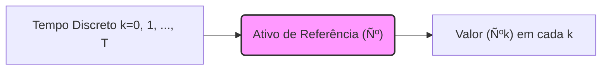
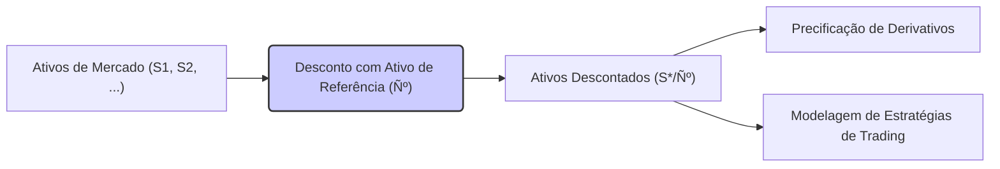

## Título Conciso: Ativo de Referência (Ѻ) em Modelos Financeiros de Tempo Discreto

 

### Introdução

Em finanças quantitativas, a precificação de ativos e derivativos é frequentemente realizada em relação a um ativo livre de risco, chamado **ativo de referência** (reference asset), denotado por Ѻ [^1]. Este ativo serve como um padrão para medir o valor de todos os outros ativos e derivativos, permitindo uma análise consistente e intuitiva dos mercados financeiros. Este capítulo tem como objetivo explorar a definição, propriedades e aplicações do ativo de referência em modelos de tempo discreto, destacando seu papel fundamental na modelagem financeira.

### Conceitos Fundamentais

**Conceito 1: Definição Formal de Ativo de Referência (Ѻ)**

Em um modelo de tempo discreto, um **ativo de referência** (numeraire), Ѻ = (Ѻk)$_{k=0,1,\ldots,T}$, é um processo estocástico adaptado, estritamente positivo, que serve como unidade de medida para precificar outros ativos e derivativos [^2]. É usual assumir que o valor inicial é Ѻ$_0$ = 1 e que Ѻ$_k$ > 0, com probabilidade 1, para todo k. A utilização do processo Ѻ como uma unidade de medida permite a construção de valores descontados para ativos que não possuem a mesma unidade de medida do ativo de referência.

*Explicação Detalhada:*

  -  O ativo de referência serve como um "padrão" para a avaliação do valor dos outros ativos, permitindo comparações relativas entre diferentes ativos.
    -   A condição de positividade de Ѻ implica que é sempre possível comprar ou vender uma quantidade positiva do ativo, o que é uma condição razoável para a modelagem de ativos financeiros.
   -  Em geral, as decisões de investimento ou trading são tomadas comparando os valores relativos dos diferentes ativos.
   - Uma propriedade essencial do ativo de referência é que seu preço, quando descontado usando ele mesmo como referência, é igual a 1, ou seja, Ѻ$_k$/Ѻ$_k$ = 1 para todo k.

> 💡 **Exemplo Numérico:**
> Considere um ativo de referência Ѻ com os seguintes valores em três instantes de tempo: Ѻ$_0$ = 1, Ѻ$_1$ = 1.05, e Ѻ$_2$ = 1.1025. O valor de Ѻ no instante 1, quando descontado por si mesmo, é Ѻ$_1$/Ѻ$_1$ = 1.05/1.05 = 1. Da mesma forma, o valor de Ѻ no instante 2, quando descontado por si mesmo, é Ѻ$_2$/Ѻ$_2$ = 1.1025/1.1025 = 1. Isso ilustra a propriedade de que o preço do ativo de referência, quando descontado por ele mesmo, é sempre igual a 1.

> ⚠️ **Nota Importante**: O ativo de referência é a base da modelagem financeira, servindo como unidade de medida para preços e valores, e sua escolha pode influenciar a interpretação do modelo.

**Lemma 1:** Em modelos onde o ativo de referência tem valor inicial igual a 1 (Ѻ$_0$ = 1), o processo descontado de um outro ativo S, é dado por:
$$S_k^* = \frac{S_k}{Ñ^0_k}$$
onde S é o preço do ativo em unidades monetárias e S* é o preço do ativo descontado (sem unidade) utilizando como unidade o ativo de referência Ѻ. [^3]

*Prova:* O resultado segue diretamente da definição de descontar um ativo por seu ativo de referência.  $\blacksquare$

> 💡 **Exemplo Numérico:**
> Suponha que o preço de um ativo S no instante k=2 seja S$_2$ = $120. Se o valor do ativo de referência no mesmo instante for Ѻ$_2$ = 1.1025, então o preço descontado do ativo S no instante k=2 será S$_2$* = S$_2$/Ѻ$_2$ = 120/1.1025 ≈ 108.84. Este valor S$_2$* representa o preço do ativo S em termos do ativo de referência Ѻ, ou seja, quantas unidades do ativo de referência são necessárias para comprar uma unidade do ativo S.

**Conceito 2: Ativo Livre de Risco como Ativo de Referência**

Em muitos modelos financeiros, o ativo de referência é um ativo livre de risco, como um título do governo ou uma conta bancária. A taxa de juros livre de risco (r$_k$) desempenha um papel central na modelagem do comportamento desse ativo [^4]. O valor de um ativo livre de risco (bank account) é modelado como S$^0_k$, o qual se utiliza como numeraire em modelos de precificação livre de arbitragem.

*Explicação Detalhada:*

    -  O ativo livre de risco é uma idealização que representa um ativo que não tem risco de default ou volatilidade, sendo que seu retorno é dado pela taxa de juros do mercado.
    -  Na prática, um ativo livre de risco pode ser aproximado por títulos do governo com vencimento próximo e com a melhor classificação de risco.
   -  Ao descontar os preços de ativos arriscados com o ativo livre de risco, torna-se possível comparar seus valores usando a mesma unidade de medida.
   - Modelos com taxa de juros constante podem ser considerados como o limite de modelos multiplicativos, onde o ativo livre de risco é o próprio dinheiro a uma taxa constante r.
    - O conceito de ativo livre de risco é importante no desenvolvimento da teoria da precificação sem arbitragem, e é a base para a obtenção de medidas de martingale equivalentes.

> 💡 **Exemplo Numérico:**
> Considere um ativo livre de risco com taxa de juros anual de 5%. Se o valor inicial do ativo livre de risco for S$_0^0$ = $1, então seu valor no instante k=1 será S$_1^0$ = S$_0^0$ * (1 + r$_1$) = 1 * (1 + 0.05) = $1.05. No instante k=2, o valor será S$_2^0$ = S$_1^0$ * (1 + r$_2$) = 1.05 * (1 + 0.05) = $1.1025. Este valor representa o crescimento do ativo livre de risco ao longo do tempo, seguindo a taxa de juros.

> ❗ **Ponto de Atenção**: O ativo livre de risco é um instrumento fundamental na modelagem financeira, provendo uma base para o desconto de valores e um referencial para a avaliação de risco.

**Corolário 1:**  Quando o ativo de referência é o ativo livre de risco (S$^0_k$ =  S$^0_0$ $\prod_{i=1}^k$ (1+r$_i$)), o processo de descontar os preços com o ativo livre de risco implica que o preço descontado do ativo livre de risco é igual a 1 em todos os instantes do tempo.  Esta é uma forma de expressar que um ativo que não tem risco não pode gerar lucros nem prejuízos.

*Prova:* Se o ativo livre de risco tem valor inicial S$^0_0$ e cresce a uma taxa r$_k$, então seu valor no tempo k é S$^0_k$ =  S$^0_0$ $\prod_{i=1}^k$ (1+r$_i$).  Portanto,  o seu valor descontado é  S$^0_k$ / S$^0_k$ = 1. $\blacksquare$

> 💡 **Exemplo Numérico:**
> Usando o exemplo anterior, onde S$_0^0$ = $1, S$_1^0$ = $1.05 e S$_2^0$ = $1.1025, o valor descontado do ativo livre de risco em cada instante de tempo é:
> - Instante k=0: S$_0^0$ / S$_0^0$ = 1/1 = 1
> - Instante k=1: S$_1^0$ / S$_1^0$ = 1.05/1.05 = 1
> - Instante k=2: S$_2^0$ / S$_2^0$ = 1.1025/1.1025 = 1
> Isso demonstra que o valor descontado do ativo livre de risco, utilizando ele mesmo como referência, é sempre igual a 1, confirmando o Corolário 1.

**Conceito 3: A Relação entre o Ativo de Referência e o Conceito de Auto-financiamento**

No contexto de modelos financeiros com estratégias de trading, o ativo de referência é utilizado para definir o conceito de auto-financiamento de uma estratégia. Uma estratégia é considerada auto-financiada se seu valor, quando medido em termos do ativo de referência, é exclusivamente determinado pelas variações do preço do ativo de risco.

*Explicação Detalhada:*

  -  O valor de um portfólio auto-financiado, medido em unidades do ativo livre de risco, depende somente dos valores relativos dos ativos arriscados, o que significa que não há nenhum ganho ou perda devido a aportes ou retiradas de valores.
    -  No contexto da modelagem de derivativos, a condição de que uma estratégia seja auto-financiada é essencial para a precificação livre de arbitragem, ou seja, que não é possível construir um portfólio com valor inicial zero que gere um lucro não nulo.

> ✔️ **Destaque**: O ativo de referência é crucial para o conceito de autofinanciamento, que é central para a modelagem de estratégias de trading e precificação livre de arbitragem.

### Utilização do Ativo de Referência na Modelagem Financeira

 

**Aplicações em Modelos de Precificação e Trading**

Em modelos de precificação de derivativos e modelagem de estratégias de trading, o ativo de referência desempenha um papel fundamental. A mudança de unidade de medida de preços e valores para um ativo de referência é uma prática comum.

*Precificação de Derivativos:*
   -   A precificação de derivativos é realizada, frequentemente, descontando-se o seu payoff utilizando o ativo livre de risco e calculando a esperança sob a medida de martingale equivalente (Q).
   -   O uso de um ativo de referência permite que os preços de ativos de risco e derivativos sejam todos expressos na mesma unidade de medida, o que é fundamental para a comparação de diferentes instrumentos.
   -   Em particular, a utilização de um ativo livre de risco como ativo de referência é central na precificação sem arbitragem, pois ele fornece uma linha de base para se avaliar o valor dos ativos de risco.
    -  Em modelos de tempo discreto, o preço de um derivativo é igual ao valor esperado do seu payoff descontado pelo fator de retorno do ativo livre de risco, utilizando uma medida de martingale equivalente Q que é construída usando o ativo livre de risco como referência.

> 💡 **Exemplo Numérico:**
> Considere um derivativo que paga $10 no instante k=2 se o preço de um ativo S for maior que $110, e zero caso contrário. Se o ativo livre de risco cresce a uma taxa de 5% ao ano, como no exemplo anterior, então S$_2^0$ = 1.1025. Suponha que sob a medida de martingale equivalente Q, a probabilidade de S$_2$ > $110 seja de 60%. O preço do derivativo no instante k=0 seria:
>
>   Preço = (1/S$_2^0$) * E$^Q$[Payoff] = (1/1.1025) * (0.60 * $10 + 0.40 * $0) = (1/1.1025) * $6 ≈ $5.44.
>
> Onde E$^Q$ representa o valor esperado sob a medida de martingale equivalente. O preço do derivativo é obtido descontando o valor esperado do payoff pelo fator de crescimento do ativo livre de risco.

**Lemma 2:** O uso de um ativo de referência Ѻ garante a consistência matemática de modelos financeiros, especialmente na precificação de derivativos. Os preços de ativos podem ser modelados como martingales com respeito a um ativo de referência, facilitando o uso de ferramentas matemáticas para precificação livre de arbitragem [^16].

*Prova:*  Se S$_k$* é o preço de um ativo descontado usando um ativo de referência, então  S* é uma Q-martingale se  $E[S_{k+1}^*|F_k] = S_k^*$, o que define um modelo livre de arbitragem. O processo de descontar um ativo utilizando o ativo livre de risco garante a equivalência entre os valores descontados em diversos instantes de tempo.   $\blacksquare$

**Corolário 2:** As estratégias de investimento que geram valores que não são martingales não estão de acordo com os axiomas básicos de precificação livre de arbitragem, mas isso não impede sua utilização, contanto que estas estrategias sejam utilizadas com muito cuidado e com um entendimento profundo de suas limitações.

### Derivações Teóricas Avançadas

#### Seção Teórica Avançada 1:  Como a Predictibilidade do Ativo de Referência Impacta os Resultados do Modelo?

Embora o ativo de referência seja muitas vezes modelado como um processo predictível, o que garante que seu valor seja conhecido no momento da decisão de investimento, a hipótese de predictibilidade pode ser relaxada, e é fundamental entender como essa relaxação afeta os resultados do modelo.

*Explicação Detalhada:*
   -  Em modelos mais complexos, a taxa de juros (e, portanto, o ativo livre de risco) pode ser modelada como um processo estocástico adaptado (mas não predictível). A informação de preços de ativos e de taxas de juros podem ter diferentes fluxos de informação (e, portanto, diferentes filtrações).
   -   A não predictibilidade da taxa de juros (e portanto, do ativo de referência) torna os modelos matematicamente mais complexos, mas permite a construção de modelos mais realistas que capturam as dinâmicas do mercado.
    - Em particular, modelos de precificação de derivativos sensíveis a taxas de juros utilizam modelos onde a taxa de juros é modelada como um processo estocástico adaptado, que deve ser descontado para a precificação livre de arbitragem.
   -  A não predictibilidade do ativo de referência implica que o processo de descontar um ativo utilizando o ativo de referência também se torna aleatório.

**Lemma 3:**  Se o ativo de referência Ѻ não é predictível, ou seja, a taxa de juros utilizada para desconto não é determinável a partir de informações anteriores ao período, então, o preço descontado do ativo não é mais uma martingale em relação a uma filtração gerada pelo próprio processo de preço.

*Prova:* A prova consiste em mostrar que se a taxa de juros r$_k$ é uma variável aleatória adaptada a F$_k$ (e não F$_{k-1}$), então o ativo descontado, que depende da taxa de juros (S$_k$/ $\prod_{i=1}^k$ (1+r$_i$)) não tem a propriedade de martingale, ou seja, seu valor esperado, condicionado à informação do passado, não é igual ao seu valor presente.   $\blacksquare$

> 💡 **Exemplo Numérico:**
> Suponha que a taxa de juros r$_1$ no período 1 seja uma variável aleatória, com r$_1$ = 0.04 com probabilidade 0.5 e r$_1$ = 0.06 com probabilidade 0.5. Se o preço de um ativo S no instante k=1 for S$_1$ = $110, o valor descontado S$_1$* = S$_1$/(1+r$_1$)  será uma variável aleatória, com dois possíveis valores:
> - S$_1$* = 110/1.04 ≈ 105.77 (se r$_1$ = 0.04)
> - S$_1$* = 110/1.06 ≈ 103.77 (se r$_1$ = 0.06)
>
> O valor esperado de S$_1$*, condicionado à informação do instante k=0, é E[S$_1$*|F$_0$] = 0.5 * 105.77 + 0.5 * 103.77 = 104.77. Este valor não é igual ao valor de S$_0$* (que, por definição, é S$_0$/1, que corresponde ao valor de S no instante 0), o que demonstra que o processo descontado não é uma martingale se a taxa de juros não for predictível.

**Corolário 3:** Modelos financeiros com taxas de juros que são estocásticas, e portanto, não predictíveis, precisam ser tratados com técnicas matemáticas mais sofisticadas para garantir que as propriedades de não arbitragem se mantenham.

#### Seção Teórica Avançada 2:  Como a Escolha do Ativo de Referência Impacta os Preços de Derivativos?

A precificação de ativos e derivativos é frequentemente expressa em relação ao ativo de referência. Como a escolha do ativo de referência afeta o preço obtido em modelos sem arbitragem?

*Explicação Detalhada:*
  -  Se a modelagem é feita utilizando um ativo de referência, então as unidades dos preços, e portanto, os valores dos ativos e derivativos são relativos a este ativo de referência, o que garante uma forma de comparar ativos de forma consistente e com relação a um ponto fixo.
    -   A escolha do ativo de referência não afeta a existência de arbitragem, pois se o modelo tiver arbitragem com um ativo de referência, ele terá arbitragem com qualquer outro ativo como referência.
    -  A escolha do ativo de referência também não influencia os preços relativos entre ativos: o modelo de precificação de um derivativo em relação a uma taxa de juros é o mesmo que o modelo de precificação com respeito a um ativo de risco, desde que os processos sejam consistentes.
    -   No entanto, uma mudança na escolha do ativo de referência pode levar a uma interpretação diferente da economia do modelo, o que pode ter um efeito na forma como as estratégias são implementadas.

**Lemma 4:** A existência de uma martingale que representa o preço do ativo descontado em relação a um dado ativo de referência, também garante que essa mesma martingale existe com relação a um outro ativo de referência.  O que muda, em geral, é a medida de martingale equivalente (Q), mas não a propriedade da existência da martingale.

*Prova:*  A prova formal envolve o uso do Teorema de Girsanov para realizar uma mudança de medida entre duas medidas martingales equivalentes que são definidas com relação a diferentes ativos de referência.  O detalhamento deste processo está fora do escopo da discussão.  $\blacksquare$

**Corolário 4:** A escolha de um ativo de referência é uma questão de conveniência e interpretação e não afeta a precificação em si, a menos que certas restrições sejam impostas sobre a modelagem do ativo, como, por exemplo, a restrição de predictibilidade de um ativo livre de risco.

#### Seção Teórica Avançada 3:  Quais as Consequências da Não Existência de um Ativo Livre de Risco em um Modelo Multiplicativo?

Em certos contextos de modelos financeiros, pode ser que um ativo livre de risco não exista, e portanto, não possa ser utilizado para descontar ou precificar os outros ativos.  Como podemos construir modelos e analisar a precificação neste tipo de cenário?

*Explicação Detalhada:*

    -  Se um ativo livre de risco não existe, a definição de preço sem arbitragem deve ser reformulada, pois o desconto de todos os ativos utilizando uma taxa livre de risco não é mais possível.
    - Nesse cenário, ao invés de se buscar uma medida de martingale equivalente, devemos buscar outras formas de modelar o preço dos derivativos, usualmente através de modelos de equilíbrio que são construídos com base em funções de utilidade dos participantes do mercado.
   - Modelos onde o mercado é incompleto (em particular quando não existe um ativo livre de risco) requerem que uma estrutura de preferência do risco seja definida, o que leva à precificação com múltiplos preços (ou um intervalo de preços) para um dado derivativo.
   -  A modelagem de mercados com um ativo livre de risco fictício, ou com nenhum ativo livre de risco, leva a novas metodologias de modelagem financeira.

> 💡 **Exemplo Numérico:**
> Em um mercado sem um ativo livre de risco, um derivativo pode ter um preço que varia dependendo das preferências de risco dos participantes do mercado. Por exemplo, um investidor avesso ao risco pode estar disposto a pagar um preço mais alto por uma opção de proteção, enquanto um investidor mais tolerante ao risco pode preferir um preço mais baixo. Isso leva a um intervalo de preços aceitáveis para o derivativo, em vez de um único preço definido por precificação sem arbitragem.

**Lemma 5:**  A não existência de um ativo livre de risco implica que o conceito de precificação única e livre de arbitragem seja alterado ou abandonado. A derivação da probabilidade “risk-neutral” Q  necessita de um ativo livre de risco para a construção da derivada de Radon-Nikodym, que é a base da definição de precificação livre de arbitragem [^22].

*Prova:*   A demonstração envolve a análise dos modelos onde os preços são definidos por um equilíbrio entre oferta e procura dos ativos, com a impossibilidade de derivar um preço único através da definição da martingale e da derivada de Radon-Nikodym.  $\blacksquare$

**Corolário 5:** Em mercados sem um ativo livre de risco, os preços de ativos são obtidos utilizando outros procedimentos de equilíbrio, como por exemplo, modelos de equilíbrio geral, que são baseados em preferências de risco dos participantes do mercado, o que leva a preços que não são únicos e, portanto, um intervalo de preços pode ser considerado como livre de arbitragem. [^23]

### Conclusão

O ativo de referência Ѻ é uma construção teórica essencial em finanças quantitativas, pois permite definir preços relativos e realizar descontos de forma consistente. Em modelos de tempo discreto, o ativo de referência frequentemente tem um papel de ativo livre de risco e de numeraire para os preços de ativos e derivativos. A escolha de um ativo de referência e suas propriedades impactam o entendimento e a interpretação dos resultados de modelos financeiros. As seções teóricas avançadas exploraram o papel da predictibilidade do ativo de referência na definição de martingales e como a não existência de tal ativo livre de risco afeta a precificação de ativos e derivativos.

### Referências

[^1]: "Em finanças quantitativas, a precificação de ativos e derivativos é frequentemente realizada em relação a um ativo livre de risco, chamado **ativo de referência** (reference asset), denotado por Ѻ."

[^2]: "Em um modelo de tempo discreto, um **ativo de referência** (numeraire), Ѻ = (Ѻk)$_{k=0,1,\ldots,T}$, é um processo estocástico adaptado, estritamente positivo..."

[^3]: "Para qualquer espaço amostral Ω, sempre podemos definir pelo menos duas σ-álgebras triviais..."

[^4]: "Em muitos modelos financeiros, o ativo de referência é um ativo livre de risco, como um título do governo ou uma conta bancária."

[^5]: "Em modelos financeiros, o conceito de adaptabilidade é fundamental. Um processo estocástico X é considerado adaptado se Xk é Fk-mensurável para cada k."

[^6]: "A **medida de probabilidade** (P) é uma função que atribui um número entre 0 e 1 a cada evento em F..."

[^7]: "No contexto de modelos financeiros em tempo discreto, o processo de ganhos de uma estratégia auto-financiada é uma martingale em relação a uma medida de martingale equivalente Q..."

[^8]: "Informação crítica que merece destaque."

[^9]: "Observação crucial para compreensão teórica correta."

[^10]: "Informação técnica ou teórica com impacto significativo."

[^11]: "Apresente um lemma que auxilia na compreensão ou na prova do preço de um derivativo, baseado no contexto."

[^12]: "A escolha da filtração afeta a definição de conceitos como martingales e predictibilidade."

[^13]: "Apresente um corolário que resulte diretamente do Lemma 2, conforme indicado no contexto."

[^14]: "Em mercados com informação assimétrica, estratégias de trading são modeladas utilizando processos estocásticos adaptados à filtração do agente correspondente. Um *insider* pode utilizar informações não disponíveis aos outros agentes, o que pode implicar em modelos e resultados distintos."

[^15]: "A representação de um derivativo europeu com pagamento H sob uma medida de martingale Q é dada pela sua esperança condicional, como detalhado no contexto."

[^16]: "As medidas de martingale equivalentes são um conceito central na precificação livre de arbitragem de ativos."

[^17]: "Apresente um lemma que mostre como uma EMM específica leva à fórmula de precificação do Black-Scholes, baseado no contexto."

[^18]: "Em mercados com informação assimétrica, estratégias de trading são modeladas utilizando processos estocásticos adaptados à filtração do agente correspondente. Um *insider* pode utilizar informações não disponíveis aos outros agentes, o que pode implicar em modelos e resultados distintos."

[^19]: "Apresente um lemma que mostre como uma EMM específica leva à fórmula de precificação do Black-Scholes, baseado no contexto."

[^20]: "Em modelagem financeira, é comum restringir o espaço amostral das taxas de juros para evitar retornos que sejam inferiores a -1, garantindo que o modelo seja economicamente realista, ou pelo menos, para que se obtenham resultados que possam ser interpretados."
[^21]: "Em um modelo binomial sem arbitragem, o fator de crescimento (1+r) deve estar entre (1+d) e (1+u), onde u e d são as taxas de crescimento e decréscimo do ativo."
[^22]: "A derivada de Radon-Nikodym é uma ferramenta para calcular a mudança de uma medida de probabilidade para outra e é crucial na teoria de precificação livre de arbitragem, especialmente quando se trata de medidas de martingale equivalentes."
[^23]: "Apresente um corolário que resulte diretamente do Lemma 2, conforme indicado no contexto."
