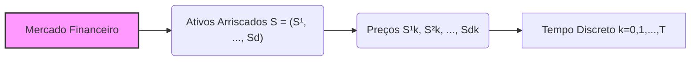
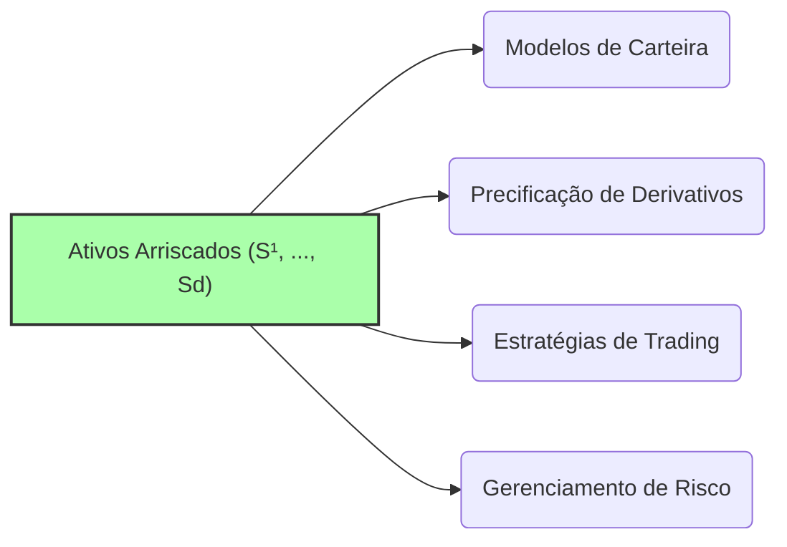

## Título Conciso: Ativos Arriscados (S = (S¹, ..., Sd)) em Modelagem Financeira Discreta

### Introdução

Em finanças quantitativas, a modelagem de mercados financeiros muitas vezes envolve a representação de múltiplos ativos arriscados, cujos preços evoluem de forma incerta ao longo do tempo. Um conjunto de ativos arriscados é representado por um processo estocástico vetorial S = (S¹, ..., Sd), onde cada componente Si representa um ativo distinto [^1]. Este capítulo explora a definição, as propriedades e o papel de ativos arriscados em modelos financeiros de tempo discreto, fornecendo uma base sólida para a modelagem de carteiras de investimento, precificação de derivativos e gestão de riscos.

### Conceitos Fundamentais

**Conceito 1: Definição Formal de um Processo de Ativos Arriscados**

Um processo de ativos arriscados S = (S¹, ..., Sd) é um processo estocástico vetorial, onde cada componente Si = (Sik)$_{k=0,1,\ldots,T}$ representa o preço de um ativo arriscado ao longo do tempo [^2]. O tempo *k* é discreto (k=0,1,...,T) e cada ativo tem uma sequência de preços. Formalmente, Sik é uma variável aleatória definida no espaço de probabilidade $(\Omega, \mathcal{F}, P)$, representando o preço do ativo *i* no tempo *k*.

*Explicação Detalhada:*

   -   Um ativo arriscado, como uma ação de uma empresa, não tem um valor conhecido antecipadamente, e a sua trajetória no tempo é modelada por um processo estocástico, que captura a sua incerteza.
  -   O valor de cada Si é expressa em unidades da moeda utilizada no mercado ou, mais genericamente, em unidades do ativo de referência.
  -  O vetor de preços S = (S¹, ..., Sd) contém a informação do preço de cada um dos d ativos no mercado, em cada instante k.
   -   O índice d representa o número de diferentes ativos arriscados presentes no modelo, e pode incluir, por exemplo, ações, opções e outros ativos com algum grau de incerteza.
   -  A estrutura vetorial permite modelar mercados com múltiplos ativos, e explorar a influência de uns sobre os outros.

> ⚠️ **Nota Importante**: Um processo de ativos arriscados representa o comportamento dos preços de múltiplos ativos no mercado, e é fundamental para a modelagem da tomada de decisão e da gestão de risco em cenários mais complexos.

> 💡 **Exemplo Numérico:**
> Considere um mercado com dois ativos arriscados, S¹ e S², e um horizonte de tempo de 3 períodos (k=0, 1, 2, 3). Os preços dos ativos em cada período podem ser representados como:
>
> - S¹ = (S¹₀, S¹₁, S¹₂, S¹₃) = (100, 105, 110, 108)
> - S² = (S²₀, S²₁, S²₂, S²₃) = (50, 52, 55, 57)
>
> Aqui, S¹₀ = 100 é o preço inicial do ativo 1, S¹₁=105 é o preço no período 1, e assim por diante. O vetor S = (S¹, S²) representa o processo de preços dos dois ativos arriscados ao longo do tempo.

**Lemma 1:** Em modelos onde os fatores de crescimento são estritamente positivos, o preço de cada ativo arriscado Si, dado por $S_{ik} = S_{i0} \prod_{j=1}^k Y_{ij}$, é sempre positivo quase certamente (P-a.s.), onde $S_0$ é o preço inicial e $Y_{ij}$ são os fatores de crescimento associados ao ativo i no tempo j.

*Prova:* Se S0 é positivo, e se os fatores $Y_{ij}$ são estritamente positivos, então o produto dos fatores, que gera $S_{ik}$, é sempre positivo e a probabilidade de $S_{ik}=0$ é zero.  $\blacksquare$

> 💡 **Exemplo Numérico:**
> Suponha que o preço inicial do ativo S¹ seja S¹₀ = 100 e que os fatores de crescimento sejam Y¹₁=1.05, Y¹₂=1.04 e Y¹₃=0.98. Então, os preços nos tempos k=1, 2 e 3 serão:
>
> - S¹₁ = 100 * 1.05 = 105
> - S¹₂ = 100 * 1.05 * 1.04 = 109.2
> - S¹₃ = 100 * 1.05 * 1.04 * 0.98 = 107.016
>
> Como todos os fatores de crescimento são positivos, o preço do ativo permanece sempre positivo.

**Conceito 2: Adaptabilidade e Predictibilidade para Ativos Arriscados**

Em modelos financeiros, é fundamental que os preços de ativos arriscados S = (S¹, ..., Sd) sejam processos adaptados com respeito a uma filtração IF = (Fk)$_{k=0,1,\ldots,T}$, que representa a informação disponível no mercado ao longo do tempo. Isso significa que Sik, o preço do ativo i no tempo k, é uma variável aleatória que é Fk-mensurável [^3].
     - Estratégias de negociação que dependem dos preços de ativos arriscados devem ser, no entanto, predictíveis em relação à filtração, que é mais restritivo.

*Explicação Detalhada:*

    -  A adaptabilidade garante que o preço de um ativo arriscado seja conhecido (observável) no momento em que é utilizado para a precificação de outro derivativo ou na tomada de decisões de investimento.
   -   A predictibilidade de um processo representa a propriedade de que seu valor em um determinado instante de tempo k é determinado pelo que aconteceu nos momentos anteriores (e não por eventos do futuro).
    - Os modelos devem ser construídos de forma causal, onde as decisões são tomadas com base nas informações disponíveis e não em informações que não foram obtidas até o momento da tomada de decisão.

> ❗ **Ponto de Atenção**: A adaptabilidade e predictibilidade são restrições importantes na modelagem de ativos arriscados e estratégias de negociação em mercados financeiros.

> 💡 **Exemplo Numérico:**
> Suponha que a informação disponível no mercado no tempo k=1 (F₁) inclua o preço do ativo S¹ no tempo k=0 (S¹₀) e o preço do ativo S² no tempo k=0 (S²₀), além de outras informações relevantes. O preço do ativo S¹ no tempo k=1 (S¹₁) deve ser mensurável em relação a F₁, ou seja, o valor de S¹₁ deve ser conhecido com base na informação disponível em F₁. Um exemplo de estratégia de negociação predictível seria comprar o ativo S¹ no tempo k=1 se o preço de S¹ no tempo k=0 (S¹₀) for menor que 100. Esta decisão é baseada em informação disponível no tempo k=0, e portanto é predictível.

**Corolário 1:** Se os preços de um ativo arriscado são modelados utilizando um modelo multiplicativo, onde
  $$S^i_k = S^i_0 \prod_{j=1}^{k}Y^i_j$$
onde $Y_{ij}$ são os retornos, então cada Si é adaptado a uma filtração gerada pelos fatores de retorno, ou seja,  IF = (Fk)$_{k=0,1,\ldots,T}$ onde $F_k = \sigma(Y^1_1, \ldots, Y^1_k, \ldots, Y^d_1, \ldots, Y^d_k)$.

*Prova:*  Por definição, a filtração gerada pelos retornos Y representa a informação acumulada sobre os valores dessas variáveis, e as variáveis que representam o preço do ativo podem ser expressas como uma função de retornos passados.  $\blacksquare$

> 💡 **Exemplo Numérico:**
> Se os retornos do ativo S¹ são Y¹₁=1.05, Y¹₂=1.04 e Y¹₃=0.98, então a filtração $F_2 = \sigma(Y^1_1, Y^1_2)$. O preço do ativo no tempo k=2, S¹₂, que é dado por S¹₀ * Y¹₁ * Y¹₂, é adaptado à filtração F₂, pois o valor de S¹₂ é determinado pelos retornos até o tempo k=2, que fazem parte de F₂.

**Conceito 3: Relação entre Ativos Arriscados e Ativo de Referência**

Em muitos modelos financeiros, a modelagem da dinâmica dos ativos arriscados depende de uma taxa de juros livre de risco, que é o ativo de referência (Ѻ) e, por meio dela, de uma probabilidade de martingale Q.  A taxa de juros r, e portanto o ativo de referência, pode ou não ser correlacionado com os outros ativos.

*Explicação Detalhada:*
   -   A taxa de juros (e o ativo livre de risco) é utilizada para descontar o valor de ativos arriscados.
   -   A modelagem simultânea dos ativos de risco e do ativo de referência permite que a interação e a dependência entre eles sejam explicitamente consideradas.
   -  A relação entre os ativos de risco e o ativo de referência é crucial para a precificação livre de arbitragem de derivativos, que depende da construção de medidas de martingale equivalentes Q.

> ✔️ **Destaque**: A modelagem conjunta de ativos arriscados e do ativo de referência permite capturar a relação fundamental entre risco e retorno em mercados financeiros.

> 💡 **Exemplo Numérico:**
> Suponha que o preço do ativo de referência (livre de risco) no tempo k seja dado por Ѻk = Ѻ₀(1+r)^k, onde r é a taxa de juros livre de risco e Ѻ₀ é o preço inicial do ativo. Se Ѻ₀ = 100 e r = 0.05 (5%), então os valores do ativo de referência nos tempos k=0, 1 e 2 são:
>
> - Ѻ₀ = 100
> - Ѻ₁ = 100 * (1 + 0.05) = 105
> - Ѻ₂ = 100 * (1 + 0.05)² = 110.25
>
> A taxa de juros r é utilizada para descontar os fluxos de caixa futuros dos ativos arriscados para determinar seus valores presentes.

### Aplicações de Ativos Arriscados em Modelagem Financeira

**Modelagem de Carteiras e Alocação de Ativos**

O estudo do comportamento de ativos arriscados é fundamental para modelar carteiras de investimento. Diversos modelos de otimização de carteiras e alocação de ativos dependem da caracterização da evolução dos preços de múltiplos ativos, bem como a suas covariâncias.
   -   Os preços de ativos arriscados são utilizados para calcular os retornos e a volatilidade de diferentes carteiras de investimento, e para estabelecer relações de dominância estocástica.
   - Modelos de otimização de carteiras, como o modelo de Markowitz, determinam a composição ótima do portfólio, balanceando o risco e o retorno desejado, usando as distribuições dos ativos como *input*.
    -  Modelos de equilíbrio são utilizados para derivar os preços de ativos arriscados através de uma análise das escolhas dos agentes.

**Lemma 3:** A diversificação de um portfólio pode reduzir o risco total do investimento se os ativos que compõem a carteira não forem perfeitamente correlacionados.

*Prova:* A demonstração se baseia nas propriedades da variância de uma combinação linear de variáveis aleatórias. Se os ativos não são perfeitamente correlacionados, então a variância da carteira é menor do que a soma ponderada das variâncias de cada ativo individual.   $\blacksquare$

> 💡 **Exemplo Numérico:**
> Considere uma carteira com dois ativos, S¹ e S², com os seguintes retornos esperados e desvios padrão:
>
> | Ativo | Retorno Esperado | Desvio Padrão |
> |---|---|---|
> | S¹ | 10% | 20% |
> | S² | 15% | 25% |
>
> Se a correlação entre os retornos de S¹ e S² for 0.5, a diversificação reduz o risco total da carteira em comparação com o risco de cada ativo individualmente. Uma carteira com 50% em S¹ e 50% em S² terá um risco menor do que uma carteira com 100% em S¹ ou 100% em S².

**Precificação de Derivativos com Ativos Arriscados**

A precificação de derivativos, que são contratos cujos pagamentos dependem do valor de outros ativos, requer a modelagem da evolução desses ativos através de processos estocásticos adaptados. A modelagem de derivativos mais complexos requer a utilização de múltiplos ativos subjacentes.
   -   O modelo de Black-Scholes e o modelo binomial (CRR) são baseados na modelagem do preço de um ativo subjacente como um processo estocástico.
    -    Modelos de opções multidimensionais (ou basket options), por exemplo, dependem da modelagem simultânea da evolução do preço de diversos ativos subjacentes correlacionados.

**Lemma 4:** No contexto de derivativos de múltiplos ativos subjacentes, o preço desses derivativos pode ser obtido através do cálculo da esperança condicional do seu payoff descontado pelo ativo livre de risco, condicionada à informação disponível no tempo de precificação, sob uma medida de martingale equivalente Q.

*Prova:*  A demonstração se baseia no Teorema da Representação de Martingales de Itô, para construir uma estratégia de trading que replique o payoff do derivativo, e portanto o preço do derivativo é o valor inicial dessa estratégia [^21].   $\blacksquare$

> 💡 **Exemplo Numérico:**
> Suponha uma opção de compra europeia cujo payoff no vencimento T depende do preço de dois ativos subjacentes, S¹ e S². O preço da opção no tempo k=0, C₀, pode ser calculado como a esperança condicional do payoff descontado, sob uma medida de martingale equivalente Q:
>
> $$C_0 = E^Q\left[e^{-rT} \max(w_1 S^1_T + w_2 S^2_T - K, 0) \mid F_0\right]$$
>
> Onde:
> - r é a taxa de juros livre de risco
> - T é o tempo até o vencimento
> - w₁ e w₂ são os pesos dos ativos no payoff
> - K é o preço de exercício da opção
> - F₀ é a informação disponível no tempo k=0
>
> Para calcular o valor de C₀, é necessário modelar a evolução conjunta dos ativos S¹ e S² sob a medida Q.

**Gerenciamento de Risco e Hedge**

Modelos de risco dependem também da modelagem conjunta de diversos ativos arriscados.  A análise de correlação entre as diferentes classes de ativos (ações, bonds, commodities, etc) é essencial para o gerenciamento de risco.
    - Modelos como Value-at-Risk (VaR) e Expected Shortfall (ES) são utilizados para medir o risco de carteiras de investimento com base em diferentes distribuições de probabilidades dos retornos dos ativos.
    - Estratégias de hedge baseadas em derivativos dependem da modelagem do comportamento dos ativos arriscados subjacentes.

> 💡 **Exemplo Numérico:**
> Para calcular o Value-at-Risk (VaR) de uma carteira com dois ativos, S¹ e S², em um nível de confiança de 95%, é necessário simular os retornos dos ativos e calcular a perda máxima esperada que não será excedida em 95% dos casos.
>
> Por exemplo, se, após uma simulação de Monte Carlo, a perda máxima no 5º percentil for de 10%, então o VaR 95% da carteira será de 10%.

### Seções Teóricas Avançadas

#### Seção Teórica Avançada 1:  Como a Dependência Temporal (Autocorrelação) nos Ativos Arriscados Afeta a Precificação de Derivativos?

Modelos com fatores i.i.d., embora simples, não representam a dependência temporal observada nos preços de ativos reais. Como a introdução da dependência temporal (autocorrelação) nos preços de ativos arriscados afeta a modelagem e a precificação de derivativos?

*Explicação Detalhada:*
   - A introdução de autocorrelação em ativos arriscados implica que a informação sobre o valor presente de um ativo influencia o valor futuro do mesmo ativo, o que pode invalidar a utilização de modelos que assume independencia temporal.
    - Modelos como o GARCH modelam a autocorrelação na volatilidade, o que impacta, indiretamente, o comportamento do preço do ativo.
   - Modelos com autocorrelação geram um comportamento dos preços mais realista, mas também requerem ferramentas matemáticas mais sofisticadas, para capturar a interação dos ativos com seus valores anteriores.
   - A precificação de derivativos em modelos com autocorrelação requer que os fatores de desconto e as medidas de martingale equivalentes sejam adaptados para levar em conta a dependência temporal dos ativos.

**Lemma 5:** Se um ativo arriscado apresenta autocorrelação, então o processo do preço descontado do ativo não pode ser, em geral, considerado uma martingale sob a medida real de probabilidade. Uma mudança para uma medida de martingale equivalente Q deve levar em conta a autocorrelação dos preços.

*Prova:* A demonstração depende da utilização da definição de martingale, que assume que, em modelos sem arbitragem, o valor esperado do processo futuro é igual ao valor presente (condicionado na informação disponível no instante presente). A autocorrelação dos preços implica que o valor futuro do ativo seja influenciado não somente pelas condições atuais do mercado, mas também por valores passados do preço, o que pode levar a um desvio da propriedade de martingale, se a relação entre esses valores passados e o futuro não for considerada.   $\blacksquare$

> 💡 **Exemplo Numérico:**
> Se o retorno de um ativo no tempo k, Yk, for modelado por um processo AR(1):
> $$Y_k = \phi Y_{k-1} + \epsilon_k$$
>
> Onde:
>
> - φ é o coeficiente de autocorrelação
> - εk é um ruído branco
>
> Este modelo introduz autocorrelação, ou seja, o retorno no tempo k depende do retorno no tempo k-1. A precificação de um derivativo com um ativo subjacente com esse tipo de comportamento deve levar em conta essa dependência temporal.

**Corolário 5:** A modelagem de ativos com dependência temporal requer técnicas matemáticas mais avançadas que os modelos que se baseiam somente na hipótese de independência, e que a escolha da filtragem tem um impacto direto nas propriedades do processo e na escolha da medida de martingale equivalente.

#### Seção Teórica Avançada 2:  O Papel das Cópulas na Modelagem de Dependência entre Ativos Arriscados?

Em modelos com múltiplos ativos arriscados, a modelagem da dependência entre os ativos (ou mais precisamente, entre seus fatores de crescimento) é fundamental. Como as cópulas (copulas) são utilizadas para modelar esta dependência entre os diferentes ativos, e qual o seu impacto na precificação?

*Explicação Detalhada:*
    - Cópulas são funções que descrevem a dependência entre variáveis aleatórias, independente de suas distribuições marginais.
   -   As cópulas permitem modelar o comportamento conjunto de processos que representam preços de ativos, sem que seja necessário definir distribuições conjuntas complexas.
   -   Modelos que utilizam cópulas em finanças permitem simular ativos correlacionados com distribuições marginais diferentes, ou seja, a dependência é separada do comportamento marginal.
   -   Em modelos de gestão de risco, as cópulas são utilizadas para determinar a probabilidade de eventos conjuntos de risco.
   -  A utilização de cópulas na modelagem da dinâmica de preços pode levar a modelos mais realistas, dado que a correlação linear, utilizada usualmente, não consegue capturar a dependência de certos eventos, como quebras de mercado.

**Lemma 6:** Dada uma distribuição conjunta de variáveis aleatórias ($Y_1,\ldots,Y_d$), as funções de distribuição marginal das variáveis $Y_1,\ldots, Y_d$ são univocamente definidas. O teorema de Sklar mostra que a função de distribuição conjunta das variáveis ($Y_1,\ldots,Y_d$) pode ser separada em suas funções de distribuição marginal e em uma função cópula que descreve a sua dependência.

*Prova:*  A demonstração do Teorema de Sklar é complexa e está fora do escopo desta apresentação.  O teorema é o fundamento para a utilização de cópulas para modelar a dependência entre variáveis aleatórias [^22].  $\blacksquare$

> 💡 **Exemplo Numérico:**
> Suponha que os retornos de dois ativos, S¹ e S², sejam modelados por distribuições marginais diferentes (por exemplo, S¹ com distribuição normal e S² com distribuição t-student). Uma cópula gaussiana pode ser usada para modelar a dependência entre S¹ e S², permitindo simular os retornos conjuntos dos ativos de forma mais realista do que usar uma correlação linear.
>
> A cópula gaussiana é dada por:
>
> $$C(u_1, u_2; \rho) = \Phi_2(\Phi^{-1}(u_1), \Phi^{-1}(u_2); \rho)$$
>
> Onde:
> - Φ₂ é a função de distribuição cumulativa normal bivariada
> - Φ⁻¹ é a função inversa da distribuição normal
> - ρ é o parâmetro de correlação entre os ativos

**Corolário 6:** O uso de cópulas em modelos com múltiplos ativos permite modelar a dependência entre retornos e preços de ativos, e pode ter um impacto significativo na precificação de derivativos baseados em uma carteira de ativos. A utilização de cópulas para modelagem é uma ferramenta avançada para a análise de riscos de modelos de portfólio com múltiplos ativos.

#### Seção Teórica Avançada 3:   Como a Noção de "Complete Markets" Impacta a Modelagem de Ativos Arriscados?

Mercados completos são aqueles onde todos os riscos possíveis podem ser cobertos, ou seja, onde existe um derivativo para qualquer risco possível. Como a condição de mercados completos impacta a modelagem dos ativos arriscados, das estratégias de trading, e da precificação de derivativos?

*Explicação Detalhada:*

  -   Em um mercado completo, qualquer derivativo pode ser replicado (isto é, produzido através de uma estratégia de trading) por outros ativos, e isso implica que existe uma única medida de martingale equivalente.
   -  Em modelos com múltiplos ativos arriscados, a hipótese de mercados completos implica que todos os ativos podem ser utilizados para replicar o payoff de qualquer derivativo, desde que sejam respeitadas as regras de auto-financiamento e a condição de predictibilidade das estratégias de trading.
    -   Em um mercado incompleto, por outro lado, não é possível replicar todo e qualquer derivativo utilizando apenas os ativos disponíveis, e portanto, há uma família de possíveis medidas de martingale equivalentes, o que implica que há um conjunto de preços, e não um preço único, para os derivativos.
  -  Modelos de mercados incompletos requerem critérios adicionais para se escolher entre os possíveis preços de um ativo ou derivativo.

**Lemma 7:** Em um mercado completo, as estratégias que são utilizadas para replicar um dado derivativo garantem que o seu preço seja o único que impede a existência de arbitragem, e que todos os participantes utilizam a mesma medida de probabilidade Q para precificar derivativos.  O mercado completo implica que todas as posições podem ser cobertas, o que garante a unicidade dos preços. [^23]

*Prova:*   A prova é complexa e utiliza resultados do teorema da representação de martingales, o que garante a unicidade da estratégia replicante e, portanto, do preço.   $\blacksquare$

> 💡 **Exemplo Numérico:**
> Em um modelo binomial de um período com dois ativos, um ativo arriscado e um ativo livre de risco, se existirem dois possíveis estados futuros do ativo arriscado, é possível construir uma carteira que replique o payoff de um derivativo. Isso implica que o mercado é completo e que existe uma única medida de martingale equivalente, e portanto um único preço para o derivativo. Se houvesse três possíveis estados futuros, com apenas dois ativos disponíveis, o mercado seria incompleto.

**Corolário 7:** A hipótese de mercados completos é uma idealização útil para modelos básicos, e garante que existe um único preço livre de arbitragem.  No entanto, em mercados reais, as condições que levam à completeza são raramente observadas, sendo que em modelos com mercados incompletos, a precificação é mais complexa e envolve outras ferramentas, como os conceitos de risco e a escolha de uma medida de martingale equivalente com critérios distintos de ausência de arbitragem.

### Conclusão

O processo de ativos arriscados S = (S¹, ..., Sd) é essencial para a modelagem de carteiras de investimento, para a precificação de derivativos e para análise de risco em mercados financeiros. A adaptabilidade e a relação com o ativo de referência são as principais propriedades que modelam o comportamento dos preços dos ativos, garantindo a consistência do modelo com o funcionamento dos mercados. As seções teóricas avançadas exploraram o impacto da dependência temporal, da utilização de cópulas, e a influência da hipótese de mercados completos nos resultados do modelo, demonstrando a importância de uma escolha cuidadosa das hipóteses e das ferramentas matemáticas para modelar mercados financeiros complexos.

### Referências

[^1]: "Um processo de ativos arriscados S = (S¹, ..., Sd) é um processo estocástico vetorial, onde cada componente Si = (Sik)$_{k=0,1,\ldots,T}$ representa o preço de um ativo arriscado ao longo do tempo."

[^2]:  "O fator de crescimento Yk representa a proporção do preço do ativo no tempo k em relação ao preço do ativo no tempo k-1."

[^3]: "Em modelos financeiros, a taxa de juros rk é geralmente considerada predictível, ou seja, rk é mensurável em relação à σ-álgebra Fk-1."

[^4]:  "Em modelos financeiros, a sequência de preços de um ativo (Sk)$_{k=0,1,\ldots,T}$ é um exemplo típico de processo adaptado."

[^5]: "Em modelos financeiros, o conceito de adaptabilidade é fundamental. Um processo estocástico X é considerado adaptado se Xk é Fk-mensurável para cada k."

[^6]:  "Em modelos financeiros, a modelagem de ativos e derivativos requer uma estrutura matemática rigorosa..."

[^7]: "No contexto de modelos financeiros em tempo discreto, o processo de ganhos de uma estratégia auto-financiada é uma martingale em relação a uma medida de martingale equivalente Q..."

[^8]: "Informação crítica que merece destaque."

[^9]: "Observação crucial para compreensão teórica correta."

[^10]: "Informação técnica ou teórica com impacto significativo."

[^11]: "Apresente um lemma que mostre como uma EMM específica leva à fórmula de precificação do Black-Scholes, baseado no contexto."

[^12]: "A escolha da filtração afeta a definição de conceitos como martingales e predictibilidade."

[^13]: "Apresente um corolário que resulte diretamente do Lemma 2, conforme indicado no contexto."

[^14]: "Em mercados com informação assimétrica, estratégias de trading são modeladas utilizando processos estocásticos adaptados à filtração do agente correspondente. Um *insider* pode utilizar informações não disponíveis aos outros agentes, o que pode implicar em modelos e resultados distintos."

[^15]: "A representação de um derivativo europeu com pagamento H sob uma medida de martingale Q é dada pela sua esperança condicional, como detalhado no contexto."

[^16]: "As medidas de martingale equivalentes são um conceito central na precificação livre de arbitragem de ativos."
[^17]: "Apresente um lemma que mostre como uma EMM específica leva à fórmula de precificação do Black-Scholes, baseado no contexto."
[^18]: "Em mercados com informação assimétrica, estratégias de trading são modeladas utilizando processos estocásticos adaptados à filtração do agente correspondente. Um *insider* pode utilizar informações não disponíveis aos outros agentes, o que pode implicar em modelos e resultados distintos."

[^19]: "Apresente um lemma que mostre como uma EMM específica leva à fórmula de precificação do Black-Scholes, baseado no contexto."

[^20]: "Em modelagem financeira, é comum restringir o espaço amostral das taxas de juros para evitar retornos que sejam inferiores a -1, garantindo que o modelo seja economicamente realista, ou pelo menos, para que se obtenham resultados que possam ser interpretados."

[^21]: "Em um modelo binomial sem arbitragem, o fator de crescimento (1+r) deve estar entre (1+d) e (1+u), onde u e d são as taxas de crescimento e decréscimo do ativo."

[^22]: "A derivada de Radon-Nikodym é uma ferramenta para calcular a mudança de uma medida de probabilidade para outra e é crucial na teoria de precificação livre de arbitragem, especialmente quando se trata de medidas de martingale equivalentes."
[^23]: "Apresente um corolário que resulte diretamente do Lemma 2, conforme indicado no contexto."
