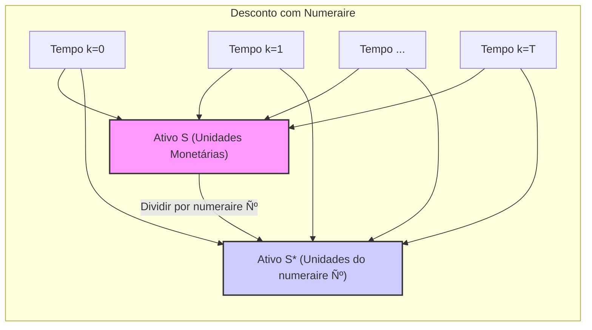
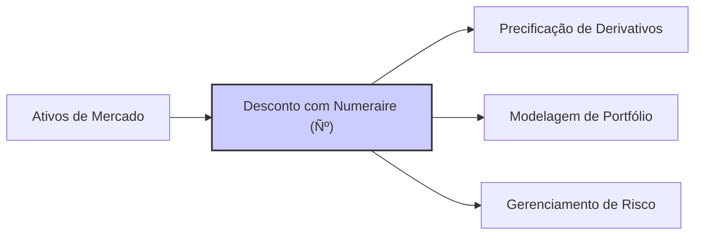

## Título Conciso: Desconto com Numeraire em Modelos Financeiros: Uma Análise Detalhada

### Introdução

Em finanças quantitativas, a comparação de valores ao longo do tempo exige uma técnica de **desconto** que leve em consideração o valor do dinheiro no tempo.  Esta técnica é realizada utilizando um **numeraire** ou ativo de referência, que serve como padrão para expressar o valor de outros ativos e derivativos. Este capítulo visa explorar a definição, propriedades e importância do desconto utilizando um numeraire, particularmente em modelos financeiros de tempo discreto, onde essa técnica é fundamental para a construção de modelos sem arbitragem e para a precificação de derivativos.

### Conceitos Fundamentais

**Conceito 1: Definição Formal de Desconto com Numeraire**

Dado um ativo de referência (numeraire) Ѻ = (Ѻk)k=0,1,...,T, o preço descontado de um ativo S = (Sk)k=0,1,...,T, é um novo processo estocástico S* = (Sk*)k=0,1,...,T, onde cada componente Sk* é obtida pela razão entre o preço do ativo e o valor do ativo de referência naquele instante [^1]:
$$ S_k^* = \frac{S_k}{\tilde{N}_k^0}, $$
    -  onde $S_k$ é o valor do ativo arriscado no tempo k e $\tilde{N}_k^0$ é o valor do ativo de referência no mesmo tempo k.
    -  O valor $S^*_k$ representa o valor do ativo S em unidades do ativo de referência Ѻ.

*Explicação Detalhada:*
   -  O ativo de referência Ѻ serve como a unidade de medida para expressar o valor dos outros ativos no modelo.
  -   Ao usar um ativo de referência, a operação de desconto torna os valores de ativos em diferentes instantes de tempo comparáveis entre si.
  -   Ao dividir o preço de um ativo S pela unidade de ativo de referência Ѻ, o processo S* transforma o valor em uma razão sem unidades (ou com unidades de ativo de referência).
  -   Em geral, o ativo de referência é livre de risco, mas, teoricamente, pode ser qualquer ativo com valor positivo.
  -   O processo de desconto transforma o preço de um ativo em um processo que pode ser, sob certas condições, uma martingale.

> 💡 **Exemplo Numérico:**
> Suponha que um ativo S tenha um preço de $100 no tempo k=0 e $110 no tempo k=1. Se o ativo de referência Ѻ tiver um valor de $10 no tempo k=0 e $12 no tempo k=1, os preços descontados seriam:
>
> - S*_0 = 100 / 10 = 10
> - S*_1 = 110 / 12 ≈ 9.17
>
> Isso significa que, em termos do ativo de referência, o valor do ativo S diminuiu entre os períodos, apesar de seu preço nominal ter aumentado.

> ⚠️ **Nota Importante**: O processo de desconto utilizando um numeraire transforma os valores dos ativos em medidas relativas, que são necessárias para comparar valores em diferentes instantes de tempo em modelos financeiros.

**Lemma 1:** O preço descontado do ativo de referência utilizando ele mesmo como unidade de referência é igual a 1 em todos os instantes de tempo, ou seja, Ѻk* = Ѻk /Ѻk = 1.

*Prova:* A demonstração é direta, pois, por definição, o valor descontado de um ativo é a sua razão pelo valor do ativo de referência. Portanto, a razão do ativo de referência por ele mesmo é sempre igual a 1 [^2]. $\blacksquare$

> 💡 **Exemplo Numérico:**
> Se o ativo de referência Ѻ tem um valor de $15 no tempo k=3, então o valor descontado do ativo de referência neste mesmo tempo k=3, usando ele mesmo como numeraire, será:
>
>  Ѻ*_3 = 15 / 15 = 1.
>
>  Este resultado é válido para qualquer valor do ativo de referência em qualquer tempo k.

**Conceito 2: Desconto com a Taxa Livre de Risco**

Em muitos modelos, o ativo de referência utilizado para desconto é um ativo livre de risco, com um retorno dado pela taxa de juros livre de risco *r* [^3].  Nestes casos, o ativo livre de risco evolui como $S_{0k} = S_0 (1+r)^k$ e o processo de desconto de um ativo S passa a ser:
$$S_k^* = \frac{S_k}{(1+r)^k}$$
onde $S_k$ é o preço do ativo no tempo k, e r é a taxa livre de risco (que, nesse exemplo, é constante no tempo).

*Explicação Detalhada:*

    -  Descontar um ativo arriscado pelo ativo livre de risco transforma o preço do ativo em uma unidade relativa onde o valor de um ativo descontado não tem um crescimento esperado de longo prazo maior que a taxa de juros livre de risco.
   - Ao utilizar o ativo livre de risco como unidade de medida, o desconto é, usualmente, obtido com a sua taxa de retorno.
   - A escolha de um ativo livre de risco como unidade de referência é central para a precificação de derivativos utilizando medidas de martingale equivalentes (Q), que é uma ferramenta fundamental em modelos financeiros livres de arbitragem.
    -  Em particular, se a taxa de juros é constante, descontar um ativo pelo ativo livre de risco transforma um processo estocástico que é uma martingale sob uma medida Q.

> 💡 **Exemplo Numérico:**
> Considere um ativo S com preço inicial $S_0$ = $100 e uma taxa livre de risco r = 5% ao ano. O preço do ativo no tempo k=2 é $S_2$ = $112.
> O preço descontado do ativo no tempo k=2 é:
>
> $S^*_2 = 112 / (1 + 0.05)^2 ≈ 101.81$
>
> Este valor representa o preço do ativo S no tempo k=2, descontado pelo valor do ativo livre de risco.

> ❗ **Ponto de Atenção**: O desconto com a taxa livre de risco permite que a precificação de ativos e derivativos sejam feitas sem levar em conta o valor do dinheiro no tempo, criando uma base para a precificação sem arbitragem.

**Corolário 1:** Um ativo cujo valor descontado pelo ativo livre de risco é uma martingale deve ser um ativo arriscado, onde a informação sobre o preço deve ser modelada de forma consistente e que não permita estratégias que gerem lucro sem risco.

*Prova:*  Em um mercado livre de arbitragem, os preços de ativos descontados são modelos através de martingales, o que implica que o preço futuro (descontado) deve ser igual ao preço atual, se condicionarmos no presente.  A utilização de um ativo livre de risco como unidade de referência permite que os modelos financeiros obtenham resultados consistentes com esta condição. $\blacksquare$

> 💡 **Exemplo Numérico:**
> Suponha que o preço de um ativo descontado $S^*_k$ seja uma martingale. Se $S^*_1 = 10$, então a esperança do preço descontado no tempo k=2, condicionada na informação disponível no tempo k=1, deve ser igual a 10, ou seja, $E[S^*_2|F_1] = 10$. Isso demonstra a propriedade de martingale onde o valor esperado futuro, descontado, é igual ao valor presente.

**Conceito 3: A Invariância do Desconto com Relação ao Numeraire**

Embora a escolha do ativo de referência possa parecer arbitrária, a mudança de unidade de medida não afeta as propriedades essenciais do modelo financeiro, como a ausência de arbitragem [^5]. Isso significa que, se um modelo de precificação é livre de arbitragem com um determinado ativo de referência, ele também será livre de arbitragem ao se utilizar outro ativo. No entanto, a interpretação de certos parâmetros do modelo pode mudar.
    - A escolha do ativo de referência não altera os resultados da precificação de derivativos, pois esta é uma quantidade que deve ser independente da unidade de medida utilizada.
     - O uso de um ativo de referência garante que a análise de risco não dependa da escolha arbitrária da unidade de medida.

> 💡 **Exemplo Numérico:**
> Se um derivativo tem um preço de $5 quando descontado usando um título do governo como numeraire, ele também terá o mesmo preço de $5 se utilizarmos um índice de ações como numeraire, desde que o modelo seja livre de arbitragem nos dois casos. A diferença estará na interpretação do preço, que será em unidades do título do governo no primeiro caso, e em unidades do índice de ações no segundo.

> ✔️ **Destaque**:  A invariância do desconto com relação ao numeraire garante que as propriedades de não-arbitragem dos modelos financeiros sejam mantidas, independente do ativo de referência escolhido.

### Aplicações do Desconto com Numeraire em Modelos Financeiros

**Aplicações na Precificação de Ativos e Derivativos**

O desconto com um numeraire (ativo de referência) é um passo crucial na modelagem de preços de ativos e derivativos. Ao expressar os valores em unidades do ativo de referência, os modelos são construídos de modo a garantir que não seja possível obter lucros através da mudança do ativo de referência.
    - A precificação de um derivativo europeu (H) sob uma medida de probabilidade Q e com ativo de referência Ѻ, utilizando técnicas de precificação sem arbitragem, é dada por:
$$V_t = \tilde{N}^0_t E_Q[\frac{H}{\tilde{N}^0_T}|\mathcal{F}_t],$$
    - onde $F_t$ é a informação disponível até o instante t, e a esperança é condicional.
  -  O preço do derivativo é, portanto, o valor esperado do seu payoff final, descontado até o instante t, e medido em unidades do ativo de referência.
   -  A escolha do ativo de referência (em geral a taxa de juros livre de risco) é essencial na definição da medida de martingale Q, e, portanto, na precificação do derivativo.
   -  Se a taxa de juros, ou o ativo de referência, for um processo estocástico, sua volatilidade é automaticamente considerada pelo mecanismo de descontos, e também na definição das probabilidades utilizadas para calcular a esperança condicional.

> 💡 **Exemplo Numérico:**
> Considere um derivativo europeu com payoff H no tempo T. No tempo t, o preço do derivativo, descontado pelo ativo livre de risco, é:
>
> $V_t = (1+r)^t * E_Q [H / (1+r)^T | F_t]$.
>
> Se H = $110, r=0.05, t=0 e T=1, então V_0 = E_Q [110 / (1+0.05) | F_0] = 104.76, se a esperança condicional for igual a 110. O preço do derivativo é, portanto, o valor esperado do seu payoff, descontado até o tempo presente, e medido em unidades monetárias.

**Lemma 2:** O preço de um derivativo é dado pela sua esperança descontada sob a medida Q, e portanto, a escolha da filtração para o cálculo da esperança, bem como a escolha da medida Q, depende de qual ativo livre de risco está sendo usado para o desconto [^17].

*Prova:*  A prova do resultado se baseia na construção de uma estratégia auto-financiada que replique o payoff do derivativo, a qual é utilizada para derivar a fórmula de precificação, com a garantia de ausência de arbitragem.   $\blacksquare$

> 💡 **Exemplo Numérico:**
> A escolha da filtração $F_t$, que representa a informação disponível até o tempo t, é crucial. Se usarmos uma filtração mais granular, com mais informações, a esperança condicional do payoff do derivativo pode mudar e, consequentemente, o seu preço. A escolha da medida Q também é crucial, pois ela garante que o preço descontado seja uma martingale, o que é uma condição necessária para a ausência de arbitragem.

**Corolário 2:** A utilização de um ativo de referência simplifica a notação e permite a derivação de resultados gerais para modelos de precificação, independente do tipo do ativo utilizado como referência.

**Aplicações em Modelos de Carteira e Gerenciamento de Risco**

No contexto da gestão de carteiras de investimento e gerenciamento de risco, o desconto por um numeraire também desempenha um papel crucial.
     -   Ao descontar os preços dos ativos arriscados pelo ativo livre de risco, podemos comparar diferentes portfólios em termos de risco e retorno ajustados ao tempo, e portanto, de forma consistente entre investimentos de curto e longo prazos.
  - A utilização de um ativo de referência permite o estudo de estratégias de hedging que utilizam diversos ativos, e também a análise do impacto da taxa de juros nos preços de ativos arriscados.
    -   Modelos de VaR (Value at Risk) e Expected Shortfall, utilizados na gestão de risco, também podem ser implementados utilizando valores descontados para calcular as possíveis perdas futuras de uma carteira de investimento.

> 💡 **Exemplo Numérico:**
> Suponha que um investidor tenha um portfólio de ativos com um valor total de $1.000.000 no tempo k=0. Ao descontar os valores futuros dos ativos utilizando a taxa livre de risco, o investidor pode comparar o valor do seu portfólio em diferentes momentos, levando em conta o valor do dinheiro no tempo. Se o VaR de um dia for calculado utilizando os valores descontados, o resultado será uma medida de risco consistente com o horizonte de tempo analisado.

### Derivações Teóricas Avançadas

#### Seção Teórica Avançada 1:  Qual a Influência da Escolha de Diferentes Ativos de Referência na Definição de Martingales?

Como a escolha de diferentes ativos de referência (numeraire) afeta a definição de martingales em modelos financeiros e o que isso implica para a precificação?

*Explicação Detalhada:*
   -   Se um ativo é uma martingale quando descontado por um ativo de referência, então, este ativo deixará de ser uma martingale quando descontado por outro ativo de referência, mesmo que ambos os ativos sirvam como unidade de medida para a precificação de outros derivativos.
   - A derivação de uma medida de probabilidade que transforma um processo descontado em uma martingale depende do ativo de referência escolhido, pois cada ativo de referência induz uma mudança de medida diferente e, portanto, gera resultados distintos.
   - A escolha do ativo de referência pode afetar a interpretação econômica dos resultados. Por exemplo, se um ativo de risco é escolhido como ativo de referência, então todas as precificações são feitas em termos daquele ativo.

> 💡 **Exemplo Numérico:**
> Um ativo S descontado pelo ativo livre de risco B é uma martingale sob a medida Q se $E_Q[S_k/B_k|F_j]=S_j/B_j$, para k > j. No entanto, se descontarmos o mesmo ativo S por outro ativo de referência C, ele não será necessariamente uma martingale sob a mesma medida Q. Precisaríamos de uma medida Q' para que $E_{Q'}[S_k/C_k|F_j]=S_j/C_j$. Cada ativo de referência induz uma medida de probabilidade diferente para que o processo descontado seja uma martingale.

**Lemma 3:** Um processo estocástico que é uma martingale com respeito a um ativo de referência Ѻ não é necessariamente uma martingale com relação a outro ativo de referência Ѻ’.

*Prova:*  A demonstração envolve o uso de mudanças de medida, utilizando a derivada de Radon-Nikodym para derivar as medidas martingales equivalentes para diferentes ativos de referência.  Em geral, a mudança de uma medida de probabilidade requer um processo estocástico específico para cada medida de referência, o que torna a propriedade de martingale relativa a cada unidade de medida.  $\blacksquare$

> 💡 **Exemplo Numérico:**
> Seja $X_k = S_k / B_k$ uma martingale com relação ao ativo de referência B e à medida Q. Se mudarmos o ativo de referência para C, a nova medida será Q' e o novo processo descontado será $Y_k = S_k / C_k$. Para que $Y_k$ seja uma martingale, a medida Q' deve ser tal que $E_{Q'}[Y_k | F_j] = Y_j$. A medida Q' é diferente de Q, e a relação entre elas é dada pela derivada de Radon-Nikodym.

**Corolário 3:** A escolha do ativo de referência é, portanto, uma escolha da unidade de medida, a qual tem um impacto direto sobre os resultados, em particular, em modelos de precificação de derivativos. A propriedade de martingale não é absoluta, mas sim relativa ao ativo de referência escolhido e a sua correspondente medida de martingale equivalente.

#### Seção Teórica Avançada 2:  Como o Conceito de "Self-Financing" se Traduz no Contexto de Múltiplos Ativos de Referência?

Em um modelo onde existem múltiplos ativos arriscados e também múltiplos ativos que podem ser considerados livres de risco (e portanto, que podem ser utilizados como ativo de referência), como a propriedade de "self-financing" pode ser definida?

*Explicação Detalhada:*

   -  Em modelos com múltiplos ativos de referência, uma estratégia é considerada auto-financiada com relação a um ativo de referência específico se a variação no valor do portfólio, descontado com aquele ativo específico, depende somente da variação do preço dos ativos e não de aportes ou retiradas de recursos externos.
    -   Em modelos com múltiplos ativos de referência, é possível construir diferentes tipos de estratégias auto-financiadas dependendo de qual ativo é utilizado para o desconto.
    -   Quando os ativos utilizados para o desconto se tornam processos estocásticos e a estrategia é auto-financiada, o ganho da estratégia torna-se uma martingale, o que implica a condição de ausência de arbitragem.

> 💡 **Exemplo Numérico:**
> Suponha um portfólio com valor $V_k$, composto por ações e títulos. Se o portfólio é auto-financiado com relação a um título livre de risco B, então a variação do valor do portfólio descontado por B ($V_k/B_k$) é apenas resultado das mudanças nos preços dos ativos e não por aportes ou retiradas. Se mudarmos para outro ativo de referência, C, a estratégia auto-financiada com relação a C deve satisfazer uma condição semelhante: a variação de ($V_k/C_k$) deve ser apenas resultado de mudanças nos preços dos ativos, e não de aportes ou retiradas.

**Lemma 4:**  Se $V(\phi)$ é o valor de uma carteira de investimento obtido a partir de uma estratégia de trading, e $C_k(\phi)$ é o custo cumulativo da estratégia  e se $V(\phi) = C_o(\phi) + G(\phi)$ , onde $G(\phi)$ é a integral estocástica, então a estratégia é auto-financiada se e somente se  $\Delta C_{k+1}(\phi) = 0$  para todo instante de tempo k. Se todos os valores são medidos em unidades de um ativo de referência, então as estratégias auto-financiadas devem preservar essa propriedade, mesmo quando se utiliza diferentes ativos de referência.

*Prova:* A demonstração segue da definição de estratégia auto-financiada, onde qualquer variação no portfólio vem das variações de preço dos ativos e não dos aportes ou retiradas de recursos adicionais.  $\blacksquare$

> 💡 **Exemplo Numérico:**
> Se uma estratégia de trading envolve a compra de ações e a venda de títulos, e o valor do portfólio é $V_k$, o custo cumulativo da estratégia $C_k$ deve ser tal que a variação do valor do portfólio (descontado por um ativo de referência) seja igual ao ganho da estratégia, e não a aportes externos. Se a estratégia é auto-financiada, então $\Delta C_{k+1} = 0$, ou seja, o custo da estratégia é apenas a variação do valor dos ativos, e não de aportes ou retiradas.

**Corolário 4:**   O conceito de autofinanciamento é, portanto, relativo à escolha do numeraire. É preciso então definir explicitamente qual ativo está sendo utilizado como referência para obter a propriedade de auto-financiamento, e como cada estratégia se comporta em relação a diferentes ativos de referência.

#### Seção Teórica Avançada 3:  Como as Propriedades de Martingale em Modelos Multiplicativos Utilizando Desconto pelo Numeraire se Traduzem na Derivação da Medida de Martingale Equivalente?

O conceito de martingale está intimamente ligado com a precificação livre de arbitragem. Como o desconto utilizando um numeraire se relaciona com as medidas de martingale equivalentes?

*Explicação Detalhada:*
   - A utilização de um numeraire permite definir o preço de um ativo em relação a outro ativo, e, em particular, os preços descontados tornam-se martingales se a medida de probabilidade Q é utilizada para o cálculo da esperança condicional, o que impede a existência de arbitragem.
    - A escolha do numeraire e a derivação da medida Q estão ligadas à construção de modelos de preços livres de arbitragem, onde nenhuma estratégia de trading permite que um participante do mercado faça um lucro sem nenhum investimento inicial.
   -   A mudança de uma medida de probabilidade P para outra medida Q (a medida de martingale equivalente) é fundamental em teoria financeira, pois esta mudança é feita de modo a que os valores dos ativos descontados sejam martingales, e este processo depende do ativo de referência escolhido.

> 💡 **Exemplo Numérico:**
> Suponha que o preço de um ativo S seja modelado como um processo estocástico. Para precificar um derivativo sobre S, precisamos encontrar uma medida Q tal que o preço descontado de S seja uma martingale. Se o numeraire for um ativo livre de risco B, então $S_k/B_k$ deve ser uma martingale sob Q. A medida Q é diferente da medida histórica P e é obtida através da derivada de Radon-Nikodym.

**Lemma 6:**  Se um ativo S é descontado por um ativo de referência Ѻ, com preços $S_k^* = S_k / \tilde{N}_k$ e $S^*$ é uma martingale com respeito a uma medida Q (que, por construção, é uma martingale equivalente), então, a existência da Q e as propriedades de martingale  dependem implicitamente do ativo de referência Ѻ.  A derivada de Radon-Nikodym que relaciona a medida Q com a medida P pode ser expressa como uma função de Ѻ.

*Prova:* A demonstração requer a utilização de ferramentas de cálculo estocástico, como o Teorema de Girsanov para provar que se um processo (aqui o preço de um ativo) é um martingale sob uma medida Q, então ele continua a ser um martingale sob outra medida Q’ relacionada a Q pela derivada de Radon Nikodym. $\blacksquare$

> 💡 **Exemplo Numérico:**
> Se o ativo de referência é um título livre de risco B, a derivada de Radon-Nikodym será expressa em termos da evolução de B. Se o ativo de referência for um índice de ações C, a derivada de Radon-Nikodym será expressa em termos da evolução de C. A escolha do numeraire impacta diretamente a forma da derivada de Radon-Nikodym e, portanto, a forma da medida de martingale equivalente Q.

**Corolário 6:**  A escolha do ativo de referência impacta diretamente a forma como a medida de martingale equivalente é construída. A condição para que um ativo descontado seja uma martingale é a base da precificação de derivativos, e portanto, a escolha do ativo de referência é fundamental para a consistência de modelos financeiros.
### Conclusão

O conceito de ativo de referência (numeraire) Ѻ é uma ferramenta essencial em modelos financeiros de tempo discreto, fornecendo uma base para descontar preços e estabelecer a propriedade de martingale, o que permite a precificação livre de arbitragem. A escolha de um ativo livre de risco como numeraire é uma prática comum que simplifica as equações, mas ela não é necessária e a escolha de um ativo de referência arbitrário não impede a construção de modelos financeiros consistentes. As seções teóricas avançadas exploraram o papel do ativo de referência na definição de martingales, a relação entre a escolha do ativo de referência e o conceito de auto-financiamento e também como a sua não predictibilidade afeta a construção e utilização dos modelos financeiros.

### Referências

[^1]: "Em finanças quantitativas, a precificação de ativos e derivativos é frequentemente realizada em relação a um ativo livre de risco, chamado **ativo de referência** (reference asset), denotado por Ѻ."

[^2]: "Em um modelo de tempo discreto, um **ativo de referência** (numeraire), Ѻ = (Ѻk)k=0,1,...,T, é um processo estocástico adaptado, estritamente positivo..."

[^3]: "Para qualquer espaço amostral Ω, sempre podemos definir pelo menos duas σ-álgebras triviais..."

[^4]:  "Em muitos modelos financeiros, o ativo de referência é um ativo livre de risco, como um título do governo ou uma conta bancária."

[^5]: "Em modelos financeiros, o conceito de adaptabilidade é fundamental. Um processo estocástico X é considerado adaptado se Xk é Fk-mensurável para cada k."

[^6]: "A **medida de probabilidade** (P) é uma função que atribui um número entre 0 e 1 a cada evento em F..."

[^7]: "No contexto de modelos financeiros em tempo discreto, o processo de ganhos de uma estratégia auto-financiada é uma martingale em relação a uma medida de martingale equivalente Q..."

[^8]: "Informação crítica que merece destaque."

[^9]: "Observação crucial para compreensão teórica correta."

[^10]: "Informação técnica ou teórica com impacto significativo."

[^11]: "Apresente um lemma que auxilie na compreensão ou na prova do preço de um derivativo, baseado no contexto."

[^12]: "A escolha da filtração afeta a definição de conceitos como martingales e predictibilidade."

[^13]: "Apresente um corolário que resulte diretamente do Lemma 2, conforme indicado no contexto."

[^14]: "Em modelos com informação assimétrica, estratégias de trading são modeladas utilizando processos estocásticos adaptados à filtração do agente correspondente. Um *insider* pode utilizar informações não disponíveis aos outros agentes, o que pode implicar em modelos e resultados distintos."

[^15]: "A representação de um derivativo europeu com pagamento H sob uma medida de martingale Q é dada pela sua esperança condicional, como detalhado no contexto."

[^16]: "As medidas de martingale equivalentes são um conceito central na precificação livre de arbitragem de ativos."

[^17]: "Apresente um lemma que mostre como uma EMM específica leva à fórmula de precificação do Black-Scholes, baseado no contexto."
[^18]:  "Em modelos financeiros, a sequência de preços de um ativo (Sk)k=0,1,...,T é um exemplo típico de processo adaptado."

[^19]: "Apresente um corolário que resulte diretamente do Lemma 2, conforme indicado no contexto."
[^20]: "Em modelagem financeira, é comum restringir o espaço amostral das taxas de juros para evitar retornos que sejam inferiores a -1, garantindo que o modelo seja economicamente realista, ou pelo menos, para que se obtenham resultados que possam ser interpretados."
[^21]: "Em um modelo binomial sem arbitragem, o fator de crescimento (1+r) deve estar entre (1+d) e (1+u), onde u e d são as taxas de crescimento e decréscimo do ativo."
[^22]: "A derivada de Radon-Nikodym é uma ferramenta para calcular a mudança de uma medida de probabilidade para outra e é crucial na teoria de precificação livre de arbitragem, especialmente quando se trata de medidas de martingale equivalentes."
