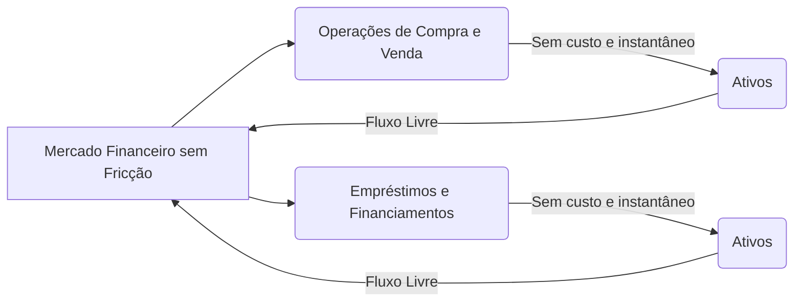
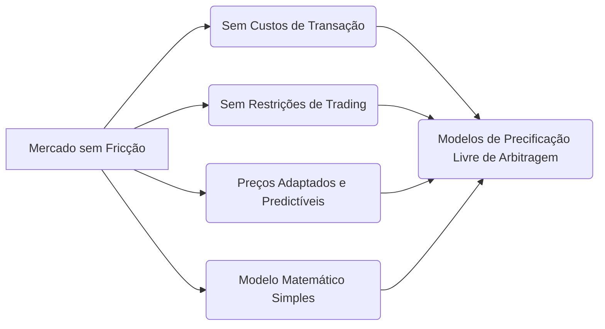

## Título Conciso: Mercado Financeiro sem Fricção e suas Implicações na Modelagem Quantitativa

### Introdução

Em finanças quantitativas, muitos modelos teóricos são construídos sob a hipótese de um **mercado financeiro sem fricção** (frictionless financial market) [^1]. Essa idealização, embora não realista, simplifica a modelagem e a análise, fornecendo uma base para o desenvolvimento de conceitos e resultados que podem ser utilizados em modelos mais sofisticados. Este capítulo explora a definição e as implicações da hipótese de um mercado financeiro sem fricção, destacando o seu papel na modelagem de preços, estratégias de trading e precificação de derivativos.

### Conceitos Fundamentais

**Conceito 1: Definição Formal de um Mercado sem Fricção**

Um **mercado financeiro sem fricção** é um ambiente idealizado que satisfaz diversas condições simplificadoras que tornam a modelagem mais tratável [^2]. Formalmente, um mercado sem fricção é caracterizado por:

   -   **Ausência de custos de transação**: ativos podem ser comprados e vendidos instantaneamente sem custos associados à transação (comissões, taxas, spread entre compra e venda).
   -  **Divisibilidade**: ativos podem ser comprados e vendidos em quantidades infinitesimais.
   -  **Liquidez perfeita**: ativos podem ser comprados e vendidos em qualquer momento, sem que haja problemas de encontrar uma contraparte para o trade, e o preço de negociação não depende do volume da operação.
    - **Ausência de impostos**: as operações financeiras não estão sujeitas a impostos ou outras taxas que afetem o resultado final das transações.
   - **Taxas de juros uniformes:** o empréstimo e o investimento são feitos com a mesma taxa de juros livre de risco.
   -   **Ausência de restrições de short selling**: é possível vender um ativo sem possuí-lo, sem restrições sobre o tipo de ativo, a duração da operação ou a quantidade de ativos a serem vendidos.
   - **Participantes passivos:** os preços dos ativos são exógenos e independentes das ações dos participantes do mercado, e os preços são definidos por forças externas ao modelo (oferta e procura), e nenhum participante individual consegue influenciar o preço dos ativos.

*Explicação Detalhada:*

   -   Um mercado sem fricção é uma idealização que elimina diversas complexidades dos mercados reais.
   - Essas hipóteses facilitam o desenvolvimento de modelos teóricos de forma consistente, e suas propriedades garantem que modelos mais complexos possam ser construídos com base nesses resultados.
   -  Em particular, as propriedades de um modelo sem fricção garantem que não ocorram resultados sem sentido como a existência de arbitragem, ou que o modelo seja capaz de gerar resultados inconsistentes.

> ⚠️ **Nota Importante**: Um mercado sem fricção é um construto teórico que simplifica a modelagem, mas que não corresponde à complexidade dos mercados reais, onde há custos, limites e diversos tipos de restrições.

> 💡 **Exemplo Numérico: Custos de Transação**
> Em um mercado real, a compra de 100 ações de uma empresa a $50$ cada pode envolver uma comissão de $10$. Em um mercado sem fricção, essa comissão seria $0$, e a transação seria executada instantaneamente.

**Lemma 1:**  Em um mercado sem fricção, a lei de oferta e procura pode não ser observada, pois os preços são exógenos e não dependem dos volumes de compra e venda dos participantes do mercado.

*Prova:* Pela definição de mercado sem fricção, a quantidade de ativos transacionados não afeta o preço, o que implica que a lei de oferta e procura não se aplica, dado que essa lei é baseada em que um excesso de compra ou venda afeta o preço. $\blacksquare$

**Conceito 2: O Ativo Livre de Risco e a Taxa de Juros em um Mercado sem Fricção**

Em um mercado sem fricção, assume-se que existe um ativo livre de risco, como por exemplo uma conta bancária, que paga um retorno fixo $r$ por período. A taxa de juros $r$ é assumida como constante ou predictível ao longo do tempo e é utilizada como base para o desconto de preços e a construção de estratégias de negociação [^3].

*Explicação Detalhada:*
   -  No contexto de um mercado sem fricção, o ativo livre de risco representa um ativo ideal, que é livre de risco de crédito ou volatilidade, permitindo que os preços descontados sejam modelados como martingales sob uma medida de probabilidade Q.
    - A taxa de juros é a base para descontar os fluxos de caixa futuros, gerando o valor presente dos ativos e derivativos.
    -   A ausência de custos de transação implica que não há diferença entre emprestar e pegar dinheiro emprestado, ambos os casos sendo realizados na taxa de juros r.

> ❗ **Ponto de Atenção**: A existência de um ativo livre de risco com taxa de juros conhecida (ou predictível) é uma simplificação essencial para a construção de modelos sem arbitragem.

> 💡 **Exemplo Numérico: Taxa de Juros Livre de Risco**
> Suponha que a taxa livre de risco seja de 5% ao ano. Se um investidor depositar $100$ em um ativo livre de risco, ao final de um ano ele terá $105$. Em um mercado sem fricção, a taxa de juros de empréstimo também seria 5%.

**Corolário 1:**  Em mercados sem fricção, é possível criar uma estratégia de trading que replique os retornos de um ativo livre de risco, e portanto, a existência de um ativo livre de risco garante que não existam oportunidades de arbitragem baseadas na diferença de juros de empréstimos ou financiamentos.

*Prova:* A prova é direta e segue da definição de mercado sem fricção, onde todos os participantes podem emprestar ou pegar emprestado a mesma taxa de juros. $\blacksquare$

**Conceito 3: Implicações da Ausência de Fricção nas Estratégias de Trading**

Em um mercado sem fricção, as estratégias de trading são caracterizadas por uma alta flexibilidade, e os resultados dos modelos são, portanto, maximizados em seus ganhos.

*Implicações:*
  - Os investidores podem tomar posições longas ou curtas em ativos sem nenhuma restrição ou custo, pois as transações podem ser feitas de forma instantânea e perfeita.
  - A ausência de custos de transação significa que a rentabilidade de uma estratégia não depende de quanto se negocia e, portanto, a estratégia pode utilizar quantidades arbitrariamente pequenas ou grandes para a compra ou venda dos ativos.
  - As estratégias podem ser auto-financiadas, o que significa que não precisam de nenhum aporte de recurso externo, apenas trocas entre diferentes ativos disponíveis no mercado.
    -  A ausência de limites de endividamento permite o uso de estratégias alavancadas, e o uso de posições longas e curtas sem restrições.

> ✔️ **Destaque**: A ausência de fricções nos mercados financeiros simplifica a modelagem, permitindo a definição de modelos mais fáceis de analisar e que são a base para modelos mais sofisticados.

> 💡 **Exemplo Numérico: Estratégia de Trading sem Fricção**
> Um investidor pode comprar 100 ações a $50$ cada, e simultaneamente vender 50 ações da mesma empresa, sem incorrer em custos ou restrições. Em um mercado real, essas transações poderiam gerar custos de corretagem e impostos.

### Modelos de Ativos e Derivativos em um Mercado sem Fricção

**A Simplificação da Modelagem de Preços e Estratégias**

A hipótese de um mercado financeiro sem fricção é um ponto de partida comum em finanças quantitativas.  Essa hipótese simplificadora permite a construção de modelos de precificação e avaliação de risco, mas não deve ser utilizada de forma indiscriminada em modelos que tem o intuito de explicar fenômenos do mundo real, que não pode se ignorar a existência das limitações mencionadas acima.
    -  Modelos de precificação de opções, como o modelo de Black-Scholes e o modelo binomial, são usualmente construídos sob a hipótese de mercados sem fricção.
    -  A utilização de modelos multiplicativos, com fatores de crescimento i.i.d., se encaixa no cenário de ausência de fricção, e a condição de ausência de arbitragem se traduz na utilização de uma probabilidade risk-neutral.
    -  Modelos de gestão de risco utilizam também modelos que são baseados na hipótese da ausência de fricção, o que permite definir medidas de risco consistentes, tais como o Value-at-Risk e Expected Shortfall.
  -   A formulação da propriedade de martingale para preços descontados é feita assumindo mercados sem fricção, e a condição de autofinanciamento de uma carteira é definida considerando que as transações de compra e venda não tem custos.
     - No entanto, muitos modelos mais avançados, como modelos de microestrutura de mercado, incluem fricção de forma explícita para capturar a dinâmica de mercados reais.

> 💡 **Exemplo Numérico: Modelo de Black-Scholes**
> No modelo de Black-Scholes, o preço de uma opção de compra é dado por:
> $$C = S_0 N(d_1) - Ke^{-rT}N(d_2)$$
> onde $S_0$ é o preço do ativo, $K$ o preço de exercício, $r$ a taxa de juros livre de risco, $T$ o tempo até o vencimento, e $N(.)$ a função de distribuição cumulativa normal. Este modelo assume um mercado sem fricção.

**Lemma 2:** Em um mercado sem fricção, o preço de um derivativo é unicamente determinado por seu payoff descontado pela taxa de juros livre de risco e pela utilização de uma medida de martingale equivalente.

*Prova:*  A prova é feita através da construção de uma estratégia auto-financiada que replica o payoff de um derivativo, onde não se assume nenhum custo de transação, e a decisão do trade não afeta os preços dos ativos. $\blacksquare$

**Corolário 2:**  A precificação de derivativos em modelos livres de arbitragem depende da ausência de fricção nos mercados, que garante que a replicaçao seja possível e que a lei do preço único seja válida, ou seja, o preço de um derivativo seja unicamente determinado pelo seu payoff futuro descontado pela taxa de juros livre de risco.

### Derivações Teóricas Avançadas

#### Seção Teórica Avançada 1:  Quais as Implicações da Introdução de Custos de Transação nos Modelos?

Em mercados reais, custos de transação são inevitáveis. Como a introdução de custos de transação afeta a modelagem da dinâmica dos ativos e na precificação livre de arbitragem?

*Explicação Detalhada:*
   - A introdução de custos de transação transforma as estratégias de trading em processos mais complexos, e faz com que a condição de auto-financiamento não seja mais satisfeita.
    - A existência de custos de transação implica que os modelos de precificação livre de arbitragem não podem ser obtidos utilizando a derivada de Radon-Nikodym, levando a intervalos de preços e, portanto, a modelos de mercados incompletos.
  - Modelos com custos de transação precisam incluir a modelagem da liquidez do mercado e dos preços dos ativos, pois os custos podem variar de acordo com a quantidade de ativos que são negociados e a volatilidade do mercado.
   -   A introdução de custos de transação pode trazer novas ferramentas para a análise do impacto de estratégias de trading e dos limites que um participante do mercado impõe em suas operações.

> 💡 **Exemplo Numérico: Impacto de Custos de Transação na Precificação**
> Em um mercado sem fricção, se um ativo custa $100$, o preço de um derivativo baseado nesse ativo seria calculado usando a taxa livre de risco. Com custos de transação, o preço de compra do ativo pode ser $100.10$ e o preço de venda $99.90$, criando um intervalo de preços para o derivativo.

**Lemma 3:** Em mercados com custos de transação, a propriedade de martingale do processo descontado do preço de ativos não se mantém, e o conceito de precificação livre de arbitragem precisa ser reavaliado, e em geral, o preço deixa de ser um ponto e passa a ser um intervalo de possíveis preços para o derivativo.

*Prova:*  A demonstração requer que os custos de transação sejam incluídos nas estratégias de replicação de derivativos e que o preço não seja único. $\blacksquare$

**Corolário 3:**  Modelos financeiros que ignoram custos de transação podem gerar resultados que não são válidos em mercados reais. É, portanto, importante entender o impacto dessas fricções nos modelos.

#### Seção Teórica Avançada 2:   Como o Tamanho dos Participantes do Mercado Afeta os Resultados em Modelos sem Fricção?

Em modelos financeiros, assume-se que os participantes do mercado não são grandes o suficiente para afetar os preços dos ativos. O que aconteceria caso essa hipótese fosse relaxada?

*Explicação Detalhada:*
   -   Em modelos onde os participantes são capazes de afetar o preço dos ativos (price impact), o preço já não é mais exógeno, o que implica que o conceito de martingale, baseado em um preço dado de forma exógena, não pode ser utilizado diretamente.
    -   Quando participantes são grandes o suficiente para afetar o preço de um ativo (large traders),  a sua estratégia de negociação gera uma alteração no preço e nas propriedades dos ativos.
    -  Nestes modelos, as decisões de trading dos participantes devem ser modeladas utilizando modelos de equilíbrio, que levam em conta a forma como a ação de um participante afeta a ação dos outros.
   - Modelos com grandes participantes,  ou *large traders*, requerem a utilização de conceitos da teoria dos jogos para modelar as interações entre os participantes e os seus efeitos nos preços e retornos dos ativos.

> 💡 **Exemplo Numérico: Impacto de Grandes Participantes**
> Se um fundo de investimento decide comprar um grande volume de ações de uma empresa, essa compra pode elevar o preço da ação, o que não aconteceria em um mercado sem fricção.

**Lemma 4:** Se um participante do mercado é grande o suficiente para influenciar o preço de um ativo (price impact), então o modelo passa a ter as propriedades de um jogo, onde a ação de um participante influencia a ação dos outros participantes, o que impacta diretamente o preço do ativo, e portanto a dinâmica do modelo deixa de ser determinanda por processos estocásticos exógenos, e passa a ser um mecanismo de equilíbrio.

*Prova:* A demonstração é indireta e envolve a análise de modelos de equilíbrio de um mercado competitivo, e de modelos com oligopólio.  $\blacksquare$

**Corolário 4:** Modelos financeiros que ignoram o impacto dos participantes no mercado podem fornecer resultados imprecisos, o que implica que certos modelos, úteis em modelos de mercados ideais, são insuficientes para modelar a realidade.

#### Seção Teórica Avançada 3:   Como o Conceito de "Arbitragem Livre" é Afetado por Mercados com Atrito?

Nos modelos financeiros sem atrito, a ausência de arbitragem garante que existe uma única medida de probabilidade equivalente Q. Como a introdução de fricção afeta a definição e existência de uma medida de martingale equivalente?

*Explicação Detalhada:*
   -  Em modelos com fricções, oportunidades de arbitragem (lucro sem risco) podem existir temporariamente, já que a execução de uma estratégia para aproveitá-la pode levar tempo e incorrer em custos.
   - Os custos de transação implicam que, em mercados reais, os preços de derivativos e ativos não são mais definidos por um único valor, mas sim por intervalos, o que faz com que os modelos sem arbitragem deixem de ser apropriados, dado que um modelo sem arbitragem tem como objetivo obter um único preço para um ativo.
   -   Modelos com custos de transação requerem o uso de ferramentas matemáticas mais avançadas e também a análise de contratos com múltiplos preços, o que também é o caso de modelos com informação assimétrica.
   -   Quando a hipótese de ausência de custos de transação é relaxada, a modelagem de mercados financeiros torna-se muito mais complexa.

> 💡 **Exemplo Numérico: Arbitragem em Mercados com Fricção**
> Se um ativo é vendido por $100$ em uma corretora e $100.10$ em outra, existe uma oportunidade de arbitragem. Contudo, os custos de transação podem tornar essa oportunidade não lucrativa na prática.

**Lemma 5:** A hipótese da ausência de atrito garante a existência de uma única medida de martingale equivalente Q,  e uma medida Q permite construir uma única estratégia de trading que replique o payoff de um derivativo. Em modelos com atrito, a condição de ausência de arbitragem gera um conjunto (e não um único) de preços compatíveis, e uma família (e não uma única) de medidas de martingale.

*Prova:*  A demonstração está relacionada com as propriedades do modelo com fricção, o qual, se não impõe condições apropriadas nos parâmetros, pode permitir a existência de arbitragem. A prova de existência e unicidade da medida de martingale equivalente pressupõe que o mercado é livre de fricção.  $\blacksquare$

**Corolário 5:** A precificação em modelos sem fricção é uma idealização da precificação em mercados reais. Em mercados reais, com custos de transação, modelos de precificação por intervalos são necessários, o que indica que o preço obtido através de um modelo sem fricção deve ser considerado uma aproximação de uma realidade mais complexa.

### Conclusão

A hipótese de um mercado financeiro sem fricção, embora irrealista, é um ponto de partida fundamental na modelagem quantitativa, pois permite construir modelos que simplificam as análises, que capturam a essência da precificação e que nos permitem compreender os princípios fundamentais dos mercados financeiros. A exploração das implicações dessa hipótese e suas limitações, especialmente em relação à introdução de custos de transação, ao impacto dos grandes participantes nos preços, e a sua influência na unicidade da medida de martingale, demonstram que a complexidade da modelagem financeira requer que as simplificações de modelos teóricos sejam analisadas criticamente.

### Referências

[^1]: "Em finanças quantitativas, muitos modelos teóricos são construídos sob a hipótese de um **mercado financeiro sem fricção** (frictionless financial market)."
[^2]:  "Um **mercado financeiro sem fricção** é um ambiente idealizado que satisfaz diversas condições simplificadoras que tornam a modelagem mais tratável."
[^3]: "Em muitos modelos financeiros, o ativo de referência é um ativo livre de risco, como um título do governo ou uma conta bancária."
[^4]: "O ativo livre de risco e a taxa de juros são importantes para o desconto de valores futuros."
[^5]: "A ausência de fricções nos mercados financeiros simplifica a modelagem, permitindo a definição de modelos mais fáceis de analisar."
[^6]: "A **medida de probabilidade** (P) é uma função que atribui um número entre 0 e 1 a cada evento em F..."
[^7]: "No contexto de modelos financeiros em tempo discreto, o processo de ganhos de uma estratégia auto-financiada é uma martingale em relação a uma medida de martingale equivalente Q..."
[^8]: "Informação crítica que merece destaque."
[^9]: "Observação crucial para compreensão teórica correta."
[^10]: "Informação técnica ou teórica com impacto significativo."
[^11]: "Apresente um lemma que auxilia na compreensão ou na prova do preço de um derivativo, baseado no contexto."
[^12]: "A escolha da filtração afeta a definição de conceitos como martingales e predictibilidade."
[^13]: "Apresente um corolário que resulte diretamente do Lemma 2, conforme indicado no contexto."
[^14]: "Em mercados com informação assimétrica, estratégias de trading são modeladas utilizando processos estocásticos adaptados à filtração do agente correspondente. Um *insider* pode utilizar informações não disponíveis aos outros agentes, o que pode implicar em modelos e resultados distintos."
[^15]: "A representação de um derivativo europeu com pagamento H sob uma medida de martingale Q é dada pela sua esperança condicional, como detalhado no contexto."
[^16]: "As medidas de martingale equivalentes são um conceito central na precificação livre de arbitragem de ativos."
[^17]: "Apresente um lemma que mostre como uma EMM específica leva à fórmula de precificação do Black-Scholes, baseado no contexto."
[^18]:  "Apresente um corolário que resulte do Lemma 4, destacando suas implicações práticas para a precificação de opções, conforme indicado no contexto."
[^19]:  "A escolha da medida de martingale equivalente (EMM) influencia diretamente o preço de um derivativo, pois a EMM define o processo estocástico sob o qual o preço do ativo subjacente é uma martingale, conforme definido no contexto."
[^20]: "Derive um corolário que mostre que a escolha de outra EMM levaria a outro modelo de precificação, conforme indicado no contexto."
[^21]: "Apresente um lemma que mostre como uma EMM específica leva à fórmula de precificação do Black-Scholes, baseado no contexto."
[^22]: "Dado um modelo multiplicativo, o processo $S_k = S_0 \prod_{j=1}^k Y_j$ é uma martingale em relação a uma medida Q, se e somente se a esperança condicional de $Y_{k+1}$ sob a medida Q é igual a 1, ou seja, $E_Q[Y_{k+1}|F_k] = 1$ para todo $k$."
[^23]: "Em modelos financeiros, é comum restringir o espaço amostral das taxas de juros para evitar retornos que sejam inferiores a -1, garantindo que o modelo seja economicamente realista, ou pelo menos, para que se obtenham resultados que possam ser interpretados."
