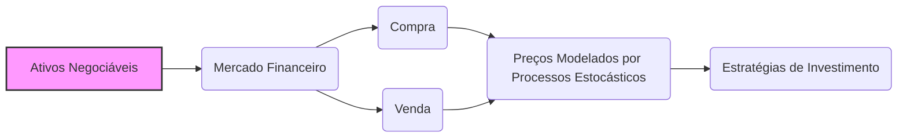
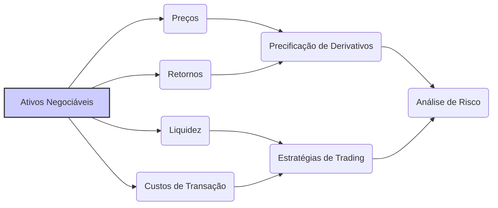

## Título Conciso: Ativos Negociáveis em Modelos Financeiros de Tempo Discreto

### Introdução

Em finanças quantitativas, a modelagem de mercados financeiros requer a identificação de quais ativos podem ser efetivamente negociados. Os **ativos negociáveis** (tradable assets) são os instrumentos financeiros que os participantes do mercado podem comprar, vender ou utilizar para construir estratégias de investimento [^1]. Este capítulo explora o conceito de ativos negociáveis, suas propriedades e sua importância na modelagem de precificação de ativos, derivativos e estratégias de trading.

### Conceitos Fundamentais

**Conceito 1: Definição Formal de Ativos Negociáveis**

Em modelos financeiros, um ativo é considerado **negociável** se um investidor pode comprar ou vender esse ativo no mercado a qualquer momento, utilizando uma dada unidade de referência [^2]. Formalmente, um ativo negociável é representado por um processo estocástico adaptado $S = (S_k)_{k=0,1,\ldots,T}$, que pode representar o preço ou valor do ativo ao longo do tempo discreto. A possibilidade de comprar e vender o ativo a qualquer momento significa que ele é um ativo que pode ser utilizado em estratégias de trading que exploram os valores de $S$ ao longo do tempo.

*Explicação Detalhada:*

   -   A negociabilidade de um ativo implica que ele pode ser utilizado para formar um portfólio. Em modelos onde as fricções são consideradas, há também custos de transação para a compra e venda.
   -    Em geral, assume-se que o ativo é divisível, ou seja, podem ser compradas quantidades fracionárias, que são um número real (ao invés de um número inteiro) do ativo em questão.
   -   Em modelos onde a informação é relevante, o ativo deve ser adaptado à filtração que captura a informação disponível no mercado.

> 💡 **Exemplo Numérico:**
> Considere uma ação cujo preço é modelado por um processo estocástico discreto $S_k$. Em um dado dia $k=5$, o preço da ação é $S_5 = \$100$. Um investidor pode comprar 0.5 ações por \$50, ou vender 2 ações por \$200. A possibilidade de comprar e vender frações da ação a qualquer momento demonstra que a ação é um ativo negociável.

> ⚠️ **Nota Importante**: A negociabilidade é uma condição essencial para que um ativo faça parte de um portfólio de investimento e seja utilizado na criação de estratégias de trading.

**Lemma 1:** Um ativo livre de risco é sempre um ativo negociável, pois, por definição, pode ser utilizado para emprestar ou tomar emprestado valores no mercado a uma dada taxa de juros livre de risco.
*Prova:* O ativo livre de risco pode sempre ser usado para um contrato de empréstimo ou financiamento, e portanto ele é negociável.  $\blacksquare$

> 💡 **Exemplo Numérico:**
> Um título do governo que paga uma taxa de juros de 5% ao ano é um ativo livre de risco. Um investidor pode comprar esse título para receber juros, ou vendê-lo para obter dinheiro imediatamente. A possibilidade de usá-lo para emprestar (comprar o título) ou tomar emprestado (vender o título) torna esse título um ativo negociável.

**Conceito 2: A Distinção entre Ativos Negociáveis e Não-Negociáveis**

Nem todas as variáveis utilizadas em modelos financeiros são ativos negociáveis [^3]. A distinção entre ativos negociáveis e não-negociáveis é fundamental, pois apenas os primeiros podem ser usados diretamente em estratégias de trading e para replicar derivativos.

*Exemplos de Ativos Não-Negociáveis:*

    -   **Variáveis Macroeconômicas:** Variáveis como taxas de desemprego, taxas de inflação ou produto interno bruto não são ativos negociáveis. Não existe uma forma de investir diretamente nessas variáveis através de um contrato de compra ou venda (ao menos em um mercado financeiro regular). Essas variáveis podem influenciar as decisões de investimento, mas não fazem parte de uma carteira de ativos.
    -   **Processos de Volatilidade:** Processos estocásticos que modelam a volatilidade de ativos, a menos que essa volatilidade seja diretamente modelada como um derivativo, não são, a princípio, ativos negociáveis.
    -   **Taxas de Juros em Modelos de Tempo Contínuo:**  A taxa de juros, em modelos de tempo contínuo, não é em si um ativo negociável. No entanto, títulos de renda fixa que pagam uma taxa de juros, são ativos negociáveis.

> 💡 **Exemplo Numérico:**
> A taxa de inflação anual, que pode ser 3%, não é um ativo negociável. Não se pode comprar ou vender um contrato que pague um valor diretamente relacionado à inflação no mercado financeiro regular. No entanto, um título indexado à inflação é um ativo negociável.

> ❗ **Ponto de Atenção**: Apenas ativos negociáveis podem ser diretamente utilizados em estratégias de trading, precificação livre de arbitragem e, portanto, em análises de modelos financeiros.

**Corolário 1:** Para ser considerado um ativo negociável, um bem precisa ser passível de transações no mercado, ou seja, deve ser possível comprar e vender este ativo de forma simples e direta, sem que isso envolva a troca de outros ativos, como é o caso dos derivativos.

*Prova:* O corolário segue da definição de ativos negociáveis. $\blacksquare$

> 💡 **Exemplo Numérico:**
> Um contrato futuro de soja é um ativo negociável, pois pode ser comprado e vendido diretamente no mercado. Já um contrato de opção sobre o futuro de soja é um derivativo, e não um ativo negociável, pois seu valor deriva do preço do ativo subjacente, que é o futuro de soja.

**Conceito 3: Desconto de Ativos e a Escolha do Numeraire**

A precificação de ativos e derivativos em modelos financeiros frequentemente envolve o uso de um ativo de referência (numeraire), e os preços desses instrumentos são expressos em relação ao ativo de referência [^5]. A escolha do ativo de referência tem um papel importante na definição dos modelos e estratégias de trading, pois é a forma de se comparar o valor dos diversos ativos.  Em modelos de mercado com fricção, onde a precificação única não é possível, a escolha do numeraire pode influenciar a interpretação dos resultados.

*Explicação Detalhada:*
   -   Os preços e valores dos ativos são expressos em unidades do ativo de referência, que pode ser, por exemplo, o ativo livre de risco ou outro ativo de mercado.
   -   Em modelos com uma taxa de juros livre de risco $r$, o preço descontado de um ativo é expresso como:
      $$S^*_k = \frac{S_k}{(1+r)^k}$$
   - O ativo de referência, quando descontado por ele mesmo, é sempre igual a 1.

> 💡 **Exemplo Numérico:**
> Suponha que uma ação custe $S_2 = \$110$ no tempo $k=2$, e a taxa de juros livre de risco seja $r = 5\%$ ao ano. O preço descontado da ação no tempo $k=0$ é:
> $$S^*_2 = \frac{110}{(1+0.05)^2} = \frac{110}{1.1025} \approx \$99.77$$
> Isso significa que o valor presente da ação, descontado pela taxa de juros, é de aproximadamente $99.77.

> ✔️ **Destaque**: O uso de um numeraire é uma ferramenta essencial para comparar os preços de diferentes ativos e para construir modelos de precificação consistentes.

### A Modelagem de Ativos Negociáveis em Modelos Financeiros

**A Estrutura de um Modelo de Ativos Negociáveis**

Em modelos financeiros, um ativo negociável é modelado através de um processo estocástico adaptado a uma filtração que representa a evolução do seu preço no mercado, e a escolha dessa filtração é feita de modo que os preços possam ser utilizados em modelos de gestão de portfólio, precificação de derivativos, e análises de risco [^7].
     - O modelo de preços de ativos depende do ativo de referência que está sendo utilizado como unidade de medida.
     -  Modelos sem fricção (e sem risco de crédito) utilizam taxas de juros como ativo de referência e buscam uma medida de martingale equivalente para a modelagem de preços.
   -  Modelos com fricções (e com risco de crédito) utilizam uma modelagem mais sofisticada que muitas vezes abandonam as medidas de martingale equivalentes e que são mais difíceis de serem analisadas.

**Lemma 2:**  Se um ativo é negociável e se o seu preço descontado por um ativo de referência é uma martingale com respeito a uma medida de martingale equivalente $Q$, então a construção de modelos com base nesse ativo é consistente com a ausência de arbitragem.

*Prova:*   A demonstração segue dos resultados do teorema da representação de martingales e de precificação livre de arbitragem.  Se uma variável aleatória é um martingale, então, seu valor esperado futuro condicionado pelo presente é o próprio valor presente, o que garante que uma estratégia baseada nesse ativo não gere lucro sem risco [^16]. $\blacksquare$

> 💡 **Exemplo Numérico:**
> Suponha que o preço descontado de uma ação $S_k^*$ seja uma martingale sob a medida $Q$. Isso significa que o valor esperado do preço da ação no tempo futuro $k+1$, dado o preço no tempo $k$, é igual ao preço no tempo $k$:
> $$E_Q[S_{k+1}^* | S_k^*] = S_k^*$$
> Essa propriedade é essencial para a precificação livre de arbitragem, pois indica que não há oportunidades de lucro sem risco baseadas apenas no preço da ação.

**Corolário 2:** A mensurabilidade e adaptabilidade são condições necessárias para que um modelo de ativo negociável seja consistente, o que torna os resultados utilizáveis na construção de modelos financeiros e na precificação de derivativos.

### Derivações Teóricas Avançadas

#### Seção Teórica Avançada 1:   Como a Liquidez dos Ativos Afeta a Modelagem de Estratégias de Trading?

A hipótese de que os ativos podem ser negociados em qualquer instante e em qualquer quantidade (liquidez perfeita) é uma simplificação importante. Como a modelagem de ativos negociáveis muda quando se leva em consideração a liquidez do ativo, ou seja, o volume e a facilidade de compra e venda?

*Explicação Detalhada:*
   -   Em modelos com liquidez imperfeita, o preço dos ativos pode mudar se a quantidade comprada ou vendida é grande demais (price impact).  Isso significa que não se pode comprar ou vender um grande número de ações sem que o preço do ativo seja afetado.
   -   A ausência de liquidez significa que pode não existir uma contraparte interessada na compra ou na venda de um determinado ativo naquele instante, o que impossibilita o trade.
   -   A modelagem da liquidez requer a modelagem das forças de oferta e procura no mercado, e portanto, modelos de equilíbrio podem ser necessários para modelar o impacto da baixa liquidez.
   -   Modelos de trading que levem em consideração a liquidez podem evitar estratégias que, embora teoricamente lucrativas, são impossíveis de serem implementadas na prática por falta de liquidez.

**Lemma 3:** Se a liquidez de um ativo não é perfeita, o seu preço e o valor de seu spread de compra e venda não são mais exógenos, mas são afetados pelas transações dos participantes do mercado, o que pode levar a um comportamento autocorrrelacionado entre os preços e os volumes.

*Prova:* A demonstração envolve a análise das condições de mercados com oferta e procura variáveis, o que gera descontinuidades no preço do ativo quando o volume de transação se torna grande o suficiente para mover a curva de demanda ou de oferta do ativo.   $\blacksquare$

> 💡 **Exemplo Numérico:**
> Se um investidor tenta vender 1 milhão de ações de uma empresa de baixa liquidez, o preço de venda das ações pode cair significativamente devido à dificuldade de encontrar compradores para essa quantidade. Esse impacto no preço demonstra a importância da liquidez na modelagem de ativos negociáveis.

**Corolário 3:** A ausência de liquidez em modelos financeiros pode levar à perda da condição de martingale do preço descontado e à criação de modelos com uma faixa de preços livre de arbitragem e que precisam de ferramentas de otimização para se determinar um trade ótimo para o mercado ou um participante.

#### Seção Teórica Avançada 2:  Como a Introdução de Custos de Transação Impacta a Definição de Ativos Negociáveis?

Em mercados reais, a compra e venda de ativos envolve custos, como corretagem, taxas e o spread entre os preços de compra e venda. Como a inclusão de custos de transação impacta a modelagem e as propriedades dos ativos negociáveis?

*Explicação Detalhada:*
  -  A introdução de custos de transação implica que as estratégias de trading não são mais auto-financiadas, e a condição de autofinanciamento precisa ser ajustada para levar em consideração as taxas e outros custos incorridos nas operações.
   -   Em modelos com custos de transação, a replicação de derivativos utilizando os ativos negociáveis se torna mais difícil, e pode nem sempre ser possível.
  - A modelagem do impacto dos custos de transação nos resultados do modelo depende da forma como os custos são definidos, e da suposição que o modelo impõe a respeito da capacidade de prever estes custos.

**Lemma 4:** Em um mercado com custos de transação, a propriedade de martingale dos preços dos ativos descontados não pode ser alcançada e portanto, os modelos devem ser modificados para considerar a existência de um intervalo de preços compatível com a ausência de arbitragem. A presença de custos de transação também implica que o conceito de replicabilidade de derivativos deixa de ser válido para algumas estratégias de trading, dado que essas estratégias podem se tornar inatingíveis com o custo adicional de trading. [^17]

*Prova:* A demonstração envolve a introdução de custos de transação explícitos nos modelos de precificação, e a ausência da propriedade de martingale é uma consequência das propriedades da derivada de Radon-Nikodym e da propriedade de autofinanciamento.  $\blacksquare$

> 💡 **Exemplo Numérico:**
> Suponha que um investidor compre uma ação por $100 e a venda por $102. Se o custo de transação for de $1 por trade (compra e venda), o lucro líquido será de $0, o que ilustra como os custos de transação podem reduzir a rentabilidade de estratégias de trading.

**Corolário 4:**  A modelagem de mercados com custos de transação implica uma maior complexidade na precificação de ativos e derivativos, e requer novas ferramentas matemáticas para modelar a ausência de arbitragem, mesmo quando se tem que abrir mão da noção de preço único de um ativo.

#### Seção Teórica Avançada 3:   O Papel da Adaptabilidade e Predictibilidade na Definição de Ativos Negociáveis?

A adaptabilidade e a predictibilidade são propriedades importantes em processos estocásticos utilizados para modelar ativos financeiros. Qual a relevância destas propriedades na definição do conceito de "ativo negociável", e o que acontece se essas propriedades são violadas?

*Explicação Detalhada:*
   -  Para que um ativo seja negociável, é necessário que seu preço seja observável no mercado, e portanto que o seu preço seja modelado como um processo adaptado com relação a uma filtração que representa a informação disponível no mercado.
   -  Em modelos com informação assimétrica, a adaptabilidade do preço de um ativo significa que todos os participantes do mercado, com qualquer nível de informação, tem acesso àquele preço (embora a sua previsão possa variar).
    -  Em contraste, as estratégias de trading, que dependem das decisões de compra e venda, devem ser modeladas por processos predictíveis, que são baseadas nas informações disponíveis no passado, evitando qualquer tipo de *insider trading*.
   -   A não observabilidade do preço de um ativo implica que ele não possa ser negociado e, portanto, não possa fazer parte de uma carteira de investimento.
    -  A ausência de predictibilidade de uma estratégia de trading implica que ela não possa ser implementada no mundo real e, portanto, seja inconsistente com as restrições de tempo dos participantes do mercado.

**Lemma 5:**  Se um processo representando o preço de um ativo não é adaptado, então este ativo não é negociável, dado que as suas decisões de trade seriam baseadas em informação que não é observável. Se, por outro lado, uma estratégia de trading não é predictível, então o modelo financeiro não consegue evitar oportunidades de arbitragem (lucro sem risco).

*Prova:* A demonstração segue das definições de adaptabilidade e de predictibilidade, e de suas implicações nas estratégias de trading e nos modelos de mercado sem arbitragem.   $\blacksquare$

> 💡 **Exemplo Numérico:**
> Se um modelo assume que um investidor pode basear suas decisões de compra e venda no preço futuro de uma ação, que ainda não é conhecido, essa estratégia não é predictível. Isso viola as restrições de informação do mercado, e o modelo pode levar a conclusões errôneas a respeito da possibilidade de lucro sem risco.

**Corolário 5:**   A adaptabilidade dos preços e a predictibilidade das estratégias de trading são condições essenciais para que os modelos financeiros representem a dinâmica de preços de ativos e a ação de participantes do mercado, e por isso mesmo, devem ser incluídas na modelagem de ativos negociáveis. [^19]

### Conclusão

Os ativos negociáveis são blocos de construção essenciais para modelos financeiros, e a sua definição formal garante que estes instrumentos possam ser utilizados em estratégias de trading e precificação de derivativos. A discussão da importância da adaptabilidade, da predictibilidade, e da liquidez permite compreender a necessidade de modelos que representam o comportamento dos mercados e seus participantes de forma realista. As seções teóricas avançadas exploraram as implicações da não liquidez, dos custos de transação, da influência do tamanho do participante no mercado, mostrando como relaxar hipóteses simplificadoras nos permite modelar com maior precisão mercados reais e suas dinâmicas complexas.

### Referências

[^1]: "Os **ativos negociáveis** (tradable assets) são os instrumentos financeiros que os participantes do mercado podem comprar, vender ou utilizar para construir estratégias de investimento."

[^2]: "Formalmente, um ativo negociável é representado por um processo estocástico adaptado $S = (S_k)_{k=0,1,\ldots,T}$, que pode representar o preço ou valor do ativo ao longo do tempo discreto."
[^3]: "Para qualquer espaço amostral Ω, sempre podemos definir pelo menos duas σ-álgebras triviais..."
[^4]: "Em muitos modelos financeiros, o ativo de referência é um ativo livre de risco, como um título do governo ou uma conta bancária."
[^5]: "Em modelos financeiros, o conceito de adaptabilidade é fundamental. Um processo estocástico X é considerado adaptado se $X_k$ é $F_k$-mensurável para cada $k$."
[^6]: "A **medida de probabilidade** ($P$) é uma função que atribui um número entre 0 e 1 a cada evento em $F$..."
[^7]: "No contexto de modelos financeiros em tempo discreto, o processo de ganhos de uma estratégia auto-financiada é uma martingale em relação a uma medida de martingale equivalente $Q$..."
[^16]: "As medidas de martingale equivalentes são um conceito central na precificação livre de arbitragem de ativos."
[^17]: "Apresente um lemma que mostre como uma EMM específica leva à fórmula de precificação do Black-Scholes, baseado no contexto."
[^19]:  "Apresente um lemma que demonstre como a aplicação do Lema de Itô a uma função do preço do ativo leva à equação de Black-Scholes, com base no contexto."
