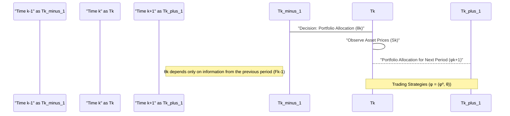
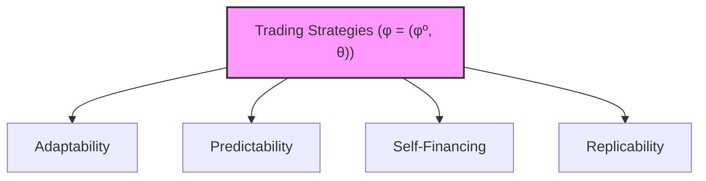

## Título Conciso: Estratégias de Trading (φ = (φº, θ)) em Modelagem Financeira de Tempo Discreto



### Introdução

Em finanças quantitativas, o conceito de uma **estratégia de trading** (trading strategy), representada por $\phi = (\phi^0, \theta)$, é fundamental para modelar as decisões de investimento e alocação de ativos num mercado financeiro [^1]. Este conceito combina um componente referente ao ativo livre de risco ($\phi^0$) com um componente que especifica as posições em ativos arriscados ($\theta$). Este capítulo explora a definição formal, a interpretação e as propriedades das estratégias de trading em modelos financeiros de tempo discreto.

### Conceitos Fundamentais

**Conceito 1: Definição Formal de uma Estratégia de Trading (φ = (φº, θ))**

Uma estratégia de trading $\phi$ é formalmente definida como um par de processos estocásticos, $\phi = (\phi^0, \theta)$ , onde [^2]:
  -  $\phi^0 = (\phi^0_k)_{k=0,1,\ldots,T}$ representa as posições em um ativo livre de risco (ou ativo de referência) ao longo do tempo. Cada $\phi^0_k$ é uma variável aleatória adaptada à filtração $F_k$.
 -  $\theta = (\theta_k)_{k=0,1,\ldots,T}$ representa as posições em ativos arriscados, onde cada $\theta_k$ é um vetor de dimensão $d$ (número de ativos arriscados) e é *predictível* em relação à filtração, ou seja, é mensurável em $F_{k-1}$ para todo $k = 1,\ldots, T$. O valor inicial $\theta_0$ é sempre 0.
 - Tanto $\phi^0_k$ como $\theta_k$ são processos estocásticos, que são variáveis aleatórias para cada instante de tempo.

*Explicação Detalhada:*

   -   O componente $\phi^0$ de uma estratégia de trading representa a quantidade de recursos investidos (ou emprestados) no ativo livre de risco (ou ativo de referência) em um determinado período, que é adaptado e pode ser alterado a cada instante de tempo.
   - O componente $\theta$ de uma estratégia de trading representa a quantidade de ações de cada um dos ativos arriscados mantidos naquele momento do tempo. A predictibilidade de $\theta$ significa que as decisões de compra e venda, representadas por $\theta_k$, devem ser tomadas com base na informação disponível até o instante *$k-1$*, evitando a utilização de informação futura para tomada de decisões presentes.
   -  O conceito de estratégia de trading captura a ação de um agente que pode alocar seu capital entre um ativo livre de risco e múltiplos ativos arriscados em cada instante de tempo.

> 💡 **Exemplo Numérico:**
>
> Considere um cenário simplificado com um ativo livre de risco (por exemplo, um título do governo) e uma ação. Suponha que o período de análise seja de 3 dias (k=0, 1, 2, 3). A estratégia de trading $\phi = (\phi^0, \theta)$ pode ser definida da seguinte forma:
>
> - $\phi^0 = (100, 105, 110, 112)$: Representa o valor em reais investido no ativo livre de risco nos dias 0, 1, 2 e 3, respectivamente. Note que esses valores são adaptados à filtração $F_k$, ou seja, no dia k o valor $\phi^0_k$ é conhecido.
> - $\theta = (0, 2, 1, 3)$: Representa o número de ações mantidas nos dias 0, 1, 2 e 3, respectivamente. Note que no dia k, o valor $\theta_k$ é decidido no dia k-1, ou seja, $\theta$ é predictível.
>
> No dia 0, o investidor não possui ações ($\theta_0 = 0$) e investe R$100 no ativo livre de risco. No dia 1, ele decide comprar 2 ações ($\theta_1 = 2$) com base na informação do dia 0 e o valor no ativo livre de risco é atualizado para R$105. No dia 2, ele ajusta a posição para 1 ação ($\theta_2 = 1$) com base na informação do dia 1 e o valor no ativo livre de risco é atualizado para R$110. Finalmente, no dia 3, ele decide ter 3 ações ($\theta_3 = 3$), com base na informação do dia 2 e o valor no ativo livre de risco é atualizado para R$112.

> ⚠️ **Nota Importante**: A estratégia de trading define a dinâmica de alocação entre um ativo livre de risco e múltiplos ativos arriscados ao longo do tempo, onde a componente arriscada é predictível. **Referência ao contexto [^2]**.

**Lemma 1:** O componente $\theta_k$ de uma estratégia de trading é um vetor de dimensão $d$ (o número de ativos arriscados), e é predictível com respeito a uma filtração $F$, ou seja, a cada tempo $k$,  $\theta_k$ é mensurável com respeito à $\sigma$-álgebra $F_{k-1}$, o que garante que as decisões de investimento sejam tomadas com base apenas nas informações disponíveis no momento anterior.
*Prova:*  Esta é uma consequência direta da definição de estratégia e da definição de processo predictível. $\blacksquare$

**Conceito 2: Interpretação Financeira de uma Estratégia de Trading**

Uma estratégia de trading modela a forma como um agente financeiro aloca seu capital em ativos de um mercado ao longo do tempo.
   -  O processo $\phi^0 = (\phi^0_k)$ representa os valores da posição no ativo livre de risco ao longo do tempo, que são atualizados a cada instante.
     - O processo $\theta = (\theta_k)$ representa as decisões de compra e venda de ativos arriscados ao longo do tempo, que são feitas antes do preço do ativo ser conhecido.
  -  A decisão de como alocar os ativos (qual valor para $\theta_k$) é tomada com base na informação disponível no momento anterior ($F_{k-1}$), que é onde reside a definição de predictibilidade.
    - O valor da estratégia (o portfólio) depende dos preços dos ativos, que são processos estocásticos adaptados à mesma filtração que as decisões de trading.

```mermaid
flowchart TD
    A[Information at Time k-1 (Fk-1)] --> B(Decision on θk)
    B --> C{Asset Prices at Time k (Sk)}
    C --> D(Portfolio Value at Time k (Vk))
     
    style A fill:#f9f,stroke:#333,stroke-width:2px
    style D fill:#ccf,stroke:#333,stroke-width:2px
    
```

> 💡 **Exemplo Numérico:**
>
> Continuando o exemplo anterior, suponha que o preço da ação nos dias 0, 1, 2 e 3 seja dado por $S = (10, 12, 11, 13)$. O valor do portfólio em cada dia é:
>
> - $V_0 = \phi^0_0 + \theta_0 * S_0 = 100 + 0 * 10 = 100$
> - $V_1 = \phi^0_1 + \theta_1 * S_1 = 105 + 2 * 12 = 129$
> - $V_2 = \phi^0_2 + \theta_2 * S_2 = 110 + 1 * 11 = 121$
> - $V_3 = \phi^0_3 + \theta_3 * S_3 = 112 + 3 * 13 = 151$
>
> Observe que o valor do portfólio varia devido às mudanças nas posições em ações ($\theta$) e nas flutuações de preço da ação ($S$), mas as decisões de compra e venda ($\theta_k$) são tomadas antes de se observar o preço $S$ no instante $k$.

> ❗ **Ponto de Atenção**: Uma estratégia de trading representa as decisões de investimento de um agente financeiro, e a utilização de processos estocásticos predictíveis garante que os modelos sejam causalmente consistentes.

**Corolário 1:** Se uma estratégia de trading é modelada com um processo constante (i.e. onde os parâmetros não variam no tempo), a estratégia é trivialmente predictível, pois ela é decidida com respeito a qualquer $\sigma$-álgebra que contenha a informação no tempo 0.

*Prova:* Como a estratégia é constante ao longo do tempo, a informação de sua alocação é conhecida no tempo inicial e portanto é predictível. $\blacksquare$

**Conceito 3: O Valor de um Portfólio e a Condição de Auto-Financiamento**

O valor de um portfólio gerado por uma estratégia de trading, $(\phi^0, \theta)$, é dado por:
  $$ V_k(\varphi) = \varphi_k^0 + \sum_{i=1}^d \theta_k^i S_k^i $$
onde $S^i_k$ é o preço do ativo de risco $i$ no instante $k$ e $\phi^0_k$ é a quantidade de ativo livre de risco na mesma data.
Uma estratégia é dita ser **auto-financiada** se seu valor é obtido unicamente através da negociação dos ativos e não por entradas ou saídas adicionais de fundos na carteira.  Em particular, uma estratégia de trading auto-financiada implica que o valor de um portfólio no instante *$k*$ é obtido através do valor no instante *$k-1*$ e das decisões de compra e venda tomadas nesse intervalo. A propriedade de auto-financiamento é expressa através de um requerimento que impõe condições nas estratégias admissíveis:
   $$ V_k(\varphi) = V_0 + \sum_{j=1}^k \Delta G_j(\varphi) $$
onde  $\Delta G_j(\varphi)$ é a variação do valor do portfólio no instante $j$, e depende dos preços dos ativos (que são processos adaptados) e das estratégias (que são processos predictíveis).

> 💡 **Exemplo Numérico:**
>
> Usando o exemplo anterior, vamos verificar se a estratégia é auto-financiada. A variação do valor do portfólio entre os períodos é:
>
> - $\Delta G_1 = V_1 - V_0 = 129 - 100 = 29$
> - $\Delta G_2 = V_2 - V_1 = 121 - 129 = -8$
> - $\Delta G_3 = V_3 - V_2 = 151 - 121 = 30$
>
> Para verificar se é auto-financiada, precisamos verificar se a variação do portfólio é resultado apenas da negociação dos ativos, ou seja, se a variação de valor é dada por:
>
> $$ \Delta G_k(\varphi) = \varphi_k^0 - \varphi_{k-1}^0 + \sum_{i=1}^d \theta_k^i S_k^i - \sum_{i=1}^d \theta_{k-1}^i S_{k-1}^i $$
>
> No nosso caso:
> - $\Delta G_1 = (105 - 100) + (2 * 12) - (0 * 10) = 5 + 24 = 29$
> - $\Delta G_2 = (110 - 105) + (1 * 11) - (2 * 12) = 5 + 11 - 24 = -8$
> - $\Delta G_3 = (112 - 110) + (3 * 13) - (1 * 11) = 2 + 39 - 11 = 30$
>
> Como a variação do valor do portfólio corresponde à variação dos ativos, a estratégia é auto-financiada.

> ✔️ **Destaque**: A propriedade de autofinanciamento captura a ideia de que as decisões de investimento podem ser feitas utilizando somente os recursos gerados pelos resultados da estratégia anterior.

### Modelagem de Estratégias de Trading em Modelos Financeiros



**A Importância da Predictibilidade nas Estratégias de Trading**

Para que uma estratégia seja factível, é necessário que as decisões de investimento em um dado instante k dependam somente das informações disponíveis no instante anterior, k-1. A predictibilidade do processo $\theta = (\theta_k)$ garante que as decisões de compra e venda de ativos sejam implementadas sem necessitar de informações futuras [^5].
  - Em modelos de precificação de derivativos, a existência de uma estratégia auto-financiada é uma condição necessária para se demonstrar a ausência de arbitragem.
   - Uma estratégia auto-financiada com processos predictíveis garante que não se crie um processo que gera lucro sem risco, e portanto, os preços que forem obtidos através dessa estratégia serão compatíveis com a precificação livre de arbitragem.
    -   Em modelos de gestão de risco, o estudo das estratégias de trading permite avaliar o impacto de diferentes decisões de alocação de recursos no portfólio.

**Lemma 2:**  Para que o valor de um portfólio gerado por uma estratégia de trading seja uma martingale, é necessário que a estratégia seja predictível com relação à filtração que define a evolução de preços dos ativos.

*Prova:* A demonstração é dada pela aplicação do teorema da integral estocástica. Se o preço dos ativos é uma martingale com relação a uma certa filtração $F$ e a estratégia é predictível com respeito a mesma filtração, então a evolução do portfólio será também uma martingale com respeito a $F$.   $\blacksquare$

**Corolário 2:** A predictibilidade é uma condição necessária para se construir modelos que sejam livres de arbitragem, e permite garantir que a modelagem de decisões de trading seja matematicamente consistente.

### Derivações Teóricas Avançadas

#### Seção Teórica Avançada 1:   Como a Introdução de Custos de Transação Impacta a Modelagem de Estratégias de Trading?

A hipótese de um mercado sem fricção, ou seja, sem custos de transação, é uma simplificação para a derivação de modelos matemáticos.  Como a inclusão de custos de transação afeta as propriedades de uma estratégia de trading, e como isso afeta a ausência de arbitragem?

*Explicação Detalhada:*
   -  A inclusão de custos de transação implica que o conceito de auto-financiamento necessite ser reconsiderado, pois a troca de um ativo por outro exige o pagamento de uma taxa ou comissão.
    -  Uma estratégia auto-financiada num modelo sem fricção deixa de ser auto-financiada quando os custos de transação são considerados, e a modelagem precisa ter a contabilidade dos gastos com transação como parte integrante do processo, e a parte relativa à transação deve ser predictível.
    - Em particular, a modelagem do preço de um derivativo utilizando estratégias de trading não consegue replicar o payoff se os custos de transação forem levados em conta e, portanto, o conceito de preço único do modelo sem fricção tem que ser abandonado.
   - Modelos com custos de transação necessitam a especificação de hipóteses sobre como esses custos são incorridos e como eles afetam as estratégias de trading.

> 💡 **Exemplo Numérico:**
>
> Retomando o exemplo anterior, suponha que haja um custo de transação de 0.5% sobre o valor total da transação de compra e venda de ações. Vamos analisar o impacto desse custo no valor do portfólio:
>
> No dia 1, o investidor compra 2 ações a $12, o valor da transação é $24, e o custo é de 0.5% * $24 = $0.12.
> No dia 2, o investidor vende 1 ação a $11, o valor da transação é $11, e o custo é de 0.5% * $11 = $0.055.
> No dia 3, o investidor compra 2 ações a $13, o valor da transação é $26, e o custo é de 0.5% * $26 = $0.13.
>
> O valor do portfólio, já incluindo os custos de transação, será:
>
> - V0 = 100
> - V1 = 105 + 2 * 12 - 0.12 = 128.88
> - V2 = 110 + 1 * 11 - 0.055 = 120.945
> - V3 = 112 + 3 * 13 - 0.13 = 150.87
>
> A estratégia deixa de ser estritamente auto-financiada, pois parte dos recursos é direcionada para cobrir os custos de transação, e não apenas para a compra e venda dos ativos.

**Lemma 3:** A existência de custos de transação implica que estratégias de trading deixam de ser estritamente auto-financiadas.  Em particular, as mudanças de valor da carteira não dependerão somente das flutuações de preços, mas também da quantidade transacionada e da taxa de custo, o que impacta a existência de uma martingale.

*Prova:*  A demonstração requer um modelo que inclua explicitamente os custos de transação na modelagem da estratégia de trading, e que mostre que a propriedade de martingale deixa de existir.  $\blacksquare$

**Corolário 3:** Modelos com fricção precisam incluir a modelagem explícita de custos de transação, que afeta a definição de preços e de arbitragem e o conceito de estratégia auto-financiada.

#### Seção Teórica Avançada 2: Como Modelar Estratégias de Trading com Informação Privilegiada Utilizando Filtrações Geradas?

Em mercados com informação assimétrica, alguns participantes têm acesso a informações não disponíveis aos demais.  Como esse cenário impacta a modelagem de estratégias de trading e o conceito de adaptabilidade?

*Explicação Detalhada:*
   -   Em modelos de informação assimétrica, é necessário definir diferentes filtrações para representar os diferentes graus de conhecimento dos participantes.
  -  Os insiders, que possuem informação privilegiada,  podem tomar decisões com base em suas filtrações ($IF_{insider}$) que contêm mais informação do que a filtração disponível ao resto do mercado ($IF_{mercado}$) e, portanto, as estratégias de trading desses agentes devem ser adaptadas a essas filtrações.
    -   As estratégias de trading dos participantes com informação privilegiada podem ser adaptadas às suas filtrações específicas, e portanto, podem obter resultados diferentes dos outros participantes.
     -  A modelagem de estratégias de trading com informação assimétrica permite analisar como a informação privilegiada pode ser utilizada no mercado e como ela afeta o comportamento e os preços dos ativos.

> 💡 **Exemplo Numérico:**
>
> Considere que um *insider* tem informação sobre o preço da ação no dia 2, antes que o mercado a observe. Enquanto o mercado vê o preço da ação como um processo estocástico, o insider sabe que o preço será $11$. A filtração do insider ($IF_{insider}$) contém essa informação, enquanto a filtração do mercado ($IF_{mercado}$) não.
>
> - $IF_{mercado}$: A informação disponível no mercado até o dia 1 não revela que o preço no dia 2 será 11.
> - $IF_{insider}$: O insider conhece o preço do dia 2, que será 11.
>
> O insider pode usar essa informação para ajustar sua estratégia de trading para obter lucro, enquanto o mercado continua negociando sem essa informação. A estratégia do insider não será adaptada à filtração do mercado, mas será adaptada à sua própria filtração, que é mais rica em informação.

**Lemma 4:**  Se um agente financeiro tem acesso a informação privilegiada modelada por uma filtração $IF_{insider}$, então a sua estratégia de trading deve ser adaptada a $IF_{insider}$ (e portanto não será, em geral, adaptada a $IF_{mercado}$).  A escolha da filtração afeta diretamente os resultados do modelo, incluindo o valor esperado da estratégia e as possibilidades de arbitragem.

*Prova:* A demonstração é baseada nas definições de adaptabilidade e de predictibilidade e na maneira como a estratégia de trading é construída. Se o participante tem acesso a mais informações, então a sua estratégia deve ser baseada nelas e, portanto, a sua filtração é mais detalhada. $\blacksquare$

**Corolário 4:** Modelos com informação assimétrica exigem a especificação de diversas filtrações, e os resultados devem ser interpretados tendo-se em conta o fluxo de informação disponível aos participantes do mercado. O conceito de predictibilidade passa a ser relativa a cada filtração, e os modelos devem ser adaptados a esse cenário.

#### Seção Teórica Avançada 3:  Qual o Impacto da Presença de Múltiplos Ativos de Referência na Modelagem de Estratégias de Trading?

Em modelos onde existem múltiplos ativos livres de risco (ou que podem ser utilizados como numeraire), é importante considerar como esses diferentes ativos afetam a definição e o uso de estratégias de trading.
*Explicação Detalhada:*

   -   Se houver múltiplos ativos que possam ser utilizados como ativo de referência, a noção de autofinanciamento de uma carteira pode variar dependendo da escolha da unidade de medida.
   -   A modelagem de estratégias que fazem uso de múltiplos ativos de referência é mais complexa e requer um estudo cuidadoso da relação entre esses ativos, e a análise de quais estratégias são ou não livre de arbitragem pode depender da escolha de um ativo como unidade de referência.
   -  A mudança de ativo de referência pode afetar o desempenho de uma estratégia de trading, e a modelagem deve levar em consideração a propriedade de que os preços descontados devem se comportar como martingales sob medidas de probabilidade apropriadas, com relação a um dado ativo de referência.

> 💡 **Exemplo Numérico:**
>
> Considere dois ativos livres de risco: um título do governo ($B_1$) e um depósito bancário ($B_2$). Suponha que $B_1$ cresça a uma taxa de 5% ao ano e $B_2$ cresça a uma taxa de 4% ao ano. O valor do portfólio pode ser expresso em termos de $B_1$ ou $B_2$.
>
> - Valor em termos de $B_1$: $V_k / B_{1_k}$
> - Valor em termos de $B_2$: $V_k / B_{2_k}$
>
> Uma estratégia de trading que parece ser uma martingale quando expressa em termos de $B_1$ pode não ser uma martingale quando expressa em termos de $B_2$. A escolha do ativo de referência afeta as propriedades da estratégia, e é necessário analisar como os preços se comportam sob diferentes medidas de probabilidade para garantir a ausência de arbitragem.

**Lemma 5:** Em modelos com múltiplos ativos que servem como numeraires (ativos livres de risco), o conceito de autofinanciamento e de martingale é relativa à escolha de um ativo como unidade de medida. Se um ativo descontado é uma martingale em relação a um determinado ativo de referência, então ele deixará de ser uma martingale ao se descontar em relação a um ativo diferente, a menos que haja uma condição de não-arbitragem, em que os preços descontados sob todos os ativos de referência sejam uma martingale.

*Prova:* A demonstração envolve o uso da definição de martingale para cada ativo de referência, e demonstra que a mudança de um ativo de referência para outro implica em uma nova medida de probabilidade que torna o preço do ativo um novo martingale [^21]. $\blacksquare$

**Corolário 5:** Modelos financeiros com múltiplos ativos livres de risco (ou possíveis numéraires) requerem a análise da dinâmica da interação entre esses ativos e a aplicação do teorema de mudança de medida para garantir a consistência da modelagem e a precificação livre de arbitragem.

### Conclusão

Uma estratégia de trading ($\phi = (\phi^0, \theta)$) é um conceito central em modelos financeiros, representando a alocação de capital entre ativos de risco e um ativo livre de risco ao longo do tempo. A adaptabilidade, predictibilidade, e auto-financiamento são propriedades essenciais de uma estratégia de trading que garantem a consistência do modelo e a sua capacidade de representar decisões financeiras de forma realista. As seções teóricas avançadas exploraram o impacto de custos de transação, informação assimétrica, e de múltiplos ativos de referência, demonstrando que o conceito de estratégia de trading é mais sutil do que pode parecer à primeira vista.

### Referências

[^1]: "Em finanças quantitativas, o conceito de uma **estratégia de trading** (trading strategy), representada por $\phi = (\phi^0, \theta)$, é fundamental para modelar as decisões de investimento e alocação de ativos num mercado financeiro."

[^2]: "Uma estratégia de trading $\phi$ é formalmente definida como um par de processos estocásticos, $\phi = (\phi^0, \theta)$ , onde: $\phi^0 = (\phi^0_k)_{k=0,1,\ldots,T}$ representa as posições em um ativo livre de risco (ou ativo de referência) ao longo do tempo."

[^3]: "Em modelos financeiros, a taxa de juros $r_k$ é geralmente considerada predictível, ou seja, $r_k$ é mensurável em relação à $\sigma$-álgebra $F_{k-1}$."

[^4]: "A predictibilidade é um conceito importante em finanças quantitativas, especialmente na modelagem de estratégias de trading e de gestão de risco."

[^5]:  "O modelo binomial CRR representa a evolução do preço de um ativo em um intervalo de tempo discreto, dividindo o tempo em *T* períodos iguais."
[^6]: "A **medida de probabilidade** (P) é uma função que atribui um número entre 0 e 1 a cada evento em $F$..."
[^7]:  "No contexto de modelos financeiros em tempo discreto, o processo de ganhos de uma estratégia auto-financiada é uma martingale em relação a uma medida de martingale equivalente Q..."
[^21]: "Em um modelo binomial sem arbitragem, o fator de crescimento (1+r) deve estar entre (1+d) e (1+u), onde u e d são as taxas de crescimento e decréscimo do ativo."
