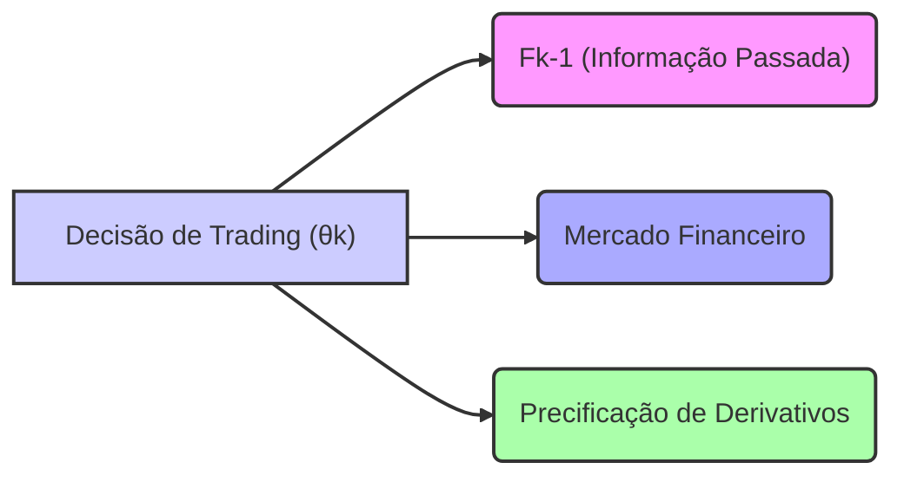

## Título Conciso: Predictibilidade das Posições em Ativos de Risco ($\theta$) em Modelos Financeiros

```mermaid
flowchart LR
    subgraph "Tempo k-1"
    Fk_1["Informação disponível (Fk-1)"]
    end
    subgraph "Tempo k"
    Sk["Informação do tempo k (Sk)"]
    theta_k["Posição de Risco (θk)"]
    end
    Fk_1 --> theta_k
    style Fk_1 fill:#f9f,stroke:#333,stroke-width:2px
    style theta_k fill:#ccf,stroke:#333,stroke-width:2px
    
    direction LR
    linkStyle default stroke:#333,stroke-width:2px;
    
    
    
    
    
    
    note top of Fk_1: "Decisão de alocação de ativos é feita no passo anterior"
    note top of theta_k: "Predictibilidade de Posições de Risco (θ)"
```

### Introdução

Em finanças quantitativas, as estratégias de trading envolvem decisões sobre a alocação de capital em ativos de risco. O conceito de **predictibilidade** das posições em ativos de risco ($\theta$), um componente essencial de estratégias de trading, garante que essas decisões sejam tomadas utilizando informações disponíveis no passado, e não no futuro [^1]. Este capítulo explora o conceito de predictibilidade de posições em ativos de risco, suas implicações em modelos financeiros e seu papel na modelagem de estratégias de investimento.

### Conceitos Fundamentais

**Conceito 1: Definição Formal de Predictibilidade de $\theta$**

Em um modelo financeiro de tempo discreto, uma estratégia de trading $\phi$ é definida pelo par ($\phi^0$, $\theta$), onde $\phi^0$ representa as posições em um ativo livre de risco e $\theta$ representa as posições em ativos arriscados, ambos com respeito a uma filtração $\mathbb{F} = (F_k)_{k=0,1,\ldots,T}$. O componente $\theta = (\theta_k)_{k=0,1,\ldots,T}$ é considerado **predictível** se a variável aleatória $\theta_k$ (que é um vetor de dimensão $d$, o número de ativos arriscados), que representa a quantidade de cada ativo mantido, é mensurável em relação à $\sigma$-álgebra $F_{k-1}$ para cada $k = 1, \ldots, T$ [^2]. Ou seja, para qualquer conjunto de Borel $B$ em $\mathbb{R}^d$, o conjunto $\{\omega: \theta_k(\omega) \in B\}$ é um elemento de $F_{k-1}$. A posição inicial, $\theta_0$, é usualmente igual a zero, pois representa uma decisão inicial antes do início do processo.

*Explicação Detalhada:*

   -   A predictibilidade de $\theta_k$ garante que a decisão de alocação de ativos no tempo $k$ seja feita somente com base na informação disponível no tempo $k-1$ (ou seja, no passado).
   -   Esta condição é necessária para que a estratégia de trading possa ser implementada no mundo real, já que o valor do ativo no tempo $k$ é conhecido apenas no tempo $k$ e não no tempo $k-1$.
   - A predictibilidade garante a causalidade, e impede o uso de informações futuras para modelar decisões de investimento.
   - O componente $\theta_k$ é uma variável aleatória e, portanto, pode ser construído através de funções de variáveis aleatórias que são elementos da $\sigma$-álgebra $F_{k-1}$.
   -   Se a estratégia dependesse de informações do tempo $k$, ela não seria predictível, sendo, neste caso, uma estratégia não realizável.
  - Modelos mais sofisticados podem, por exemplo, modelar a decisão de investimento como uma função de variáveis observadas em tempos anteriores, o que também leva a um processo predictível.

> 💡 **Exemplo Numérico:**
> Considere um cenário com dois ativos de risco (A e B). No tempo k=1, a posição em cada ativo ($\theta_1$) é definida com base nos retornos dos ativos no tempo k=0. Suponha que:
> - O retorno do ativo A no tempo k=0 foi de 5%.
> - O retorno do ativo B no tempo k=0 foi de -2%.
>
> Uma estratégia predictível poderia ser:
>
> $$\theta_{1,A} = 100 \times \frac{retorno_{0,A}}{abs(retorno_{0,A}) + abs(retorno_{0,B})} = 100 \times \frac{0.05}{0.05 + 0.02} \approx 71.43$$
> $$\theta_{1,B} = 100 \times \frac{retorno_{0,B}}{abs(retorno_{0,A}) + abs(retorno_{0,B})} = 100 \times \frac{-0.02}{0.05 + 0.02} \approx -28.57$$
>
> Isso significa que no tempo k=1, o investidor alocaria aproximadamente 71.43 unidades no ativo A e -28.57 unidades no ativo B (uma posição vendida), com base nos retornos observados no tempo k=0. Como a decisão de alocação no tempo k=1 depende apenas das informações de k=0, essa estratégia é predictível.

> ⚠️ **Nota Importante**: A predictibilidade de $\theta$ garante que as decisões de investimento sejam baseadas em informações disponíveis no tempo anterior ao momento da tomada de decisão, o que é fundamental para modelos economicamente realistas.

**Lemma 1:** Se um processo estocástico $\theta = (\theta_k)$ é predictível com respeito à filtração $\mathbb{F}$, então $\theta_k$ também é adaptado a $\mathbb{F}$, ou seja, $\theta_k$ é mensurável em relação a $F_k$ para cada $k$.
*Prova:* A demonstração segue da definição de predictibilidade. Se $\theta_k$ é $F_{k-1}$ mensurável e como $F_{k-1}$ é uma sub-$\sigma$-álgebra de $F_k$, então $\theta_k$ é também $F_k$ mensurável.  $\blacksquare$

**Conceito 2: Modelando Estratégias de Trading Predictíveis**

A modelagem de estratégias de trading em finanças quantitativas depende essencialmente do conceito de predictibilidade. A alocação de ativos em um instante $k$ deve ser definida com base nas informações disponíveis em $k-1$, evitando o uso de informações não disponíveis naquele instante [^3]. Uma estratégia de trading é definida por:
 - Os valores de $\theta_k$, que correspondem as quantidade de cada ativo arriscado a serem comprados ou vendidos no momento k, devem ser mensuráveis com respeito a $F_{k-1}$.
   - As decisões são tomadas com base nas informações disponíveis no tempo k-1, e portanto, qualquer estratégia que seja utilizada deve também ser $F_{k-1}$ mensurável.
   - O valor das decisões de investimento em cada instante não depende do que acontecerá no instante seguinte.

*Exemplos de estratégias predictíveis:*
   - Uma estratégia que investe 100% do portfólio num dado ativo se o preço desse ativo no instante k-1 é maior que o preço no instante k-2, e investe 0% caso contrário.
    -  Uma estratégia que investe proporcionalmente ao valor do ativo no instante anterior, ou que mantém uma proporção fixa de um ativo em relação ao valor de um portfólio.
  - Uma estratégia onde o valor dos ativos é dado por um modelo de otimização de portfólio (como o modelo de Markowitz), em que os parâmetros são definidos utilizando dados até o tempo k-1.

> 💡 **Exemplo Numérico:**
> Considere uma estratégia que investe em um ativo A com base em sua média móvel de 5 dias. Seja $P_{k-1}$ o preço do ativo no dia k-1 e $M_{k-1}$ a média móvel de 5 dias calculada até o dia k-1. A estratégia predictível pode ser definida como:
>
> $$\theta_k = \begin{cases} 100, & \text{se } P_{k-1} > M_{k-1} \\ 0, & \text{se } P_{k-1} \le M_{k-1} \end{cases}$$
>
> Isso significa que no dia k, o investidor aloca 100 unidades do ativo A se o preço do dia anterior for superior à média móvel calculada até o dia anterior; caso contrário, não aloca nada. Como a decisão de alocação no dia k depende apenas dos preços e da média móvel até o dia k-1, esta estratégia é predictível.

> ❗ **Ponto de Atenção**: A predictibilidade é uma condição fundamental para que as estratégias de trading sejam economicamente realizáveis, impedindo a utilização de informação do futuro na modelagem das decisões.

**Corolário 1:** Se um processo estocástico $X = (X_k)_{k=0,1,\ldots,T}$ é predictível, então qualquer função $h(X_{k-1})$, onde $h$ é uma função Borel, é também predictível.

*Prova:* Se $X$ é predictível, então $X_k$ é $F_{k-1}$-mensurável. Como $h$ é uma função Borel, $h(X_{k-1})$ é também $F_{k-1}$-mensurável, e portanto, predictível.  $\blacksquare$

**Conceito 3: A Relação entre Predictibilidade e Autofinanciamento**

Em modelos financeiros sem fricção, a predictibilidade de $\theta$ é fundamental para garantir o conceito de autofinanciamento da estratégia. Uma estratégia é autofinanciada se as mudanças de valor do portfólio dependem exclusivamente de ganhos ou perdas obtidas pela dinâmica dos preços dos ativos, e não de aportes externos de capital. [^4]
   -  Em particular, se a decisão de compra e venda de um ativo no tempo k depende do que se observa no tempo k (e não em k-1), a decisão precisaria de informação do futuro, que não faz sentido.

*Explicação Detalhada:*

  -  Se a estratégia é predictível, as decisões no instante k só podem depender de informações obtidas antes daquele instante, ou seja, em $F_{k-1}$.
   - Se o processo de preços de um ativo for modelado como adaptado, mas não predictível, ao se combinar um processo adaptado (preços) e um processo predictível (estratégia), é possível definir uma integral estocástica que represente a evolução da carteira ao longo do tempo.
   -  A propriedade de que a estratégia de trading seja predictível garante que não existam possibilidades de ganho através de informação futura, ou seja, que o modelo de portfólio seja livre de arbitragem.

> 💡 **Exemplo Numérico:**
> Suponha que um investidor possua um portfólio no tempo k-1 com um valor de $V_{k-1}$. No tempo k, o investidor decide ajustar as posições em ativos de risco, $\theta_k$, com base em informações disponíveis em k-1. Para que a estratégia seja autofinanciada, a mudança no valor do portfólio ($V_k - V_{k-1}$) deve ser exclusivamente devida aos ganhos ou perdas dos ativos de risco, ou seja, $\theta_k$ multiplicado pela variação do preço dos ativos entre k-1 e k. Não pode haver injeção ou retirada de capital externo.
>
> Se $\Delta P_k$ representa a variação do preço dos ativos entre k-1 e k, então a variação do valor do portfólio seria:
>
> $$V_k - V_{k-1} = \theta_k \Delta P_k$$
>
> Como $\theta_k$ é definido com base nas informações disponíveis em k-1, e não no tempo k, a estratégia é predictível e o portfólio é autofinanciado. Se $\theta_k$ dependesse de informações em k, então a estratégia não seria predictível e a condição de autofinanciamento não seria garantida.

> ✔️ **Destaque**: A predictibilidade do processo de posições de ativos de risco ($\theta$) garante que as estratégias de trading sejam economicamente realizáveis e consistentes com modelos de precificação sem arbitragem.

### A Predictibilidade na Modelagem Financeira



**A Predictibilidade como Base para Estratégias de Trading e Modelos de Precificação**

A predictibilidade das posições em ativos de risco é um conceito central na modelagem de estratégias de trading e na precificação de derivativos.
   -   Em modelos sem arbitragem, as estratégias de trading devem ser predictíveis, de modo que os ganhos ou perdas dessas estratégias não dependam de informação futura.
   - Modelos mais complexos, onde a volatilidade é estocástica, e os retornos de um ativo dependem de outros fatores, também requerem que as decisões de investimento (e, portanto, as quantidades de ativos mantidos no portfólio) sejam predictíveis.
   -  Modelos de gestão de risco utilizam estratégias de trading (como hedge) e essas estratégias precisam, portanto, ser predictíveis para que seus resultados sejam computados de forma realista.

**Lemma 3:** Se o componente $\theta$ de uma estratégia de trading é predictível, então o valor da carteira no instante k, que depende de $\theta_k$ e de todos os valores passados dos preços dos ativos,  é obtida com base nas informações de $F_{k-1}$.
*Prova:*  Se $\theta$ é predictível, então para cada instante $k$, $\theta_k$ é mensurável com relação a $F_{k-1}$, e portanto, o valor da carteira, que depende de $\theta_k$, é também mensurável com relação a $F_{k-1}$.  $\blacksquare$

> 💡 **Exemplo Numérico:**
> Considere um portfólio no tempo k. O valor do portfólio, $V_k$, é dado pela soma do valor dos ativos de risco multiplicados pelas suas respectivas quantidades ($\theta_k$) e o valor do ativo livre de risco. Se $\theta_k$ é predictível, então a decisão de alocação em k foi tomada com base nas informações de $F_{k-1}$.
>
> $$V_k = \sum_{i=1}^d \theta_{k,i} P_{k,i} + \phi_k^0 B_k$$
>
> Onde:
> - $P_{k,i}$ é o preço do ativo de risco i no instante k.
> - $\theta_{k,i}$ é a quantidade do ativo de risco i no instante k.
> - $B_k$ é o valor do ativo livre de risco no instante k.
> - $\phi_k^0$ é a quantidade do ativo livre de risco no instante k.
>
> Como $\theta_k$ é predictível, o valor do portfólio no instante k é uma função das decisões tomadas até o instante k-1, e, portanto, mensurável com relação a $F_{k-1}$.

**Corolário 3:** A predictibilidade do processo de trading garante a consistência dos modelos e que não existem oportunidades de arbitragem, em modelos sem fricção ou em modelos com fricção que levam em consideração seus efeitos.

### Derivações Teóricas Avançadas

#### Seção Teórica Avançada 1: Como a Relaxação da Predictibilidade Afeta Modelos de Precificação Livre de Arbitragem?

Em modelos financeiros, a predictibilidade das estratégias de trading é crucial para garantir a ausência de arbitragem. Como a relaxação desta condição afeta a validade dos modelos?

*Explicação Detalhada:*
   - Se as decisões de compra e venda de ativos dependessem do preço do ativo naquele instante (i.e. se a estratégia fosse adaptada ao invés de predictível), seria possível construir estratégias que, embora muito arriscadas e irrealistas, seriam capazes de obter um lucro sem risco utilizando informações do futuro, que um participante de mercado não tem.
   - Se a estratégia não é predictível, a propriedade de martingale do processo que descreve o portfólio deixa de ser válida, o que invalida a estratégia de precificação baseada em martingales.
  - Modelos que relaxam a condição de predictibilidade para estratégias de trading são mais complexos de analisar e precificar.
  -   Em mercados com informação assimétrica, onde um agente tem informação do futuro, a modelagem precisa levar em conta a possibilidade de estratégias que não respeitam a predictibilidade.
  -   A hipótese de que os preços dos ativos, utilizados na estratégia, também são processos adaptados é necessária para se definir o conceito de autofinanciamento de uma estratégia.

**Lemma 4:** Se a estratégia de trading $\theta$ não é predictível com respeito à filtração $\mathbb{F}$, o processo de valor da carteira gerada por essa estratégia já não é uma martingale com respeito a $\mathbb{F}$, o que significa que os preços de derivativos modelados utilizando tal estratégia não são consistentes com o pressuposto de ausência de arbitragem.

*Prova:* A demonstração envolve mostrar que a propriedade de martingale não é satisfeita quando a estratégia não é predictível, o que é dado através do cálculo da esperança condicional da variação do preço da carteira no futuro.   $\blacksquare$

> 💡 **Exemplo Numérico:**
> Suponha que uma estratégia de trading não predictível, $\theta_k$, dependa do preço do ativo no tempo k, $P_k$. Uma estratégia de martingale requer que a esperança condicional do valor do portfólio no tempo k, dado o conhecimento até o tempo k-1, seja igual ao valor do portfólio no tempo k-1. Se $\theta_k$ depende de $P_k$, então o valor do portfólio no tempo k, $V_k$, também depende de $P_k$.
>
> $$E[V_k | F_{k-1}] = V_{k-1}$$
>
> Se $\theta_k$ é não-predictível, então $V_k$ não é uma martingale, pois a esperança condicional de $V_k$ depende de informações do tempo k, que não estão presentes em $F_{k-1}$. Logo, o modelo não é livre de arbitragem.

**Corolário 4:** Modelos financeiros que assumem estratégias de trading que não sejam predictíveis precisam de análises mais cuidadosas, pois podem levar a resultados que não podem ser interpretados em termos de preços de ativos e derivativos livres de arbitragem.

#### Seção Teórica Avançada 2: Como Modelar Estratégias de Trading Adaptadas em Modelos de Equilíbrio?

Modelos de equilíbrio, onde os preços são modelados a partir do balanço entre oferta e procura,  frequentemente utilizam estratégias que são adaptadas e não predictíveis. Qual o impacto dessa abordagem na consistência dos modelos?

*Explicação Detalhada:*

  -   Em modelos de equilíbrio, os preços são determinados pelas escolhas otimizadoras de todos os agentes, o que implica que a estratégia de trading de um agente depende dos preços de todos os ativos no instante da decisão, e portanto, não são predictíveis.
    -   Modelos de equilíbrio são baseados em modelos onde os preços não são definidos de forma exógena, mas dependem das escolhas dos participantes, e portanto o processo que define o preço do ativo passa a ser um processo endógeno.
   -   Modelos com estratégias adaptadas necessitam também que os agentes tenham conhecimento dos parâmetros do modelo, ou seja, das decisões dos outros agentes, para calcular a alocação dos ativos que maximiza sua função de utilidade.
  -  Modelos de equilíbrio são mais complexos e requerem outras ferramentas matemáticas, como a modelagem de funções de utilidade e a derivação de condições de equilíbrio.

**Lemma 5:** Em um modelo de equilíbrio, onde os preços são definidos endogenamente pelas escolhas de todos os participantes do mercado, é necessário que as estratégias de trading sejam definidas com relação a uma filtração que inclui toda a informação que cada agente observa, que pode incluir informações do instante presente.

*Prova:* A demonstração envolve a construção de modelos de equilíbrio baseados em escolhas ótimas, onde as decisões dependem dos preços de todos os ativos no momento em que são realizadas.   $\blacksquare$

> 💡 **Exemplo Numérico:**
> Em um modelo de equilíbrio, a alocação de ativos de um agente, $\theta_k$, pode ser uma função do preço de mercado dos ativos no tempo k, $P_k$. Por exemplo, um agente pode decidir aumentar a alocação no ativo A se o preço de A no tempo k, $P_{k,A}$, for menor do que o preço de outro ativo B, $P_{k,B}$.
>
> $$\theta_{k,A} = f(P_{k,A}, P_{k,B})$$
>
> Como a decisão de alocação $\theta_{k,A}$ depende do preço no tempo k, a estratégia é adaptada, mas não predictível. Isso ocorre porque o preço no tempo k é uma variável que só se torna conhecida no tempo k, e a decisão de investimento depende desse preço.

**Corolário 5:**  Modelos de equilíbrio com estratégias de trading que são adaptadas e não predictíveis não podem, em geral, serem considerados como modelos livres de arbitragem.  É preciso definir o conceito de equilíbrio de mercado e as propriedades necessárias dos preços para que o conceito faça sentido.

#### Seção Teórica Avançada 3:  Como a Não-Mensurabilidade Afeta a Definição de Estratégias de Trading?

A mensurabilidade das estratégias de trading, seja no instante k ou no instante k-1, é essencial para a consistência do modelo, garantindo que ela seja uma variável aleatória em um espaço de probabilidade bem definido. Como a não-mensurabilidade afeta a construção de estratégias de trading?

*Explicação Detalhada:*

   -   Se uma estratégia de trading não é mensurável, não é possível calcular sua esperança condicional, o que impossibilita a análise de suas propriedades e a avaliação de risco.
   -   Uma estratégia não mensurável também impede que a propriedade de auto-financiamento seja verificada de forma consistente, invalidando a precificação de derivativos.
    -   Na definição do preço de um derivativo, o conceito de integral estocástica requer que a estratégia seja mensurável, o que garante que os ganhos e perdas das estratégias sejam definidos como variáveis aleatórias.

**Lemma 6:** Se a estratégia de trading $\theta$ não é predictível ou se as posições em ativos livres de risco não são adaptadas, o valor do portfólio não é uma variável aleatória definida na $\sigma$-álgebra apropriada e, portanto, a integral estocástica que define o ganho do portfólio não pode ser definida de forma consistente.

*Prova:* A demonstração depende do cálculo da integral estocástica. Se a estratégia de trading é não-mensurável, o integrando não é uma variável aleatória, o que invalida as propriedades de integral estocástica.  $\blacksquare$

> 💡 **Exemplo Numérico:**
> Suponha que a estratégia de trading, $\theta_k$, seja definida por uma regra que não é mensurável em relação a $F_{k-1}$. Por exemplo, $\theta_k$ poderia ser definida como 100 se um evento futuro não mensurável ocorrer, e 0 caso contrário.
>
> A integral estocástica que define o ganho do portfólio é dada por:
>
> $$\int_0^T \theta_k dP_k$$
>
> Se $\theta_k$ não é mensurável, a integral não está bem definida e, portanto, não é possível calcular o ganho do portfólio de forma consistente. Isso ocorre porque a integral estocástica requer que o integrando seja uma variável aleatória mensurável em relação à filtração adequada.

**Corolário 6:**   É essencial que as estratégias de trading sejam definidas por processos estocásticos que sejam mensuráveis (e que sigam regras de adaptabilidade e predictibilidade) para garantir que os modelos sejam matematicamente consistentes.

### Conclusão

A modelagem de estratégias de trading $\phi = (\phi^0, \theta)$ em modelos financeiros em tempo discreto é realizada utilizando processos estocásticos adaptados ou predictíveis com relação a uma filtração $\mathbb{F}$. O componente $\theta$, que especifica as posições em ativos arriscados, precisa ser predictível, com respeito a $\mathbb{F}$ para garantir a causalidade, onde as decisões são tomadas com base no passado e não no futuro. As seções teóricas avançadas exploraram como a relaxação da condição de predictibilidade, a modelagem de estratégias em modelos de equilíbrio, e os requisitos da mensurabilidade afetam a consistência, o realismo e a aplicabilidade dos modelos financeiros, e a importância de uma modelagem cuidadosa das estrategias.

### Referências

[^1]: "Em finanças quantitativas, o conceito de uma **estratégia de trading** (trading strategy), representada por $\phi = (\phi^0, \theta)$, é fundamental para modelar as decisões de investimento e alocação de ativos num mercado financeiro."

[^2]:  "Uma estratégia de trading $\phi$ é formalmente definida como um par de processos estocásticos, $\phi = (\phi^0, \theta)$ , onde: $\phi^0 = (\phi^0_k)_{k=0,1,\ldots,T}$ representa as posições em um ativo livre de risco (ou ativo de referência) ao longo do tempo."

[^3]: "Em modelos financeiros, a taxa de juros $r_k$ é geralmente considerada predictível, ou seja, $r_k$ é mensurável em relação à $\sigma$-álgebra $F_{k-1}$."

[^4]: "A predictibilidade é um conceito importante em finanças quantitativas, especialmente na modelagem de estratégias de trading e de gestão de risco."
