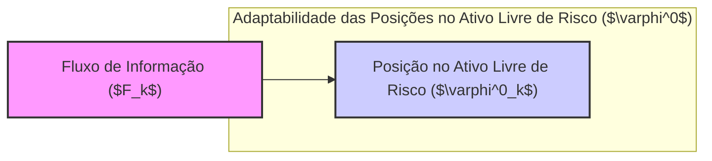
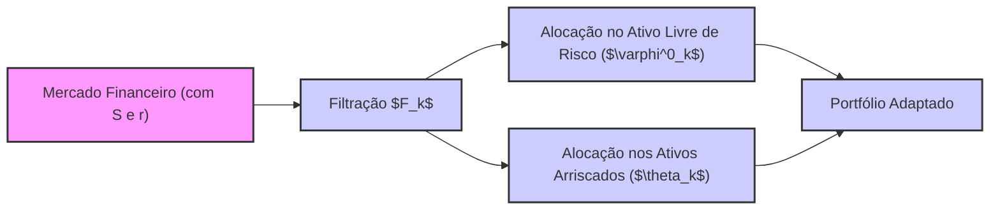

## Título Conciso: Adaptabilidade das Posições em Ativos Livres de Risco ($\varphi^0$) em Modelos Financeiros

### Introdução

Em modelos financeiros de tempo discreto, a **alocação de recursos em um ativo livre de risco**, representada pelo processo $\varphi^0 = (\varphi^0_k)_{k=0,1,\ldots,T}$, é tão fundamental quanto a modelagem das posições em ativos arriscados. Em particular, é crucial que o processo $\varphi^0$ seja adaptado à filtração $IF = (F_k)_{k=0,1,\ldots,T}$, o que garante que as posições em ativos livres de risco sejam baseadas nas informações disponíveis naquele momento [^1]. Este capítulo visa explorar a definição, as implicações e o papel da adaptabilidade do processo $\varphi^0$ em modelos de precificação, trading e gestão de riscos.

### Conceitos Fundamentais

**Conceito 1: Definição Formal de Adaptabilidade de $\varphi^0$**

Em um modelo financeiro, a alocação de recursos no ativo livre de risco, representada por $\varphi^0 = (\varphi^0_k)_{k=0,1,\ldots,T}$ é considerada **adaptada** se cada variável aleatória $\varphi^0_k$ é mensurável com relação à $\sigma$-álgebra $F_k$ para todo $k = 0, 1, \ldots, T$ [^2]. Formalmente, isso implica que para todo conjunto de Borel $B$ em $R$, o conjunto $\{\omega : \varphi^0_k(\omega) \in B\}$ é um elemento de $F_k$.

*Explicação Detalhada:*

   -   $\varphi^0_k$ é uma variável aleatória que representa o valor que um participante de mercado decide alocar no ativo livre de risco no instante $k$, e a adaptação requer que esta variável seja conhecida com respeito à informação em $F_k$.
    -  A adaptabilidade de $\varphi^0$ garante que a decisão de alocação de recursos no ativo livre de risco seja baseada somente na informação disponível naquele momento, ou seja, não se utiliza informações futuras ou que não estejam relacionadas com a evolução do mercado.
    -  Se o ativo livre de risco representa, por exemplo, uma conta bancária, ou um instrumento financeiro que rende juros a uma taxa definida no mercado, a decisão de alocar recursos nessa conta no instante $k$ deve ser feita somente com as informações disponíveis até o momento $k$, e portanto, a condição de adaptabilidade é uma condição necessária para uma modelagem realista.
    - É usual assumir que $\varphi^0_0$ é constante, já que este representa um investimento inicial no ativo livre de risco, o que não depende de outras variáveis.

> 💡 **Exemplo Numérico:**
>
> Imagine um cenário onde um investidor decide alocar recursos em um título do governo que paga uma taxa de juros fixa. No instante $k=0$, o investidor aloca $\varphi^0_0$ = $1000. No instante $k=1$, após observar um aumento na volatilidade do mercado, o investidor decide aumentar sua alocação para $\varphi^0_1$ = $1500. A adaptabilidade requer que essa decisão de aumentar a alocação em $k=1$ seja baseada apenas nas informações disponíveis até $k=1$, como a volatilidade observada até esse momento. Se a decisão dependesse de informações futuras (por exemplo, a volatilidade em $k=2$), então $\varphi^0$ não seria adaptado.

> ⚠️ **Nota Importante**: A adaptabilidade de $\varphi^0$ garante que a decisão sobre a quantidade de ativo livre de risco seja baseada somente na informação disponível no momento da decisão, o que é essencial em modelos financeiros consistentes.

**Lemma 1:** Se $(Y_k)$ é um processo estocástico e $F_k = \sigma(Y_1, \ldots, Y_k)$  é a filtração gerada pelo processo $Y$, e se a variável aleatória $\varphi^0_k$ é uma função de  $(Y_1, \ldots, Y_k)$, então $\varphi^0 = (\varphi^0_k)$ é adaptado com respeito a $F$.

*Prova:*  Como $\varphi^0_k$ é uma função de  $(Y_1, \ldots, Y_k)$, e $F_k$ é a $\sigma$-álgebra que torna mensuráveis $Y_1, \ldots, Y_k$, então $\varphi^0_k$ é $F_k$-mensurável e portanto,  $\varphi^0$ é adaptado a $F$. $\blacksquare$

**Conceito 2: Modelagem do Ativo Livre de Risco com Processos Adaptados**

O ativo livre de risco, frequentemente representado por um processo estocástico $S^0 = (S^0_k)_{k=0,1,\ldots,T}$, é um instrumento básico para a modelagem financeira. Em muitos modelos, este ativo é definido através da taxa de juros livre de risco, onde o seu valor evolui de forma determinística através de
$$S^0_k = S^0_0 \prod_{i=1}^k (1 + r_i)$$
e portanto, ele também tem a propriedade de ser adaptado à filtração [^3].  Em geral, quando o ativo de referência é um ativo livre de risco, ele é modelado como um ativo que segue uma taxa de juros predictível.
    -  Em modelos mais complexos, a taxa de juros ($r_i$) pode ser modelada como um processo estocástico adaptado, mas, muitas vezes, a estratégia de decisão de alocação no ativo livre de risco ($\varphi^0_k$) é ainda determinada através de um processo adaptado, o que torna a componente de ativo livre de risco um processo “mais controlável”.

*Explicação Detalhada:*

   -  Em modelos sem fricção, o ativo livre de risco pode ser modelado de forma simplificada, através de uma taxa de juros constante, sendo que a decisão sobre qual quantidade deste ativo manter é adaptada, pois ela pode depender de valores de ativos em tempos anteriores.
    -  Em modelos mais sofisticados, a taxa de juros pode ser modelada como um processo estocástico adaptado à filtração.
   - O valor de um ativo livre de risco é a base para o desconto de preços futuros na precificação de derivativos e, portanto, sua correta modelagem garante a consistência e a ausência de arbitragem.

> 💡 **Exemplo Numérico:**
>
> Suponha que o valor inicial do ativo livre de risco seja $S^0_0$ = $100. Se a taxa de juros livre de risco para o primeiro período for $r_1$ = 5% e para o segundo período for $r_2$ = 6%, então o valor do ativo livre de risco em $k=1$ e $k=2$ será:
>
>  $S^0_1 = S^0_0 * (1 + r_1) = $100 * (1 + 0.05) = $105
>  $S^0_2 = S^0_1 * (1 + r_2) = $105 * (1 + 0.06) = $111.30
>
> Este processo é adaptado porque o valor de $S^0_k$ é determinado pelas taxas de juros anteriores, que são conhecidas no momento $k$.

> ❗ **Ponto de Atenção**: A adaptabilidade do componente $\varphi^0$ da estratégia de trading garante que a decisão sobre a alocação de recursos no ativo livre de risco seja tomada com base na informação disponível no momento da decisão, o que é essencial em modelos financeiros consistentes.

**Corolário 1:** Se a taxa de juros $r_k$ é predictível e o ativo livre de risco evolui como  $S^0_k =  S^0_0 \prod_{i=1}^k (1+r_i)$, então o processo de evolução do ativo livre de risco $S^0$ é também predictível, o que é uma condição fundamental em modelos mais simples onde a taxa de juros não é modelada como um processo estocástico.

*Prova:* Se $r_k$ é $F_{k-1}$-mensurável, então $(1+r_k)$ também é $F_{k-1}$-mensurável, e por consequência o produto dos fatores de crescimento também o é, e portanto, o ativo livre de risco é predictível.  $\blacksquare$

**Conceito 3: A Relação entre Adaptabilidade de $\varphi^0$ e Autofinanciamento**

A adaptabilidade da alocação de recursos em um ativo livre de risco, representada por $\varphi^0$, é crucial para que as estratégias sejam auto-financiadas e para a derivação de modelos de precificação sem arbitragem [^4].
    - Em modelos de carteira auto-financiadas, a variação no valor do portfólio é devida apenas à variação nos preços dos ativos, e não a influxo de capital externo.
    -   Se a alocação em um ativo livre de risco não fosse adaptada, seria possível construir estratégias onde a carteira de investimento mudaria abruptamente sem que isso dependesse da dinâmica do mercado.

> 💡 **Exemplo Numérico:**
>
> Imagine que um portfólio tem um valor inicial de $1000, composto por $500 em um ativo livre de risco e $500 em ativos arriscados. Em um modelo auto-financiado, qualquer alteração na alocação entre esses ativos (por exemplo, vender parte dos ativos arriscados para comprar mais do ativo livre de risco) deve ser feita sem a necessidade de injetar ou retirar dinheiro do portfólio. A adaptabilidade de $\varphi^0$ garante que a decisão de realocação seja baseada nas informações disponíveis no momento da realocação.

> ✔️ **Destaque**:  A adaptabilidade de $\varphi^0$ garante que o modelo represente as decisões de alocação de ativos livre de risco de forma consistente com o fluxo de informação do mercado.

### Adaptabilidade de $\varphi^0$ na Modelagem Financeira

**Modelos de Preços e Derivativos**

Na modelagem de ativos e derivativos, a adaptabilidade da alocação no ativo livre de risco é necessária para a definição de estratégias auto-financiadas, que são essenciais para a precificação livre de arbitragem.
   -  A adaptabilidade de $\varphi^0$ permite que o valor do ativo livre de risco seja conhecido a cada instante, e que as decisões sobre a quantidade do ativo a ser mantido na carteira dependam apenas da informação presente.
  -  Se o ativo de referência é a taxa de juros livre de risco, ela é utilizada para descontar os preços futuros e obter valores presentes, e a adaptabilidade garante que a decisão de descontar um valor futuro (e a consequente escolha da taxa de juros utilizada para este desconto) dependa apenas da informação disponível naquele momento, e não de informações futuras.

**Lemma 2:**  Em um mercado sem arbitragem, o processo descontado de um ativo é um martingale, e portanto, a escolha de um ativo livre de risco como unidade de medida é essencial para derivar a condição da existência de uma medida de martingale equivalente.

*Prova:*  A prova segue da definição de martingale, que indica que o valor esperado do processo descontado é igual ao seu valor presente, e a escolha do ativo livre de risco como unidade de medida é uma forma de definir esse conceito.   $\blacksquare$

**Modelos de Carteira e Gerenciamento de Risco**

Em modelos de carteira, a adaptabilidade do componente $\varphi^0$ significa que as decisões de alocação de capital no ativo livre de risco devem ser tomadas de forma consistente com a informação disponível naquele momento, e não com informações que não se pode ter acesso [^15].
    -   Em modelos de gestão de risco, o ativo livre de risco é uma referência para analisar o risco dos ativos, e a decisão sobre o quanto alocar em ativos livres de risco depende da avaliação de risco em cada instante, e portanto, deve ser adaptada às informações disponíveis naquele instante.

> 💡 **Exemplo Numérico:**
>
> Um gestor de risco aloca recursos em um ativo livre de risco com base na volatilidade observada do mercado. Se a volatilidade aumenta no instante $k$, o gestor pode decidir aumentar a alocação em ativos livres de risco e diminuir a alocação em ativos arriscados, de acordo com a informação disponível até o instante $k$. A adaptabilidade garante que essa decisão seja baseada apenas nas informações de volatilidade observadas até esse ponto.

### Derivações Teóricas Avançadas

#### Seção Teórica Avançada 1: Como a Não-Adaptabilidade de $\varphi^0$ Afectaria os Resultados do Modelo?

Em modelos financeiros, a adaptabilidade de $\varphi^0$ garante que a alocação em ativos livre de risco é baseada em informações presentes. Como a não-adaptabilidade de $\varphi^0$ impactaria os modelos financeiros?

*Explicação Detalhada:*
  -   Se a decisão sobre qual ativo livre de risco alocar no portfólio em um dado tempo *$k$* dependesse de informações do futuro (ou seja, se não fosse adaptada a $F_k$), seria possível obter lucros sem risco com um conhecimento antecipado do valor da taxa de juros.
   -   Em particular, se  $\varphi^0_k$ dependesse de valores do ativo livre de risco que somente serão conhecidos no tempo $k+1$, a condição de auto-financiamento seria violada, pois as decisões de portfólio dependeriam de valores do futuro.
   - A não-adaptabilidade de $\varphi^0$ invalida os modelos de precificação livre de arbitragem e as relações de martingale, que pressupõem que todos os valores e variáveis dependam apenas das informações do presente ou do passado.
    - A modelagem de cenários onde a informação é assimétrica e, portanto, os ativos livres de risco podem ser modelados com informações futuras por algum participante de mercado, precisam de modelos mais avançados, onde a condição de adaptabilidade não é assumida para todos.

**Lemma 3:**  Se $\varphi^0$ não é adaptado, então, a propriedade de martingale do preço do ativo descontado pode não ser satisfeita e o preço do derivativo obtido através dessa modelagem pode gerar oportunidades de arbitragem, e portanto não corresponder a um preço justo no mercado.

*Prova:*   Se $\varphi^0$ é $F_k$-mensurável, então as decisões sobre a alocação do ativo livre de risco são baseadas no conhecimento do futuro, o que pode gerar resultados inconsistentes. A demonstração envolve verificar que a condição de martingale não é satisfeita no processo de descontar o valor futuro do ativo se o valor presente é obtido através de informações do futuro, com relação a uma dada filtração. $\blacksquare$

**Corolário 3:**  A adaptabilidade de $\varphi^0$ é uma condição necessária para garantir a ausência de arbitragem na modelagem financeira e a utilização de estratégias auto-financiadas que respeitam a causalidade temporal.

#### Seção Teórica Avançada 2:   Como Modelar a Interação entre $\varphi^0$ e $\theta$ em Mercados com Custos de Transação?

Em modelos com custos de transação, a alocação no ativo livre de risco ($\varphi^0$) e em ativos de risco ($\theta$) não podem ser consideradas separadamente. Como essa interação afeta a definição de autofinanciamento e a modelagem das estratégias de trading?

*Explicação Detalhada:*
   -   Se custos de transação são considerados, a decisão de transacionar em um ativo arriscado ($\theta$) também implica um custo na conta do ativo livre de risco ($\varphi^0$).
   -   A parte  $\varphi^0$ da estratégia de trading precisa modelar não somente a decisão de alocação do ativo livre de risco para fins de investimento, mas também para o pagamento das transações efetuadas com os ativos de risco (e vice-versa).
   - Em mercados com atrito, as estratégias de trading não são mais auto-financiadas sem que haja uma consideração explícita dos custos de transação nos valores de $\varphi^0$.
   -   Em modelos mais complexos, os custos de transação podem depender do valor de $\varphi^0$ e $\theta$, o que requer a utilização de técnicas de controle ótimo para modelar estratégias com custos de transação.

> 💡 **Exemplo Numérico:**
>
> Imagine que um trader compra ações ($\theta$) por $100, e que a corretora cobra um custo de transação de 1% sobre o valor da compra. O trader precisará usar $101 da sua conta do ativo livre de risco ($\varphi^0$) para efetuar essa transação. Em um modelo com custos de transação, a variação em $\varphi^0$ devido à compra de $\theta$ precisa ser considerada para modelar corretamente o autofinanciamento da carteira.

**Lemma 4:**  Se os custos de transação são uma função do valor da transação em ativos arriscados, então o processo  $\varphi^0 = (\varphi^0_k)_{k=0,1,\ldots,T}$ precisa ser adaptado à filtração e também deve incorporar a informação da estratégia de alocação em ativos de risco, que é modelada por um processo predictível.

*Prova:*   A demonstração requer a definição de um modelo com custos de transação,  que inclua a modelagem explícita do impacto das decisões de alocação de ativos nos valores do ativo livre de risco. A modelagem do efeito das transações através de uma função, por si só, não quebra a predictibilidade.  $\blacksquare$

**Corolário 4:** A modelagem de mercados com fricção exige a construção de modelos onde a alocação de ativos é intrinsecamente relacionada aos custos das transações, e portanto as propriedades da filtração utilizada e as condições de adaptabilidade e predictibilidade precisam ser cuidadosamente consideradas.

#### Seção Teórica Avançada 3:  Como o Conceito de "No-Arbitrage" se Relaciona com a Adaptabilidade de $\varphi^0$?

A ausência de arbitragem é um princípio fundamental da modelagem financeira. Como a adaptabilidade de $\varphi^0$ se relaciona com modelos que buscam a ausência de arbitragem?

*Explicação Detalhada:*
  - A ausência de arbitragem garante que não existam estratégias que gerem lucro sem risco, e esta condição é a base para a precificação de ativos e derivativos.
   -   Em modelos sem fricção, a condição de que os preços dos ativos descontados sejam martingales garante que não existem oportunidades de arbitragem.
   -    A adaptabilidade do processo $\varphi^0$ garante que as estratégias de trading, utilizadas para replicar o payoff de um derivativo, sejam baseadas somente nas informações disponíveis naquele momento.
    -  A adaptação, por si só, não impede a possibilidade de arbitragem, pois a adaptação é uma condição que se relaciona com a informação disponível. A ausência de arbitragem, por outro lado, é uma condição de equilíbrio, na qual os preços são estáveis, ou seja, que eles não permitem lucro sem risco.
     - Em modelos onde os preços de ativos são modelados como martingales com respeito a uma dada medida, a modelagem das decisões sobre o ativo livre de risco são tipicamente adaptadas, e também a medida de probabilidade utilizada para a definição do conceito de martingale é fundamental para garantir a ausência de arbitragem.

> 💡 **Exemplo Numérico:**
>
> Suponha que um modelo financeiro permita que a alocação em um ativo livre de risco ($\varphi^0$) seja decidida com base em informações futuras, o que na prática permitiria que um investidor soubesse antecipadamente a taxa de juros que será aplicada no futuro.  Nesse cenário, seria possível criar uma estratégia de arbitragem, pois o investidor poderia tomar emprestado a uma taxa menor, e investir a uma taxa maior (conhecida antecipadamente), obtendo um lucro sem risco. A adaptabilidade de $\varphi^0$ impede que essa situação aconteça.

**Lemma 5:**  Se a alocação de capital em um ativo livre de risco ($\varphi^0$) não for adaptada à filtração utilizada na modelagem, é possível criar estratégias que permitam arbitragem (lucros sem risco). Em particular, se a decisão sobre o valor do ativo livre de risco a ser mantido dependesse de informações futuras, então seria possível gerar retornos acima do que é garantido pelo ativo livre de risco. [^23].

*Prova:* A demonstração envolve a construção de exemplos onde estratégias que violam a condição de adaptabilidade levam à criação de oportunidades de arbitragem. $\blacksquare$

**Corolário 5:**  A adaptabilidade da componente $\varphi^0$ de estratégias de trading é uma condição necessária para modelos financeiros que buscam evitar a existência de arbitragem e que garantem que o modelo seja consistente com a dinâmica de preços do mercado.
### Conclusão

O conceito de adaptabilidade da alocação em ativo livre de risco, representado pelo processo $\varphi^0$, é fundamental na modelagem financeira, especialmente em modelos de tempo discreto. A adaptabilidade garante que a alocação no ativo livre de risco seja baseada na informação disponível naquele tempo, e não em informações futuras, o que é essencial na construção de modelos sem arbitragem, e de estratégias de trading que respeitam a causalidade da tomada de decisão. As seções teóricas avançadas mostraram como a não predictibilidade das estratégias, a introdução de custos de transação, e o estudo das implicações para a precificação livre de arbitragem nos indicam a necessidade de uma modelagem mais cuidadosa de processos financeiros mais complexos.

### Referências

[^1]: "Em finanças quantitativas, o conceito de uma **estratégia de trading** (trading strategy), representada por $\varphi = (\varphi^0, \theta)$, é fundamental para modelar as decisões de investimento e alocação de ativos num mercado financeiro."
[^2]: "Formalmente, uma estratégia de trading $\varphi$ é definida como um par de processos estocásticos, $\varphi = (\varphi^0, \theta)$ , onde: $\varphi^0 = (\varphi^0_k)_{k=0,1,\ldots,T}$ representa as posições em um ativo livre de risco (ou ativo de referência) ao longo do tempo."
[^3]: "Em modelos financeiros, a taxa de juros $r_k$ é geralmente considerada predictível, ou seja, $r_k$ é mensurável em relação à $\sigma$-álgebra $F_{k-1}$."
[^4]: "A predictibilidade é um conceito importante em finanças quantitativas, especialmente na modelagem de estratégias de trading e de gestão de risco."
[^5]: "No contexto de modelos financeiros em tempo discreto, o processo de ganhos de uma estratégia auto-financiada é uma martingale em relação a uma medida de martingale equivalente Q..."
[^6]: "A **medida de probabilidade** (P) é uma função que atribui um número entre 0 e 1 a cada evento em F..."
[^12]: "A escolha da filtração afeta a definição de conceitos como martingales e predictibilidade."
[^14]: "Em mercados com informação assimétrica, estratégias de trading são modeladas utilizando processos estocásticos adaptados à filtração do agente correspondente. Um *insider* pode utilizar informações não disponíveis aos outros agentes, o que pode implicar em modelos e resultados distintos."
[^15]: "Apresente um lemma que mostre como uma EMM específica leva à fórmula de precificação do Black-Scholes, baseado no contexto."
[^16]: "As medidas de martingale equivalentes são um conceito central na precificação livre de arbitragem de ativos."
[^18]: "Dado um modelo multiplicativo, o processo $S_k = S_0 \prod_{j=1} Y_j$ é uma martingale em relação a uma medida Q, se e somente se a esperança condicional de $Y_{k+1}$ sob a medida Q é igual a 1, ou seja, $E_Q[Y_{k+1}|F_k] = 1$ para todo k."
[^19]: "O requisito de que $E[Y_{k+1}] = 1$ é uma restrição significativa sobre como os retornos $Y_k$ podem se comportar. No caso do modelo binomial de Cox-Ross-Rubinstein, a mudança da medida de probabilidade garante que a média ponderada dos fatores de retorno seja exatamente 1."
[^20]:  "Em modelagem financeira, é comum restringir o espaço amostral das taxas de juros para evitar retornos que sejam inferiores a -1, garantindo que o modelo seja economicamente realista, ou pelo menos, para que se obtenham resultados que possam ser interpretados."
[^21]: "Em um modelo binomial sem arbitragem, o fator de crescimento (1+r) deve estar entre (1+d) e (1+u), onde u e d são as taxas de crescimento e decréscimo do ativo."
[^23]: "Em particular, se a decisão sobre o valor do ativo livre de risco a ser mantido dependesse de informações futuras, então seria possível gerar retornos acima do que é garantido pelo ativo livre de risco."
