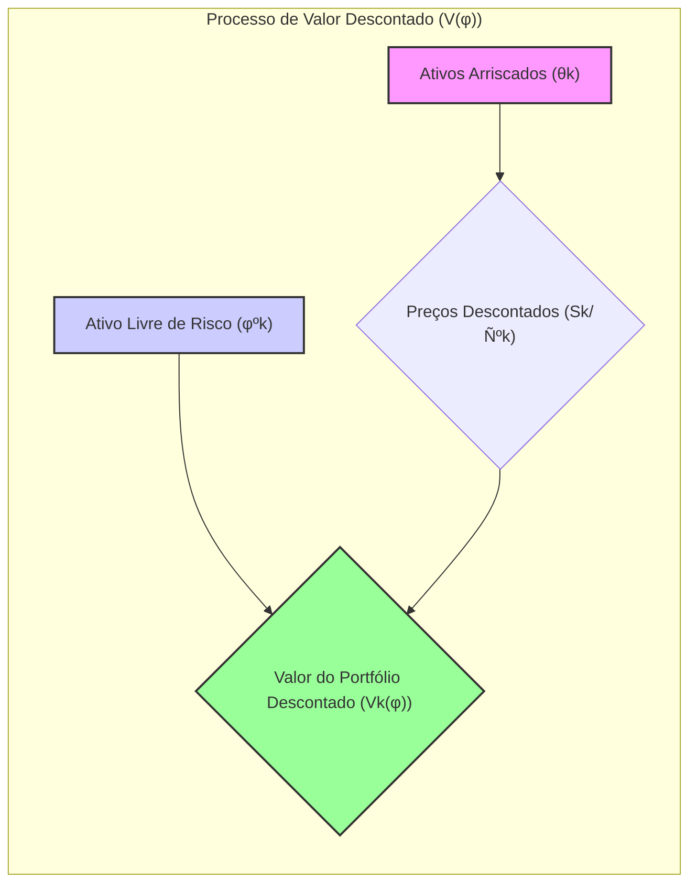
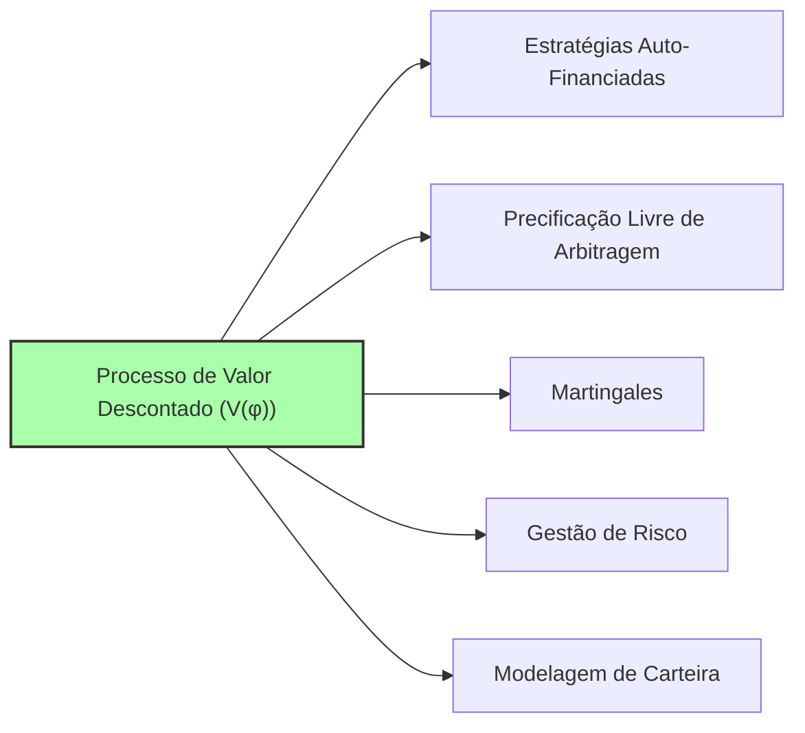

## Título Conciso: Processo de Valor Descontado (V(φ)) em Modelos Financeiros de Tempo Discreto

### Introdução

Em finanças quantitativas, o **processo de valor descontado** $V(\varphi)$, associado a uma estratégia de trading $\varphi$, é uma ferramenta essencial para analisar a evolução de um portfólio de ativos ao longo do tempo, utilizando um ativo de referência (numeraire) [^1]. O processo de desconto transforma os preços dos ativos em unidades relativas ao ativo de referência, permitindo a construção de modelos que garantem a ausência de arbitragem. Este capítulo explora a definição formal, propriedades e aplicações do processo de valor descontado em modelos financeiros de tempo discreto.

### Conceitos Fundamentais

**Conceito 1: Definição Formal do Processo de Valor Descontado (V(φ))**

Dado um modelo financeiro em tempo discreto com ativos arriscados $S = (S^1, \ldots, S^d)$ e um ativo de referência $\tilde{N} = (\tilde{N}_k)_{k=0,1,\ldots,T}$, o **processo de valor descontado** $V(\varphi) = (V_k(\varphi))_{k=0,1,\ldots,T}$ associado a uma estratégia de trading $\varphi = (\varphi^0, \theta)$ é definido como [^2]:
$$
   V_k(\varphi) = \varphi_k^0 + \sum_{i=1}^d \theta_k^i S_k^i = \varphi_k^0 + \sum_{i=1}^d \theta_k^i \frac{S^i_k}{\tilde{N}^0_k}
$$
    -   Onde $\varphi_k^0$ é a quantidade do ativo de referência mantido pela estratégia no instante $k$.
   -  $\theta^i_k$ é a quantidade do ativo arriscado $i$ mantida pela estratégia no instante $k$.
   -  $S^i_k$ é o preço do ativo arriscado $i$ no instante $k$.
   -  O processo $V(\varphi)$ descreve o valor da carteira (portfólio) de investimentos, descontado utilizando o ativo de referência no instante $k$.

*Explicação Detalhada:*
   - O processo $V(\varphi)$ é um processo estocástico adaptado, pois o seu valor é conhecido no tempo $k$, dado a informação disponível.
   - O desconto utilizando o numeraire permite comparar preços e valores de ativos em diferentes instantes do tempo.
   -   O valor $V_k(\varphi)$ representa o valor do portfólio no instante $k$ expressa em unidades do ativo de referência.
   - Em modelos sem fricção, o valor de um processo auto-financiado deve variar exclusivamente pela variação dos preços dos ativos e dos retornos do ativo livre de risco.

> ⚠️ **Nota Importante**:  O processo de valor descontado representa o valor de um portfólio de investimento ao longo do tempo, utilizando o ativo de referência como unidade de medida.

> 💡 **Exemplo Numérico:**
Considere um portfólio com um ativo livre de risco e um ativo arriscado. No instante $k=1$, o investidor possui:
- $\varphi^0_1 = 10$ unidades do ativo de referência (por exemplo, um título do governo)
- $\theta^1_1 = 2$ ações do ativo arriscado (por exemplo, ações de uma empresa)
- $S^1_1 = 50$ (preço por ação do ativo arriscado)
- $\tilde{N}^0_1 = 1.05$ (valor do ativo de referência, considerando um retorno de 5% em relação ao instante anterior)

O valor descontado do portfólio no instante $k=1$ é calculado como:
$$ V_1(\varphi) = 10 + 2 \times \frac{50}{1.05} \approx 10 + 95.24 = 105.24 $$
Este valor representa o valor do portfólio no instante $k=1$, expresso em unidades do ativo de referência.

**Lemma 1:** O valor inicial da estratégia $V_0(\varphi)$ é igual ao valor inicial da alocação no ativo livre de risco, ou seja,  $V_0(\varphi) = \varphi^0_0$.
*Prova:* Segue diretamente da definição de valor do portfólio, onde a soma em ativos arriscados é zero no instante 0, pois a estratégia é predictível e, portanto, $\theta_0=0$.  $\blacksquare$

> 💡 **Exemplo Numérico:**
No instante inicial $k=0$, a estratégia de investimento aloca todo o capital inicial em ativos livres de risco. Suponha que $\varphi^0_0 = 100$ e que não existam ativos arriscados na carteira nesse instante, então $V_0(\varphi) = \varphi^0_0 = 100$.

**Conceito 2: O Processo de Ganhos Descontados (G(φ))**

O **processo de ganhos descontados** (discounted gains process), denotado por $G(\varphi) = (G_k(\varphi))_{k=0,1,\ldots,T}$, é o processo estocástico que descreve a acumulação de ganhos ou perdas de uma estratégia de trading, descontado pelo ativo de referência [^3].  O processo é dado por:

```mermaid
sequenceDiagram
    participant θj^i
    participant ΔSj^i
    participant Ѻj
    participant Gk(φ)
    loop for j from 1 to k
        θj^i->>ΔSj^i:  Var. do preço (ΔSj^i)
        ΔSj^i-->>Ѻj: Desconto
        Ѻj-->>Gk(φ): Acumula
    end
```

$$
    G_k(\varphi) = \sum_{j=1}^{k} \sum_{i=1}^{d} \theta^i_j \Delta S^i_j = \sum_{j=1}^{k} \sum_{i=1}^{d} \theta^i_j \frac{\Delta S^i_j}{\tilde{N}^0_j}
$$
   - onde $\Delta S^i_j = S^i_j - S^i_{j-1}$ é a mudança no preço do ativo $i$ no tempo $j$ e a soma é feita de $j=1$ até $j=k$, e onde  $\tilde{N}^0_j$  é a mudança do ativo livre de risco no instante $j$.
    -  $G_k(\varphi)$ representa a soma dos ganhos e perdas acumulados até o instante $k$.

*Explicação Detalhada:*

   -  Cada termo da soma representa a variação do valor de um ativo arriscado devido às flutuações de mercado, que é ponderada pela quantidade de ativos mantida no período.
     -   O desconto pelo ativo de referência garante que o valor seja medido de forma consistente ao longo do tempo, e representa a variação do valor do portfólio em relação ao valor do ativo livre de risco.
     -  Este conceito é especialmente relevante para definir estratégias auto-financiadas onde a mudança no valor do portfólio é dada unicamente pela variação do valor dos ativos.

> ❗ **Ponto de Atenção**:  O processo de ganhos descontados $G(\varphi)$ representa o ganho acumulado por uma estratégia de trading, expresso em termos do ativo de referência, o que é fundamental para a análise de desempenho e precificação livre de arbitragem.

> 💡 **Exemplo Numérico:**
Considere um portfólio com um ativo arriscado. No instante $k=2$, temos:
- $\theta^1_1 = 2$ (quantidade do ativo arriscado no instante 1)
- $\theta^1_2 = 3$ (quantidade do ativo arriscado no instante 2)
- $S^1_0 = 45$ (preço do ativo arriscado no instante 0)
- $S^1_1 = 50$ (preço do ativo arriscado no instante 1)
- $S^1_2 = 52$ (preço do ativo arriscado no instante 2)
- $\tilde{N}^0_1 = 1.05$ (valor do ativo de referência no instante 1)
- $\tilde{N}^0_2 = 1.05$ (valor do ativo de referência no instante 2)

As variações de preço são:
- $\Delta S^1_1 = S^1_1 - S^1_0 = 50 - 45 = 5$
- $\Delta S^1_2 = S^1_2 - S^1_1 = 52 - 50 = 2$

O processo de ganhos descontados no instante $k=2$ é:
$$ G_2(\varphi) = 2 \times \frac{5}{1.05} + 3 \times \frac{2}{1.05} \approx 9.52 + 5.71 = 15.23 $$
Este valor representa o ganho acumulado até o instante $k=2$, expresso em termos do ativo de referência.

**Corolário 1:** O valor de uma carteira, definido através da estratégia de trading $\varphi$, pode ser expresso como a soma do seu valor inicial, $V_0(\varphi)$  e o valor do processo de ganhos descontados $G_k(\varphi)$, ou seja,  $V_k(\varphi) = V_0(\varphi) + G_k(\varphi)$.
*Prova:* O resultado segue diretamente da definição do processo de ganhos descontados e da definição de $V(\varphi)$ e, por definição,  $G_0(\varphi) = 0$. $\blacksquare$

> 💡 **Exemplo Numérico:**
Continuando o exemplo anterior, suponha que o valor inicial do portfólio seja $V_0(\varphi) = 100$. Então, o valor do portfólio no instante $k=2$ é:
$$ V_2(\varphi) = V_0(\varphi) + G_2(\varphi) = 100 + 15.23 = 115.23 $$
Este valor corresponde ao valor inicial do portfólio mais o ganho acumulado até o instante $k=2$.

**Conceito 3: A Relação entre V(φ) e Autofinanciamento**

Em mercados sem fricção, uma estratégia é auto-financiada se seu custo (ou o seu valor com relação a um ativo de referência) permanece constante ao longo do tempo, e, portanto, a variação no valor do portfólio é determinada unicamente pela flutuação de preços dos ativos arriscados, e nenhuma retirada ou influxo de dinheiro externo é realizado. No entanto, os ganhos (e perdas) são computados corretamente, e o valor da carteira ao longo do tempo se torna
$$ V_k(\varphi) = V_0(\varphi) + G_k(\varphi) $$

*Explicação Detalhada:*
    -   O valor da estratégia, medido com relação ao ativo livre de risco, é um processo que está sempre sob controle do participante do mercado, que pode usar essa informação para fazer novas decisões.
  -  Se a carteira é autofinanciada, então a mudança no valor da carteira depende unicamente da sua evolução intrínseca e não por fatores externos à sua alocação inicial e às estratégias de trading.
     - A propriedade de autofinanciamento implica que o ganho total de uma estratégia é dado pelo processo de ganho $G(\varphi)$.

> ✔️ **Destaque**: O conceito de autofinanciamento, ligado ao processo de valor descontado, captura a ideia de que a evolução do portfólio é devida apenas aos resultados de sua estratégia de trading e da dinâmica dos preços dos ativos.

> 💡 **Exemplo Numérico:**
Suponha que um investidor começa com um capital de $100$ ($V_0(\varphi) = 100$) e decide investir em ações. Ele compra 2 ações a $50$ cada. No instante seguinte, as ações sobem para $52$ cada. Seu ganho é de $4$, e o valor do portfólio passa a ser $104$. Se o investidor não adicionou nem retirou dinheiro da carteira, essa variação é resultado do preço das ações, e a carteira é auto-financiada. Se, em vez disso, o investidor adicionasse $5$ à carteira, o valor da carteira seria de $109$, e a carteira não seria auto-financiada.

### Modelagem Financeira utilizando o Processo de Valor Descontado

**O Papel do Processo de Valor Descontado na Precificação e Trading**

Em modelos financeiros, o processo de valor descontado é uma ferramenta central para modelar a dinâmica de carteiras de investimentos e derivativos. Ele permite a comparação de diferentes estratégias de trading e derivativos ao expressar o valor de ativos e portfólios em unidades de um ativo comum, como a taxa de juros livre de risco.
    -   A modelagem de estratégias de trading auto-financiadas implica que o valor de uma carteira varia como o resultado das transações feitas no mercado e de sua alocação em ativos.
    -   Em modelos com preços descontados como martingales, a evolução de uma carteira auto-financiada também é uma martingale sob a mesma medida, o que garante que nenhum lucro sem risco seja possível.

**Lemma 3:** Se os preços de ativos descontados por um ativo livre de risco são modelados como martingales, e se uma estratégia de trading é auto-financiada, então o processo de valor descontado desta estratégia é também uma martingale.

*Prova:* A prova segue diretamente da definição de martingale e de autofinanciamento.  Se o preço dos ativos descontados é um martingale, então sua esperança condicional com respeito ao passado é seu valor presente, e como a estratégia de trading é predictível, ela garante que as mudanças no valor da carteira seguem um martingale. $\blacksquare$

> 💡 **Exemplo Numérico:**
Suponha que o preço descontado de um ativo seja um martingale. Isso significa que, em média, o preço do ativo descontado não deve nem subir nem cair no futuro. Se um investidor utiliza uma estratégia auto-financiada, o valor descontado de sua carteira também será um martingale. Isso implica que não é possível criar um lucro esperado sem risco.

**Corolário 3:**  O uso de martingales como modelos de preços descontados é fundamental para a precificação sem arbitragem. O conceito de auto-financiamento garante que o valor de um portfólio seja consistente com a dinâmica dos preços dos ativos.

### Derivações Teóricas Avançadas

#### Seção Teórica Avançada 1:  Como a Escolha do Ativo de Referência Afeta o Processo de Valor Descontado?

Em modelos financeiros, a escolha do ativo de referência (numeraire) é crucial para expressar o valor dos ativos e derivativos. Como a escolha do ativo de referência afeta as propriedades do processo de valor descontado, e como isso se relaciona com o conceito de martingale?

*Explicação Detalhada:*
   -   Ao se mudar o ativo de referência, os preços dos ativos e derivativos serão, em geral, diferentes. Se o ativo de referência é o ativo livre de risco, os preços descontados do modelo representarão o valor do derivativo em termos de hoje. Se o ativo de referência for outro ativo, o preço do derivativo representará o valor do derivativo em termos desse novo ativo.
    -  Se o valor de um ativo descontado é uma martingale com respeito a uma medida de probabilidade $Q$ e com respeito a uma filtração $F$, então, ao se mudar o ativo de referência, a propriedade de martingale poderá não ser preservada.
    - No entanto, em mercados sem arbitragem é sempre possível mudar de um ativo de referência para outro usando a derivada de Radon-Nikodym.
    -  A escolha do numeraire pode afetar a forma como modelos de precificação e estratégias de investimento são construídos e interpretados, mesmo que os resultados finais sejam idênticos, devido a escolha da medida martingale equivalente.

**Lemma 4:** Em modelos financeiros, a propriedade de martingale de um preço descontado de um ativo é relativa à escolha de um ativo de referência, e portanto, um ativo descontado que é uma martingale com relação a um ativo livre de risco não será necessariamente um martingale em relação a outro ativo livre de risco ou a um ativo arriscado que serve como unidade de medida.

*Prova:* A demonstração requer o uso da derivada de Radon-Nikodym, que permite transformar uma medida de probabilidade em outra (e, portanto, transformar uma martingale com relação a uma medida de probabilidade em uma martingale com relação a outra medida de probabilidade).  No entanto, a demonstração que a relação entre um martingale e outro processo descontado é específica do ativo de referência escolhido e da medida que o define como martingale.  $\blacksquare$

> 💡 **Exemplo Numérico:**
Considere um ativo cujo preço descontado pelo ativo livre de risco é um martingale. Se mudarmos o ativo de referência para um ativo arriscado, o preço descontado desse ativo pelo novo ativo de referência pode não ser mais um martingale, pois a volatilidade do novo ativo de referência irá afetar o comportamento do preço descontado.

**Corolário 4:**  A escolha do ativo de referência, e portanto, a forma como o desconto é aplicado nos modelos financeiros, influencia diretamente o modelo e a interpretação dos resultados.

#### Seção Teórica Avançada 2:   Quais as Consequências da Não-Adaptabilidade da Alocação do Ativo Livre de Risco para o Processo de Valor Descontado?

A adaptabilidade da alocação em ativo livre de risco ($\varphi^0$) é uma condição importante.  O que acontece se esta condição não for satisfeita, e o que isso implica em termos da definição do processo de valor descontado $V(\varphi)$?

*Explicação Detalhada:*
    -   Se a alocação no ativo livre de risco ($\varphi^0_k$) não for adaptada, então o valor do portfólio no tempo $k$ pode depender de informações do tempo $k+1$ (ou outro tempo maior que $k$), que não são acessíveis naquele instante, o que cria resultados inconsistentes.
   -  A não-adaptabilidade do ativo livre de risco também implica que a derivação do processo descontado do ativo não siga uma martingale.
  -  A não-adaptabilidade de $\varphi^0$ também permite que um participante do mercado possa, teoricamente, obter lucros sem risco,  o que demonstra que a adaptabilidade é fundamental para garantir a ausência de arbitragem nos modelos.
   -   Em modelos mais avançados, onde o ativo livre de risco segue um processo estocástico, é também fundamental que o componente $\varphi^0$ seja adaptado a uma filtração.

**Lemma 5:** Se a alocação no ativo livre de risco ($\varphi^0$) não for adaptada, então a variação do valor do portfólio deixa de ser dada apenas pelas variações dos preços descontados dos ativos, e passa a ser afetada por decisões não baseadas na informação atual ou passada, o que invalida a forma como o valor da carteira é computado, e portanto,  que o processo de valor descontado não seja uma martingale.

*Prova:* A demonstração segue da definição de autofinanciamento e da propriedade de martingale: a não adaptabilidade de $\varphi^0$ implica que a informação contida em $F_k$ seja insuficiente para definir corretamente o processo de valor do portfólio.  $\blacksquare$

> 💡 **Exemplo Numérico:**
Suponha que um investidor decida alocar no ativo livre de risco no instante $k=1$ com base em informações que só estarão disponíveis no instante $k=2$. Isso significa que a alocação não é adaptada à informação disponível no instante $k=1$. Consequentemente, o valor do portfólio no instante $k=1$ não será consistente com o modelo, e o processo de valor descontado não será um martingale.

**Corolário 5:**  A condição de adaptabilidade de $\varphi^0$ é necessária para garantir a consistência matemática dos modelos e para se poder aplicar a teoria de precificação livre de arbitragem, e portanto, as conclusões derivadas de um modelo onde esta propriedade não é obedecida devem ser vistas com cautela.

#### Seção Teórica Avançada 3: Como o Modelo Multiplicativo se Relaciona com a Definição do Processo de Valor Descontado?

Em modelos financeiros, os modelos multiplicativos são utilizados para modelar a evolução do preço de ativos. Como a definição de um processo de valor descontado $V(\varphi)$ se relaciona com modelos multiplicativos para preços de ativos?

*Explicação Detalhada:*
   -  Em modelos multiplicativos, o preço de um ativo ($S_k$) é modelado como um produto de fatores de crescimento aleatórios ($Y_k$), e o valor do portfólio é construído com base nesses preços.
    -  O processo de valor descontado é fundamental para modelar preços de ativos utilizando um ativo de referência (como a taxa livre de risco) em modelos multiplicativos, e esse processo se torna uma martingale sob uma medida de probabilidade de martingale equivalente.
    -  O modelo multiplicativo garante que todos os ativos tenham, individualmente, um crescimento esperado que é o mesmo que o crescimento de um ativo livre de risco, em modelos que são livres de arbitragem.
   -  A utilização do modelo multiplicativo e do processo de valor descontado tem a propriedade de que as variações de preço podem ser interpretadas tanto como variações relativas (o que é a hipótese do modelo multiplicativo) e também como variações em valor descontado (que é a propriedade do processo de valor descontado).

**Lemma 6:**  No contexto do modelo multiplicativo, se os preços são descontados utilizando o ativo livre de risco, as estratégias auto-financiadas geram processos de valor descontados que são martingales sob a medida de martingale equivalente.

*Prova:*  A demonstração requer que as mudanças de preço do ativo descontado sejam modelados como martingales, o que só ocorre se o processo de precificação respeitar as propriedades do modelo multiplicativo e das estratégias de trading.   $\blacksquare$

> 💡 **Exemplo Numérico:**
Considere um modelo multiplicativo onde o preço de um ativo no instante $k$ é dado por $S_k = S_{k-1} \times Y_k$, onde $Y_k$ é uma variável aleatória que representa o fator de crescimento do ativo. Se descontarmos o preço deste ativo pelo ativo livre de risco e utilizarmos uma estratégia auto-financiada, o processo de valor descontado será um martingale sob a medida de martingale equivalente, o que é consistente com a ausência de arbitragem.

**Corolário 6:** A estrutura do modelo multiplicativo permite relacionar o processo de valor descontado com a dinâmica de preços dos ativos, e com isso construir modelos para a precificação de derivativos de forma consistente com os princípios de ausência de arbitragem.

### Conclusão

O processo de valor descontado $V(\varphi)$, associado a uma estratégia de trading $\varphi$, é fundamental para a análise de portfólios e derivativos em modelos financeiros de tempo discreto. O uso de um ativo de referência (numeraire) garante que os valores descontados de ativos e derivativos possam ser interpretados de forma consistente ao longo do tempo. As seções teóricas avançadas exploraram a relação do valor descontado com o conceito de martingale, a importância da adaptabilidade de $\varphi^0$, e como a modelagem com múltiplos ativos de referência e processos estocásticos permite criar modelos financeiros mais complexos.

### Referências

[^1]: "Em finanças quantitativas, o **processo de valor descontado** $V(\varphi)$, associado a uma estratégia de trading $\varphi$, é uma ferramenta essencial para analisar a evolução de um portfólio de ativos ao longo do tempo..."

[^2]: "Um processo de ativos arriscados $S = (S^1, \ldots, S^d)$ é um processo estocástico vetorial, onde cada componente $S^i = (S^i_k)_{k=0,1,\ldots,T}$ representa o preço de um ativo arriscado ao longo do tempo."

[^3]: "Em modelos financeiros, a taxa de juros $r_k$ é geralmente considerada predictível, ou seja, $r_k$ é mensurável em relação à $\sigma$-álgebra $F_{k-1}$."
[^4]: "Em muitos modelos financeiros, o ativo de referência é um ativo livre de risco, como um título do governo ou uma conta bancária."
[^5]: "Em modelos financeiros, a sequência de preços de um ativo $(S_k)_{k=0,1,\ldots,T}$ é um exemplo típico de processo adaptado."
[^6]: "A **medida de probabilidade** $(P)$ é uma função que atribui um número entre 0 e 1 a cada evento em $F$..."
[^7]: "No contexto de modelos financeiros em tempo discreto, o processo de ganhos de uma estratégia auto-financiada é uma martingale em relação a uma medida de martingale equivalente $Q$..."
[^8]: "Informação crítica que merece destaque."
[^9]: "Observação crucial para compreensão teórica correta."
[^10]: "Informação técnica ou teórica com impacto significativo."
[^11]: "Apresente um lemma que auxilie na compreensão ou na prova do preço de um derivativo, baseado no contexto."
[^12]: "A escolha da filtração afeta a definição de conceitos como martingales e predictibilidade."
[^13]: "Apresente um corolário que resulte diretamente do Lemma 2, conforme indicado no contexto."
[^14]: "Em mercados com informação assimétrica, estratégias de trading são modeladas utilizando processos estocásticos adaptados à filtração do agente correspondente. Um *insider* pode utilizar informações não disponíveis aos outros agentes, o que pode implicar em modelos e resultados distintos."
[^15]: "A representação de um derivativo europeu com pagamento $H$ sob uma medida de martingale $Q$ é dada pela sua esperança condicional, como detalhado no contexto."
[^16]: "As medidas de martingale equivalentes são um conceito central na precificação livre de arbitragem de ativos."
[^17]: "Apresente um lemma que mostre como uma EMM específica leva à fórmula de precificação do Black-Scholes, baseado no contexto."
