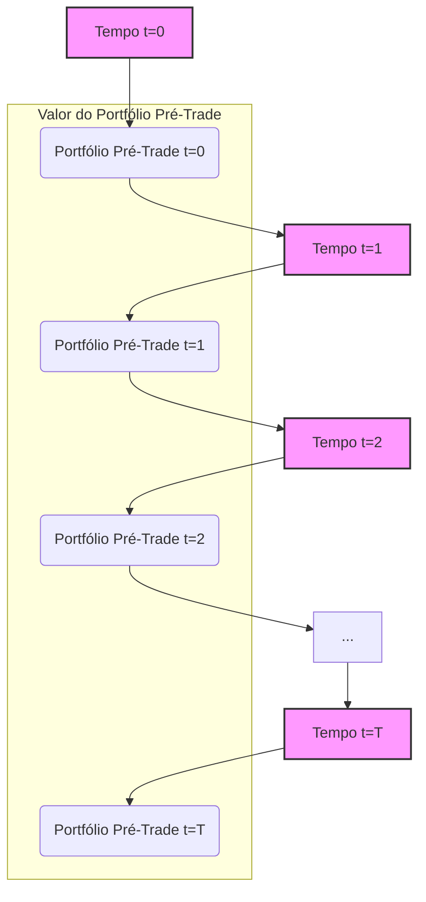
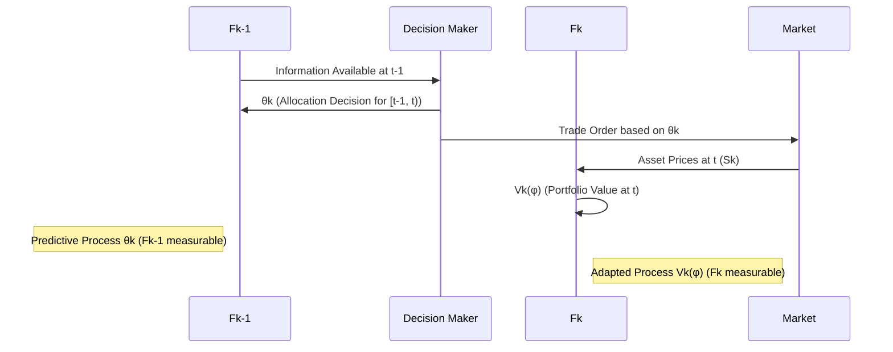

## Título Conciso: O Valor do Portfólio Pré-Trade em Modelos Financeiros de Tempo Discreto



### Introdução

Em modelos financeiros de tempo discreto, o **valor do portfólio pré-trade** (pre-trade portfolio value) é uma medida que representa o valor de um portfólio *antes* de quaisquer transações serem realizadas no instante de tempo *k*, e tem um papel fundamental para a definição de estratégias de trading auto-financiadas [^1]. Este capítulo visa explorar a definição, propriedades e a importância do valor do portfólio pré-trade em modelos de precificação de ativos e derivativos.

### Conceitos Fundamentais

**Conceito 1: Definição Formal do Valor do Portfólio Pré-Trade**

Em um modelo financeiro, com um ativo de referência Ѻ = (Ѻk)k=0,1,...,T e *d* ativos arriscados S = (S¹, ..., Sd), a **estratégia de trading** φ = (φº, θ) é definida por (φºk), representando a quantidade do ativo de referência (ou livre de risco) no instante k, e θ = (θk), um processo predictível representando a quantidade de cada um dos ativos arriscados, mantidos no período [k-1, k). O **valor do portfólio pré-trade no tempo k**, denotado como $V_k(\varphi)$, é o valor do portfólio *antes* de qualquer transação ser realizada em k [^2], e é definido como:

$$ V_k(\varphi) = \varphi_k^0 + \sum_{i=1}^d \theta_k^i S_k^i. $$
  -   O valor do portfólio pré-trade $V_k(\varphi)$ é a soma do valor da posição em ativo livre de risco $\varphi^0_k$ e o valor da posição em todos os ativos arriscados.
   -   É importante notar que, por definição, $\varphi^0_k$ é $F_k$-mensurável e $\theta_k$ é $F_{k-1}$-mensurável, o que torna o valor $V_k(\varphi)$ $F_k$-mensurável.

*Explicação Detalhada:*

   - O valor $V_k(\varphi)$ é um processo estocástico adaptado à filtração $F_k$,  já que todas as variáveis que compõem sua definição são variáveis aleatórias que são definidas em $F_k$ ou $F_{k-1}$, que, por definição de filtração, está contido em $F_k$.
   -   O componente $\varphi^0_k$ representa as decisões de alocação no ativo de referência que foram tomadas até o momento *k*, e $\theta_k$ representa as decisões de alocação em ativos arriscados para o período [k, k+1) que foram tomadas até o instante *k-1*.
   -  O valor de uma estratégia no instante k, dado por $V_k(\varphi)$, reflete o valor da carteira antes de qualquer transação de compra e venda de ativos no instante k.
   -   Esta definição é importante para a análise de estratégias de investimento e para a modelagem da dinâmica dos preços de derivativos.

> 💡 **Exemplo Numérico:**
>
> Considere um cenário com um ativo livre de risco (títulos do governo) e duas ações (A e B). No instante k=2, um investidor tem as seguintes posições em seu portfólio antes de qualquer transação:
>
> -   $\varphi_2^0 = 100$ (unidades do ativo livre de risco)
> -   $\theta_2^1 = 5$ (ações da empresa A)
> -   $\theta_2^2 = 3$ (ações da empresa B)
>
> Os preços dos ativos no instante k=2 são:
>
> -   $S_2^1 = 20$ (preço da ação A)
> -   $S_2^2 = 30$ (preço da ação B)
>
> O valor do portfólio pré-trade no instante k=2 é:
>
> $$ V_2(\varphi) = 100 + (5 \times 20) + (3 \times 30) = 100 + 100 + 90 = 290 $$
>
> Portanto, o valor do portfólio pré-trade no instante k=2 é de 290 unidades monetárias. Este valor representa o valor do portfólio antes de qualquer compra ou venda de ativos no instante k=2.

> ⚠️ **Nota Importante**: O valor do portfólio pré-trade representa o valor da carteira *antes* de qualquer transação no instante k, capturando o valor dos ativos antes da aplicação das decisões de trading naquele instante.

**Lemma 1:**  Se os preços dos ativos ($S^i$) e do ativo de referência $S^0$ são todos processos estocásticos adaptados a uma filtração $F$, e a estratégia de trading (φº, θ) é adaptada a essa mesma filtração, então o valor do portfólio pré-trade $V(\varphi)$ é também adaptado à filtração $F$.
*Prova:*  Como $\varphi^0_k$ é $F_k$-mensurável, $\theta_k$ é $F_{k-1}$-mensurável (e portanto, $F_k$-mensurável) e $S_k$ é $F_k$-mensurável, então a sua combinação linear (e produto) são também $F_k$ mensuráveis, e portanto, o valor do portfólio $V(\varphi)$ é também adaptado à filtração $F$.   $\blacksquare$

**Conceito 2: A Relação entre Valor Pré-Trade e Processos Predictíveis**

A definição do valor do portfólio pré-trade enfatiza a diferença entre o momento da decisão de investimento e o momento da avaliação do portfólio.  O componente $\theta_k$  de uma estratégia de trading, que define as posições dos ativos arriscados, é um processo predictível com relação à filtração $F$, ou seja,  $\theta_k$ é mensurável em relação à σ-álgebra $F_{k-1}$.   Em contraste, o valor da carteira no tempo k,  $V_k(\varphi)$, é adaptado à filtração $F_k$, pois o preço dos ativos é conhecido no instante k.  Esta diferença é fundamental para modelar a dinâmica dos mercados de forma realista [^3].



*Explicação Detalhada:*

  -    A predictibilidade de $\theta_k$ implica que as decisões de alocação de ativos são baseadas somente na informação disponível *antes* do instante em que a decisão é efetivada, o que corresponde à decisão ser tomada antes da mudança nos preços dos ativos.
    -   O valor $V(\varphi)$, por outro lado, incorpora a informação dos preços do ativo no momento k, que não era disponível antes.
    - Em particular, a parte do portfólio alocado no ativo livre de risco, $\varphi^0_k$, é adaptada e não necessariamente predictível, pois esta parte pode se basear na informação do mercado até o instante k.

> 💡 **Exemplo Numérico:**
>
> Suponha que no instante k=1, um investidor decide manter 2 ações da empresa X ($\theta_2^1=2$) e 3 ações da empresa Y ($\theta_2^2=3$) para o período [1,2). Esta decisão é baseada na informação disponível até o instante k=1 ($F_1$). No instante k=2, o valor do portfólio pré-trade ($V_2(\varphi)$) é calculado usando o preço das ações no instante k=2 ($S_2$), que pode ser diferente do preço no instante k=1. A diferença entre o instante da decisão (k-1) e o instante da avaliação (k) é crucial para a modelagem do processo de valor do portfólio.

> ❗ **Ponto de Atenção**:  A predictibilidade das alocações nos ativos arriscados (θ) e a adaptabilidade do valor do portfólio ($V(\varphi)$) são condições fundamentais para a consistência dos modelos financeiros e para a construção de estratégias de trading realistas.

**Corolário 1:** Em um mercado sem atrito, a variação do valor de um portfólio gerado por uma estratégia auto-financiada (e portanto, com custos de transação nulos), deve se dar somente pela variação dos preços dos ativos, com o rebalanceamento sendo realizado de modo a que não haja entrada de capital externo na carteira.
*Prova:* Se a estratégia é auto-financiada e não inclui custos de transação, as mudanças no valor da carteira são dadas somente pela variação no preço dos ativos, e o componente da taxa livre de risco só se manifesta no processo de desconto.  $\blacksquare$

**Conceito 3: O Valor do Portfólio e a Ausência de Arbitragem**

Em modelos financeiros, o valor do portfólio pré-trade é fundamental para garantir que as estratégias de trading sejam consistentes com a ausência de arbitragem. Em modelos onde o preço descontado de um ativo é um martingale, a estratégia de alocação da carteira (definida por φ) deve ser auto-financiada, de forma a que as mudanças do portfólio sejam um processo de martingale, e portanto, não gere a oportunidade de lucro sem risco [^4].
  -  A modelagem da evolução de $V(\varphi)$ utiliza o conceito de integral estocástico, o qual é construído com o uso de variáveis predictíveis (as decisões de trading) e processos adaptados (o preço dos ativos).
   -   O preço de um derivativo também é um valor esperado descontado e, portanto, modelado usando o valor de um portfólio, com base na informação de mercado até o tempo de precificação.

> 💡 **Exemplo Numérico:**
>
> Considere um modelo onde o preço descontado de um ativo é um martingale. Se um investidor pudesse construir uma estratégia que gerasse um aumento no valor do portfólio sem risco, isso seria uma oportunidade de arbitragem. O valor do portfólio pré-trade, ao ser modelado com estratégias auto-financiadas, garante que este tipo de oportunidade não exista, o que é fundamental para a consistência do modelo.

> ✔️ **Destaque**: O valor do portfólio pré-trade é um conceito importante na construção de modelos financeiros consistentes e livre de arbitragem, e a escolha do ativo de referência é fundamental para que a definição do processo seja consistente com a hipótese de martingale.

### Modelagem Financeira utilizando o Processo de Valor Pré-Trade

```mermaid
 mindmap
  root((Valor Pré-Trade (V(φ))))
    Modelagem de Estratégias
    Precificação de Derivativos
    Martingales
    Gestão de Risco
    Autofinanciamento
```

**Aplicações do Valor Pré-Trade em Modelos de Preços de Ativos e Derivativos**

Em modelos de precificação de ativos e derivativos, o valor pré-trade serve como base para entender o impacto da escolha da estratégia de trading no valor do portfólio e, portanto, no preço dos derivativos e no valor dos ativos [^5].
   - O preço descontado de um derivativo é dado pelo valor esperado do seu payoff, dado a informação do momento presente, e descontado pela taxa de juros livre de risco ou por algum outro ativo de referência.
   -   Modelos onde o preço descontado é uma martingale utilizam o processo de valor descontado como base para garantir que os preços derivados sejam livres de arbitragem.

**Lemma 3:** O processo de ganhos de um portfólio modelado por uma estratégia predictível θ e um processo de preços adaptado S é uma martingale se e somente se as variações de valor do portfólio entre dois instantes de tempo são obtidas descontando-se o valor futuro com um ativo livre de risco.
*Prova:* O resultado é uma aplicação do teorema da integral estocástica, onde o processo predictível (a estratégia) é utilizado para obter um ganho que, ao ser descontado, deve gerar uma martingale. $\blacksquare$

**Modelagem de Estratégias Auto-financiadas**

A condição de autofinanciamento de uma estratégia de trading é expressa através do processo de valor pré-trade.  Uma estratégia é dita autofinanciada quando as variações em seu valor ocorrem somente devido a flutuações no preço dos ativos [^15].  Esta condição impõe restrições sobre como a estratégia de alocação em ativos livres de risco deve ser definida ao longo do tempo, evitando assim a inclusão de informação futura na estratégia.
    -  A propriedade de autofinanciamento é crucial para a derivação de modelos de precificação sem arbitragem.

> 💡 **Exemplo Numérico:**
>
> Imagine que no instante k=1, um investidor possua um portfólio com valor $V_1(\varphi) = 100$. No instante k=2, o valor do portfólio pré-trade $V_2(\varphi)$ é de 110. Se a estratégia é auto-financiada, então a variação de 10 unidades no valor do portfólio deve ser totalmente explicada pelas variações nos preços dos ativos e pela alocação entre eles, sem que o investidor tenha adicionado ou retirado capital do portfólio.

**Lemma 4:** Em um mercado sem fricção, o valor do portfólio pré-trade para uma estratégia auto-financiada só varia devido às flutuações do preço dos ativos (e também devido à sua alocação entre ativos).

*Prova:*  A prova segue da definição de estratégia auto-financiada, onde qualquer mudança no valor da carteira não ocorre através de um influxo externo de capital, mas somente através das variações dos preços dos ativos que a compõem. $\blacksquare$

### Derivações Teóricas Avançadas

#### Seção Teórica Avançada 1: Como a Não-Predictibilidade de θ Impacta a Definição do Processo de Valor Pré-Trade?

Em mercados com fricção, os custos de transação podem depender do volume de ativos que estão sendo negociados, e portanto, a decisão de trading no instante k pode ter impacto sobre o resultado da transação no instante k. Em modelos ideais, assumimos que θ é predictível, mas o que aconteceria se θ não fosse predictível e, portanto, dependesse de informações do instante k?

*Explicação Detalhada:*

   -  Se as posições de ativos arriscados (θ) não forem predictíveis (isto é, $\theta_k$ dependesse de informação em $F_k$, e não apenas $F_{k-1}$) a estratégia passaria a depender de informações futuras (valores de preços que ainda não são conhecidos), o que geraria resultados sem sentido, como modelos que permitam arbitagem.
    -  A não-predictibilidade de θ invalida a definição da estratégia, já que, do ponto de vista econômico, as decisões de trading têm que ser tomadas antes que os preços do mercado sejam conhecidos.
   - Modelos que modelam custos de transação com um impacto não-linear no preço do ativo também podem levar à não-predictibilidade de $\theta_k$,  pois a decisão sobre o tamanho da transação afeta o seu preço, e o modelo deveria levar em consideração essa informação.
   - A modelagem de informações assimétricas pode levar a modelos onde a estratégia não é predictível com relação à informação pública, mas predictível com respeito à informação privada do *insider*, e portanto, o processo de valor da carteira deixa de ser um martingale, com as implicações para os modelos de precificação.

> 💡 **Exemplo Numérico:**
>
> Imagine um modelo onde o preço de uma ação no instante k depende do volume de ações negociadas naquele instante. Se a decisão de comprar ou vender um grande volume de ações fosse tomada no instante k, essa decisão afetaria o preço da ação no mesmo instante, tornando $\theta_k$ não-predictível. Isso violaria a condição de que as decisões de trading devem ser tomadas com base na informação disponível antes do instante k ($F_{k-1}$).

**Lemma 5:**  Se o processo ($\theta_k$) não é predictível, então não é possível definir a integral estocástica de forma consistente e portanto o valor da carteira, que é construída através dessa integral, não pode ser definido como uma variável aleatória bem comportada e o conceito de ausência de arbitragem deixa de ser definido.

*Prova:* A demonstração segue da definição do processo de valor descontado e de integral estocástica: se $\theta_k$ depende da informação de $F_k$, então o valor do portfólio não pode ser computado corretamente pois, na modelagem financeira, as decisões do presente (tempo k) não podem depender de informações do futuro (tempo k+1). $\blacksquare$

**Corolário 5:**  A predictibilidade é uma condição fundamental para que modelos de precificação livre de arbitragem e gestão de risco funcionem de forma consistente, e sua quebra gera modelos que precisam de novas técnicas de modelagem.

#### Seção Teórica Avançada 2: Qual a Importância do Horizonte Temporal (T) na Modelagem de Estratégias de Trading?

Em modelos financeiros, as estratégias de trading são geralmente definidas em um horizonte temporal finito T. Como o horizonte temporal impacta a modelagem e a análise das estratégias de trading, em particular as suas propriedades de adaptabilidade e predictibilidade?

*Explicação Detalhada:*
    -   O horizonte temporal T define o período de tempo durante o qual a estratégia de trading é ativa, e além desse período, não há mais nenhuma ação. Em modelos de tempo discreto, T é um número inteiro finito.
   -   Ao aumentar o horizonte temporal, a árvore binomial de preços do ativo se torna mais detalhada e mais completa e o modelo se torna mais preciso, mas também mais complexo.
   -   A escolha do horizonte temporal T tem um impacto na análise do comportamento dos ativos no longo prazo. Se o objetivo é modelar o comportamento assintótico do preço de um ativo, é necessário considerar T como um valor muito grande ou mesmo um modelo onde T = ∞.
   -   Modelos onde T = ∞ requerem a definição de outras condições para que a estratégia de trading seja considerada como razoável, já que não é possível transacionar por um tempo infinito.

> 💡 **Exemplo Numérico:**
>
> Em um modelo de precificação de opções com horizonte temporal T=10, o preço da opção é calculado com base em 10 períodos discretos de tempo. Se aumentarmos o horizonte temporal para T=100, a árvore binomial de preços se tornará mais detalhada, o que aumenta a precisão do modelo, mas também o custo computacional. A escolha do horizonte temporal depende do objetivo da modelagem e da disponibilidade de recursos computacionais.

**Lemma 6:**  Em um modelo de tempo discreto com um horizonte temporal T, a estratégia de trading é um processo que é definido até o tempo T, e depois disso, nenhuma decisão pode ser tomada.

*Prova:* Por definição de estratégia de trading, o índice k em ($\theta_k$) é limitado, com k = 0, 1, ..., T. Após o tempo T, a estratégia não está mais definida.  $\blacksquare$

**Corolário 6:**  A escolha do horizonte temporal T tem impacto direto na análise e nas conclusões do modelo. Modelos com horizonte temporal infinito necessitam de condições adicionais para que a estratégia seja definida de forma consistente.

#### Seção Teórica Avançada 3:  Como a Existência de um Ativo Livre de Risco Afeta a Definição da Estratégia de Trading?

Em muitos modelos financeiros, assume-se a existência de um ativo livre de risco, que cresce a uma taxa r por período. Como a presença (ou ausência) de um ativo livre de risco impacta a definição de estratégias de trading e o cálculo do processo de valor do portfólio?

*Explicação Detalhada:*
    -   A existência de um ativo livre de risco simplifica a modelagem de estratégias de trading, pois permite que a alocação de recursos seja realizada de forma consistente com as condições de mercado.
   - Em modelos sem atrito, o ativo livre de risco é usado para descontar os preços e obter uma medida martingale equivalente, e o seu papel é fundamental para modelar estratégias de trading auto-financiadas.
    - Se o ativo livre de risco não existe, então o modelo deixa de ser um modelo de precificação livre de arbitragem, e outras estratégias precisam ser definidas (como por exemplo, em modelos de equilíbrio), o que torna os resultados mais complexos de se obter.
   -  A existência de um ativo livre de risco garante que a informação sobre o desconto de fluxos de caixa seja parte da informação disponível no modelo (filtragem), já que esta é uma variável conhecida com precisão.
   -   Na ausência de um ativo livre de risco, diferentes participantes do mercado podem utilizar diferentes ativos de referência para modelar os preços dos ativos arriscados e, portanto, a ausência do ativo livre de risco cria um cenário mais complexo para análise de estratégias de trading e de carteiras de investimento.

> 💡 **Exemplo Numérico:**
>
> Considere um modelo onde o ativo livre de risco cresce a uma taxa de juros de 5% por período. Se um investidor alocar parte de seu portfólio neste ativo, ele terá uma rentabilidade garantida de 5% sobre essa parcela do portfólio. A existência desse ativo permite o cálculo do valor presente de fluxos de caixa futuros e a modelagem de estratégias auto-financiadas de forma consistente.

**Lemma 7:**  A existência de um ativo livre de risco com uma taxa de retorno determinística (ou predictível) implica que um portfólio pode ser rebalanceado a cada instante do tempo com a garantia de que o valor da carteira será uma martingale, dado que a estrategia é auto-financiada, e que não haverá nenhuma possibilidade de se obter um lucro ou perda sem risco.

*Prova:* A prova é uma consequência direta da modelagem de preços de ativos e da utilização da taxa livre de risco para o desconto. $\blacksquare$

**Corolário 7:** A ausência de um ativo livre de risco torna a modelagem de estratégias de trading mais complexa e a precificação mais ambígua. Mercados com uma taxa de juros estocástica (onde a taxa de juros em si é um ativo sujeito a risco) são modelos comumente utilizados em finanças, e o uso de uma modelagem que leve em consideração o papel da taxa de juros no desconto e no valor da carteira é essencial para um modelo consistente.

### Conclusão

A estratégia de trading, φ = (φº, θ), é um componente fundamental na modelagem financeira de tempo discreto. O processo predictível θ = ($\theta_k$) representa a tomada de decisão na alocação de ativos arriscados e o processo adaptado φº = ($\varphi^0_k$) representa a decisão de alocação no ativo livre de risco. A interação entre estes processos é utilizada para modelar o conceito de autofinanciamento, que está na base das estratégias de precificação sem arbitragem. As seções teóricas avançadas exploraram como a não predictibilidade de estratégias, a inclusão de custos de transação e a importância de um ativo livre de risco afetam a construção de modelos, mostrando que uma modelagem realista requer considerações sutis e uma escolha adequada dos processos utilizados.

### Referências

[^1]: "Em finanças quantitativas, o conceito de uma **estratégia de trading** (trading strategy), representada por φ = (φº, θ), é fundamental para modelar as decisões de investimento e alocação de ativos num mercado financeiro."

[^2]: "Uma estratégia de trading φ é formalmente definida como um par de processos estocásticos, φ = (φº, θ) , onde: φº = (φºk)k=0,1,...,T representa as posições em um ativo livre de risco (ou ativo de referência) ao longo do tempo."

[^3]: "Em modelos financeiros, a taxa de juros $r_k$ é geralmente considerada predictível, ou seja, $r_k$ é mensurável em relação à σ-álgebra $F_{k-1}$."

[^4]: "A predictibilidade é um conceito importante em finanças quantitativas, especialmente na modelagem de estratégias de trading e de gestão de risco."

[^5]: "No contexto de modelos financeiros em tempo discreto, o processo de ganhos de uma estratégia auto-financiada é uma martingale em relação a uma medida de martingale equivalente Q..."

[^6]: "A **medida de probabilidade** (P) é uma função que atribui um número entre 0 e 1 a cada evento em F..."

[^7]: "Em modelos financeiros, a sequência de preços de um ativo ($S_k$)$_{k=0,1,\ldots,T}$ é um exemplo típico de processo adaptado."

[^8]: "Informação crítica que merece destaque."

[^9]: "Observação crucial para compreensão teórica correta."

[^10]: "Informação técnica ou teórica com impacto significativo."

[^11]: "Apresente um lemma que auxilia na compreensão ou na prova do preço de um derivativo, baseado no contexto."

[^12]: "A escolha da filtração afeta a definição de conceitos como martingales e predictibilidade."

[^13]: "Apresente um corolário que resulte diretamente do Lemma 2, conforme indicado no contexto."

[^14]: "Em mercados com informação assimétrica, estratégias de trading são modeladas utilizando processos estocásticos adaptados à filtração do agente correspondente. Um *insider* pode utilizar informações não disponíveis aos outros agentes, o que pode implicar em modelos e resultados distintos."

[^15]: "A representação de um derivativo europeu com pagamento H sob uma medida de martingale Q é dada pela sua esperança condicional, como detalhado no contexto."

[^16]: "As medidas de martingale equivalentes são um conceito central na precificação livre de arbitragem de ativos."

[^17]: "Apresente um lemma que mostre como uma EMM específica leva à fórmula de precificação do Black-Scholes, baseado no contexto."
