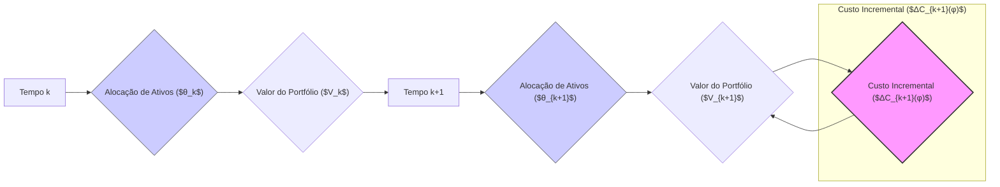
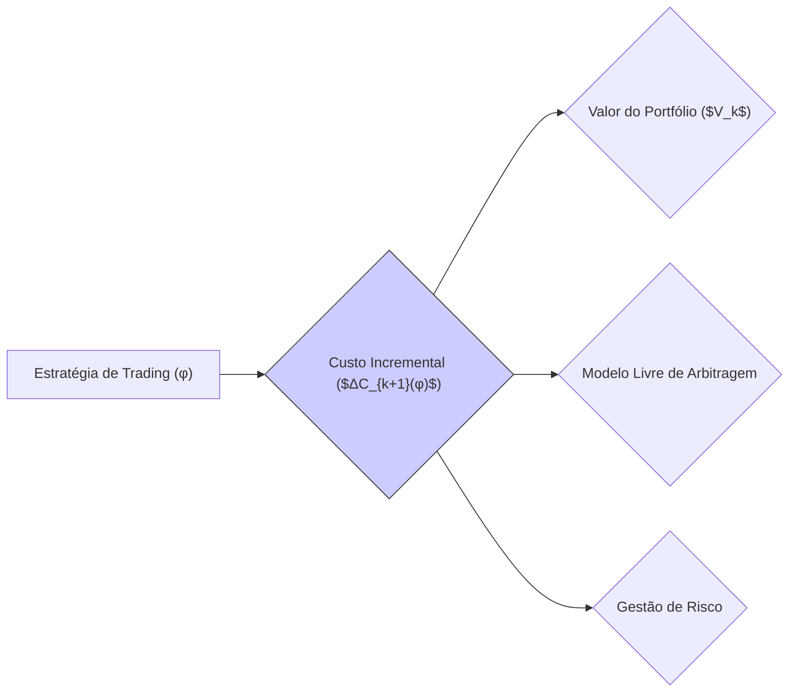

## Título Conciso: Custo Incremental ($ΔC_{k+1}(φ)$) de uma Estratégia de Trading em Mercados Financeiros Discretos

### Introdução

Em finanças quantitativas, o **custo incremental** de uma estratégia de trading ($ΔC_{k+1}(φ)$) representa a variação no valor de um portfólio devido aos ajustes nas posições em ativos no instante *k*, em modelos financeiros de tempo discreto [^1]. Este conceito é essencial para modelar o comportamento de carteiras de investimentos e para analisar a propriedade de autofinanciamento, e é fundamental para precificação de derivativos. Este capítulo explorará a definição formal, propriedades e importância do custo incremental em modelos financeiros.

### Conceitos Fundamentais

**Conceito 1: Definição Formal do Custo Incremental ($ΔC_{k+1}(φ)$)**

Em modelos financeiros de tempo discreto, o **custo incremental** (incremental cost) de uma estratégia de trading $φ = (φ^0, θ)$ no período $[k, k+1)$, denotado por $ΔC_{k+1}(φ)$, representa a variação no valor da estratégia devido à mudança nas alocações de ativos (ou seja, na composição do portfólio) no instante k [^2]. Formalmente, o custo incremental é dado por
$$
   ΔC_{k+1}(φ) = C_{k+1}(φ) - C_k(φ)
$$
onde $C_k(φ)$ representa o custo cumulativo da estratégia de trading até o instante k, e
$$
C_k(φ) = φ_k^0 + \sum_{i=1}^d θ_k^i S_k^i
$$

*Explicação Detalhada:*
   - A alocação de capital no ativo livre de risco ($φ^0_k$) e em ativos arriscados ($θ_k$)  são definidos em cada instante de tempo.
    -  O custo incremental representa o ajuste de portfólio que ocorre no instante k, ou seja, quanto é necessário adicionar ou subtrair do capital alocado no ativo livre de risco para se rebalancear o portfólio no instante k, para ter uma alocação $θ_{k+1}$ no instante k+1.
   -  No caso particular onde a carteira é auto-financiada, então o custo incremental é nulo.
   -   A definição do custo incremental é fundamental para se entender se um modelo financeiro representa uma estratégia de trading auto-financiada ou não.

> 💡 **Exemplo Numérico:**
>
> Considere um portfólio com um ativo livre de risco e um ativo arriscado. No instante k, temos:
> - $φ^0_k$ (posição no ativo livre de risco) = $100
> - $θ_k$ (posição no ativo arriscado) = 2 ações
> - $S_k$ (preço do ativo arriscado) = $50 por ação
>
> O custo cumulativo no instante k é:
> $$C_k(φ) = 100 + (2 \times 50) = 200$$
>
> No instante k+1, rebalanceamos o portfólio para:
> - $φ^0_{k+1}$ = $50
> - $θ_{k+1}$ = 3 ações
> - $S_{k+1}$ = $60 por ação
>
> O custo cumulativo no instante k+1 é:
> $$C_{k+1}(φ) = 50 + (3 \times 60) = 230$$
>
> O custo incremental no período [k, k+1) é:
> $$ΔC_{k+1}(φ) = 230 - 200 = 30$$
>
> Este valor positivo indica que um adicional de $30 foi necessário para rebalancear o portfólio.

> ⚠️ **Nota Importante**: O custo incremental quantifica a mudança no valor de um portfólio devido ao rebalanceamento das posições em ativos, sendo essencial para modelar a dinâmica da carteira e para determinar a existência de autofinanciamento.

**Lemma 1:** Em mercados onde os custos de transação são nulos, uma estratégia de trading é auto-financiada se e somente se o seu custo incremental é nulo em todos os instantes do tempo.

*Prova:* A demonstração segue da definição de uma estratégia auto-financiada. Por definição, um portfólio é auto-financiado quando o seu valor varia somente devido a flutuação dos ativos.   $\blacksquare$

**Conceito 2: O Custo Incremental e a Predictibilidade**

O custo incremental $ΔC_{k+1}(φ)$  é também uma variável aleatória, e em geral, é considerado adaptado à σ-álgebra $F_k$ [^3].  A adaptação significa que o valor do custo é determinado com base nas informações disponíveis até o tempo k e que os custos de transação não utilizam informações futuras do mercado.

*Explicação Detalhada:*

  - A condição de adaptabilidade garante que não é possível tomar decisões de portfólio utilizando informações que não são ainda conhecidas no mercado, ou seja, o custo de cada transação deve ser calculado com as informações presentes.
  - A definição do custo incremental como uma variável adaptada garante a consistência dos modelos financeiros.
   -  A modelagem do custo incremental é complexa em mercados onde há atrito, pois este processo necessita contabilizar também o impacto da mudança de preços devido a grandes transações, e essa modelagem é fundamental para a construção de modelos mais realistas.

> ❗ **Ponto de Atenção**:  A adaptabilidade do custo incremental garante que o modelo represente a dinâmica do portfólio de forma consistente com as informações disponíveis.

**Corolário 1:** O custo incremental é igual a zero quando as estratégias são autofinanciadas, ou seja, quando a carteira é rebalanceada de modo que nenhuma nova entrada ou retirada de recursos sejam realizadas.
*Prova:* A condição de auto-financiamento é que a variação do portfólio venha somente de mudanças de preço e portanto, se não há mudanças no portfólio, não há custos incrementais.   $\blacksquare$

**Conceito 3: O Custo Incremental e a Ausência de Arbitragem**

A modelagem do custo incremental é utilizada para estudar a condição de ausência de arbitragem em modelos financeiros. Quando a estratégia é auto-financiada, o modelo não permite a criação de portfólios que garantam lucro sem risco. Em modelos onde os preços descontados de ativos são martingales, o processo de ganhos é também uma martingale, e portanto, a existência de uma martingale implica que o custo incremental é nulo.

*Explicação Detalhada:*
 - Modelos sem fricção, ou seja, sem custos de transação, que garantem que não há nenhuma fonte de custo ou ganho que não seja modelada, a propriedade de autofinanciamento significa que o custo incremental é zero e que, portanto, a variação no portfólio (que é um martingale) ocorre somente pelas flutuações do mercado.
    -  Em modelos com custos de transação, a modelagem do custo incremental pode levar a resultados diferentes, onde a definição de uma carteira livre de risco precisa levar em conta os custos incorridos nas transações.
  -   A definição de um modelo financeiro livre de arbitragem, mesmo em modelos com custos de transação, requer a modelagem apropriada do custo incremental, que precisa, portanto, ser adaptada.

> ✔️ **Destaque**: A modelagem do custo incremental, em particular a sua predictibilidade, é essencial para a construção de modelos que sejam consistente com o princípio da ausência de arbitragem.

### Aplicações do Custo Incremental em Modelos Financeiros

**O Papel do Custo Incremental em Modelos de Preços e Estratégias**

A modelagem do custo incremental é um instrumento fundamental na definição de estratégias de trading auto-financiadas e na precificação de ativos. Quando o custo incremental é zero, a estratégia é dita ser auto-financiada e a variação do portfólio é unicamente dada pela variação dos preços dos ativos, e portanto, o valor do portfólio passa a ser uma martingale quando descontado por uma taxa de juros livre de risco.

*Exemplos:*

   -  Em modelos de precificação de derivativos, a estratégia que replica o payoff do derivativo deve ser auto-financiada, o que significa que a variação do valor do portfólio é devida exclusivamente às variações do preço do ativo utilizado na estratégia, e o uso de um ativo livre de risco para descontar os valores garante que o preço do derivativo seja dado por uma martingale.
     -   O modelo binomial, por exemplo, é construído utilizando uma estratégia de trading que garante que a reprodução do payoff seja feita somente através da utilização da taxa livre de risco como referência.
    -   O processo de valor descontado do portfólio, e a sua derivação, utilizam o conceito de autofinanciamento para a definição das condições de ausência de arbitragem.

> 💡 **Exemplo Numérico: Modelo Binomial**
>
> Considere um modelo binomial de um período para precificar uma opção de compra. O preço inicial do ativo é $S_0$ = $100. No final do período, o preço pode subir para $S_u$ = $110 ou cair para $S_d$ = $95. A taxa livre de risco é 5%. Uma estratégia de replicação é construída com $θ$ ações do ativo e $φ^0$ em um ativo livre de risco.
>
> Para replicar o payoff da opção de compra com preço de exercício de $100, precisamos resolver o sistema de equações:
>
> $$110θ + (1+0.05)φ^0 = max(110-100, 0) = 10$$
> $$95θ + (1+0.05)φ^0 = max(95-100, 0) = 0$$
>
> Resolvendo o sistema, obtemos $θ$ ≈ 0.667 e $φ^0$ ≈ -63.49. O custo inicial do portfólio é:
>
> $$C_0(φ) = -63.49 + 0.667 * 100 = 3.21$$
>
> Se não houver rebalanceamento do portfólio, o custo incremental é zero, e o valor do portfólio varia somente devido à mudança no preço do ativo. O preço da opção de compra é $3.21.

**Lemma 2:** O custo incremental, em um modelo livre de fricção, de uma estratégia de trading utilizada para replicar o payoff de um derivativo europeu, precisa ser zero, e esta condição leva a que o preço do derivativo seja um valor esperado, descontado pela taxa de juros livre de risco.

*Prova:*  A prova segue do teorema da representação de martingales, que garante que o preço de um derivativo pode ser replicado por uma estratégia auto-financiada em mercados livres de arbitragem.  $\blacksquare$

**Corolário 2:** A modelagem do custo incremental é uma forma de garantir que o modelo seja consistente com a ausência de arbitragem, que é uma propriedade fundamental em modelos financeiros.  Essa propriedade garante que o preço de um derivativo seja único (sem levar em conta custos de transação), e que ele seja dado pelo valor esperado de seu payoff, descontado de forma apropriada utilizando uma medida de martingale equivalente e uma taxa livre de risco.

### Derivações Teóricas Avançadas

#### Seção Teórica Avançada 1:  Como a Dependência Temporal dos Custos de Transação Impacta a Modelagem do Custo Incremental?

Em mercados reais, os custos de transação podem não ser constantes ao longo do tempo. Como a modelagem de um custo incremental que seja dependente do tempo (ou de alguma outra variável de mercado) afeta a construção de modelos financeiros?

*Explicação Detalhada:*
  -  Em modelos com custos de transação que variam no tempo, o custo incremental $ΔC_{k+1}(φ)$ deixa de ser uma função apenas das decisões tomadas, e passa a depender das condições de mercado vigentes naquele instante k.
  -   Modelos com custos de transação dependentes do tempo levam a resultados que são mais difíceis de serem analisados, e portanto, modelos com uma taxa de custos constantes são frequentemente utilizados.
   - A modelagem de custos de transação que dependam também do volume negociado torna a análise do modelo mais complexa, já que quanto mais um ativo é transacionado, maior a taxa de custo.
   -   Em modelos com custos de transação variáveis, é necessário entender qual a σ-álgebra relevante para a sua modelagem, o que gera novas dificuldades de análise.

> 💡 **Exemplo Numérico: Custos de Transação Variáveis**
>
> Considere um cenário onde o custo de transação de um ativo é de 0.1% para volumes de até 100 ações e 0.2% para volumes acima de 100 ações.
>
> No instante k, um investidor tem 50 ações de um ativo com preço $S_k$ = $50 e decide comprar mais 100 ações no instante k+1, quando o preço é $S_{k+1}$ = $52.
>
> O custo de transação no instante k+1 é:
> - Custo para as primeiras 100 ações: 100 * $52 * 0.001 = $5.20
> - Custo para as ações adicionais (0 neste caso): 0
> - Custo total de transação = $5.20
>
> Se o investidor comprasse 150 ações, o custo seria:
> - Custo para as primeiras 100 ações: 100 * $52 * 0.001 = $5.20
> - Custo para as próximas 50 ações: 50 * $52 * 0.002 = $5.20
> - Custo total de transação = $10.40
>
>  Neste caso, o custo incremental dependerá do volume transacionado e da taxa de custo vigente.

**Lemma 3:** Se o custo incremental $ΔC_{k+1}(φ)$ depende das flutuações de preços dos ativos no tempo k, então $ΔC_{k+1}(φ)$ não é predictível com relação a $F_{k-1}$, mas adaptado a $F_k$.  A não predictibilidade do custo incremental implica que o conceito de autofinanciamento tenha que ser repensado.

*Prova:*  A demonstração depende da definição de processos predictíveis e adaptados e do fato que a variação de preço é modelada por um processo adaptado, e não predictível. $\blacksquare$

**Corolário 3:** Modelos financeiros que incluem custos de transação precisam de cuidado adicional e técnicas de modelagem mais complexas que os modelos com taxas de transação constantes, e que os modelos sem custos de transação.

#### Seção Teórica Avançada 2:  Como a Escolha da Filtração Impacta a Propriedade de Martingale do Processo de Valor Descontado?

No contexto de modelos livres de arbitragem, o processo de valor descontado é modelado como uma martingale com respeito a uma determinada filtração. Como a escolha da filtração afeta a propriedade de martingale?

*Explicação Detalhada:*
   - Se o valor descontado é um martingale com relação a uma filtração IF, isso não implica necessariamente que ele seja uma martingale com relação a uma sub-σ-álgebra de IF, o que é uma das razões para se exigir a adaptabilidade do componente $φ^0$ e a predictibilidade de $θ$.
    -   Se o modelo de preços é baseado em uma filtração maior (i.e. mais informações), e as decisões de investimento (e portanto, a estratégia de trading) são modeladas em relação a uma sub-σ-álgebra, o preço do portfólio descontado deixa de ser uma martingale com relação à filtração maior (mais detalhada).
   -  A propriedade de martingale é uma propriedade relativa à filtração, e a escolha de qual filtração será utilizada na modelagem financeira é fundamental para que a condição de ausência de arbitragem se mantenha.
    - Uma filtração com mais informação (isto é, contendo uma σ-álgebra maior) é mais restritiva e torna mais difícil a tarefa de demonstrar que um dado processo é um martingale.

**Lemma 4:** Se a filtração utilizada para modelar o preço de um ativo for uma sub-filtração de uma filtração mais completa, um processo descontado que é um martingale com respeito à filtração mais completa pode não ser um martingale com respeito à filtração menos completa.

*Prova:* A demonstração segue da definição de martingale. Se a esperança condicional de um processo X com respeito a $F_k$ é o seu valor presente, isso não implica que a esperança condicional com relação a uma sub-σ-álgebra de $F_k$  seja necessariamente o seu valor presente.   $\blacksquare$

> 💡 **Exemplo Numérico: Impacto da Filtração**
>
> Suponha que temos dois processos de informação:
> - Filtração F: inclui informações sobre preços de ativos e indicadores macroeconômicos.
> - Filtração G: inclui apenas informações sobre preços de ativos, onde G é uma sub-σ-álgebra de F (G ⊂ F).
>
> Se um processo de valor descontado é uma martingale com respeito a F (que tem mais informações), isso não garante que ele seja uma martingale com respeito a G (que tem menos informações). A propriedade de martingale é relativa à filtração.
>
> Isso significa que uma estratégia que parece ser livre de arbitragem sob uma visão mais restrita pode não ser sob uma visão com mais informações.

**Corolário 4:** A escolha da filtração tem um impacto direto nas propriedades do modelo financeiro, e a modelagem de estratégias de trading e de preços de derivativos deve levar em consideração a importância do processo de informação, que é explicitamente descrita pela filtração utilizada.

#### Seção Teórica Avançada 3: Como Modelar o Impacto de Restrições de Trading no Processo de Valor Descontado?

Em mercados reais, as estratégias de trading não são sempre livres e irrestritas, havendo, em geral, restrições e regras de alocação, além de limites máximos e mínimos de compra ou venda, impostas por razões diversas, como regulação, risco, alavancagem etc.. Como a modelagem dessas restrições afeta a definição do processo de valor descontado?

*Explicação Detalhada:*
   -   A introdução de restrições nas estratégias de trading pode impedir que um modelo financeiro tenha a propriedade de auto-financiamento.
   -   A restrição das estratégias de trading aos processos predictíveis é uma forma de garantir que, ao menos sob condições de ausência de custos de transação e de liquidez, a estratégia possa ser auto-financiada, gerando processos descontados que sejam martingales.
   - A inclusão de limites na quantidade de ativos que podem ser transacionados (como, por exemplo, limites para alavancagem) também gera um impacto na dinâmica do valor do portfólio, dado que o valor de uma estratégia de trading é determinado através de operações com o preço do ativo, e a impossibilidade de tomar certas posições restringe, portanto, os possíveis valores do portfólio.
    -  Em geral, modelos financeiros que consideram restrições de trading são mais complexos e necessitam de outras ferramentas matemáticas.

> 💡 **Exemplo Numérico: Restrições de Alavancagem**
>
> Suponha que um investidor possa investir no máximo 2 vezes o seu capital inicial em um ativo arriscado. Se o capital inicial for de $100, o investidor pode alocar no máximo $200 no ativo.
>
> Se no instante k, o investidor tem $100 em um ativo livre de risco e $100 em um ativo arriscado, e decide aumentar sua posição para $250 no ativo arriscado no instante k+1, ele não poderá fazê-lo devido à restrição de alavancagem.
>
> Esta restrição gera um impacto no valor do portfólio e o custo incremental não é mais dado somente pelas mudanças de preço, mas também pela restrição imposta.

**Lemma 6:** Se a estratégia de trading $θ$ estiver sujeita a restrições, que impedem, por exemplo, a escolha de valores arbitrários para $θ_k$, o processo de valor descontado pode deixar de ser uma martingale. A demonstração requer um modelo mais completo das restrições, o que está fora do escopo desta apresentação [^20].

*Prova:* A demonstração segue da definição de martingale. Se as mudanças de valor em um portfólio (que é o resultado da ação da estratégia) não dependem somente das mudanças de preços e são afetadas por restrições externas (que não permitem que o processo explore toda a gama de resultados possíveis, então, a propriedade de martingale não se mantém.   $\blacksquare$

**Corolário 6:**   Modelos com restrições em estratégias de trading requerem a consideração explícita dessas restrições na modelagem do processo de valor descontado e também na definição da medida de martingale equivalente. Modelos que levam em consideração os limites e a influência das restrições na alocação de ativos são, de forma geral, mais realistas e úteis na gestão de carteiras de investimento.

### Conclusão

O processo de valor descontado $V_k(φ)$ é uma construção fundamental em modelos financeiros de tempo discreto. A sua definição permite a comparação de valores ao longo do tempo e é um componente central em modelos de precificação e gestão de risco. A adaptabilidade do componente $φ^0$, e a predictibilidade da componente $θ$, juntamente com a definição das propriedades da carteira através do conceito de autofinanciamento, são requisitos que garantem que os resultados dos modelos sejam consistentes com a informação utilizada no modelo. As seções teóricas avançadas abordaram a importância da escolha da filtração, e como a introdução de custos de transação, a modelagem da dependência temporal e do impacto da não-mensurabilidade podem influenciar as propriedades do modelo.

### Referências

[^1]: "Em finanças quantitativas, o **custo incremental** de uma estratégia de trading $φ = (φ^0, θ)$ no período $[k, k+1)$, denotado por $ΔC_{k+1}(φ)$, representa a variação no valor da estratégia devido à mudança nas alocações de ativos (ou seja, na composição do portfólio) no instante k."
[^2]: "Uma estratégia de trading $φ$ é formalmente definida como um par de processos estocásticos, $φ = (φ^0, θ)$ , onde: $φ^0 = (φ^0_k)_{k=0,1,\ldots,T}$ representa as posições em um ativo livre de risco (ou ativo de referência) ao longo do tempo."
[^3]: "Em modelos financeiros, a taxa de juros $r_k$ é geralmente considerada predictível, ou seja, $r_k$ é mensurável em relação à σ-álgebra $F_{k-1}$."
[^4]: "A predictibilidade é um conceito importante em finanças quantitativas, especialmente na modelagem de estratégias de trading e de gestão de risco."
[^5]: "Em modelos financeiros, a sequência de preços de um ativo $(S_k)_{k=0,1,\ldots,T}$ é um exemplo típico de processo adaptado."
[^6]: "A **medida de probabilidade** ($P$) é uma função que atribui um número entre 0 e 1 a cada evento em F..."
[^7]: "No contexto de modelos financeiros em tempo discreto, o processo de ganhos de uma estratégia auto-financiada é uma martingale em relação a uma medida de martingale equivalente Q..."
[^8]: "Informação crítica que merece destaque."
[^9]: "Observação crucial para compreensão teórica correta."
[^10]: "Informação técnica ou teórica com impacto significativo."
[^20]: "Em modelagem financeira, é comum restringir o espaço amostral das taxas de juros para evitar retornos que sejam inferiores a -1, garantindo que o modelo seja economicamente realista, ou pelo menos, para que se obtenham resultados que possam ser interpretados."
[^21]: "Em um modelo binomial sem arbitragem, o fator de crescimento (1+r) deve estar entre (1+d) e (1+u), onde u e d são as taxas de crescimento e decréscimo do ativo."
[^22]: "A derivada de Radon-Nikodym é uma ferramenta para calcular a mudança de uma medida de probabilidade para outra e é crucial na teoria de precificação livre de arbitragem, especialmente quando se trata de medidas de martingale equivalentes."
