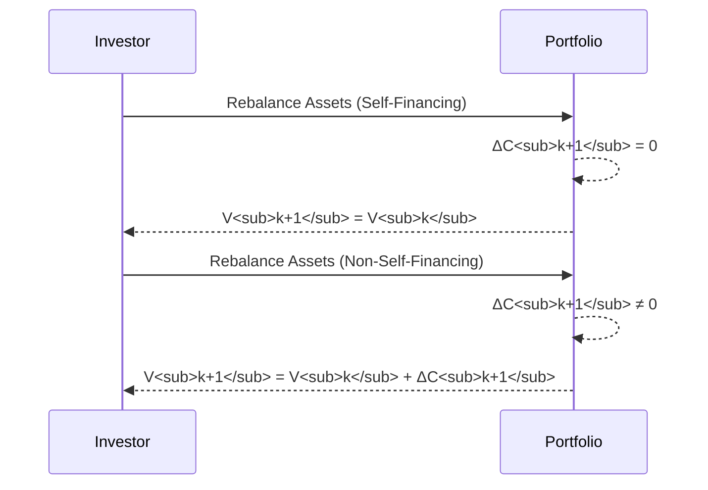
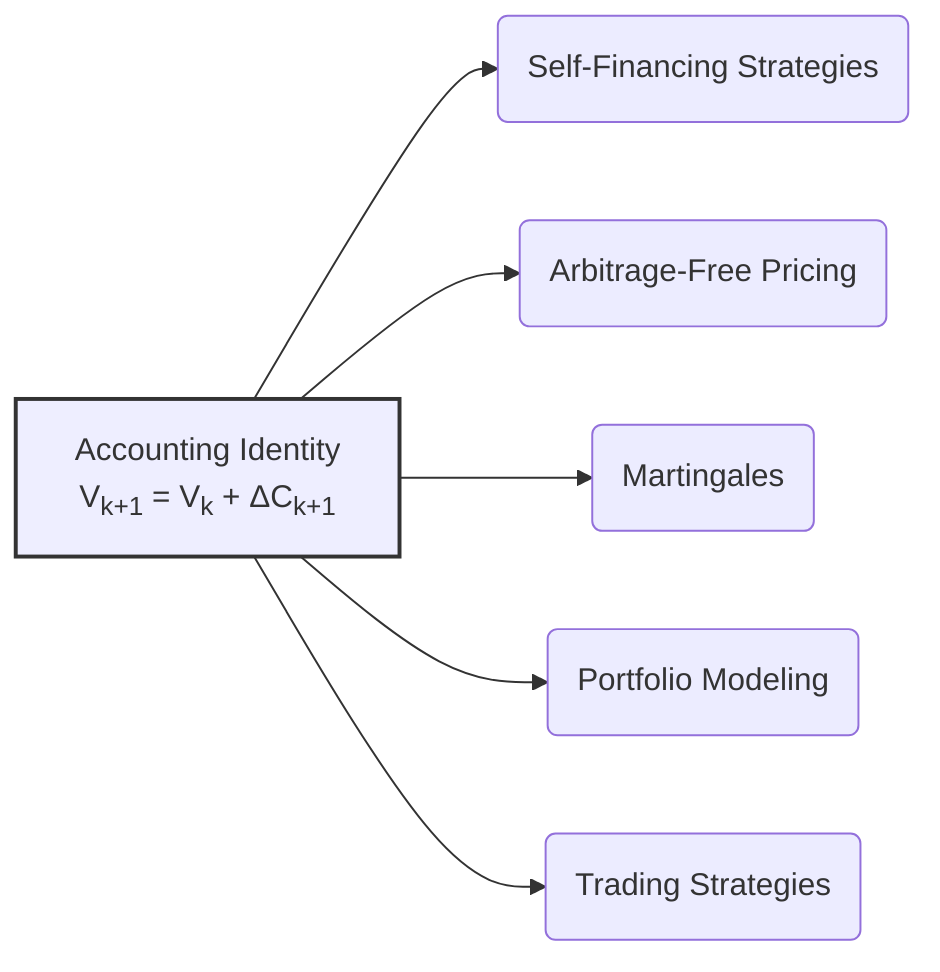

## Título Conciso: Identidade Contábil em Modelos Financeiros de Tempo Discreto

```mermaid
flowchart TD
    A["Portfolio Value at k (V<sub>k</sub>)"] -->|Incremental Cost (ΔC<sub>k+1</sub>)| B["Portfolio Value at k+1 (V<sub>k+1</sub>)"]
    style A fill:#f9f,stroke:#333,stroke-width:2px
    style B fill:#ccf,stroke:#333,stroke-width:2px
    B --> C("Accounting Identity: V<sub>k+1</sub> = V<sub>k</sub> + ΔC<sub>k+1</sub>");
    style C fill:#efe,stroke:#333,stroke-width:2px

```

### Introdução

Em modelos financeiros de tempo discreto, a **identidade contábil** (book-keeping identity) estabelece uma relação entre o valor de um portfólio em um período anterior com o valor no período seguinte [^1]. Esta relação é crucial para modelar a evolução de um portfólio e para construir estratégias de trading auto-financiadas. Este capítulo explorará a definição, importância e implicações da identidade contábil em modelos financeiros.

### Conceitos Fundamentais

**Conceito 1: Definição Formal da Identidade Contábil**

A identidade contábil expressa que o valor de um portfólio (ou carteira de investimento) no tempo k+1, $V(\varphi)_{k+1}$, é igual ao valor do portfólio no tempo k, $V(\varphi)_k$, mais o *custo incremental* $\Delta C_{k+1}(\varphi)$ da estratégia de trading $\varphi$ no período [k, k+1), ou seja [^2]:

$$ V_{k+1}(\varphi) = V_k(\varphi) + \Delta C_{k+1}(\varphi), \text{ para } k = 0, 1, \ldots, T-1$$

*Explicação Detalhada:*

  -   A identidade contábil representa a lei básica da evolução do valor de uma carteira, de modo que o valor futuro é determinado pelo valor presente somado com os custos (positivos ou negativos) da transação.
  -   O custo incremental $\Delta C_{k+1}(\varphi)$ captura a mudança no valor do portfólio devido ao rebalanceamento da carteira (a transação realizada no instante k) e ao pagamento de qualquer custo associado a essa transação.
  -  A identidade é uma representação simples de um balanço contábil, que garante a consistência do modelo.
   -  O conceito de autofinanciamento é intimamente ligado à identidade contábil e significa que o custo incremental é sempre zero, e, portanto, o valor da carteira no instante futuro depende somente da flutuação dos preços dos ativos arriscados.

> 💡 **Exemplo Numérico: Cálculo do Valor do Portfólio**
>
> Considere um portfólio com um valor inicial $V_0 = 100$. No tempo $k=0$, o gestor decide comprar ações e o custo dessa transação é $\Delta C_1 = -5$ (o sinal negativo indica uma saída de caixa para compra). O valor do portfólio no tempo $k=1$ será:
>
> $$V_1 = V_0 + \Delta C_1 = 100 - 5 = 95$$
>
> Agora, suponha que no tempo $k=1$, o gestor vende parte das ações e obtém um ganho de $\Delta C_2 = 10$. O valor do portfólio no tempo $k=2$ será:
>
> $$V_2 = V_1 + \Delta C_2 = 95 + 10 = 105$$
>
> Este exemplo ilustra como o valor do portfólio evolui em cada período, de acordo com a identidade contábil.

> ⚠️ **Nota Importante**: A identidade contábil é uma relação fundamental que garante que os modelos financeiros preservem a consistência do cálculo do valor do portfólio, incluindo a entrada e a saída de recursos através de transações.

**Lemma 1:** O valor inicial de um portfólio $V_0(\varphi)$ define o valor inicial da carteira no tempo t=0 e é igual ao valor inicial da sua posição no ativo livre de risco, ou seja,  $V_0(\varphi) = \varphi_0^0$, onde $\varphi_0^0$ é a quantidade de ativo livre de risco no instante inicial.

*Prova:* No instante inicial, nenhuma transação foi feita, e portanto, o valor da carteira é dado unicamente pelo valor do ativo livre de risco.  $\blacksquare$

> 💡 **Exemplo Numérico: Valor Inicial do Portfólio**
>
> Suponha que um investidor inicie com $1000$ em um ativo livre de risco (por exemplo, um título do governo). Neste caso, o valor inicial do portfólio é $V_0 = 1000$, e a quantidade inicial do ativo livre de risco é $\phi_0^0 = 1000$. Portanto, $V_0 = \phi_0^0 = 1000$. Este exemplo mostra como o valor inicial do portfólio é igual à posição inicial no ativo livre de risco, como afirmado no Lemma 1.

**Conceito 2: O Custo Incremental e as Estratégias de Trading**

O custo incremental $\Delta C_{k+1}(\varphi)$ depende da forma como a estratégia de trading é implementada. Em particular, se uma estratégia de trading é auto-financiada, então o custo incremental é nulo.  No entanto, em modelos com custos de transação, a estratégia não é auto-financiada e o custo incremental representa a diferença entre o preço da compra e o preço da venda e, portanto, é um valor diferente de zero.
   - O custo incremental $\Delta C_{k+1}(\varphi)$ é, por construção, um processo adaptado à filtração $I_F$, o que significa que a sua informação é dada com base nas informações disponíveis no instante k.
  -  Em geral, o custo incremental depende dos preços dos ativos que serão usados na próxima alocação de ativos, o que torna a sua modelagem fundamental para a modelagem de mercados com atrito ou com informação assimétrica.

> 💡 **Exemplo Numérico: Custo Incremental em Estratégias de Trading**
>
> Considere uma estratégia de trading que envolve a compra e venda de ações.
>
> *   **Cenário 1: Estratégia Auto-financiada (Sem Custos de Transação)**
>     *   Se a estratégia é auto-financiada e não há custos de transação, o custo incremental é sempre zero. Isso significa que qualquer compra de um ativo é financiada pela venda de outro ativo, sem a necessidade de adicionar ou retirar dinheiro do portfólio. Assim, $\Delta C_{k+1} = 0$ para todo k.
>
> *   **Cenário 2: Estratégia com Custos de Transação**
>     *   Suponha que, ao comprar ações, o investidor pague uma taxa de corretagem de 0.5% sobre o valor da transação. Se no tempo $k=1$, o investidor compra ações no valor de $100$, o custo de transação será $0.50$. Neste caso, $\Delta C_2 = -0.50$ (o sinal negativo representa uma saída de caixa).
>     *   Se no tempo $k=2$, o investidor vende ações no valor de $150$ e paga uma taxa de corretagem de 0.5%, o custo da transação será $0.75$. Neste caso, $\Delta C_3 = -0.75$ (o sinal negativo representa uma saída de caixa).
>
> Este exemplo mostra como o custo incremental pode variar dependendo da presença ou ausência de custos de transação.

> ❗ **Ponto de Atenção**: O custo incremental reflete a forma como a estratégia de trading é modelada e está relacionado ao conceito de autofinanciamento e ao impacto de transações na evolução do valor de um portfólio.

**Corolário 1:**  Em modelos com atrito, onde a taxa de transação é uma função do volume da transação, o valor incremental da carteira deixa de ser uma variável aleatória simples e passa a depender também das decisões de trading, e portanto, ela deve ser também modelada como uma variável adaptada.

*Prova:* O resultado segue da definição de custo incremental, que depende dos valores de $\theta$ e dos preços dos ativos, que podem ser processos estocásticos dependentes da quantidade de transações em mercados com atrito.  $\blacksquare$

> 💡 **Exemplo Numérico: Custo Incremental com Atrito**
>
> Suponha que a taxa de transação aumente com o volume da transação. Por exemplo, se a taxa de corretagem é 0.1% para transações abaixo de $1000$ e 0.5% para transações acima de $1000$. Se um investidor decide comprar $500$ em ações, o custo de transação será $0.50$. Se ele decide comprar $1500$, o custo de transação será $7.50$. Neste caso, o custo incremental ($\Delta C_{k+1}$) não é uma variável aleatória simples, pois depende da decisão de trading (o volume da transação) no instante k.

**Conceito 3: A Relação entre a Identidade Contábil e a Autofinanciamento**

A identidade contábil é um requisito básico para a construção de modelos financeiros consistentes.  Em modelos sem fricção, estratégias auto-financiadas fazem com que o custo incremental seja nulo em todos os instantes, simplificando a análise e tornando possível a aplicação do lema de Itô ou outros resultados do cálculo estocástico [^4].
     -  Em modelos onde o custo incremental é diferente de zero, o valor do portfólio passa a depender também do valor do custo da operação.
     -   O conceito de autofinanciamento impõe uma condição sobre como a estratégia de alocação do portfólio se comporta ao longo do tempo.



> 💡 **Exemplo Numérico: Autofinanciamento e Identidade Contábil**
>
> Considere um portfólio que consiste em um ativo livre de risco e um ativo arriscado.
>
> *   **Estratégia Auto-financiada:** Se o investidor decide aumentar a sua alocação no ativo arriscado, ele deve reduzir a sua alocação no ativo livre de risco na mesma proporção (ou seja, o custo da compra do ativo arriscado é igual ao valor da venda do ativo livre de risco). Neste caso, o custo incremental é sempre zero, e a identidade contábil se reduz a $V_{k+1} = V_k$.
>
> *   **Estratégia Não Auto-financiada:** Se o investidor decide aumentar a sua alocação no ativo arriscado e usar recursos adicionais para isso, o custo incremental será negativo (saída de caixa) e a identidade contábil será $V_{k+1} = V_k + \Delta C_{k+1}$, onde $\Delta C_{k+1}$ é diferente de zero.

> ✔️ **Destaque**:  A identidade contábil é a base para a modelagem de estratégias auto-financiadas e a sua relação com o conceito de martingale, e com a lei do preço único em mercados sem arbitragem.

### O Papel da Identidade Contábil em Modelos Financeiros



**A Identidade Contábil e a Modelagem de Carteiras**

Em modelos de carteiras de investimento e gestão de riscos, a identidade contábil permite o estudo da evolução do valor de um portfólio ao longo do tempo, permitindo construir modelos de simulação que projetam o comportamento da carteira em diferentes cenários de mercado [^5].
    -   A identidade contábil é utilizada para analisar os ganhos e perdas de uma carteira, a evolução do capital inicial, e a evolução dos custos e taxas de transação.
    -  Em modelos que utilizam medidas de martingale equivalente, a propriedade de autofinanciamento impõe uma restrição no modelo, de modo que o valor de uma estratégia auto-financiada seja um martingale com respeito a essa medida.

**Lemma 2:**  Se uma estratégia é auto-financiada e se os preços descontados de um ativo são martingales, então, o processo de valor descontado da carteira, construído através da identidade contábil e da estrategia, é também uma martingale. [^6]
*Prova:* O resultado é uma consequência da definição de martingale e de auto-financiamento.  Se uma estratégia é auto-financiada, então sua variação é dada somente pela variação dos ativos, e se eles são martingales, então o valor do portfólio também se torna uma martingale.  $\blacksquare$

> 💡 **Exemplo Numérico: Martingale e Estratégia Auto-financiada**
>
> Suponha que o preço descontado de um ativo arriscado seja um martingale sob a medida de probabilidade $Q$. Se um investidor segue uma estratégia auto-financiada, o valor descontado do seu portfólio também será um martingale. Isso significa que o valor esperado do portfólio no futuro, dado o seu valor presente, é igual ao valor presente, quando calculado sob a medida $Q$. Esta propriedade é fundamental para a precificação de ativos e derivativos em mercados sem arbitragem.

**A Identidade Contábil na Precificação de Derivativos**

Em modelos de precificação de derivativos, a identidade contábil é fundamental para verificar se uma estratégia é auto-financiada, e portanto, para garantir a validade dos modelos que utilizam réplicas da opção a ser precificada [^7].  A ausência de fricção nos modelos financeiros, por sua vez, implica que o portfólio utilizado para replicar um derivativo seja, por definição, auto-financiado.
  -  O processo de valor descontado em um modelo livre de arbitragem precisa seguir uma martingale, e a propriedade de autofinanciamento, modelada através da identidade contábil, garante esta condição para todos os instantes de tempo.

**Lemma 3:** Para obter preços consistentes de derivativos, é fundamental que o portfólio utilizado para replicá-lo seja auto-financiado e, portanto, que o custo incremental em cada instante seja igual a zero.

*Prova:* A demonstração é feita pela construção de uma estratégia auto-financiada, que utiliza a identidade contábil para derivar a propriedade de martingale.  A propriedade de martingale garante a consistência da precificação livre de arbitragem.  $\blacksquare$

> 💡 **Exemplo Numérico: Precificação de Derivativos e Autofinanciamento**
>
> Suponha que um derivativo (por exemplo, uma opção) seja replicado por um portfólio composto por ações e um ativo livre de risco. Para que o preço do derivativo seja consistente com o preço do portfólio replicante (ou seja, para evitar oportunidades de arbitragem), a estratégia de trading usada para construir o portfólio replicante deve ser auto-financiada. Isso significa que qualquer alteração na alocação dos ativos no portfólio deve ser feita sem adicionar ou retirar recursos externos, ou seja, o custo incremental deve ser sempre zero.

### Derivações Teóricas Avançadas

#### Seção Teórica Avançada 1: Como a Dependência Temporal no Custo Incremental Impacta os Resultados do Modelo?

Em modelos com custos de transação, o custo incremental ($\Delta C_{k+1}(\varphi)$) pode não ser independente do passado, e portanto, é preciso levar em conta como essa dependência temporal afeta os resultados do modelo, em particular se a propriedade de autofinanciamento continua válida.

*Explicação Detalhada:*
   -  Em mercados reais, os custos de transação podem depender de fatores como a volatilidade do mercado, a liquidez dos ativos e o volume das transações, e portanto, o custo incremental passa a ter um componente estocástico e que depende de valores anteriores (ou, mais corretamente, do valor de um processo estocástico que captura o comportamento dos mercados em instantes anteriores).
   -  Se o custo de transação não é determinístico, ele passa a ser uma variável aleatória que influencia o valor da carteira, e que necessita de ser descontada usando um ativo de referência.
  - Em particular, a depender do mecanismo que gera os custos, a propriedade de martingale pode ser perdida, ou o modelo pode depender de uma complexa estrutura autoregressiva para o custo incremental, o que necessita de métodos de análise mais complexos.

**Lemma 4:**  Se os custos de transação têm uma componente aleatória dependente do tempo ou do volume de transação, então a identidade contábil pode não garantir que a estratégia seja auto-financiada, e o processo de valor do portfólio descontado pode deixar de ser uma martingale.

*Prova:*   A prova consiste em mostrar um caso particular onde o custo incremental não é zero e depende de outros valores no modelo. A condição de autofinanciamento requer que a identidade contábil, que está baseada no zero do custo incremental, não seja satisfeita, o que implica que o valor do portfólio descontado não seja uma martingale. $\blacksquare$

> 💡 **Exemplo Numérico: Dependência Temporal do Custo Incremental**
>
> Suponha que o custo de transação no tempo $k+1$ dependa da volatilidade do mercado no tempo $k$. Se a volatilidade no tempo $k$ foi alta, o custo de transação no tempo $k+1$ será maior e vice-versa. Neste caso, o custo incremental $\Delta C_{k+1}$ não é independente do passado, e o modelo passa a ter uma dependência temporal, o que pode invalidar a propriedade de martingale do valor descontado do portfólio.

**Corolário 4:**  A modelagem da dependência temporal no custo incremental requer técnicas mais sofisticadas para a precificação de ativos e derivativos, e as estratégias de trading passam a ter um valor diferente do que o que seria obtido em modelos sem fricção.

#### Seção Teórica Avançada 2:  Como Modelar o Impacto da Informação Assimétrica no Custo Incremental?

Em modelos financeiros com informação assimétrica, diferentes participantes do mercado podem ter acesso a informações distintas, inclusive sobre os custos de transação. Como a assimetria de informação afeta a modelagem do custo incremental e a interpretação da condição de autofinanciamento?

*Explicação Detalhada:*
   -   Em modelos com informação assimétrica, um *insider* pode ter conhecimento de custos de transação que não estão disponíveis para os demais participantes do mercado e, portanto,  o custo incremental pode ser modelado com respeito a uma filtração distinta daquela da informação pública.
    -  Modelos de informação assimétrica podem levar a cenários onde uma estratégia auto-financiada, sob uma medida de martingale equivalente definida em relação à filtração do mercado, não é mais auto-financiada com relação a uma filtração mais detalhada, obtida através de informações privilegiadas de um participante do mercado.
   -  Modelos de mercados com informação assimétrica são mais complexos e geralmente não levam à definição de um único preço para ativos e derivativos, e requerem a especificação de hipóteses adicionais para poderem ser analisados.

**Lemma 5:**  Se um agente tem acesso a informações sobre os custos de transação que não são disponíveis a todos os participantes do mercado, o custo incremental do modelo passa a ser uma variável que é dependente da filtração do *insider*, e portanto, a propriedade de martingale não é satisfeita em um modelo baseado na informação pública, que é modelada como uma filtração com menos informação.

*Prova:*  A demonstração requer a definição de filtrações distintas para diferentes participantes do mercado e também uma especificação precisa das propriedades das variáveis aleatórias que formam os custos.   $\blacksquare$

> 💡 **Exemplo Numérico: Informação Assimétrica e Custo Incremental**
>
> Suponha que um *insider* tenha informações sobre uma mudança nas taxas de corretagem antes que isso seja divulgado ao mercado. Se o *insider* decide comprar ações antes da mudança na taxa, ele pagará um custo de transação menor do que os outros participantes do mercado. Neste caso, o custo incremental para o *insider* será diferente do custo incremental para os outros participantes, e a propriedade de martingale pode não ser válida para a informação pública.

**Corolário 5:**  A modelagem da informação assimétrica em mercados financeiros exige a consideração de filtrações distintas e a definição de estratégias que são adaptadas a cada filtro para cada grupo de participantes do mercado, o que tem um efeito sobre o custo incremental e as propriedades dos modelos financeiros.

#### Seção Teórica Avançada 3: Qual a Importância do Ativo de Referência na Definição do Custo Incremental?

O processo de valor descontado utiliza um ativo de referência para a construção dos modelos.  Como a escolha do ativo de referência afeta o conceito de custo incremental e as condições de autofinanciamento?

*Explicação Detalhada:*
    - O custo incremental depende diretamente do valor dos ativos, que são expressos com relação a um ativo de referência.
   -  Em modelos onde o ativo de referência é a taxa de juros livre de risco, o valor de um portfólio descontado por esse ativo se torna um martingale sob a medida de martingale equivalente.
    -  Ao se utilizar outro ativo de referência (que não seja livre de risco), a estratégia de trading passa a ter um valor diferente, que se relaciona com o ativo de referência escolhido, e pode gerar oportunidades de ganhos sem risco, mesmo quando o modelo, com respeito a uma dada unidade de referência (como o ativo livre de risco), é sem arbitragem.
   -   A utilização do ativo livre de risco como ativo de referência é uma simplificação que permite a criação de modelos de precificação que não dependem da unidade de medida utilizada, e portanto, a escolha deste ativo é uma simplificação útil para modelos didáticos, mas também pode ser vista como uma restrição no estudo do impacto das decisões de trading em modelos mais sofisticados.

**Lemma 6:**  O custo incremental é sempre relativo ao ativo de referência. Ao se mudar o ativo de referência, o custo incremental também se transforma, embora a estratégia de trading possa permanecer a mesma. No entanto, se o custo incremental era nulo para um ativo de referência, então ele deixa de ser nulo para outro ativo de referência, a menos que as taxas de juros ou os preços dos ativos se relacionem de forma específica através da derivada de Radon-Nikodym, que é a base da mudança de medida para a modelagem sem arbitragem. [^22]

*Prova:* A demonstração é feita através da mudança do ativo de referência na definição do custo incremental.  A nova definição de custo incremental passa a utilizar a razão de um ativo em relação ao novo ativo de referência, o que gera um custo incremental diferente, a menos que uma condição específica para o ativo utilizado como referência seja satisfeita.  $\blacksquare$

> 💡 **Exemplo Numérico: Ativo de Referência e Custo Incremental**
>
> Suponha que um investidor possua um portfólio com ações e um ativo livre de risco. Se o ativo de referência for o ativo livre de risco, o custo incremental será o custo da compra ou venda das ações, medido em relação ao ativo livre de risco. Se o ativo de referência mudar para o próprio índice de ações, o custo incremental será medido em termos do índice, e, portanto, será diferente, mesmo que a estratégia de trading continue a mesma.

**Corolário 6:** A escolha do ativo de referência impacta não somente a definição do custo incremental, mas também a forma como os resultados do modelo devem ser interpretados e utilizados na tomada de decisões.

### Conclusão

O custo incremental, $\Delta C_{k+1}(\varphi)$, é um conceito central na modelagem de estratégias de trading, representando a variação do valor de um portfólio devido a mudanças de alocação em ativos ao longo do tempo. A sua modelagem como um processo adaptado, e a sua relação com as propriedades de autofinanciamento e livre de arbitragem são essenciais para o desenvolvimento de modelos financeiros consistentes. As seções teóricas avançadas mostraram as nuances da modelagem do custo incremental, sua relação com diferentes filtrações, sua dependência da escolha de um ativo de referência, e o seu impacto na análise de mercados reais com diversas fricções.

### Referências

[^1]: "Em finanças quantitativas, o **custo incremental** de uma estratégia de trading $\varphi = (\varphi^0, \theta)$ no período [k, k+1), denotado por $\Delta C_{k+1}(\varphi)$, representa a variação no valor da estratégia devido à mudança nas alocações de ativos..."
[^2]: "Uma estratégia de trading $\varphi$ é formalmente definida como um par de processos estocásticos, $\varphi = (\varphi^0, \theta)$ , onde: $\varphi^0 = (\varphi^0_k)_{k=0,1,\ldots,T}$ representa as posições em um ativo livre de risco (ou ativo de referência) ao longo do tempo."
[^3]: "Em modelos financeiros, a taxa de juros $r_k$ é geralmente considerada predictível, ou seja, $r_k$ é mensurável em relação à $\sigma$-álgebra $F_{k-1}$."
[^4]: "Em modelos financeiros, o conceito de adaptabilidade é fundamental. Um processo estocástico $X$ é considerado adaptado se $X_k$ é $F_k$-mensurável para cada $k$."
[^5]: "Em modelos financeiros, a sequência de preços de um ativo $(S_k)_{k=0,1,\ldots,T}$ é um exemplo típico de processo adaptado."
[^6]: "A **medida de probabilidade** ($P$) é uma função que atribui um número entre 0 e 1 a cada evento em $F$..."
[^7]: "No contexto de modelos financeiros em tempo discreto, o processo de ganhos de uma estratégia auto-financiada é uma martingale em relação a uma medida de martingale equivalente $Q$..."
[^8]: "Informação crítica que merece destaque."
[^9]: "Observação crucial para compreensão teórica correta."
[^10]: "Informação técnica ou teórica com impacto significativo."
[^11]: "Apresente um lemma que auxilie na compreensão ou na prova do preço de um derivativo, baseado no contexto."
[^12]: "A escolha da filtração afeta a definição de conceitos como martingales e predictibilidade."
[^13]: "Apresente um corolário que resulte diretamente do Lemma 2, conforme indicado no contexto."
[^14]: "Em mercados com informação assimétrica, estratégias de trading são modeladas utilizando processos estocásticos adaptados à filtração do agente correspondente. Um *insider* pode utilizar informações não disponíveis aos outros agentes, o que pode implicar em modelos e resultados distintos."
[^15]: "A representação de um derivativo europeu com pagamento $H$ sob uma medida de martingale $Q$ é dada pela sua esperança condicional, como detalhado no contexto."
[^16]: "As medidas de martingale equivalentes são um conceito central na precificação livre de arbitragem de ativos."
[^17]: "Apresente um lemma que mostre como uma EMM específica leva à fórmula de precificação do Black-Scholes, baseado no contexto."
