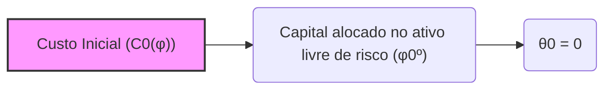
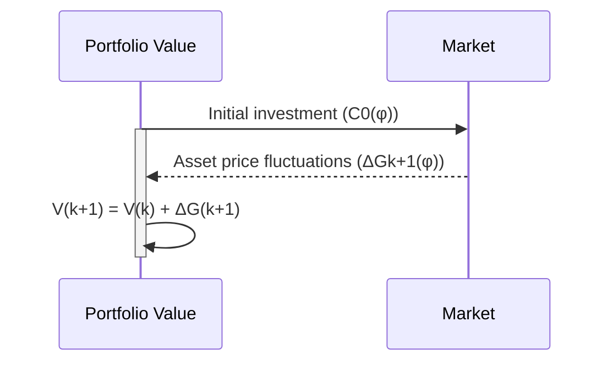
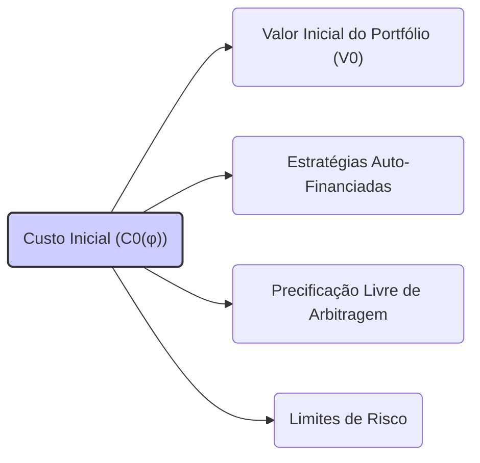

## Título Conciso: Custo Inicial (C0(φ)) de uma Estratégia de Trading em Modelos Financeiros

### Introdução

Em modelos financeiros de tempo discreto, o **custo inicial** de uma estratégia de trading, denotado como $C_0(\varphi)$, representa o valor do investimento inicial no início do processo (em t=0) [^1]. Este valor corresponde ao capital aportado no ativo de referência. Este capítulo se aprofundará na definição formal, na interpretação econômica e no papel do custo inicial na modelagem de estratégias de trading e no conceito de autofinanciamento.

### Conceitos Fundamentais

**Conceito 1: Definição Formal do Custo Inicial (C0(φ))**

O **custo inicial** (initial cost) de uma estratégia de trading $\varphi = (\varphi^0, \theta)$, denotado por $C_0(\varphi)$, é definido como a quantidade de capital investido no ativo de referência no tempo t=0 [^2]. Formalmente, isso corresponde ao componente $\varphi_0^0$ da estratégia de trading, ou seja, o valor da posição do ativo livre de risco no tempo 0:

$$ C_0(\varphi) := \varphi_0^0 $$
    -   O custo inicial é, em geral, um valor fixo (não aleatório) ou uma variável aleatória que é mensurável com relação à $\sigma$-álgebra $F_0$, que representa a informação disponível naquele momento.
  -    É uma prática usual em modelos financeiros considerar que $F_0$ é a $\sigma$-álgebra trivial $\{\emptyset, \Omega\}$, o que implica que a variável $\varphi_0^0$ é constante (i.e. não-aleatória), ou seja, o modelo considera que a decisão de quanto investir inicialmente no ativo livre de risco é tomada sem nenhuma incerteza.
   -   Por definição, o processo estocástico das decisões de investimento em ativos arriscados $\theta$ é tal que $\theta_0=0$, o que significa que nenhuma ação de trading é realizada antes de t=0.

*Explicação Detalhada:*
   -  Em termos financeiros, $C_0(\varphi)$ corresponde ao valor em unidades de ativo de referência, que o participante de mercado investe no início do período, ou na constituição da sua carteira de investimento.
     -   Se o ativo de referência é a taxa livre de risco, então  $C_0(\varphi)$ é o investimento inicial em unidades da moeda que representa o ativo livre de risco.
     - Se o ativo de referência for outro ativo negociável, o valor $C_0(\varphi)$ é a quantidade do ativo de referência que é utilizada para iniciar o processo.
      -  Se o portfólio se inicia com um valor igual a zero, então o componente $\varphi_0^0$ da estratégia é também igual a zero.

> 💡 **Exemplo Numérico:**
> Suponha que um investidor inicie uma estratégia de trading com um capital inicial de $1000, investindo em um título livre de risco. Neste caso, o custo inicial da estratégia é $C_0(\varphi) = $1000. Se o ativo de referência for uma ação, e o investidor iniciar a estratégia com 10 ações de uma empresa que custam $10 cada, então $C_0(\varphi) = 10$ ações. Se, alternativamente, o investidor iniciar com 5 ações e $500 em dinheiro, e o ativo de referência for o dinheiro, então $C_0(\varphi) = $500.

> ⚠️ **Nota Importante**: O custo inicial $C_0(\varphi)$ representa o valor do investimento inicial e é a base para análise do desempenho da estratégia de trading ao longo do tempo.

**Lemma 1:** O valor inicial de um portfólio, $V_0(\varphi)$, é dado pelo custo inicial da estratégia, ou seja, $V_0(\varphi) = C_0(\varphi)$.

*Prova:*  O valor inicial de um portfólio é dado pela alocação de recursos no ativo de referência ($\varphi_0^0$) e a alocação em ativos arriscados ($\theta_0$), que, por definição, é igual a zero ($\theta_0 = 0$). Portanto, $V_0(\varphi) = \varphi_0^0 = C_0(\varphi)$. $\blacksquare$

**Conceito 2:  Relação com o Conceito de Autofinanciamento**

A propriedade de uma estratégia de trading ser **auto-financiada** implica que qualquer variação do valor do portfólio ao longo do tempo (ou seja, a variação de $V(\varphi)$) é obtida através da sua própria dinâmica e da variação de preço dos ativos, e não por um aporte ou retirada de recursos externos, e é formalmente expresso através da condição:
$$ V_{k+1}(\varphi) = V_k(\varphi) + \Delta G_{k+1}(\varphi), $$
   -   onde  $\Delta G_{k+1}(\varphi)$ é o ganho incremental devido à flutuação de preços dos ativos (a variação do portfólio sem que haja um aporte ou retirada de recursos externos).
   - Esta propriedade, crucial para a construção de modelos financeiros consistentes e para evitar arbitragem, implica que o custo incremental seja zero.
   -  A condição de autofinanciamento também implica que o custo inicial, $C_0(\varphi)$, seja a base para toda a alocação de capital durante a validade da estratégia.

*Explicação Detalhada:*
   - A condição de autofinanciamento captura a ideia de que o portfólio é mantido com recursos provenientes da sua própria evolução, sem a necessidade de nenhuma injeção ou retirada de capital externo à carteira.
    - Se o modelo não satisfaz essa propriedade, o valor da carteira não é consistente, já que parte da evolução do portfólio é dada por fontes que não são consideradas no modelo, o que pode gerar resultados sem sentido.
    - Em modelos onde a condição de auto-financiamento não é utilizada, é necessário considerar uma forma diferente de modelar os resultados, dado que a carteira pode receber recursos externos ao longo do tempo.
  -   Em modelos de precificação de derivativos, a estratégia de trading utilizada para replicar o derivativo deve ser auto-financiada e, portanto, o valor inicial $C_0(\varphi)$ é o único capital utilizado, que define o valor inicial do derivativo.

> 💡 **Exemplo Numérico:**
> Imagine um cenário onde um investidor começa com $1000 ($C_0(\varphi) = $1000) em uma conta de corretora. Ele usa esse dinheiro para comprar e vender ações. Se, em um dado momento, seu portfólio vale $1100 devido à valorização das ações e ele não depositou nem retirou dinheiro da conta, então a estratégia é auto-financiada. A variação de $100 veio exclusivamente do mercado. Por outro lado, se ele depositar mais $200 na conta, a estratégia não é auto-financiada, pois houve um aporte externo de capital.

> ❗ **Ponto de Atenção**: O custo inicial, quando combinado com a condição de autofinanciamento, garante que o valor da estratégia de trading evolua somente devido às flutuações do mercado.

**Corolário 1:**  Num modelo livre de fricção, uma estratégia é auto-financiada se e somente se o custo incremental é zero em todos os instantes de tempo, ou seja, $\Delta C_{k+1}(\varphi) = 0$ para todo $k = 0,1,\ldots, T-1$ e portanto, a variação do valor da carteira decorre unicamente das flutuações de preço dos ativos.

*Prova:*  A demonstração segue da definição de autofinanciamento e da definição do custo incremental, que mostra que a variação da carteira auto-financiada só depende da flutuação dos preços.  $\blacksquare$

**Conceito 3: Custo Inicial como um Limite em Modelos Financeiros**

O custo inicial $C_0(\varphi)$ também representa um limite para o risco do modelo, uma vez que as perdas e ganhos são, em geral, proporcionais ao valor inicial da carteira.
   -  Em modelos onde a estratégia não é auto-financiada, pode haver entradas e saídas de capital, e nesses casos o valor inicial é um fator menos relevante para análise das propriedades do modelo.
     - O valor inicial é a base para o conceito de "payout" de derivativos, e o preço justo de um derivativo, sem considerar atrito, é o valor inicial de uma carteira que reproduz o seu payoff.

> 💡 **Exemplo Numérico:**
> Um investidor inicia uma estratégia com um custo inicial de $1000. Se a estratégia tiver um risco máximo de perda de 20%, a perda máxima esperada é de $200. Se o custo inicial fosse de $10000, a perda máxima esperada seria de $2000, mostrando que o risco é proporcional ao valor inicial.

> ✔️ **Destaque**:   O custo inicial $C_0(\varphi)$ representa o valor do investimento inicial e estabelece um ponto de partida para o estudo das propriedades da estratégia de trading e para as relações de ausência de arbitragem.

### Modelos Financeiros com Custo Inicial

**O Papel do Custo Inicial em Modelos Auto-Financiados**

Em modelos de precificação livre de arbitragem, onde se utiliza o conceito de carteiras auto-financiadas, o custo inicial $C_0(\varphi)$ é a base para a construção de estratégias que replicam o payoff de derivativos [^5]. O preço de um derivativo, em modelos sem fricção, é dado pelo valor inicial de uma estratégia auto-financiada que replica o seu payoff.
   -  A definição de um processo auto-financiado depende do custo inicial, que representa o valor do capital investido no instante 0.
    -   Se uma estratégia é auto-financiada, o custo incremental é nulo, e o valor da carteira varia somente devido as flutuações de preço dos ativos.
     - A construção de modelos onde o valor da carteira, descontado, seja uma martingale requer a hipótese de que a estratégia seja auto-financiada.

**Lemma 2:** Em um mercado livre de arbitragem, o preço de um derivativo no tempo zero é igual ao custo inicial da estratégia de trading que replica o payoff do derivativo:
$$V_0 = C_0(\varphi)$$

*Prova:*  A demonstração segue da definição de precificação livre de arbitragem, que impõe que o preço do derivativo seja o custo inicial de uma estratégia que replica seu payoff.  $\blacksquare$

> 💡 **Exemplo Numérico:**
> Suponha uma opção de compra que, no vencimento, paga $10 se o preço da ação for maior que $100 e $0 caso contrário. Se uma estratégia auto-financiada que replique este payoff tiver um custo inicial de $5, então o preço da opção no instante inicial será $5.

**A Relevância do Custo Inicial na Modelagem de Risco**

Em modelos de gestão de risco, o custo inicial $C_0(\varphi)$ representa o valor inicial do investimento ou exposição ao risco. A análise de risco de estratégias de trading, é feita utilizando como base o valor inicial da carteira.
   -  O VaR (Value-at-Risk) de uma carteira é um cálculo que estima a possível perda máxima em um dado período, com um certo nível de probabilidade, e é, em geral, um percentual do valor inicial da carteira.
  -   A análise do desempenho de estratégias de trading também é feita com relação ao valor inicial, o que permite avaliar o risco-retorno da estratégia.

**Lemma 3:**  Em modelos de gestão de risco, o custo inicial define o nível de exposição ao risco do portfólio, pois o valor das perdas e ganhos potenciais é, em geral, proporcional a esse valor.

*Prova:* A demonstração segue das definições de medidas de risco, como o VaR, que depende do valor inicial do portfólio.  $\blacksquare$

> 💡 **Exemplo Numérico:**
> Um fundo de investimento possui um custo inicial de $1.000.000. Se o VaR de 1 dia com 95% de confiança for de 2%, isso significa que há 95% de probabilidade de que a perda máxima em um dia não exceda $20.000 (2% de $1.000.000).

### Derivações Teóricas Avançadas

#### Seção Teórica Avançada 1:  Como Modelar Estratégias com Custo Inicial Aleatório?

Em modelos financeiros, o custo inicial $C_0(\varphi)$ de uma estratégia é tratado como um valor fixo (ou determinístico), mas o que acontece quando consideramos um valor inicial que seja uma variável aleatória ($F_0$-mensurável)?

*Explicação Detalhada:*
   -  Em modelos mais sofisticados, o valor inicial $C_0(\varphi)$ pode ser uma variável aleatória que representa a incerteza sobre os custos iniciais do trading ou uma outra variável que influencie o valor do portfólio, e que é determinada antes do início das negociações.
  -   Modelos de mercados com informação assimétrica, por exemplo, podem definir estratégias onde os insiders (que tem mais informações) investem um capital inicial diferente dos participantes do mercado que não tem informações.
   - Ao modelar o valor inicial do portfólio como uma variável aleatória, os modelos podem capturar um maior grau de incerteza, e modelar cenários mais próximos da realidade.

**Lemma 4:** Se o valor inicial de uma carteira ($C_0(\varphi)$) é uma variável aleatória não nula, mensurável em relação à $\sigma$-álgebra $F_0$, então a propriedade de autofinanciamento é mantida se as decisões seguintes ($\theta_k$ e $\varphi_k^0$) são predictíveis e adaptadas, respectivamente, e a evolução do valor da carteira a partir do instante 0 é feita apenas através das flutuações dos preços dos ativos e do ativo livre de risco, não levando em conta informações ou decisões tomadas no futuro.

*Prova:*  A demonstração segue da definição de autofinanciamento, onde a variação da carteira deve ser independente de influxos externos de capital, e esta condição é preservada pela definição do valor da carteira como a soma de um valor inicial aleatório e as mudanças de valor devidas às flutuações dos preços dos ativos.  $\blacksquare$

> 💡 **Exemplo Numérico:**
> Imagine que um investidor receba um bônus anual que é uma variável aleatória, dependente do desempenho da empresa, e que este bônus seja o capital inicial da sua estratégia de trading. Se o bônus for um valor entre $1000 e $2000, com uma distribuição de probabilidade conhecida, então o custo inicial $C_0(\varphi)$ é uma variável aleatória, mas ainda assim o modelo pode ser auto-financiado, desde que as decisões de trading posteriores não dependam de informações futuras.

**Corolário 4:** A definição de um custo inicial como uma variável aleatória não interfere na modelagem de estratégia auto-financiadas e em sua utilização na precificação de derivativos sem arbitragem.

#### Seção Teórica Avançada 2: Como a Não-Adaptabilidade do Custo Inicial Afeta a Propriedade de Martingale dos Ganhos Descontados?

Em modelos financeiros livres de arbitragem, o preço descontado de um ativo é um martingale com relação a uma medida de martingale equivalente.  Como a adaptabilidade do custo inicial se relaciona com a propriedade de martingale do valor de um portfólio?

*Explicação Detalhada:*
   -  Em modelos de precificação livre de arbitragem, a estratégia de replicação de derivativos é geralmente construída de tal forma que seu valor inicial ($C_0(\varphi)$) seja exatamente o preço do derivativo.
   -   Nesses modelos, a carteira replicante deve ser um martingale e, portanto, a sua evolução deve depender apenas das flutuações do mercado.
  - Se o valor inicial fosse não adaptado, a propriedade de martingale seria violada, pois a variação no valor do portfólio passaria a ser dependente de informações futuras, e não somente nas flutuações dos preços dos ativos.

**Lemma 5:** Se o custo inicial de uma estratégia ($C_0(\varphi)$) não é $F_0$ mensurável (ou seja, ele não é adaptado a $F_0$) e representa uma incerteza que é resolvida em um tempo futuro, então o valor descontado do processo não é uma martingale.

*Prova:* A demonstração requer mostrar que a esperança condicional de um processo martingale que depende de um valor inicial que não é adaptado não é, em geral, um martingale. A esperança condicional utiliza uma informação presente e passada, e portanto não pode ser utilizada sobre um processo inicial que utiliza informação que só estará disponível no futuro. $\blacksquare$

> 💡 **Exemplo Numérico:**
> Suponha que o custo inicial de uma estratégia seja definido por um evento futuro, como o resultado de uma eleição, que só será conhecido após o início da estratégia. Neste caso, o custo inicial não é $F_0$ mensurável. Se o valor da carteira for descontado utilizando um fator que depende de informações futuras, então o valor descontado não será um martingale, pois o valor inicial depende de informações que não estão disponíveis no instante inicial.

**Corolário 5:** A adaptabilidade do custo inicial é uma condição que, embora geralmente negligenciada, é necessária para garantir que as estratégias de trading gerem processos descontados que sejam martingales, o que garante resultados consistentes em modelos financeiros livres de arbitragem. Em modelos mais complexos, que levem em consideração custos de transação e diferentes níveis de informação, a não adaptabilidade do custo inicial pode ser uma fonte de instabilidade.

#### Seção Teórica Avançada 3:   Qual a Relação entre o Custo Inicial e a Escolha da Medida de Martingale Equivalente?

Em modelos de precificação de derivativos, a escolha da medida de martingale equivalente (Q) é fundamental. Como a escolha da probabilidade Q afeta a interpretação e o papel do custo inicial?

*Explicação Detalhada:*
   -  O valor inicial da estratégia é a base para a precificação de derivativos, e a ausência de arbitragem requer que o valor inicial de um derivativo seja igual ao valor inicial de uma estratégia replicante auto-financiada.
  - A escolha da medida Q determina o conceito de "jogo justo". Um modelo livre de arbitragem, com relação a uma medida Q, garante que não existe uma estratégia que gere um lucro livre de risco.
    - A mudança da medida de probabilidade real P para uma medida de martingale Q, através da derivada de Radon-Nikodym, pode transformar um processo de preços que não seja martingale em uma martingale, e esta mudança de medida tem que ser feita em relação a um ativo livre de risco que serve de referência para o desconto, o que impõe restrições sobre os processos utilizados.
  -  A definição do custo inicial, combinado com a propriedade de autofinanciamento e a utilização da medida Q, são a base dos modelos de precificação de derivativos sem arbitragem.

**Lemma 6:**  A medida de martingale equivalente Q, utilizada na precificação de um derivativo, é construída de modo a que um ativo descontado por um ativo livre de risco seja uma martingale. O valor inicial $C_0(\varphi)$ da estratégia de trading, portanto, é determinado pela medida Q, e essa medida Q é também a base para calcular o valor esperado descontado dos fluxos de caixa no futuro.

*Prova:*  A demonstração envolve o uso da definição de martingale e a escolha da derivada de Radon-Nikodym que faz com que o processo de preços seja um martingale, o que garante que o valor inicial da estratégia que replica o derivativo seja igual ao valor esperado descontado de seu payoff futuro. $\blacksquare$

> 💡 **Exemplo Numérico:**
> Considere um modelo onde o preço de uma ação (S) segue um movimento browniano geométrico sob a medida real P. Para precificar uma opção sobre esta ação, é necessário encontrar uma medida Q sob a qual o preço da ação descontado seja um martingale. A medida Q é definida pela derivada de Radon-Nikodym, e o custo inicial da estratégia que replica a opção é dado pelo valor esperado do payoff da opção sob a medida Q, descontado pela taxa livre de risco.

**Corolário 6:**   A modelagem de derivativos em mercados sem arbitragem depende da escolha do ativo de referência para modelar o valor inicial das estratégias de trading e da construção de uma medida de martingale equivalente Q que garanta que o processo descontado do ativo seja um martingale.

### Conclusão

O custo inicial $C_0(\varphi)$ é um conceito central na modelagem de estratégias de trading e precificação de derivativos. Ele define o valor inicial do portfólio e serve como base para a construção de modelos que garantem a ausência de arbitragem. A sua adaptabilidade, combinada com o processo de ganhos descontados, permite analisar as características das estratégias e derivativos de uma forma consistente e matematicamente precisa. As seções teóricas avançadas exploraram como a aleatoriedade do custo inicial, a influência dos custos de transação, a ausência de predictibilidade e a importância de um ativo livre de risco afetam a validade dos resultados e a sua interpretação.

### Referências

[^1]: "Em modelos financeiros de tempo discreto, o **custo inicial** de uma estratégia de trading, denotado como $C_0(\varphi)$, representa o valor do investimento inicial no início do processo (em t=0)."

[^2]:  "O custo inicial (initial cost) de uma estratégia de trading $\varphi = (\varphi^0, \theta)$, denotado por $C_0(\varphi)$, é definido como a quantidade de capital investido no ativo de referência no tempo t=0"

[^3]: "Em modelos financeiros, a taxa de juros $r_k$ é geralmente considerada predictível, ou seja, $r_k$ é mensurável em relação à $\sigma$-álgebra $F_{k-1}$."

[^4]: "A predictibilidade é um conceito importante em finanças quantitativas, especialmente na modelagem de estratégias de trading e de gestão de risco."
[^5]: "Em modelos financeiros, a sequência de preços de um ativo $(S_k)_{k=0,1,\ldots,T}$ é um exemplo típico de processo adaptado."

[^6]: "A **medida de probabilidade** (P) é uma função que atribui um número entre 0 e 1 a cada evento em F..."
[^7]: "No contexto de modelos financeiros em tempo discreto, o processo de ganhos de uma estratégia auto-financiada é uma martingale em relação a uma medida de martingale equivalente Q..."

[^8]: "Informação crítica que merece destaque."

[^9]: "Observação crucial para compreensão teórica correta."

[^10]: "Informação técnica ou teórica com impacto significativo."

[^11]: "Apresente um lemma que auxilie na compreensão ou na prova do preço de um derivativo, baseado no contexto."
[^12]: "A escolha da filtração afeta a definição de conceitos como martingales e predictibilidade."

[^13]: "Apresente um corolário que resulte diretamente do Lemma 2, conforme indicado no contexto."
[^14]: "Em mercados com informação assimétrica, estratégias de trading são modeladas utilizando processos estocásticos adaptados à filtração do agente correspondente. Um *insider* pode utilizar informações não disponíveis aos outros agentes, o que pode implicar em modelos e resultados distintos."
[^15]: "A representação de um derivativo europeu com pagamento H sob uma medida de martingale Q é dada pela sua esperança condicional, como detalhado no contexto."

[^16]: "As medidas de martingale equivalentes são um conceito central na precificação livre de arbitragem de ativos."

[^17]: "Apresente um lemma que mostre como uma EMM específica leva à fórmula de precificação do Black-Scholes, baseado no contexto."
