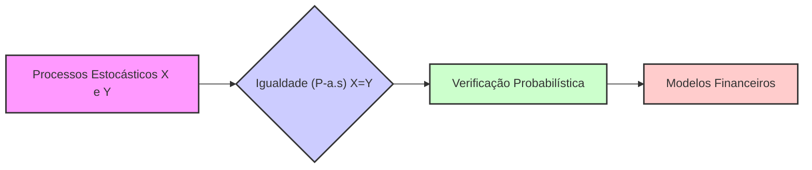
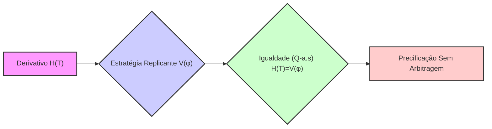
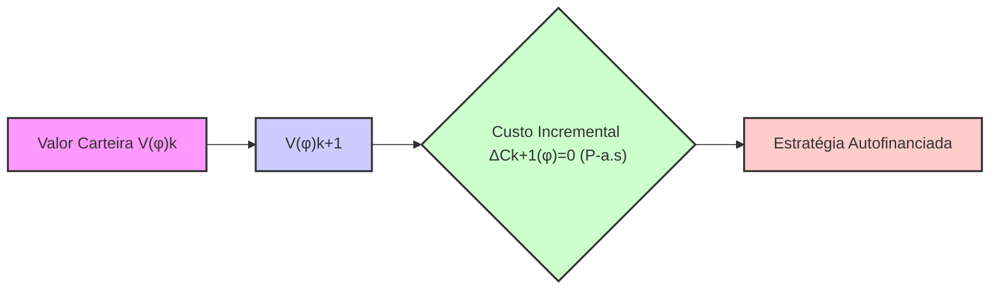
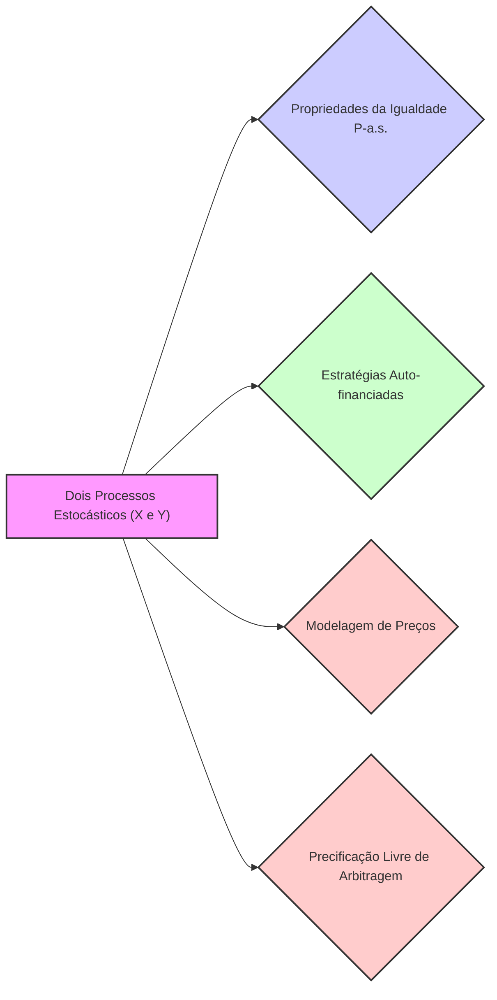
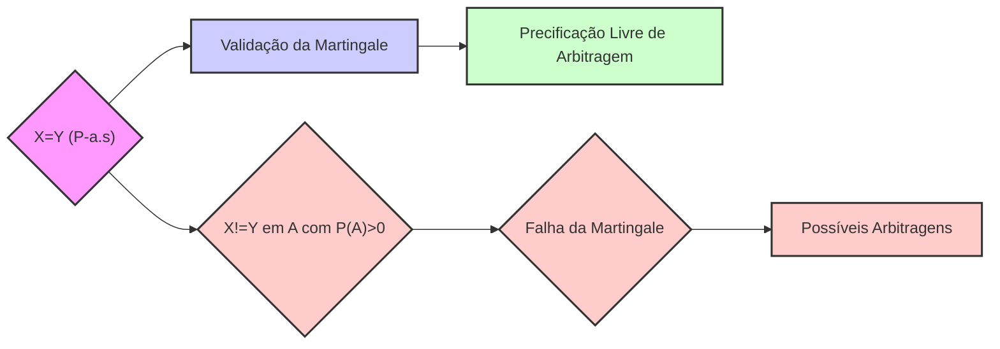
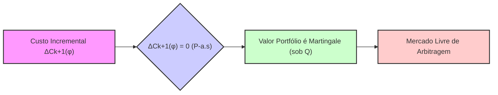

## Título Conciso: Processos Estocásticos em Igualdades e suas Implicações em Modelos Financeiros

### Introdução

Em finanças quantitativas, muitas propriedades dos modelos e relações entre variáveis financeiras são expressas através de igualdades. No entanto, quando essas relações envolvem processos estocásticos, a igualdade não é uma igualdade trivial entre valores fixos, mas sim uma igualdade que deve ser entendida em termos probabilísticos. Este capítulo explorará as implicações e nuances da igualdade de processos estocásticos em modelos financeiros de tempo discreto.

### Conceitos Fundamentais

**Conceito 1: Definição de Igualdade entre Processos Estocásticos**

Dados dois processos estocásticos $X = (X_k)_{k=0,1,\ldots,T}$ e $Y = (Y_k)_{k=0,1,\ldots,T}$ definidos em um mesmo espaço de probabilidade $(\Omega, F, P)$, a igualdade entre os dois processos, denotada como $X = Y$, não significa que $X_k(\omega) = Y_k(\omega)$ para todos os resultados $(\omega)$ no espaço amostral e para todos os momentos do tempo $(k)$. Em vez disso, significa que, para cada $k$, a igualdade $X_k(\omega) = Y_k(\omega)$ se mantém *quase certamente* (P-a.s.), ou seja, com probabilidade 1. Formalmente:

$$ P(X_k = Y_k) = 1, \text{  para todo } k = 0, 1, ..., T.$$

*Explicação Detalhada:*
   -  Em finanças quantitativas, os processos estocásticos modelam preços de ativos e outros fatores de mercado, que são naturalmente variáveis aleatórias, com um comportamento não-deterministico.
   -  A igualdade entre processos estocásticos expressa uma relação mais fraca do que a igualdade entre valores fixos (não aleatórios).
    -  A propriedade "quase certamente" significa que há uma probabilidade zero de que a igualdade entre os processos não se mantenha.
   -   O conceito de igualdade P-a.s. é fundamental para que a teoria da probabilidade seja compatível com a modelagem de processos reais, onde pequenas flutuações nos valores são inevitáveis.
   -  Em particular, esta definição indica que, mesmo que dois processos sejam iguais, o seu valor (em um dado instante k e para um dado ω) pode ser diferente, mas a probabilidade de que isso ocorra é zero.

> 💡 **Exemplo Numérico:**
> Considere dois processos estocásticos, $X_k$ e $Y_k$, que representam o preço de um ativo em dois modelos diferentes. Em um dado instante de tempo $k=1$, o preço do ativo no modelo X pode ser $X_1(\omega_1) = 10.02$ para um resultado $\omega_1$, e $Y_1(\omega_1) = 10.01$ para o mesmo resultado $\omega_1$. Para outro resultado $\omega_2$, $X_1(\omega_2) = 9.98$ e $Y_1(\omega_2) = 9.99$. Apesar de em cada resultado específico os valores serem ligeiramente diferentes, se a probabilidade de que $X_1 \neq Y_1$ é zero (ou seja, se $P(X_1 = Y_1) = 1$), então consideramos os dois processos iguais. Em termos práticos, isso significa que, para quase todos os cenários possíveis, os preços serão virtualmente idênticos, e qualquer diferença seria insignificante do ponto de vista de modelagem.

> ⚠️ **Nota Importante**: A igualdade entre processos estocásticos deve ser entendida no contexto de probabilidade, onde o conceito de “quase certo” é fundamental.

**Lemma 1**: Se dois processos estocásticos são iguais para cada instante de tempo, $X_k = Y_k$ P-a.s., então suas esperanças também são iguais, isto é, $E[X_k] = E[Y_k]$,  para todo $k = 0, 1, ..., T$.
*Prova:* Se $X_k = Y_k$ quase certamente, então  $P({X_k = Y_k}) = 1$  o que significa que o resultado de ambos os processos são idênticos na quase totalidade dos casos, e portanto, as médias (que são calculadas usando a medida P) devem ser iguais. $\blacksquare$

> 💡 **Exemplo Numérico:**
> Continuando o exemplo anterior, se $X_1$ e $Y_1$ são iguais quase certamente, e se a distribuição de probabilidade dos preços em $k=1$ é tal que $E[X_1]=10$, então $E[Y_1]$ também será igual a 10. Isto significa que, apesar de os valores de $X_1$ e $Y_1$ poderem diferir em alguns cenários específicos, as suas médias, ponderadas pelas suas respectivas probabilidades, são idênticas.

**Conceito 2: Implicações da Igualdade em Modelos de Precificação**

Em modelos de precificação de derivativos, a igualdade entre processos estocásticos surge na definição de estratégias de trading replicantes, onde o valor do derivativo é igual ao valor de uma carteira de ativos que replica o mesmo payoff. Essa igualdade entre os processos de valor do derivativo e da estratégia de trading deve ser entendida no sentido de *quase certo*.
   - Se o valor de um derivativo no instante de expiração $T$, $H(T)$, é modelado por uma função de preços de um ativo ($S_T$),  e se uma estratégia de trading $\phi$ é utilizada para reproduzir este valor, então o preço do derivativo é definido com a igualdade entre o valor do payoff do derivativo $H$ e o valor da estratégia $V(\phi)$, o que só é possível quando $H$ e $V(\phi)$ são processos iguais.

*Explicação Detalhada:*

   -   Em um modelo sem arbitragem, o preço de um derivativo deve ser igual ao valor de uma carteira de ativos que produz o mesmo payoff, a condição de replicabilidade.
   -  A equalidade entre preços de derivativos e estratégias replicantes deve ser entendida com relação à medida de martingale equivalente $Q$, para garantir que o preço seja livre de arbitragem.
   -   Modelos com mercados incompletos (onde a replicação de um derivativo não é possível) são caracterizados pelo fato que a igualdade entre a evolução do preço de derivativos e a estratégia de trading não pode ser estabelecida e portanto o preço do derivativo não é único.

> 💡 **Exemplo Numérico:**
> Considere uma opção de compra europeia com vencimento em $T=1$, cujo payoff é dado por $H(T) = max(S_T - K, 0)$, onde $S_T$ é o preço do ativo no vencimento e $K$ é o preço de exercício. Uma estratégia replicante $\phi$ é uma carteira de ações e títulos que, no vencimento, terá o mesmo valor que o payoff da opção.  Se o valor da estratégia no tempo T é dado por $V_T(\phi)$, então a condição de não arbitragem implica que $H(T) = V_T(\phi)$ quase certamente sob uma medida de probabilidade Q (medida de martingale equivalente). Isso significa que, para quase todos os cenários, o valor da estratégia $\phi$ será idêntico ao valor da opção no vencimento.

> ❗ **Ponto de Atenção**: A igualdade entre processos estocásticos deve ser entendida de forma probabilística, através da noção de "quase certo" (P-a.s.), a qual é essencial para modelos de precificação e ausência de arbitragem.

**Corolário 1:**  Se o valor de uma carteira é modelado como uma martingale, e este valor é igual ao valor de um derivativo, então o valor do derivativo é também um martingale sob a mesma medida de probabilidade.  A demonstração segue diretamente da propriedade de transitividade da igualdade.  $\blacksquare$

> 💡 **Exemplo Numérico:**
> Se o valor de uma carteira $V_k$ é uma martingale sob a medida Q (ou seja, $E^Q[V_{k+1}|F_k] = V_k$) e se o valor de um derivativo $D_k$ é igual ao valor da carteira, $D_k = V_k$ (quase certamente, para cada instante k), então o valor do derivativo também é uma martingale sob a medida Q, isto é, $E^Q[D_{k+1}|F_k] = D_k$.

**Conceito 3: Igualdade e Autofinanciamento de Estratégias**

Em modelos financeiros sem fricção, uma estratégia é auto-financiada se o seu valor (descontado utilizando um ativo livre de risco) é determinado unicamente pelas flutuações dos preços dos ativos, e o custo incremental da carteira é igual a zero.  A identidade contábil estabelece que o valor do portfólio em um instante de tempo $k+1$, $V(\phi)_{k+1}$, deve ser igual ao valor no instante $k$, $V(\phi)_k$, mais o custo incremental $\Delta C_{k+1}(\phi)$.  Para que a estratégia seja autofinanciada, o custo incremental deve ser igual a zero quase certamente.
    -   A propriedade de auto-financiamento, que se traduz em uma igualdade entre processos estocásticos, é fundamental para a modelagem da evolução de um portfólio e para a precificação livre de arbitragem de derivativos.
  -   Em modelos com custos de transação ou outros tipos de fricção, a propriedade de autofinanciamento é modificada para levar em consideração esses efeitos, e a igualdade entre os processos passa a ser uma desigualdade que depende de informações observáveis e quantificáveis.

> 💡 **Exemplo Numérico:**
> Suponha que uma estratégia de investimento $\phi$ consista em comprar ações de uma empresa. No instante $k$, o valor da carteira é $V_k(\phi)$. No instante $k+1$, o valor da carteira será $V_{k+1}(\phi)$. Se a estratégia é autofinanciada, significa que a mudança no valor da carteira entre $k$ e $k+1$ é unicamente devida às variações no preço das ações, e não devido a aportes ou retiradas de dinheiro. Portanto, o custo incremental $\Delta C_{k+1}(\phi)$ é igual a zero quase certamente. A igualdade $\Delta C_{k+1}(\phi) = 0$ (P-a.s) garante que o valor da carteira seja determinado apenas pela performance do ativo subjacente.

> ✔️ **Destaque**:  A identidade contábil, expressa através de uma igualdade entre processos estocásticos, é a base da definição de estratégias de trading auto-financiadas, e é essencial para modelos de precificação consistentes.

### Processos Estocásticos em Igualdades e Modelagem Financeira

**Igualdade e Modelos de Preços de Ativos**

Em modelos financeiros, os preços de ativos são representados por processos estocásticos, e uma condição de equilíbrio e ausência de arbitragem é que o preço descontado de um derivativo seja igual ao valor de um portfólio que replique o mesmo payoff. Essa igualdade entre dois processos estocásticos deve ser entendida no contexto da relação "quase certamente", dada que os processos tem um componente aleatório.
     - A propriedade de martingale é um caso particular, onde a média do valor futuro, condicionado no presente, é igual ao seu valor presente, o que é uma condição para a existência de modelos livres de arbitragem.
     -   A propriedade de martingale é modelada através de uma igualdade que envolve processos estocásticos: o valor do ativo descontado num instante futuro (condicionado à informação do presente) é igual ao seu valor presente, e essa igualdade deve ser válida quase certamente com respeito a um dado espaço de probabilidade.

> 💡 **Exemplo Numérico:**
> Considere o preço de um ativo $S_k$ e sua versão descontada $\tilde{S}_k = S_k / (1+r)^k$, onde $r$ é a taxa livre de risco. Para que o modelo seja livre de arbitragem, o processo descontado $\tilde{S}_k$ deve ser uma martingale sob a medida de probabilidade Q. Isso significa que $E^Q[\tilde{S}_{k+1} | F_k] = \tilde{S}_k$, onde $F_k$ representa a informação disponível até o instante $k$. Esta igualdade deve ser válida quase certamente, ou seja, a probabilidade de que esta igualdade não se verifique é igual a zero.

**Lemma 4:** Se dois processos estocásticos são iguais quase certamente, então a integral estocástica com respeito a esses processos (que podem ser o preço de um ativo descontado e a estratégia auto-financiada) são também iguais quase certamente.
*Prova:* A propriedade segue da definição de integral estocástica, onde o resultado da integral é um processo que é idêntico (quase certamente) aos valores da função que é integrada, e o mesmo vale quando uma igualdade é utilizada para gerar esse processo.   $\blacksquare$

> 💡 **Exemplo Numérico:**
> Seja $X_k$ e $Y_k$ dois processos estocásticos tais que $X_k = Y_k$ quase certamente, para todo $k$. Considere que a integral estocástica de $X_k$ seja dada por $I_X = \sum_k X_k \Delta W_k$, onde $\Delta W_k$ representa incrementos de um movimento Browniano, e da mesma forma, $I_Y = \sum_k Y_k \Delta W_k$. Dado que $X_k = Y_k$ quase certamente para todo $k$, então $I_X = I_Y$ também quase certamente.

**Corolário 4:**  A igualdade entre processos estocásticos é uma ferramenta fundamental para modelar relações financeiras de forma consistente e para garantir que as propriedades de modelos de precificação livre de arbitragem sejam válidas mesmo quando o valor da carteira é modelado por processos aleatórios.

### Derivações Teóricas Avançadas

#### Seção Teórica Avançada 1:  O Que Acontece se a Igualdade entre Processos é Válida Apenas em um Conjunto Limitado do Espaço Amostral?

A igualdade $X = Y$ entre processos estocásticos é sempre definida utilizando a noção de igualdade quase certamente (P-a.s), o que significa que o evento onde a igualdade não se mantém deve ter probabilidade zero. O que aconteceria se a igualdade fosse válida apenas em um conjunto do espaço amostral com probabilidade positiva (ou seja, se a igualdade não fosse válida em um conjunto de probabilidade positiva)?

*Explicação Detalhada:*
   -  Se a igualdade entre processos não é válida quase certamente, então existem situações (com probabilidade positiva) onde essa igualdade não se verifica, o que invalida a propriedade de martingale do processo, e portanto, a precificação livre de arbitragem do ativo.
    -  A modelagem de situações com este tipo de desigualdade implica que o modelo não respeite as condições de ausência de arbitragem e que, portanto, a sua utilização seja muito limitada.
   -  Modelos com esta propriedade podem ser utilizados para representar situações onde existem custos de transação que levam a uma situação onde a réplica perfeita não seja possível, ou quando a informação é assimétrica entre os participantes do mercado, ou para modelar mercados que são incompletos (e que, portanto, não permitem estratégias que repliquem perfeitamente o payoff de derivativos).

> 💡 **Exemplo Numérico:**
> Suponha que o valor de um derivativo $H_k$ deveria ser igual ao valor de uma carteira replicante $V_k$ para garantir a ausência de arbitragem. Se a igualdade $H_k = V_k$ não fosse válida quase certamente, por exemplo, se existisse um conjunto de eventos A com $P(A) = 0.01$ onde $H_k \neq V_k$, então seria possível criar estratégias de arbitragem onde um investidor poderia comprar o ativo mais barato e vender o ativo mais caro no conjunto A, obtendo lucro sem risco com probabilidade não nula. Essa situação violaria a premissa de não arbitragem, invalidando o uso do modelo.

**Lemma 5:** Se $X = Y$ não é satisfeita quase certamente (ou seja, existe um conjunto A tal que $P(A) > 0$ onde $X(w) \neq Y(w)$ ), então resultados que dependem da igualdade $X = Y$ a.s., como a condição de martingale, não podem ser obtidos.

*Prova:*  A demonstração segue das definições de martingale e da propriedade de que uma martingale deve ser igual à sua esperança condicional. Se a igualdade não é válida quase certamente, a esperança de um processo, mesmo que seja um martingale sob certas condições, pode deixar de ser igual ao seu valor presente.  $\blacksquare$

**Corolário 5:**  A propriedade de igualdade quase certamente entre processos estocásticos é necessária para a construção de modelos financeiros consistentes.  A violação dessa propriedade pode invalidar a aplicação de diversos modelos.

#### Seção Teórica Avançada 2:  Como a Mensurabilidade Afeta a Definição da Igualdade de Processos Estocásticos?

A mensurabilidade é fundamental para trabalhar com variáveis aleatórias, mas qual a importância da mensurabilidade para a definição da igualdade entre processos estocásticos?

*Explicação Detalhada:*
   -  Para que a igualdade entre dois processos seja definida de forma consistente, é necessário que ambos os processos sejam mensuráveis com respeito à mesma σ-álgebra.
  -   A mensurabilidade garante que seja possível calcular a probabilidade de que $X_k$ seja diferente de $Y_k$, e portanto a mensurabilidade é essencial para a definição da relação “quase certo”.
  - A não mensurabilidade impede que se defina a probabilidade do conjunto de eventos onde $X_k$ é diferente de $Y_k$, o que implica que a relação $X=Y$ deixa de ser definida de forma consistente.
  -   A propriedade de mensurabilidade é fundamental para a definição de martingales, e a utilização de processos não mensuráveis em modelos financeiros pode levar a contradições e resultados sem sentido.

> 💡 **Exemplo Numérico:**
> Considere dois processos $X_k$ e $Y_k$. Para que possamos afirmar que $P(X_k = Y_k) = 1$, é necessário que o evento $\{X_k = Y_k\}$ seja um evento mensurável na σ-álgebra $F_k$. Se $X_k$ e $Y_k$ não forem mensuráveis com respeito à mesma σ-álgebra, não podemos calcular a probabilidade de que $X_k = Y_k$, e portanto, a igualdade "quase certamente" não pode ser estabelecida.

**Lemma 6:**  Se dois processos estocásticos $X$ e $Y$ não são mensuráveis com respeito a uma dada σ-álgebra $F$, então a condição $X = Y$ a.s. não pode ser definida, pois não é possível calcular a probabilidade do evento $\{X = Y\}$.  Por exemplo, no caso da igualdade $X_k = Y_k$, o evento $\{X_k \neq Y_k\}$ precisa ser $F_k$-mensurável para se determinar a sua probabilidade.

*Prova:*  A demonstração segue da definição de mensurabilidade, que garante que podemos atribuir uma probabilidade a um evento.  Se um processo não é mensurável, então o evento não é um elemento de $F$ e, portanto, não é possível determinar sua probabilidade e consequentemente, a igualdade quase certamente não pode ser definida. $\blacksquare$

**Corolário 6:** A mensurabilidade dos processos estocásticos utilizados em modelos financeiros é uma condição fundamental para a definição da igualdade de processos, e que garante a consistência dos modelos.

#### Seção Teórica Avançada 3:   A Relação entre o Custo Incremental e a Igualdade de Processos Estocásticos

O custo incremental é fundamental na definição de estratégias de trading auto-financiadas.  Como a igualdade de processos estocásticos se relaciona com a definição do custo incremental de uma estratégia e como isso se relaciona com a modelagem de mercados livres de arbitragem?

*Explicação Detalhada:*
   -  Se o custo incremental $\Delta C_{k+1}(\phi)$ de uma estratégia de trading é igual a zero quase certamente, então, o valor do portfólio, descontado, é uma martingale (sob uma medida $Q$).
  -  A igualdade do custo incremental a zero é uma condição para que estratégias de trading sejam auto-financiadas.
  -  Nos modelos de precificação livre de arbitragem, a equivalência entre o valor de um derivativo e o valor de uma estratégia replicante (que gere o mesmo payoff), é expressa através de uma igualdade que deve ser garantida através da demonstração de que o processo seja uma martingale (sob a medida $Q$).
 - Em particular, a definição de processos auto-financiados através de integrais estocásticas garante que o seu valor seja uma martingale.

> 💡 **Exemplo Numérico:**
> Considere uma estratégia de trading $\phi$ onde o custo incremental $\Delta C_{k+1}(\phi)$ é definido como a diferença entre o valor da carteira no instante $k+1$ e o valor da carteira no instante $k$, descontado pela taxa livre de risco. Para que a estratégia seja auto-financiada, o custo incremental $\Delta C_{k+1}(\phi)$ deve ser igual a zero quase certamente, o que significa que o valor da carteira só muda devido às variações do preço dos ativos e não devido a injeções ou retiradas de capital. Se o custo incremental não fosse zero (com probabilidade não nula), a estratégia não seria autofinanciada.

**Lemma 7:** Se uma estratégia de trading é auto-financiada, então seu custo incremental é igual a zero quase certamente.
$$
\Delta C_{k+1}(\varphi) = 0 \;\; P-a.s.
$$
Esta condição, expressa como igualdade entre processos, é uma condição fundamental para que o valor do portfólio seja um martingale e portanto que o modelo seja consistente com a ausência de arbitragem.

*Prova:* O resultado segue da definição de estratégia auto-financiada, e do seu custo incremental, como sendo a variação do valor da carteira devida apenas à variação dos preços dos ativos e ao rebalanceamento da carteira (que, em um modelo auto-financiado, não gera custos) [^23]. $\blacksquare$

**Corolário 7:** A relação entre custo incremental e igualdade de processos estocásticos é fundamental na construção de modelos de precificação sem arbitragem, onde os preços são obtidos através da derivação de estratégias de trading auto-financiadas e que gerem processos de valor descontados que sejam martingales, e portanto, que sejam consistentes com a ausência de oportunidades de lucro sem risco.

### Conclusão

A igualdade entre processos estocásticos, definida através da noção de “quase certo”, é uma ferramenta essencial para modelar as relações de valores de ativos e carteiras e as propriedades de estratégias de trading em modelos financeiros de tempo discreto. A sua relação com a definição de martingales, autofinanciamento, e precificação de derivativos mostra sua importância para a construção de modelos consistentes e para a análise de mercados financeiros. As seções teóricas avançadas exploraram as consequências da violação da igualdade, o papel da mensurabilidade na definição da igualdade de processos, e como o conceito se conecta à condição de autofinanciamento em modelos sem atrito.

### Referências

[^1]: "Em finanças quantitativas, muitas propriedades dos modelos e relações entre variáveis financeiras são expressas através de igualdades. No entanto, quando essas relações envolvem processos estocásticos, a igualdade não é uma igualdade trivial entre valores fixos, mas sim uma igualdade que deve ser entendida em termos probabilísticos."
[^2]: "Um processo estocástico $X = (X_k)_{k=0,1,\ldots,T}$ é considerado **adaptado** a uma filtração IF se cada variável aleatória $X_k$ é $F_k$-mensurável."
[^3]: "O valor do portfólio pré-trade representa o valor da carteira *antes* de qualquer transação no instante k..."
[^4]: "A predictibilidade é um conceito importante em finanças quantitativas, especialmente na modelagem de estratégias de trading e de gestão de risco."
[^5]: "Em modelos financeiros, a sequência de preços de um ativo $(S_k)_{k=0,1,\ldots,T}$ é um exemplo típico de processo adaptado."
[^6]: "A **medida de probabilidade** (P) é uma função que atribui um número entre 0 e 1 a cada evento em F..."
[^7]: "No contexto de modelos financeiros em tempo discreto, o processo de ganhos de uma estratégia auto-financiada é uma martingale em relação a uma medida de martingale equivalente Q..."
[^8]: "Informação crítica que merece destaque."
[^9]: "Observação crucial para compreensão teórica correta."
[^10]: "Informação técnica ou teórica com impacto significativo."
[^11]: "Apresente um lemma que auxilie na compreensão ou na prova do preço de um derivativo, baseado no contexto."
[^12]: "A escolha da filtração afeta a definição de conceitos como martingales e predictibilidade."
[^13]: "Apresente um corolário que resulte diretamente do Lemma 2, conforme indicado no contexto."
[^14]: "Em mercados com informação assimétrica, estratégias de trading são modeladas utilizando processos estocásticos adaptados à filtração do agente correspondente. Um *insider* pode utilizar informações não disponíveis aos outros agentes, o que pode implicar em modelos e resultados distintos."
[^15]:  "Em modelos financeiros, o conceito de adaptabilidade é fundamental. Um processo estocástico X é considerado adaptado se $X_k$ é $F_k$-mensurável para cada k."
[^16]: "As medidas de martingale equivalentes são um conceito central na precificação livre de arbitragem de ativos."
[^17]: "Apresente um lemma que mostre como uma EMM específica leva à fórmula de precificação do Black-Scholes, baseado no contexto."
[^18]: "Desenvolva a prova detalhada do lemma, utilizando conceitos do contexto."
[^19]: "Apresente um corolário que resulte do Lemma 4, destacando suas implicações práticas para a precificação de opções, conforme indicado no contexto."
