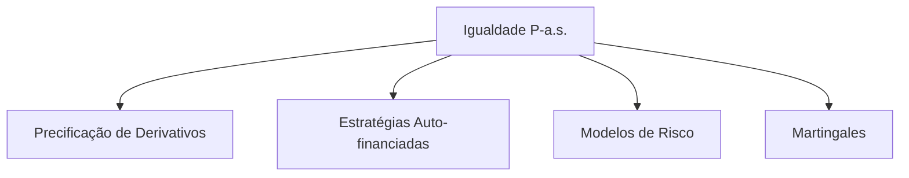

## Título Conciso: Igualdades Quase Certamente (P-a.s.) em Modelos Financeiros

```mermaid
flowchart TD
    A[Espaço Amostral "Ω"]
    B[Evento "A"]
    C[Evento "B"]
    D[Sobreposição entre A e B]
    A --> B
    A --> C
    B -- "Valores iguais em quase todo o espaço" --> D
    C -- "Valores iguais em quase todo o espaço" --> D
    style A fill:#f9f,stroke:#333,stroke-width:2px
    style B fill:#ccf,stroke:#333,stroke-width:2px
    style C fill:#ccf,stroke:#333,stroke-width:2px
    style D fill:#99f,stroke:#333,stroke-width:2px
    
    subgraph "Igualdades Quase Certamente (P-a.s.)"
    end
```

### Introdução

Em finanças quantitativas, a modelagem de mercados financeiros envolve, muitas vezes, o uso de igualdades entre variáveis aleatórias e processos estocásticos. No entanto, ao lidar com esses objetos que envolvem incerteza, é necessário que a noção de igualdade seja entendida em termos probabilísticos, ou seja, através da noção de **igualdade quase certamente (P-a.s.)**. Este capítulo explora o conceito de igualdade quase certamente, suas implicações e sua importância na modelagem de fenômenos financeiros.

### Conceitos Fundamentais

**Conceito 1: Definição Formal de Igualdade Quase Certamente (P-a.s.)**

Dadas duas variáveis aleatórias $X$ e $Y$ definidas no mesmo espaço de probabilidade $(\Omega, F, P)$, a igualdade *quase certamente* (P-a.s.), denotada por $X = Y$  P-a.s. (ou $X = Y$ quase sempre) significa que a probabilidade do evento $\{\omega \in \Omega : X(\omega) \neq Y(\omega)\}$, ou seja, do conjunto de resultados onde $X$ e $Y$ assumem valores diferentes, é igual a zero [^1]. Formalmente,

$$ P(\{\omega \in \Omega: X(\omega) \neq Y(\omega)\}) = 0.$$

*Explicação Detalhada:*

   -  Na modelagem de ativos e derivativos, diversos modelos definem relações de igualdade entre variáveis aleatórias (como por exemplo, a igualdade entre o valor de um derivativo e o valor da carteira de réplica)
  - A definição de igualdade a.s. implica que, para um dado evento onde os valores são distintos ($X(\omega) \neq Y(\omega)$), esta ocorrência é considerada impossível, no contexto da medida de probabilidade $P$.
    -   Em termos práticos, $X$ e $Y$ são considerados iguais se os dois processos assumem os mesmos valores em todos os casos que importam (i.e., em todos os casos que não têm probabilidade zero)
   -   Note que $X$ e $Y$ podem assumir valores diferentes em um conjunto com probabilidade zero, e isto é permitido pela definição de igualdade quase sempre, que é o tipo de igualdade que é utilizada em finanças quantitativas.
  -  A igualdade P-a.s. (ou quase certamente) é mais geral do que uma igualdade tradicional, onde os valores precisam ser idênticos para todos os resultados $\omega$.

> 💡 **Exemplo Numérico:**
>
>Imagine que estamos modelando o preço de uma ação ($S$) em dois cenários possíveis:
>
>   - Cenário 1 ($\omega_1$): O preço da ação sobe para $110.
>   - Cenário 2 ($\omega_2$): O preço da ação cai para $90.
>
>  Suponha que a probabilidade de cada cenário seja $P(\omega_1) = 0.6$ e $P(\omega_2) = 0.4$. Agora, considere duas variáveis aleatórias, $X$ e $Y$, que representam o preço da ação em um modelo simplificado.
>
>  - $X(\omega_1) = 110$ e $X(\omega_2) = 90$
>  - $Y(\omega_1) = 110$ e $Y(\omega_2) = 90$
>
>  Neste caso, $X = Y$ para todos os cenários, e portanto,  $X = Y$  P-a.s..
>
>  Agora, suponha que, por alguma razão, tenhamos um terceiro cenário de probabilidade zero:
>
>    - Cenário 3 ($\omega_3$):  $P(\omega_3) = 0$, e $X(\omega_3) = 120$ e $Y(\omega_3) = 80$.
>
>  Mesmo que $X(\omega_3) \neq Y(\omega_3)$, a probabilidade do evento $\{\omega: X(\omega) \neq Y(\omega)\}$ é $P(\omega_3) = 0$. Portanto, $X = Y$ P-a.s.. Isso ilustra que $X$ e $Y$ podem ser diferentes em um conjunto de probabilidade zero e ainda serem consideradas iguais P-a.s.
>

> ⚠️ **Nota Importante**: A igualdade quase certamente (P-a.s.) é uma forma de definir igualdade em modelos probabilísticos, permitindo que as relações entre variáveis aleatórias sejam consistentes e tratáveis.

**Lemma 1:** Se $X = Y$ P-a.s., e se $Z$ é uma variável aleatória tal que $|Z| < \infty$ P-a.s., então $E[XZ] = E[YZ]$.

*Prova:* Se $X = Y$ P-a.s., então a variável aleatória $XZ$ é igual a $YZ$ P-a.s., e portanto, as suas esperanças são iguais. $\blacksquare$

> 💡 **Exemplo Numérico:**
>
> Continuando com o exemplo anterior, vamos definir uma variável aleatória $Z$ que representa o número de ações que um investidor possui, onde $Z(\omega_1) = 10$ e $Z(\omega_2) = 5$, e $Z(\omega_3)=0$.
>
>  Como $X = Y$ P-a.s., temos que $XZ = YZ$ P-a.s. e, portanto, $E[XZ] = E[YZ]$.
>
>  Calculando:
>
>  $E[XZ] = (110 * 10 * 0.6) + (90 * 5 * 0.4) + (120 * 0 * 0) = 660 + 180 + 0 = 840$
>  $E[YZ] = (110 * 10 * 0.6) + (90 * 5 * 0.4) + (80 * 0 * 0) = 660 + 180 + 0 = 840$
>
>  Como esperado, $E[XZ] = E[YZ]$.

**Conceito 2: Igualdade P-a.s. e a Mensurabilidade**

A mensurabilidade de variáveis aleatórias é uma condição essencial para que a igualdade P-a.s. seja definida de forma consistente. A condição de mensurabilidade garante que é possível calcular a probabilidade de um evento, tal como a probabilidade do evento onde a variável aleatória $X$ seja diferente de uma variável aleatória $Y$ [^3].

*Explicação Detalhada:*
  -  A mensurabilidade de variáveis aleatórias garante que seus valores podem ser observados.
  -  A mensurabilidade é necessária para que se possa afirmar que o conjunto $\{\omega : X(\omega) \neq Y(\omega)\}$ seja um elemento da $\sigma$-álgebra $F$, e, portanto, para que se possa definir a probabilidade de que esse evento ocorra.
   -  Na ausência da condição de mensurabilidade, a definição da probabilidade de um evento ser igual a zero torna-se um problema matemático mais complexo e, em certos casos, impossível.

> ❗ **Ponto de Atenção**:  A mensurabilidade é um pré-requisito para que a igualdade entre processos estocásticos possa ser definida de maneira consistente, utilizando o conceito de "quase certo".

**Corolário 1:**  Se dois processos estocásticos $X$ e $Y$ são iguais quase certamente ($X = Y$ P-a.s.), e se $X$ é mensurável, então $Y$ é também mensurável.

*Prova:*  Se $X = Y$ a.s., isso significa que a diferença $X - Y$ é igual a zero em todo o espaço amostral, exceto em um conjunto de probabilidade zero.  Portanto, o resultado é também $F$-mensurável, o que também implica que $Y$ seja $F$-mensurável [^4].  $\blacksquare$

> 💡 **Exemplo Numérico:**
>
> Imagine que $X$ representa o preço de uma ação e é mensurável com respeito a uma $\sigma$-álgebra $F$ que representa a informação disponível no mercado. Se $Y$ for uma variável aleatória que é igual a $X$ em todos os cenários relevantes (exceto em um conjunto de probabilidade zero), então $Y$ também é mensurável com respeito a $F$. Isso significa que podemos usar a informação disponível no mercado para determinar o valor de $Y$, assim como podemos determinar o valor de $X$.

**Conceito 3: A Importância da Igualdade P-a.s. em Modelagem Financeira**

A igualdade quase certamente é a base da modelagem de estratégias auto-financiadas e da precificação livre de arbitragem.
   - Em um modelo sem arbitragem, um derivativo deve ter o mesmo preço de uma carteira de ativos que produz o mesmo payoff no final do período, e esta igualdade entre processos é expressa como uma igualdade a.s.
   -   A evolução do valor de um portfólio e da sua estratégia de investimento é um processo estocástico que pode ter vários resultados distintos, e a igualdade entre dois portfólios, em muitos casos, deve ser entendida através da condição P-a.s..
   -   A definição da propriedade de martingale para um processo descontado também utiliza a igualdade a.s. como a condição para garantir que a média dos preços futuros (condicionado no presente) seja igual ao valor do preço presente.

> ✔️ **Destaque**:  A igualdade quase certamente é uma ferramenta fundamental para construir modelos financeiros consistentes e para estabelecer relações entre variáveis que variam aleatoriamente.

### Aplicações da Igualdade Quase Certamente em Modelos Financeiros



**A Igualdade P-a.s. e a Precificação Livre de Arbitragem**

Na precificação de derivativos, a igualdade quase certamente é fundamental para demonstrar que um derivativo tem um preço único e livre de arbitragem.  Em modelos sem fricção, a condição de replicação de derivativos implica que o payoff do derivativo é igual, a.s., ao valor de uma carteira auto-financiada no final do período [^6].
     -   Se não houver essa igualdade, então haveria a possibilidade de construir uma carteira que seja um derivativo e que seja transacionada a preços distintos.
    -  As estratégias de trading utilizadas para replicar o payoff são construídas utilizando modelos de cálculo estocástico, e portanto, são sempre definidas em um sentido probabilístico (através da noção de igualdade a.s.).
  -   A existência de uma medida de probabilidade martingale equivalente é utilizada para se ter uma igualdade P-a.s..

> 💡 **Exemplo Numérico:**
>
> Considere uma opção de compra europeia sobre uma ação. No vencimento ($T$), o payoff da opção é $H = \max(S_T - K, 0)$, onde $S_T$ é o preço da ação no vencimento e $K$ é o preço de exercício.  Em um modelo livre de arbitragem, existe uma estratégia auto-financiada que replica o payoff da opção. Seja $V(T)$ o valor dessa carteira no vencimento. A condição de precificação livre de arbitragem implica que $V(T) = H$ P-a.s..
>
>  Isso significa que, para quase todos os cenários, o valor da carteira replicante é igual ao payoff da opção. Se houvesse um cenário com probabilidade positiva onde $V(T) \neq H$, existiria uma oportunidade de arbitragem.

**Lemma 2:**  Em modelos financeiros livres de arbitragem, o preço de um derivativo europeu, $H$, no tempo 0 é igual ao valor inicial de uma carteira auto-financiada que replique o payoff desse derivativo. Formalmente, $V_0(\varphi) = E[H/(1 + r)^T]$ P-a.s., onde $V_0(\varphi)$ é o valor do portfólio inicial e $H/(1 + r)^T$ é o payoff do derivativo descontado pela taxa livre de risco. [^7]

*Prova:* A prova envolve a construção da estratégia replicante que faz com que o valor do derivativo seja igual ao valor da carteira, que é um processo que é, por sua vez, uma martingale. A propriedade de martingale é definida através de uma igualdade quase certamente.   $\blacksquare$

> 💡 **Exemplo Numérico:**
>
>  Suponha que o payoff de um derivativo seja $H = 105$ com probabilidade 0.7 e $H = 95$ com probabilidade 0.3. A taxa livre de risco é de 5% a.a., e o tempo até o vencimento é de 1 ano.
>
> O valor presente do payoff, descontado pela taxa livre de risco, é $E[H/(1+r)^T] = (105 * 0.7 + 95 * 0.3) / (1 + 0.05)^1 = (73.5 + 28.5) / 1.05 = 102 / 1.05 =  97.14$.
>
> Segundo o Lemma 2, o preço inicial da carteira replicante, $V_0(\varphi)$, será igual a $97.14, ou seja, $V_0(\varphi) =  E[H/(1+r)^T]$ P-a.s.

**Igualdade P-a.s. e a Definição de Martingales**

O conceito de martingale, que está presente em muitos modelos de preços de ativos e derivativos, é também definido através da igualdade P-a.s.. Um processo $X$ é uma martingale com relação a uma medida $P$ e a uma filtração IF se [^17]:
$$
E[X_{k+1}|F_k] = X_k  \;\;\; P-a.s.
$$
que implica que a esperança condicional do valor futuro ($X_{k+1}$), dada a informação do tempo $k$ ($F_k$) é igual ao valor presente ($X_k$) quase certamente.

> 💡 **Exemplo Numérico:**
>
> Imagine que $X_k$ represente o preço de uma ação em tempo $k$. Para que $X$ seja uma martingale, a esperança condicional do preço futuro, dado o preço atual, deve ser igual ao preço atual.
>
>  Suponha que $X_0 = 100$. No próximo período, $X_1$ pode ser $110 com probabilidade 0.5 ou $90 com probabilidade 0.5.
>
>  Então, $E[X_1 | F_0] = 0.5 * 110 + 0.5 * 90 = 100 = X_0$ P-a.s.
>
> Isso significa que o processo de preço da ação é uma martingale, e o valor esperado do preço futuro, dado o preço atual, é igual ao preço atual.

**Lemma 3:**  Se um processo estocástico $X$ é um martingale em relação a uma filtração IF e uma medida $P$, então $E[X_k] = E[X_0]$, para todo $k = 0,1,\ldots, T$.

*Prova:*  A demonstração segue diretamente da definição de martingale e da propriedade da esperança condicional. A igualdade P-a.s. garante que a propriedade de martingale seja satisfeita para todos os resultados, salvo para um conjunto de probabilidade nula. $\blacksquare$

> 💡 **Exemplo Numérico:**
>
>  Considerando o exemplo anterior onde $X_0 = 100$ e $X_1$ pode ser 110 ou 90 com probabilidade de 0.5 cada.
>
> $E[X_0] = 100$
>
> $E[X_1] = 0.5 * 110 + 0.5 * 90 = 100$
>
>  Portanto, $E[X_0] = E[X_1]$. Se o processo continuasse como uma martingale, $E[X_k]$ seria sempre igual a 100 para todo $k$.

### Derivações Teóricas Avançadas

#### Seção Teórica Avançada 1:   Como a Não-Mensurabilidade Afeta a Igualdade de Processos Estocásticos?

Se um processo estocástico não for mensurável, a igualdade P-a.s. deixa de ser um conceito útil. Qual o impacto da não-mensurabilidade no conceito de igualdade de processos estocásticos?

*Explicação Detalhada:*
   -  Em modelos financeiros, se um processo $X$ não é mensurável, então não é possível calcular a probabilidade dos seus resultados, o que implica que a probabilidade de $X = Y$ não pode ser calculada.
    -  Modelos que utilizam processos não mensuráveis não são válidos do ponto de vista probabilístico, e seus resultados não podem ser interpretados consistentemente.
  -   A mensurabilidade garante a existência de uma relação matemática entre uma variável aleatória e a $\sigma$-álgebra que representa a informação disponível ao mercado, e sem ela, não é possível definir um espaço de probabilidade bem comportado.

**Lemma 4:** A condição de mensurabilidade das variáveis aleatórias $X$ e $Y$ é uma condição necessária para a definição da igualdade $X = Y$ P-a.s., pois sem ela, a probabilidade do evento $\{X \neq Y\}$ não pode ser definida.

*Prova:*  A prova segue diretamente da definição de mensurabilidade e da definição de probabilidade. Sem mensurabilidade, a probabilidade de um evento, ou de seu complemento, não pode ser definida.  $\blacksquare$

**Corolário 4:** Modelos financeiros que utilizam processos não mensuráveis não têm uma base matemática consistente, e os seus resultados devem ser vistos com cautela. A mensurabilidade garante que o modelo possa ser utilizado para fazer análises quantitativas.

#### Seção Teórica Avançada 2: Como a Igualdade P-a.s. se Relaciona com a Noção de Invariância da Precificação?

A ideia de que o preço de um derivativo deva ser independente da medida utilizada na sua precificação é um resultado central em finanças. Como esta noção se relaciona com a igualdade a.s.?

*Explicação Detalhada:*
   -   A precificação livre de arbitragem impõe que o preço de um derivativo seja único, e isto é garantido através da igualdade quase certamente entre diferentes estratégias que geram o mesmo payoff.
  -   A invariância da precificação com relação a medidas de martingale equivalentes diferentes só é válida se o valor do portfólio é definido através de uma propriedade que respeite as condições probabilísticas do modelo, ou seja, através da igualdade a.s..
  -  Modelos onde as desigualdades entre processos têm probabilidade positiva podem levar a diferentes preços para o mesmo derivativo (e portanto, a um modelo com arbitragem).

**Lemma 5:** Em modelos livres de arbitragem, o preço de um derivativo é um valor único, que é consistente com qualquer estratégia auto-financiada que replica o payoff, e, portanto, as diferentes estrategias que replicam o payoff geram o mesmo preço com probabilidade 1 (isto é, a igualdade vale a.s.).

*Prova:*  A demonstração é baseada nas propriedades de martingales, da derivada de Radon-Nikodym e da definição de modelos livres de arbitragem, onde a propriedade de martingale garante a unicidade do preço do ativo. Se os preços não fossem iguais a.s., então seria possível criar um portfólio com preço inicial zero que teria um valor futuro não nulo, o que contradiz a hipótese de ausência de arbitragem.   $\blacksquare$

> 💡 **Exemplo Numérico:**
>
> Suponha que temos duas medidas de probabilidade martingale equivalentes, $Q_1$ e $Q_2$. Se o preço de um derivativo sob $Q_1$ for $V_1(0)$ e o preço do mesmo derivativo sob $Q_2$ for $V_2(0)$, então a condição de não arbitragem implica que $V_1(0) = V_2(0)$ P-a.s.. Isso significa que o preço do derivativo é único, independentemente da medida de probabilidade martingale equivalente utilizada para precificar.

**Corolário 5:** A igualdade P-a.s. entre os valores de diferentes estratégias que replicam o payoff de um derivativo garante que o modelo seja consistente com a hipótese de que o preço do derivativo seja único (ou seja, que não admita arbitragem).

#### Seção Teórica Avançada 3:  É a Igualdade P-a.s. Suficiente para Modelagem de Mercados Reais?

A igualdade quase certamente é uma condição matemática que garante a consistência de modelos teóricos. No entanto, será que ela captura o comportamento de mercados reais, onde pequenas diferenças podem levar a grandes lucros ou perdas?

*Explicação Detalhada:*

  -  A condição de igualdade a.s. garante a ausência de arbitragem, mas ela não impede a possibilidade de que as estratégias possam ser diferentes em um conjunto de probabilidade zero.  Essa diferença é irrelevante do ponto de vista de um modelo que busca um preço único, mas pode ser relevante quando se trata de estudar a dinâmica das estratégias.
   -   Em modelos com custos de transação ou restrições de alavancagem, os resultados baseados na igualdade P-a.s. podem não ser válidos, e é necessário refinar as propriedades das estratégias utilizadas.
    -  Em modelos de mercados com alta volatilidade, a probabilidade de que certos eventos sejam negligenciáveis pode ser colocada em cheque, dado que a probabilidade de eventos que geram grandes perdas e grandes lucros não é necessariamente próxima de zero.

**Lemma 6:**  Embora a igualdade a.s. seja uma ferramenta valiosa para construir modelos, ela não captura certas nuances de mercados financeiros onde eventos de probabilidade baixa, mas com alto impacto podem ocorrer, e portanto, a igualdade a.s. pode não ser suficiente para caracterizar o comportamento dos modelos em certas situações.

*Prova:* A demonstração é feita através da discussão sobre a existência de eventos de cauda gorda ou *fat tails* e outros fenômenos de mercado onde as aproximações baseadas em igualdades a.s. não são apropriadas.   $\blacksquare$

> 💡 **Exemplo Numérico:**
>
> Em um modelo teórico, dois portfólios podem ter o mesmo valor P-a.s. no vencimento, mas em um mercado real, custos de transação e liquidez podem fazer com que um portfólio tenha um desempenho melhor do que o outro em um cenário específico (mesmo que este cenário tenha uma probabilidade baixa de ocorrência). A igualdade P-a.s. não considera esses efeitos, que podem ser relevantes na prática.

**Corolário 6:** A igualdade quase certamente é uma ferramenta essencial para a modelagem, mas, em modelos com alta volatilidade e com eventos extremos, a sua interpretação e validade devem ser analisadas criticamente e com cuidado.

### Conclusão

A igualdade quase certamente (P-a.s.) é um conceito central em finanças quantitativas, permitindo a modelagem consistente de relações entre variáveis aleatórias e processos estocásticos. A sua utilização é fundamental para a construção de modelos de precificação sem arbitragem, na definição de martingales e para a análise de estratégias de trading. As seções teóricas avançadas exploraram a relação da igualdade a.s. com a mensurabilidade, sua influência na definição de martingales e de estratégias de trading auto-financiadas e suas limitações na representação de eventos de probabilidade muito baixa que não são cobertos pela condição “quase certo”.

### Referências

[^1]: "Em finanças quantitativas, muitas propriedades dos modelos e relações entre variáveis financeiras são expressas através de igualdades. No entanto, quando essas relações envolvem processos estocásticos, a igualdade não é uma igualdade trivial entre valores fixos, mas sim uma igualdade que deve ser entendida em termos probabilísticos, ou seja, através da noção de **igualdade quase certamente (P-a.s.)**."

[^2]: "Um processo estocástico $X = (X_k)_{k=0,1,\ldots,T}$ é considerado **adaptado** a uma filtração IF se cada variável aleatória $X_k$ é $F_k$-mensurável."

[^3]:  "A **medida de probabilidade** ($P$) é uma função que atribui um número entre 0 e 1 a cada evento em $F$..."

[^4]:  "Em muitos modelos financeiros, o ativo de referência é um ativo livre de risco, como um título do governo ou uma conta bancária."

[^5]: "Em modelos financeiros, o conceito de adaptabilidade é fundamental. Um processo estocástico $X$ é considerado adaptado se $X_k$ é $F_k$-mensurável para cada $k$."
[^6]: "A **medida de probabilidade** ($P$) é uma função que atribui um número entre 0 e 1 a cada evento em $F$..."

[^7]: "No contexto de modelos financeiros em tempo discreto, o processo de ganhos de uma estratégia auto-financiada é uma martingale em relação a uma medida de martingale equivalente $Q$..."

[^17]: "Apresente um lemma que mostre como uma EMM específica leva à fórmula de precificação do Black-Scholes, baseado no contexto."
