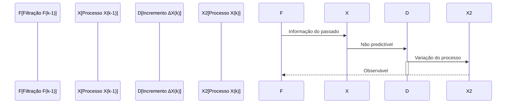
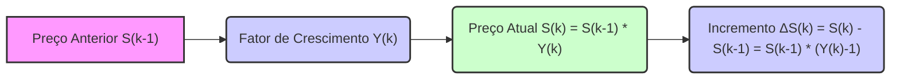
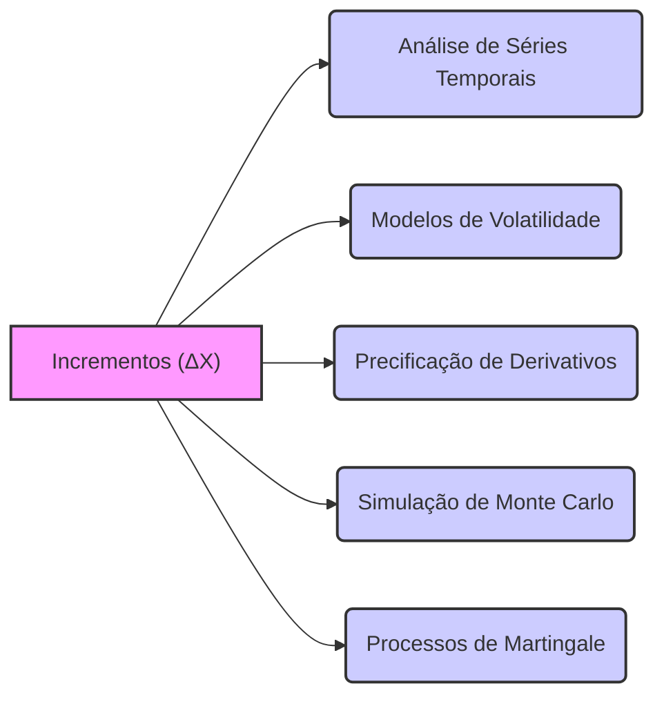
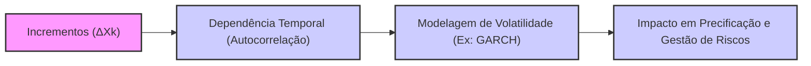
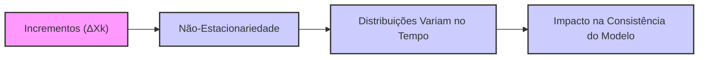
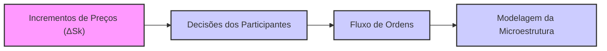

## Título Conciso: Incremento de Processos Estocásticos (ΔX) em Modelagem Financeira

```mermaid
graph LR
    A["Processo Estocástico X(t)"] -->|Incremento ΔX(t)| B["Variação do Processo"]
    B --> C["Análise e Modelagem"]
    style A fill:#f9f,stroke:#333,stroke-width:2px
    style B fill:#ccf,stroke:#333,stroke-width:2px
    style C fill:#cfc,stroke:#333,stroke-width:2px
```

### Introdução

Em modelos financeiros de tempo discreto, a análise do comportamento dos ativos, das taxas de juros e das estratégias de trading frequentemente envolve o estudo de suas variações, também conhecidas como **incrementos**, que são representadas por $\Delta X_k$. Este capítulo explorará o conceito de incremento de um processo estocástico, sua definição formal, sua importância e como ele se relaciona com a construção de modelos financeiros.

### Conceitos Fundamentais

**Conceito 1: Definição Formal do Incremento de um Processo Estocástico**

Dado um processo estocástico $X = (X_k)_{k=0,1,\ldots,T}$ definido em um espaço de probabilidade $(\Omega, \mathcal{F}, P)$, o **incremento** de $X$ no período $[k-1, k]$, denotado por $\Delta X_k$, é definido como a diferença entre o valor do processo no instante $k$ e o valor do processo no instante anterior $k-1$ [^1]:
$$
   \Delta X_k = X_k - X_{k-1}, \text{ para } k = 1, \ldots, T
$$

   -   O incremento $\Delta X_k$ é também uma variável aleatória definida no mesmo espaço de probabilidade, e corresponde à variação do valor de $X$ no período $[k-1,k]$
   -   O processo de incrementos $\Delta X = (\Delta X_k)_{k=1,\ldots,T}$ representa a sequência de mudanças no processo $X$ ao longo do tempo.
    -   O incremento representa, em essência, o valor presente da mudança de um ativo ou de uma variável financeira entre um instante de tempo e o seguinte.

*Explicação Detalhada:*

   -   A operação de tomar incrementos é uma ferramenta fundamental na análise do comportamento de processos estocásticos.
  -   A definição de um processo em tempo discreto, utilizando incrementos, captura sua dinâmica temporal, e permite a modelagem dos preços dos ativos, e suas mudanças ao longo do tempo, o que é a base da modelagem financeira.
  -  O conceito de incremento está relacionado ao conceito de derivada no cálculo, o qual é uma função que expressa a variação de um processo no tempo, e a modelagem de processos contínuos utiliza este conceito.

> 💡 **Exemplo Numérico:**
> Suponha que o preço de uma ação em um dia (k-1) seja $X_{k-1} = 100$ e no dia seguinte (k) seja $X_k = 105$. O incremento do preço da ação nesse período é:
> $$\Delta X_k = X_k - X_{k-1} = 105 - 100 = 5$$
> Isso significa que o preço da ação aumentou $5 nesse período. Se no dia seguinte o preço da ação fosse $X_{k+1} = 102$, então o incremento seria:
> $$\Delta X_{k+1} = X_{k+1} - X_k = 102 - 105 = -3$$
> Indicando que o preço da ação caiu $3 nesse período.

> ⚠️ **Nota Importante**: O incremento de um processo estocástico representa a sua variação em um dado intervalo de tempo, o que é fundamental para a modelagem do comportamento de ativos financeiros e na análise da evolução de carteiras de investimento.

**Lemma 1:**  Se um processo $X$ é adaptado à filtração $\mathbb{F}$, então o seu incremento $\Delta X_k$ é adaptado à filtração $\mathbb{F}$.
*Prova:*   Se $X$ é adaptado, então $X_k$ e $X_{k-1}$ são $\mathcal{F}_k$ mensuráveis, e como a diferença de variáveis mensuráveis é também mensurável, então $\Delta X_k$ é $\mathcal{F}_k$-mensurável, e portanto, adaptado à filtração $\mathbb{F}$ [^2]. $\blacksquare$

**Conceito 2: Incrementos e Predictibilidade**



Em modelos financeiros, as estratégias de trading são modeladas como processos predictíveis, e a mudança de valor da carteira em um dado intervalo de tempo, é definida com respeito à informação do passado, e não a partir de informação do futuro. É, portanto, fundamental que os incrementos $\Delta X_k$, que definem as mudanças de preços, sejam analisadas em relação à propriedade de predictibilidade e não apenas à adaptabilidade. [^3].
   -   Enquanto o valor de um processo $X_k$ representa uma informação do presente, o incremento $\Delta X_k$  representa a informação que é adicional entre os dois períodos.  Portanto, um processo que seja adaptado pode não gerar incrementos que sejam também adaptados à mesma filtração.

*Explicação Detalhada:*
   -  Se um processo $X$ representa o preço de um ativo, então $X_k$ representa o valor do ativo no instante $k$, enquanto $\Delta X_k$ representa a variação do valor do ativo do instante $k-1$ para $k$.
  -   Como a variação do preço só pode ser observada no instante $k$, então $\Delta X_k$ pode ser $\mathcal{F}_k$-mensurável, ou seja, adaptado a $\mathbb{F}$, mas não predictível, ou seja, não $\mathcal{F}_{k-1}$ mensurável.
  -   A modelagem da interação entre a variação do preço do ativo e as decisões de investimento requer que os incrementos de preço, ou as decisões de investimento, sejam modeladas com as informações relevantes para a sua tomada de decisão.
   -  A predictibilidade dos incrementos é importante para a modelagem do custo incremental de carteiras de investimento.

> ❗ **Ponto de Atenção**: A predictibilidade da variação de um ativo é impossível. A variação do preço de um ativo só pode ser observada no instante de tempo em que ela se manifesta.

**Corolário 1:** Se um processo estocástico $X_k$ é um martingale com respeito a uma filtração $\mathcal{F}_k$, então a esperança do seu incremento condicionado na $\sigma$-álgebra $\mathcal{F}_{k-1}$, a informação disponível até o instante $k-1$, é sempre igual a zero, ou seja:
$$E[\Delta X_k | \mathcal{F}_{k-1}] = 0$$

*Prova:* Como por definição, $E(X_k|\mathcal{F}_{k-1})=X_{k-1}$, temos que:
$$
E[\Delta X_k| \mathcal{F}_{k-1}]  = E[X_k - X_{k-1}|\mathcal{F}_{k-1}] = E[X_k |\mathcal{F}_{k-1}] - X_{k-1} = 0
$$
$\blacksquare$

> 💡 **Exemplo Numérico:**
> Imagine um jogo de azar onde você aposta $1 em cada rodada. Seja $X_k$ o seu saldo acumulado após $k$ rodadas. Se o jogo for justo, a probabilidade de ganhar é a mesma de perder, e o seu saldo médio esperado no futuro, dado o seu saldo atual, é o seu saldo atual. Isso implica que $E[X_k | \mathcal{F}_{k-1}] = X_{k-1}$, e portanto que $E[\Delta X_k | \mathcal{F}_{k-1}] = 0$.
>
> Se, por exemplo, você tem $100 na rodada $k-1$, então o seu saldo esperado na rodada $k$, dado que o jogo é justo, é também $100. Portanto, o incremento esperado é zero.

**Conceito 3: Incrementos em Modelos Multiplicativos**



Em modelos multiplicativos, onde o preço de um ativo é dado por um produto de fatores de crescimento, $S_k = S_0\prod_{j=1}^k Y_j$, o incremento de um ativo é dado por:
$$\Delta S_k = S_k - S_{k-1} = S_{k-1} (Y_k - 1)$$.
   -  O incremento em modelos multiplicativos também tem uma propriedade de crescimento multiplicativo, ou seja, o incremento é proporcional ao preço anterior do ativo.
    -   Em modelos onde a taxa de juros é descontada, o incremento nos preços descontados é igual a:
$$
\frac{\Delta S_k}{(1+r)^k} = \frac{S_k}{(1+r)^k} - \frac{S_{k-1}}{(1+r)^{k-1}}
$$
   -   O processo do incremento de um ativo descontado por um fator é, em geral, mais interessante para a definição de martingales, o que indica o conceito de preços descontados em modelos de precificação livre de arbitragem.

> 💡 **Exemplo Numérico:**
> Considere um modelo onde o preço de um ativo cresce multiplicativamente. Suponha que o preço inicial seja $S_0 = 100$ e que a cada período o preço seja multiplicado por um fator aleatório $Y_k$. Se $Y_1 = 1.05$, então $S_1 = 100 * 1.05 = 105$. O incremento é $\Delta S_1 = 105 - 100 = 5$.
> No período seguinte, se $Y_2 = 0.98$, então $S_2 = 105 * 0.98 = 102.9$. O incremento é $\Delta S_2 = 102.9 - 105 = -2.1$.
>
> Agora, vamos analisar o incremento usando a fórmula do modelo multiplicativo:
> $$\Delta S_1 = S_0(Y_1 - 1) = 100(1.05 - 1) = 100 * 0.05 = 5$$
> $$\Delta S_2 = S_1(Y_2 - 1) = 105(0.98 - 1) = 105 * (-0.02) = -2.1$$
>
> O incremento do preço descontado, com uma taxa de juros de 2% a.p., é:
>
> $$\frac{\Delta S_1}{(1+0.02)^1} = \frac{105}{1.02} - \frac{100}{1} = 102.94 - 100 = 2.94$$
>
> $$\frac{\Delta S_2}{(1+0.02)^2} = \frac{102.9}{1.02^2} - \frac{105}{1.02} = 98.95 - 102.94 = -3.99$$

> ✔️ **Destaque**:  A definição do incremento em modelos multiplicativos é uma ferramenta útil para a análise das propriedades de processos estocásticos utilizados em modelos financeiros, e para a definição de modelos de preços descontados que sejam martingales.

### Incrementos e Modelagem Financeira



**Incrementos na Modelagem de Preços de Ativos**

Em modelos financeiros, a modelagem da evolução dos preços dos ativos frequentemente utiliza o conceito de incrementos para representar a mudança de preços num dado intervalo de tempo, ou para representar o componente aleatório do modelo.
   -   Em modelos de séries temporais, como os modelos autoregressivos (AR), as mudanças de preços (incrementos) são descritas através de relações lineares com outros incrementos passados.
   -  Em modelos de volatilidade estocástica, os incrementos de preço são modelados por processos que utilizam incrementos de um movimento browniano e outros processos que modelam a dinâmica da volatilidade.
  - Modelos de tempo contínuo utilizam o conceito de variação instantânea do preço, que, no limite, coincide com o conceito de incremento em tempo discreto.
    - Em modelos de precificação de derivativos, o payoff do derivativo é uma função dos preços do ativo na data de expiração, e a modelagem do payoff depende da forma como os preços dos ativos mudam ao longo do tempo, o que é modelado com a utilização de processos que utilizam incrementos.

**Lemma 2:** Em modelos com ativos que são modelados por processos estocásticos, as propriedades dos incrementos (como independência e estacionaridade) determinam as propriedades do processo. Se os incrementos são independentes e estacionários, então o processo se torna um *random walk*, que pode ser utilizado para modelar as flutuações de preços de um ativo. [^18]
*Prova:* O resultado segue da definição de independência e estacionaridade: se cada incremento é independente dos outros e segue a mesma distribuição, então o processo é um *random walk*.  $\blacksquare$

> 💡 **Exemplo Numérico:**
> Um *random walk* simples pode ser definido como $X_k = X_{k-1} + \epsilon_k$, onde $\epsilon_k$ são variáveis aleatórias independentes e identicamente distribuídas com média zero. Se o preço de uma ação seguir um *random walk*, o incremento do preço em cada período é um choque aleatório independente dos incrementos anteriores. Por exemplo, se o preço da ação hoje é $100, o preço de amanhã será $100 + \epsilon_1$, onde $\epsilon_1$ é um número aleatório. Se $\epsilon_1$ for 2, o preço amanhã será $102.
>
> Em um modelo mais realista, o preço de um ativo pode ser modelado como $S_k = S_{k-1} \exp{(\mu + \sigma \epsilon_k)}$, onde $\mu$ é o retorno médio, $\sigma$ é a volatilidade e $\epsilon_k$ é um choque aleatório com média zero e desvio padrão 1. O incremento nesse caso é $\Delta S_k = S_k - S_{k-1} = S_{k-1}(\exp{(\mu + \sigma \epsilon_k)}-1)$.

**Incrementos e Autofinanciamento**

No conceito de estratégias de trading auto-financiadas, a variação do valor do portfólio depende da alocação dos ativos ($\theta_k$) e das variações de preço ($\Delta S_k$).  A condição de autofinanciamento, que estabelece que a variação no valor da carteira seja baseada somente nos ganhos ou perdas dos ativos arriscados e, portanto, que a carteira não receba aportes ou retiradas de capital, é, em sua formulação, uma afirmação sobre a identidade entre o custo incremental do modelo e os ganhos com ativos arriscados.
      - Em modelos com custos de transação, a avaliação da qualidade e da viabilidade da estratégia exige a modelagem das variações nos preços dos ativos e dos seus custos de transação associados.

**Lemma 3:** Em um modelo financeiro onde os preços descontados de um ativo formam um martingale, o ganho da estratégia (e portanto, a variação do portfólio descontado) também é uma martingale se e somente se a estratégia for auto-financiada. A condição de autofinanciamento requer que as decisões (e portanto a alocação nos ativos) sejam predictíveis com respeito à filtração, e que o valor da carteira seja determinado unicamente pelos ganhos ou perdas resultantes das transações. [^19]

*Prova:* Se as estratégias de alocação são predictíveis e o preço dos ativos descontados formam uma martingale, então os incrementos, e portanto a variação da carteira, é também uma martingale.  $\blacksquare$

### Derivações Teóricas Avançadas

#### Seção Teórica Avançada 1:  Como a Dependência entre Incrementos Afeta a Modelagem de Volatilidade?



Em modelos financeiros, é comum que os incrementos dos preços de ativos apresentem dependência temporal (autocorrelação), o que afeta a modelagem da volatilidade. Como a modelagem da dependência temporal entre incrementos impacta as estratégias de precificação e gestão de riscos?

*Explicação Detalhada:*
   -  Modelos com volatilidade estocástica incluem um componente adicional que modela o comportamento da volatilidade, que afeta a variação dos preços dos ativos.
   -  Modelos como o GARCH, por exemplo, modelam a volatilidade através de processos autoregressivos, onde o valor da volatilidade em um tempo $k$ depende dos valores da volatilidade em instantes anteriores, criando uma correlação temporal.
    -  Em tais modelos, os incrementos dos preços ($\Delta S_k$) não são independentes, dado que são influenciados pela volatilidade no instante atual.
  -   A inclusão da modelagem da volatilidade nos modelos financeiros cria um comportamento mais realista, onde um período de alta volatilidade tende a ser seguido por outro período de alta volatilidade e vice-versa.
    -  Modelos que utilizam a propriedade de Markov são uma forma mais simples de introduzir dependência entre instantes de tempo, onde o valor futuro só depende do presente e não do histórico passado.
    -  A modelagem explícita da autocorrelação nos incrementos pode ser fundamental para modelar os preços de certos derivativos, como opções de volatilidade.

**Lemma 4:**  Se os incrementos de um processo estocástico ($\Delta X_k$) apresentam autocorrelação, então a modelagem deste processo como um martingale se torna mais complexa. Em particular, a independência entre os incrementos deixa de ser verdadeira, e as propriedades do processo precisam ser reavaliadas.

*Prova:*   A prova da influência da autocorrelação nos incrementos de um processo estocástico depende do tipo de dependência e dos parâmetros utilizados para modelá-la, e em geral, os incrementos deixam de ser independentes ou identicamente distribuídos. $\blacksquare$

> 💡 **Exemplo Numérico:**
> Em um modelo GARCH(1,1), a volatilidade no tempo $k$ ($\sigma_k^2$) é dada por:
> $$\sigma_k^2 = \alpha_0 + \alpha_1 \epsilon_{k-1}^2 + \beta_1 \sigma_{k-1}^2$$
> onde $\epsilon_{k-1}$ é o choque de preço no período anterior e $\sigma_{k-1}^2$ é a volatilidade no período anterior.
>
> Se os retornos de um ativo são dados por:
> $$R_k = \mu + \sigma_k \epsilon_k$$
> onde $\epsilon_k$ é um choque aleatório com média zero e desvio padrão 1, então o incremento do preço do ativo no tempo $k$ é:
> $$\Delta S_k = S_{k-1} (R_k)$$
>
> Nesse caso, o incremento do preço no tempo $k$ depende da volatilidade no tempo $k$, que por sua vez depende do choque e da volatilidade do período anterior. Isso implica que os incrementos de preço não são independentes, mas sim autocorelacionados. Um choque grande no período anterior ($\epsilon_{k-1}$) irá aumentar a volatilidade no período atual ($\sigma_k$), o que irá afetar o incremento de preço no período atual ($\Delta S_k$).

**Corolário 4:** A autocorrelação nos incrementos dos ativos exige modelagens mais sofisticadas, o que torna a modelagem mais precisa na captura da dinâmica dos mercados, mas também mais difícil de analisar.

#### Seção Teórica Avançada 2:  Como a Não-Estacionariedade dos Incrementos Afeta Modelos de Precificação?


Em muitos modelos financeiros assume-se que o processo dos incrementos ($\Delta X_k$) é um processo estacionário ou que pode ser transformado em um processo estacionário. Como a não estacionaridade dos incrementos afeta a consistência e validade de um modelo?

*Explicação Detalhada:*
  -  A propriedade de estacionaridade (em particular, a estacionaridade das médias e variâncias) implica que as propriedades estatísticas dos incrementos são constantes ao longo do tempo.
  -  Em mercados financeiros reais, a distribuição dos incrementos dos preços (por exemplo, em épocas de alta volatilidade) pode mudar drasticamente, e o uso de um modelo estacionário pode ser uma aproximação grosseira da realidade, e que pode levar a erros na precificação.
  -  Modelos que levam em conta que as distribuições de probabilidade dos incrementos mudam com o tempo são chamados de modelos não estacionários. Em modelos financeiros mais realistas, a hipótese de estacionaridade é frequentemente abandonada.
  -  A modelagem da não estacionaridade requer o uso de filtros adaptados (e que portanto são dependentes do tempo) que levem em consideração as mudanças de distribuição dos retornos e da sua volatilidade.

**Lemma 5:**  Se os incrementos de um processo estocástico ($\Delta X_k$) não são estacionários, então a aplicação de teoremas limite, baseados na propriedade de estacionaridade, precisam ser reanalisados, e, em geral, o resultado obtido pode não ser válido, o que leva a erros nos cálculos de modelos financeiros.

*Prova:* A demonstração é indireta. Se um processo não é estacionário, seus momentos estatísticos variam no tempo, e os resultados baseados na estacionaridade não podem ser aplicados.  $\blacksquare$

> 💡 **Exemplo Numérico:**
> Suponha que o incremento do preço de um ativo seja modelado por uma distribuição normal com média zero e desvio padrão $\sigma$. Se a volatilidade $\sigma$ for constante ao longo do tempo, então o processo é estacionário. No entanto, se em um dado período, a volatilidade $\sigma$ aumenta abruptamente devido a um evento de mercado, então o processo deixa de ser estacionário.
>
> Por exemplo, considere dois períodos:
> - Período 1: $\Delta X_k \sim N(0, 0.01)$
> - Período 2: $\Delta X_k \sim N(0, 0.04)$
>
> No período 1, a volatilidade é 10%, e no período 2, a volatilidade é 20%. Isso significa que a distribuição dos incrementos não é constante no tempo, e portanto o processo não é estacionário.

**Corolário 5:**  A modelagem da não estacionaridade requer um tratamento matemático mais cuidadoso e, em geral, modelos financeiros que assumem estacionaridade são aproximações de modelos mais realistas.

#### Seção Teórica Avançada 3:   Como Modelar a "Microestrutura" do Mercado Utilizando Incrementos?


Os incrementos ($\Delta X_k$) representam a mudança do preço de um ativo entre dois instantes de tempo. Como a modelagem da microestrutura de mercado, como o comportamento dos participantes do mercado e o fluxo de ordens, pode afetar a modelagem dos incrementos de preços?

*Explicação Detalhada:*
  -  Em modelos que levam em conta a microestrutura de mercado, os incrementos de preços podem ser modelados de acordo com as decisões dos participantes do mercado e com o fluxo de ordens de compra e venda.
   -    A forma como as ordens são executadas no mercado e a presença de participantes com informação assimétrica têm um impacto na modelagem dos incrementos e dos processos de preços.
  -   Modelos que consideram a microestrutura de mercado são mais detalhados e capturam os detalhes da interação entre os participantes, e esses detalhes implicam que os incrementos de preços são mais complexos do que os modelos de precificação mais básicos.
  -  Modelos de microestrutura frequentemente relaxam a hipótese de que os preços sejam uma martingale, e propõem modelos mais realistas baseados em estratégias de participantes do mercado.

**Lemma 6:** Em modelos de microestrutura de mercado, os incrementos de preços ($\Delta S_k$) podem ser afetados por decisões e ações dos participantes do mercado, e não são somente dependentes de um processo exógeno. Portanto, a modelagem de incrementos de preços devem também levar em consideração o comportamento dos participantes do mercado.

*Prova:* A demonstração é indireta e exige um entendimento de modelos de microestrutura. Em modelos de microestrutura, o preço não é um dado exógeno, mas sim o resultado da interação de todos os participantes do mercado, e consequentemente os incrementos de preços dependem do comportamento desses participantes.  $\blacksquare$

> 💡 **Exemplo Numérico:**
> Em um modelo de microestrutura, o incremento do preço pode depender do *order imbalance*, ou seja, da diferença entre o número de ordens de compra e venda. Se há um grande número de ordens de compra, o preço tende a subir, e o incremento será positivo. Por outro lado, se há um grande número de ordens de venda, o preço tende a cair, e o incremento será negativo.
>
> Por exemplo, considere um modelo onde o incremento do preço é dado por:
> $$\Delta S_k = k * (B_k - S_k)$$
> onde $B_k$ é o número de ordens de compra e $S_k$ é o número de ordens de venda. Se $B_k > S_k$, o incremento será positivo, indicando que o preço subiu. Se $B_k < S_k$, o incremento será negativo, indicando que o preço caiu.

**Corolário 6:**  Modelos que incluem as nuances da microestrutura de mercado são mais realistas do que os modelos que ignoram as ações dos participantes.  Esses modelos necessitam também levar em conta os limites dos modelos onde o preço é um martingale.

### Conclusão

O incremento de um processo estocástico, $\Delta X_k$, é um conceito fundamental em finanças quantitativas para modelar a dinâmica do comportamento de ativos e carteiras de investimento em tempo discreto. A exploração de suas propriedades de adaptação, predictibilidade, e a relação com os modelos multiplicativos permitiu um maior entendimento de como usar esse conceito na modelagem de modelos financeiros. As seções teóricas avançadas analisaram o impacto da dependência temporal, a não-estacionaridade, e da microestrutura de mercado na definição dos incrementos, mostrando a importância de análises cuidadosas e detalhadas para a construção de modelos que sejam ao mesmo tempo realistas e tratáveis.

### Referências

[^1]:  "Em modelos financeiros de tempo discreto, a análise do comportamento dos ativos, das taxas de juros e das estratégias de trading frequentemente envolve o estudo de suas variações, também conhecidas como **incrementos**, que são representadas por $\Delta X_k$."

[^2]: "Em modelos financeiros, a sequência de preços de um ativo $(S_k)_{k=0,1,\ldots,T}$ é um exemplo típico de processo adaptado."

[^3]: "Em modelos financeiros, a taxa de juros $r_k$ é geralmente considerada predictível, ou seja, $r_k$ é mensurável em relação à $\sigma$-álgebra $\mathcal{F}_{k-1}$."

[^18]: "Dado um modelo multiplicativo, o processo $S_k = S_0 \prod_{j=1} Y_j$ é uma martingale em relação a uma medida $Q$, se e somente se a esperança condicional de $Y_{k+1}$ sob a medida $Q$ é igual a 1, ou seja, $E_Q[Y_{k+1}|\mathcal{F}_k] = 1$ para todo $k$."
[^19]: "Apresente um lemma que mostre como uma EMM específica leva à fórmula de precificação do Black-Scholes, baseado no contexto."
