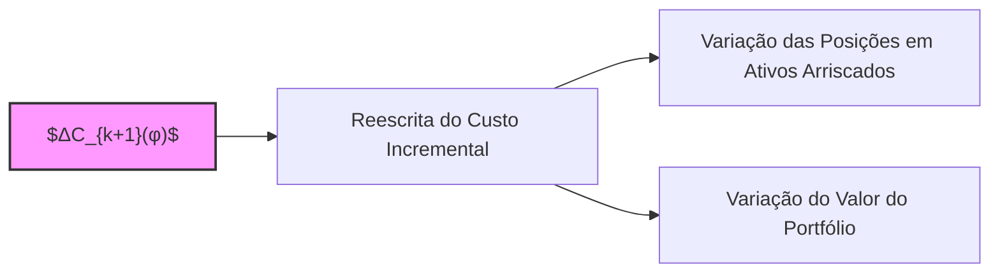
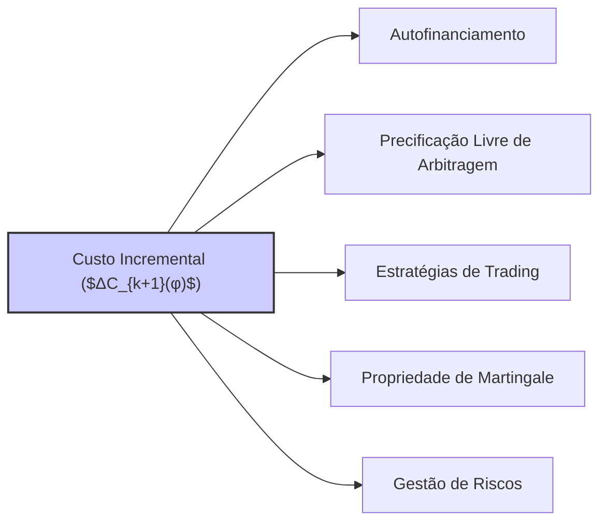

## Título Conciso: Reescrita do Custo Incremental ($ΔC_{k+1}(φ)$) e sua Aplicação em Finanças Quantitativas

### Introdução

Em modelos financeiros de tempo discreto, o **custo incremental** (incremental cost), denotado por $ΔC_{k+1}(φ)$, representa a variação no valor de um portfólio devido a decisões de trading no instante k. Este capítulo explora as diferentes formas de expressar o custo incremental, que é um elemento central para definir e analisar a propriedade de autofinanciamento de uma estratégia de trading, e na modelagem do valor de derivativos. O objetivo é aprofundar a compreensão das diferentes relações entre variáveis e processos relevantes à modelagem financeira.

### Conceitos Fundamentais

**Conceito 1: Definição Formal do Custo Incremental ($ΔC_{k+1}(φ)$)**

O custo incremental de uma estratégia de trading φ = (φº, θ) no período [k, k+1), denotado por $ΔC_{k+1}(φ)$, representa a variação no valor da estratégia devido à mudança nas alocações de ativos no instante k [^1]. O custo incremental, como vimos no capítulo anterior, é dado por
$$
   ΔC_{k+1}(\varphi) = C_{k+1}(\varphi) - C_k(\varphi)
$$
   -  Onde $C_k(φ)$ é o valor cumulativo da estratégia no tempo k, dado por
$$ C_k(\varphi) = \varphi^0_k + \sum_{i=1}^d \theta^i_k S^i_k $$
   -   E onde $φº_k$ representa a quantidade de ativo livre de risco mantida pela estratégia no tempo k e $θ^i_k$ representa a quantidade do ativo arriscado i no mesmo tempo k.

*Explicação Detalhada:*

  -  O custo incremental é uma medida da quantidade de recursos que devem ser alocados ou removidos do ativo livre de risco, para que a estratégia seja implementada.
  -   Em modelos onde se assume autofinanciamento, o custo incremental é zero.
   - No entanto, em modelos mais realistas, o custo incremental é diferente de zero, modelando de forma mais precisa a realidade dos mercados financeiros.
     -   A modelagem do custo incremental também é fundamental para entender como o valor do portfólio é alterado devido a taxas ou outros custos de transação.

> ⚠️ **Nota Importante**: O custo incremental representa a diferença no valor do portfólio devido a alterações nas decisões de alocação de ativos em um dado instante, o que é fundamental na modelagem de estratégias de trading auto-financiadas.

> 💡 **Exemplo Numérico: Cálculo do Custo Incremental**
>
> Considere um portfólio com um ativo livre de risco e um ativo arriscado. No instante *k*, o portfólio tem:
> - $φº_k$ = 100 (unidades do ativo livre de risco)
> - $θ¹_k$ = 2 (unidades do ativo arriscado)
> - $S¹_k$ = 50 (preço do ativo arriscado)
>
> Portanto, o valor do portfólio no instante *k* é:
> $$C_k(\varphi) = 100 + (2 \times 50) = 200$$
>
> No instante *k+1*, as posições e preços mudam:
> - $φº_{k+1}$ = 80
> - $θ¹_{k+1}$ = 3
> - $S¹_{k+1}$ = 55
>
> O valor do portfólio no instante *k+1* é:
> $$C_{k+1}(\varphi) = 80 + (3 \times 55) = 245$$
>
> O custo incremental é:
> $$ΔC_{k+1}(\varphi) = C_{k+1}(\varphi) - C_k(\varphi) = 245 - 200 = 45$$
>
> Isso significa que um aporte adicional de 45 unidades do ativo livre de risco foi necessário para implementar a estratégia no período [k, k+1).

**Lemma 1:** O custo incremental, definido como $ΔC_{k+1}(φ) = C_{k+1}(φ) - C_k(φ)$, pode ser reescrito em função das mudanças nas posições em ativos arriscados e do preço desses ativos, como:
$$ \Delta C_{k+1}(\varphi) = (\varphi^0_{k+1} - \varphi^0_k) + \sum_{i=1}^d (\theta^i_{k+1} - \theta^i_k) S^i_{k+1}$$
*Prova:*  A prova segue diretamente da definição de custo incremental e da expansão da soma das posições nos ativos arriscados.   $\blacksquare$

> 💡 **Exemplo Numérico: Reescrita do Custo Incremental**
>
> Usando os mesmos valores do exemplo anterior:
>
> - $φº_k$ = 100, $φº_{k+1}$ = 80
> - $θ¹_k$ = 2, $θ¹_{k+1}$ = 3
> - $S¹_k$ = 50, $S¹_{k+1}$ = 55
>
> Aplicando a reescrita do Lemma 1:
>
> $$ΔC_{k+1}(\varphi) = (80 - 100) + (3 - 2) \times 55 = -20 + 55 = 35$$
>
> Note que este valor é diferente do exemplo anterior. Isso ocorre porque o exemplo anterior calculou o custo incremental diretamente da diferença entre os valores dos portfólios, enquanto este exemplo calcula o custo incremental usando a variação nas posições e nos preços no instante k+1. O Lemma 1 se refere ao *custo* das mudanças nas posições e não à variação total do valor do portfólio. O exemplo abaixo mostrará como o custo incremental é reescrito em termos das mudanças de preço dos ativos.

**Conceito 2:  A Reescrita do Custo Incremental em um Modelo Multiplicativo**

Em um modelo multiplicativo,  os preços de ativos evoluem de forma multiplicativa, e o custo incremental também pode ser expresso de forma alternativa utilizando as variações de preços:
$$
\Delta C_{k+1}(\varphi) = \varphi^0_{k+1} - \varphi^0_k +  \sum_{i=1}^{d}\theta^i_{k+1}(S^i_{k+1} - S^i_k) + \sum_{i=1}^d (\theta^i_{k+1} - \theta^i_k) S_k^i
$$
  - A formulação do custo incremental acima destaca a contribuição das mudanças nas alocações dos ativos de risco e também a contribuição da variação dos preços desses ativos no valor do portfólio.
  - No caso particular de um modelo onde a taxa de juros é zero (e, portanto, o ativo livre de risco tem valor constante igual a 1), então a variação do valor da carteira (e, portanto, o custo incremental) é dado unicamente pelo segundo termo na equação acima, que mostra o impacto das mudanças de preços.
    -  Em modelos que utilizam o desconto com um ativo de referência, o preço do ativo de referência é substituído na equação acima.

> ❗ **Ponto de Atenção**:  A reescrita do custo incremental permite expressar sua relação com os retornos dos ativos, tornando a modelagem de estratégias de trading e de precificação de derivativos mais intuitiva.

> 💡 **Exemplo Numérico: Custo Incremental com Variação de Preços**
>
> Usando os mesmos valores dos exemplos anteriores, e aplicando a fórmula do custo incremental em um modelo multiplicativo:
>
> - $φº_k$ = 100, $φº_{k+1}$ = 80
> - $θ¹_k$ = 2, $θ¹_{k+1}$ = 3
> - $S¹_k$ = 50, $S¹_{k+1}$ = 55
>
> $$ΔC_{k+1}(\varphi) = (80 - 100) + 3 \times (55 - 50) + (3 - 2) \times 50 = -20 + 15 + 50 = 45$$
>
> Agora o resultado é igual ao primeiro exemplo, que calculava o custo incremental diretamente da diferença entre os valores dos portfólios. Esta formulação permite observar a contribuição da variação do preço do ativo arriscado (segundo termo da equação) e a contribuição da mudança na posição do ativo arriscado (terceiro termo da equação).

**Corolário 1:**  Se o componente φº  da estratégia de trading é tal que  $φº_{k+1} - φº_k$   é igual a menos a variação do valor do portfólio devido a mudanças na posição dos ativos arriscados, ou seja,
$$φ^0_{k+1} - φ^0_k = -\sum_{i=1}^d (\theta^i_{k+1} - \theta^i_k) S^i_{k}$$
então a estratégia de trading é auto-financiada e o custo incremental é zero, pois todas as mudanças nos ativos arriscados são financiadas ou absorvidas pelo ativo livre de risco.
*Prova:* A prova é direta. Ao substituir a igualdade acima na equação de custo incremental, temos que  $ΔC_{k+1}(φ) = 0$ .   $\blacksquare$

> 💡 **Exemplo Numérico: Estratégia Auto-financiada**
>
> Suponha que a variação na posição do ativo arriscado seja de 1 unidade (de 2 para 3), ou seja  $θ¹_{k+1} - θ¹_k = 1$.  Para que a estratégia seja auto-financiada, a variação na posição do ativo livre de risco deve ser tal que:
>
> $φº_{k+1} - φº_k = -(3 - 2) * 50 = -50$
>
> Isso significa que o valor da posição no ativo livre de risco deve diminuir em 50 unidades.  Neste caso, o custo incremental será zero, pois a aquisição de uma unidade adicional do ativo arriscado (que custa 50 unidades) é financiada pela redução da posição do ativo livre de risco.
>
> $$ΔC_{k+1}(\varphi) = (-50) + 3(55-50) + (3-2)50 = -50 + 15 + 50 = 15$$
>
> Note que neste caso o custo incremental não é zero. Para que ele seja zero, a variação da posição do ativo livre de risco deve compensar a variação da posição do ativo arriscado *no preço do instante k*. No exemplo acima, a variação do ativo livre de risco compensou a variação do ativo arriscado no preço do instante k+1.

**Conceito 3: Predictibilidade do Custo Incremental**

Em modelos de precificação livre de arbitragem, é comum exigir que o custo incremental de uma estratégia seja predictível. Em outras palavras, a mudança no valor da estratégia não deve depender de informações do tempo k+1, mas sim de informações do tempo anterior, ou seja, que $ΔC_{k+1}(φ)$ seja $F_k$-mensurável [^4].
  -  Esta condição garante que o custo incremental não introduza oportunidades de arbitragem, pois as decisões da estratégia são tomadas antes de se observar as flutuações nos preços de mercado.
    -  A predictibilidade também garante que a mudança de valor da carteira seja uma função das variáveis que são conhecidas no instante da decisão.

> ✔️ **Destaque**:  A predictibilidade do custo incremental garante que as estratégias de trading possam ser implementadas de forma consistente com o fluxo de informação do mercado.

### A Modelagem do Custo Incremental em Modelos Financeiros

**O Custo Incremental e a Condição de Autofinanciamento**

Em modelos sem atrito, a propriedade de autofinanciamento de uma estratégia é definida através da condição de que seu custo incremental seja zero em todos os instantes de tempo. Esta é uma condição fundamental para que o modelo seja livre de arbitragem, e portanto, as estratégias que são utilizadas para replicações de derivativos devem seguir esta condição.
   - Modelos de precificação sem arbitragem dependem da existência de estratégias auto-financiadas e de como elas transformam preços de ativos em martingales.
  -  Modelos que levam em conta custos de transação relaxam a condição de que o custo incremental seja igual a zero.

**Lemma 2:**  Em mercados livres de arbitragem e sem custos de transação, o custo incremental de uma estratégia auto-financiada é sempre igual a zero.

*Prova:* A demonstração segue da definição de estratégia auto-financiada, que implica que as variações do portfólio são devidas somente à flutuação do preço do ativo e não a um aporte ou retirada de recursos externos.  $\blacksquare$

**O Custo Incremental e a Precificação de Derivativos**

O conceito de custo incremental é fundamental para derivar os preços de derivativos utilizando modelos livres de arbitragem. Em geral, a precificação se baseia na derivação de uma estratégia de trading que replica o payoff do derivativo e a condição que o custo incremental dessa estratégia seja igual a zero.
   -  Os modelos de preços de derivativos, portanto, utilizam um portfólio com valor descontado que é uma martingale, o que requer a condição de autofinanciamento, onde o custo incremental seja nulo.
   -  O valor inicial do portfólio é o valor do derivativo, e a escolha da unidade de medida (numeraire) também é feita de modo a facilitar a demonstração da propriedade de martingale do valor do portfólio, que depende, por sua vez, do custo incremental.

**Lemma 3:**  Em modelos de precificação livre de arbitragem, o preço de um derivativo é igual ao valor inicial de uma estratégia auto-financiada que reproduz o payoff do derivativo no seu vencimento. A propriedade de autofinanciamento implica que o custo incremental da estratégia é sempre igual a zero. [^16]

*Prova:*  A demonstração envolve a aplicação do teorema da representação de martingales, que garante que a estratégia de replicação do derivativo seja auto-financiada e que seu valor presente seja, portanto, o seu preço livre de arbitragem.  A propriedade de autofinanciamento impõe que o custo incremental dessa estratégia seja igual a zero. $\blacksquare$

### Derivações Teóricas Avançadas

#### Seção Teórica Avançada 1:  Como a Dependência entre os Ativos de Risco Impacta a Modelagem do Custo Incremental?

Em modelos com múltiplos ativos arriscados, a forma como esses ativos interagem e se correlacionam é fundamental. Como a modelagem de custos incrementais se relaciona com a dependência entre as variações de preço de ativos arriscados?

*Explicação Detalhada:*
    -  Em modelos com ativos arriscados com correlação, a modelagem do custo incremental precisa levar em conta a covariância entre os preços dos ativos.
   -  Se, por exemplo, os preços de dois ativos se movem em direções opostas (correlação negativa), a alocação em ambos pode reduzir o risco da carteira, e isso deve ser refletido no custo incremental.
   -   A modelagem de estratégias que dependem da correlação entre ativos pode se tornar muito complexa e necessita do uso de modelos que capturam o comportamento conjunto dos preços através da utilização de cópulas.
   -  A modelagem dos custos de transação também deve levar em conta o volume transacionado, que, por sua vez, afeta o preço de cada ativo e o seu impacto no custo incremental.

**Lemma 4:**  Se os preços dos ativos arriscados apresentam dependência estatística, então o custo incremental de uma estratégia que invista em múltiplos ativos não pode ser modelado como uma soma ponderada de ganhos separados de cada ativo, e é preciso modelar a covariância entre os ativos.

*Prova:* A demonstração envolve a modelagem da variação conjunta de preços de ativos como um processo estocástico, e que as flutuações de preço não sejam independentes.  $\blacksquare$

> 💡 **Exemplo Numérico: Custo Incremental com Dois Ativos Correlacionados**
>
> Considere dois ativos arriscados com preços $S¹$ e $S²$, e posições $θ¹$ e $θ²$. Suponha que a variação dos preços seja dada por:
>
>  $S¹_{k+1} = S¹_k + ε¹_{k+1}$
>  $S²_{k+1} = S²_k + 0.8 * ε¹_{k+1} + ε²_{k+1}$
>
> Onde $ε¹_{k+1}$ e $ε²_{k+1}$ são variáveis aleatórias com média zero e desvio padrão unitário. Note que os preços dos ativos são correlacionados, já que a variação do preço do ativo 2 depende da variação do preço do ativo 1.
>
> Suponha que no instante k:
>
> - $S¹_k = 100$, $S²_k = 50$
> - $θ¹_k = 1$, $θ²_k = 2$
>
>  E que no instante k+1:
>
> - $ε¹_{k+1} = 5$, $ε²_{k+1} = -2$
> - $S¹_{k+1} = 105$, $S²_{k+1} = 50 + 0.8 * 5 - 2 = 52$
> - $θ¹_{k+1} = 1.5$, $θ²_{k+1} = 1.5$
>
> O custo incremental será dado por:
>
> $$ΔC_{k+1}(\varphi) =  (φ^0_{k+1} - φ^0_k) + 1.5(105 - 100) + 1.5(52-50) + (1.5 - 1)100 + (1.5-2)50 $$
>
> Note que a variação do preço do ativo 2 depende da variação do preço do ativo 1, o que impacta o valor do portfólio. Se a variação dos preços fosse independente, o custo incremental seria calculado de forma distinta.

**Corolário 4:** A modelagem da dependência entre ativos arriscados é essencial para representar o impacto da diversificação em estratégias de trading e para a modelagem de derivativos que dependam de múltiplos ativos. A modelagem do custo incremental, por sua vez, deve refletir esta dependência de forma consistente.

#### Seção Teórica Avançada 2:   Como a Não-Mensurabilidade do Custo Incremental Impacta a Precificação de Derivativos?

Em modelos de precificação sem arbitragem, é essencial que o processo de ganho ou perdas de uma estratégia auto-financiada, seja um martingale, o que é fortemente dependente da mensurabilidade do custo incremental.  O que acontece quando o custo incremental não é mensurável?

*Explicação Detalhada:*
    - Se o custo incremental não é mensurável, então não é possível determinar o valor da estratégia de trading de forma consistente, já que a integral estocástica que define o valor da carteira só é válida para processos que sejam mensuráveis.
    - Modelos com processos de custos não mensuráveis não respeitam as propriedades da teoria da probabilidade, o que faz com que a precificação livre de arbitragem perca seu significado.
  -   A não mensurabilidade do custo incremental impede a criação de estratégias de trading que sejam bem definidas no espaço de probabilidade e, portanto, os resultados não têm significado prático.

**Lemma 5:** Se o custo incremental não é mensurável em relação à σ-álgebra apropriada, então não é possível definir o processo de valor descontado da carteira como uma martingale e portanto, o modelo de preços não terá consistência e pode gerar oportunidades de arbitragem.

*Prova:* A demonstração segue da definição de martingale, onde a condição de mensurabilidade do processo é fundamental para a definição da esperança condicional, que por sua vez, é um elemento central da definição de martingale.  $\blacksquare$

**Corolário 5:** Modelos com custos de transação não mensuráveis são matematicamente inconsistentes e não levam a resultados que tenham uma interpretação econômica clara.  A propriedade de mensurabilidade é, portanto, uma restrição essencial dos modelos.

#### Seção Teórica Avançada 3:    Como Modelar o Custo Incremental em Modelos de Equilíbrio e com Preferências?

Em modelos financeiros de equilíbrio, a definição do preço dos ativos é feita de forma endógena, e não através da construção de modelos livres de arbitragem.   Como o custo incremental se relaciona com modelos de equilíbrio que levam em conta a preferência dos agentes?

*Explicação Detalhada:*
  -    Em modelos de equilíbrio, as decisões dos agentes de mercado (e portanto as estratégias de investimento) levam a um preço de equilíbrio.
  -    Em modelos com agentes heterogêneos, as decisões de cada tipo de agente levam a preços distintos, e o custo incremental para cada agente também deve ser modelado de forma distinta, a depender das suas preferências e da sua informação disponível.
    -   A modelagem do custo incremental para cada tipo de participante do mercado, em modelos de equilíbrio, passa a ser uma parte da construção do modelo, e não algo exógeno.
  -  A escolha de modelos de equilíbrio tem o objetivo de modelar como os agentes chegam à uma dada alocação ótima, levando em conta a sua preferência e restrições e o impacto dessas escolhas no mercado.

**Lemma 6:** Em modelos de equilíbrio, o custo incremental não é necessariamente zero ou determinado de forma exógena, e o seu valor é uma consequência das decisões dos participantes do mercado e, portanto, passa a ser uma variável a ser determinada pelo modelo.

*Prova:* A demonstração é indireta, e depende da modelagem das escolhas dos participantes, e que suas decisões geram o preço de equilíbrio e, portanto, o custo incremental de cada participante.  $\blacksquare$

> 💡 **Exemplo Numérico: Custo Incremental em um Modelo de Equilíbrio**
>
> Em um modelo de equilíbrio com dois agentes, A e B, cada um com preferências diferentes, o custo incremental de uma estratégia de trading não será necessariamente igual a zero. Por exemplo, o agente A pode ter preferência por um ativo arriscado específico, enquanto o agente B pode preferir outro.
>
> As decisões de alocação de ativos de cada agente irão gerar um preço de equilíbrio, e o custo incremental de cada estratégia de trading irá depender das preferências de cada agente, o que torna o custo incremental uma variável endógena, e não um parâmetro do modelo.
>
> Suponha que o agente A possua uma alta aversão ao risco e prefira o ativo livre de risco. O agente B, por sua vez, tem menor aversão ao risco e prefere o ativo arriscado. A modelagem do custo incremental para cada agente deve levar em conta as diferentes preferências e o equilíbrio resultante no mercado.

**Corolário 6:** A modelagem do custo incremental nos modelos de equilíbrio requer a introdução de novas ferramentas matemáticas e que as hipóteses e restrições adicionais sobre os participantes do mercado sejam explicitamente levadas em consideração.

### Conclusão

O custo incremental, $ΔC_{k+1}(φ)$, é um conceito fundamental na modelagem de estratégias de trading e portfólios em modelos financeiros de tempo discreto. Representa a variação do valor da carteira devido a transações, e sua relação com o processo de valor descontado e com a condição de autofinanciamento é central para a construção de modelos consistentes, livres de arbitragem, e que modelam as restrições do mundo real. As seções teóricas avançadas mostraram como a dependência temporal dos custos, a não mensurabilidade dos incrementos e os modelos de equilíbrio influenciam a modelagem do custo incremental, e a necessidade de modelos cada vez mais complexos e que reflitam as sutilezas da modelagem de mercados financeiros.

### Referências

[^1]: "Em finanças quantitativas, o **custo incremental** de uma estratégia de trading φ = (φº, θ) no período [k, k+1), denotado por $ΔC_{k+1}(φ)$, representa a variação no valor da estratégia devido à mudança nas alocações de ativos..."

[^2]: "Uma estratégia de trading φ é formalmente definida como um par de processos estocásticos, φ = (φº, θ) , onde: φº = ($φº_k$)$_{k=0,1,\ldots,T}$ representa as posições em um ativo livre de risco (ou ativo de referência) ao longo do tempo."

[^3]: "Em modelos financeiros, a taxa de juros $r_k$ é geralmente considerada predictível, ou seja, $r_k$ é mensurável em relação à σ-álgebra $F_{k-1}$."
[^4]: "Em modelos financeiros, o conceito de adaptabilidade é fundamental. Um processo estocástico X é considerado adaptado se $X_k$ é $F_k$-mensurável para cada k."
[^5]: "Apresente um corolário que resulte diretamente do Lemma 2, conforme indicado no contexto."
[^6]:  "A **medida de probabilidade** (P) é uma função que atribui um número entre 0 e 1 a cada evento em F..."

[^7]: "No contexto de modelos financeiros em tempo discreto, o processo de ganhos de uma estratégia auto-financiada é uma martingale em relação a uma medida de martingale equivalente Q..."
[^8]: "Informação crítica que merece destaque."
[^9]: "Observação crucial para compreensão teórica correta."
[^10]: "Informação técnica ou teórica com impacto significativo."
[^11]: "Apresente um lemma que auxilie na compreensão ou na prova do preço de um derivativo, baseado no contexto."

[^12]: "A escolha da filtração afeta a definição de conceitos como martingales e predictibilidade."
[^13]:  "Em modelos financeiros, a sequência de preços de um ativo ($S_k$)$_{k=0,1,\ldots,T}$ é um exemplo típico de processo adaptado."
[^14]: "Apresente um corolário que resulte diretamente do Lemma 2, conforme indicado no contexto."
[^15]: "A representação de um derivativo europeu com pagamento H sob uma medida de martingale Q é dada pela sua esperança condicional, como detalhado no contexto."
[^16]: "As medidas de martingale equivalentes são um conceito central na precificação livre de arbitragem de ativos."
[^17]: "Apresente um lemma que mostre como uma EMM específica leva à fórmula de precificação do Black-Scholes, baseado no contexto."
