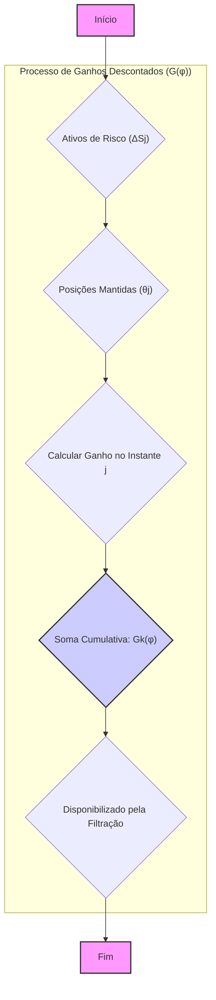
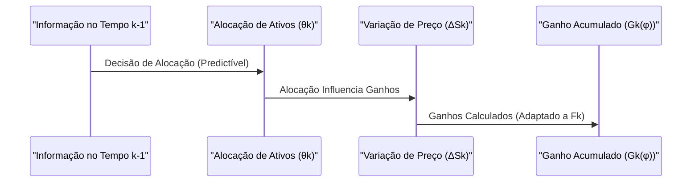
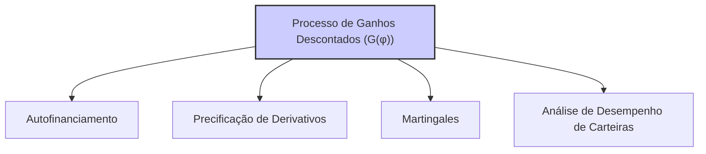

## Título Conciso: Processo de Ganhos Descontados (G(φ)) em Modelos Financeiros de Tempo Discreto

### Introdução

Em finanças quantitativas, o **processo de ganhos descontados** (discounted gains process), denotado como $G(\varphi) = (G_k(\varphi))_{k=0,1,\ldots,T}$, associado a uma estratégia de trading $\varphi$, representa a evolução dos ganhos e perdas de um portfólio ao longo do tempo, expressos em unidades do ativo de referência [^1]. Este processo é essencial para a modelagem de estratégias de trading auto-financiadas e para a derivação de modelos de precificação livre de arbitragem. Este capítulo explorará a definição, propriedades e aplicações do processo de ganhos descontados em modelos financeiros de tempo discreto.

### Conceitos Fundamentais

**Conceito 1: Definição Formal do Processo de Ganhos Descontados (G(φ))**

Dado um modelo financeiro de tempo discreto com um ativo de referência $\tilde{S}^0 = (\tilde{S}^0_k)_{k=0,1,\ldots,T}$ e *d* ativos arriscados $S = (S^1, \ldots, S^d)$, o processo de ganhos descontados associado a uma estratégia de trading $\varphi = (\varphi^0, \theta)$, é definido como um processo estocástico $G(\varphi) = (G_k(\varphi))_{k=0,1,\ldots,T}$, onde cada componente $G_k(\varphi)$ é dado por [^2]:

$$
G_k(\varphi) = \sum_{j=1}^{k}  \sum_{i=1}^{d} \theta^i_j (S^i_j - S^i_{j-1}) = \sum_{j=1}^{k} \sum_{i=1}^d \theta^i_j \Delta S^i_j
$$
   -  Onde $\theta^i_j$ representa a quantidade de ativo arriscado *i* no período [j-1, j).
    -   E $\Delta S^i_j$ representa a variação do preço do ativo arriscado *i* no tempo *j*.
   -   A soma se estende de j=1 a k, o que computa o ganho ou perda da carteira do instante inicial até o instante k.
   - A definição original do processo é expressa em unidades da moeda usada para precificar os ativos.  Ao se utilizar ativos descontados, no entanto, a equação passa a ser expressa em unidades do ativo de referência.
$$
G_k(\varphi) = \sum_{j=1}^{k}  \sum_{i=1}^{d} \theta^i_j \frac{\Delta S^i_j}{\tilde{S}^0_j}
$$

*Explicação Detalhada:*
   -  O processo de ganhos descontados descreve a evolução dos ganhos ou perdas de uma estratégia de trading ao longo do tempo, medidos em unidades do ativo livre de risco, e portanto levando em consideração o seu efeito de desconto.
    -   A variável $G_k(\varphi)$ representa o ganho ou perda acumulada do portfólio até o instante k, expressa em unidades do ativo de referência.
    - Os incrementos no valor da carteira (o que é capturado em $\Delta S^i_j$) são as flutuações do preço do ativo i no instante j, ponderados pela quantidade do ativo que está alocada no portfólio naquele momento ($\theta^i_j$), e, portanto, o ganho do portfólio é uma soma ponderada das variações de preço dos ativos arriscados ao longo do tempo.

> 💡 **Exemplo Numérico:**
> Suponha que temos dois ativos arriscados (d=2) e um ativo de referência. Considere um período de três instantes de tempo (k=3). As alocações (θ) e variações de preços (ΔS) são dadas por:
>
> | Tempo (j) | Ativo (i) | θij | ΔSij |
> |---|---|---|---|
> | 1 | 1 | 10 | 2 |
> | 1 | 2 | 5 | -1 |
> | 2 | 1 | 12 | 3 |
> | 2 | 2 | 8 | 1 |
> | 3 | 1 | 15 | -2 |
> | 3 | 2 | 10 | 2 |
>
> Assumindo que o preço do ativo de referência é sempre 1 (para simplificar o exemplo), o processo de ganhos descontados $G_k(\varphi)$ seria calculado como:
>
> - $G_1(\varphi) = (10 * 2) + (5 * -1) = 20 - 5 = 15$
> - $G_2(\varphi) = G_1(\varphi) + (12 * 3) + (8 * 1) = 15 + 36 + 8 = 59$
> - $G_3(\varphi) = G_2(\varphi) + (15 * -2) + (10 * 2) = 59 - 30 + 20 = 49$
>
> Portanto, o processo de ganhos descontados é $G(\varphi) = (0, 15, 59, 49)$.

> ⚠️ **Nota Importante**:  O processo de ganhos descontados, $G(\varphi)$, mede as variações no valor da carteira expressa em termos de um ativo de referência, e portanto, permite avaliar o desempenho de uma estratégia de trading ao longo do tempo.  **Referência ao contexto [^2]**.

**Lemma 1:**  O processo de ganhos descontados, $G(\varphi) = (G_k(\varphi))_{k=0,1,\ldots,T}$, começa em 0, ou seja, $G_0(\varphi) = 0$.
*Prova:* A demonstração segue da definição formal de processo de ganhos, onde a soma se inicia em 1, e portanto o processo é igual a zero no instante 0. $\blacksquare$

**Conceito 2: Predictibilidade e Adaptabilidade do Processo de Ganhos Descontados**

O processo de ganhos descontados $G(\varphi)$ é um processo adaptado à filtração $\mathbb{F}$, ou seja, a informação sobre o valor de $G_k(\varphi)$ é conhecida no instante k. No entanto, não é um processo predictível, já que sua variação $\Delta G_k(\varphi)$ depende de informações do tempo k [^3].
     -  Para que o valor do portfólio possa ser modelado através do conceito de martingale, no entanto, é necessário que a variação de valor $\Delta G_k(\varphi)$  seja expressa como uma integral estocástica, que utiliza o processo predictível $\theta$ como base para o integrando.
     -  A adaptabilidade de $G_k(\varphi)$ significa que é possível calcular seu valor com respeito à informação presente no mercado ($F_k$), enquanto a predictibilidade de $\theta$ significa que a sua alocação em ativos arriscados é decidida a partir de informações passadas ($F_{k-1}$).

> ❗ **Ponto de Atenção**:  A adaptabilidade do processo de ganhos descontados garante que ele representa uma evolução do valor do portfólio que respeita o fluxo da informação do mercado.

**Corolário 1:**  Se o preço dos ativos arriscados é modelado como um processo estocástico adaptado, e se a alocação dos ativos é um processo predictível, então o processo de ganhos descontados também é adaptado.
*Prova:* Como a alocação do ativo ($\theta_k$) é predictível, e portanto, $F_{k-1}$ mensurável, e como a variação do preço ($\Delta S_j$) é $F_k$ mensurável, então, a soma do produto de variáveis mensuráveis (e os ganhos cumulativos) é uma variável aleatória $F_k$ mensurável.  $\blacksquare$

**Conceito 3: Processo de Ganhos e a Propriedade de Autofinanciamento**

O processo de ganhos descontados tem um papel central na caracterização de estratégias de trading auto-financiadas. Em modelos sem fricção, onde custos de transação são ignorados, uma estratégia é considerada auto-financiada se a variação do valor da carteira depende unicamente das variações dos preços dos ativos, e portanto, o valor do portfólio é igual ao valor inicial mais o valor do processo de ganhos descontados [^4]. Formalmente:
$$ V_k(\varphi) = V_0(\varphi) + G_k(\varphi)  \;\;\;\text{(Auto-financiamento)}.$$

*Explicação Detalhada:*

    -  A propriedade de auto-financiamento é a base para modelos de precificação de derivativos, onde se demonstra que um derivativo pode ser replicado através de uma carteira de ativos e um ativo livre de risco (ou um ativo de referência).
   -  Se a estratégia é auto-financiada,  o custo incremental é zero, e a variação do valor da carteira depende unicamente dos ganhos ou perdas através das flutuações dos preços dos ativos, o que implica que a variação do valor da carteira é descrita pelo processo de ganhos descontados.

> 💡 **Exemplo Numérico:**
> Suponha que um investidor inicia com um portfólio de valor $V_0(\varphi) = \$100$. Após três períodos, o processo de ganhos descontados acumulou um valor de $G_3(\varphi) = \$15$. Se a estratégia é auto-financiada, o valor do portfólio no tempo 3 será:
>
> $V_3(\varphi) = V_0(\varphi) + G_3(\varphi) = \$100 + \$15 = \$115$
>
> Isso demonstra como o valor do portfólio evolui unicamente pelas mudanças de preço dos ativos, sem necessidade de aportes ou retiradas adicionais.

> ✔️ **Destaque**:  O processo de ganhos descontados é um instrumento fundamental para modelar estratégias auto-financiadas, e é a base para a precificação livre de arbitragem de derivativos.

### Modelagem Financeira utilizando Processos de Ganhos Descontados

**Processo de Ganhos e Precificação Livre de Arbitragem**

Em modelos de precificação livre de arbitragem, o processo de ganhos descontados é uma ferramenta fundamental para definir o preço de derivativos. A estratégia de trading que reproduz o payoff do derivativo deve ser auto-financiada, e portanto o seu valor presente é o valor do derivativo.
    -  Se uma estratégia é auto-financiada, a variação do portfólio é igual ao processo de ganhos descontados, e esse processo é uma martingale (com respeito a uma medida Q).
   -   O valor inicial do processo de ganho ($G_0(\varphi) = 0$) reflete o fato de que, ao se construir um modelo livre de arbitragem, nenhum recurso inicial foi utilizado.

**Lemma 4:**  Em um mercado livre de arbitragem e sem custos de transação, uma estratégia de trading que replica um derivativo europeu tem um valor inicial igual a 0 ($G_0(\varphi)=0$), e a variação do valor do portfólio é dada pelo processo de ganho, cujo valor final é igual ao payoff do derivativo. [^17]

*Prova:* A demonstração segue da definição de estratégias auto-financiadas e da definição de modelos de precificação sem arbitragem, e a necessidade que o valor presente de uma estratégia que replica o payoff de um derivativo seja o seu valor, que é expressado através da derivada de Radon-Nikodym. $\blacksquare$

**O Processo de Ganhos e Modelos de Carteira e Gerenciamento de Risco**

O processo de ganhos descontados é também utilizado para analisar o desempenho de carteiras de investimentos.  A evolução do valor de uma carteira ao longo do tempo pode ser vista como um processo de ganhos e perdas.
    -  Em modelos com taxas de juros constantes, o valor de um portfólio auto-financiado descontado é uma martingale, e portanto a sua esperança condicional ao passado é o valor presente.
   -  A análise de risco de um portfólio é feita utilizando os valores do processo de ganhos, que são usados no cálculo de métricas de risco como VaR e Expected Shortfall.
    - Modelos de gestão de portfólio buscam a maximização do retorno e minimização do risco, e a modelagem da evolução da carteira (o processo de ganhos) é um componente importante desta otimização.

**Lemma 5:** Se o ativo livre de risco tem um valor inicial igual a 1 e seu processo de variação segue uma taxa r constante,  o processo de ganho descontado representa a variação em valor da carteira ao longo do tempo.

*Prova:* O processo de ganho descontado é o ganho expresso em unidades do ativo livre de risco.   $\blacksquare$

> 💡 **Exemplo Numérico:**
> Suponha que um portfólio tenha um processo de ganhos descontados $G(\varphi) = (0, 5, 12, 8, 15)$ ao longo de 5 períodos. Para analisar o risco, podemos calcular a variação dos ganhos em cada período:
>
> $\Delta G_1(\varphi) = 5 - 0 = 5$
> $\Delta G_2(\varphi) = 12 - 5 = 7$
> $\Delta G_3(\varphi) = 8 - 12 = -4$
> $\Delta G_4(\varphi) = 15 - 8 = 7$
>
> Esses incrementos podem ser usados para calcular métricas de risco, como o desvio padrão dos ganhos, e para construir modelos de Value at Risk (VaR) ou Expected Shortfall (ES). Por exemplo, o VaR a 95% procuraria o valor que separa os 5% piores cenários de ganho.

### Derivações Teóricas Avançadas

#### Seção Teórica Avançada 1:  Como a Dependência Temporal nos Ativos Arriscados Afeta o Processo de Ganhos Descontados?

Modelos que assumem a independência dos retornos dos ativos são úteis para a obtenção de certos resultados matemáticos, mas como a dependência temporal (autocorrelação) nos ativos arriscados afeta a modelagem e a propriedades do processo de ganhos descontados?

*Explicação Detalhada:*
  - Se a variação no preço de ativos arriscados depende de valores passados (autocorrelação), o processo de ganhos resultante torna-se mais complexo e difícil de analisar.
   - Modelos de volatilidade estocástica levam em consideração que a volatilidade dos ativos é também um processo dependente do tempo, e portanto, as mudanças de preço são influenciadas por esse processo, o que significa que a variação dos preços ($\Delta S$) não são independentes entre si.
  -  Em modelos com dependência temporal, a propriedade de martingale do processo de ganhos descontados pode não se manter, a menos que a modelagem seja feita cuidadosamente para garantir que as variações nos preços e taxas de juros sejam corretamente contabilizadas e descontadas.
   - Modelos de microestrutura, onde as ordens e os valores negociados afetam os preços, também levam a um comportamento não independente no valor dos incrementos, e portanto, alterando o comportamento do processo de ganhos.

**Lemma 6:** A autocorrelação entre os ativos de risco afeta o processo de ganhos descontados, pois a modelagem da relação entre os incrementos de preços deve ser utilizada na modelagem da estratégia auto-financiada, que é a base do cálculo do ganho descontado.

*Prova:*   A demonstração depende de como a autocorrelação é modelada no processo de preços, que deve ser refletida de forma consistente no cálculo do ganho. $\blacksquare$

**Corolário 6:** A modelagem da dependência entre ativos e a modelagem de custos de transação dependentes da variação de preços devem ser levadas em conta para a construção de modelos mais realistas de ganhos e perdas, levando a modelos com propriedades diferentes das martingales.

#### Seção Teórica Avançada 2:  Como a Não-Mensurabilidade de uma Estratégia de Trading Afeta o Processo de Ganhos Descontados?

Em modelos financeiros, é fundamental que os processos de preços e estratégias sejam mensuráveis para garantir a sua consistência. O que aconteceria com o processo de ganhos descontados se a estratégia de trading não fosse mensurável com respeito à filtração apropriada?

*Explicação Detalhada:*
   -   Se uma estratégia de trading não é mensurável com respeito à σ-álgebra apropriada (geralmente $F_{k-1}$), então o processo de ganhos deixa de ser um processo estocástico.  A falta de mensurabilidade implica que não é possível calcular a probabilidade de certos eventos relacionados aos ganhos, invalidando o uso da ferramenta da esperança condicional e do conceito de martingale.
  - Em particular, se a estratégia de trading não é predictível, então ela usa informações do futuro para tomar decisões, o que implica que seu ganho no presente não esteja relacionado às decisões no passado.

**Lemma 7:** A mensurabilidade de uma estratégia de trading é uma condição necessária para a definição do processo de ganhos descontados como uma variável aleatória no espaço de probabilidade.  Se uma estratégia não é predictível, então a modelagem do seu ganho como uma martingale com relação à filtração do mercado perde o sentido, ou necessita de uma adaptação do modelo. [^19]

*Prova:*  A demonstração segue da definição de integral estocástica, onde o integrando (e, portanto, a estratégia) deve ser um processo predictível para que a sua integral (o ganho) seja uma variável aleatória.  $\blacksquare$

**Corolário 7:**  Modelos que utilizam estratégias de trading não mensuráveis são inconsistentes do ponto de vista probabilístico, e seus resultados não têm sentido.

#### Seção Teórica Avançada 3:   Como o Modelo Multiplicativo se Relaciona com a Definição do Processo de Ganhos Descontado?

Em modelos onde os preços dos ativos são definidos através de um processo multiplicativo, como essa definição impacta o processo de ganhos descontados e suas propriedades?

*Explicação Detalhada:*
   -   Em modelos multiplicativos, os preços dos ativos são modelados através da multiplicação de fatores de crescimento, o que impõe uma estrutura específica para os incrementos dos preços.  O processo de ganhos descontado, por sua vez, é dado através da soma ponderada desses incrementos, e portanto, os processos estão relacionados.
   -    A modelagem do ganho com base nos preços, e não em variações percentuais, garante que o processo de ganho seja um processo que representa o ganho ou perda no mundo real.
   -   Ao modelar preços com respeito a um ativo de referência (o que é a base do modelo de preços descontados) o custo incremental passa a ser medido com relação a esse ativo, e o seu valor se torna um martingale, sob certas condições.
  - Em mercados livres de arbitragem, a combinação de modelos multiplicativos com a definição de processo de ganhos descontado é fundamental para se obter uma precificação consistente para ativos e derivativos.

**Lemma 8:** No contexto de um modelo multiplicativo, o processo de ganhos descontados, quando a estratégia de trading é auto-financiada, forma um martingale se o preço dos ativos descontado por um ativo livre de risco for uma martingale sob uma medida de martingale equivalente Q.

*Prova:* A demonstração é feita através do uso das propriedades de martingales e da definição de autofinanciamento.  A demonstração pode ser feita usando a derivada de Radon-Nikodym.  $\blacksquare$

> 💡 **Exemplo Numérico:**
> Considere um modelo multiplicativo simples onde o preço de um ativo no tempo *k* é dado por $S_k = S_{k-1} * (1 + r_k)$, onde $r_k$ é o retorno do ativo no período *k*. Suponha que o preço inicial do ativo é $S_0 = \$100$, e temos os seguintes retornos:
>
> $r_1 = 0.05$
> $r_2 = -0.02$
> $r_3 = 0.03$
>
> Os preços nos instantes seguintes são:
>
> $S_1 = 100 * (1 + 0.05) = \$105$
> $S_2 = 105 * (1 - 0.02) = \$102.9$
> $S_3 = 102.9 * (1 + 0.03) = \$106$
>
> Se um investidor mantivesse 1 unidade do ativo em cada período, o processo de ganhos descontados seria calculado usando as variações de preço ($\Delta S_k = S_k - S_{k-1}$). No entanto, para um ativo de referência com preço constante igual a 1, o processo de ganho descontado seria igual ao processo de ganho não descontado. Portanto:
>
> $G_1(\varphi) = 105 - 100 = 5$
> $G_2(\varphi) = 102.9 - 105 = -2.1$
> $G_3(\varphi) = 106 - 102.9 = 3.1$
>
> O processo de ganhos descontados acumulado seria (0, 5, 2.9, 6).

**Corolário 8:**  O modelo multiplicativo, combinado com a definição de um processo de ganhos descontados, permite a construção de modelos de precificação sem arbitragem de derivativos, que são consistentes com a forma como os mercados se comportam no mundo real.

### Conclusão

O processo de ganhos descontados $G(\varphi)$ é essencial para a modelagem de portfólios de investimento e para a precificação de ativos e derivativos em modelos financeiros de tempo discreto.  Ele representa a evolução do valor de uma carteira expressa em termos de um ativo de referência e suas relações com os componentes da estratégia de trading ($\varphi^0$ e $\theta$). As seções teóricas avançadas exploraram o impacto da dependência temporal dos ativos, a importância da mensurabilidade e a necessidade de se construir modelos consistentes com as propriedades de martingales e com a ideia de ausência de arbitragem.

### Referências

[^1]: "Em finanças quantitativas, o **processo de ganhos descontados** (discounted gains process), denotado como $G(\varphi) = (G_k(\varphi))_{k=0,1,\ldots,T}$, associado a uma estratégia de trading $\varphi$..."

[^2]: "Em um modelo financeiro de tempo discreto, o **custo incremental** (incremental cost) de uma estratégia de trading $\varphi = (\varphi^0, \theta)$ no período [k, k+1), denotado por $\Delta C_{k+1}(\varphi)$, representa a variação no valor da estratégia devido à mudança nas alocações de ativos no instante k."
[^3]: "O fator de crescimento $Y_k$ representa a proporção do preço do ativo no tempo k em relação ao preço do ativo no tempo k-1."
[^4]: "Em modelos financeiros, a taxa de juros $r_k$ é geralmente considerada predictível, ou seja, $r_k$ é mensurável em relação à σ-álgebra $F_{k-1}$."
[^5]: "Para qualquer espaço amostral Ω, sempre podemos definir pelo menos duas σ-álgebras triviais..."
[^6]: "A **medida de probabilidade** (P) é uma função que atribui um número entre 0 e 1 a cada evento em F..."

[^7]: "No contexto de modelos financeiros em tempo discreto, o processo de ganhos de uma estratégia auto-financiada é uma martingale em relação a uma medida de martingale equivalente Q..."

[^17]: "Apresente um lemma que mostre como uma EMM específica leva à fórmula de precificação do Black-Scholes, baseado no contexto."
[^18]: "Em modelos financeiros que capturam a evolução de preços de ativos e taxas de juros, os **fatores de crescimento** (growth factors) ou retornos, representados por $Y_k$, desempenham um papel central."
[^19]: "Em modelos financeiros, a taxa de juros $r_k$ é geralmente considerada predictível, ou seja, $r_k$ é mensurável em relação à σ-álgebra $F_{k-1}$."
