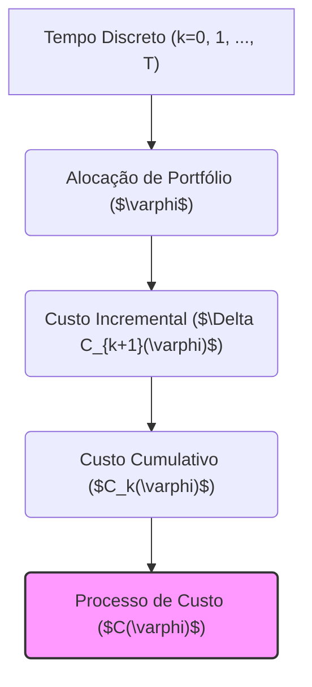
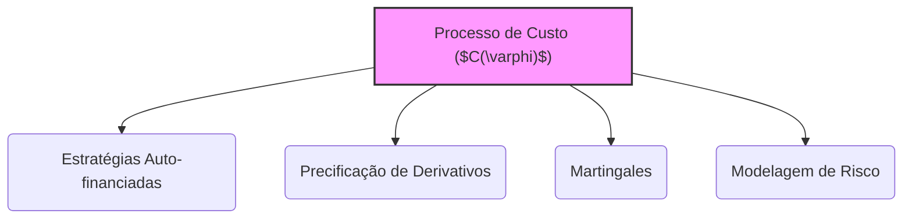

## Título Conciso: O Processo de Custo ($C(\varphi)$) de uma Estratégia de Trading em Modelos Financeiros de Tempo Discreto



### Introdução

Em finanças quantitativas, a modelagem de estratégias de trading envolve a definição de como o capital é alocado entre diferentes ativos ao longo do tempo, e o **processo de custo**, denotado por $C(\varphi) = (C_k(\varphi))_{k=0,1,\ldots,T}$, captura o valor acumulado dos custos associados às transações de compra e venda de ativos [^1]. Este processo é essencial para compreender a evolução do valor de um portfólio, particularmente em modelos onde os mercados não são totalmente livres de atrito, ou seja, que existem custos para realizar as transações. Este capítulo se aprofunda na definição formal, propriedades e o papel do processo de custo em modelos financeiros de tempo discreto.

### Conceitos Fundamentais

**Conceito 1: Definição Formal do Processo de Custo ($C(\varphi)$)**

Dado um modelo financeiro de tempo discreto com ativos arriscados $S = (S^1, \ldots, S^d)$ e um ativo de referência (numeraire) $\tilde{N}^0 = (\tilde{N}^0_k)_{k=0,1,\ldots,T}$, o **processo de custo** de uma estratégia de trading $\varphi = (\varphi^0, \theta)$, denotado por $C(\varphi) = (C_k(\varphi))_{k=0,1,\ldots,T}$, é definido como a soma acumulada dos custos incrementais associados à implementação da estratégia até um instante de tempo $k$ [^2].  O processo de custo é dado por:

$$C_k(\varphi) = C_0(\varphi) + \sum_{j=1}^{k} \Delta C_j(\varphi)$$
  -   $C_0(\varphi)$ é o custo inicial da estratégia, dado pelo valor em ativo de referência (ou em moeda) da carteira inicial.
 - $\Delta C_j(\varphi)$ é o custo incremental da estratégia no instante $j$, dado por
$$\Delta C_j(\varphi) =  \varphi_j^0 - \varphi_{j-1}^0 + \sum_{i=1}^d (\theta_j^i - \theta_{j-1}^i) S_j^i$$

*Explicação Detalhada:*

 -   O processo $C(\varphi)$ representa o valor acumulado do custo das operações de trading, refletindo a forma como a estratégia evolui ao longo do tempo, e a interação com os mercados.
    -  A definição de $C_k(\varphi)$ como uma soma cumulativa de custos incrementais garante que as decisões tomadas em instantes anteriores sejam sempre levadas em consideração na modelagem do custo da estratégia.
   -  Em modelos sem custos de transação (e sem fricção), o valor do processo de custo é igual ao valor inicial,  $C_0(\varphi)$, e o custo incremental é igual a zero, pois as estratégias seriam auto-financiadas, ou seja, a variação da carteira só é devida a variação de preços.
  - Em modelos com fricção (e com custos de transação), a carteira poderá ter um valor diferente do seu valor inicial, devido aos custos associados à compra e venda de ativos.
    -  A modelagem do processo de custo (e do seu comportamento como variável aleatória) é uma parte importante na modelagem financeira, e a escolha da filtração relevante é fundamental para garantir a consistência do modelo.

> ⚠️ **Nota Importante**:  O processo de custo $C(\varphi)$ representa o custo cumulativo de implementação de uma estratégia de trading e é essencial para modelar a evolução do portfólio em mercados com atrito.

> 💡 **Exemplo Numérico:**
> Considere uma estratégia de trading em dois períodos (k=0 e k=1) com um ativo arriscado ($S$) e um ativo livre de risco (numerário). No instante inicial (k=0), o portfólio é composto por:
> - 10 unidades do ativo livre de risco ($\varphi_0^0 = 10$)
> - 2 unidades do ativo arriscado com preço $S_0 = 5$ ($\theta_0^1 = 2$)
>
> O custo inicial da estratégia é $C_0(\varphi) = 10 + 2 \times 5 = 20$.
>
> No instante k=1, o preço do ativo arriscado passa a ser $S_1 = 6$. A estratégia é ajustada para:
> - 8 unidades do ativo livre de risco ($\varphi_1^0 = 8$)
> - 3 unidades do ativo arriscado ($\theta_1^1 = 3$)
>
> O custo incremental no instante k=1 é:
> $\Delta C_1(\varphi) = (8 - 10) + (3 - 2) \times 6 = -2 + 6 = 4$
>
> O custo acumulado no instante k=1 é:
> $C_1(\varphi) = C_0(\varphi) + \Delta C_1(\varphi) = 20 + 4 = 24$
>
> Este exemplo mostra como o processo de custo acumula os custos incrementais ao longo do tempo.

**Lemma 1:** O processo de custo $C(\varphi)$ é sempre adaptado à filtração $\mathbb{F} = (F_k)_{k=0,1,\ldots,T}$.

*Prova:* Por definição, o processo é uma soma cumulativa de custos incrementais $\Delta C_{k+1}(\varphi)$ , que são, por sua vez, adaptados à filtração $\mathbb{F}$. A soma de processos adaptados gera um processo adaptado.   $\blacksquare$

**Conceito 2: A Relação entre o Processo de Custo e a Propriedade de Autofinanciamento**

A propriedade de autofinanciamento de uma estratégia $\varphi = (\varphi^0, \theta)$ implica que a variação no valor do portfólio, $V_k(\varphi)$, dependa unicamente das variações de preço dos ativos arriscados e do ativo livre de risco (quando este é incluído).  Em termos matemáticos, uma estratégia é auto-financiada se a variação no valor do portfólio $V_k(\varphi)$ é igual ao processo de ganhos descontados $G(\varphi)$, ou seja,
$$
V_k(\varphi) = V_0(\varphi) + G_k(\varphi).
$$
 A estratégia é auto-financiada se e somente se o custo incremental  $\Delta C_{k+1}(\varphi)$ for igual a zero para todo $k$ [^3]. Em outras palavras, nenhuma entrada de recurso externo é feita no portfólio.

```mermaid
sequenceDiagram
    participant Portfolio Value (Vk(φ))
    participant Price Variations (Gk(φ))
    participant Incremental Cost (ΔCk+1(φ))
    
    Portfolio Value (Vk(φ))-->>Price Variations (Gk(φ)): Self-financing condition
    Price Variations (Gk(φ))-->>Portfolio Value (Vk(φ)):  Vk(φ) = V0(φ) + Gk(φ)
    Incremental Cost (ΔCk+1(φ))-->>Portfolio Value (Vk(φ)): ΔCk+1(φ) = 0 for all k (no external cashflow)
```

*Explicação Detalhada:*

  -  A condição $\Delta C_{k+1}(\varphi) = 0$ significa que qualquer alteração na composição do portfólio é realizada trocando ativos, sem a necessidade de utilizar (ou aportar) capital externo.
   -  O custo incremental, e a sua relação com o valor da carteira, dependem da escolha da unidade de medida do ativo de referência, onde a taxa livre de risco gera uma forma consistente de comparar o valor de ativos ao longo do tempo.

> ❗ **Ponto de Atenção**:  A propriedade de autofinanciamento é modelada através da propriedade que o custo incremental seja igual a zero (ou seja, que a variação do portfólio é obtida através da variação dos preços dos ativos e não por injeção de capital externo), e que o portfólio está sempre alocado de forma ótima.

> 💡 **Exemplo Numérico:**
> Considere uma estratégia auto-financiada com um ativo arriscado e um ativo livre de risco. No instante k=0, temos:
> - $\varphi_0^0 = 10$ (unidades do ativo livre de risco)
> - $\theta_0^1 = 2$ (unidades do ativo arriscado), com preço $S_0 = 5$.
> O valor inicial do portfólio é $V_0(\varphi) = 10 + 2 \times 5 = 20$.
>
> No instante k=1, o preço do ativo arriscado passa a $S_1 = 6$. A estratégia é ajustada para:
> - $\varphi_1^0 = 4$ (unidades do ativo livre de risco)
> - $\theta_1^1 = 3$ (unidades do ativo arriscado)
>
> Para que a estratégia seja auto-financiada, a variação no valor do portfólio deve ser igual ao ganho obtido com a variação do preço do ativo arriscado. O valor do portfólio no instante k=1 é $V_1(\varphi) = 4 + 3 \times 6 = 22$.
>
> O ganho do portfólio é dado por $G_1(\varphi) = (3 - 2) \times 6 = 6$. A variação do valor do portfólio é $V_1(\varphi) - V_0(\varphi) = 22-20 = 2$.
>
> Para que a estratégia seja auto-financiada, a variação do portfólio deve ser obtida através de trocas entre os ativos, e o custo incremental deve ser zero:
> $\Delta C_1(\varphi) = (4-10) + (3-2) \times 6  = -6 + 6 = 0$
>
> Neste caso, como o custo incremental é zero, a estratégia é auto-financiada.

**Corolário 1:**  Se o custo incremental $\Delta C_{k+1}(\varphi)$ é zero para todo $k$, então o processo de custo $C(\varphi)$ é constante ao longo do tempo, ou seja, $C_k(\varphi) = C_0(\varphi)$, para todo $k = 0, 1, \ldots , T$.

*Prova:* A demonstração é direta e segue da definição de custo cumulativo. Se o custo incremental é sempre zero, o custo cumulativo será sempre igual ao valor inicial. $\blacksquare$

**Conceito 3: O Custo Incremental e a Condição de Mensurabilidade**

A modelagem do custo incremental $\Delta C_{k+1}(\varphi)$ como uma variável aleatória (mensurável) garante a consistência dos modelos financeiros.  A propriedade de que a variação do valor da carteira entre dois instantes seja uma variável aleatória bem definida é necessária para a construção de modelos de precificação sem arbitragem e para a modelagem de estratégias de gestão de risco.
   -  Se o custo incremental fosse uma variável não mensurável, então sua probabilidade não poderia ser definida consistentemente e, portanto, o modelo não seria válido do ponto de vista matemático e probabilístico.
    - A modelagem do processo de ganho, em modelos auto-financiados, é baseada na mensurabilidade do custo incremental e, em modelos com fricção, também se precisa de um processo que modela o custo incremental de forma mensurável.

> ✔️ **Destaque**:  A mensurabilidade do custo incremental $\Delta C_{k+1}(\varphi)$ é essencial para a definição de modelos financeiros consistentes e matematicamente tratáveis.

### Aplicações do Processo de Custo em Modelos Financeiros



**O Papel do Custo na Modelagem de Estratégias Auto-financiadas**

Em modelos sem arbitragem, o preço de um derivativo é obtido através da construção de uma estratégia auto-financiada que reproduz o payoff do derivativo. A propriedade de autofinanciamento implica que o custo incremental deve ser zero e que, portanto, o valor da carteira deve evoluir de forma consistente com as flutuações do mercado.
    -  O valor do portfólio é composto pela alocação no ativo livre de risco e nos ativos arriscados.  As decisões de alocação de ativos arriscados são tomadas antes da variação do preço, e portanto, são predictíveis, o que garante que não existe informação do futuro nessas decisões.
   -  O processo de custo é fundamental para se verificar a propriedade de que o preço do derivativo seja um martingale com respeito a uma medida de probabilidade equivalente.
    -  A modelagem do custo incremental, e suas propriedades, é essencial para garantir que um modelo financeiro seja consistente com os princípios de ausência de arbitragem.

**Lemma 4:**  Em modelos sem fricção, o preço de um derivativo é igual ao valor inicial de uma estratégia auto-financiada, o qual pode ser modelado utilizando o processo de custo, que deve ser uma martingale com respeito à medida de martingale equivalente.

*Prova:*  A demonstração se baseia no teorema da representação de martingales e na definição de preço sem arbitragem, onde, como dito antes, o processo de valor é um martingale e o custo incremental é zero. $\blacksquare$

**O Processo de Custo e a Modelagem de Mercados com Fricção**

Em modelos que consideram custos de transação, o processo de custo $C(\varphi)$ já não é mais constante (e o custo incremental deixa de ser igual a zero). A modelagem da evolução de portfólios nesse tipo de modelos requer o acompanhamento das variações do custo ao longo do tempo, o que afeta a sua composição, e, consequentemente, a sua rentabilidade.
    -   Modelos de precificação de derivativos com custos de transação devem levar em consideração as condições nas quais as transações são feitas, e, portanto, a modelagem do custo incremental deve ser feita de forma cuidadosa.
    -  Em modelos de carteira e gestão de risco, o custo incremental é um componente da variação da carteira e, portanto, deve ser explicitamente considerado na modelagem de risco e otimização de portfólios.

> 💡 **Exemplo Numérico:**
> Considere um modelo com custos de transação. No instante k=0, a carteira é composta por:
> - $\varphi_0^0 = 10$ (unidades do ativo livre de risco)
> - $\theta_0^1 = 2$ (unidades do ativo arriscado), com preço $S_0 = 5$.
> O valor inicial do portfólio é $V_0(\varphi) = 10 + 2 \times 5 = 20$.
>
> No instante k=1, o preço do ativo arriscado passa a $S_1 = 6$. A estratégia é ajustada para:
> - $\varphi_1^0 = 4$ (unidades do ativo livre de risco)
> - $\theta_1^1 = 3$ (unidades do ativo arriscado)
>
> Suponha que haja um custo de transação de 0.1 por unidade do ativo arriscado negociada. O custo de transação para comprar uma unidade do ativo arriscado é de 0.1. O custo incremental para ajustar a carteira é dado por:
> $\Delta C_1(\varphi) = (4-10) + (3-2) \times 6 + 0.1 \times |3-2| = -6 + 6 + 0.1 = 0.1$.
>
>  O custo incremental não é zero, e o processo de custo deixa de ser constante. O custo acumulado no instante k=1 é:
> $C_1(\varphi) = C_0(\varphi) + \Delta C_1(\varphi) = 0 + 0.1 = 0.1$
>
> Este exemplo mostra como custos de transação fazem com que o processo de custo não seja mais constante, e que a variação do portfólio não seja dada unicamente pela variação dos preços dos ativos.

### Derivações Teóricas Avançadas

#### Seção Teórica Avançada 1: Como Modelar a Dependência entre o Custo Incremental e o Processo de Preços de Ativos?

Em modelos financeiros, assume-se usualmente que as transações não influenciam os preços. No entanto, em mercados reais, o volume e o tipo de transação podem afetar os preços dos ativos. Como modelar a relação entre o custo incremental e os processos de preços de ativos?

*Explicação Detalhada:*
    -   Em modelos mais realistas, o custo incremental $\Delta C_{k+1}(\varphi)$ não é apenas uma função da estratégia, mas também uma função da variação do preço dos ativos, do volume negociado e das condições de liquidez do mercado.
    - Se os custos de transação dependem do volume negociado ou do tamanho da carteira, então o custo incremental passa a ser uma variável endógena do modelo, que é modelada por um processo estocástico adaptado que é função dos preços dos ativos (e por tanto, que não é predictível).
   - Modelos deste tipo podem representar o conceito de *price impact*, que ocorre quando transações grandes influenciam o comportamento dos preços, o que não é capturado por modelos que não incluem atrito.
   -  Em modelos de microestrutura, o custo incremental precisa ser modelado levando em consideração a relação entre a oferta, a procura e os custos gerados pelos market makers e outros participantes do mercado.

**Lemma 4:** Se o custo incremental depende do preço dos ativos, então o processo de custo passa a ser não-linear e o modelo necessita de ferramentas matemáticas mais avançadas para sua modelagem, e para garantir a sua consistência matemática.  A modelagem do custo incremental passa a ser parte integrante da modelagem do preço, e portanto ela não é mais uma variável exógena do modelo. [^17]

*Prova:*  A demonstração envolve a definição de um modelo com custos de transação onde o custo é função dos preços dos ativos.  O custo, nesse caso, não é uma função unicamente da estratégia, mas também das condições de preço do mercado.  $\blacksquare$

**Corolário 4:** Modelos com custos de transação que dependem dos preços dos ativos tornam a modelagem e análise de estratégias de trading mais complexas e realistas, mas que podem divergir dos resultados obtidos através de modelos que não levem estes efeitos em consideração.

#### Seção Teórica Avançada 2: Como a Não-Adaptabilidade do Processo de Custo afeta a Definição de Martingales?

A definição de estratégias auto-financiadas e de precificação livre de arbitragem depende da propriedade de martingale.  Como a não-adaptabilidade do custo incremental afeta a condição de martingale do valor do portfólio?

*Explicação Detalhada:*

  -  Se o processo de custos $C(\varphi)$ não é adaptado, ou seja, se seu valor em um instante $k$ dependesse de informações do tempo $k+1$, a propriedade de martingale pode deixar de ser satisfeita. A informação do valor do portfólio no instante k deve ser conhecida naquele momento e não no tempo futuro.
    -   Se o custo fosse modelado como um processo que dependesse do futuro, as estratégias de trading deixariam de ser definidas de forma consistente, e seus resultados seriam dependentes de informações que os participantes não têm acesso no momento da decisão.
   - Se a propriedade de martingale não fosse válida, então a condição de ausência de arbitragem não seria mais garantida e, portanto, a derivação dos preços de ativos e derivativos não seria possível.

**Lemma 5:** A não-adaptabilidade do processo de custo $C(\varphi)$ implica que o processo de valor descontado do portfólio (que utiliza o processo de custo como um dos seus componentes) não é um martingale e, portanto, a precificação de derivativos baseada na propriedade de martingale é inválida.

*Prova:* A demonstração envolve mostrar que se o processo de custo não é adaptado, a sua esperança condicional sobre o passado não é igual ao seu valor presente, e portanto o processo deixa de ser um martingale. $\blacksquare$

**Corolário 5:** Em modelos financeiros, a adaptabilidade de processos que representam o valor da carteira, o custo incremental e as estratégias de trading são condições necessárias para garantir a consistência dos modelos e o uso da propriedade de martingale na precificação.

#### Seção Teórica Avançada 3:    Quais as Implicações de um Custo Incremental Diferente de Zero em Modelos de Precificação Livre de Arbitragem?

Em modelos de precificação livre de arbitragem, a condição de que o custo incremental é zero é essencial para garantir a unicidade de um preço. O que acontece se o custo incremental não é zero (devido à existência de taxas de transação e outros tipos de fricções)?

*Explicação Detalhada:*

   -  A existência de custos de transação e taxas diferentes entre compra e venda de um ativo (spreads) levam a um custo incremental que é diferente de zero.
   -   Em modelos com custos de transação, o conceito de replicação perfeita é abandonado, pois a estratégia para replicar o payoff de um derivativo deixa de ser viável, e os preços dos derivativos não são mais únicos.
  - Modelos deste tipo, em geral, geram um intervalo de preços para derivativos, e a escolha de uma precificação específica passa a depender de outras hipóteses do modelo.
    - A modelagem de mercados com custos de transação é um campo de pesquisa ativo em finanças quantitativas, pois esses modelos são uma melhor aproximação do comportamento do mercado.
    -   Em modelos onde o custo incremental não é zero, a condição de martingale é modificada, levando a processos que são *supermartingales* (onde a esperança condicional no futuro é menor que o valor presente) ou *submartingales* (onde a esperança condicional é maior do que o valor presente).

**Lemma 6:**  Se o custo incremental não é nulo, então o valor de uma carteira construída utilizando uma estratégia auto-financiada deixa de ser uma martingale, e portanto, os preços de derivativos não são mais definidos através de um único valor que impede arbitragem. [^18]

*Prova:* A demonstração segue da definição de estratégia autofinanciada. Se o valor da carteira não é mais dado unicamente pelas flutuações do preço dos ativos, e existem perdas associadas aos custos de transação, a propriedade de martingale não é mais satisfeita.   $\blacksquare$

**Corolário 6:** A modelagem de mercados com custos de transação exige a utilização de modelos mais sofisticados que aqueles obtidos através da hipótese de ausência de fricção. A introdução do custo incremental diferente de zero  implica que os modelos de precificação passem a oferecer resultados que devem ser interpretados com cautela. [^19]

### Conclusão

O processo de custo incremental, $\Delta C_{k+1}(\varphi)$, é fundamental para a modelagem de estratégias de trading e para o entendimento de como a carteira é utilizada para a modelagem de preços de derivativos e outros resultados em modelos financeiros de tempo discreto. A sua propriedade de adaptabilidade e a relação com o conceito de autofinanciamento são essenciais para a consistência matemática dos modelos, garantindo que os seus resultados sejam economicamente interpretáveis. As seções teóricas avançadas exploraram as implicações de custos dependentes do tempo, a não-mensurabilidade e o impacto das restrições de trading, enfatizando a importância de uma modelagem cuidadosa do custo incremental para a obtenção de modelos financeiros mais realistas.

### Referências

[^1]: "Em finanças quantitativas, o **custo incremental** de uma estratégia de trading $\varphi = (\varphi^0, \theta)$ no período [k, k+1), denotado por $\Delta C_{k+1}(\varphi)$, representa a variação no valor da estratégia devido à mudança nas alocações de ativos..."

[^2]: "Um processo de ativos arriscados $S = (S^1, \ldots, S^d)$ é um processo estocástico vetorial, onde cada componente $S^i = (S^i_k)_{k=0,1,\ldots,T}$ representa o preço de um ativo arriscado ao longo do tempo."

[^3]: "Em modelos financeiros, a taxa de juros $r_k$ é geralmente considerada predictível, ou seja, $r_k$ é mensurável em relação à $\sigma$-álgebra $F_{k-1}$."
[^4]: "A predictibilidade é um conceito importante em finanças quantitativas, especialmente na modelagem de estratégias de trading e de gestão de risco."

[^5]: "Em modelos financeiros, o conceito de adaptabilidade é fundamental. Um processo estocástico $X$ é considerado adaptado se $X_k$ é $F_k$-mensurável para cada $k$."
[^6]: "A **medida de probabilidade** ($P$) é uma função que atribui um número entre 0 e 1 a cada evento em $F$..."
[^7]: "No contexto de modelos financeiros em tempo discreto, o processo de ganhos de uma estratégia auto-financiada é uma martingale em relação a uma medida de martingale equivalente $Q$..."

[^17]:  "Apresente um lemma que demonstre como a aplicação do Lema de Itô a uma função do preço do ativo leva à equação de Black-Scholes, com base no contexto."
[^18]: "Dado um modelo multiplicativo, o processo $S_k = S_0 \prod_{j=1}^k Y_j$ é uma martingale em relação a uma medida $Q$, se e somente se a esperança condicional de $Y_{k+1}$ sob a medida $Q$ é igual a 1, ou seja, $E_Q[Y_{k+1}|F_k] = 1$ para todo $k$."
[^19]:  "O requisito de que $E[Y_{k+1}] = 1$ é uma restrição significativa sobre como os retornos $Y_k$ podem se comportar. No caso do modelo binomial de Cox-Ross-Rubinstein, a mudança da medida de probabilidade garante que a média ponderada dos fatores de retorno seja exatamente 1."
