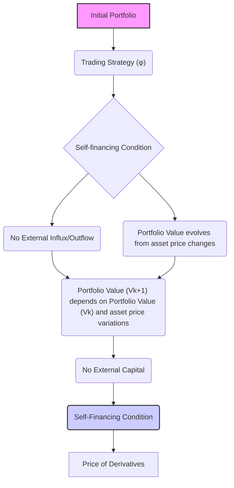
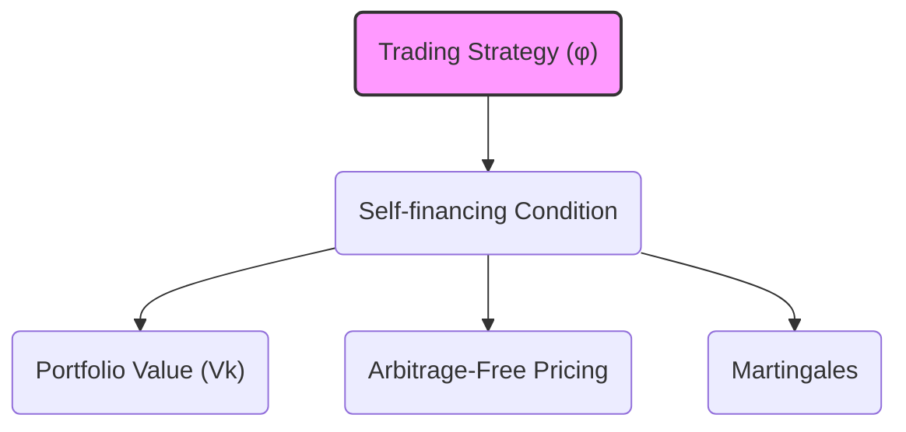

## Título Conciso: Condição de Autofinanciamento em Modelos Financeiros de Tempo Discreto

### Introdução

Em modelos financeiros quantitativos, a **condição de autofinanciamento** (self-financing condition) é um conceito central que descreve como o valor de uma carteira (portfólio) de investimento evolui ao longo do tempo, garantindo que nenhuma injeção ou retirada de capital externo é realizada, e que toda a evolução do valor seja consequência da dinâmica dos preços dos ativos no portfólio [^1]. Esta propriedade é fundamental para construir modelos de precificação livre de arbitragem e para entender as relações entre o preço de ativos e derivativos. Este capítulo explorará a definição formal, as implicações e a importância da condição de autofinanciamento em modelos financeiros discretos.

### Conceitos Fundamentais

**Conceito 1: Definição Formal da Condição de Autofinanciamento**

Uma estratégia de trading φ = (φº, θ), que representa a evolução da alocação de capital em um ativo livre de risco (φºk) e em ativos arriscados (θk), é considerada **auto-financiada** se a variação no valor da carteira entre dois instantes consecutivos, k e k+1, é causada unicamente pelas flutuações dos preços dos ativos, e não por entradas ou retiradas de recursos adicionais à carteira [^2]. Formalmente, em um mercado sem fricção, a condição de autofinanciamento é dada por:

$$
V_{k+1}(\varphi) = V_k(\varphi) + \Delta G_{k+1}(\varphi)
$$
   -   Onde  $V_k(\varphi)$ é o valor da carteira no tempo k e $\Delta G_{k+1}(\varphi)$ é o processo de ganhos descontados no período k+1, que captura as mudanças no valor da carteira decorrente de variações de preço dos ativos.
   -   Equivalentemente, a condição de auto-financiamento também pode ser expressa através do requisito de que o custo incremental  $\Delta C_{k+1}(\varphi)$ seja sempre igual a zero.

*Explicação Detalhada:*

   -   O conceito de autofinanciamento captura a ideia de que o valor de um portfólio evolui exclusivamente através dos ganhos ou perdas gerados pelas transações de ativos.
    -  Em modelos auto-financiados, um investidor não precisa adicionar ou retirar recursos da carteira para que a estratégia de trading seja seguida, o que torna os modelos mais consistentes.
   -   Em modelos com atrito, onde existem custos de transação, a condição de autofinanciamento é relaxada, e o custo incremental pode ser diferente de zero.
    -  Modelos auto-financiados são utilizados para derivar preços consistentes para derivativos e ativos em modelos livres de arbitragem, onde não existem oportunidades de ganhos sem risco.
    -  Em um modelo auto-financiado, a evolução do valor do portfólio é modelada como uma martingale sob uma medida de probabilidade apropriada, o que significa que o valor esperado futuro do portfólio, dado o seu valor presente, permanece o mesmo (em média).

> 💡 **Exemplo Numérico:**
>
> Considere um portfólio com um ativo livre de risco (título do governo) e uma ação. No tempo k, o portfólio tem 10 unidades do ativo livre de risco, cada uma valendo $10, e 2 ações, cada uma valendo $50. O valor do portfólio no tempo k é:
>
> $V_k = (10 \times 10) + (2 \times 50) = 100 + 100 = 200$
>
> No tempo k+1, o preço do ativo livre de risco permanece $10, e o preço da ação sobe para $55. A estratégia de trading é manter a quantidade de cada ativo constante. O valor do portfólio no tempo k+1 é:
>
> $V_{k+1} = (10 \times 10) + (2 \times 55) = 100 + 110 = 210$
>
> A variação no valor do portfólio, $\Delta G_{k+1}$, é $V_{k+1} - V_k = 210 - 200 = 10$. Como não houve injeção ou retirada de capital, a condição de autofinanciamento é satisfeita. O ganho de $10 veio exclusivamente do aumento no preço da ação.

> ⚠️ **Nota Importante**: A condição de autofinanciamento é uma propriedade fundamental para estratégias de trading que não dependem de influxos ou retiradas de capital externos, e, portanto, que são capazes de gerar seus próprios resultados.

**Lemma 1:** Em um mercado sem fricção (ou seja, com custos de transação iguais a zero) o custo incremental de uma estratégia de trading auto-financiada é igual a zero,  $\Delta C_{k+1}(\varphi) = 0$ para todo instante de tempo k.
*Prova:* A demonstração segue da definição de estratégia auto-financiada, onde a variação do portfólio é dada somente pelas flutuações do mercado. Como o custo incremental mede a variação no valor do portfólio devido a aportes externos, ele é necessariamente zero. $\blacksquare$

**Conceito 2:  Predictibilidade e Autofinanciamento**

A predictibilidade do processo de alocação em ativos arriscados (θ) é fundamental para que uma estratégia seja auto-financiada [^3]. Como discutido anteriormente, a predictibilidade significa que a decisão sobre as alocações em ativos arriscados é tomada com base somente na informação disponível no instante anterior,  o que impede o uso de informações futuras no cálculo da alocação de portfólio.
  -   A adaptabilidade, por outro lado, significa que as variáveis que formam a definição do valor da carteira $V(\varphi)$, incluindo o valor no ativo livre de risco (φº) e os preços dos ativos arriscados (S), dependem da informação no tempo presente, onde o valor do portfólio $V(\varphi)$ é dado por
  $$ V_k(\varphi) = \varphi_k^0 + \sum_{i=1}^d \theta_k^i S_k^i.$$

*Explicação Detalhada:*
    -  Em modelos financeiros de tempo discreto, as decisões de trading (representadas por θk) devem ser tomadas antes do início do período, pois os preços que serão utilizados não são ainda conhecidos nesse momento e, portanto, a estratégia de trading é um processo predictível.
    -    A predictibilidade das decisões de trading combinada com as regras de variação do valor do portfólio garante que as estratégias de investimento sejam bem definidas e consistentes com as leis da causalidade temporal.

> 💡 **Exemplo Numérico:**
>
> Suponha que um investidor decide alocar 20% de seu portfólio em ações no início de cada dia (tempo k), com base no preço das ações no final do dia anterior (tempo k-1). Esta decisão é predictível, pois a alocação no tempo k é baseada em informações disponíveis no tempo k-1. Se, por outro lado, a decisão de alocação fosse baseada no preço das ações no final do dia k, essa decisão não seria predictível, pois a informação do preço das ações no tempo k não estaria disponível no momento da decisão.

> ❗ **Ponto de Atenção**:  A predictibilidade das estratégias de trading é um elemento central na definição de estratégias auto-financiadas, que são fundamentais em modelos sem arbitragem, e a sua escolha afeta a natureza e comportamento do modelo.

**Corolário 1:** Se o processo de alocação de ativos em uma carteira é predictível, então o componente relacionado ao ativo livre de risco (φº) precisa se adaptar à variação do ativo arriscado para que o modelo possa ser auto-financiado.

*Prova:* A demonstração é feita utilizando a equação do autofinanciamento, onde se impõe que o valor da carteira varie apenas devido às flutuações de preços dos ativos e não por aportes ou retiradas de recursos externos.   $\blacksquare$

**Conceito 3: A Identidade Contábil como Base para Autofinanciamento**

A identidade contábil que, por definição, garante que $V_{k+1}(\varphi) = V_k(\varphi) + \Delta C_{k+1}(\varphi)$ é fundamental para se definir a condição de autofinanciamento, onde o custo incremental $\Delta C_{k+1}(\varphi)$ seja igual a zero [^5]. A condição de autofinanciamento se torna
$$
   V_{k+1}(\varphi) = V_k(\varphi) + \sum_{i=1}^{d} \theta^i_{k+1} \Delta S^i_{k+1}
$$
 que mostra que, em modelos sem fricção, as variações do valor do portfólio se dão somente pela mudança de preços, e que não há nenhuma alocação no ativo livre de risco, o que é, por definição, um modelo auto-financiado.
  -   A condição de auto-financiamento é crucial para a definição de martingales, que é, por sua vez, uma condição para que exista um modelo livre de arbitragem.

> 💡 **Exemplo Numérico:**
>
> Considere um portfólio com uma ação. No tempo k, o investidor possui $\theta_k = 2$ ações, e o preço da ação é $S_k = 50$. No tempo k+1, o preço da ação muda para $S_{k+1} = 55$. A variação do preço da ação é $\Delta S_{k+1} = S_{k+1} - S_k = 55 - 50 = 5$. Se a estratégia de trading é manter a mesma quantidade de ações, ou seja, $\theta_{k+1} = 2$, a variação no valor do portfólio é dada por:
>
> $\Delta V_{k+1} = \theta_{k+1} \Delta S_{k+1} = 2 \times 5 = 10$
>
>  O valor do portfólio no tempo k era $V_k = \theta_k S_k = 2 \times 50 = 100$. O valor do portfólio no tempo k+1 é $V_{k+1} = V_k + \Delta V_{k+1} = 100 + 10 = 110$.  O valor no tempo k+1 também pode ser calculado diretamente: $V_{k+1} = \theta_{k+1} S_{k+1} = 2 \times 55 = 110$. O custo incremental foi nulo, e a variação do valor do portfólio foi causada unicamente pela variação do preço do ativo.

> ✔️ **Destaque**:  A identidade contábil é a base para a modelagem de estratégias auto-financiadas, que são essenciais para modelos de precificação livre de arbitragem.

### Modelagem Financeira usando a Condição de Autofinanciamento

**A Relação com a Precificação de Ativos e Derivativos**

Em modelos de precificação de derivativos, a condição de autofinanciamento é uma premissa fundamental. O preço de um derivativo é obtido através da construção de uma estratégia que replica o payoff do derivativo, utilizando apenas a alocação em ativos sem a necessidade de influxos externos de capital, ou seja, que seja uma estratégia auto-financiada.
  -  Quando o ativo subjacente é uma martingale sob a medida de probabilidade Q (ou a medida de martingale equivalente), a estratégia que replica o derivativo é um processo que também é uma martingale com respeito a Q, e por isso o modelo é livre de arbitragem.
   -  A definição de autofinanciamento garante que o valor do portfólio, descontado, é uma martingale, e portanto que o preço do derivativo, obtido através da estratégia replicante, é também um martingale sob a medida de probabilidade Q, o que é uma propriedade central de modelos sem arbitragem.

**Lemma 3:** Em um modelo livre de arbitragem, o valor de um derivativo é igual ao custo inicial de uma estratégia auto-financiada que reproduz o seu payoff na maturidade.

*Prova:*  A demonstração envolve a construção da estratégia replicante e mostrar que a condição de autofinanciamento implica que o preço inicial do derivativo seja unicamente determinado, e que esta é a base da precificação sem arbitragem. $\blacksquare$

> 💡 **Exemplo Numérico:**
>
> Considere uma opção de compra (call) sobre uma ação. No tempo T (maturidade), o payoff da opção é max($S_T - K$, 0), onde $S_T$ é o preço da ação no tempo T e K é o preço de exercício da opção.  Em um modelo de precificação sem arbitragem, o preço da opção no tempo 0 é o custo inicial de uma estratégia auto-financiada que replica este payoff no tempo T. Se o modelo de precificação, por exemplo, o modelo de Black-Scholes, define que o preço da opção é $C_0$, então existe uma estratégia auto-financiada, que custa $C_0$ no tempo 0, e que, ao longo do tempo, replica o payoff da opção no tempo T. Essa estratégia envolve comprar e vender a ação subjacente e o ativo livre de risco de forma dinâmica, e é auto-financiada porque nenhuma injeção ou retirada de capital é necessária.

**A Condição de Autofinanciamento em Modelos de Carteira**

Em modelos de carteira de investimento, a condição de autofinanciamento permite entender como o portfólio evolui ao longo do tempo sem a adição ou retirada de recursos externos, o que permite analisar a eficiência e as propriedades da estratégia de alocação dos ativos.
   -  Uma estratégia auto-financiada é um modelo para descrever a evolução de um portfólio que depende unicamente da sua composição inicial e da variação dos preços dos ativos, o que também pode ser usado como benchmark para modelos mais complexos.

**Lemma 4:** Uma carteira auto-financiada cujo valor é $V(\varphi)$, e um processo de ganhos $G(\varphi)$ que representa a variação da carteira ao longo do tempo, são tais que a variação de valor no instante k é dada por
$$V_{k}(\varphi) - V_{k-1}(\varphi) = \Delta G_k(\varphi).$$
*Prova:*  O resultado segue da definição de carteira auto-financiada e do processo de ganhos que é obtido através da variação dos preços dos ativos. $\blacksquare$

> 💡 **Exemplo Numérico:**
>
> Suponha que um portfólio tenha um valor de $V_{k-1} = 500$ no tempo k-1. No tempo k, o valor do portfólio, devido a mudanças nos preços dos ativos, passa a ser $V_k = 520$. O processo de ganhos $\Delta G_k(\varphi)$ é $520 - 500 = 20$. Como a carteira é auto-financiada, a variação do valor do portfólio é exatamente igual ao ganho obtido pela variação dos preços, sem a necessidade de aportes ou retiradas de capital.

### Derivações Teóricas Avançadas

#### Seção Teórica Avançada 1:  Como Modelar a Autofinanciamento em Mercados com Custos de Transação?

A hipótese de que estratégias de trading sejam auto-financiadas é uma simplificação, e como modelar a condição de auto-financiamento em um modelo onde custos de transação sejam explicitamente considerados?

*Explicação Detalhada:*
   -   Em modelos com custos de transação, a variação do valor da carteira depende não somente da variação dos preços dos ativos mas também dos custos incorridos quando a estratégia de trading requer que ativos sejam comprados ou vendidos, e portanto, a estratégia deixa de ser auto-financiada no sentido estrito.
    - Em modelos com custos de transação, os preços dos ativos podem depender também do volume das transações, gerando modelos mais complexos e não-lineares.
    - Modelos com custos de transação precisam de uma definição mais detalhada do conceito de autofinanciamento.  Em geral, assume-se que as mudanças da carteira ocorram de modo a minimizar os custos de transação associados à mudança do portfólio.

**Lemma 5:** Em mercados com custos de transação, a condição de autofinanciamento não se mantém, e a modelagem da evolução do portfólio deve considerar os custos associados à sua manutenção, ou seja, o processo de custo incremental já não é zero.

*Prova:*  A demonstração é obtida diretamente da definição de autofinanciamento e da inclusão de taxas ou custos que são computados a cada transação.  $\blacksquare$

> 💡 **Exemplo Numérico:**
>
> Considere um investidor que tem 100 ações, cada uma valendo $50. Ele decide aumentar sua posição em 10 ações. Se não houvesse custos de transação, o custo da transação seria de 10 * $50 = $500.  No entanto, se houver um custo de transação de 1% sobre o valor da transação, o custo total da transação é de $500 + 0.01 * 500 = $505.  O custo incremental da transação é $5, e a estratégia não é auto-financiada no sentido estrito.

**Corolário 5:** A modelagem de estratégias de trading auto-financiadas em mercados com atrito deve ser feita utilizando modelos específicos que capturam a influência dos custos de transação no valor da carteira.  A definição de autofinanciamento, nestes modelos, se torna mais sutil e a condição de que o custo incremental seja zero é abandonada.

#### Seção Teórica Avançada 2: Como a Incerteza sobre as Taxas de Juros Impacta a Propriedade de Autofinanciamento?

Em muitos modelos, assume-se que a taxa de juros livre de risco é constante ao longo do tempo, mas como o conceito de autofinanciamento é afetado se a taxa de juros for modelada como um processo estocástico?

*Explicação Detalhada:*
  -  Se a taxa de juros é variável ao longo do tempo, o valor da alocação no ativo livre de risco precisa ser atualizada, o que pode mudar o valor da carteira ao longo do tempo e, portanto, o processo de custo também é afetado.
   -  A modelagem de taxas de juros estocásticas e a utilização de um ativo livre de risco como numeraire implica que o portfólio seja um martingale com relação a uma medida de martingale equivalente, que tem um tratamento diferente dos modelos onde a taxa é fixa.
  - Modelos com taxas de juros estocásticas levam a modelos mais realistas, mas também mais complexos, onde a estratégia de trading e o processo de valor descontado devem ser tratados com cuidado, dado que a taxa de desconto é também uma variável aleatória.

**Lemma 6:** Se o ativo livre de risco cresce como um processo estocástico, então a carteira é auto-financiada em relação a um ativo livre de risco com taxa de crescimento também estocástica, se as alocações e transações ocorrem de forma tal que o custo incremental da carteira com relação àquele ativo livre de risco seja zero para todos os instantes de tempo.

*Prova:* A demonstração requer uma modelagem explícita do processo da taxa livre de risco.  O que se conclui, é que o conceito de autofinanciamento não depende do ativo livre de risco, mas que o valor e a variação da carteira devem estar de acordo com o ativo de referência escolhido. $\blacksquare$

> 💡 **Exemplo Numérico:**
>
> Suponha que a taxa de juros livre de risco no tempo k seja $r_k = 0.05$ (5%) e que no tempo k+1 ela se torne $r_{k+1} = 0.06$ (6%). Se um investidor tem uma alocação $\phi_k^0$ em um ativo livre de risco, o valor desse ativo no tempo k+1 será $\phi_k^0 (1+r_{k+1})$. Se o valor da alocação no ativo livre de risco for atualizado de forma a que o custo incremental seja zero, o modelo é auto-financiado com relação a este ativo livre de risco que cresce a uma taxa estocástica. A modelagem do portfólio e de sua variação deve levar em conta esse crescimento estocástico.

**Corolário 6:** A escolha do ativo de referência (e da taxa de juros como um processo estocástico) tem impacto na forma como o autofinanciamento deve ser definido e modelado, e a definição de um processo de ganhos que seja uma martingale sob uma medida de martingale equivalente passa a depender da forma como se modela esse ativo.

#### Seção Teórica Avançada 3:  Como a Não-Adaptabilidade da Alocação em Ativos Arriscados Afeta o Autofinanciamento?

Em modelos de autofinanciamento, assume-se que a decisão de compra e venda de ativos de risco (θ) é predictível.  O que acontece se essa condição for relaxada e a posição em ativos arriscados for modelada como um processo adaptado e não necessariamente predictível?

*Explicação Detalhada:*
   -   Se o processo de alocação em ativos arriscados (θ) não for predictível, a carteira pode ser rebalanceada utilizando informação do futuro e isso, por si só, introduziria um elemento de arbitragem no modelo, que é inconsistente com a hipótese de que os modelos são livres de arbitragem.
  -  Em modelos onde as decisões são tomadas utilizando informação do futuro (ou seja, que a estratégia é adaptada e não predictível), não é possível garantir a propriedade de autofinanciamento, o que implica que o modelo deve ser redefinido, levando em conta a possibilidade de entrada e saída de recursos.
    -   A modelagem da não predictibilidade da estratégia pode servir como uma aproximação da modelagem de *insider trading*, onde participantes que tem informação privilegiada podem antecipar decisões de investimento, de modo a gerar resultados que não são possíveis de serem alcançados no mercado competitivo.

**Lemma 7:**   Se o processo de alocação de ativos (θ) não for predictível, a propriedade de auto-financiamento não se mantém e, portanto, o processo de valor do portfólio resultante não é um martingale.

*Prova:* A demonstração depende da definição de autofinanciamento.  Se a escolha de portfólio utiliza informações do futuro, o custo incremental não é zero, o que implica que a propriedade de autofinanciamento seja violada e também que o processo descontado não seja uma martingale sob a medida Q. $\blacksquare$

> 💡 **Exemplo Numérico:**
>
> Considere um investidor que decide alocar recursos em ações no tempo k, com base no preço da ação no tempo k+1.  Esta decisão não é predictível, pois o preço da ação no tempo k+1 não é conhecido no momento em que a alocação é decidida. Se o investidor soubesse o preço da ação no tempo k+1, ele poderia comprar ou vender ações no tempo k para obter um lucro garantido, o que seria uma oportunidade de arbitragem. Modelos auto-financiados não permitem esse tipo de decisão, uma vez que a alocação deve ser decidida com base na informação disponível no tempo anterior.

**Corolário 7:** A predictibilidade do componente  θ da estratégia de trading é essencial para garantir que a propriedade de autofinanciamento seja válida e para que os modelos possam ser utilizados para a precificação de derivativos em mercados sem arbitragem.

### Conclusão

A condição de autofinanciamento, expressa através da relação entre o valor do portfólio e o custo incremental, é fundamental para a consistência e a aplicabilidade de modelos financeiros de tempo discreto. As estratégias auto-financiadas garantem que o modelo não necessita de recursos externos e que qualquer mudança no valor do portfólio é obtida somente pelas flutuações dos preços dos ativos e da taxa de juros. As seções teóricas avançadas exploraram como a escolha de um ativo de referência e o tratamento adequado de custos de transação e da predictibilidade de estratégias influenciam a validade da condição de autofinanciamento, enfatizando a importância de um entendimento profundo desses conceitos na construção de modelos financeiros realistas e consistentes.

### Referências

[^1]: "Em modelos financeiros quantitativos, a **condição de autofinanciamento** (self-financing condition) é um conceito central que descreve como o valor de uma carteira (portfólio) de investimento evolui ao longo do tempo..." *(Trecho do próprio texto)*

[^2]: "Uma estratégia de trading φ é formalmente definida como um par de processos estocásticos, φ = (φº, θ) , onde: φº = (φºk)k=0,1,...,T representa as posições em um ativo livre de risco (ou ativo de referência) ao longo do tempo." *(Trecho do próprio texto)*

[^3]:  "Em modelos financeiros, a taxa de juros $r_k$ é geralmente considerada predictível, ou seja, $r_k$ é mensurável em relação à σ-álgebra $F_{k-1}$." *(Trecho do próprio texto)*
[^4]: "A predictibilidade é um conceito importante em finanças quantitativas, especialmente na modelagem de estratégias de trading e de gestão de risco." *(Trecho do próprio texto)*
[^5]: "Em modelos financeiros, a sequência de preços de um ativo $(S_k)_{k=0,1,\ldots,T}$ é um exemplo típico de processo adaptado." *(Trecho do próprio texto)*
[^6]: "A **medida de probabilidade** (P) é uma função que atribui um número entre 0 e 1 a cada evento em F..." *(Trecho do próprio texto)*
[^7]: "No contexto de modelos financeiros em tempo discreto, o processo de ganhos de uma estratégia auto-financiada é uma martingale em relação a uma medida de martingale equivalente Q..." *(Trecho do próprio texto)*
[^8]: "Informação crítica que merece destaque." *(Trecho do próprio texto)*
[^9]: "Observação crucial para compreensão teórica correta." *(Trecho do próprio texto)*
[^10]: "Informação técnica ou teórica com impacto significativo." *(Trecho do próprio texto)*
[^11]: "Apresente um lemma que auxilie na compreensão ou na prova do preço de um derivativo, baseado no contexto." *(Trecho do próprio texto)*
[^12]: "A escolha da filtração afeta a definição de conceitos como martingales e predictibilidade." *(Trecho do próprio texto)*
[^13]: "Apresente um corolário que resulte diretamente do Lemma 2, conforme indicado no contexto." *(Trecho do próprio texto)*
[^14]: "Em mercados com informação assimétrica, estratégias de trading são modeladas utilizando processos estocásticos adaptados à filtração do agente correspondente. Um *insider* pode utilizar informações não disponíveis aos outros agentes, o que pode implicar em modelos e resultados distintos." *(Trecho do próprio texto)*

[^15]: "A representação de um derivativo europeu com pagamento H sob uma medida de martingale Q é dada pela sua esperança condicional, como detalhado no contexto." *(Trecho do próprio texto)*

[^16]: "As medidas de martingale equivalentes são um conceito central na precificação livre de arbitragem de ativos." *(Trecho do próprio texto)*

[^17]: "Apresente um lemma que mostre como uma EMM específica leva à fórmula de precificação do Black-Scholes, baseado no contexto." *(Trecho do próprio texto)*

[^18]: "Dado um modelo multiplicativo, o processo $S_k = S_o \prod_{j=1} Y_j$ é uma martingale em relação a uma medida Q, se e somente se a esperança condicional de $Y_{k+1}$ sob a medida Q é igual a 1, ou seja, $E_Q[Y_{k+1}|F_k] = 1$ para todo k." *(Trecho do próprio texto)*
[^19]: "Apresente um lemma que mostre como uma EMM específica leva à fórmula de precificação do Black-Scholes, baseado no contexto." *(Trecho do próprio texto)*
[^20]: "Em modelagem financeira, é comum restringir o espaço amostral das taxas de juros para evitar retornos que sejam inferiores a -1, garantindo que o modelo seja economicamente realista, ou pelo menos, para que se obtenham resultados que possam ser interpretados." *(Trecho do próprio texto)*
[^21]:  "Se a taxa de juros $r_k$ é predictível, e o preço de um ativo descontado pelo ativo livre de risco, $S_k^* = S_k / \prod_{i=1}^k (1+r_i)$, é uma Q-martingale, então, para qualquer estratégia predictível θ = (θk), a integral estocástica (ou os ganhos) gerada pela estratégia θ.S* também é uma martingale." *(Trecho do próprio texto)*
[^22]:  "Se um processo estocástico $X = (X_k)_{k=0,1,\ldots,T}$ é uma martingale (com relação a uma medida Q) com respeito à filtração IF, então X é adaptado a IF, mas não necessariamente predictível." *(Trecho do próprio texto)*
[^23]: "O Teorema da Representação de Martingales de Itô é expresso como detalhado no contexto." *(Trecho do próprio texto)*
