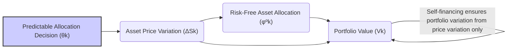

## Título Conciso: Estratégias Auto-Financiadas como Rebalanceamento de Portfólio Neutro em Custo

```mermaid
flowchart LR
    subgraph "Time k"
      A("Portfolio Composition: Risk-free Assets, Risk Assets")
      B("Asset Prices")
      C("Portfolio Value (Vk)")
    end
    subgraph "Time k+1"
      D("Adjusted Portfolio Composition: Risk-free Assets, Risk Assets")
      E("New Asset Prices")
      F("Portfolio Value (Vk+1)")
    end
    A --> B
    B --> E
    E-->D
    A --> C
    C-->F
    D-->F
    style A fill:#f9f,stroke:#333,stroke-width:2px
    style D fill:#f9f,stroke:#333,stroke-width:2px
    F --"Value change due only to price variations"-->C
    linkStyle 7,8 stroke-width:2px
    
    G[/"Cost-Neutral Portfolio Rebalancing"/]
    G--> A
    G--> D
```

### Introdução

Em modelos financeiros de tempo discreto, o conceito de **estratégia auto-financiada** (self-financing strategy) captura a ideia de que a variação no valor de um portfólio é dada unicamente pelas flutuações de preços dos ativos e pelas decisões de alocação entre eles, sem a necessidade de aportes ou retiradas de capital externo [^1]. Este capítulo visa explorar a ideia de uma estratégia auto-financiada como um rebalanceamento de portfólio neutro em custo, demonstrando como essa propriedade se conecta com os princípios de precificação sem arbitragem e da modelagem de estratégias de trading.

### Conceitos Fundamentais

**Conceito 1: Definição Formal de uma Estratégia Auto-Financiada**

Uma estratégia de trading $\varphi = (\varphi^0, \theta)$ é considerada **auto-financiada** se a mudança no valor do portfólio entre dois instantes de tempo consecutivos (k e k+1) é determinada somente pelas variações nos preços dos ativos, e não por qualquer outra entrada ou saída de recursos. Formalmente, esta condição é definida como [^2]:
$$
V_{k+1}(\varphi) = V_k(\varphi) + \Delta G_{k+1}(\varphi),
$$
onde $V(\varphi)$ é o processo de valor descontado do portfólio associado à estratégia $\varphi$, e $\Delta G_{k+1}(\varphi)$ é a variação de preço dos ativos arriscados, expressa como a integral estocástica da estratégia.
    -  De forma equivalente, uma estratégia é auto-financiada se o seu custo incremental é sempre zero, ou seja,  $\Delta C_{k+1}(\varphi) = 0$ para todo k.
    -  O componente $\varphi^0$ do vetor $(\varphi^0, \theta)$ representa o investimento em um ativo livre de risco (ou ativo de referência) e $\theta$ representa o investimento em ativos arriscados.

*Explicação Detalhada:*

   -  A propriedade de autofinanciamento captura a ideia que o valor do portfólio em um dado instante é unicamente determinado pelo seu valor no instante anterior, e pela mudança no preço dos ativos que compõem o portfólio.
  -   O portfólio é “rebalanceado” a cada instante de tempo utilizando somente os ativos já presentes no portfólio, sem que sejam utilizados recursos externos ou que o processo incorra em despesas.
    -  O autofinanciamento é uma condição essencial para modelos de precificação de derivativos, onde a estratégia de replicação deve ser construída sem nenhuma injeção ou retirada de capital.
  -  No entanto, esta propriedade não é necessária para modelar todos os tipos de carteira, e investidores podem utilizar também estratégias que não são auto-financiadas (por exemplo, estratégias de aporte de capital a cada instante, sem que elas dependam somente da variação dos preços dos ativos).

> 💡 **Exemplo Numérico: Rebalanceamento de Portfólio Auto-Financiado**
>
> Considere um portfólio com um ativo livre de risco (título do governo) e um ativo arriscado (ação). No instante k, o portfólio tem:
>
> - 100 unidades do ativo livre de risco, cada uma valendo $1.00 (total: $100)
> - 10 ações, cada uma valendo $10.00 (total: $100)
> - Valor total do portfólio: $200
>
> No instante k+1, o preço da ação sobe para $12.00.  O valor do portfólio agora é:
>
> - Ativo livre de risco: $100 (sem variação)
> - Ativo arriscado: 10 ações * $12.00 = $120
> - Valor total do portfólio: $220
>
> Para manter a estratégia auto-financiada, o rebalanceamento deve ocorrer sem injeção de capital externo. Por exemplo, o investidor poderia vender uma parte das ações e comprar mais títulos do governo, mantendo o valor total do portfólio em $220. A variação do valor do portfólio ($20) é devida apenas à mudança no preço da ação.

> ⚠️ **Nota Importante**: A condição de autofinanciamento estabelece que a variação do valor de um portfólio é devido exclusivamente à flutuação dos preços dos ativos e não por aportes ou retiradas externas de capital.

**Lemma 1:**  Num modelo onde os custos de transação são nulos, uma estratégia de trading é auto-financiada se e somente se a variação do valor do portfólio é devido somente às variações de preço dos ativos e do ativo de referência.
*Prova:* A demonstração é uma consequência da definição de autofinanciamento e da definição do custo incremental. Em modelos sem atrito, onde não há custos de transação, a variação no valor da carteira devido ao rebalanceamento é zero, e portanto, toda a variação da carteira é dada pelas mudanças de preço dos ativos. $\blacksquare$

**Conceito 2: O Papel da Predictibilidade em Estratégias Auto-Financiadas**

A predictibilidade do componente $\theta$ da estratégia de trading $\varphi = (\varphi^0, \theta)$ é crucial para a definição de estratégias auto-financiadas [^3]. Predictibilidade significa que, em cada tempo k, a quantidade de ativos arriscados ($\theta_k$) na carteira é definida com base na informação disponível até o instante anterior k-1, e não com a informação do instante k (quando o preço já é conhecido) o que tornaria a estratégia irrealizável.
   - Em modelos financeiros, a predictibilidade impede o uso de informações que não estão disponíveis para se tomar uma decisão no instante presente.
    - A hipótese de predictibilidade é usada para garantir que a estratégia não dependa de dados do futuro e, por consequência, que seja implementável em mercados reais.

*Explicação Detalhada:*
   - Se uma estratégia é baseada somente em informações do passado (e não no valor do ativo no instante corrente), a decisão sobre as quantidades de ativos que compõem o portfólio é feita no tempo k-1, utilizando informações de $F_{k-1}$.
  -   Quando os preços dos ativos variam no tempo k, o valor do portfólio varia, e o rebalanceamento para o instante seguinte ocorre de modo a que nenhuma variação adicional de valor seja criada, além da flutuação dos preços.
  -  A predictibilidade garante que a estratégia possa ser implementada sem criar dependência em informações do futuro.
  - A componente $\varphi^0$ (que representa a alocação no ativo livre de risco) é adaptada (e não predictível), e portanto, ela pode utilizar a informação disponível no instante presente para decidir como alocar o capital.

```mermaid
sequenceDiagram
    participant Investor
    participant Time k-1
    participant Time k
    participant Time k+1
    
    Time k-1 ->> Investor: Collects information (Fk-1)
    Investor ->> Time k-1: Determines predictable risky asset allocation (θk)
    Time k-1 ->> Time k: Asset prices change
    Time k -->> Investor: Portfolio value changes (Vk) due to price fluctuations
    Investor ->> Time k: Adjusts risk-free allocation (φºk) 
    Time k ->> Time k+1: Asset prices change again
    Time k+1 -->> Investor: New portfolio value (Vk+1) is purely from asset price changes
```

> 💡 **Exemplo Numérico: Predictibilidade em Alocação de Ativos**
>
> Suponha que um investidor utilize uma estratégia de média móvel para decidir a alocação em ações.  No tempo k-1, a média móvel dos preços das ações nos últimos 20 dias é calculada e, com base neste valor, o investidor decide a quantidade de ações ($\theta_k$) que comporá o portfólio no instante k. Esta decisão ($\theta_k$) é predictível, pois ela utiliza somente informações disponíveis até o instante k-1.  O valor da carteira no instante k, por sua vez, irá depender do preço da ação (que é uma variável aleatória) no instante k.

> ❗ **Ponto de Atenção**: A predictibilidade de $\theta$ é essencial para modelar a causalidade e para garantir que as estratégias auto-financiadas sejam implementáveis utilizando somente informações disponíveis no momento da decisão.

**Corolário 1:**   Se o processo $\theta$ é predictível, então a variação do valor do portfólio devido a flutuações de preço dos ativos, dado por $\Delta G_{k+1}(\varphi)$, é uma variável aleatória bem definida.

*Prova:* A demonstração segue da definição de predictibilidade de $\theta$ e da definição de variação de valor do portfólio, onde a mudança no valor da carteira é expressa em função de variáveis que são mensuráveis em relação a uma $\sigma$-álgebra anterior ($F_{k-1}$).  $\blacksquare$

**Conceito 3: Autofinanciamento e a Ausência de Arbitragem**

A condição de autofinanciamento é crucial na construção de modelos financeiros que buscam evitar oportunidades de arbitragem, ou seja, a possibilidade de criar uma estratégia de trading que gera lucro sem risco.
    -  Uma estratégia auto-financiada implica que a mudança no valor da carteira não dependa de injeções externas de capital, mas sim unicamente da variação de valor dos ativos e do ativo livre de risco.
  - Em modelos de precificação de derivativos, a estratégia que replica o payoff do derivativo tem que ser auto-financiada para que o preço resultante seja consistente e livre de arbitragem.
  -   A condição de autofinanciamento estabelece que o ganho do portfólio pode ser modelado como uma martingale, e portanto a esperança futura desse ganho (condicionada no presente) é o próprio valor presente, o que também garante a ausência de arbitragem.
  -   Se a estratégia não for autofinanciada, existe a possibilidade de que se crie um lucro sem risco através da carteira, o que invalida a definição de modelo livre de arbitragem.

> 💡 **Exemplo Numérico: Arbitragem e Autofinanciamento**
>
> Imagine um cenário hipotético onde um derivativo é vendido por um preço diferente do valor de uma estratégia auto-financiada que replica o seu payoff.  Se o preço do derivativo for inferior ao custo da estratégia auto-financiada, um agente poderia comprar o derivativo e simultaneamente vender a estratégia auto-financiada (que replica o payoff do derivativo), obtendo um lucro sem risco.  A condição de autofinanciamento garante que o preço do derivativo seja consistente com o custo da estratégia de replicação, eliminando essa possibilidade de arbitragem.
>

> ✔️ **Destaque**: A autofinanciamento é uma propriedade que garante a consistência dos modelos financeiros, especialmente na construção de estratégias que permitem a precificação de ativos e derivativos livre de arbitragem.

### Autofinanciamento e Modelagem Financeira



**O Papel do Autofinanciamento na Precificação de Derivativos**

Em modelos de precificação livre de arbitragem, o preço de um derivativo é dado pelo valor inicial de uma estratégia auto-financiada que replica o seu payoff.  A condição de autofinanciamento garante que a replicação possa ser feita unicamente utilizando os ativos disponíveis no mercado, o que faz com que não exista a possibilidade de ter um lucro sem risco, dado que o modelo está baseado na informação do passado e nos preços do presente, o que garante a causalidade e a consistência da modelagem.
    -    A condição de autofinanciamento também implica que o valor do portfólio que replica o payoff do derivativo seja um martingale com relação a uma medida de martingale equivalente Q, onde o portfólio descontado é sempre igual a sua esperança condicional ao presente.

**Lemma 2:**  Em modelos onde as estratégias de trading são auto-financiadas, o valor do portfólio descontado utilizando uma unidade de referência livre de risco deve ser uma martingale.
*Prova:*  A propriedade de martingale é uma consequência da definição de autofinanciamento, que garante que as mudanças no valor da carteira são somente devidas às mudanças de preços, e a propriedade de martingale do preço descontado. $\blacksquare$

**Autofinanciamento e a Modelagem de Carteiras de Investimento**

Em modelos de carteiras de investimento, a condição de autofinanciamento permite modelar como uma carteira evolui ao longo do tempo, sem a necessidade de capital externo, e a alocação dos ativos arriscados é feita levando em consideração as propriedades da carteira e os objetivos do investidor.
   - Modelos de gestão de carteira que utilizam estratégias auto-financiadas permitem avaliar a dinâmica do portfólio no longo prazo e, em particular, modelar cenários de otimização entre o risco e retorno da carteira.
   -   A propriedade de autofinanciamento é um passo fundamental para se estudar a sustentabilidade de certas estratégias de trading.

> 💡 **Exemplo Numérico: Simulação de Carteira Auto-Financiada**
>
> Considere uma carteira que investe em um ativo arriscado (ações) e um ativo livre de risco (títulos do governo), e que busca manter um percentual fixo de alocação em cada um dos ativos.  A cada instante de tempo, o portfólio é rebalanceado de modo a manter essa alocação, sem que haja injeção ou retirada de capital.
>
> | Tempo  | Valor Total da Carteira | Ações (Valor) | Títulos (Valor) | Alocação em Ações | Alocação em Títulos |
> |--------|------------------------|---------------|-----------------|-------------------|--------------------|
> | k      | $1000                  | $600          | $400            | 60%               | 40%                |
> | k+1    | $1050                  | $630          | $420            | 60%               | 40%                |
> | k+2    | $1100                  | $660          | $440            | 60%               | 40%                |
>
> Este exemplo ilustra como o valor da carteira evolui ao longo do tempo, mantendo uma alocação fixa, e sem que haja a necessidade de um capital externo. A variação do valor da carteira é unicamente devida à variação de preço dos ativos.

**Lemma 3:** Se o valor de um portfólio $V(\varphi)$ é obtido através de uma estratégia auto-financiada e que investe em ativos que são martingales sob uma medida Q, então o portfólio descontado também é uma Q-martingale.

*Prova:* O resultado segue das definições de estratégia auto-financiada e da propriedade de martingale, onde o valor esperado futuro de um processo descontado, condicionado à informação presente, é sempre igual ao seu valor presente.  $\blacksquare$

### Derivações Teóricas Avançadas

#### Seção Teórica Avançada 1: Como a Não Predictibilidade do Ativo Livre de Risco Afeta a Condição de Autofinanciamento?

Em modelos financeiros, assume-se que a taxa de juros do ativo livre de risco é predictível.  Como a relaxação desta hipótese (ou seja, assumir que a taxa livre de risco não é predictível) afeta a modelagem da condição de autofinanciamento?

*Explicação Detalhada:*

   -  Se a taxa de juros do ativo livre de risco não é predictível, o rebalanceamento de um portfólio não pode ser feita unicamente com base na informação do passado, e a carteira não é mais auto-financiada no sentido estrito.
   - Modelos com taxas de juros estocásticas necessitam de uma reformulação da condição de autofinanciamento.  Nesse tipo de modelo, a taxa de juros passa a fazer parte do processo estocástico, o que afeta o valor da carteira.
  -  Uma taxa de juros não predictível adiciona incerteza à modelagem, tanto para a evolução da carteira como para a precificação de derivativos.
    - Se o ativo livre de risco tem uma taxa de juros que é adaptada (e não predictível), o valor descontado dos ativos deve ser feito por uma taxa de juros que é modelada como uma martingale, onde o conceito de autofinanciamento também precisa ser modificado para levar em conta esta modelagem.

**Lemma 4:** Se o ativo livre de risco não segue uma taxa de crescimento predictível, então o processo de valor descontado do portfólio é, em geral, diferente de uma martingale.

*Prova:* A demonstração envolve a utilização de uma taxa de juros estocástica no cálculo da esperança condicional do processo descontado e mostrar que ele não é necessariamente uma martingale [^19].  $\blacksquare$

**Corolário 4:**  Modelos financeiros com taxas de juros estocásticas precisam de condições adicionais para que o conceito de autofinanciamento seja definido de forma consistente, e para que o processo descontado seja uma martingale.

#### Seção Teórica Avançada 2:  Como o Impacto de Custos de Transação na Propriedade de Autofinanciamento Leva a Modelos com Incompletude?

Em modelos mais realistas, onde custos de transação não podem ser ignorados, a propriedade de autofinanciamento deve ser revisitada. Como esses custos afetam a definição e a utilização do conceito de autofinanciamento?

*Explicação Detalhada:*

   - A inclusão de custos de transação impede que a carteira seja rebalanceada sem que haja um custo adicional, que é pago na compra e venda dos ativos.
   - Em modelos com fricção (i.e. com custos de transação), a estratégia de replicação deixa de ser autofinanciada no sentido estrito.
   -   Os custos de transação devem ser modelados como um processo estocástico, e podem ser dependentes das flutuações de preços e também das decisões de alocação de carteira.
   -  Modelos com custos de transação, em geral, levam a mercados incompletos, onde a precificação de ativos deixa de ser única, e requerem a utilização de novas metodologias.
    -  A condição de autofinanciamento é alterada, e a modelagem passa a depender da forma como as restrições aos ativos arriscados e ao ativo livre de risco são definidos.

**Lemma 5:**  Em modelos com custos de transação, o custo incremental é diferente de zero.
$$ \Delta C_{k+1} (\varphi)  \neq 0$$
e a variação do valor do portfólio não depende unicamente das variações de preço, o que invalida a propriedade de autofinanciamento.

*Prova:* A demonstração segue da definição de estratégias auto-financiadas, e da inclusão de custos de transação, que levam à necessidade de entrada ou retirada de recursos externos.  $\blacksquare$

> 💡 **Exemplo Numérico: Impacto dos Custos de Transação**
>
> Suponha que, ao rebalancear um portfólio, o investidor tenha que pagar uma taxa de corretagem de 0.5% sobre o valor das transações de compra e venda de ações.  Se o investidor precisa comprar ou vender ações no valor de $100 para manter a alocação desejada, ele terá que pagar $0.50 de custos de transação.  Este custo reduz o valor do portfólio, e a estratégia deixa de ser auto-financiada no sentido estrito, pois o valor da carteira não depende unicamente da flutuação dos preços dos ativos.

**Corolário 5:**  A introdução de custos de transação nos modelos financeiros implica que o conceito de autofinanciamento deve ser relaxado, que o preço de um derivativo deixa de ser único e que os modelos de precificação precisam de outras propriedades e critérios de análise.

#### Seção Teórica Avançada 3:   Qual a Importância da Predictibilidade na Definição de Estratégias Auto-Financiadas?

A predictibilidade da componente $\theta$ de uma estratégia de trading, que define a alocação em ativos de risco, é crucial para garantir que a estratégia seja auto-financiada.  Como a não predictibilidade de $\theta$ afeta a definição de estratégias de trading auto-financiadas e o conceito de martingale para preços descontados?

*Explicação Detalhada:*
   - Se a decisão de alocação de um ativo ($\theta$) dependesse de informações do futuro, a estratégia seria impossível de ser implementada, pois as ordens de compra e venda não podem ser realizadas no instante seguinte, e portanto, essa estratégia não poderia ser considerada realista.
    -   Se $\theta$ não é predictível, o processo de ganhos descontados deixa de ser uma martingale, o que invalida a estratégia de precificação, que é baseada na propriedade de martingale.
   -   Modelos onde a estratégia depende de informações futuras representam mercados com *insider trading*, e portanto, o conceito de precificação justa necessitaria de ser revisado.
  - Em modelos sem informação privilegiada, a predictibilidade de $\theta$ é essencial para garantir que a evolução de preços seja dada unicamente pelas flutuações dos ativos, evitando a existência de arbitragem.

**Lemma 6:** A predictibilidade do componente $\theta$ de uma estratégia é uma condição suficiente, embora não necessária, para que o ganho de uma estratégia de trading seja um martingale.  A não predictibilidade de $\theta$ implica que a condição de autofinanciamento não pode ser expressa de forma simples, e também que o portfólio não se comporte como uma martingale.

*Prova:* A demonstração consiste em construir um exemplo onde a não predictibilidade do componente  $\theta$ impede que a propriedade de martingale do valor da carteira seja satisfeita, e também mostra que há uma escolha do ativo de referência (um processo predictível), que transforma o ganho do portfólio em um martingale.  $\blacksquare$

**Corolário 6:**  A predictibilidade do componente $\theta$ da estratégia é uma condição importante nos modelos financeiros, e sem ela, alguns resultados, como por exemplo a ausência de arbitragem e a propriedade de martingale do valor de portfólios, deixam de ser válidas.

### Conclusão

A condição de autofinanciamento, obtida através da identidade contábil e com o uso de processos predictíveis, é uma propriedade fundamental para a consistência de modelos financeiros de tempo discreto. A modelagem das estratégias de trading como um processo predictível com respeito ao fluxo de informação permite a construção de modelos de precificação de ativos e derivativos que são consistentes e livres de arbitragem, ao garantir que a variação do valor do portfólio dependa unicamente das flutuações do mercado e não de aportes ou retiradas de recursos externos. As seções teóricas avançadas exploraram as implicações de modelar os custos de transação, de utilizar taxas de juros estocásticas e o impacto da não predictibilidade de processos de trading na modelagem financeira, mostrando a importância da escolha apropriada dos conceitos para a construção de modelos financeiros mais completos e realistas.

### Referências

[^1]: "Em modelos financeiros quantitativos, a **condição de autofinanciamento** (self-financing condition) é um conceito central que descreve como o valor de uma carteira (portfólio) de investimento evolui ao longo do tempo..."
[^2]: "Em um modelo financeiro, a alocação de recursos no ativo livre de risco, representada por $\varphi^0 = (\varphi^0_k)_{k=0,1,\ldots,T}$ é considerada **adaptada** se cada variável aleatória $\varphi^0_k$ é mensurável com relação à $\sigma$-álgebra $F_k$ para todo k."
[^3]: "Em modelos financeiros, a taxa de juros $r_k$ é geralmente considerada predictível, ou seja, $r_k$ é mensurável em relação à $\sigma$-álgebra $F_{k-1}$."
[^4]: "A predictibilidade é um conceito importante em finanças quantitativas, especialmente na modelagem de estratégias de trading e de gestão de risco."
[^5]: "Em modelos financeiros, a sequência de preços de um ativo $(S_k)_{k=0,1,\ldots,T}$ é um exemplo típico de processo adaptado."
[^6]: "A **medida de probabilidade** ($P$) é uma função que atribui um número entre 0 e 1 a cada evento em F..."
[^7]: "No contexto de modelos financeiros em tempo discreto, o processo de ganhos de uma estratégia auto-financiada é uma martingale em relação a uma medida de martingale equivalente Q..."
[^8]: "Informação crítica que merece destaque."
[^9]: "Observação crucial para compreensão teórica correta."
[^10]: "Informação técnica ou teórica com impacto significativo."
[^11]: "Apresente um lemma que auxilie na compreensão ou na prova do preço de um derivativo, baseado no contexto."
[^12]: "A escolha da filtração afeta a definição de conceitos como martingales e predictibilidade."
[^13]: "Apresente um corolário que resulte diretamente do Lemma 2, conforme indicado no contexto."
[^14]: "Em mercados com informação assimétrica, estratégias de trading são modeladas utilizando processos estocásticos adaptados à filtração do agente correspondente. Um *insider* pode utilizar informações não disponíveis aos outros agentes, o que pode implicar em modelos e resultados distintos."
[^15]:  "Apresente um lemma que demonstre como a aplicação do Lema de Itô a uma função do preço do ativo leva à equação de Black-Scholes, com base no contexto."
[^16]: "As medidas de martingale equivalentes são um conceito central na precificação livre de arbitragem de ativos."
[^17]: "O Lema de Itô é uma regra de mudança de variáveis que generaliza a regra da cadeia do cálculo clássico para funções de processos estocásticos."
[^18]: "Em mercados com informação assimétrica, estratégias de trading são modeladas utilizando processos estocásticos adaptados à filtração do agente correspondente. Um *insider* pode utilizar informações não disponíveis aos outros agentes, o que pode implicar em modelos e resultados distintos."
[^19]:  "Apresente um lemma que demonstre como a aplicação do Lema de Itô a uma função do preço do ativo leva à equação de Black-Scholes, com base no contexto."
