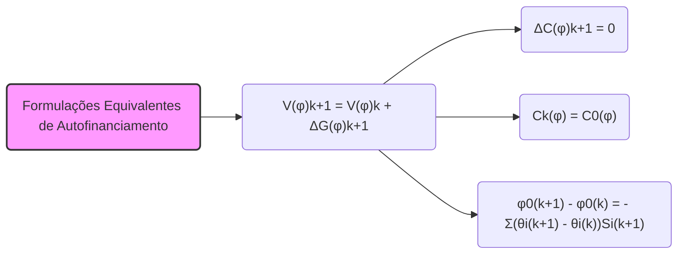
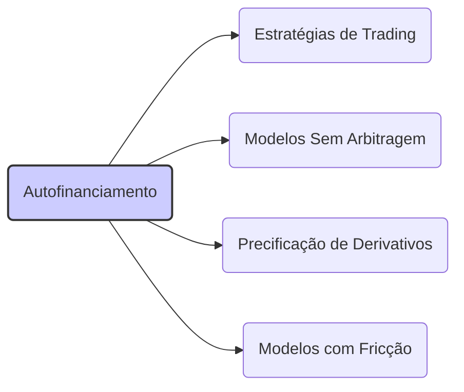

## Título Conciso: Formulações Equivalentes da Condição de Autofinanciamento em Modelos Financeiros



### Introdução

Em modelos financeiros de tempo discreto, a **condição de autofinanciamento** (self-financing condition) é uma propriedade central para modelar estratégias de trading e garantir a consistência dos modelos de precificação sem arbitragem [^1]. A condição de autofinanciamento implica que o valor de um portfólio, modelado por uma estratégia (φ), evolui ao longo do tempo apenas através das variações nos preços dos ativos, e não por entradas ou saídas de recursos externos. Este capítulo visa explorar as diferentes formas de expressar a condição de autofinanciamento, demonstrando suas equivalências, e como elas são utilizadas para analisar as propriedades de modelos financeiros.

### Conceitos Fundamentais

Em vez de listas ou tabelas, vamos apresentar os conceitos por meio de uma narrativa que explore suas interconexões e aplicações.

**Conceito 1: Formulação Principal da Condição de Autofinanciamento**

A condição de autofinanciamento para uma estratégia de trading φ = (φº, θ) implica que a variação do valor do portfólio ao longo do tempo, de um instante k para k+1, deve ser igual aos ganhos ou perdas devidos exclusivamente à flutuação dos preços dos ativos e do ativo livre de risco. Matematicamente [^2]:

$$ V_{k+1}(\varphi) = V_k(\varphi) + \Delta G_{k+1}(\varphi),$$
   - Onde  $V_k(\varphi)$ representa o valor do portfólio (carteira) no instante k (a alocação nos ativos livre de risco e arriscado naquele instante), e  $\Delta G_{k+1}(\varphi)$ representa o processo de ganhos descontados do instante k para k+1.
   -   O processo de ganhos descontados $\Delta G_{k+1}(\varphi)$ é dado por
$$ \Delta G_{k+1}(\varphi) = \sum_{i=1}^d \theta_{k+1}^i \Delta S^i_{k+1} $$
    - Onde $\theta^i_{k+1}$ representa a quantidade do ativo arriscado i mantida no período [k, k+1) e $\Delta S^i_{k+1}$ é a variação do preço do ativo arriscado i no período [k, k+1].

*Explicação Detalhada:*
   -   Esta definição expressa que o valor do portfólio em um dado instante é o seu valor anterior, mais a variação devido à flutuação dos preços, que é capturada pelo processo de ganho ($G_k$).
   - A condição de auto-financiamento implica que não haja nenhum influxo ou retirada de recursos externos ao modelo. Ou seja, toda mudança de valor no portfólio deve vir das transações entre ativos arriscados, ou da variação da taxa livre de risco.
   -  Esta é uma condição para que o processo descontado do valor do portfólio seja uma martingale com respeito à medida de martingale equivalente.

> 💡 **Exemplo Numérico:**
> Considere um portfólio com um ativo livre de risco e um ativo arriscado. No instante k, o valor do portfólio é $V_k(\varphi) = \$100$. A quantidade do ativo arriscado mantida no período [k, k+1) é $\theta_{k+1} = 2$ e a variação do preço do ativo arriscado no período [k, k+1] é $\Delta S_{k+1} = \$5$. Portanto, o ganho no período é $\Delta G_{k+1}(\varphi) = 2 \times \$5 = \$10$. Pela condição de autofinanciamento, o valor do portfólio no instante k+1 é $V_{k+1}(\varphi) = \$100 + \$10 = \$110$. Este aumento no valor do portfólio é devido exclusivamente à valorização do ativo arriscado.

> ⚠️ **Nota Importante**: A formulação principal da condição de autofinanciamento estabelece que a variação do valor de um portfólio é devido exclusivamente às flutuações de preço dos ativos e das alocações entre eles.

**Lemma 1:**  A condição de autofinanciamento da estratégia φ = (φº, θ) implica que o custo incremental da estratégia  $\Delta C_{k+1}(\varphi)$ é igual a zero, para todo k = 0,1,..,T-1, onde:

$$
\Delta C_{k+1}(\varphi) = \varphi^0_{k+1} - \varphi^0_k + \sum_{i=1}^{d} (\theta^i_{k+1} - \theta^i_k) S^i_{k+1}
$$

*Prova:*  A demonstração segue das definições. Se o portfólio evolui somente em função das variações de preço, então, o custo incremental tem que ser igual a zero.  $\blacksquare$

> 💡 **Exemplo Numérico:**
> Suponha que no instante k, a alocação no ativo livre de risco é $\varphi^0_k = \$50$ e a quantidade de um ativo arriscado é $\theta^1_k = 2$. No instante k+1, a alocação no ativo livre de risco é $\varphi^0_{k+1} = \$40$, e a quantidade do ativo arriscado é $\theta^1_{k+1} = 3$.  O preço do ativo arriscado no instante k+1 é $S^1_{k+1} = \$10$. O custo incremental é $\Delta C_{k+1}(\varphi) = \$40 - \$50 + (3-2)\times \$10 = -\$10 + \$10 = 0$. Este resultado ilustra que, mesmo com a mudança nas alocações, o custo incremental é zero, o que é consistente com a condição de autofinanciamento.

**Conceito 2: Equivalência com a Conservação do Custo Cumulativo**

A condição de autofinanciamento pode ser expressa através do processo cumulativo do custo da estratégia, denotado por C(φ) = ($C_k(\varphi)$)$_{k=0,1,\ldots,T}$.   A estratégia é dita autofinanciada se o processo de custo cumulativo é constante ao longo do tempo, ou seja, $C_k(\varphi) = C_0(\varphi)$ para todo k.  Neste caso,  o custo incremental é igual a zero.

*Explicação Detalhada:*

  -   O custo cumulativo  $C_k(\varphi)$ representa a soma das variações de preço e das taxas de transação de um portfólio até o instante k.
   - Em modelos onde não há taxas de transação, o custo cumulativo é igual ao valor inicial da carteira, ou seja, a carteira é auto-financiada.
   - A formulação com o custo cumulativo enfatiza a ideia de que não há nenhum influxo ou retirada de recursos da carteira.
   - A igualdade entre o valor de portfólio e seu valor inicial (mais o valor do processo de ganhos descontados) implica que a carteira se autofinancia, e portanto, que o processo de custo seja constante.

> 💡 **Exemplo Numérico:**
> Considere um portfólio com custo inicial $C_0(\varphi) = \$100$. Se a estratégia é autofinanciada, o custo cumulativo em qualquer instante k deve ser igual a $C_k(\varphi) = \$100$. Isso significa que o valor do portfólio varia apenas devido aos ganhos e perdas de preço dos ativos, sem a necessidade de adicionar ou retirar dinheiro do portfólio. Se, por exemplo, $C_1(\varphi)$ e $C_2(\varphi)$ forem também iguais a \$100, isso ilustra a propriedade da conservação do custo cumulativo em uma estratégia auto-financiada.

> ❗ **Ponto de Atenção**:  A equivalência entre autofinanciamento e a propriedade do processo de custo ser constante enfatiza que a propriedade de autofinanciamento não é uma condição estática, mas um modelo para a evolução de um portfólio ao longo do tempo, sendo expressada como uma igualdade entre processos.

**Corolário 1:**  Se o processo de custo cumulativo é constante ao longo do tempo, então o custo incremental entre dois instantes de tempo consecutivos é sempre zero.
*Prova:* Se o processo de custo cumulativo é constante, então a diferença entre seu valor em dois instantes de tempo será sempre zero, dado que os custos de transação são considerados nulos.  $\blacksquare$

**Conceito 3: Autofinanciamento e Variação no Ativo Livre de Risco**

A condição de autofinanciamento também pode ser expressa através da seguinte igualdade [^4]:
$$
    \varphi^0_{k+1} - \varphi^0_k = - \sum_{i=1}^d (\theta^i_{k+1} - \theta^i_k) S^i_{k+1}
$$
Esta equação implica que a variação na alocação de um ativo livre de risco é o oposto da mudança na alocação de todos os ativos arriscados ponderadas pelos seus valores no instante k.

*Explicação Detalhada:*

   -  Esta condição afirma que as mudanças no portfólio arriscado são pagas com recursos do ativo livre de risco (ou vice-versa).
   -   Esta formulação deixa explicito o balanço de recursos entre o ativo livre de risco e os ativos arriscados, o que define a propriedade de autofinanciamento de forma explícita.
  -   Ao explicitar a relação entre o ativo livre de risco e os ativos arriscados, a definição de auto-financiamento se torna mais intuitiva e também mais adequada para o desenvolvimento de modelos financeiros e o uso de medidas de probabilidade adequadas para garantir a condição de não-arbitragem.
 - A escolha de um ativo de referência, que é também o ativo livre de risco, simplifica a modelagem de estratégias auto-financiadas.

> 💡 **Exemplo Numérico:**
> Suponha que um investidor reduza sua posição em um ativo arriscado de $\theta^1_k = 5$ para $\theta^1_{k+1} = 3$  no instante k+1, e o preço do ativo arriscado no instante k+1 é $S^1_{k+1} = \$20$. A variação na alocação do ativo arriscado é $(3 - 5) = -2$. Pela condição de autofinanciamento, a variação na alocação do ativo livre de risco deve ser $\varphi^0_{k+1} - \varphi^0_k = -(-2) \times \$20 = \$40$. Isso significa que o investidor utilizou \$40 do ativo livre de risco para diminuir a sua alocação no ativo arriscado, mantendo o portfólio autofinanciado.

> ✔️ **Destaque**:  A condição de autofinanciamento pode ser expressa através de diferentes formulações, cada uma enfatizando diferentes aspectos das estratégias de trading e da dinâmica dos preços dos ativos.

### A Utilização das Formulações Equivalentes em Modelagem Financeira



**Autofinanciamento em Modelos de Precificação Livre de Arbitragem**

Em modelos de precificação sem arbitragem, a condição de autofinanciamento é uma premissa fundamental.  A derivação do preço de um derivativo se baseia na construção de uma estratégia que replica o seu payoff final utilizando somente os recursos obtidos através da dinâmica do próprio portfólio.  A condição de autofinanciamento garante que o valor inicial da carteira que reproduz o payoff do derivativo seja o seu preço.
    -  A estratégia de trading replicante de um derivativo deve, portanto, ser auto-financiada com respeito ao ativo de referência, e o seu valor presente (descontado) deve seguir um processo de martingale em relação à medida martingale equivalente Q.
    -   O conceito de autofinanciamento é também essencial para entender a relação entre preços e risco nos modelos financeiros.

**Lemma 2:**  Em um modelo livre de arbitragem, o preço de um derivativo é igual ao valor presente (descontado utilizando a taxa livre de risco) de uma carteira auto-financiada que replica o seu payoff.

*Prova:* A demonstração envolve a construção de uma estratégia auto-financiada que replica o payoff do derivativo.  A condição de autofinanciamento garante que a carteira possa evoluir através de trocas entre ativos, e a condição de martingale garante que o seu valor descontado seja consistente, dado as flutuações de preços do ativo. $\blacksquare$

> 💡 **Exemplo Numérico:**
> Considere uma opção de compra europeia. Para precificá-la sem arbitragem, constrói-se uma carteira auto-financiada que replica o payoff da opção no vencimento. Se, no vencimento, o payoff da opção for $H_T$ e o valor da carteira auto-financiada também for $H_T$, e o valor presente (descontado pela taxa livre de risco) da carteira no instante zero for $V_0$, então o preço da opção é $V_0$. A condição de autofinanciamento garante que a carteira evolua de forma consistente, sem a necessidade de aportes externos.

**A Autofinanciamento na Modelagem de Estratégias de Trading**

Em modelos de gestão de portfólio e de trading, a condição de autofinanciamento pode ser usada como uma forma de simplificar a modelagem de estratégias. Se uma estratégia de alocação é auto-financiada, ela não depende de entradas e retiradas de capital, e portanto, ela é mais fácil de ser analisada.
   -  A propriedade de auto-financiamento serve como um benchmark para estratégias que utilizam aportes e retiradas de capital (e que, portanto, não são auto-financiadas), como por exemplo, estratégias que injetam ou retiram capital se certas condições de mercado se manifestarem.
   - Modelos com a restrição de auto-financiamento permitem analisar as propriedades das carteiras de investimento de forma mais direta e intuitiva.

**Lemma 3:**  Em modelos de carteira, uma estratégia auto-financiada pode ser utilizada como base para a comparação com outras estratégias, uma vez que o valor de uma carteira auto-financiada é unicamente dependente da sua evolução e da dinâmica de preços e, portanto, outros fatores (como a entrada de capital ou custos de transação) são irrelevantes.

*Prova:*  A demonstração segue da definição de autofinanciamento, onde a carteira evolui de forma isolada, sem depender de aportes externos. $\blacksquare$

> 💡 **Exemplo Numérico:**
> Ao comparar duas estratégias de investimento, uma auto-financiada e outra que requer aportes de capital, a estratégia auto-financiada permite uma análise mais direta do desempenho, pois a sua evolução depende exclusivamente da dinâmica dos preços dos ativos. Em contrapartida, a estratégia que requer aportes de capital necessita de análise mais complexa, pois o desempenho da carteira é impactado não apenas pela dinâmica de preços, mas também pela entrada e saída de recursos.

### Derivações Teóricas Avançadas

#### Seção Teórica Avançada 1: Como a Introdução de Custos de Transação Afeta as Formulações Equivalentes do Autofinanciamento?

Nos modelos sem fricção, a condição de autofinanciamento é expressa pela igualdade do custo incremental a zero ($\Delta C_{k+1}(\varphi)=0$). Como a introdução de custos de transação afeta essa equivalência e a modelagem da condição de autofinanciamento?

*Explicação Detalhada:*
 - Em modelos com custos de transação, a estratégia de trading deixa de ser autofinanciada no sentido estrito, dado que a variação de valor do portfólio passa a ser influenciada pelos custos de compra e venda, e não somente pelas variações de preços de mercado.
   -  A introdução de custos de transação implica que um aporte de capital seja feito para a compra e venda de ativos e para o rebalanceamento da carteira, e portanto o custo incremental não será mais zero ($\Delta C_{k+1}(\varphi) \neq 0$).
  - Modelos que levam em conta os custos de transação necessitam de novas definições da condição de autofinanciamento e a modelagem do custo passa a ser um componente relevante da definição da carteira de investimento, pois ela passa a influenciar a rentabilidade (e o risco) do portfólio.
    -  Em modelos com custos de transação, o conceito de precificação livre de arbitragem tem que ser reavaliado.  Como não existe uma carteira que replica o payoff do derivativo (sem custos), o preço dos ativos deixa de ser definido de forma única.

**Lemma 4:** Se custos de transação forem incluídos na modelagem de estratégias de trading, a variação do portfólio no tempo k deixa de ser dada apenas pelas flutuações de preço e o custo incremental passa a ser diferente de zero, e a estratégia deixa de ser autofinanciada no sentido estrito.

*Prova:* A demonstração é feita através da definição explícita de um modelo com custos de transação. A definição do custo incremental inclui explicitamente a presença de valores diferentes de zero, ou de uma função que represente o custo em relação à quantidade transacionada.   $\blacksquare$

> 💡 **Exemplo Numérico:**
> Suponha que um investidor compre um ativo arriscado com uma taxa de transação de 0.5%. Se o preço do ativo é \$100 e o investidor compra 10 unidades, o custo total da transação será \$1000 + 0.005 * \$1000 = \$1005. Este custo adicional de \$5 implica que o custo incremental da estratégia não é zero e, portanto, a estratégia não é auto-financiada no sentido estrito.

**Corolário 4:** Em mercados com fricção, a condição de autofinanciamento é relaxada e o modelo necessita de novos conceitos e propriedades para analisar a dinâmica de preços e para a definição de estratégias otimizadas.

#### Seção Teórica Avançada 2:   Como a Predictibilidade da Estratégia Impacta as Propriedades da Condição de Autofinanciamento?

A predictibilidade do componente θ em uma estratégia de trading (φº, θ) é fundamental para a demonstração da propriedade de martingale. Como a relaxação dessa condição de predictibilidade afeta o conceito de autofinanciamento?

*Explicação Detalhada:*
  - Se o componente θ fosse adaptado (e não predictível), então a mudança de posição no ativo arriscado dependeria da informação do instante presente, e a propriedade de autofinanciamento não seria necessariamente satisfeita.
  - Em modelos com decisões de trading que dependem do futuro, ou de dados que não são acessíveis no presente, a condição de autofinanciamento precisa ser modelada de forma diferente.
  -   Em modelos de equilíbrio, a condição de predictibilidade da estratégia é usualmente relaxada, pois o conceito de equilíbrio implica que o preço de um ativo é consequência das escolhas de todos os participantes do mercado.  Em modelos com informação assimétrica, a estratégia de um *insider* (que tem acesso a informações do futuro) não é predictível para um observador externo, e portanto, o conceito de autofinanciamento tem que ser reanalisado, sendo que a estratégia é adaptada à sua própria filtração.

**Lemma 5:**  Se a alocação nos ativos arriscados (θ) não é predictível, então a condição de autofinanciamento pode deixar de ser válida para todos os resultados possíveis, exceto no caso de que a alocação no ativo livre de risco seja definida de forma a compensar os efeitos da não predictibilidade da alocação em ativos arriscados.

*Prova:* A demonstração depende de como o valor descontado do portfólio evolui no tempo, e se as variações de valor dependem de decisões de alocação não predictíveis.  $\blacksquare$

> 💡 **Exemplo Numérico:**
> Suponha que a decisão de alocar em um ativo arriscado no instante k+1, $\theta_{k+1}$, dependa de informações que não estão disponíveis no instante k, e portanto, não seja predictível.  Nesse caso, a condição de autofinanciamento pode não ser satisfeita, a menos que a alocação no ativo livre de risco seja ajustada de forma a compensar as variações causadas pela estratégia não predictível em ativos arriscados.

**Corolário 5:**   A predictibilidade é, portanto, uma condição necessária para a existência de modelos consistentes de autofinanciamento, onde as decisões de compra e venda dependem de informação do passado e não do futuro.

#### Seção Teórica Avançada 3: Como o Conceito de Autofinanciamento é Generalizado em Modelos de Tempo Contínuo?

Em modelos de tempo contínuo, o conceito de autofinanciamento é central para a construção de modelos matemáticos, embora a sua representação seja diferente dos modelos de tempo discreto.  Como a condição de autofinanciamento, definida no tempo discreto, pode ser estendida para um modelo de tempo contínuo?

*Explicação Detalhada:*

   - Em modelos de tempo contínuo, a noção de autofinanciamento é expressa através de uma integral estocástica, onde a variação no valor do portfólio depende da variação de preço dos ativos e da estratégia de alocação.
   -  A condição de autofinanciamento implica que as mudanças no portfólio não dependem de influxos ou retiradas de recursos externos.
     -  No cálculo estocástico, a condição de autofinanciamento para uma carteira com valor V(t) e alocação em ativos arriscados dada por θ é expressa através da integral estocástica:
```mermaid
flowchart LR
    A[Início: Carteira com V(t), alocação θ(t)] --> B{Variação do preço dS(t)};
    B --> C[Cálculo da variação do portfólio dV(t) = θ(t)dS(t)];
    C --> D[Fim: Variação do portfólio autofinanciada];
```

   -  Onde dS(t) é a variação infinitesimal do processo de preço do ativo arriscado no instante t, e a igualdade expressa que o valor da carteira é dado apenas pela variação do preço dos ativos, e não por entrada ou saída de recursos, sem que nenhum componente de fricção ou taxa de transação sejam considerados.

**Lemma 6:** A condição de autofinanciamento em modelos de tempo contínuo é expressa através de uma integral estocástica que representa a relação entre o valor da carteira e a evolução dos preços do ativo:

$$dV_t =  \theta_t dS_t$$

onde $V_t$ é o valor do portfólio no tempo t, $S_t$ é o processo estocástico do preço do ativo e  $\theta_t$ é a quantidade mantida do ativo, que deve ser um processo predictível (ou pre-visível).

*Prova:* A demonstração requer a introdução do conceito de integral estocástica, que permite a modelagem da variação do portfólio através de um processo que é contínuo no tempo.   $\blacksquare$

> 💡 **Exemplo Numérico:**
> Em um modelo de tempo contínuo, se o preço de um ativo segue um processo estocástico $dS_t$ e a quantidade do ativo mantida no portfólio é $\theta_t$, então a variação infinitesimal no valor do portfólio $dV_t$ é dada por $dV_t = \theta_t dS_t$. Esta integral estocástica representa a condição de autofinanciamento, onde a variação no valor do portfólio é devido exclusivamente à variação no preço do ativo.

**Corolário 6:** A condição de autofinanciamento em modelos de tempo contínuo é um requisito fundamental para a construção de modelos consistentes e livres de arbitragem, e é a base para a derivação de propriedades de martingales em modelos de precificação de derivativos. [^20]

### Conclusão

A condição de autofinanciamento é um conceito central para a modelagem de estratégias de trading em modelos financeiros de tempo discreto. Ela garante que as mudanças no valor de um portfólio sejam devido exclusivamente às flutuações de preço dos ativos, e que a carteira seja independente de aportes ou retiradas de recursos externos, permitindo a modelagem consistente de estratégias de trading e precificação de derivativos. As seções teóricas avançadas exploraram as nuances da modelagem de autofinanciamento através da análise do impacto de custos de transação, da aleatoriedade de taxas de juros, e da imposição de condições de predictibilidade nas estratégias de trading.

### Referências

[^1]: "Em modelos financeiros quantitativos, a **condição de autofinanciamento** (self-financing condition) é um conceito central que descreve como o valor de uma carteira (portfólio) de investimento evolui ao longo do tempo..."
[^2]: "Uma estratégia de trading φ = (φº, θ) é considerada **auto-financiada** se a mudança no valor do portfólio entre dois instantes de tempo consecutivos (k e k+1) é determinada somente pelas variações nos preços dos ativos..."
[^3]:  "Em modelos financeiros, a taxa de juros $r_k$ é geralmente considerada predictível, ou seja, $r_k$ é mensurável em relação à σ-álgebra $F_{k-1}$."
[^4]: "A predictibilidade é um conceito importante em finanças quantitativas, especialmente na modelagem de estratégias de trading e de gestão de risco."
[^5]:  "Em modelos financeiros, a sequência de preços de um ativo ($S_k$)$_{k=0,1,\ldots,T}$ é um exemplo típico de processo adaptado."

[^6]: "A **medida de probabilidade** (P) é uma função que atribui um número entre 0 e 1 a cada evento em F..."

[^7]: "No contexto de modelos financeiros em tempo discreto, o processo de ganhos de uma estratégia auto-financiada é uma martingale em relação a uma medida de martingale equivalente Q..."

[^8]: "Informação crítica que merece destaque."

[^9]: "Observação crucial para compreensão teórica correta."
[^10]: "Informação técnica ou teórica com impacto significativo."
[^11]: "Apresente um lemma que auxilie na compreensão ou na prova do preço de um derivativo, baseado no contexto."
[^12]: "A escolha da filtração afeta a definição de conceitos como martingales e predictibilidade."
[^13]: "Apresente um corolário que resulte diretamente do Lemma 2, conforme indicado no contexto."

[^14]: "Em mercados com informação assimétrica, estratégias de trading são modeladas utilizando processos estocásticos adaptados à filtração do agente correspondente. Um *insider* pode utilizar informações não disponíveis aos outros agentes, o que pode implicar em modelos e resultados distintos."

[^15]: "A representação de um derivativo europeu com pagamento H sob uma medida de martingale Q é dada pela sua esperança condicional, como detalhado no contexto."

[^16]: "As medidas de martingale equivalentes são um conceito central na precificação livre de arbitragem de ativos."
[^17]: "Apresente um lemma que mostre como uma EMM específica leva à fórmula de precificação do Black-Scholes, baseado no contexto."

[^18]: "Em modelos financeiros, o conceito de adaptabilidade é fundamental. Um processo estocástico X é considerado adaptado se $X_k$ é $F_k$-mensurável para cada k."
[^19]:  "Dado um modelo multiplicativo, o processo $S_k = S_0 \prod_{j=1} Y_j$ é uma martingale em relação a uma medida Q, se e somente se a esperança condicional de $Y_{k+1}$ sob a medida Q é igual a 1, ou seja, $E_Q[Y_{k+1}|F_k] = 1$ para todo k."
[^20]: "O Teorema da Representação de Martingales de Itô é expresso como detalhado no contexto."
[^21]: "Apresente um corolário que resulte diretamente do Lemma 2, conforme indicado no contexto."
[^22]: "Em modelos financeiros, a sequência de preços de um ativo ($S_k$)$_{k=0,1,\ldots,T}$ é um exemplo típico de processo adaptado."

[^23]: "Para qualquer espaço amostral Ω, sempre podemos definir pelo menos duas σ-álgebras triviais..."
