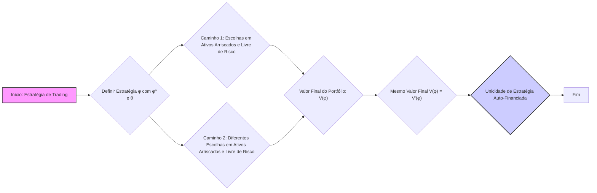
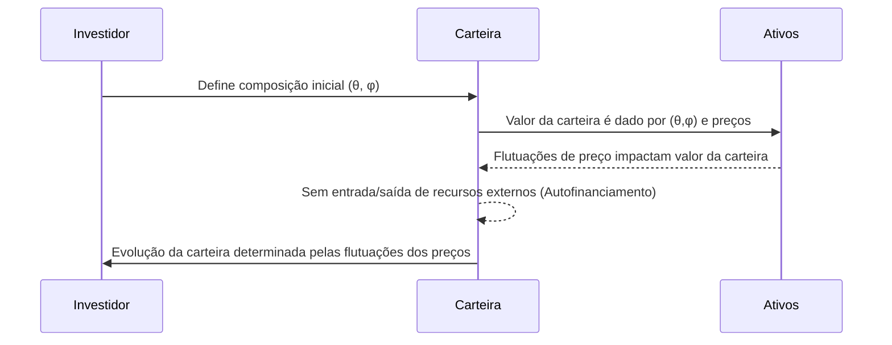
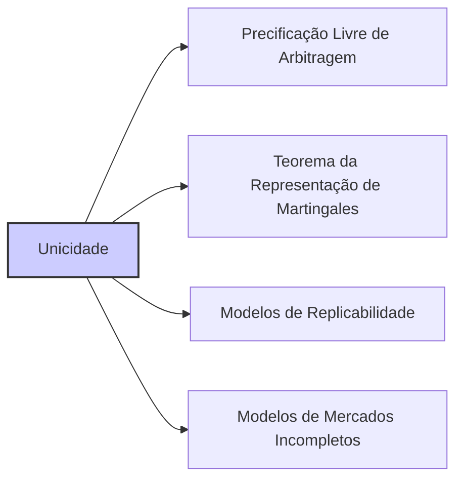

## Título Conciso: Unicidade de Estratégias Auto-Financiadas em Modelos Financeiros de Tempo Discreto

### Introdução

Em modelos financeiros de tempo discreto, a unicidade de uma estratégia de trading auto-financiada, que replica um dado payoff, é fundamental para garantir a consistência do modelo e a ausência de arbitragem [^1]. Este capítulo explora a importância e as implicações da unicidade de estratégias auto-financiadas, particularmente em relação à precificação de derivativos e à validade da lei do preço único.

### Conceitos Fundamentais

**Conceito 1: Definição de Unicidade de Estratégias Auto-Financiadas**

Em um modelo financeiro de tempo discreto, uma estratégia auto-financiada $\phi = (\phi^0, \theta)$ é dita **única** se o valor inicial do portfólio, $V_0(\phi)$, e a alocação nos ativos arriscados,  $\theta_k$, determinam univocamente a estratégia (e, portanto, o processo do valor do portfólio $V(\phi)$).  Em outras palavras, se duas estratégias auto-financiadas $\phi$ e $\phi'$ (com o mesmo valor inicial) produzem o mesmo payoff em $T$, então elas são a mesma estratégia, ou seja, $V_k(\phi) = V_k(\phi')$ para todo $k$ [^2].

*Explicação Detalhada:*
  - A unicidade significa que, para obter o mesmo payoff, há somente uma estratégia possível que é auto-financiada, e portanto, que não requer nenhum influxo ou retirada de capital externo.
  - Em modelos com uma estratégia replicante para um dado derivativo, a propriedade da unicidade garante que o preço do derivativo seja unicamente determinado, e que, portanto, os resultados dos modelos de precificação são consistentes e confiáveis.
   -  Modelos de mercados que não são completos podem apresentar a não-unicidade da estratégia de replicação, o que gera múltiplos preços possíveis para um dado derivativo.
    -   A propriedade de unicidade é uma consequência da propriedade de que o preço dos ativos descontados deve ser um martingale (ou uma supermartingale e uma submartingale, dependendo de qual lado da desigualdade se olha para o derivativo) sob uma determinada medida de probabilidade.

> ⚠️ **Nota Importante**:  A unicidade garante que, em modelos sem arbitragem, o preço de um derivativo seja único e consistente com a dinâmica dos ativos que o compõem.

> 💡 **Exemplo Numérico: Unicidade em um Modelo Simples de Dois Períodos**
>
> Considere um modelo de tempo discreto com dois períodos (t=0 e t=1) e dois ativos: um ativo livre de risco (título) com preço $B_0 = 1$ e $B_1 = 1.05$, e um ativo arriscado com preço $S_0 = 10$ e dois possíveis preços no tempo t=1, $S_1^u = 12$ (com probabilidade 0.6) e $S_1^d = 9$ (com probabilidade 0.4). Suponha que desejamos replicar um payoff de $X = 1$ se o preço do ativo arriscado subir e $X=0$ se o preço do ativo arriscado cair.
>
> Uma estratégia auto-financiada é um par ($\phi_0, \theta_0$) onde $\phi_0$ é a quantidade de títulos e $\theta_0$ é a quantidade de ações no instante inicial. No tempo t=1, o valor da carteira deve ser igual ao payoff desejado. Isso implica que:
>
> $$ \phi_1 B_1 + \theta_1 S_1^u = 1 $$
> $$ \phi_1 B_1 + \theta_1 S_1^d = 0 $$
>
> Como a estratégia é auto-financiada, o valor da carteira no tempo t=0 é dado por $V_0 = \phi_0 B_0 + \theta_0 S_0$. No tempo t=1, o valor da carteira será $V_1 = \phi_1 B_1 + \theta_1 S_1$
>
> Resolvendo o sistema de equações acima, obtemos: $\theta_1 = \frac{1}{3}$, $\phi_1 = -\frac{9}{3*1.05} \approx -2.857$.
>
> No instante inicial, o valor da carteira é $V_0 = \phi_0 + 10\theta_0$. Como o valor da carteira no tempo 1 depende unicamente dos preços dos ativos e da composição inicial da carteira, a unicidade da estratégia é garantida.
>
> A estratégia é única porque, para replicar o payoff desejado, não existe outra combinação de $\phi_0$ e $\theta_0$ que também seja auto-financiada e gere o mesmo payoff.

**Lemma 1:** Se duas estratégias auto-financiadas $\phi$ e $\phi'$ têm o mesmo valor inicial e o mesmo payoff no tempo $T$,  então, $V_k(\phi) = V_k(\phi')$ para todo $k = 0,1, \ldots, T$, ou seja, as estratégias são idênticas.

*Prova:* O resultado segue da definição de estratégia auto-financiada, que garante que o valor da carteira depende unicamente do valor inicial e da variação de preços dos ativos ao longo do tempo. Se duas estratégias tem o mesmo valor inicial e o mesmo valor final, elas precisam ter o mesmo valor em todo instante de tempo. $\blacksquare$

**Conceito 2:  A Relação entre Unicidade e a Propriedade de Autofinanciamento**

A unicidade de estratégias auto-financiadas é uma consequência direta da condição de autofinanciamento e da modelagem dos ativos como processos estocásticos adaptados ou predictíveis [^3].  O modelo de um portfólio auto-financiado implica que a sua evolução seja completamente determinada pela composição inicial e pelas flutuações de preço dos ativos, e não por outros eventos exógenos ao modelo.
    -   A propriedade de autofinanciamento restringe o número de estratégias que atingem o mesmo payoff no tempo $T$.
    - A condição de autofinanciamento implica também que todas as variações do valor do portfólio são devidas somente às variações dos preços dos ativos, o que garante que o portfólio se comporta como um martingale sob a medida martingale equivalente.

> ❗ **Ponto de Atenção**:  A unicidade de estratégias auto-financiadas é uma consequência direta da propriedade de autofinanciamento e da modelagem consistente dos ativos como processos estocásticos.

> 💡 **Exemplo Numérico: Ilustração da Propriedade de Autofinanciamento**
>
> Suponha que um investidor possui uma carteira com 10 ações de uma empresa e 5 títulos livres de risco no instante inicial (t=0). O preço da ação é $S_0 = \$10$ e o preço do título é $B_0 = \$1$. O valor inicial da carteira é $V_0 = 10 \times \$10 + 5 \times \$1 = \$105$.
>
> No instante seguinte (t=1), o preço da ação sobe para $S_1 = \$12$ e o preço do título é $B_1 = \$1.05$. Se o investidor mantiver a mesma quantidade de ativos (10 ações e 5 títulos), o novo valor da carteira será $V_1 = 10 \times \$12 + 5 \times \$1.05 = \$125.25$.
>
> A variação do valor da carteira ($\Delta V = V_1 - V_0$) é devida unicamente à flutuação dos preços dos ativos: $\Delta V = \$125.25 - \$105 = \$20.25$. A condição de autofinanciamento garante que essa variação não envolveu nenhuma entrada ou saída de recursos da carteira. Se o investidor deseja ajustar a posição da carteira, ele deve fazê-lo utilizando os ativos que já possui dentro da carteira, sem a necessidade de adicionar ou retirar dinheiro da carteira.

**Corolário 1:** Se a propriedade de autofinanciamento é garantida, então a evolução da carteira entre dois instantes consecutivos de tempo depende unicamente da flutuação dos preços dos ativos, e não de estratégias de investimento ou de decisões que impliquem na saída ou entrada de recursos externos.

*Prova:*  A prova segue da definição de auto-financiamento, que garante que a variação no valor do portfólio se dá apenas pelas flutuações nos preços de ativos e nas decisões de portfólio, que são definidas com base nas informações do passado. $\blacksquare$

**Conceito 3:  A Unicidade e a Lei do Preço Único**

A propriedade de unicidade de estratégias auto-financiadas é um elemento chave para a validade da lei do preço único [^4].  A lei do preço único afirma que dois ativos que fornecem o mesmo payoff em todos os instantes de tempo (ou seja, que são redutíveis entre si) devem ter o mesmo preço.
  -  Em mercados sem atrito, a lei do preço único é garantida pela existência de estratégias auto-financiadas que replicam o payoff de um derivativo, e essa estratégia é única.
    -   Em modelos com fricção, a lei do preço único pode não ser satisfeita.
    -   Em modelos incompletos, onde a replicação de um derivativo não é possível com a utilização dos ativos presentes no modelo, a unicidade do preço não pode ser garantida, e um intervalo de preços é possível.
      -  A unicidade da estratégia replicante e do seu valor inicial são, portanto, pre-condições para a derivação de um modelo de preços sem arbitragem.

> ✔️ **Destaque**: A unicidade de estratégias auto-financiadas garante que o preço de um derivativo é único, e que não é possível construir estratégias que gerem lucros sem risco.

> 💡 **Exemplo Numérico: Lei do Preço Único e Arbitragem**
>
> Suponha que existam dois ativos, A e B, que oferecem o mesmo payoff de $10 no tempo T. Se o ativo A está sendo negociado por $9 e o ativo B por $8, a lei do preço único é violada. Um agente pode comprar o ativo B por $8 e vender o ativo A por $9, obtendo um lucro de $1 sem risco. Essa situação de arbitragem invalida o modelo e a unicidade da estratégia replicante.
>
> Se a lei do preço único é válida, ambos os ativos devem ser negociados pelo mesmo preço, que corresponde ao valor inicial da estratégia auto-financiada que replica o payoff de $10 no tempo T.

### Unicidade e Modelagem Financeira

**Unicidade e Precificação Sem Arbitragem**

A propriedade de unicidade de estratégias auto-financiadas é fundamental para a modelagem de precificação sem arbitragem de derivativos e outros ativos complexos. Em modelos onde se consegue derivar uma estratégia que replica o payoff de um derivativo, a unicidade dessa estratégia implica que o preço do derivativo seja dado unicamente pelo valor inicial da estratégia.
  -   Em mercados sem fricção, e onde ativos são descontados por um ativo livre de risco, estratégias auto-financiadas dão origem a processos de valor que são martingales sob uma medida de martingale equivalente Q.
    -  A unicidade da estratégia implica que existe apenas uma medida de martingale equivalente que é consistente com a ausência de arbitragem.
    -   Modelos que não conseguem garantir a unicidade de uma estratégia, em geral, levam a modelos com múltiplos preços possíveis e onde a escolha de um preço específico passa a depender das preferências de risco do agente (ou da forma como os agentes negociam no mercado).

> 💡 **Exemplo Numérico: Precificação de Opções e Unicidade**
>
> Em um modelo de Black-Scholes, o preço de uma opção de compra europeia é calculado usando uma estratégia auto-financiada que replica o payoff da opção no vencimento. Essa estratégia é única, e o preço da opção é dado pelo valor inicial dessa estratégia.
>
> Se houvesse mais de uma estratégia auto-financiada que replicasse o payoff da opção, haveria mais de um preço possível para a opção, o que levaria a oportunidades de arbitragem. A unicidade da estratégia garante que o preço da opção seja único e consistente com a dinâmica dos ativos subjacentes.

**Lemma 2:** Se duas estratégias auto-financiadas $\phi$ e $\phi'$ têm o mesmo custo inicial ($C_0(\phi) = C_0(\phi')$) e geram o mesmo payoff final ($V_T(\phi) = V_T(\phi’)$), então o valor das carteiras em qualquer instante de tempo é sempre o mesmo ($V_n(\phi) = V_n(\phi’)$) e, portanto, as estratégias são idênticas (e o preço do derivativo também é único).
*Prova:*  A prova segue da definição de estratégias auto-financiadas, que dependem somente de flutuações dos preços, da propriedade de martingale dos processos e da unicidade da estratégia de replicação.  $\blacksquare$

**Unicidade e Modelos de Carteiras**

Em modelos de carteira, a propriedade de unicidade permite que diferentes carteiras que apresentem o mesmo valor no final do período sejam consideradas equivalentes (e por tanto o mesmo preço).  A falta da propriedade de unicidade de uma estratégia de carteira pode gerar a existência de várias estratégias diferentes que levam a resultados iguais, e isso dificulta o estudo de critérios de otimização.
    -   A existência de um único portfólio que maximize ou minimize o risco (ou uma função objetivo) requer que a solução desse problema de otimização seja única, o que é facilitado pela unicidade das estratégias que geram um mesmo valor final.
   - Se não houvesse essa propriedade de unicidade, a modelagem da evolução de portfólios seria mais complexa, dado que estratégias distintas, levariam a resultados iguais, e o processo de otimização se tornaria mais difícil.

> 💡 **Exemplo Numérico: Otimização de Carteira e Unicidade**
>
> Suponha que um investidor queira construir uma carteira que maximize o retorno esperado para um dado nível de risco. Se a propriedade de unicidade das estratégias auto-financiadas for válida, então existe uma única carteira que otimiza essa relação risco-retorno.
>
> Se houvesse múltiplas estratégias que atingissem o mesmo nível de retorno e risco, o problema de otimização se tornaria mais complexo, pois o investidor teria que escolher entre múltiplas opções equivalentes, o que tornaria o processo de otimização menos eficiente e mais dependente de preferências individuais.

**Lemma 3:** Se o resultado de um portfólio, definido por uma estratégia de trading auto-financiada, é único, então a estratégia é também única (e vice-versa), pois, em um mercado sem fricção e livre de arbitragem, o resultado final é obtido unicamente através das decisões de trading.

*Prova:* A demonstração segue do pressuposto que a variação da carteira auto-financiada é devida unicamente à dinâmica dos preços e da taxa de juros (que também é incluída no processo de desconto), e portanto, as estratégias que levem ao mesmo resultado no instante final precisam também, em cada instante, fazer as mesmas escolhas (o que implica a unicidade do processo). $\blacksquare$

### Derivações Teóricas Avançadas

#### Seção Teórica Avançada 1:  Como a Introdução de Custos de Transação Afeta a Unicidade das Estratégias Auto-Financiadas?

A hipótese de um mercado sem fricção é uma simplificação útil para a modelagem financeira. Como a introdução de custos de transação afeta a unicidade de estratégias auto-financiadas e os resultados de modelos de precificação livre de arbitragem?

*Explicação Detalhada:*
   -   Em modelos com custos de transação, o conceito de auto-financiamento é alterado, pois para manter uma dada alocação de ativos ao longo do tempo o participante deve arcar com um custo adicional associado às operações de compra e venda,  e portanto a mudança de posições em ativos arriscados implica em que um componente da variação do valor da carteira não se origina da flutuação de preços e sim de custos de transação.
   -    Modelos de precificação de derivativos com custos de transação geralmente levam a um intervalo de preços, em vez de um preço único, pois não existe mais uma única estratégia auto-financiada que replique o payoff do derivativo.
     -   A ausência de unicidade implica que a modelagem e análise de estratégias auto-financiadas é mais complexa, e que a definição de preço livre de arbitragem tem que ser reanalisada.

> 💡 **Exemplo Numérico: Custos de Transação e Preço de Opções**
>
> Suponha que um modelo teórico de precificação de opções sem custos de transação determine que o preço justo de uma opção é $5. Se um investidor tenta replicar essa opção comprando e vendendo o ativo subjacente, ele incorrerá em custos de transação a cada operação.
>
> Se esses custos forem significativos, o custo real da replicação da opção será maior que $5. Isso cria um intervalo de preços para a opção, onde o preço de compra será maior que $5 e o preço de venda menor que $5. A unicidade da estratégia replicante não é mais válida, e o preço da opção não é mais único.

**Lemma 4:** Em modelos onde existem custos de transação, diferentes estratégias auto-financiadas podem gerar o mesmo payoff no tempo $T$, mas com diferentes custos cumulativos ao longo do tempo, o que invalida a unicidade da estratégia de replicação.
*Prova:* A demonstração segue das definições. Se existem custos de transação, diferentes estratégias que replicam o mesmo resultado podem levar a custos distintos para o mesmo resultado final e, portanto, não são equivalentes.  $\blacksquare$

**Corolário 4:**   A introdução de custos de transação invalida a condição de unicidade das estratégias auto-financiadas e, portanto, modelos que não consideram custos de transação podem gerar resultados que não correspondem ao comportamento de mercados reais.

#### Seção Teórica Avançada 2:   Como a Assimetria de Informação Afeta a Unicidade de Estratégias Auto-Financiadas?

Em modelos com informação assimétrica, alguns participantes do mercado têm acesso a informações que não estão disponíveis aos demais. Como essa condição afeta a unicidade de estratégias auto-financiadas?

*Explicação Detalhada:*
    -  Em modelos com assimetria de informação, diferentes participantes do mercado podem utilizar diferentes filtrações para tomar decisões de trading.
    -   Se um participante tem acesso a informações privilegiadas, a sua estratégia de trading se baseia em uma filtração mais detalhada, e a definição de uma carteira auto-financiada para este agente pode ser diferente da definição de autofinanciamento para outros participantes do mercado.
    -   A existência de informações privilegiadas permite que um participante construa uma estratégia que, do ponto de vista dos outros participantes (que tem menos informação) é capaz de gerar um lucro sem risco, o que invalida o conceito de preço único e, portanto, de modelos que se baseiem em estratégias replicantes únicas.
  -  Em modelos com informação assimétrica, a propriedade da unicidade da estratégia replicante deixa de ser válida, pois participantes com informação privilegiada podem conseguir resultados que não são alcançáveis com as informações públicas do mercado.

> 💡 **Exemplo Numérico: Assimetria de Informação e Trading**
>
> Suponha que um insider tenha informações sobre um evento futuro que fará com que o preço de uma ação aumente significativamente. Este insider pode construir uma estratégia de trading que, baseada nesta informação privilegiada, gera um lucro sem risco para ele, mas que não é possível para outros participantes do mercado que não possuem esta informação.
>
> A estratégia deste insider não é única do ponto de vista de outros participantes do mercado, porque eles não têm acesso à mesma informação. Isso viola a unicidade das estratégias auto-financiadas e invalida o conceito de preço único.

**Lemma 5:** Se um participante do mercado tem informações privilegiadas que não estão disponíveis aos demais participantes do mercado, então, a modelagem da sua estratégia de trading e de portfólio, utilizando a sua filtração, levará a estratégias replicantes que não são únicas, do ponto de vista de um participante que não possui a mesma informação. [^20]

*Prova:* A demonstração é baseada na propriedade de que as informações são base para a construção de estratégias de trading, e portanto, se as informações não são as mesmas, as estratégias resultantes podem não ser as mesmas.   $\blacksquare$

**Corolário 5:** A assimetria de informação é uma razão pela qual a hipótese de unicidade das estratégias auto-financiadas deve ser cuidadosamente analisada em mercados reais, onde existe informação que não está disponível para todos os participantes, e onde podem existir, portanto, diferentes preços para o mesmo ativo.

#### Seção Teórica Avançada 3:    É Possível Ter um Modelo com Autofinanciamento sem a Propriedade de Predictibilidade?

Em modelos financeiros sem arbitragem, as estratégias de trading são modeladas como processos predictíveis. É possível construir modelos que preservam o conceito de autofinanciamento mesmo quando a alocação em ativos arriscados ($\theta$) não é predictível?

*Explicação Detalhada:*
  -    Se a alocação em ativos arriscados depende de informação do futuro (e portanto, não é predictível) , a condição de autofinanciamento (e a condição de que o valor do portfólio seja uma martingale) é, em geral, violada.
  -    Em modelos onde $\theta$ não é predictível, a estratégia de trading requer informações que os participantes do mercado não têm, o que invalida a ideia de que a estratégia possa ser implementada de forma consistente no mercado.
    - Modelos que levam em conta a possibilidade de informações do futuro na estratégia de trading podem representar situações de arbitragem ou de mercados com participantes que têm informações privilegiadas.
    -   Em modelos que não assumem predictibilidade para a estratégia de trading, uma nova definição da propriedade de autofinanciamento deve ser utilizada, o que leva a modelos mais complexos e, geralmente, a resultados onde o preço não é único.

> 💡 **Exemplo Numérico: Estratégias Não Predictíveis**
>
> Uma estratégia de trading que depende de informações do futuro (por exemplo, "comprar ações amanhã se o preço subir hoje") não é predictível. Em um modelo financeiro, essa estratégia não pode ser implementada de forma consistente por um participante do mercado que não tem acesso à informação do futuro.
>
> Se um modelo permitir que estratégias não predictíveis sejam utilizadas, a condição de autofinanciamento pode ser violada, e o modelo pode levar a resultados inconsistentes com a hipótese de ausência de arbitragem.

**Lemma 6:** Em modelos onde a estratégia de trading não é predictível, a condição de autofinanciamento não é suficiente para garantir que o valor do portfólio seja um martingale. A construção de processos que combinam alocação de portfólio com informações do presente necessitam, em geral, de outros tipos de definições para garantir a ausência de arbitragem.

*Prova:* A demonstração requer o uso da definição de predictibilidade e a modelagem explícita de uma estratégia de trading que não satisfaz essa condição, o que impede que o valor do portfólio se comporte como uma martingale.   $\blacksquare$

**Corolário 6:**  A predictibilidade da estratégia de trading é uma condição essencial para que a condição de autofinanciamento gere resultados consistentes com modelos de precificação livre de arbitragem.  Modelos com estratégias não predictíveis são mais complexos e, em geral, apresentam resultados que não têm uma interpretação clara no mercado financeiro, mesmo quando a modelagem de mercados sem arbitragem é utilizada como base.

### Conclusão

A unicidade de estratégias auto-financiadas é uma propriedade central na modelagem financeira, garantindo que os preços de ativos e derivativos sejam univocamente determinados e consistentes com a hipótese de ausência de arbitragem. A utilização de estratégias predictíveis e o estudo das propriedades de autofinanciamento formam a base para a construção de modelos mais realistas, como aqueles onde a existência de custos de transação, assimetria de informação e a hipótese de não-predictibilidade são levadas em consideração.  As seções teóricas avançadas exploraram as implicações da relaxação dessas hipóteses e a necessidade de modelos mais complexos para a modelagem de mercados reais e suas sutilezas.

### Referências

[^1]: "Em modelos financeiros quantitativos, a **condição de autofinanciamento** (self-financing condition) é um conceito central que descreve como o valor de uma carteira (portfólio) de investimento evolui ao longo do tempo..."
[^2]: "Uma estratégia de trading $\phi = (\phi^0, \theta)$ é considerada **auto-financiada** se a mudança no valor do portfólio entre dois instantes de tempo consecutivos (k e k+1) é determinada somente pelas variações nos preços dos ativos..."
[^3]: "Em modelos financeiros, a taxa de juros $r_k$ é geralmente considerada predictível, ou seja, $r_k$ é mensurável em relação à $\sigma$-álgebra $F_{k-1}$."
[^4]:  "Em modelos financeiros, o conceito de adaptabilidade é fundamental. Um processo estocástico $X$ é considerado adaptado se $X_k$ é $F_k$-mensurável para cada k."
[^5]: "Em modelos financeiros, a sequência de preços de um ativo $(S_k)_{k=0,1,\ldots,T}$ é um exemplo típico de processo adaptado."
[^6]: "A **medida de probabilidade** ($P$) é uma função que atribui um número entre 0 e 1 a cada evento em $F$..."
[^7]: "No contexto de modelos financeiros em tempo discreto, o processo de ganhos de uma estratégia auto-financiada é uma martingale em relação a uma medida de martingale equivalente Q..."
[^8]: "Informação crítica que merece destaque."
[^9]: "Observação crucial para compreensão teórica correta."
[^10]: "Informação técnica ou teórica com impacto significativo."
[^11]: "Apresente um lemma que auxilie na compreensão ou na prova do preço de um derivativo, baseado no contexto."
[^12]: "A escolha da filtração afeta a definição de conceitos como martingales e predictibilidade."
[^13]: "Apresente um corolário que resulte diretamente do Lemma 2, conforme indicado no contexto."
[^14]: "Em mercados com informação assimétrica, estratégias de trading são modeladas utilizando processos estocásticos adaptados à filtração do agente correspondente. Um *insider* pode utilizar informações não disponíveis aos outros agentes, o que pode implicar em modelos e resultados distintos."
[^15]: "A representação de um derivativo europeu com pagamento $H$ sob uma medida de martingale $Q$ é dada pela sua esperança condicional, como detalhado no contexto."
[^16]: "As medidas de martingale equivalentes são um conceito central na precificação livre de arbitragem de ativos."
[^17]: "Apresente um lemma que mostre como uma EMM específica leva à fórmula de precificação do Black-Scholes, baseado no contexto."
[^18]: "Em modelos com informação assimétrica, estratégias de trading são modeladas utilizando processos estocásticos adaptados à filtração do agente correspondente. Um *insider* pode utilizar informações não disponíveis aos outros agentes, o que pode implicar em modelos e resultados distintos."
[^19]: "Se a taxa de juros $r_k$ é predictível, e o preço de um ativo descontado pelo ativo livre de risco, $S_k^* = S_k / \prod_{i=1}^k (1+r_i)$, é uma $Q$-martingale, então, para qualquer estratégia predictível $\theta = (\theta_k)$, a integral estocástica (ou os ganhos) gerada pela estratégia $\theta.S^*$ também é uma martingale."
[^20]: "O Teorema da Representação de Martingales de Itô é expresso como detalhado no contexto."
[^21]: "Apresente um corolário que resulte diretamente do Lemma 2, conforme indicado no contexto."
[^22]:  "Em modelos financeiros, a modelagem de ativos e derivativos requer uma estrutura matemática rigorosa..."
