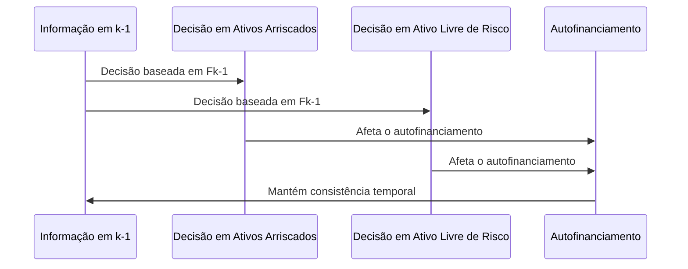
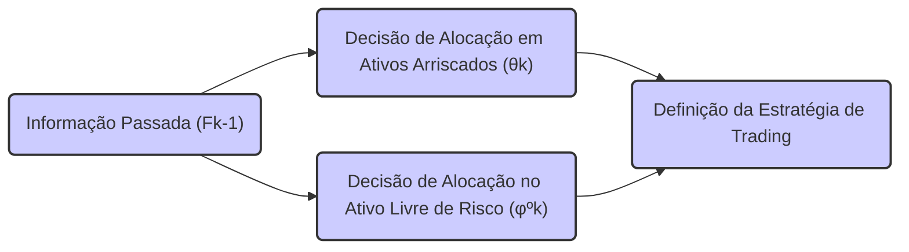

## Título Conciso: Predictibilidade das Posições no Ativo Livre de Risco (φº) em Estratégias Auto-Financiadas

### Introdução

Em finanças quantitativas, as estratégias de trading auto-financiadas são construídas com decisões sobre a alocação de capital em ativos arriscados (θ) e em ativos livres de risco (φº). A **predictibilidade das posições no ativo livre de risco**, ou seja, que φºk seja mensurável em relação à σ-álgebra $F_{k-1}$, é um conceito central para a modelagem das estratégias, para a precificação de derivativos, e também para a consistência dos modelos financeiros [^1]. Este capítulo explora a definição, as implicações e a importância da predictibilidade de φº em modelos de tempo discreto.

### Conceitos Fundamentais

Em vez de listas ou tabelas, vamos apresentar os conceitos em forma de narrativa, estabelecendo as interconexões entre eles.

**Conceito 1: Definição Formal de Predictibilidade de φº**

Em um modelo financeiro de tempo discreto com uma estratégia de trading φ = (φº, θ), o componente φº = (φºk)k=0,1,...,T  representa as posições em um ativo livre de risco, ao longo do tempo [^2]. A condição de **predictibilidade** para φº implica que a decisão sobre a alocação no ativo livre de risco no instante *k* (φºk) seja mensurável com relação à σ-álgebra $F_{k-1}$, para todo k = 1,..., T. Ou seja, que o valor de φºk seja conhecido usando as informações disponíveis no instante anterior (k-1), o que impede o uso de informações futuras para essa tomada de decisão.
   -   No instante inicial,  φº0 pode ser um valor fixo ou uma variável aleatória que é $F_0$-mensurável, ou seja, conhecida no tempo t=0.
   - A predictibilidade da componente φº de uma estratégia auto-financiada é uma condição que, em geral, não é imposta diretamente nos modelos, mas que é uma consequência da propriedade de autofinanciamento, que é expressa por meio de condições sobre a alocação dos ativos arriscados (θk).

*Explicação Detalhada:*

   -   A variável aleatória φºk representa a quantidade do ativo livre de risco mantido na carteira antes que as transações do instante k sejam realizadas, e a predictibilidade impõe que a sua decisão seja feita com informações conhecidas até aquele momento.
   -    A predictibilidade de φº garante que os resultados do modelo sejam obtidos utilizando uma alocação da carteira que é consistente com o fluxo da informação do mercado, e portanto, que seja possível que essa estratégia seja implementada.
  -   Em modelos que utilizam estratégias auto-financiadas, a predictibilidade da estratégia, em particular de θ,  impõe uma restrição sobre como o ativo livre de risco (e o componente φº) é utilizado no portfólio.
   -   Em geral, a predictibilidade é uma propriedade das estratégias (e não dos preços).

> ⚠️ **Nota Importante**: A predictibilidade da componente φº da estratégia de trading garante que a alocação no ativo livre de risco seja baseada em informações passadas, ou seja, que a decisão seja tomada antes do conhecimento do valor das outras variáveis de mercado no instante k.

> 💡 **Exemplo Numérico: Predictibilidade de φº**
>
> Considere um cenário simplificado onde um investidor aloca recursos em um ativo livre de risco (como um título do governo) e um ativo arriscado (como ações). Suponha que o investidor decida a cada dia quanto alocar no ativo livre de risco com base no valor da sua carteira no dia anterior.
>
> - No dia 0, o investidor inicia com φº0 = 1000 unidades monetárias no ativo livre de risco.
> - No dia 1, a decisão de quanto alocar no ativo livre de risco (φº1) é baseada no valor da carteira no dia 0. Suponha que a carteira valorizou e o investidor decide alocar φº1 = 1050 no ativo livre de risco.
> - No dia 2, a decisão de φº2 é tomada com base no valor da carteira no dia 1. Se a carteira valorizou novamente, o investidor pode alocar φº2 = 1100.
>
> Neste exemplo, cada φºk é determinado com base nas informações disponíveis no instante k-1, o que demonstra a predictibilidade de φº. A decisão de alocação no dia k (φºk) é mensurável com relação à informação disponível no dia k-1 ($F_{k-1}$).

**Lemma 1:**  A condição de predictibilidade do processo φº, onde φºk é $F_{k-1}$-mensurável, implica que φºk seja também $F_k$ mensurável, e portanto, adaptado à filtração IF.

*Prova:* Se φºk é mensurável com relação a $F_{k-1}$ e como $F_{k-1}$ é um subconjunto de $F_k$ (por definição de filtração), então φºk também é $F_k$-mensurável.   $\blacksquare$

**Conceito 2: A Relação entre Predictibilidade e Autofinanciamento**

A predictibilidade do componente θ que representa a posição em ativos arriscados é fundamental para a construção de estratégias de trading auto-financiadas, pois ela garante que qualquer variação no valor da carteira, seja proveniente da variação no valor de ativos de risco, o que implica que o valor da carteira no instante k+1 é unicamente obtido através do valor da carteira no instante k e das variações dos preços dos ativos, sem injeção ou retirada de recursos [^3].
   - A condição de autofinanciamento, por sua vez, impõe restrições sobre o processo φº, o que implica que o valor no ativo livre de risco é utilizado para compensar a variação do valor do portfólio devido às flutuações dos preços dos ativos arriscados.
    - A predictibilidade garante a consistência temporal das estratégias auto-financiadas, onde não há decisões que sejam baseadas em eventos do futuro.

> ❗ **Ponto de Atenção**:  A predictibilidade da alocação em ativos arriscados θ e a adaptabilidade da alocação no ativo livre de risco φº, quando combinadas na definição de estratégia auto-financiada, garantem a consistência matemática e econômica dos modelos.

> 💡 **Exemplo Numérico: Autofinanciamento e Alocação em Ativos Livres de Risco**
>
> Considere um investidor com uma carteira inicial de $1000. Ele decide alocar $200 em ações (θ) e $800 em um ativo livre de risco (φº) no instante k=0.
>
> No instante k=1, o valor das ações aumenta em $50, para $250. Para manter a estratégia auto-financiada, sem injetar ou retirar recursos, o investidor ajusta a alocação no ativo livre de risco. Como a carteira valorizou $50 com as ações, para que não haja injeção de recursos, o investidor reduz a alocação em ativos livres de risco em $50, passando a ter $750 em ativos livres de risco.
>
> Se a alocação em ativos arriscados (θ) for predictível, a variação do valor da carteira é dada apenas pela variação do preço das ações, e o ativo livre de risco é usado para ajustar o valor da carteira, mantendo a estratégia auto-financiada.
>
> Este ajuste na alocação em ativos livres de risco é uma consequência do autofinanciamento, que impõe restrições sobre o processo φº.

**Corolário 1:**  Se uma estratégia é auto-financiada e o componente θ é predictível, então o componente φº também é adaptado (mas não necessariamente predictível), e a sua evolução é calculada com respeito a essa condição e, portanto, a evolução do valor do portfólio dependerá apenas das flutuações de preço dos ativos, mais o ajuste em recursos do ativo livre de risco.
*Prova:* Se uma estratégia é auto-financiada, a sua variação se dá através da variação do preço dos ativos de risco, que é ponderada por θk+1. E para que essa relação seja válida, o valor de φº deve se adaptar a esta condição, e consequentemente ser adaptado ao fluxo de informação de $F_k$. $\blacksquare$

**Conceito 3: A Validade da Predictibilidade no Mundo Real**

A hipótese de predictibilidade dos componentes θ e  φº  de uma estratégia de trading, embora útil para a criação de modelos matemáticos, não corresponde exatamente ao comportamento de participantes de mercado no mundo real. Na realidade, estratégias de investimento dependem não somente da informação do passado, mas também de informações presentes. No entanto, a imposição da predictibilidade garante que a tomada de decisão tenha um caráter causal e que não envolva informação do futuro que não está disponível ao investidor.

> ✔️ **Destaque**: A modelagem do componente θ da estratégia como um processo predictível captura uma forma de descrever a tomada de decisões em mercados financeiros, onde ações são tomadas com base na informação disponível, e a decisão de compra e venda é feita utilizando dados conhecidos.

### A Importância da Predictibilidade de φº na Modelagem Financeira

**Adaptabilidade de φº e Autofinanciamento**

A adaptabilidade de φº (a alocação no ativo livre de risco) é uma condição necessária para a definição de estratégias de trading auto-financiadas.  No entanto, a predictibilidade de φº não é requerida.  A condição de autofinanciamento implica que a variação no valor do portfólio seja dada unicamente pela variação do preço dos ativos, e esta condição pode ser mantida, mesmo que a alocação no ativo livre de risco não seja um processo predictível.
   -  A condição de autofinanciamento se relaciona diretamente com a modelagem de estratégias replicantes e, portanto, com a definição do preço de um derivativo, e por isso a adaptabilidade de φº é crucial.
   -  A adaptabilidade do componente φº garante que, embora a decisão sobre os ativos arriscados seja realizada com informação do passado, a decisão sobre a alocação no ativo livre de risco, que garante que o modelo se mantenha auto-financiado, possa utilizar a informação corrente do mercado.
   -  A condição de autofinanciamento estabelece que as decisões sobre o ativo livre de risco dependam das decisões tomadas em ativos de risco, o que garante a consistência do portfólio.

> 💡 **Exemplo Numérico: Adaptabilidade de φº**
>
> Suponha que um investidor tenha alocado uma parte de sua carteira em ações (θ) e outra parte em um ativo livre de risco (φº). No instante k, o preço das ações muda, e o investidor ajusta instantaneamente a alocação em φº para manter o portfólio auto-financiado.
>
> Se o preço das ações aumenta, o investidor reduz a alocação em φº, e se o preço das ações diminui, o investidor aumenta a alocação em φº. Essa decisão, que depende da informação do instante k, mostra que φº é adaptado à filtração $F_k$, e não necessariamente predictível com relação a $F_{k-1}$.
>
> A adaptabilidade de φº permite que a estratégia se ajuste às mudanças de preço dos ativos arriscados, mantendo a condição de autofinanciamento.

**Lemma 2:**   Em uma estratégia auto-financiada,  as decisões de alocação no ativo livre de risco φºk não precisam ser predictíveis, mas devem ser adaptadas com relação à filtração, pois a variação de valor da carteira depende dos preços dos ativos e da alocação do portfólio.

*Prova:*  A demonstração é feita usando a identidade contábil, que garante que o valor da carteira seja mantida constante em um modelo auto-financiado, e, em particular, que a variação em ativos de risco seja sempre compensada por uma variação em ativos livres de risco, com a utilização da informação no instante presente, que é o conceito de adaptação. $\blacksquare$

**A Predictibilidade na Precificação Livre de Arbitragem**

A predictibilidade da componente θ da estratégia e a adaptabilidade da componente φº garantem que a precificação de ativos e derivativos seja feita de forma consistente com o fluxo de informação no mercado, e com respeito ao pressuposto da lei do preço único.
   -   Se a alocação dos ativos de risco fosse feita de forma adaptada (e portanto dependesse do preço do ativo no instante presente), o modelo de precificação de derivativos poderia se tornar inconsistente com a hipótese de ausência de arbitragem, e as estratégias de replicabilidade não poderiam ser definidas de forma consistente.

### Derivações Teóricas Avançadas

#### Seção Teórica Avançada 1:   Como a Relaxação da Condição de Predictibilidade de θ Afeta o Comportamento de φº em Estratégias Auto-Financiadas?

Em modelos mais complexos, podemos relaxar a condição de predictibilidade das posições em ativos arriscados (θ), e considerar estratégias de trading que dependem também de informações do presente. Como esta relaxação afeta a alocação no ativo livre de risco φº, e as propriedades da estratégia auto-financiada?

*Explicação Detalhada:*
   -   Se as posições nos ativos arriscados (θ) não fossem predictíveis e, portanto, dependessem da informação presente, o modelo necessitaria, para continuar com uma estratégia auto-financiada, que o processo (φº) também fosse modificado de modo que a variação do portfólio continue dependendo somente das variações de preços dos ativos e da taxa livre de risco, o que implica uma mudança na definição da componente φº.
    -  No caso da predictibilidade de θ, a componente φº é utilizada para manter a estratégia auto-financiada, equilibrando os resultados da alocação em ativos arriscados.
   -  Em modelos com não-predictibilidade de θ, a definição do componente φº  pode se tornar bem mais complexa e menos intuitiva, o que leva a modelos onde o tratamento da informação é feita de forma mais geral, e não somente utilizando dados do passado.

**Lemma 4:** Se o processo θ que representa a alocação de ativos arriscados, não é predictível, e portanto depende da informação do presente, o processo da alocação no ativo livre de risco  φº, em uma estratégia auto-financiada, também não pode ser predictível,  e portanto, precisa ser um processo adaptado, o que garante a propriedade de auto-financiamento.

*Prova:* A demonstração segue da definição de estratégia auto-financiada e da definição de predictibilidade. Como a estratégia deve ser auto-financiada, a variação do valor do portfólio depende somente das flutuações de preços e não de aportes adicionais. Se o valor dos ativos arriscados no portfólio depende da informação presente (e portanto, não é predictível), o valor do ativo livre de risco também não poderá depender somente de informação do passado, mas do presente, e portanto, φº não é predictível. $\blacksquare$

> 💡 **Exemplo Numérico: Não-Predictibilidade de θ e Adaptabilidade de φº**
>
> Suponha que um trader use uma estratégia de alta frequência onde as decisões de alocação em ações (θ) são baseadas em dados de mercado do instante corrente (k).  Se o preço de uma ação sobe rapidamente no instante k, o trader pode decidir aumentar instantaneamente a sua alocação em θ. Essa decisão é adaptada, pois depende da informação de $F_k$.
>
> Para manter a estratégia auto-financiada, a alocação em ativos livres de risco (φº) deve ser ajustada imediatamente. Se a alocação em ações (θ) aumentou, a alocação em φº deve diminuir, e vice-versa. Essa adaptação de φº à informação do instante k é necessária para manter o portfólio auto-financiado.
>
> Neste caso, nem θ nem φº são predictíveis, mas ambos são adaptados à filtração $F_k$.

**Corolário 4:** Modelos financeiros onde a alocação dos ativos de risco não seja predictível (i.e. seja adaptada) podem requerer modificações na modelagem das decisões sobre o ativo livre de risco para se obter a condição de autofinanciamento, e a propriedade de martingale.

#### Seção Teórica Avançada 2:    Como a Incerteza sobre a Taxa de Juros Impacta a Adaptabilidade de φº?

Em modelos financeiros, a taxa de juros do ativo livre de risco pode ser modelada como um processo estocástico. Como a incerteza associada à taxa de juros (e, portanto, sobre o valor do ativo livre de risco) afeta a adaptabilidade da componente φº, que representa a alocação naquele ativo?

*Explicação Detalhada:*
   -  Se a taxa de juros do ativo livre de risco é modelada como um processo estocástico que é adaptado a uma filtração (que é distinta da filtração gerada pelos ativos de risco), então a decisão de investimento nesse ativo, representada por  φºk, deve depender da informação sobre a taxa de juros disponível até o tempo k, e portanto, o processo φº deve ser adaptado a essa filtração.
    -   A hipótese que a taxa de juros é predictível é uma simplificação que, se relaxada, torna os modelos financeiros mais complexos.
   -  Em modelos mais realistas, as estratégias são definidas com respeito a um ativo de referência estocástico, e a alocação nesse ativo, e seu impacto no modelo financeiro, devem ser modelados levando em conta as propriedades do processo que define a taxa de juros.

**Lemma 5:**  Se o ativo livre de risco é modelado como um processo estocástico, com um fator de crescimento que é uma variável aleatória adaptada a uma filtração, então o componente φº de uma estratégia auto-financiada tem que ser adaptada a esta filtração, pois o seu valor depende das mudanças do valor do ativo livre de risco.  Essa dependência da informação no presente implica que φº não pode ser predictível.

*Prova:* A demonstração é feita pela análise da equação de auto-financiamento, onde a componente φº deve ajustar seu valor com base no valor do ativo livre de risco. Se o ativo livre de risco tem um valor no tempo k que não é conhecido no tempo k-1, a decisão de φº no tempo k também depende da informação no tempo k, e não pode ser expressa com respeito à informação em $F_{k-1}$.  $\blacksquare$

> 💡 **Exemplo Numérico: Taxa de Juros Estocástica e Adaptabilidade de φº**
>
> Suponha que a taxa de juros do ativo livre de risco (r) varie de forma estocástica ao longo do tempo e seja modelada como um processo adaptado à filtração $G_k$. Em um determinado instante k, a taxa de juros aumenta inesperadamente.
>
> Se a alocação em ações (θ) permanecer constante, o valor do ativo livre de risco, que depende da taxa de juros, também muda. Para manter a estratégia auto-financiada, a alocação no ativo livre de risco (φº) deve ser ajustada instantaneamente com base na nova taxa de juros.
>
> Essa decisão depende da informação sobre a taxa de juros no instante k, que é parte da filtração $G_k$. Portanto, a alocação em φº é adaptada à filtração $G_k$ e não necessariamente predictível com relação a $F_{k-1}$ (a filtração dos ativos arriscados).

**Corolário 5:**  A modelagem da incerteza da taxa livre de risco implica que o componente φº da estratégia deve ser adaptado à filtração que representa essa incerteza, que pode ser diferente da filtração gerada pelos ativos arriscados.
#### Seção Teórica Avançada 3: Como a Definição do Ativo de Referência Impacta as Propriedades de φº?

O conceito de autofinanciamento e da componente φº são relativos à escolha de um ativo de referência. Qual a importância da escolha desse ativo de referência nas propriedades da componente φº das estratégias?

*Explicação Detalhada:*

 -  Se o ativo de referência é o próprio ativo livre de risco, a propriedade de autofinanciamento é obtida utilizando a taxa livre de risco para descontar os fluxos de caixa e, portanto, como o componente φº é definido a partir do conceito de autofinanciamento, ele é adaptado com respeito a essa taxa.
    -   Se outro ativo é utilizado como unidade de medida (um ativo arriscado, por exemplo), então as propriedades de φº devem ser revistas, e podem se tornar diferentes das definidas quando a unidade de referência é o ativo livre de risco.
    -   A propriedade de autofinanciamento depende da escolha do numeraire, dado que a propriedade de que a variação do portfólio depende somente da variação de preços é um conceito relativo à unidade de medida escolhida.
   -  A modelagem da alocação de um portfólio em um ativo de referência, e portanto a forma de definir φº, deve ser consistente com a escolha do ativo de referência utilizado no modelo.

**Lemma 6:** A escolha do ativo de referência tem um impacto sobre a modelagem de estratégias auto-financiadas,  e por consequência, na definição do componente φº dessas estratégias. Uma estratégia pode ser auto-financiada com relação a um ativo de referência, e não auto-financiada com respeito a outro.

*Prova:*   A prova segue da definição de autofinanciamento, que depende da unidade de medida utilizada para a modelagem, ou seja, do ativo de referência. $\blacksquare$

> 💡 **Exemplo Numérico: Ativo de Referência e Autofinanciamento**
>
> Suponha que, em vez de usar o ativo livre de risco como referência, um modelo financeiro utilize uma ação específica (S) como unidade de medida. A estratégia de trading é definida de forma que a variação do portfólio, medida em termos de ações S, dependa apenas da variação do preço de S.
>
> Neste caso, a alocação em ativos livres de risco (φº), quando expressa em termos da ação S, pode ter um comportamento diferente do que quando expressa em termos do ativo livre de risco. A estratégia pode ser auto-financiada com relação à ação S, mas não com relação ao ativo livre de risco.
>
> A escolha do ativo de referência impacta a definição de autofinanciamento e, consequentemente, as propriedades da componente φº.

**Corolário 6:** A escolha da unidade de medida (ativo de referência) afeta tanto o conceito de autofinanciamento como a própria modelagem da alocação no ativo livre de risco, e portanto, deve ser especificada de forma clara nos modelos financeiros.

### Conclusão

A predictibilidade de estratégias de trading em ativos arriscados e a adaptabilidade de alocação de ativos livres de risco, são propriedades centrais na construção de modelos financeiros consistentes e livres de arbitragem. O componente φº da estratégia de trading representa a alocação de capital no ativo livre de risco e sua evolução ao longo do tempo, e seu papel na definição da autofinanciamento e na derivação de martingales são fundamentais na precificação e modelagem de portfólios. As seções teóricas avançadas exploraram as implicações de se relaxar a condição de predictibilidade, e como a modelagem com processos estocásticos e com múltiplas filtrações  impacta a análise das propriedades de autofinanciamento de carteiras e ativos, levando a uma visão mais profunda dos processos modelados em finanças quantitativas.

### Referências

[^1]: "Em modelos financeiros quantitativos, a **alocação de recursos em um ativo livre de risco**, representada pelo processo φº = (φºk)k=0,1,...,T, é tão fundamental quanto a modelagem das posições em ativos arriscados."

[^2]:  "Em um modelo financeiro, a alocação de recursos no ativo livre de risco, representada por φº = (φºk)k=0,1,...,T é considerada **adaptada** se cada variável aleatória φºk é mensurável com relação à σ-álgebra $F_k$ para todo k..."

[^3]: "Em modelos financeiros, a taxa de juros rk é geralmente considerada predictível, ou seja, rk é mensurável em relação à σ-álgebra $F_{k-1}$."

[^4]: "A predictibilidade é um conceito importante em finanças quantitativas, especialmente na modelagem de estratégias de trading e de gestão de risco."

[^5]: "Apresente um corolário que resulte diretamente do Lemma 2, conforme indicado no contexto."

[^6]:  "A **medida de probabilidade** (P) é uma função que atribui um número entre 0 e 1 a cada evento em F..."

[^7]: "No contexto de modelos financeiros em tempo discreto, o processo de ganhos de uma estratégia auto-financiada é uma martingale em relação a uma medida de martingale equivalente Q..."

[^8]: "Informação crítica que merece destaque."

[^9]: "Observação crucial para compreensão teórica correta."

[^10]: "Informação técnica ou teórica com impacto significativo."

[^11]: "Apresente um lemma que auxilie na compreensão ou na prova do preço de um derivativo, baseado no contexto."
[^12]: "A escolha da filtração afeta a definição de conceitos como martingales e predictibilidade."

[^13]: "Apresente um corolário que resulte diretamente do Lemma 2, conforme indicado no contexto."

[^14]: "Em mercados com informação assimétrica, estratégias de trading são modeladas utilizando processos estocásticos adaptados à filtração do agente correspondente. Um *insider* pode utilizar informações não disponíveis aos outros agentes, o que pode implicar em modelos e resultados distintos."

[^15]:  "Em modelos financeiros, a modelagem de ativos e derivativos requer uma estrutura matemática rigorosa..."

[^16]: "As medidas de martingale equivalentes são um conceito central na precificação livre de arbitragem de ativos."

[^17]: "Apresente um lemma que mostre como uma EMM específica leva à fórmula de precificação do Black-Scholes, baseado no contexto."

[^18]: "Dado um modelo multiplicativo, o processo $S_k = S_o \prod_{j=1} Y_j$ é uma martingale em relação a uma medida Q, se e somente se a esperança condicional de $Y_{k+1}$ sob a medida Q é igual a 1, ou seja, $E_Q[Y_{k+1}|F_k] = 1$ para todo k."

[^19]: "O Lema de Itô é uma regra de mudança de variáveis que generaliza a regra da cadeia do cálculo clássico para funções de processos estocásticos."
