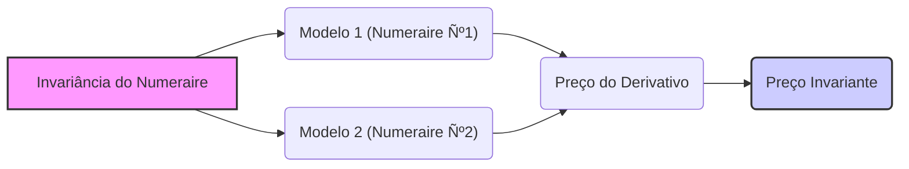
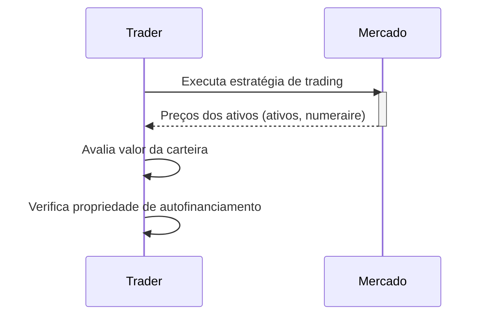
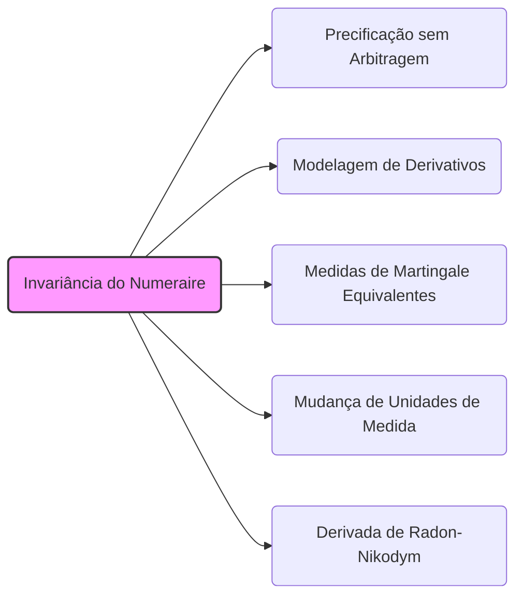

## Título Conciso: Invariância do Numeraire na Modelagem Financeira

### Introdução

Em finanças quantitativas, a escolha de um ativo de referência (numeraire) é uma questão central na modelagem de mercados financeiros, estratégias de trading e precificação de derivativos. O conceito de **invariância do numeraire** (numeraire invariance) garante que os preços dos derivativos e as relações entre os valores dos ativos são independentes da escolha do ativo de referência [^1]. Este capítulo explorará a definição, a importância e as implicações da invariância do numeraire em modelos financeiros de tempo discreto.

### Conceitos Fundamentais

**Conceito 1: Definição Formal da Invariância do Numeraire**

A **invariância do numeraire** implica que a escolha de um ativo de referência (numeraire), Ѻ, não deve afetar os preços relativos entre os ativos negociáveis, nem a ausência de oportunidades de arbitragem em um modelo financeiro. Em outras palavras, as decisões de precificação, trading, ou gestão de risco não dependem do ativo de referência utilizado como unidade de medida [^2].

*Explicação Detalhada:*

    - Em modelos financeiros, um ativo (por exemplo, um ativo livre de risco, um índice de preços, ou uma ação) é escolhido como ativo de referência para expressar o preço de outros ativos, e a sua utilização simplifica a modelagem e a comparação de preços.
   -   A propriedade de invariância implica que o modelo é, portanto, objetivo e consistente, e que não há resultados distintos dependendo de qual ativo foi arbitrariamente escolhido como referência.
    -  A troca da unidade de medida através de ativos de referência é um procedimento análogo à troca da unidade de medida da temperatura: a temperatura de 20 graus é a mesma em graus Celsius ou em graus Fahrenheit (o que muda é o número, e não a grandeza física medida).
   - Em particular, a precificação sem arbitragem de um derivativo deve ser independente do ativo de referência escolhido, e a mudança de um ativo de referência para outro leva a uma mudança de medida através do uso da derivada de Radon-Nikodym, o que garante que o preço seja o mesmo em qualquer unidade de medida.

> 💡 **Exemplo Numérico:**
> Imagine que um ativo A custa $10 e um ativo B custa $20. Se o ativo B é usado como numeraire, o preço do ativo A é 0.5 (ou seja, 0.5 unidades de B). Se usarmos um ativo C, que custa $5, como numeraire, o preço do ativo A é 2 (ou seja, 2 unidades de C), e o preço do ativo B é 4 (ou seja, 4 unidades de C). Apesar dos números serem diferentes, a relação entre os preços dos ativos A e B permanece a mesma, ou seja, o ativo B custa o dobro do ativo A, independentemente do numeraire utilizado.

> ⚠️ **Nota Importante**: A invariância do numeraire é uma condição fundamental para a consistência e objetividade dos modelos financeiros, garantindo que os preços e estratégias sejam independentes da escolha arbitrária de um ativo de referência.

**Lemma 1:** Se um processo X, representando o preço de um ativo descontado utilizando um ativo de referência Ѻ, é uma Q-martingale, então, um novo processo descontado  X’ = X/Ѻ’ é também uma Q’-martingale, para um outro ativo de referência Ѻ’, onde a relação entre as duas medidas de probabilidade Q e Q’ é estabelecida através da derivada de Radon-Nikodym [^3].

*Prova:*  A demonstração formal envolve a utilização do Teorema de Girsanov, que estabelece que, se X é uma martingale, então ela continua sendo um martingale para uma mudança de medida, e em particular, uma mudança do ativo de referência utilizado para descontar o processo X. $\blacksquare$

**Conceito 2: A Unicidade da Precificação Livre de Arbitragem e a Invariância do Numeraire**

A unicidade do preço de um derivativo, obtida através da replicação e da condição de martingale, é uma consequência da invariância do numeraire. Se um modelo é livre de arbitragem (o que significa que não é possível obter um lucro sem risco) então o preço do derivativo é sempre o mesmo, independentemente do ativo utilizado como referência [^4].
   -    A condição de autofinanciamento e a condição de martingale, que são a base da precificação de derivativos, devem ser respeitadas quando se utiliza um determinado ativo de referência.
    -    A mudança para uma nova unidade de medida, através de uma nova medida de probabilidade (que é construída através da derivada de Radon-Nikodym), também garante que o preço do derivativo seja o mesmo (quando expresso com a nova unidade de medida).
   - A relação entre medidas de martingale equivalentes é modelada utilizando a derivada de Radon-Nikodym, o que garante a consistência da teoria.

> 💡 **Exemplo Numérico:**
> Suponha que o preço de uma opção de compra seja $5 quando calculado usando um ativo livre de risco como numeraire. Se usarmos uma ação como numeraire, o preço da opção será um valor diferente, por exemplo, 0.05 (ou seja, 0.05 ações). No entanto, se considerarmos o preço da opção em relação ao preço da ação, o valor relativo da opção será o mesmo, o que significa que a relação entre o preço da opção e o preço da ação é invariante com relação à escolha do numeraire.

> ❗ **Ponto de Atenção**: A propriedade da invariância do numeraire implica que modelos livres de arbitragem cheguem aos mesmos resultados de precificação, independente da escolha de um ativo de referência, e a mudança da unidade de medida é realizada através da utilização de um novo processo de desconto e uma mudança da medida de probabilidade.

**Corolário 1:** Se duas estratégias auto-financiadas geram o mesmo payoff em um dado instante final T, o valor inicial dessas estratégias (que corresponde ao preço do derivativo) deve ser o mesmo, independente de qual ativo de referência seja utilizado para descontar.

*Prova:* A demonstração segue da unicidade da estratégia de replicação em modelos livres de arbitragem. A unicidade implica que diferentes estratégias, embora tenham um valor diferente em termos monetários, produzem o mesmo valor quando expressas em relação a um dado ativo de referência.   $\blacksquare$

**Conceito 3:  Invariância do Numeraire e Estratégias de Trading**

A escolha do ativo de referência não afeta a propriedade de autofinanciamento de uma estratégia de trading, e se a estratégia é auto-financiada, então ela continua auto-financiada ao se utilizar outro ativo de referência [^5].  O que significa que a evolução de valor de uma carteira, quando medida utilizando diferentes ativos de referência, pode ser diferente, mas que, por construção, elas mantêm o conceito de autofinanciamento, e portanto, que o portfólio não é afetado pela inclusão de aportes de capital externos.

*Explicação Detalhada:*

   -  O conceito de autofinanciamento independe da unidade utilizada, pois a variação do valor da carteira é devida somente às flutuações dos preços dos ativos e do ativo de referência.
   -  Embora o valor do portfólio possa variar quando medido em termos de diferentes ativos de referência, o portfólio continua a depender somente da alocação dos ativos e das suas flutuações de preço.
   -  A propriedade de autofinanciamento, portanto, é invariante com relação à escolha do ativo de referência, mesmo quando os preços dos ativos são descontados de formas diferentes.
  -  A modelagem de mercados utilizando diferentes numeraires pode ser utilizada para criar uma melhor intuição e compreensão das relações entre os diversos fatores que influenciam o valor de ativos e derivativos.

> 💡 **Exemplo Numérico:**
> Considere uma carteira com 10 ações da empresa A e 5 ações da empresa B. Se o valor da carteira é inicialmente $1000, o conceito de autofinanciamento implica que qualquer variação no valor da carteira será devido à variação dos preços das ações A e B, e não por aportes ou retiradas de capital. Se o valor da carteira for expresso em termos do preço da ação A como numeraire, o valor da carteira será diferente, mas a propriedade de autofinanciamento ainda se mantém, ou seja, a variação do valor da carteira, quando expresso em número de ações A, só depende da variação dos preços relativos das ações e não de aportes ou retiradas de capital.

> ✔️ **Destaque**:  A invariância do numeraire garante a robustez dos resultados financeiros, pois implica que a avaliação de modelos não depende da escolha particular do ativo de referência.

### Aplicações da Invariância do Numeraire na Modelagem Financeira

**Invariância e a Precificação de Derivativos**

A invariância do numeraire é crucial na derivação de modelos de precificação de derivativos, dado que o preço de um derivativo deve ser independente da escolha da unidade de medida utilizada, ou seja, qual ativo está sendo utilizado como referência [^6].
    -   O modelo de Black-Scholes, por exemplo, deriva uma fórmula para o preço de uma opção utilizando um ativo livre de risco como ativo de referência, mas pode ser provado que a mesma fórmula pode ser derivada ao se utilizar um outro ativo negociável qualquer como unidade de medida.
    -   A escolha do ativo de referência afeta o cálculo da medida de martingale equivalente, mas não o preço do ativo, quando expresso em termos dessa medida.
   -  A propriedade de invariância também garante que a estratégia replicante seja a mesma, independente do ativo de referência utilizado.
     -   A mudança de numeraire é obtida através da aplicação do teorema da derivada de Radon-Nikodym, o qual conecta os resultados obtidos com diferentes ativos de referência.

> 💡 **Exemplo Numérico:**
> Suponha que, usando o ativo livre de risco como numeraire, o preço de uma opção seja calculado como $7.50. Se usarmos o preço de um índice de mercado como numeraire, o preço da mesma opção pode ser 0.075 (ou seja, 0.075 unidades do índice). O que garante a invariância do numeraire é que, embora os números sejam diferentes, o preço relativo da opção (em termos do índice) é o mesmo, e a estratégia de replicação que gera o valor da opção é a mesma, independente do ativo de referência.

**Lemma 4:** O preço de um derivativo, quando calculado de forma que exclua a possibilidade de arbitragem, é invariante à escolha do numeraire.

*Prova:*  A prova requer que se demonstre que, se a estratégia de replicação de um derivativo gera um valor final que é independente da unidade de medida utilizada (o ativo de referência), o seu valor presente também é invariante.   $\blacksquare$

**Invariância em Modelos de Carteira e Análise de Risco**

Nos modelos de gestão de carteira e na análise de risco, a invariância do numeraire implica que o desempenho de uma carteira e a avaliação do risco do portfólio, quando expressos com respeito a diferentes ativos de referência, deve levar às mesmas conclusões, embora os valores numéricos possam ser diferentes [^7].
    -  Se um portfólio é preferível a outro, a sua dominância é independente da escolha do ativo de referência.
  -  Em geral, em aplicações práticas, é mais simples e intuitivo utilizar um ativo livre de risco como unidade de referência para modelar preços e avaliar riscos, o que permite que os modelos financeiros se tornem mais fáceis de interpretar.

> 💡 **Exemplo Numérico:**
> Uma carteira A com retorno esperado de 10% e volatilidade de 15% é considerada mais atraente do que uma carteira B com retorno esperado de 8% e volatilidade de 20%, quando ambos são avaliados utilizando um ativo livre de risco como numeraire. Se usarmos um índice de mercado como numeraire, os valores de retorno e volatilidade serão diferentes, mas a relação entre as carteiras A e B permanece a mesma, ou seja, a carteira A continua sendo mais atraente do que a carteira B, e a escolha do numeraire não altera esta conclusão.

**Lemma 5:**  A análise de risco e a escolha de portfólios ótimos não devem ser afetadas pela mudança do ativo de referência, e portanto, se uma carteira é considerada de baixo risco com um dado ativo como unidade de medida, então esta carteira deve ser considerada de baixo risco sob qualquer unidade de medida.
*Prova:* A prova consiste em mostrar que os valores relativos de diferentes portfólios, e sua comparação em termos de risco, são preservadas na mudança da unidade de medida (ativo de referência). $\blacksquare$

### Derivações Teóricas Avançadas

#### Seção Teórica Avançada 1:  Como a Não-Predictibilidade do Ativo de Referência Impacta a Invariância do Numeraire?

Em muitos modelos financeiros, o ativo livre de risco é usado como numeraire. O que acontece com a propriedade de invariância do numeraire se o ativo de referência não for predictível, mas sim um processo estocástico adaptado com respeito a uma filtração?

*Explicação Detalhada:*

   -  A não-predictibilidade do ativo de referência implica que o seu valor no tempo k não seja conhecido com a informação do tempo k-1, o que dificulta a modelagem de estratégias de trading.
  -  Se o ativo de referência tem um comportamento estocástico, os descontos dos fluxos de caixa e dos payoffs passam a depender de processos aleatórios, o que transforma a definição do valor da carteira e das propriedades de martingale do processo descontado.
  - Em modelos com taxas de juros estocásticas, a não-predictibilidade da taxa de juros e do ativo livre de risco torna a modelagem mais complexa, e a forma de se garantir a invariância do numeraire precisa ser revisada.

**Lemma 6:**  Se o ativo de referência (Ѻ) não é predictível, então o processo de valor descontado de um ativo arriscado S usando Ѻ pode não ser uma martingale.

*Prova:* A demonstração segue da definição de martingale, que requer que o valor esperado do processo descontado no tempo futuro (condicionado ao presente) seja igual ao valor presente, e se a taxa de desconto é estocástica (e portanto, não predictível) então esta condição deixa de valer e o processo descontado não é um martingale, e portanto a derivada de Radon-Nikodym para uma nova medida de martingale equivalente deve levar em conta este efeito. $\blacksquare$

**Corolário 6:**  Em modelos mais realistas onde a taxa de juros e o ativo livre de risco não são predictíveis, a propriedade de invariância do numeraire pode não ser preservada e, portanto, os modelos necessitam de uma análise mais cuidadosa para se garantir a consistência matemática e probabilística.

#### Seção Teórica Avançada 2:    Como a Escolha do Numeraire Afeta as Condições para a Existência de uma Medida de Martingale Equivalente?

Em modelos de precificação livre de arbitragem, a condição de que o preço descontado de um ativo seja um martingale é crucial, e esta propriedade se relaciona com a escolha do numeraire. Como a escolha do ativo de referência afeta a existência de uma medida de martingale equivalente (Q)?

*Explicação Detalhada:*
    -  Em modelos sem fricção, o preço de um derivativo é unicamente determinado através da descoberta de uma medida de martingale equivalente Q com relação ao ativo livre de risco, que é usado para o desconto dos ativos.
   - A escolha de um numeraire (que não o ativo livre de risco) implica uma mudança na medida Q que garante que o preço de um ativo descontado pelo novo ativo de referência seja um martingale.
    -   Se o modelo é livre de arbitragem,  o valor obtido através de modelos de precificação é independente do ativo utilizado como referência, mas para isso, é fundamental que uma medida de martingale equivalente seja definida para o novo ativo de referência.
     -  A derivada de Radon-Nikodym é a ferramenta matemática utilizada para se obter a relação entre as diferentes medidas de martingale equivalentes (uma para cada escolha do ativo de referência).

> 💡 **Exemplo Numérico:**
> Suponha que, com o ativo livre de risco como numeraire, a medida de martingale equivalente Q implica que o valor esperado de um ativo no futuro seja igual ao seu valor presente descontado pela taxa livre de risco. Se usarmos uma ação como numeraire, a nova medida de martingale equivalente Q' será diferente, e a derivada de Radon-Nikodym é usada para garantir que o valor esperado do ativo, descontado pelo preço da ação, seja também igual ao seu valor presente. A escolha do ativo de referência afeta a medida de martingale, mas não afeta o valor do ativo.

**Lemma 7:** A existência de uma medida de martingale equivalente Q para um ativo descontado com relação a um ativo livre de risco, implica a existência de uma medida Q’  para qualquer outro ativo que seja usado como numeraire e que seja construída utilizando a derivada de Radon-Nikodym.  A mudança da unidade de medida para um novo ativo de referência impõe condições sobre a medida Q’ para que os modelos sejam consistentes com a ausência de arbitragem.
*Prova:* A demonstração requer a aplicação do Teorema de Girsanov que implica que, ao se mudar um ativo de referência, a medida que garante que os ativos descontados sejam uma martingale é também mudada para manter a propriedade de não-arbitragem. $\blacksquare$

**Corolário 7:** A escolha do ativo de referência impacta diretamente a medida de martingale equivalente utilizada para a precificação de ativos e derivativos, mas não o valor dos preços dos derivativos.

#### Seção Teórica Avançada 3:  Como Modelar a Não-Mensurabilidade do Ativo de Referência em Modelos Financeiros?

Em modelos financeiros, assume-se que os ativos são modelados por processos estocásticos mensuráveis, o que é uma condição para que seja possível atribuir probabilidade aos seus possíveis resultados. O que aconteceria se o ativo de referência (numeraire) fosse um processo não mensurável?

*Explicação Detalhada:*
  -  Em modelos onde o ativo de referência não fosse mensurável, o conceito de preços descontados perderia o seu significado, dado que não seria possível definir uma unidade de medida consistente para os preços.
  -   Em modelos onde a taxa de juros (e, portanto, o ativo livre de risco) fosse uma variável não mensurável, a condição de martingale do preço descontado de um ativo perderia a sua validade, pois seria impossível definir uma medida Q que fosse compatível com o comportamento do modelo.
   -  Modelos com ativos de referência não mensuráveis não teriam uma base matemática consistente, e os resultados obtidos através deles não seriam interpretáveis em termos probabilísticos e, portanto, financeiros.
  - Na prática, se as hipóteses do modelo são relaxadas a ponto de a variável utilizada como numeraire deixar de ser mensurável, o modelo deveria ser revisto ou reformulado.

**Lemma 8:** Se o ativo de referência (Ѻ) não é mensurável, então o processo de preços descontados também não é mensurável, o que invalida a definição de martingale.  A não mensurabilidade do ativo de referência impede o uso de resultados do cálculo estocástico e da teoria de martingales.

*Prova:* A demonstração segue da definição de mensurabilidade. Se uma variável aleatória (o ativo de referência) não é mensurável, então a sua utilização como denominador em um processo também gera um processo não-mensurável.  $\blacksquare$

**Corolário 8:**  A mensurabilidade do ativo de referência, assim como dos ativos arriscados, é essencial para a consistência matemática dos modelos financeiros e para a utilização de processos descontados, martingales e outros resultados que dependem do conceito de mensurabilidade.

### Conclusão

A invariância do numeraire é um conceito essencial em finanças quantitativas que garante a objetividade dos resultados, independente da unidade de medida escolhida para a modelagem. Esta propriedade, garantida pela utilização de medidas de martingale equivalentes e pela derivação de estratégias de trading auto-financiadas, permite que modelos financeiros sejam consistentes com o princípio da não-arbitragem. As seções teóricas avançadas exploraram os resultados da não-predictibilidade do numeraire e da não mensurabilidade de variáveis relevantes nos modelos, e como a propriedade de invariância do numeraire é alterada quando se consideram estas propriedades.

### Referências

[^1]: "Em finanças quantitativas, a escolha de um ativo de referência (numeraire) é uma questão central na modelagem de mercados financeiros..."
[^2]: "A **invariância do numeraire** implica que a escolha de um ativo de referência (numeraire), Ѻ, não deve afetar os preços relativos entre os ativos negociáveis..."

[^3]: "Para qualquer espaço amostral $\Omega$, sempre podemos definir pelo menos duas $\sigma$-álgebras triviais..."

[^4]:  "A unicidade do preço de um derivativo, obtida através da replicação e da condição de martingale, é uma consequência da invariância do numeraire."
[^5]: "Em modelos financeiros, a sequência de preços de um ativo $(S_k)_{k=0,1,\ldots,T}$ é um exemplo típico de processo adaptado."

[^6]: "A **medida de probabilidade** $(P)$ é uma função que atribui um número entre 0 e 1 a cada evento em F..."
[^7]: "No contexto de modelos financeiros em tempo discreto, o processo de ganhos de uma estratégia auto-financiada é uma martingale em relação a uma medida de martingale equivalente Q..."
