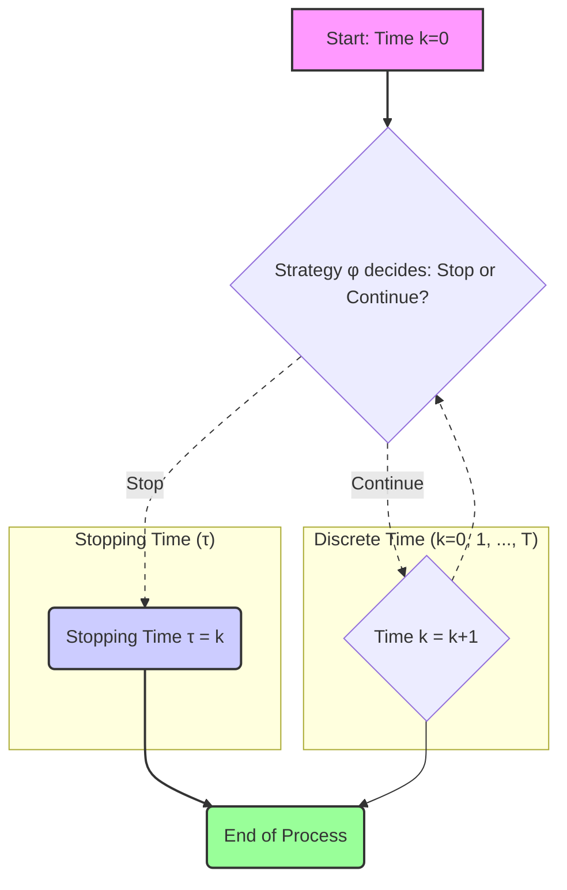
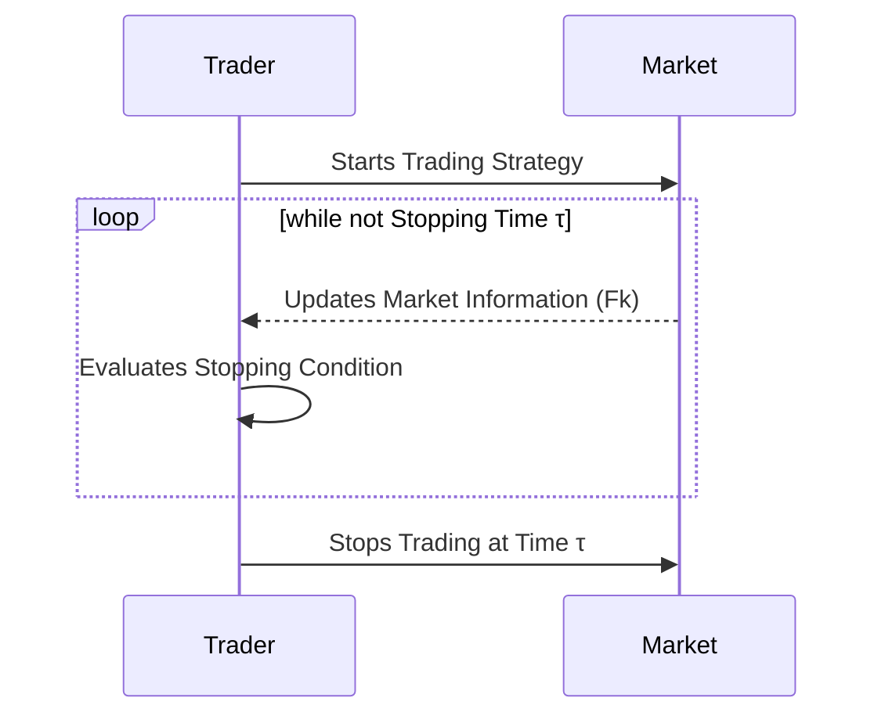
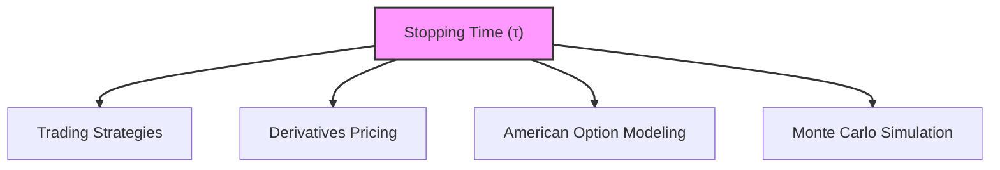

## Título Conciso: Tempo de Parada (τ) em Modelos Financeiros de Tempo Discreto

### Introdução

Em finanças quantitativas, a análise de estratégias de trading e a precificação de derivativos muitas vezes envolve a definição de critérios para terminar a negociação ou o exercício de um derivativo. A ferramenta matemática para descrever quando um processo deve parar é o **tempo de parada** (stopping time), denotado por $\tau$. Este capítulo explora a definição formal, a importância e as aplicações dos tempos de parada em modelos financeiros de tempo discreto.

### Conceitos Fundamentais

**Conceito 1: Definição Formal de um Tempo de Parada (τ)**

Dado um espaço de probabilidade $(\Omega, F, P)$ e uma filtração $IF = (F_k)_{k=0,1,\ldots,T}$, um **tempo de parada** (stopping time) é uma variável aleatória $\tau : \Omega \rightarrow \{0, 1, \ldots, T, \infty\}$ tal que para todo $k \in \{0, 1, \ldots, T\}$ o evento $\{\tau \leq k\}$ pertence a $F_k$ [^1].
   -   A variável aleatória $\tau$ assume um valor inteiro no conjunto $\{0, 1, \ldots, T\}$ ou o valor $\infty$, e representa o instante em que um processo estocástico pára, ou termina de ser avaliado.
  - A condição $\{\tau \leq k\} \in F_k$ significa que, se olharmos a história do processo até o instante $k$ ($F_k$), podemos decidir se o instante $\tau$ já ocorreu ou não, o que captura a ideia que a decisão sobre parar não depende de informações futuras.

*Explicação Detalhada:*
  -  Os tempos de parada são uma forma de modelar estratégias onde se espera por um certo evento, o que determina a decisão de se parar ou não.
  -   A condição de mensurabilidade do evento $\{\tau \leq k\}$ em relação a $F_k$ garante que a decisão de parar em um dado instante de tempo só dependa da informação até aquele tempo.
  -  Se um processo é parado em um instante aleatório $\tau$, ele deixa de evoluir, e as decisões sobre o comportamento desse processo são tomadas até que o evento de parada ($\tau$) ocorra.

> ⚠️ **Nota Importante**: O tempo de parada captura a ideia de um instante aleatório onde se toma a decisão de parar o processo, de acordo com uma regra que não depende de informações futuras.

> 💡 **Exemplo Numérico:**
> Considere um modelo de tempo discreto com $T = 5$. Suponha que $\tau$ seja o primeiro instante em que o preço de um ativo (S) atinge um valor maior ou igual a $110, onde $S_0 = $100. A filtração $F_k$ representa a informação sobre os preços do ativo até o instante $k$.
> - Se $S_1 = $105, $S_2 = $108, $S_3 = $112, então $\tau = 3$, pois este é o primeiro instante em que o preço atinge ou ultrapassa $110.
> - Se $S_1 = $102, $S_2 = $107, $S_3 = $109, $S_4 = $111, então $\tau = 4$.
> - Se em nenhum instante $k$ o preço atinge $110, então $\tau = \infty$.
> Em cada instante $k$, podemos verificar se o evento $\{\tau \leq k\}$ ocorreu, olhando para os preços até o tempo $k$. Por exemplo, em $k=2$, se o preço máximo até esse ponto foi $108, sabemos que $\{\tau \leq 2\}$ não ocorreu, pois o preço ainda não atingiu $110. No entanto, em $k=3$, se $S_3 = $112, sabemos que $\{\tau \leq 3\}$ ocorreu, e portanto $\tau = 3$.

**Lemma 1:**  Se $\tau$ é um stopping time, então o evento $\{\tau = k\}$ pertence a $F_k$ para todo $k = 0, 1, \ldots , T$.

*Prova:*  O evento $\{\tau = k\}$  pode ser escrito como a interseção $\{\tau \leq k\} \cap \{\tau \leq k-1\}^c$. Como $\{\tau \leq k\} \in F_k$ e $\{\tau \leq k-1\} \in F_{k-1} \subset F_k$, então o complemento de $\{\tau \leq k-1\}$ é também em $F_k$ e a interseção de ambos também é $F_k$-mensurável.  $\blacksquare$

> 💡 **Exemplo Numérico:**
> Continuando o exemplo anterior, o evento $\{\tau = 3\}$ significa que o preço atingiu $110 pela primeira vez no instante $k=3$. Se a trajetória de preços é como no primeiro cenário ($S_1 = $105, $S_2 = $108, $S_3 = $112), o evento $\{\tau = 3\}$ ocorre.
> Como $\{\tau \leq 3\} \in F_3$ e $\{\tau \leq 2\} \in F_2 \subset F_3$, então $\{\tau = 3\} = \{\tau \leq 3\} \cap \{\tau > 2\} \in F_3$. Isso significa que, ao observar a informação até o instante 3, podemos determinar se o evento $\{\tau = 3\}$ ocorreu.

**Conceito 2: Tempos de Parada e a Modelagem da Decisão de Trading**

Em modelos financeiros, os tempos de parada são frequentemente utilizados para modelar estratégias de trading onde a decisão de parar depende de uma condição do mercado, e que não envolve um tempo fixo predeterminado [^2]. A decisão de parar (e portanto, de encerrar uma posição) pode ocorrer quando o preço de um ativo atinge um determinado nível, quando o tempo decorrido desde a abertura da posição atinge um determinado tempo, ou quando outro tipo de condição é satisfeita.
  -   Se $T$ é o horizonte temporal do modelo, a estratégia é definida para todos os tempos $t = 0, 1, \ldots, T$, ou seja, até o instante $T$, que pode ser o momento da expiração de um contrato, por exemplo.
   -  A utilização de tempos de parada permite que um operador do mercado possa parar a sua operação antes da data $T$, ou seja, definir a data para encerramento da posição como uma variável aleatória.
   -  Em modelos com opções americanas, a decisão sobre quando exercer o direito de compra ou venda é modelada como um tempo de parada.

> ❗ **Ponto de Atenção**: Os tempos de parada permitem modelar o ponto exato em que um processo é interrompido, capturando a dinâmica das decisões de trading em mercados financeiros.

> 💡 **Exemplo Numérico:**
> Um trader define uma estratégia de compra de um ativo a $100, com o objetivo de vender quando o preço atingir $105 ou quando se passar 3 dias de operação, o que ocorrer primeiro.
> - Nesse cenário, o tempo de parada $\tau$ é o mínimo entre o tempo em que o preço atinge $105 e o tempo 3.
> - Se o preço atingir $105 no dia 2, então $\tau = 2$.
> - Se o preço não atingir $105 até o dia 3, então $\tau = 3$.
> - A decisão de parar a operação depende das informações de preço e tempo, mas é um tempo aleatório, não fixo.

**Corolário 1:**  A combinação de tempos de parada com processos estocásticos e filtragens permite a modelagem de estratégias de trading mais dinâmicas, onde as decisões de investimento são tomadas de acordo com o fluxo de informação e com a evolução do mercado.
*Prova:* A prova segue da combinação da definição de tempo de parada e processos estocásticos.  $\blacksquare$

**Conceito 3:  A Relação entre Tempos de Parada e Autofinanciamento**

Em modelos de precificação livre de arbitragem, as estratégias de trading que são utilizadas para replicar um dado derivativo precisam ser auto-financiadas, e devem utilizar tempos de parada para se definir qual o momento de encerramento da estratégia. A autofinanciamento de um portfólio (ou seja, que nenhuma injeção ou retirada de recursos seja feita) garante que a avaliação de um derivativo utilizando uma estratégia auto-financiada seja consistente e que o preço obtido seja aquele que elimina a arbitragem.
    - A condição de autofinanciamento e a definição de um tempo de parada são elementos essenciais para modelar estratégias de replicação de derivativos e para obter preços que não gerem oportunidades de lucro sem risco, uma condição necessária para modelos de precificação.
    -  Em geral, um modelo financeiro onde a condição de autofinanciamento é combinada com processos estocásticos e tempos de parada é uma base para um modelo consistente de finanças.

> ✔️ **Destaque**:  A utilização de tempos de parada em modelos de autofinanciamento permite a modelagem de estratégias de trading que se adaptam às condições do mercado e ao seu comportamento ao longo do tempo.

> 💡 **Exemplo Numérico:**
> Uma estratégia de replicação de uma opção europeia visa replicar o payoff da opção no vencimento T. Se utilizarmos uma opção americana, a estratégia de replicação deve considerar o tempo de parada $\tau$ que representa o tempo ótimo de exercício da opção.
> - O portfólio de replicação é ajustado dinamicamente, e não há injeção ou retirada de dinheiro durante o processo (autofinanciamento).
> - Se o tempo de exercício da opção americana é modelado por $\tau$, o portfólio de replicação é ajustado até o instante $\tau$, que é um tempo de parada.
> - A condição de autofinanciamento garante que o valor do portfólio no tempo $\tau$ seja igual ao payoff da opção americana exercida no tempo $\tau$.

### Tempos de Parada e Modelagem Financeira

**Aplicações em Modelos de Opções Americanas**

Em modelos de precificação de opções, os tempos de parada são fundamentais para a modelagem de opções americanas, que podem ser exercidas a qualquer instante antes ou na data de vencimento [^4]. O instante de exercício da opção é modelado como um tempo de parada, onde a decisão de exercitar é baseada nas informações disponíveis até aquele instante.
   -    A condição de que o tempo de parada seja inferior à data de expiração do contrato garante que a opção não seja exercida depois de sua data de vencimento.
   -   A modelagem da decisão de exercício da opção como um tempo de parada garante que as estratégias que replicam o valor do payoff da opção utilizem somente informações disponíveis antes da decisão, o que é essencial para a modelagem da precificação livre de arbitragem.

> 💡 **Exemplo Numérico:**
> Considere uma opção americana de compra com vencimento em T=10. O tempo de parada $\tau$ representa o instante ótimo de exercício da opção.
> - Se o preço do ativo subjacente atinge um valor suficientemente alto em $k=5$, o investidor pode decidir exercer a opção antecipadamente, e $\tau = 5$.
> - Se o preço nunca atinge um valor que justifique o exercício antecipado, o investidor pode manter a opção até o vencimento, e $\tau = 10$.
> - A decisão de exercer a opção é baseada na informação disponível até o instante $k$, e $\tau$ é um tempo de parada menor ou igual a $T$.

**Lemma 2:**  O valor de uma opção americana em qualquer instante do tempo $k$ é dado pelo valor máximo entre o valor de se exercitar a opção imediatamente, e o valor presente de se manter a opção e escolher um instante ótimo para o exercício posterior, onde o tempo de exercício é modelado como um tempo de parada. [^16]

*Prova:* A demonstração depende do cálculo do valor máximo esperado de um processo descontado com um stopping time.   $\blacksquare$

**Tempos de Parada e Modelagem de Estratégias de Trading**

Em modelos de estratégias de trading, os tempos de parada podem ser utilizados para modelar o instante no qual uma determinada estratégia é encerrada. Por exemplo, uma estratégia pode terminar assim que o preço de um ativo atingir um certo valor, ou após uma quantidade predeterminada de tempo.
     -  O tempo de parada pode representar o instante em que o participante do mercado atinge o seu objetivo, ou que desiste de um trade quando atinge um limite de perda aceitável.
   - A utilização de tempos de parada permite modelar cenários mais realistas, onde as estratégias de trading têm que ser interrompidas em algum instante do tempo.

> 💡 **Exemplo Numérico:**
> Um trader utiliza uma estratégia de "stop-loss", onde a posição é encerrada se o preço do ativo cair abaixo de um determinado valor.
> - Se o trader compra um ativo a $100 e define um stop-loss em $95, o tempo de parada $\tau$ é o primeiro instante em que o preço atinge ou ultrapassa $95.
> - Se o preço do ativo atinge $95 em $k=3$, então $\tau = 3$, e a posição é automaticamente encerrada.
> - Se o preço do ativo não atinge $95 até o final do horizonte de tempo $T$, o tempo de parada $\tau$ poderia ser igual a $T$, ou infinito, dependendo do modelo.

**Lemma 3:** Uma estratégia auto-financiada, onde a decisão de encerramento do investimento é dada por um tempo de parada, gera uma carteira cujo valor final,  descontado, é um martingale, se o processo de preços descontados é uma martingale.

*Prova:* A demonstração utiliza o conceito de martingale e das propriedades de tempos de parada que garantem que o valor descontado do portfólio seja, ele também, um martingale.  $\blacksquare$

### Derivações Teóricas Avançadas

#### Seção Teórica Avançada 1:   Como a Não-Mensurabilidade de um Tempo de Parada Impacta as Propriedades de Martingale?

Em modelos financeiros, a definição de tempos de parada como variáveis aleatórias mensuráveis é fundamental para a construção de modelos consistentes. Como a não-mensurabilidade de um tempo de parada afeta a propriedade de martingale?

*Explicação Detalhada:*
    -  Se o tempo de parada não é mensurável em relação à filtração, então o instante em que o processo para deixa de ser uma variável aleatória bem definida no espaço de probabilidade, e portanto, os resultados obtidos utilizando um processo não mensurável deixam de ser válidos.
   -  Em particular, ao se modelar a evolução de um portfólio parado num determinado instante de tempo, ele pode se comportar como uma martingale antes da parada, mas deixa de ser uma martingale quando o processo de parada é modelado por um processo que não é mensurável.
   -   O teorema de parada opcional, que é um resultado importante em finanças quantitativas, depende que os tempos de parada sejam mensuráveis.

**Lemma 4:**  Se um tempo de parada não é mensurável em relação à filtração apropriada, então o teorema de parada opcional não pode ser utilizado. Se um processo $X$ é uma martingale em relação a uma filtração $IF$, e se $\tau$ é um stopping time, a propriedade de martingale
$$E[X_T | F_t ] = X_t$$
implica que a propriedade de martingale seja preservada ao se parar no instante $\tau$, a menos que o processo de parada seja mensurável.
*Prova:*   A propriedade de martingale depende do cálculo de esperanças condicionais, que são definidas apenas para variáveis aleatórias que são mensuráveis.  $\blacksquare$

> 💡 **Exemplo Numérico:**
> Suponha que o preço de um ativo seja modelado por um processo martingale $X$. Se $\tau$ é um tempo de parada mensurável, então o processo parado $X_\tau$ também será uma martingale. No entanto, se $\tau$ fosse definido de forma a depender de informações futuras (e portanto não mensurável), o processo $X_\tau$ deixaria de ser uma martingale, e o teorema de parada opcional não seria válido.
> - Exemplo de $\tau$ mensurável: o primeiro instante que $X$ atinge um certo valor.
> - Exemplo de $\tau$ não-mensurável: o instante em que o valor de $X$ atinge o seu máximo em todo o horizonte de tempo. A decisão de parar depende de informações futuras, pois o máximo não é conhecido até o final do horizonte.
> A não-mensurabilidade de $\tau$ invalida a aplicação do teorema de parada opcional.

**Corolário 4:**  A mensurabilidade é uma condição necessária para que a condição de martingale possa ser obtida, e sem ela a consistência dos resultados do modelo não é garantida, dado que as operações matemáticas da teoria da probabilidade só são definidas para variáveis mensuráveis.

#### Seção Teórica Avançada 2:   Como a Definição de um Tempo de Parada Influencia a Derivação do Preço de Opções Americanas?

Em modelos de precificação de opções americanas, o tempo de exercício é modelado como um tempo de parada.  Como esta modelagem se relaciona com a definição do preço da opção e a sua propriedade de ser livre de arbitragem?

*Explicação Detalhada:*
    -   A decisão de exercer uma opção americana depende da informação disponível no momento em que a decisão é tomada e portanto o conceito de tempo de parada é uma ferramenta importante para a definição do modelo de precificação da opção americana.
    -  O tempo de parada captura o fato de que a decisão de exercer a opção não é conhecida antecipadamente, mas que ela é baseada no estado atual do mercado.
    -   Ao modelar o tempo de exercício da opção como um tempo de parada, o payoff da opção americana é expressa como uma variável aleatória que depende de quando a opção é exercida, o que é um requisito para modelar a precificação livre de arbitragem.
   -  A modelagem do preço de uma opção americana deve garantir que nenhuma estratégia possa gerar um lucro sem risco utilizando a flexibilidade da opção de ser exercitada no momento mais apropriado.

> 💡 **Exemplo Numérico:**
> O preço de uma opção americana de compra é dado pelo valor máximo do payoff da opção exercida em qualquer tempo $\tau$ até o vencimento $T$.
> - Se o tempo de exercício $\tau$ é modelado como um tempo de parada, o preço da opção americana é dado por:
> $$V_0 = \sup_{\tau \leq T} E_Q [e^{-r\tau} (S_\tau - K)^+]$$
> Onde $S_\tau$ é o preço do ativo no instante $\tau$, $K$ é o preço de exercício, $r$ é a taxa livre de risco, e $Q$ é a medida de martingale equivalente.
> - O tempo de parada $\tau$ modela a decisão de exercício da opção, que depende da informação disponível até o tempo $\tau$.
> - A modelagem do preço da opção americana garante que não exista arbitragem, uma vez que o preço da opção é o valor máximo que um investidor racional estaria disposto a pagar para ter o direito de exercer a opção no tempo ótimo.

**Lemma 5:** O preço de uma opção americana em um dado instante de tempo é igual ao valor esperado descontado do payoff otimizado, ou seja,
$$
V_k = \sup_{\tau \ge k} E_Q\left[ \frac{H_{\tau}}{(1+r)^{\tau-k}} |\mathcal{F}_k \right]
$$
Onde $H_\tau$  é o payoff da opção exercida no tempo $\tau$, que é modelado como um tempo de parada, e o supremo é tomado sobre todos os possíveis tempos de parada maiores que o tempo $k$.

*Prova:*  A demonstração é baseada em teoria do controle ótimo e utiliza o conceito de  tempo de parada para modelar a decisão de exercício da opção, o que exige a utilização do Teorema da Representação de Martingales.  $\blacksquare$

**Corolário 5:** A definição do tempo de parada é fundamental na precificação de opções americanas, garantindo que a decisão de exercício da opção seja tomada com respeito à informação disponível e que o modelo de precificação seja consistente com a ausência de arbitragem, e que o seu preço não seja necessariamente único.

#### Seção Teórica Avançada 3:  Como a Definição de uma Medida de Probabilidade Afeta a Modelagem de Tempos de Parada?

Em modelos financeiros, as probabilidades são calculadas através de uma medida de probabilidade ($P$), ou de uma medida de martingale equivalente ($Q$).   Como a escolha dessa medida afeta o conceito de tempos de parada e sua aplicação na modelagem financeira?

*Explicação Detalhada:*
    -  A definição de um tempo de parada é feita com relação a uma filtração, e não depende da medida de probabilidade ($P$ ou $Q$).
    -   No entanto, o valor esperado de um processo parado, definido através de um tempo de parada, depende da medida de probabilidade utilizada, e portanto, modelos onde o conceito de martingale (e a medida $Q$) são utilizados necessitam uma modelagem específica para garantir a existência das propriedades de martingale.
   -    Em modelos onde existe arbitragem (e portanto, a propriedade de martingale não é válida sob a medida $Q$), a modelagem dos tempos de parada precisa ser feita com respeito a uma medida de probabilidade apropriada e que garanta que os resultados obtidos sejam consistentes.
  -  A escolha da medida de probabilidade afeta diretamente o cálculo da esperança condicional, que é fundamental para modelar processos estocásticos parados por um tempo de parada, e em geral, uma medida de martingale equivalente ($Q$) é utilizada em modelos livres de arbitragem e para precificação de derivativos.

> 💡 **Exemplo Numérico:**
> Considere um processo estocástico $X$ e um tempo de parada $\tau$.
> - Sob a medida de probabilidade $P$, o valor esperado de $X$ parado em $\tau$ é $E_P[X_\tau]$.
> - Sob a medida de martingale equivalente $Q$, o valor esperado de $X$ parado em $\tau$ é $E_Q[X_\tau]$.
> - Em geral, $E_P[X_\tau] \neq E_Q[X_\tau]$, a menos que $X$ seja uma martingale sob $P$, o que não ocorre em geral.
> - A utilização de $Q$ é crucial para modelos de precificação de derivativos, onde se assume que o preço descontado do ativo é uma martingale sob $Q$.
> - Em modelos com arbitragem, a medida $P$ é utilizada, e o valor esperado de um portfólio parado por $\tau$ não é necessariamente um martingale.

**Lemma 6:**  O valor esperado de uma variável aleatória $X$ que é parada no tempo $\tau$ depende da medida de probabilidade utilizada para o cálculo da esperança,  e $E_P[X_\tau] \neq E_Q[X_\tau]$ se $P$ e $Q$ são medidas de probabilidade diferentes, mesmo se  $\tau$ é o mesmo tempo de parada em ambas as medidas.

*Prova:* A demonstração segue da definição de esperança, que requer a utilização de uma dada medida de probabilidade, e da definição de tempo de parada, que define o momento em que o processo aleatório para de evoluir, e portanto, o momento em que o valor esperado é definido.   $\blacksquare$

**Corolário 6:** A escolha da medida de probabilidade afeta diretamente a modelagem de tempos de parada e, portanto, a sua utilização em modelos financeiros requer um estudo cuidadoso, e, em particular, a utilização da medida de martingale equivalente ($Q$) garante a consistência dos modelos de precificação livre de arbitragem.

### Conclusão

O tempo de parada ($\tau$) é uma ferramenta essencial em modelos financeiros de tempo discreto, que permite modelar o instante em que um processo estocástico é interrompido, baseado na informação disponível no mercado, que é capturada pela filtração. O conceito de tempo de parada, suas propriedades de mensurabilidade e as suas relações com as estratégias de trading auto-financiadas, com a noção de martingale e com a precificação de derivativos tornam esse conceito fundamental na construção de modelos financeiros consistentes e relevantes.  As seções teóricas avançadas discutiram a modelagem de tempos de parada em situações mais complexas, onde a mensurabilidade e a escolha da medida de probabilidade são levadas em consideração, e a sua importância para modelos mais realistas e complexos.

### Referências

[^1]: "Em finanças quantitativas, a análise de estratégias de trading e a precificação de derivativos muitas vezes envolve a definição de critérios para terminar a negociação ou o exercício de um derivativo. A ferramenta matemática para descrever quando um processo deve parar é o **tempo de parada** (stopping time), denotado por $\tau$."
[^2]:  "Em um modelo financeiro, a alocação de recursos no ativo livre de risco, representada por $\phi^0 = (\phi^0_k)_{k=0,1,\ldots,T}$ é considerada **adaptada** se cada variável aleatória $\phi^0_k$ é mensurável com relação à $\sigma$-álgebra $F_k$ para todo $k$..."
[^3]: "Em modelos financeiros, a taxa de juros $r_k$ é geralmente considerada predictível, ou seja, $r_k$ é mensurável em relação à $\sigma$-álgebra $F_{k-1}$."

[^4]: "A predictibilidade é um conceito importante em finanças quantitativas, especialmente na modelagem de estratégias de trading e de gestão de risco."
[^5]: "Em modelos financeiros, a sequência de preços de um ativo $(S_k)_{k=0,1,\ldots,T}$ é um exemplo típico de processo adaptado."
[^6]: "A **medida de probabilidade** ($P$) é uma função que atribui um número entre 0 e 1 a cada evento em $F$..."
[^7]: "No contexto de modelos financeiros em tempo discreto, o processo de ganhos de uma estratégia auto-financiada é uma martingale em relação a uma medida de martingale equivalente $Q$..."
[^8]: "Informação crítica que merece destaque."
[^9]: "Observação crucial para compreensão teórica correta."
[^10]: "Informação técnica ou teórica com impacto significativo."

[^11]:  "Apresente um corolário que resulte diretamente do Lemma 2, conforme indicado no contexto."
[^12]: "A escolha da filtração afeta a definição de conceitos como martingales e predictibilidade."

[^13]: "Em modelos financeiros, a sequência de preços de um ativo $(S_k)_{k=0,1,\ldots,T}$ é um exemplo típico de processo adaptado."
[^14]:  "Em mercados com informação assimétrica, estratégias de trading são modeladas utilizando processos estocásticos adaptados à filtração do agente correspondente. Um *insider* pode utilizar informações não disponíveis aos outros agentes, o que pode implicar em modelos e resultados distintos."
[^15]: "A representação de um derivativo europeu com pagamento $H$ sob uma medida de martingale $Q$ é dada pela sua esperança condicional, como detalhado no contexto."
[^16]: "As medidas de martingale equivalentes são um conceito central na precificação livre de arbitragem de ativos."

[^17]: "Declare e prove um lemma que seja fundamental para o entendimento deste tópico, baseado no contexto."
[^18]:  "Em modelos financeiros, o conceito de adaptabilidade é fundamental. Um processo estocástico $X$ é considerado adaptado se $X_k$ é $F_k$-mensurável para cada $k$."
[^19]: "Apresente um corolário que resulte diretamente do Lemma 2, conforme indicado no contexto."
[^20]: "Em modelos financeiros que capturam a evolução de preços de ativos e taxas de juros, os **fatores de crescimento** (growth factors) ou retornos, representados por $Y_k$, desempenham um papel central."
