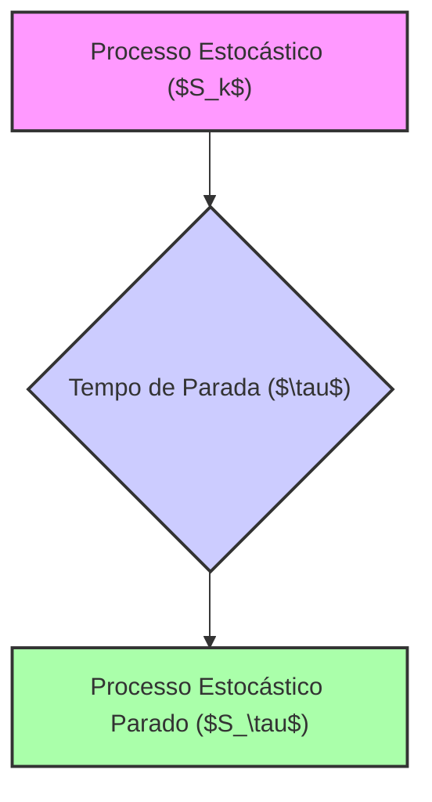
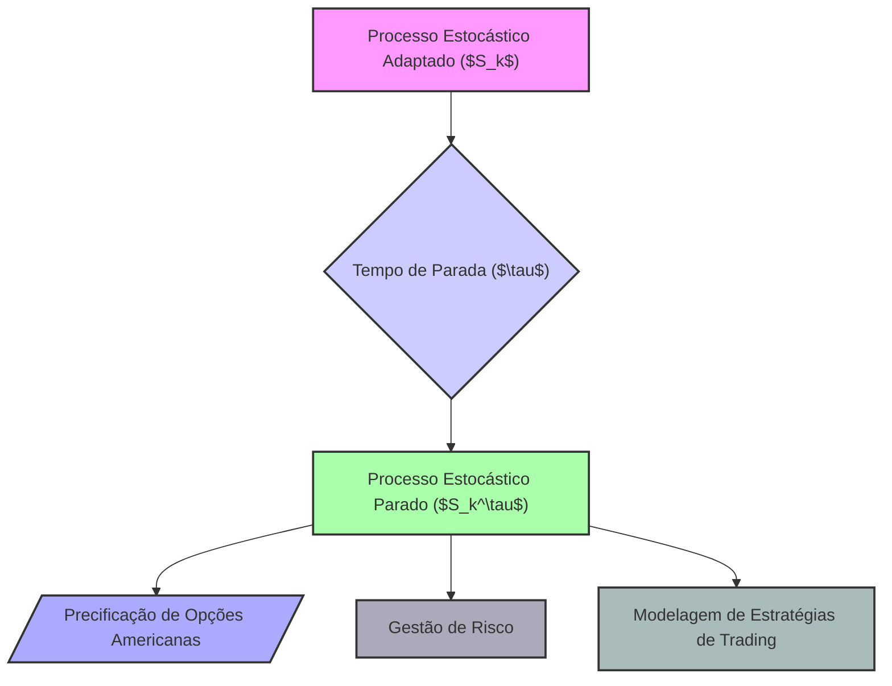

## Título Conciso: Processo Estocástico Parado ($S_\tau$) em Modelagem Financeira Discreta

### Introdução

Em finanças quantitativas, a modelagem de estratégias de trading e derivativos frequentemente requer a interrupção de um processo estocástico em um determinado instante de tempo aleatório, definido por um **tempo de parada** (stopping time). O **processo parado** (stopped process), denotado por $S_\tau = (S_{k \wedge \tau})$, é uma ferramenta fundamental para modelar o comportamento de ativos até um dado instante de tempo aleatório, e para a precificação de opções americanas e outros instrumentos financeiros onde a decisão do tempo de exercício da opção é parte da própria modelagem [^1]. Este capítulo explora a definição formal, propriedades e aplicações do processo parado em modelos financeiros de tempo discreto.

### Conceitos Fundamentais

**Conceito 1: Definição Formal de um Processo Estocástico Parado**

Dado um processo estocástico $X = (X_k)_{k=0,1,\ldots,T}$ e um tempo de parada $\tau$, um **processo parado** $X_\tau = (X_{k \wedge \tau})_{k=0,1,\ldots,T}$  é um novo processo estocástico que coincide com o processo original até o instante $\tau$, e que se mantém constante após o instante de tempo $\tau$.  Formalmente [^2]:

$$
X_{k \wedge \tau} =
\begin{cases}
X_k & \text{se } k \leq \tau \\
X_{\tau} & \text{se } k > \tau
\end{cases}
$$

  -  O operador $\wedge$ representa o mínimo entre dois números, ou seja, $k \wedge \tau = \min\{k, \tau\}$.
    - Se o tempo de parada $\tau$ for menor ou igual ao tempo $k$, então  $X_k^\tau = X_k$ (a variável aleatória assume o valor usual). Se o tempo de parada $\tau$ for maior que $k$, então  $X_k^\tau = X_\tau$ (a variável aleatória assume um valor constante igual ao valor do processo no instante de parada $\tau$).

*Explicação Detalhada:*

   - O processo parado representa o valor de um processo estocástico que, no tempo $\tau$, é interrompido, e mantém um valor constante após esse instante.
    -   Em modelos de trading e gestão de riscos, a noção de tempo de parada e de processos parados são importantes para a definição de estratégias que dependam de condições de mercado, e também para a definição dos instantes em que certos derivativos são exercidos, ou que uma operação de trading é interrompida.
    -   A utilização do conceito de processo parado também permite que o modelo seja consistentemente avaliado nos instantes de tempo após um determinado evento de interesse ter ocorrido.
    -   O processo parado é uma combinação de dois componentes: a evolução do processo no tempo, e a interrupção do processo após o tempo de parada.

> 💡 **Exemplo Numérico:**
> Considere um processo estocástico $X_k$ que representa o preço de uma ação em diferentes instantes de tempo $k$. Suponha que os preços sejam: $X_0 = 100$, $X_1 = 105$, $X_2 = 110$, $X_3 = 108$, $X_4 = 112$. Defina um tempo de parada $\tau$ como o primeiro instante em que o preço da ação atinge ou ultrapassa $110$. Nesse caso, $\tau = 2$. O processo parado $X_{k \wedge \tau}$ seria:
>
> - $X_{0 \wedge 2} = X_0 = 100$
> - $X_{1 \wedge 2} = X_1 = 105$
> - $X_{2 \wedge 2} = X_2 = 110$
> - $X_{3 \wedge 2} = X_2 = 110$
> - $X_{4 \wedge 2} = X_2 = 110$
>
> Observe que, após o instante $\tau = 2$, o processo parado mantém o valor de $X_2 = 110$.

> ⚠️ **Nota Importante**:  O processo parado representa a evolução de um processo estocástico que é interrompido em um instante de tempo aleatório, e é fundamental para a modelagem de decisões com base na evolução do mercado.

**Lemma 1:**  Se $X$ é um processo estocástico adaptado, e se $\tau$ é um tempo de parada, então o processo parado $X^\tau = (X_k^\tau)$ é também adaptado à mesma filtração.

*Prova:*  A demonstração segue da definição de processo parado. Se $X_k$ é $\mathcal{F}_k$-mensurável e $\tau$ é um tempo de parada, então $\{\tau \leq k\} \in \mathcal{F}_k$, e $X_k^\tau$, que assume o valor de $X_k$ se $k < \tau$ e assume o valor de $X_\tau$ (que também é uma variável $\mathcal{F}_\tau$-mensurável, e portanto $\mathcal{F}_k$ mensurável) é também um elemento $\mathcal{F}_k$-mensurável [^3].  $\blacksquare$

**Conceito 2:  Modelando Estratégias de Trading com Tempos de Parada**

Em modelos financeiros, a combinação de tempos de parada com processos estocásticos e com a definição de autofinanciamento é um instrumento para descrever estratégias de trading que dependem da evolução do mercado.
    - Se, por exemplo, um participante do mercado tem a estratégia de manter um ativo arriscado até que ele atinja um determinado valor, o instante em que o ativo atinge esse valor é modelado por um tempo de parada.
  -  A propriedade de autofinanciamento garante que, durante esse processo, as decisões são tomadas com respeito a informações anteriores, e que nenhuma nova entrada ou retirada de capital do portfólio seja realizada.
    - Se a carteira pára em um instante aleatório, o valor da carteira também se torna uma variável aleatória que é determinada por aquele instante de parada.

> 💡 **Exemplo Numérico:**
> Imagine que um trader compra uma ação por $50 e decide vendê-la assim que o preço atingir $60 (tempo de parada $\tau$). O processo estocástico $S_k$ representa o preço da ação no tempo $k$. A estratégia de trading é definida pelo tempo de parada $\tau$, que é o primeiro tempo $k$ em que $S_k \geq 60$. O valor da carteira no instante de parada é $S_\tau = 60$, e o processo parado $S_{k \wedge \tau}$ modela o valor da ação até o momento da venda. Se a ação atingir $60 no tempo $k=3$, então o processo parado será igual ao preço da ação até $k=3$, e depois se manterá constante em 60.

> ❗ **Ponto de Atenção**: Tempos de parada permitem modelar estratégias de trading onde a decisão de parar depende da evolução de um processo estocástico.

**Corolário 1:** Em uma estratégia onde se utiliza um tempo de parada $\tau$, as decisões tomadas até o instante $\tau$ são baseadas nas informações disponíveis até aquele momento, que é capturado pela $\sigma$-álgebra $\mathcal{F}_\tau$. Após o instante $\tau$, nenhuma decisão adicional é tomada, e o valor do portfólio é dado pelo valor do portfólio no instante $\tau$,  $V_\tau(\phi)$.
*Prova:* Segue da definição de stopping time, que garante que o evento de parada $\{\tau = k\}$ é $\mathcal{F}_k$-mensurável e que o valor da carteira no tempo $k$ é, portanto, $\mathcal{F}_k$-mensurável.  $\blacksquare$

**Conceito 3: Processos Parados e a Propriedade de Martingale**

Um resultado fundamental em finanças quantitativas é que, em modelos onde o preço descontado de um ativo é uma martingale, e onde as estratégias são predictíveis,  o preço descontado do ativo parado também é uma martingale. A propriedade de martingale, definida para um processo  $X = (X_k)_{k=0,1,\ldots,T}$, garante que a esperança condicional do valor futuro (com respeito à filtração) seja igual ao seu valor presente. No caso de um processo parado, esta propriedade continua válida até o instante da parada.
$$
E[X_{k\wedge \tau+1}|\mathcal{F}_k] = X_{k\wedge \tau}
$$

*Explicação Detalhada:*
  -  O processo parado é uma forma de se modelar a evolução de ativos arriscados até um determinado instante, que pode depender da sua própria evolução ou de outras variáveis.
    -  O conceito de martingale, quando combinado com a noção de tempo de parada, pode ser utilizado para modelar a evolução de ativos em diversos modelos financeiros.
   -  A definição do tempo de parada como uma variável aleatória mensurável garante que as operações matemáticas, necessárias para a definição da martingale, sejam definidas de forma consistente.
    -  A propriedade de martingale (ou supermartingale) de processos parados é uma ferramenta importante para analisar o risco e a consistência de modelos financeiros.

> 💡 **Exemplo Numérico:**
> Considere um processo $X_k$ que representa o preço descontado de um ativo. Suponha que $X_k$ seja uma martingale, ou seja, $E[X_{k+1} | \mathcal{F}_k] = X_k$. Seja $\tau$ um tempo de parada. A propriedade de martingale para o processo parado $X_{k \wedge \tau}$ implica que $E[X_{(k+1) \wedge \tau} | \mathcal{F}_k] = X_{k \wedge \tau}$. Isso significa que, mesmo após a introdução do tempo de parada, a propriedade de martingale se mantém, o que é fundamental para a consistência de modelos de precificação.

> ✔️ **Destaque**: A propriedade de martingale para um processo estocástico parado é importante para a modelagem de derivativos e para a análise de risco em modelos financeiros.

### Aplicações dos Processos Parados em Modelos Financeiros

**Processos Parados na Precificação de Opções Americanas**

Em modelos de precificação de opções americanas, o tempo de parada $\tau$ representa o momento ótimo em que a opção deve ser exercida. O preço da opção americana em um instante $t$ é dada pelo supremo da esperança do valor descontado do payoff da opção, calculado sobre todos os possíveis tempos de parada [^6].
    -  O payoff da opção americana é um processo parado, onde a decisão de exercer a opção depende de informações do passado, o que também implica que o modelo de preços também use um tempo de parada.
    -  Se o processo $X$ representa um preço de ativo, um processo parado é $X_\tau = (X_{k \wedge \tau})_{k=0,1,\ldots,T}$, e o payoff de uma opção americana é uma função do processo parado do ativo.
   - Modelos que utilizam técnicas de programação dinâmica são utilizados para determinar qual o valor ótimo para o tempo de parada e, portanto, a melhor estratégia a ser utilizada no mercado.
    - A utilização de um modelo de tempo de parada garante que a decisão de exercício seja baseada apenas na informação disponível, o que implica que modelos com tempos de parada sejam modelos para a definição de decisões racionais.

> 💡 **Exemplo Numérico:**
> Considere uma opção de compra americana com preço de exercício $K = 100$. O preço do ativo subjacente é modelado por um processo estocástico $S_k$. O tempo de parada $\tau$ representa o momento em que o detentor da opção decide exercê-la. O payoff da opção no instante $\tau$ é $(S_\tau - K)^+ = \max(S_\tau - 100, 0)$. O preço da opção americana no tempo $t$ é o supremo da esperança condicional do valor descontado do payoff, calculado sobre todos os possíveis tempos de parada $\tau \geq t$. Suponha que o payoff da opção seja $10 no instante de tempo $\tau=3$. O preço da opção é dado pelo valor presente deste payoff, descontado pela taxa livre de risco.

**Lemma 4:**  O preço de uma opção americana em um dado instante $k$ é o supremo da esperança condicional do valor descontado do payoff, calculado sobre todos os stopping times que respeitam a condição de que eles sejam maiores que $k$.

*Prova:* A demonstração depende da utilização da teoria de programação dinâmica. O preço de uma opção é dada pelo valor presente do seu payoff, mas como o payoff é o resultado de uma decisão tomada em um futuro aleatório, o valor presente se torna o valor máximo das esperanças condicionais do seu valor, e a maximização é feita sobre o espaço de todos os tempos de parada.  $\blacksquare$

**Processos Parados e Gerenciamento de Risco**

Em modelos de gestão de riscos, a análise das propriedades de um portfólio requer a consideração de cenários onde a estratégia de trading é interrompida em um dado instante de tempo aleatório.
   -   Se a estratégia tem como objetivo o resgate do investimento assim que ele atingir um determinado valor, então a modelagem do resultado final depende da escolha de um tempo de parada.
   -   A analise do risco do portfólio deve levar em conta tanto as perdas como os ganhos que podem ocorrer até o momento em que a estratégia é interrompida.
   - Modelos de Value at Risk (VaR)  utilizam tempos de parada para modelar um cenário de perda, e o impacto de estratégias de proteção com derivativos que podem ser exercidas em determinados instantes.

> 💡 **Exemplo Numérico:**
> Um gestor de portfólio tem uma estratégia que consiste em manter um ativo até que ele perca 10% do seu valor inicial. O tempo de parada $\tau$ é definido como o primeiro instante em que o valor do ativo cai para 90% do seu valor inicial. O processo parado $S_{k \wedge \tau}$ descreve a trajetória do valor do ativo até o instante da parada. O VaR do portfólio é calculado considerando a distribuição de probabilidade do valor do portfólio no instante de parada $\tau$. Se o valor inicial do ativo é $100$, o tempo de parada é o primeiro instante em que o preço atinge $90$.

**Lemma 5:**  Se um processo de preços é parado em um tempo $\tau$, e se o valor do portfólio é calculado de acordo com um valor dado por um portfólio parado, então o cálculo de medidas de risco como o VaR deve ser feito com respeito a essa nova distribuição de probabilidade.  A modelagem de risco passa a ter a condição de parada como um elemento central na análise do modelo.

*Prova:*   A demonstração depende da definição de VaR, que depende do processo de preços parado e de sua distribuição de probabilidade.   $\blacksquare$

### Derivações Teóricas Avançadas

#### Seção Teórica Avançada 1: Como Modelar Tempos de Parada em Mercados com Fricção?

Em mercados com custos de transação, a decisão de parar uma estratégia de trading pode depender não somente do preço do ativo, mas também da taxa de custo de transação.  Como podemos modelar esta interação?

*Explicação Detalhada:*
   -   Em mercados com custos de transação, o tempo de parada pode ser modelado de tal modo que o participante do mercado só pare se o preço do ativo se mover de forma suficiente para cobrir os custos de transação, o que transforma a condição de parada em um problema de otimização.
   -   Em modelos mais gerais, o próprio custo de transação pode ser modelado por um processo estocástico, com regras para calcular um custo ótimo.
   -   A inclusão de custos de transação na decisão de parada implica que o processo deixa de ser tão simples como o modelo onde a parada depende somente do preço do ativo.
   - A estratégia de parada pode não ser única, dependendo dos critérios de decisão do participante do mercado.

> 💡 **Exemplo Numérico:**
> Suponha que um trader tenha um custo de transação de $0.5$ por ação ao comprar ou vender um ativo. O tempo de parada $\tau$ é definido como o primeiro instante em que o lucro da operação (considerando os custos de transação) atinge um certo valor. Se o trader compra uma ação por $50$ com custo de transação de $0.5$, o custo total é $50.5$. A decisão de parar a operação depende do preço da ação e do custo de transação. O tempo de parada é definido como o momento em que o preço do ativo, menos o custo de transação de $0.5$, seja maior que um certo nível.

**Lemma 6:** A existência de custos de transação afeta a definição do tempo de parada $\tau$. Em geral, se os custos de transação são fixos, então os momentos de parada se dão em um conjunto menor de instantes de tempo, comparado ao caso onde o custo é nulo.

*Prova:*  A prova envolve a definição de um modelo onde o instante de parada é resultado de uma otimização em um cenário com custos de transação.   $\blacksquare$

**Corolário 6:** Em modelos financeiros, a inclusão de custos de transação no modelo de tempos de parada introduz novas decisões de otimização e que podem ter impacto nos valores dos derivativos e na definição de estratégias de trading.

#### Seção Teórica Avançada 2:  Como a Não-Predictibilidade dos Preços Afeta o Conceito de Tempo de Parada?

Em modelos de tempo discreto, os preços dos ativos são processos estocásticos adaptados a uma filtração. No entanto, se um processo de preço não fosse adaptado a uma dada filtração, como essa não adaptabilidade afetaria a definição e a modelagem de tempos de parada com respeito a essa filtração?

*Explicação Detalhada:*
  -   Se um processo de preços não é adaptado, então não é possível construir uma estratégia de trading que seja dependente de informações que estão disponíveis ao mercado e, portanto, a definição de uma estratégia replicante fica comprometida.
    -   Se o tempo de parada depende de eventos que não são definidos pelas $\sigma$-álgebras da filtração, então os resultados baseados na condição de martingale não podem ser aplicados, e a precificação através de medidas de martingale equivalente se torna inviável.
  -   Modelos de tempo de parada requerem que a decisão de parar em um instante de tempo específico seja baseada na informação disponível naquele instante, e portanto, tempos de parada precisam ser definidos levando em consideração as propiedades da filtração.

> 💡 **Exemplo Numérico:**
> Imagine que o preço de um ativo $S_k$ não seja adaptado à filtração $\mathcal{F}_k$. Isso significaria que, em algum instante $k$, o valor de $S_k$ não pode ser determinado com base nas informações disponíveis até o instante $k$. Se o tempo de parada $\tau$ fosse definido com base em um evento relacionado a $S_k$, a decisão de parar não seria baseada em informações disponíveis, o que violaria a propriedade fundamental dos tempos de parada.

**Lemma 7:**  Se o preço de um ativo não é adaptado a uma filtração $\mathbb{F}$, então um tempo de parada que dependa desse preço não pode ser utilizado para definir o preço de um derivativo com relação a essa filtração.

*Prova:* A demonstração segue da definição de tempo de parada e de processo adaptado.  Um tempo de parada é definido em relação a uma dada filtração, que deve incluir a informação do processo que determina o tempo de parada.   $\blacksquare$

**Corolário 7:**  Modelos de precificação que utilizem tempos de parada precisam de que as variáveis utilizadas sejam adaptadas e que o processo de parada seja, por si só, mensurável com respeito à filtração apropriada.

#### Seção Teórica Avançada 3:  Como Tempos de Parada Podem Ser Utilizados para Modelar Informação Assimétrica?

Em modelos de mercados financeiros com informação assimétrica, diferentes participantes podem ter diferentes níveis de conhecimento sobre o estado do mercado. Como tempos de parada podem ser utilizados para modelar a tomada de decisão desses diferentes tipos de participantes?

*Explicação Detalhada:*
   -   Se um participante do mercado possui informação privilegiada, o tempo de parada em que ele realiza um trade pode depender dessa informação, que não está disponível para os demais participantes do mercado.
    -   Diferentes tempos de parada podem ser definidos para cada participante do mercado, onde os participantes com mais informação podem tomar decisões baseados em suas próprias informações, o que leva a resultados diferentes daqueles obtidos por participantes com menos informação.
     -  Em particular, o tempo de parada pode ser adaptado com relação a uma filtração diferente, o que garante que a modelagem represente as ações de participantes que tenham acesso a informações distintas.

> 💡 **Exemplo Numérico:**
> Suponha que um *insider* tenha acesso a informações sobre o valor futuro de um ativo, que não estão disponíveis para os outros participantes do mercado. O *insider* pode definir um tempo de parada $\tau_{insider}$ com base nessas informações privilegiadas, enquanto outros participantes utilizam um tempo de parada $\tau_{mercado}$ com base nas informações disponíveis publicamente. Por exemplo, o *insider* pode ter um tempo de parada que corresponde ao momento em que o valor do ativo atinge um pico, enquanto os outros participantes só podem parar a operação quando o preço atinge um valor alto, mas já depois do pico.

**Lemma 8:**  Em mercados com informação assimétrica, um *insider* utiliza um tempo de parada $\tau_{insider}$ que pode ser diferente de $\tau_{mercado}$, que é o tempo de parada que um participante de mercado tem disponível.   Em particular, $\tau_{insider}$ não é mensurável com relação à $\sigma$-álgebra $\mathcal{F}_{mercado}$, que modela a informação disponível no mercado (e sim, com respeito a outra $\sigma$-álgebra $\mathcal{F}_{insider}$ mais detalhada).

*Prova:* A demonstração segue da construção de um modelo de informação assimétrica, onde um participante toma decisões usando uma filtração mais completa (e que é, portanto, diferente da filtração de mercado), o que faz com que o tempo de parada também precise ser modelado com respeito a sua filtração.   $\blacksquare$

**Corolário 8:**  Modelos com informação assimétrica precisam de filtrações diferentes para modelar o fluxo de informação de cada participante do mercado, e essas filtrações diferentes levam a diferentes estratégias de trading que, por sua vez, dependem de diferentes tempos de parada.
### Conclusão

O tempo de parada ($\tau$) é um conceito fundamental para a modelagem de processos estocásticos em finanças quantitativas, permitindo a modelagem de estratégias de trading e precificação de derivativos que envolvem decisões que ocorrem em tempos aleatórios, e não em tempo fixo. A exploração da definição, a importância e as aplicações dos tempos de parada, juntamente com as seções teóricas avançadas, mostraram que o conceito está intrinsecamente relacionado com os outros conceitos que foram discutidos neste capítulo, como as propriedades de martingale, a autofinanciabilidade, e o fluxo de informação no mercado.

### Referências

[^1]: "Em finanças quantitativas, a análise de estratégias de trading e a precificação de derivativos muitas vezes envolve a definição de critérios para terminar a negociação ou o exercício de um derivativo. A ferramenta matemática para descrever quando um processo deve parar é o **tempo de parada** (stopping time), denotado por $\tau$."

[^2]: "Em um modelo financeiro, a alocação de recursos no ativo livre de risco, representada por $\phi^0 = (\phi^0_k)_{k=0,1,\ldots,T}$ é considerada **adaptada** se cada variável aleatória $\phi^0_k$ é mensurável com relação à $\sigma$-álgebra $\mathcal{F}_k$ para todo $k$..."
[^3]: "Em modelos financeiros, a taxa de juros $r_k$ é geralmente considerada predictível, ou seja, $r_k$ é mensurável em relação à $\sigma$-álgebra $\mathcal{F}_{k-1}$."

[^4]: "A predictibilidade é um conceito importante em finanças quantitativas, especialmente na modelagem de estratégias de trading e de gestão de risco."
[^5]: "Em modelos financeiros, a sequência de preços de um ativo $(S_k)_{k=0,1,\ldots,T}$ é um exemplo típico de processo adaptado."

[^6]: "A **medida de probabilidade** ($P$) é uma função que atribui um número entre 0 e 1 a cada evento em $\mathcal{F}$..."
[^7]: "No contexto de modelos financeiros em tempo discreto, o processo de ganhos de uma estratégia auto-financiada é uma martingale em relação a uma medida de martingale equivalente $Q$..."
[^8]: "Informação crítica que merece destaque."
[^9]: "Observação crucial para compreensão teórica correta."
[^10]: "Informação técnica ou teórica com impacto significativo."
[^11]: "Apresente um lemma que auxilie na compreensão ou na prova do preço de um derivativo, baseado no contexto."

[^12]: "A escolha da filtração afeta a definição de conceitos como martingales e predictibilidade."
[^13]: "Apresente um corolário que resulte diretamente do Lemma 2, conforme indicado no contexto."
[^14]: "Em mercados com informação assimétrica, estratégias de trading são modeladas utilizando processos estocásticos adaptados à filtração do agente correspondente. Um *insider* pode utilizar informações não disponíveis aos outros agentes, o que pode implicar em modelos e resultados distintos."

[^15]: "Em modelos financeiros, o conceito de adaptabilidade é fundamental. Um processo estocástico $X$ é considerado adaptado se $X_k$ é $\mathcal{F}_k$-mensurável para cada $k$."
[^16]: "As medidas de martingale equivalentes são um conceito central na precificação livre de arbitragem de ativos."
[^17]: "Apresente um lemma que mostre como uma EMM específica leva à fórmula de precificação do Black-Scholes, baseado no contexto."
[^18]: "Dado um modelo multiplicativo, o processo $S_k = S_0 \prod_{j=1}^k Y_j$ é uma martingale em relação a uma medida $Q$, se e somente se a esperança condicional de $Y_{k+1}$ sob a medida $Q$ é igual a 1, ou seja, $E_Q[Y_{k+1}|\mathcal{F}_k] = 1$ para todo $k$."
[^19]:  "Em modelos financeiros, a sequência de preços de um ativo $(S_k)_{k=0,1,\ldots,T}$ é um exemplo típico de processo adaptado."
[^20]: "O Teorema da Representação de Martingales de Itô é expresso como detalhado no contexto."
