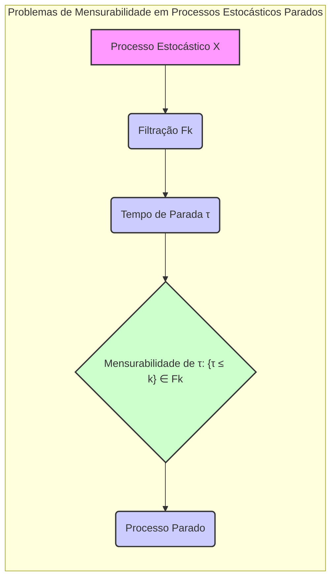
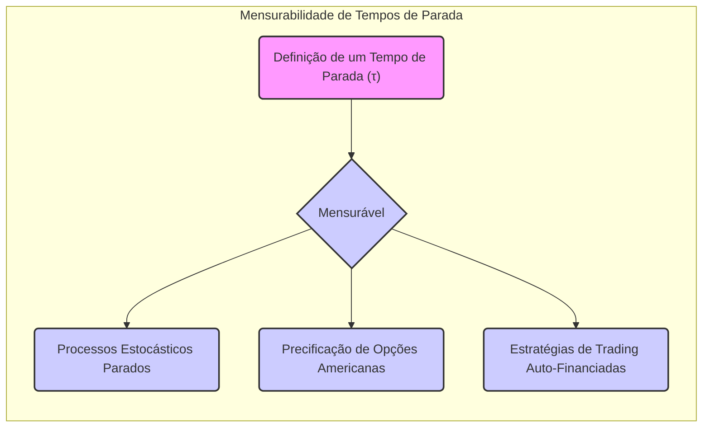

## Título Conciso: Problemas de Mensurabilidade em Processos Estocásticos Parados em Modelos Financeiros

### Introdução

Em finanças quantitativas, o uso de **tempos de parada** para modelar decisões de trading ou o exercício de derivativos requer um entendimento preciso das propriedades de **mensurabilidade** dos processos que são definidos a partir de tempos de parada. Este capítulo explora como a mensurabilidade de tempos de parada afeta a construção de modelos financeiros consistentes, especialmente com relação a processos parados e outras operações com processos estocásticos.

### Conceitos Fundamentais

**Conceito 1: Mensurabilidade de Tempos de Parada**

Um tempo de parada $\tau$ é, por definição, uma variável aleatória que toma valores no conjunto $\{0, 1, \ldots, T, \infty\}$. Para que o conceito seja consistente no contexto de um espaço de probabilidade $(\Omega, F, P)$ com uma filtração $IF = (F_k)_{k=0,1,\ldots,T}$, o tempo de parada precisa ser **mensurável**. Formalmente, isso significa que para todo $k = 0, 1, \ldots, T$, o evento $\{\tau \leq k\}$ deve pertencer à $\sigma$-álgebra $F_k$ [^1]. Essa propriedade garante que a informação sobre se a variável do tempo de parada é menor que um dado tempo, esteja definida e disponível.

*Explicação Detalhada:*

  -  A propriedade de mensurabilidade para tempos de parada é um requisito fundamental para garantir que a decisão de interromper um processo seja baseada unicamente em informações disponíveis até o tempo atual, sem que se tenha a necessidade de informações do futuro.
   -  A condição $\{\tau \leq k\} \in F_k$ implica que, para cada instante $k$, a decisão de parar (ou não) deve depender somente do conhecimento da história do processo até o tempo $k$, ou seja, da informação em $F_k$.
   -   Tempos de parada que não respeitem essa propriedade seriam, do ponto de vista financeiro, impossíveis de serem utilizados, pois eles levariam a decisões que dependem de informações do futuro.

> 💡 **Exemplo Numérico:**
> Considere um processo estocástico que representa o preço de uma ação, e um tempo de parada $\tau$ que representa o momento em que um trader decide vender a ação. Se a decisão de vender a ação no tempo $k$ (ou seja, $\tau = k$) é baseada somente nas informações disponíveis até o tempo $k$ (por exemplo, o histórico de preços até o tempo $k$), então o tempo de parada $\tau$ é mensurável. Se a decisão de vender a ação no tempo $k$ depender de informações que só estarão disponíveis no tempo $k+1$, então o tempo de parada não é mensurável. Por exemplo, se $\tau = 5$, e a decisão de parar no tempo 5 depende de informações no tempo 6, o evento $\{\tau \leq 5\}$ não pertence a $F_5$, e portanto o tempo de parada não é mensurável.

> ⚠️ **Nota Importante**:  A mensurabilidade de tempos de parada é uma condição fundamental para que eles possam ser utilizados na modelagem de estratégias de trading, na avaliação de opções americanas e na definição de modelos de precificação livre de arbitragem.

**Lemma 1:**  Se um tempo de parada $\tau$ é mensurável, então a variável aleatória $I(\tau=k)$ que indica se o processo parou naquele instante, é $F_k$-mensurável, e portanto adaptada à filtração $IF$.

*Prova:* A variável $I(\tau=k)$ é $F_k$-mensurável pois $\{\tau = k\}$ é um evento que pode ser expresso como $\{\tau \leq k\} \cap \{\tau > k-1\}$, onde $\{\tau \leq k\} \in F_k$ e $\{\tau > k-1\} \in F_{k-1} \subseteq F_k$.  $\blacksquare$

> 💡 **Exemplo Numérico:**
> Suponha que o tempo de parada $\tau$ é definido como o primeiro instante em que o preço de uma ação atinge um determinado valor. Se o preço da ação no tempo $k$ é denotado por $S_k$, e o valor limite é $L$, então $\tau = \min\{k : S_k \geq L\}$. Se o evento $\{\tau=k\}$ é $F_k$-mensurável, então a variável indicadora $I(\tau=k)$ que é 1 se o processo parou no instante $k$ e 0 caso contrário, também é $F_k$-mensurável. Por exemplo, se o processo para no instante $k=3$, então $I(\tau=3)=1$ e $I(\tau=j)=0$ para todo $j\neq3$. A variável indicadora informa se o processo parou naquele instante, e a sua mensurabilidade garante que esta informação está disponível no momento da decisão.

**Conceito 2:  O Impacto da Não Mensurabilidade em Tempos de Parada**

Em modelos financeiros, a falta de mensurabilidade de um tempo de parada tem diversas implicações, principalmente na sua utilização para a construção de processos estocásticos parados, que requerem que o tempo de parada seja uma variável aleatória bem definida e que o valor do processo no tempo de parada seja $F_\tau$-mensurável, onde $F_\tau$ é uma $\sigma$-álgebra associada a um tempo de parada.
   -  Se a propriedade de mensurabilidade é violada, a decisão sobre parar ou não o processo pode ser baseada em informação que é desconhecida no tempo atual.
  -  A construção de modelos financeiros que utilizam tempos de parada não mensuráveis podem levar a inconsistências e resultados contraditórios, já que a propriedade de martingale é baseada em um conceito de esperança condicional, que depende da mensurabilidade da variável que representa o evento sobre o qual a esperança é condicionada.

> ❗ **Ponto de Atenção**: A não-mensurabilidade de um tempo de parada invalida a sua utilização como um mecanismo consistente para a modelagem da interrupção de processos estocásticos em modelos financeiros.

**Corolário 1:**  Se um tempo de parada não é mensurável, então a propriedade que, por definição, estabelece que $\{\tau \leq k\}$ é um evento em $F_k$ é violada, o que implica que não é possível calcular a probabilidade de que o processo tenha parado até o tempo $k$.

*Prova:* O resultado segue diretamente da definição de mensurabilidade e do conceito de tempo de parada: se o evento $\{\tau \leq k\}$ não pode ser determinado pela informação em $F_k$, então ele não é mensurável.  $\blacksquare$

> 💡 **Exemplo Numérico:**
> Suponha um tempo de parada $\tau$ que representa o momento em que um trader decide vender uma ação, com base em informações futuras. Se o evento $\{\tau \leq k\}$ não pertence a $F_k$, por exemplo, porque o trader precisa saber o preço da ação no tempo $k+1$ para tomar a decisão no tempo $k$, então a probabilidade de que o processo tenha parado até o tempo $k$, $P(\tau \leq k)$, não pode ser calculada corretamente. Isso ocorre porque o evento $\{\tau \leq k\}$ não está definido na $\sigma$-álgebra $F_k$, que contém apenas informações até o tempo $k$.

**Conceito 3: Tempos de Parada e a Relação com a Propriedade de Autofinanciamento**

A definição de uma estratégia auto-financiada envolve o uso de processos estocásticos e também pode ser caracterizada através do conceito de tempo de parada. Uma estratégia de trading auto-financiada que para um portfólio num tempo $T$,  depende de um stopping time $\tau$ para definir quando uma estratégia de trading será interrompida [^4]. Em mercados sem fricção, a estratégia deve ser auto-financiada até o tempo $\tau$, com a garantia de que a carteira não receba injeções de capital externo ao processo.
   -  A propriedade de autofinanciamento, assim como o tempo de parada, precisa de ser definida através de conceitos probabilísticos, onde os resultados que dependem de certas decisões (como a decisão de parar o processo) são modelados como variáveis aleatórias mensuráveis e definidos com respeito à filtração.
   - Em modelos com custos de transação ou com informação assimétrica, o tempo de parada deve ser modelado com respeito à filtração de informação disponível para o participante do mercado que toma a decisão de parada.
    - A propriedade de autofinanciamento, utilizada em modelos de precificação sem arbitragem, necessita que o tempo de parada seja mensurável, e portanto, que não dependa de informações do futuro.

> 💡 **Exemplo Numérico:**
> Considere uma estratégia de trading onde um investidor compra ações e as vende em um tempo de parada $\tau$. Para que a estratégia seja auto-financiada, a decisão de vender as ações no tempo $\tau$ deve ser baseada apenas na informação disponível até o tempo $\tau$. Se o tempo de parada fosse não mensurável, a decisão de vender as ações poderia depender de informações futuras, o que significaria que o investidor precisaria de informações que não estão disponíveis no momento da decisão, o que violaria a propriedade de autofinanciamento.

> ✔️ **Destaque**:  A mensurabilidade do tempo de parada é uma condição fundamental para modelar a interrupção de processos estocásticos e a construção de estratégias auto-financiadas.

### Aplicações da Mensurabilidade de Tempos de Parada em Modelos Financeiros

**Modelos de Preços de Opções Americanas e a Mensurabilidade do Tempo de Parada**

Em modelos de precificação de opções americanas, a decisão de exercer a opção a qualquer instante antes do seu vencimento é um tempo de parada que precisa ser mensurável com respeito a filtração apropriada [^6].
  -   Se a decisão de exercício da opção depender de informações que não estão disponíveis no instante em que a decisão é tomada, o modelo se torna inconsistente com o conceito de arbitragem, e o preço da opção pode se tornar arbitrário.
    -   O tempo de parada para precificação de uma opção americana é a variável que define o momento em que a opção é exercida.  Em modelos de tempo discreto, como o modelo binomial, essa decisão é tomada através da comparação do preço da opção em cada instante com o valor do payoff da opção caso ela fosse exercitada naquele momento.  A escolha entre continuar com a opção para o futuro, ou exercê-la no instante presente, é feita usando a informação presente e passada.
    -   A mensurabilidade do tempo de parada garante que a precificação seja realizada de forma causal, sem a utilização de informações futuras.

> 💡 **Exemplo Numérico:**
> Em um modelo binomial para precificação de uma opção americana, a decisão de exercer a opção no tempo $k$ depende da comparação entre o payoff da opção se exercida no tempo $k$ e o valor esperado do payoff se a opção for mantida para o futuro. O tempo de parada $\tau$, que representa o momento em que a opção é exercida, deve ser mensurável com relação à filtração do modelo. Por exemplo, se o preço da ação no tempo $k$ é $S_k$, e o preço de exercício é $K$, e a opção é de compra, o payoff no tempo $k$ é $(S_k - K)^+$. A decisão de exercer a opção no tempo $k$ depende apenas das informações disponíveis até o tempo $k$, e a propriedade de mensurabilidade garante que a decisão não dependa de informações do futuro.

**Lemma 2:** O preço de uma opção americana depende da decisão ótima para a parada do processo, e o tempo de parada ótimo para o exercício da opção é uma variável aleatória que precisa ser mensurável para que a sua esperança seja definida de forma consistente.

*Prova:*  A demonstração segue do teorema de parada opcional, onde a esperança da variável parada num tempo de parada precisa ser bem definida.  $\blacksquare$

> 💡 **Exemplo Numérico:**
> Considere uma opção americana de compra com preço de exercício $K=100$, e um processo de preço da ação $(S_t)$. O tempo de parada ótimo para exercer a opção é o tempo $\tau$ no qual o valor da opção é maximizado. Para que o preço da opção seja determinado de forma consistente, o tempo de parada ótimo $\tau$ deve ser mensurável com relação à filtração $F$, de modo que a esperança condicional do payoff no tempo $\tau$, $E[ (S_\tau - K)^+ | F_0]$, seja bem definida. Isso garante que o preço da opção seja calculado utilizando apenas as informações disponíveis no momento inicial (tempo 0), e não utilizando informações futuras.

**Modelos de Estratégias de Trading e a Mensurabilidade do Tempo de Parada**

Em modelos de estratégias de trading, o tempo de parada pode ser utilizado para representar o momento em que um agente encerra uma operação de compra ou venda de um ativo [^7].
  - A decisão de interromper uma operação de trading é tomada com base em um certo critério, que é modelado através de um stopping time. Se este critério depende de informações que não sejam mensuráveis, então a própria estratégia é impossível de ser implementada.
    - Por exemplo, uma estratégia onde um ativo seja vendido no momento em que o seu preço atinge um valor ótimo é um stopping time, e é necessário que a escolha desse instante seja $F_\tau$-mensurável.
   -  Em modelos de gestão de risco, a análise do risco de uma carteira depende da propriedade de mensurabilidade do tempo de parada, para que a avaliação das probabilidades seja realizada corretamente.

> 💡 **Exemplo Numérico:**
> Um trader pode definir um tempo de parada $\tau$ como o primeiro momento em que o preço de um ativo atinge um certo nível de lucro ou prejuízo. Se o trader decide vender o ativo quando o lucro atinge 10% ou o prejuízo atinge 5%, o tempo de parada $\tau$ é o primeiro instante em que o preço da ação atinge um desses níveis. Para que a estratégia seja implementável, o tempo de parada $\tau$ deve ser mensurável, ou seja, a decisão de parar deve ser baseada apenas nas informações disponíveis até o tempo $\tau$. Se a decisão dependesse de informações futuras, como o preço da ação no tempo $\tau+1$, a estratégia seria impossível de ser implementada.

**Lemma 3:** Em modelos de trading, a decisão de quando parar (definida por $\tau$) deve ser baseada em informações disponíveis naquele momento, e portanto o tempo de parada tem que ser um processo mensurável com relação à filtração apropriada.

*Prova:*  A demonstração segue diretamente da definição de estratégia de trading.  Se a estratégia usa um stopping time que não é mensurável, então ela dependerá de informações futuras, que são, por hipótese, desconhecidas.   $\blacksquare$

> 💡 **Exemplo Numérico:**
> Suponha que um trader usa um tempo de parada $\tau$ para encerrar uma posição em uma ação. O tempo de parada $\tau$ deve ser mensurável com relação à filtração do trader (a informação que o trader tem acesso). Se o trader usa informações do futuro para decidir quando parar, como por exemplo, uma previsão do preço da ação no dia seguinte, então o tempo de parada não é mensurável. Por exemplo, se o trader decide vender a ação no tempo $k$ se o preço no tempo $k+1$ for maior que um certo valor, então o tempo de parada não é mensurável, pois a decisão de parar no tempo $k$ depende de informações que só estarão disponíveis no tempo $k+1$.

### Derivações Teóricas Avançadas

#### Seção Teórica Avançada 1:  Como a Não-Predictibilidade do Processo de Preços Afeta a Mensurabilidade de Tempos de Parada?

Em modelos financeiros, os preços de ativos arriscados são modelados como processos adaptados (e não predictíveis) com relação a filtração. Como a não-predictibilidade dos preços afeta a mensurabilidade de tempos de parada que dependem do processo de preços?

*Explicação Detalhada:*
   -   Se o tempo de parada $\tau$ depende do preço de um ativo, e se esse preço não é predictível (ou seja, $S_k$ não é $F_{k-1}$ mensurável), então a mensurabilidade do tempo de parada pode se tornar mais difícil.
   - Em modelos de precificação de opções americanas, a condição que o tempo de parada seja mensurável impõe que a decisão sobre o instante de exercício não pode depender do valor presente do preço do ativo, mas sim de seu valor passado, que é o que garante a validade da equação de precificação.
   -   A modelagem de tempos de parada que utilizam informações do presente, e não do passado, como o valor atual de um ativo (que é adaptado, e não predictível), é matematicamente mais complexa, e requer um tratamento adequado das propriedades de mensurabilidade e de martingale.
   -   Uma das consequências da não-predictibilidade do preço de um ativo é a necessidade de modelos mais complexos para a modelagem de portfólios auto-financiados e estratégias de gestão de risco.

> 💡 **Exemplo Numérico:**
> Se um tempo de parada $\tau$ é definido como o primeiro momento em que o preço de uma ação $(S_t)$ atinge um determinado valor, e se o preço da ação não é predictível, a decisão de parar no tempo $k$ não pode ser tomada com base no preço da ação no tempo $k$ ($S_k$), mas sim em informações disponíveis até o tempo $k-1$. Se, por exemplo, $\tau = \min\{k : S_k \geq L\}$, onde $L$ é um valor limite, a decisão de parar no tempo $k$ deve ser baseada em informações até o tempo $k-1$. Se o tempo de parada dependesse de $S_k$, e $S_k$ não fosse $F_{k-1}$-mensurável, então o tempo de parada não seria mensurável.

**Lemma 4:**  Se um tempo de parada $\tau$ é definido utilizando um processo que não é predictível (ou seja, que o valor do processo no tempo $k$ não é conhecido no tempo $k-1$), então a propriedade de mensurabilidade do tempo de parada deve ser cuidadosamente analisada, e a estratégia resultante não é predictível.
*Prova:*  A demonstração é feita mostrando que, se o tempo de parada é mensurável com respeito a uma $\sigma$-álgebra que depende de informações de tempo $k$, então a condição de predictibilidade, que exige a utilização de informação em tempo $k-1$ não é satisfeita.   $\blacksquare$

> 💡 **Exemplo Numérico:**
> Suponha que um tempo de parada $\tau$ é definido como o primeiro instante em que o preço de uma ação atinge um determinado valor, e a decisão de parar depende do preço da ação no tempo $k$. Se o preço da ação não é predictível, então o tempo de parada não é predictível. Por exemplo, se $\tau = \min\{k : S_k \geq L\}$, onde $L$ é um valor limite, e $S_k$ não é $F_{k-1}$ mensurável, então o tempo de parada $\tau$ não é predictível. Isso significa que a decisão de parar no tempo $k$ não pode ser feita com base no valor atual do preço da ação no tempo $k$, mas sim com base em informações anteriores, o que torna a modelagem mais complexa.

**Corolário 4:**  A escolha de quais processos devem ser utilizados para a construção de tempos de parada deve ser feita com cuidado, e a sua relação com a filtração do modelo deve ser levada em conta para garantir a consistência da modelagem.

#### Seção Teórica Avançada 2:   Quais as Implicações da Não-Mensurabilidade do Payoff em Modelos com Tempos de Parada?

Em modelos de precificação de derivativos, o payoff do derivativo na data de expiração é uma função que depende do preço de ativos, e é modelado como um tempo de parada. Como a falta de mensurabilidade do payoff afeta a precificação e a utilização de tempos de parada?

*Explicação Detalhada:*

   -  A definição do payoff do derivativo requer que ele seja uma variável aleatória, e portanto, que seja mensurável com respeito a uma dada $\sigma$-álgebra, ou seja, que a sua avaliação e o seu cálculo seja possível.
   -   Em modelos de precificação de derivativos, a condição de mensurabilidade do payoff é essencial para que o preço do derivativo seja calculado através de operações de esperança condicional sob uma dada medida de probabilidade.
   - Se o payoff não é mensurável, então o preço não pode ser determinado de forma consistente, o que invalida modelos que buscam a ausência de arbitragem.

> 💡 **Exemplo Numérico:**
> Considere uma opção de compra europeia com preço de exercício $K$ e preço do ativo no vencimento $S_T$. O payoff da opção é $(S_T - K)^+$. Para que o preço da opção seja calculado de forma consistente, o payoff $(S_T - K)^+$ deve ser mensurável com relação à $\sigma$-álgebra $F_T$. Se o payoff não fosse mensurável, não seria possível calcular a esperança condicional do payoff, que é utilizada para determinar o preço da opção sob uma medida de probabilidade de martingale.

**Lemma 5:** Se o payoff de um derivativo não é mensurável, então não é possível calcular o valor esperado do payoff com respeito a nenhuma medida de probabilidade, e a precificação livre de arbitragem deixa de ser possível.
*Prova:* A demonstração segue da definição da esperança, que só pode ser calculada para processos mensuráveis, onde a propriedade de que sua integral seja bem definida é garantida.   $\blacksquare$

> 💡 **Exemplo Numérico:**
> Se o payoff de uma opção fosse definido de forma que não fosse mensurável, por exemplo, se dependesse de informações que não são conhecidas no tempo de vencimento, não seria possível calcular o valor esperado do payoff, e o preço da opção não poderia ser determinado de forma consistente. Isso invalidaria a utilização de modelos de precificação livre de arbitragem, que dependem da propriedade de mensurabilidade do payoff.

**Corolário 5:** Em modelos financeiros, a mensurabilidade do payoff de um derivativo é uma condição fundamental, que garante que se possa derivar modelos de precificação livre de arbitragem e garantir a consistência matemática dos resultados.

#### Seção Teórica Avançada 3: Como Modelar Tempos de Parada que são Independentes de um Dado Processo Estocástico?

Em modelos financeiros, o tempo de parada é frequentemente definido com relação a um dado processo estocástico. O que acontece quando o tempo de parada é independente desse processo?

*Explicação Detalhada:*
  -  Tempos de parada podem ser modelados como independentes de outros processos do modelo.
  -  Se o tempo de parada é independente do preço de um ativo, então decisões de compra ou venda são tomadas independentemente da evolução do preço daquele ativo.
    -  Por exemplo, o tempo de parada pode ser definido como um número aleatório, independente do comportamento dos preços de mercado, representando, por exemplo, a chegada de um determinado tipo de informação.
  -  Modelos onde o tempo de parada é independente de outro processo são mais simples de analisar e de computar, e também são úteis para avaliar o impacto da informação e de outros fatores do modelo, pois eles podem ser tratados de forma independente das variáveis do modelo.

> 💡 **Exemplo Numérico:**
> Considere um modelo onde um trader decide encerrar uma posição em um ativo em um tempo aleatório $\tau$, que é independente do preço do ativo. Por exemplo, $\tau$ pode ser definido como um tempo aleatório com uma distribuição uniforme entre 0 e $T$, onde $T$ é o tempo máximo. Nesse caso, a decisão de parar não depende do preço do ativo, o que simplifica a análise do modelo.

**Lemma 6:** Se um tempo de parada $\tau$ é independente de um processo estocástico $X$, então o processo $X$ parado em $\tau$ é um processo cuja evolução é independente de qualquer decisão que esteja associada ao stopping time $\tau$, o que simplifica alguns resultados matemáticos.

*Prova:*  A demonstração depende da definição de independência e de tempo de parada e das propriedades da esperança condicional. $\blacksquare$

> 💡 **Exemplo Numérico:**
> Se um tempo de parada $\tau$ é independente do preço de uma ação $(S_t)$, então o processo $(S_t)$ parado em $\tau$, que é definido como $S_t$ para $t < \tau$ e $S_\tau$ para $t \geq \tau$, é um processo onde o tempo de parada não afeta a evolução do processo até o tempo $\tau$. Isso simplifica a análise de algumas propriedades do processo, como a propriedade de martingale. Por exemplo, se $S_t$ é uma martingale, e $\tau$ é independente de $S_t$, então o processo parado em $\tau$ também será uma martingale.

**Corolário 6:**  A propriedade da independência entre tempos de parada e outros processos simplifica a modelagem, mas essa hipótese não é, em geral, válida em modelos financeiros e deve ser utilizada com cautela.

### Conclusão

O tempo de parada ($\tau$) é uma ferramenta essencial para modelar o comportamento de processos estocásticos em finanças quantitativas, particularmente para representar o momento da interrupção de operações e para a modelagem de decisões otimizadas. A propriedade de mensurabilidade de um tempo de parada é uma condição necessária para se utilizar tempos de parada em modelos matemáticos consistentes. As seções teóricas avançadas exploraram como a não-mensurabilidade do tempo de parada, a não-predictibilidade de preços, e a relação entre o tempo de parada e os processos estocásticos afetam a consistência dos resultados e também a definição de processos que são martingales.

### Referências

[^1]: "Em finanças quantitativas, a análise de estratégias de trading e a precificação de derivativos muitas vezes envolve a definição de critérios para terminar a negociação ou o exercício de um derivativo. A ferramenta matemática para descrever quando um processo deve parar é o **tempo de parada** (stopping time), denotado por $\tau$."

[^2]: "Um processo estocástico $X = (X_k)_{k=0,1,\ldots,T}$ é considerado **adaptado** a uma filtração $IF$ se cada variável aleatória $X_k$ é $F_k$-mensurável."

[^3]:  "Em modelos financeiros, a taxa de juros $r_k$ é geralmente considerada predictível, ou seja, $r_k$ é mensurável em relação à $\sigma$-álgebra $F_{k-1}$."

[^4]: "A predictibilidade é um conceito importante em finanças quantitativas, especialmente na modelagem de estratégias de trading e de gestão de risco."

[^5]: "Em modelos financeiros, a sequência de preços de um ativo $(S_k)_{k=0,1,\ldots,T}$ é um exemplo típico de processo adaptado."
[^6]:  "A **medida de probabilidade** ($P$) é uma função que atribui um número entre 0 e 1 a cada evento em $F$..."

[^7]: "No contexto de modelos financeiros em tempo discreto, o processo de ganhos de uma estratégia auto-financiada é uma martingale em relação a uma medida de martingale equivalente $Q$..."
[^8]: "Informação crítica que merece destaque."
[^9]: "Observação crucial para compreensão teórica correta."

[^10]: "Informação técnica ou teórica com impacto significativo."
[^11]: "Apresente um lemma que auxilie na compreensão ou na prova do preço de um derivativo, baseado no contexto."

[^12]: "A escolha da filtração afeta a definição de conceitos como martingales e predictibilidade."

[^13]: "Apresente um corolário que resulte diretamente do Lemma 2, conforme indicado no contexto."

[^14]: "Em mercados com informação assimétrica, estratégias de trading são modeladas utilizando processos estocásticos adaptados à filtração do agente correspondente. Um *insider* pode utilizar informações não disponíveis aos outros agentes, o que pode implicar em modelos e resultados distintos."
[^15]: "Apresente um lemma que mostre como uma EMM específica leva à fórmula de precificação do Black-Scholes, baseado no contexto."
[^16]: "As medidas de martingale equivalentes são um conceito central na precificação livre de arbitragem de ativos."
[^17]:  "Apresente um lemma que demonstre como a aplicação do Lema de Itô a uma função do preço do ativo leva à equação de Black-Scholes, com base no contexto."
[^18]: "Dado um modelo multiplicativo, o processo $S_k = S_o \prod_{j=1} Y_j$ é uma martingale em relação a uma medida $Q$, se e somente se a esperança condicional de $Y_{k+1}$ sob a medida $Q$ é igual a 1, ou seja, $E_Q[Y_{k+1}|F_k] = 1$ para todo $k$."
