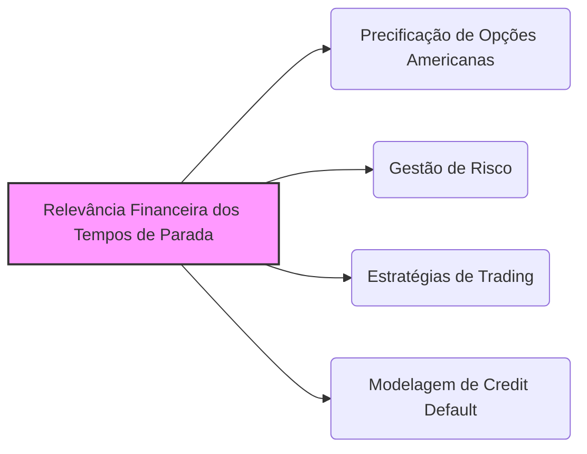
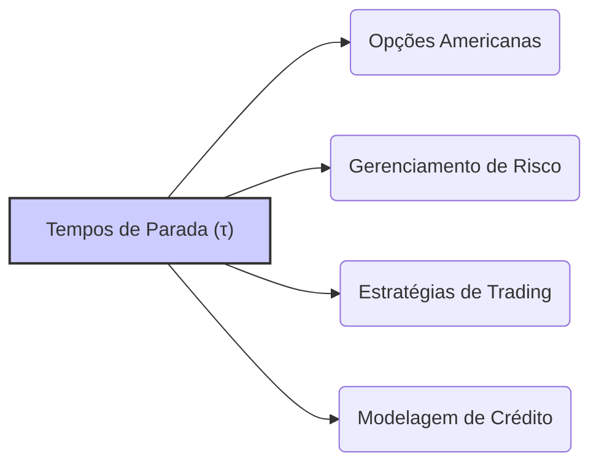

## Título Conciso: Relevância Financeira dos Tempos de Parada em Modelos de Tempo Discreto

### Introdução

Em modelos financeiros de tempo discreto, os **tempos de parada** (stopping times), denotados por $\tau$, são ferramentas essenciais para modelar a tomada de decisão dos participantes do mercado em situações onde a duração da operação é incerta [^1]. Ao contrário de modelos de tempo fixo, onde o período da operação é determinado a priori, os tempos de parada fornecem uma estrutura para representar decisões que são baseadas na evolução do mercado e nas características dos ativos. Este capítulo explora a relevância financeira dos tempos de parada, através da discussão de suas aplicações em precificação de opções americanas, modelos de risco e estratégias de trading.

### Conceitos Fundamentais

**Conceito 1: Tempos de Parada e a Modelagem da Decisão de Exercício em Opções Americanas**

Uma das aplicações mais relevantes de tempos de parada em modelos financeiros é a modelagem de decisões de exercício em **opções americanas**. Em uma opção americana, o detentor do direito de compra ou venda pode exercê-la em qualquer instante até a data de expiração [^2]. O tempo ótimo de exercício da opção é modelado através de um tempo de parada, que depende da evolução do preço do ativo subjacente ao longo do tempo e das condições de mercado.

*Explicação Detalhada:*

  -  O tempo de parada para uma opção americana é a variável aleatória que representa o instante em que a opção é exercida, o que implica que, para cada resultado no espaço amostral, a decisão de quando exercitar pode ocorrer em momentos diferentes.
  -   O detentor da opção busca o tempo de parada que maximize o valor esperado da opção. O exercício antes ou no vencimento é modelado de forma endógena (dentro do modelo) como um processo ótimo, dado que a opção americana pode ser exercida a qualquer instante de tempo.
  -  Modelos de precificação de opções americanas utilizam o conceito de programação dinâmica, a qual tem a propriedade que um valor ótimo pode ser encontrado utilizando um processo recursivo que parte do último instante até o instante inicial, o que é similar a ideia de parada expressa num stopping time.
   -  A modelagem do tempo de exercício como um stopping time garante que a decisão seja baseada somente em informações disponíveis até o momento do exercício, respeitando a causalidade e a dinâmica da evolução do mercado.

> ⚠️ **Nota Importante**: Tempos de parada são essenciais na modelagem de opções americanas, pois permitem representar o direito de exercer a opção em qualquer instante até a data de expiração.

**Lemma 1:** O preço de uma opção americana em um instante t, num modelo de tempo discreto, é dado pelo máximo do valor presente de todos os payoffs possíveis, onde cada possível payoff é obtido através da aplicação de um stopping time para modelar a decisão de exercício, ou seja:
$$
  V_t = \sup_{\tau \ge t} E[e^{-r(\tau-t)} H_{\tau} | F_t]
$$
onde o supremo é tomado sobre todos os stopping times que sejam maiores ou iguais que o tempo t. [^17]

*Prova:* A demonstração depende da utilização de programação dinâmica e do lema de parada opcional, onde a decisão ótima em cada instante do tempo é baseada na informação presente e o processo de otimização é feito através de um processo recursivo, desde a data de expiração até o tempo inicial. $\blacksquare$

> 💡 **Exemplo Numérico: Cálculo do Valor de uma Opção Americana em um Tempo de Parada**
>
> Considere uma opção de compra americana com preço de exercício (K) de $100. O preço do ativo subjacente (S) no tempo t=0 é $90, e pode subir para $110 ou cair para $80 no tempo t=1. A taxa livre de risco (r) é 5% por período. Assumindo que o tempo de parada ($\tau$) para exercer a opção pode ser t=1 ou t=2 (a data de expiração), vamos analisar o valor da opção em t=0.
>
> Se a opção for exercida em t=1, o payoff será:
> - Se S = $110: H_1 = max(110 - 100, 0) = $10
> - Se S = $80: H_1 = max(80 - 100, 0) = $0
>
> O valor esperado do payoff em t=1 é: $E[H_1] = 0.5 * 10 + 0.5 * 0 = $5. O valor presente desse payoff em t=0 é $5 / (1 + 0.05) = $4.76.
>
> Se a opção for mantida até t=2 (exercida na expiração) o valor seria calculado de forma similar com mais cenários de preço em t=2. O tempo de parada ótimo seria aquele que maximiza o valor presente esperado. 
>
> A fórmula $V_t = \sup_{\tau \ge t} E[e^{-r(\tau-t)} H_{\tau} | F_t]$ formaliza esse processo de encontrar o tempo de parada ótimo.

**Conceito 2: Tempos de Parada e Modelagem de Estratégias de Trading**

Estratégias de trading podem ser modeladas através da utilização de tempos de parada. Por exemplo, um investidor pode decidir manter um portfólio até que um determinado evento aconteça no mercado, e o instante em que esse evento acontece pode ser definido através de um stopping time. As estratégias que incluem tempos de parada são mais dinâmicas e permitem que as decisões de trading sejam dependentes do fluxo de informação ao longo do tempo.
  -  Em modelos de *high-frequency trading*, por exemplo, os tempos de parada podem modelar as decisões de compra e venda em frações de segundos, dependendo de regras pré-estabelecidas.
  -  Estratégias de *stop-loss* (onde se vende um ativo quando ele atinge um preço mínimo) também podem ser modeladas utilizando o conceito de stopping time.

> ❗ **Ponto de Atenção**: Tempos de parada permitem modelar estratégias de trading que se adaptam à evolução do mercado, e que são interrompidas ao atingir um determinado objetivo ou quando um certo evento ocorre.

**Corolário 1:**  Uma estratégia de trading que utiliza um tempo de parada pode ser vista como uma estratégia mais sofisticada que combina informações do passado e do presente para a tomada de decisões no mercado.

*Prova:* A demonstração segue da definição de tempos de parada, que garantem que a decisão de parar seja baseada nas informações disponíveis até o momento da parada. $\blacksquare$

> 💡 **Exemplo Numérico: Estratégia de Stop-Loss com Tempo de Parada**
>
> Um trader define uma estratégia de stop-loss para uma ação. Ele compra a ação por $50 e define um limite de perda de 5%, ou seja, um preço de stop-loss de $47.50. O tempo de parada ($\tau$) nesse caso é o primeiro instante em que o preço da ação atinge ou cai abaixo de $47.50.
>
> Suponha que a evolução do preço da ação ao longo do tempo seja:
> - t=0: $50
> - t=1: $49
> - t=2: $48
> - t=3: $47
> - t=4: $47.75
>
> O tempo de parada $\tau$ para essa estratégia seria $\tau$ = 3, porque em t=3 o preço da ação atinge o valor de $47, que é menor do que o preço de stop-loss definido.
>
> Essa estratégia modela a decisão de sair de uma posição quando o mercado se move contra o trader.

**Conceito 3:  Tempos de Parada e Gerenciamento de Riscos**

Em modelos de gestão de risco, a utilização de tempos de parada permite modelar cenários de risco onde perdas podem ser evitadas através de uma interrupção oportuna do investimento ou de uma estratégia de *hedge*.
  -  A modelagem de risco de um portfólio de ativos através de tempos de parada pode simular situações em que os investimentos são realizados somente até que um certo nível de risco é atingido,  ou onde as opções de *hedge* são exercidas somente quando a probabilidade de perdas aumenta, por exemplo.
    -  Modelos de Value at Risk (VaR) e Expected Shortfall (ES) também podem utilizar tempos de parada para modelar cenários de perda.

> ✔️ **Destaque**:  Tempos de parada são instrumentos relevantes na modelagem de estratégias de trading e gestão de risco, onde as decisões de parar devem ser tomadas com base na informação presente e passada.

### Aplicações e Implicações dos Tempos de Parada em Modelos Financeiros

**O Uso de Tempos de Parada na Precificação de Opções Americanas**

Em modelos de opções americanas, a estratégia de exercício é modelada através de um tempo de parada, onde a decisão de exercer a opção depende do preço do ativo subjacente e do tempo restante até a data de expiração. O preço da opção é calculado considerando todos os possíveis tempos de parada que respeitam a condição de ser menor ou igual ao tempo de expiração da opção.
    -  A utilização de tempos de parada garante que a opção seja exercida no instante ótimo, de forma consistente com a informação disponível naquele momento, o que garante que a modelagem seja livre de arbitragem.

**Lemma 4:** O valor de uma opção americana V(t), no instante t é dada pelo supremo, sobre todos os tempos de parada $\tau$ maiores ou iguais a t, da esperança condicional do valor descontado do payoff da opção no tempo $\tau$:

$$V_t = \sup_{\tau \ge t} E^Q \left[ \frac{H_{\tau}}{(1+r)^{\tau-t}} | \mathcal{F}_t \right]$$
onde Q é uma medida martingale equivalente e r é a taxa de juros livre de risco, e a estratégia ótima para o exercício da opção é modelada como um tempo de parada.

*Prova:*  A demonstração requer a utilização de conceitos de programação dinâmica e do lema de parada opcional.   $\blacksquare$

> 💡 **Exemplo Numérico: Cálculo do Preço de uma Opção Americana com Tempo de Parada**
>
> Considere uma opção de venda americana com preço de exercício (K) de $100. O preço do ativo subjacente (S) no tempo t=0 é $105 e pode subir para $115 ou cair para $95 no tempo t=1. A taxa livre de risco (r) é de 5% por período.
>
> O payoff da opção em t=1, se exercida, será:
> - Se S = $115: H_1 = max(100 - 115, 0) = $0
> - Se S = $95: H_1 = max(100 - 95, 0) = $5
>
> O valor esperado do payoff em t=1 é $E[H_1] = 0.5 * 0 + 0.5 * 5 = $2.50. O valor presente desse payoff em t=0 é $2.50 / (1 + 0.05) = $2.38.
>
> No tempo t=0, se o detentor da opção decidir não exercer, ele pode esperar para ver o que acontece em t=1. O valor da opção em t=0 é o máximo entre o valor presente do payoff esperado em t=1 (se exercida em t=1) ou o valor esperado do payoff em um tempo posterior. A fórmula formaliza este processo de encontrar o tempo de parada ótimo.

**Tempos de Parada e Modelagem de Default de Crédito**

Em modelos de risco de crédito, o tempo de parada pode ser utilizado para modelar o instante em que um devedor deixa de honrar as suas obrigações financeiras, o que é modelado como um evento do tipo default.
  -  O instante de default é modelado como um tempo de parada, onde a ocorrência do evento depende da evolução da saúde financeira do devedor, que pode ser modelada através de um processo estocástico.
    -   Modelos com tempos de parada podem definir como o risco de crédito evolui ao longo do tempo.
   -  A modelagem das decisões de default como um stopping time permite analisar o risco da carteira de um credor que empresta dinheiro.

**Lemma 5:** Em um modelo de risco de crédito, a probabilidade de default do devedor, em um instante de tempo t, pode ser expressa como a probabilidade que um tempo de parada $\tau$, associado a um modelo específico de comportamento do devedor, ocorra antes do tempo t, ou seja $P(\tau < t)$, o que é um exemplo do uso de tempos de parada.

*Prova:* A demonstração segue diretamente da definição de um tempo de parada como a variável que modela o instante em que um certo evento acontece. $\blacksquare$

> 💡 **Exemplo Numérico: Modelagem de Default com Tempo de Parada**
>
> Considere um modelo de risco de crédito onde o default de um devedor ocorre quando seu índice de saúde financeira (S) atinge um limite crítico (L). O tempo de parada ($\tau$) é o primeiro instante em que $S \leq L$.
>
> Suponha que o índice S evolui ao longo do tempo:
> - t=0: S = 100
> - t=1: S = 95
> - t=2: S = 90
> - t=3: S = 85
>
> Se o limite crítico L for 88, o tempo de parada $\tau$ para o default será $\tau$ = 3, pois em t=3 o índice S atinge um valor inferior a L.
>
> A probabilidade de default até um certo tempo t pode ser calculada como $P(\tau < t)$. Essa modelagem permite analisar como o risco de crédito evolui ao longo do tempo.

### Derivações Teóricas Avançadas

#### Seção Teórica Avançada 1: Como Modelar Estratégias de Parada em Mercados com Custos de Transação?

A definição de um tempo de parada depende da escolha das variáveis a serem monitoradas, e também do objetivo a ser alcançado pela estratégia. Como modelar a interação entre os custos de transação e as decisões de parada, em mercados que não são livres de atrito?

*Explicação Detalhada:*
   -  Em modelos com custos de transação, a decisão de parar o processo não depende somente do preço do ativo, mas também dos custos de transação incorridos para sair da posição.
   -  Em modelos com custos de transação, o tempo de parada pode ser modelado como um valor que é obtido através de um processo de otimização, onde o objetivo é obter o máximo retorno, subtraindo-se os custos da transação, o que também pode ser visto como o menor valor da operação dado as restrições do problema.
   -   A escolha de qual a variável que será utilizada para definir o tempo de parada pode impactar a forma como o processo de ganhos/perdas se manifesta, e também qual a forma ótima de modelar a carteira.

**Lemma 6:**  Se os custos de transação dependem das variações de preços, então, a definição do tempo de parada que leva em consideração esses custos deve utilizar um modelo que seja não somente baseado na informação do tempo anterior (o conceito de predictibilidade), mas também no valor presente da taxa de custos e, portanto, os resultados devem ser obtidos através de um problema de otimização.

*Prova:*  A demonstração requer uma modelagem explícita de custos de transação, e da forma que eles impactam a estratégia de trading, o que geralmente gera um problema de otimização.   $\blacksquare$

> 💡 **Exemplo Numérico: Impacto dos Custos de Transação no Tempo de Parada**
>
> Considere um trader que compra uma ação por $100. Ele tem uma estratégia de stop-loss em $95, mas também incorre em um custo de transação de $0.50 por ação quando vende.
>
> Sem custos de transação, o tempo de parada seria o primeiro instante em que o preço da ação atinge $95.
>
> Com custos de transação, o trader deve considerar que o valor líquido da venda seria $95 - $0.50 = $94.50. Isso significa que o tempo de parada ótimo pode ser diferente de quando não há custos de transação.
>
> Por exemplo, se o preço da ação cair para $96 e depois subir novamente, o trader pode não querer vender imediatamente, pois o valor líquido da venda seria $95.50, o que é menor do que o preço atual da ação. O tempo de parada é definido por um processo de otimização que leva em conta os custos.

**Corolário 6:** Em modelos financeiros onde os custos de transação não são nulos, o uso de tempos de parada que levam esses custos em consideração é fundamental para modelar estratégias de trading que sejam factíveis e que maximizem os ganhos líquidos (e não somente os ganhos brutos).

#### Seção Teórica Avançada 2:  Como a Não-Adaptabilidade de um Processo Estocástico Afeta a Mensurabilidade do Tempo de Parada Definido a Partir Dele?

Em modelos com tempos de parada, assume-se que esses sejam mensuráveis. No entanto, se o tempo de parada é modelado através de um processo estocástico não adaptado, o que acontece com a propriedade de mensurabilidade do tempo de parada?

*Explicação Detalhada:*
   -    A condição que $\{\tau \leq k\} \in F_k$ é fundamental para que $\tau$ seja um stopping time, e que portanto, sua avaliação seja definida pela informação disponível até o tempo k.
  -  Se o processo utilizado para modelar o stopping time não é adaptado, o evento de parada deixa de ser mensurável (e portanto, deixa de ser um stopping time no sentido estrito) e a modelagem pode apresentar inconsistências.
    -  Modelos com variáveis não adaptadas para modelar stopping times podem gerar resultados sem sentido, dado que a condição de mensurabilidade e causalidade não seriam garantidas pelo modelo.

**Lemma 7:** Se um tempo de parada $\tau$ é definido com base em um processo que não é adaptado a uma filtração IF, então, em geral, o evento $\{\tau \leq k\}$ deixa de ser mensurável,  e $\tau$ não pode ser considerado um tempo de parada com relação à filtração IF.

*Prova:* A demonstração é uma consequência da definição de stopping time e da propriedade de que um processo adaptado X tem que ter os eventos $\{X_k \in B\}$ (onde B é um conjunto de Borel) como um elemento de $F_k$. Se o processo que define o tempo de parada não for adaptado, então a condição de mensurabilidade deixa de ser satisfeita.  $\blacksquare$

> 💡 **Exemplo Numérico: Impacto da Não-Adaptabilidade na Mensurabilidade do Tempo de Parada**
>
> Suponha que um tempo de parada $\tau$ seja definido como o primeiro instante em que um processo estocástico não adaptado X atinge um certo valor. Se X não é adaptado à filtração F, então o evento $\{\tau \leq k\}$ pode depender de informações futuras, o que viola a definição de um tempo de parada.
>
> Por exemplo, se $X_k$ depende de informações em k+1, então a decisão de parar em k dependeria de informações que ainda não estão disponíveis no tempo k, e $\tau$ não seria um stopping time. Isso invalidaria a aplicação de ferramentas de modelos de tempo de parada.

**Corolário 7:**   A utilização de processos não adaptados para definir tempos de parada invalida algumas propriedades de modelos financeiros, o que torna os resultados mais difíceis de serem analisados, a menos que o modelo utilize outras ferramentas matemáticas para suprir essa limitação.

#### Seção Teórica Avançada 3:   Como Modelar Tempos de Parada em Modelos com Múltiplas Filtrações?

Em mercados com assimetria de informação, diferentes participantes têm acesso a diferentes informações. Como a modelagem de tempos de parada é afetada quando consideramos múltiplas filtrações em um mesmo modelo?

*Explicação Detalhada:*
    -  Em modelos onde há participantes com acesso a diferentes informações, a modelagem das decisões de parada tem que ser modelada em relação às filtrações dos diversos participantes.
   -  Em modelos com múltiplos participantes, cada participante pode ter diferentes tempos de parada, baseados nas suas decisões e informações e nas propriedades de martingales com respeito à sua filtração particular.
  -  A utilização de tempos de parada em modelos com assimetria de informação é uma ferramenta importante para modelar como cada participante reage a diferentes eventos e a como a informação se propaga no mercado.
    - Modelos com múltiplos tempos de parada são utilizados no estudo de estratégias de insider trading e também para a análise das consequências de assimetrias na distribuição de informação em modelos com tempos de parada.

**Lemma 8:**  Em modelos onde há múltiplos agentes com informações diferentes, modeladas através de diferentes filtrações, o tempo de parada utilizado por cada agente deve ser mensurável com respeito à sua filtração, e diferentes tempos de parada podem levar a estratégias de investimento diferentes.

*Prova:*  A demonstração segue da definição de tempos de parada, que são sempre definidos com respeito a uma $\sigma$-álgebra, e onde a modelagem de informação assimétrica impõe o uso de diferentes $\sigma$-álgebras.  $\blacksquare$

> 💡 **Exemplo Numérico: Tempos de Parada em Modelos com Múltiplas Filtrações**
>
> Considere dois traders, A e B. O trader A tem acesso a informações privadas sobre uma ação, enquanto o trader B só tem acesso a informações públicas.
>
> O trader A define seu tempo de parada ($\tau_A$) para comprar a ação com base em suas informações privadas. O trader B define seu tempo de parada ($\tau_B$) para comprar a ação com base em informações públicas.
>
> Como os traders têm diferentes conjuntos de informações, seus tempos de parada podem ser diferentes. $\tau_A$ pode ocorrer antes de $\tau_B$, dado que o trader A tem informações privilegiadas. A modelagem com múltiplas filtrações permite analisar o impacto da assimetria de informação nas decisões de trading.

**Corolário 8:** A modelagem de tempos de parada em modelos com assimetria de informação precisa levar em consideração as diferentes filtrações disponíveis para cada participante, o que impacta a modelagem das suas estratégias e a precificação de derivativos.

### Conclusão

O tempo de parada ($\tau$) é um conceito essencial para modelar decisões de interrupção em modelos financeiros de tempo discreto. A sua aplicação na precificação de opções americanas, em modelos de gestão de risco, e em estratégias de trading é vasta. As seções teóricas avançadas exploraram as nuances da modelagem de tempos de parada através da análise da sua mensurabilidade e das suas relações com a hipótese de preços adaptados, e da sua interação com as diferentes formas de modelar mercados com fricção e informação assimétrica.

### Referências

[^1]: "Em finanças quantitativas, a análise de estratégias de trading e a precificação de derivativos muitas vezes envolve a definição de critérios para terminar a negociação ou o exercício de um derivativo. A ferramenta matemática para descrever quando um processo deve parar é o **tempo de parada** (stopping time), denotado por $\tau$."

[^2]: "Em um modelo financeiro, a alocação de recursos no ativo livre de risco, representada por $\phi^º = (\phi^º_k)_{k=0,1,\ldots,T}$ é considerada **adaptada** se cada variável aleatória $\phi^º_k$ é mensurável com relação à $\sigma$-álgebra $F_k$ para todo k..."

[^3]: "Em modelos financeiros, a taxa de juros $r_k$ é geralmente considerada predictível, ou seja, $r_k$ é mensurável em relação à $\sigma$-álgebra $F_{k-1}$."

[^4]: "A predictibilidade é um conceito importante em finanças quantitativas, especialmente na modelagem de estratégias de trading e de gestão de risco."

[^5]: "Em modelos financeiros, a sequência de preços de um ativo $(S_k)_{k=0,1,\ldots,T}$ é um exemplo típico de processo adaptado."

[^6]: "A **medida de probabilidade** (P) é uma função que atribui um número entre 0 e 1 a cada evento em F..."

[^7]: "No contexto de modelos financeiros em tempo discreto, o processo de ganhos de uma estratégia auto-financiada é uma martingale em relação a uma medida de martingale equivalente Q..."

[^17]: "Em modelos financeiros, a sequência de preços de um ativo $(S_k)_{k=0,1,\ldots,T}$ é um exemplo típico de processo adaptado."
