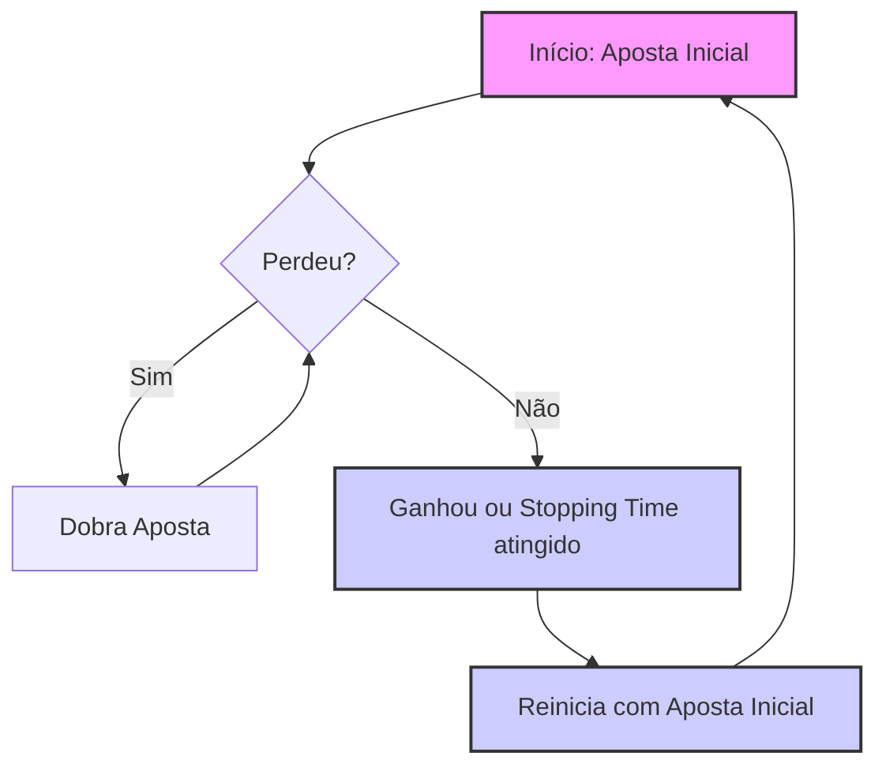
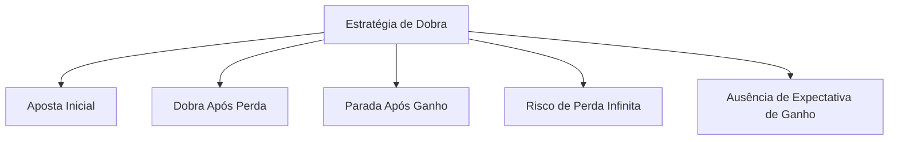

## Título Conciso: A Estratégia de Dobra em Modelos Financeiros de Tempo Discreto

### Introdução

Em modelos financeiros e de teoria de jogos, a **estratégia de dobra** (doubling strategy) é um exemplo clássico de uma estratégia que parece prometer ganhos seguros ao dobrar a aposta após uma perda [^1]. Embora intuitiva, esta estratégia apresenta sérias limitações e paradoxos quando analisada com o rigor matemático e em particular com a teoria de martingales e stopping times. Este capítulo explora a definição, aplicação, propriedades e limitações da estratégia de dobra em modelos financeiros de tempo discreto.

### Conceitos Fundamentais

**Conceito 1: Definição Formal da Estratégia de Dobra**

A estratégia de dobra é uma estratégia de trading onde, após cada perda, a aposta no ativo arriscado é dobrada, e após um ganho, o processo é interrompido e um novo ciclo de apostas se reinicia com a aposta inicial. Em termos matemáticos, em um modelo de tempo discreto com um ativo livre de risco e um ativo arriscado, a estratégia de dobra é definida pelos seguintes passos [^2]:
   1.  O portfólio começa com um valor inicial $C_0(\phi)$, definido pela alocação inicial de um ativo livre de risco.
    2.  Uma aposta inicial, $\theta_0$, é definida no ativo arriscado (que pode ser um valor fixo, ou um valor que dependa do capital inicial).
  -  Se a operação termina em uma perda, a aposta no ativo arriscado no período seguinte é dobrada.
   -   Se a operação termina em um ganho (ou se um stopping time é atingido), o processo é interrompido e um novo ciclo de apostas inicia com a aposta inicial $\theta_0$, o que implica que o modelo é, em geral, dependente de um stopping time.
  -   Em modelos com um ativo livre de risco, as perdas na carteira arriscada são, em geral, compensadas por alocações correspondentes no ativo livre de risco para que a propriedade de autofinanciamento seja satisfeita.

*Explicação Detalhada:*

  -  A estratégia de dobra, embora pareça intuitiva, se baseia na ideia errônea de que se pode recuperar as perdas através do aumento da aposta.
    - O aumento da aposta em cada instante pode levar rapidamente a um grande endividamento, e também a um grande ganho, dependendo da evolução dos preços do ativo arriscado.
    -   A estratégia de dobra não considera as propriedades de um processo estocástico e suas limitações na modelagem de retornos, e tampouco leva em consideração as limitações financeiras de um participante do mercado.

> 💡 **Exemplo Numérico:**
>
> Suponha que um investidor comece com um capital inicial de $C_0 = \$1000$ e uma aposta inicial $\theta_0 = \$10$ em um ativo arriscado. Se a primeira aposta resultar em uma perda, a próxima aposta será $\theta_1 = 2 \times \$10 = \$20$. Se a segunda aposta também resultar em perda, a terceira aposta será $\theta_2 = 2 \times \$20 = \$40$. E assim por diante. Se, por exemplo, na quarta aposta houver um ganho, o processo é interrompido, e um novo ciclo se inicia com uma aposta inicial de $\theta_0 = \$10$. Este exemplo ilustra como as apostas crescem rapidamente, e como o capital pode ser rapidamente consumido se houver uma sequência de perdas.

> ⚠️ **Nota Importante**: A estratégia de dobra é um exemplo de uma estratégia de investimento intuitiva mas que pode apresentar limitações e resultados contraditórios quando avaliada de forma rigorosa.

**Lemma 1:** Se o ativo arriscado tem uma probabilidade de ganho e de perda que são estritamente menores que 1 (ou seja, que o ativo não é um ativo determinístico), então a probabilidade de que a estratégia termine o ciclo de apostas com um ganho finito é sempre menor que 1, ou seja, que exista uma probabilidade maior que 0 de que a estratégia produza uma série de perdas, e que portanto a carteira tenha perdas consideráveis (e potencialmente infinitas).

*Prova:*  A demonstração se baseia na hipótese de que a probabilidade de uma variável aleatória binária (ganho ou perda) seja diferente de zero e de um, e portanto a probabilidade de que um evento específico seja repetido sucessivamente converge para zero, levando a um risco considerável no uso de estratégias de dobra [^3].   $\blacksquare$

**Conceito 2: Propriedade de Autofinanciamento e Estratégias de Dobra**

A estratégia de dobra, quando modelada através de um portfólio com um ativo livre de risco e um ativo arriscado, exige que a propriedade de autofinanciamento seja satisfeita, ou seja, que a mudança no valor da carteira seja devido somente aos ganhos e perdas dos ativos e não por um influxo externo de capital [^4].
   -  Em particular, em modelos de tempo discreto com custos de transação nulos, as variações no valor do portfólio devem ser sempre compensadas por uma variação oposta no ativo livre de risco (e vice-versa), o que garante que o balanço da carteira se mantenha em zero, e que, portanto, a carteira se autofinancie.
    - Se a estratégia é auto-financiada, então ela gera um processo de valor que é uma martingale sob uma medida de martingale equivalente Q, mas em modelos sem fricção.

> 💡 **Exemplo Numérico:**
>
> Considere um cenário em que um investidor tem um portfólio com um ativo livre de risco (como um título do governo) e um ativo arriscado (como uma ação). Inicialmente, o investidor tem $1000 em um ativo livre de risco. Ele decide apostar $100 no ativo arriscado. Se essa aposta resultar em uma perda de $20, o valor do portfólio no ativo arriscado será $80. Para manter a propriedade de autofinanciamento, o investidor deve transferir $20 do ativo livre de risco para o ativo arriscado, de modo que a perda seja compensada e o portfólio continue autofinanciado. O valor total do portfólio permanece $1000, com $920 no ativo livre de risco e $80 no ativo arriscado.

> ❗ **Ponto de Atenção**:  A condição de autofinanciamento é a base para a modelagem de estratégias de trading e para a avaliação de risco em mercados financeiros.

**Corolário 1:** Em uma estratégia de dobra, a componente $\phi^0$ do portfólio (a alocação em um ativo livre de risco) é adaptada, pois ela depende do resultado de cada aposta no ativo arriscado, o que implica que a decisão do quanto alocar no ativo livre de risco depende dos resultados já ocorridos no mercado.

*Prova:* Se a estratégia é auto-financiada, a variação do portfólio devido à mudança no ativo arriscado tem que ser compensada por uma mudança no ativo livre de risco. A escolha de qual ativo livre de risco alocar é, portanto, dependente de informações do passado, e portanto o componente $\phi^0$ é adaptado à filtração gerada pelos preços dos ativos.   $\blacksquare$

**Conceito 3: Tempos de Parada e a Estratégia de Dobra**

A estratégia de dobra envolve uma decisão de parada, onde o investidor para de dobrar a aposta assim que um certo evento ocorre [^5]. O tempo de parada $\tau$, modela o instante em que o portfólio para de ser ajustado, e a definição deste tempo é fundamental para entender o comportamento da estratégia.
    -  A decisão de parada pode ser baseada no instante em que se tem um resultado positivo, ou um conjunto de resultados positivos.
    - Em outros modelos, a estratégia de parada depende da ocorrência de um certo evento externo (como um determinado nível de preço).
  - A modelagem do tempo de parada, combinado com o comportamento do ativo arriscado é fundamental para entender as propriedades matemáticas da estratégia de dobra.

> 💡 **Exemplo Numérico:**
>
> Um investidor pode definir um tempo de parada $\tau$ como o primeiro momento em que ele obtém um ganho, ou seja, o primeiro momento em que a aposta no ativo arriscado resulta em um lucro. Alternativamente, o tempo de parada $\tau$ pode ser definido como o momento em que o investidor atinge um determinado lucro total, por exemplo, $200. Ou ainda, o tempo de parada pode ser definido como um número máximo de apostas (por exemplo, 10). A escolha do tempo de parada afeta diretamente o resultado da estratégia, e portanto, é fundamental para a análise do risco e do retorno.

> ✔️ **Destaque**: A modelagem do tempo de parada é um componente essencial para analisar a estratégia de dobra e para calcular o seu risco e seu retorno.

###  Modelagem Financeira com a Estratégia de Dobra

**A Estratégia de Dobra em Modelos de Jogo**

A estratégia de dobra, ou estratégia de Martingale (não confundir com o conceito de martingale em probabilidade), é utilizada para tentar obter um ganho em jogos de azar, onde a cada aposta, se o jogador perde, a aposta seguinte dobra de valor, de modo a recuperar as perdas.  O conceito de Martingale (em francês) foi inventado para se tentar criar um método para sempre ganhar, e como mostraremos abaixo, essa estratégia é falha, pois, embora possa levar a ganhos rapidamente, o risco de perda pode também crescer exponencialmente.
 - Se a aposta é feita em um evento com probabilidade de 50%, e se o jogador dobra a aposta toda vez que ele perde, então o primeiro evento de ganho garante que a carteira do jogador se recupere.

> 💡 **Exemplo Numérico:**
>
> Considere um jogo de cara ou coroa onde um jogador aposta $1. Se ele perder, ele aposta $2 na próxima rodada. Se ele perder novamente, ele aposta $4, e assim por diante. Se ele ganhar em qualquer rodada, ele recupera todas as perdas anteriores e ganha $1. Por exemplo, se ele perder três vezes seguidas e ganhar na quarta vez, ele terá apostado $1 + $2 + $4 + $8 = $15 e ganha $16, resultando em um lucro de $1. No entanto, se ele tiver uma série de perdas, o valor da aposta pode crescer rapidamente, levando a um grande risco de perda.

**Lemma 2:**  A utilização da estratégia de dobra não garante que um jogador tenha um ganho. Se o número de apostas é infinito, a probabilidade de o jogador perder todo o seu capital inicial converge para um.

*Prova:* Se a probabilidade de perder (q) é menor que 1, a probabilidade de uma série de perdas (e portanto o tempo até obter um ganho) ser grande demais pode ser arbitrariamente próximo de um.   $\blacksquare$

**A Estratégia de Dobra e a Precificação Livre de Arbitragem**

Em modelos financeiros com estratégias auto-financiadas, é impossível construir estratégias que garantam lucro sem risco. Se a estratégia de dobra fosse livre de risco, ela poderia ser utilizada para modelar uma oportunidade de arbitragem, o que não é possível em modelos consistentes com a lei do preço único.
   -  Em modelos onde a condição de autofinanciamento é satisfeita, a utilização de tempos de parada não é suficiente para criar uma estratégia que garanta lucro sem risco.
     - O estudo da estratégia de dobra demonstra um caso particular onde a propriedade de martingale não pode ser utilizada como forma de obter lucro, dado que a estratégia não é limitada e o tempo de parada pode ser arbitrariamente longo.

**Lemma 3:**  Em modelos sem fricção, a estratégia de dobra, embora intuitiva, não é uma estratégia que gera lucros sem risco. Em particular, ela não é uma estratégia auto-financiada, pois o crescimento das apostas leva a perdas em alguns cenários e a nenhum ganho na média.

*Prova:* A prova é baseada no estudo de martingale e da aplicação do Lema de parada opcional, que não se aplica a essa estratégia, dado que ela não é limitada (e o tempo de parada pode ser infinito).  $\blacksquare$

### Derivações Teóricas Avançadas

#### Seção Teórica Avançada 1:  Como Modelar o Risco de Perdas Infinitas em Estratégias de Dobra?

A estratégia de dobra, embora intuitiva, é conhecida por apresentar um grande risco de perdas, pois o valor apostado cresce exponencialmente após cada perda. Como modelar este risco de perda infinita e quais suas implicações nos modelos?

*Explicação Detalhada:*
    -  Em mercados onde o número de apostas pode ser infinito, o valor da aposta da estratégia de dobra pode crescer de tal forma que a probabilidade de falência (de perder toda a carteira) se torna igual a 1.
    -  Em modelos com um limite de investimento, a probabilidade de perdas também é grande, pois um número muito grande de apostas leva rapidamente ao esgotamento do capital.
  -  Modelos que incluem um limite para as apostas não podem ser considerados como estratégias de autofinanciamento, e portanto, o modelo deixa de ser consistente com a hipótese de que a precificação de derivativos possa ser feita com respeito a uma martingale.

> 💡 **Exemplo Numérico:**
>
> Suponha que um investidor comece com um capital de $1000 e aposta $10 inicialmente. Se ele perder, ele aposta $20, e assim por diante. Após 10 perdas consecutivas, ele terá que apostar $10 * 2^{10} = $10240, o que excederia seu capital inicial, demonstrando o risco de perdas exponenciais. Mesmo com um limite de aposta, o risco de esgotar o capital é alto, pois a probabilidade de sequências longas de perdas não é nula, e o crescimento exponencial das apostas rapidamente leva ao limite do capital disponível.

**Lemma 4:** Em uma estratégia de dobra onde o valor da aposta dobra após cada perda, a probabilidade de perdas se torna maior e maior quanto mais se repete o evento de perda, levando a um risco crescente de perdas arbitrariamente grandes.

*Prova:*  A prova é feita utilizando as propriedades geométricas de séries infinitas.  $\blacksquare$

**Corolário 4:**  Modelos que representam a estratégia de dobra precisam levar em conta o risco de perdas e também a condição de que a probabilidade de falência se torna igual a um se o número de apostas tende ao infinito.

#### Seção Teórica Avançada 2:   Como a Propriedade de Martingale é Violada em Estratégias de Dobra?

A propriedade de martingale é fundamental em modelos de precificação livre de arbitragem.  Como a estratégia de dobra viola esta condição e como isso se relaciona com a escolha do tempo de parada?

*Explicação Detalhada:*
   -    Modelos que representam a estratégia de dobra, onde o valor do portfólio tende a ser igual a um valor inicial + uma determinada quantia se o resultado for positivo e que tende a menos infinito se o resultado for negativo, não pode ser um martingale pois a sua esperança condicional não é igual ao seu valor presente.
   -   A propriedade de martingale, que implica que não haja um retorno médio de um ativo acima (ou abaixo) da taxa de juros, não é satisfeita pela estratégia de dobra.
  -  Modelos baseados na propriedade de martingale requerem que a estrategia de investimento não seja uma martingale, como é o caso da estratégia de dobra, o que leva a modelos inconsistentes com o pressuposto de ausência de arbitragem.
 -   Em particular, a estratégia de dobra pode ser utilizada para exemplificar estratégias que, apesar de serem consistentes com a lógica das decisões de trading, geram processos que não respeitam as propriedades de uma martingale, o que dificulta a sua análise matemática e a sua utilização como modelo de referência.

> 💡 **Exemplo Numérico:**
>
> Suponha que o valor do portfólio em um momento *t*, $X_t$, seja uma martingale. Isso significa que a esperança condicional do valor do portfólio no próximo período, dado o conhecimento atual, é igual ao valor atual: $E[X_{t+1} | \mathcal{F}_t] = X_t$, onde $\mathcal{F}_t$ representa a informação disponível até o tempo *t*. No entanto, na estratégia de dobra, se houver uma perda, o valor do portfólio diminui, e se houver um ganho, o valor aumenta. Portanto, a esperança condicional do valor do portfólio não é igual ao valor atual, e a propriedade de martingale é violada.

**Lemma 5:**  A estratégia de dobra não é um processo martingale e o teorema de parada opcional não pode ser utilizado em sua análise, pois ela não satisfaz as propriedades de um processo para o qual esse teorema foi provado (como por exemplo, integrabilidade uniforme, limites nos valores etc.).

*Prova:*   A demonstração se baseia nas propriedades de convergência de variáveis aleatórias e da definição de martingale, o qual garante que um processo que é uma martingale não tenha uma tendência de crescimento ou decréscimo do seu valor esperado condicionado na informação passada.  A estratégia de dobra, por sua vez, não segue essas propriedades. $\blacksquare$

**Corolário 5:** A estratégia de dobra é, portanto, um exemplo da importância das hipóteses matemáticas na modelagem financeira, e como uma estratégia pode apresentar resultados matematicamente inconsistentes se essas hipóteses não forem respeitadas.

#### Seção Teórica Avançada 3:   Como a Não Mensurabilidade do Tempo de Parada Impacta a Modelagem da Estratégia de Dobra?

A modelagem da estratégia de dobra depende da definição de um tempo de parada ($\tau$). O que acontece com o modelo e com seus resultados se $\tau$ não for um tempo de parada bem definido?

*Explicação Detalhada:*

    -  Em modelos onde o tempo de parada não é mensurável, não é possível avaliar a probabilidade do evento de parada, o que dificulta a análise do modelo e do desempenho da estratégia, pois a esperança de um processo parado, que depende do stopping time, deixa de ter sentido.
   -   Em particular, a definição do payoff final, que depende do stopping time, pode deixar de ser uma variável aleatória bem definida, dado que as funções de payoff são usualmente mensuráveis e precisam de um stopping time mensurável para terem um valor bem definido.
    -  Se o tempo de parada não for mensurável, a análise do modelo deixa de ser consistente com o comportamento de estratégias em mercados reais e a condição de ausência de arbitragem não pode ser garantida.

> 💡 **Exemplo Numérico:**
>
> Considere um tempo de parada $\tau$ que dependa de informações futuras, ou seja, que o investidor decida parar a estratégia com base em um evento que ainda não aconteceu. Por exemplo, $\tau$ poderia ser definido como o momento em que um ativo atinge um preço que só será conhecido no futuro. Esse tipo de tempo de parada não é mensurável em relação à informação disponível até o momento presente e não pode ser usado em um modelo de tempo discreto. A não-mensurabilidade do tempo de parada impossibilita o cálculo de probabilidades e expectativas, tornando a análise da estratégia inviável.

**Lemma 6:** Se o tempo de parada $\tau$ não é mensurável, então o processo parado $X^\tau$ não é mensurável, e a propriedade de martingale ou outras propriedades da teoria da probabilidade não podem ser usadas para a análise do comportamento dos processos.

*Prova:*   A demonstração se baseia na definição de mensurabilidade e de tempo de parada e na propriedade de um processo parado.  Se o tempo de parada não é um stopping time e portanto não é mensurável, então o processo $X^\tau$ não pode ser modelado como uma variável aleatória.  $\blacksquare$

**Corolário 6:**   Em modelos financeiros, a mensurabilidade do tempo de parada é uma condição essencial para a construção de modelos consistentes, livres de arbitragem e que possam ser analisados com as ferramentas da teoria da probabilidade e do cálculo estocástico.

### Conclusão

A estratégia de dobra é um exemplo clássico de como uma estratégia de trading que parece prometer ganhos seguros pode ser, na realidade, um exemplo de uma estratégia de alto risco, que não consegue produzir resultados positivos no longo prazo. A análise desta estratégia permite entender como as hipóteses de um modelo (a independência, a mensurabilidade, a adaptabilidade, a predictibilidade, e o conceito de martingale) são importantes para obter resultados consistentes e coerentes, principalmente em modelos de precificação de ativos e derivativos. As seções teóricas avançadas mostraram como a estratégia de dobra pode ser utilizada para ilustrar as consequências da violação de certas hipóteses na modelagem financeira.

### Referências

[^1]: "Em modelos financeiros e de teoria de jogos, a **estratégia de dobra** (doubling strategy) é um exemplo clássico de uma estratégia que parece prometer ganhos seguros ao dobrar a aposta após uma perda."

[^2]: "A estratégia de dobra é uma estratégia de trading onde, após cada perda, a aposta no ativo arriscado é dobrada..."
[^3]: "Para qualquer espaço amostral $\Omega$, sempre podemos definir pelo menos duas $\sigma$-álgebras triviais..."

[^4]: "Em modelos financeiros, a taxa de juros $r_k$ é geralmente considerada predictível, ou seja, $r_k$ é mensurável em relação à $\sigma$-álgebra $F_{k-1}$."

[^5]:  "Em modelos financeiros, o conceito de adaptabilidade é fundamental. Um processo estocástico X é considerado adaptado se $X_k$ é $F_k$-mensurável para cada $k$."
[^6]: "A **medida de probabilidade** (P) é uma função que atribui um número entre 0 e 1 a cada evento em F..."

[^7]:  "No contexto de modelos financeiros em tempo discreto, o processo de ganhos de uma estratégia auto-financiada é uma martingale em relação a uma medida de martingale equivalente Q..."
[^8]: "Informação crítica que merece destaque."
[^9]: "Observação crucial para compreensão teórica correta."
[^10]: "Informação técnica ou teórica com impacto significativo."
[^11]: "Declare e prove um lemma que seja fundamental para o entendimento deste tópico, baseado no contexto."
[^12]: "A escolha da filtração afeta a definição de conceitos como martingales e predictibilidade."
[^13]: "Apresente um corolário que resulte diretamente do Lemma 2, conforme indicado no contexto."
[^14]: "Em modelos com informação assimétrica, estratégias de trading são modeladas utilizando processos estocásticos adaptados à filtração do agente correspondente. Um *insider* pode utilizar informações não disponíveis aos outros agentes, o que pode implicar em modelos e resultados distintos."
[^15]:  "Em modelos financeiros, a sequência de preços de um ativo $(S_k)_{k=0,1,\ldots,T}$ é um exemplo típico de processo adaptado."
