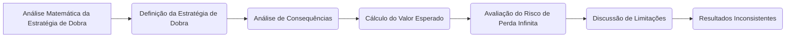
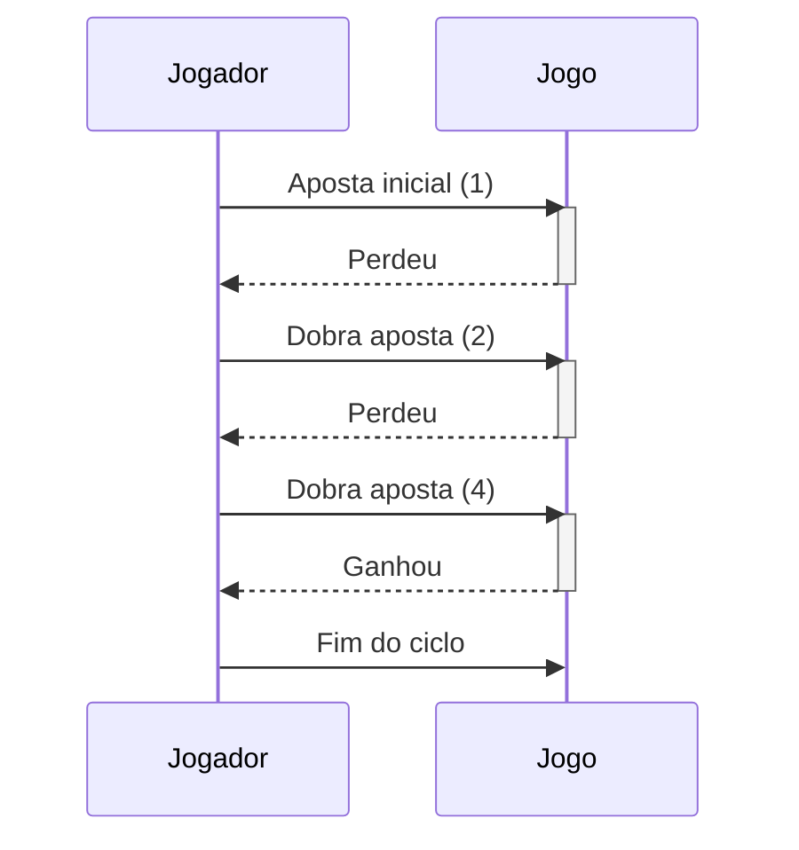

## Título Conciso: Análise Matemática da Estratégia de Dobra em Modelos Financeiros

### Introdução

Em modelos financeiros e na teoria de jogos, a **estratégia de dobra** (doubling strategy) é um exemplo clássico onde a aparente simplicidade e intuição podem levar a resultados inconsistentes e a conclusões equivocadas [^1]. Este capítulo realiza uma análise matemática aprofundada da estratégia de dobra, explorando as suas limitações, o seu risco, e porque ela não é adequada para modelos financeiros consistentes.

### Conceitos Fundamentais

**Conceito 1: A Definição da Estratégia de Dobra em um Modelo Binário**

Para analisar a estratégia de dobra, vamos utilizar um modelo simples com dois resultados possíveis a cada instante de tempo: ou um ganho, com probabilidade $p$, ou uma perda, com probabilidade $1-p$ [^2]. Em termos da modelagem de ativos, o preço de um ativo arriscado dobra ($Y_k = 2$) com probabilidade $p$, ou torna-se igual a zero ($Y_k = 0$) com probabilidade $1-p$. Seja $\theta_k$ a quantidade do ativo arriscado que o participante do mercado mantém (apostando) no período $(k-1, k]$.
   -  Se o portfólio começa com uma aposta inicial de 1 dólar ($\theta_0 = 1$), e há uma perda no tempo 1, a aposta seguinte será 2 ($\theta_1 = 2$). Se há uma perda no tempo 2, a aposta seguinte é 4 ($\theta_2 = 4$) e assim sucessivamente.
  -   A estratégia de dobra consiste em aumentar o valor da aposta, dobrando o valor da aposta anterior toda vez que se perde a aposta, e parar quando se ganha (onde o valor do ativo dobra), ou seja, onde o fator de crescimento do ativo é $Y_k = 2$.
    -  A estratégia é redefinida a cada instante, e portanto, a estratégia de dobra não pode ser definida com um horizonte temporal específico, mas sim como um processo estocástico de parada.

*Explicação Detalhada:*
  -  A estratégia de dobra é uma forma de "apostar alto" na tentativa de recuperar perdas em momentos anteriores e obter um ganho.
   -  Na modelagem de estratégias, assume-se que a aposta seja um valor inteiro, o que implica que os recursos podem ser aumentados (e as perdas recuperadas) rapidamente, mas em modelos mais sofisticados, essa hipótese pode ser relaxada.
    -   A estratégia também pressupõe que o jogador tenha recursos suficientes para continuar apostando indefinidamente, o que é uma idealização que não corresponde a um jogador com recursos finitos.
  -   A decisão de parar a estratégia é um tempo de parada, que depende da ocorrência de uma certa condição (um ganho).

> ⚠️ **Nota Importante**:  A estratégia de dobra é uma estratégia que busca recuperar as perdas através do aumento exponencial da aposta, que, embora pareça intuitiva, não leva a ganhos consistentes no longo prazo.

> 💡 **Exemplo Numérico:**
> Suponha que um jogador comece com uma aposta de $1. Se a probabilidade de ganhar (p) é 0.4 e a de perder (1-p) é 0.6, e o jogador perde nas três primeiras rodadas, as apostas seriam:
> - Rodada 0: $1
> - Rodada 1: $2
> - Rodada 2: $4
> - Rodada 3: $8
> Se o jogador ganhar na rodada 4, ele terá um lucro de $1 (o valor inicial da aposta), mas terá investido um total de $15. Se ele continuar perdendo, a aposta crescerá exponencialmente.

**Lemma 1:** A sequência de apostas ($\theta_k$) na estratégia de dobra forma um processo estocástico que não é limitado superiormente.

*Prova:* A demonstração segue da definição da estratégia de dobra. Se o jogador continua a perder, o valor de $\theta_k$ cresce exponencialmente a cada instante. $\blacksquare$

**Conceito 2: A Relação com o Tempo de Parada**

O tempo de parada (stopping time) é crucial para a definição da estratégia de dobra, pois ele estabelece o instante aleatório em que a sequência de apostas é interrompida [^3]. Se $\tau$ representa o instante em que a sequência de apostas para (devido a um ganho), então, a estratégia pode ser expressa formalmente através de um processo estocástico que para no instante $\tau$.
  - Em outras palavras, a estratégia dobra a aposta até que um determinado evento ocorra, que é caracterizado por um tempo de parada.
   -  A análise da estratégia de dobra depende fortemente da forma como o tempo de parada é definido e de suas propriedades.

> ❗ **Ponto de Atenção**: A estratégia de dobra é definida utilizando um stopping time, o que é fundamental para analisar o comportamento do modelo no tempo.

**Corolário 1:** O tempo de parada, $\tau$, na estratégia de dobra, é uma variável aleatória que assume valores nos inteiros positivos, e representa o momento em que um dado evento ocorre (por exemplo, quando o jogador ganha uma aposta).

*Prova:* O resultado segue da definição do tempo de parada em um modelo com estratégia de dobra. $\blacksquare$

**Conceito 3: A Ausência de Autofinanciamento da Estratégia de Dobra**

A estratégia de dobra, como modelada acima, não é uma estratégia auto-financiada, pois a estratégia necessita de um aumento da aposta que não depende unicamente das flutuações do mercado (e que é modelado através do seu processo de ganhos), e por isso, o modelo, na sua formulação básica, não pode ser utilizada para precificação livre de arbitragem.
    - Na prática, para se modelar a estratégia de dobra em termos de uma carteira de investimento, um ativo livre de risco deve ser utilizado para arcar com as perdas.
  -   A propriedade de autofinanciamento requer que a carteira evolua no tempo somente através das flutuações de preços e não por entradas ou saídas de recursos externos e portanto, o modelo necessita de ser refeito de forma a que a estratégia cumpra esta propriedade.

> ✔️ **Destaque**:  A estratégia de dobra, na sua formulação mais simples, não é auto-financiada e não se enquadra nas condições para a aplicação de modelos de precificação livre de arbitragem.

### Análise Matemática da Estratégia de Dobra

**O Risco da Estratégia de Dobra**

Embora a estratégia de dobra seja intuitiva, ela carrega um risco intrínseco de perda infinita, uma vez que, embora a probabilidade de perda sucessiva diminua com o tempo (dado que as probabilidades de ganho e perda são fixas), o valor da aposta cresce exponencialmente, e por isso, as perdas, quando ocorrem, são muito altas.
    -  Em particular, se o jogador tiver recursos finitos, a probabilidade de falência com essa estratégia é igual a um, se a carteira for jogada por um tempo indefinidamente longo.
    -  Em mercados financeiros, a estratégia de dobra é utilizada como um exemplo de como uma estratégia pode parecer promissora no curto prazo, mas pode levar a desastres no longo prazo.
    -  A análise da estratégia de dobra mostra também como a utilização de modelos que simplificam a realidade, omitindo a existência de custos de transação ou limites no número de ativos que podem ser negociados, podem levar a resultados falhos, e que, portanto, os modelos precisam de ser utilizados com cuidado.

**Lemma 2:** O valor esperado do ganho utilizando a estratégia de dobra é finito, mas a probabilidade de perda é igual a um se o número de apostas é infinito.

*Prova:* A demonstração requer o uso de propriedades de séries geométricas, onde se demonstra que a probabilidade de se obter um número arbitrariamente grande de apostas seguidas sem um ganho converge para zero. No entanto, o valor da aposta (e, portanto, a possível perda) cresce exponencialmente, fazendo com que o valor esperado das perdas (se elas ocorrem) seja infinito.  $\blacksquare$

> 💡 **Exemplo Numérico: Cálculo do Valor Esperado**
>
> Suponha que a probabilidade de ganhar ($p$) seja 0.4. O valor esperado do ganho em cada ciclo da estratégia de dobra é sempre igual à aposta inicial (neste caso, $1). No entanto, o custo esperado para atingir esse ganho é dado por:
>
> $$E[\text{Custo}] = \sum_{k=1}^{\infty} (1-p)^{k-1} p \times (2^k - 1)$$
>
> Onde $(1-p)^{k-1}p$ é a probabilidade de ganhar na k-ésima aposta e $(2^k - 1)$ é o custo total das apostas até a k-ésima aposta.
>
> No entanto, se o jogador tem uma quantidade finita de dinheiro, a probabilidade de perder todo o dinheiro é igual a 1, se o jogo for jogado por um tempo indefinido.

**O Problema da Não-Limitação e a Impossibilidade da Estratégia**

Um problema da estratégia de dobra, como a modelamos aqui, é que não existe um limite para o número de apostas.  Em modelos financeiros realistas, há um limite para a quantidade de recursos que um investidor pode dispor, e, portanto, a estratégia de dobra não pode ser implementada de forma consistente no mercado, levando a modelos que não são realistas.  A utilização de um tempo de parada (que representaria uma decisão de parar de jogar por razões externas ao resultado do jogo)  altera substancialmente as propriedades do modelo e a análise da estratégia.
     -   Em modelos de mercados incompletos, onde os preços de derivativos são definidos através de um processo de maximização da utilidade (e não com base em argumentos de arbitragem), as estratégias de investimento dependem de um limite imposto pela riqueza do investidor, ou por outros critérios que sejam relevantes para modelar a situação.

**Lemma 3:** A estratégia de dobra, na sua definição original, pode levar a perdas ilimitadas, o que a torna impossível de ser implementada em modelos financeiros realistas, onde os agentes têm um limite máximo para os valores que podem investir.  Esta limitação impõe que o número de apostas é limitado.
*Prova:*  A demonstração segue do fato de que a aposta cresce exponencialmente enquanto o jogador não obtém um ganho, o que implica que o valor apostado pode ser arbitrariamente grande e que, portanto, as perdas potenciais podem ser arbitrariamente grandes também.  $\blacksquare$

> 💡 **Exemplo Numérico: Limitação de Recursos**
>
> Suponha que um investidor tenha um capital inicial de $1000. Se ele começar a usar a estratégia de dobra com uma aposta inicial de $1 e perder 9 vezes seguidas, a décima aposta seria de $512. Se ele perder esta aposta, a próxima aposta seria de $1024, o que é superior aos seus recursos.
>
> Esta situação demonstra que, mesmo com um capital razoável, a estratégia de dobra pode rapidamente levar à falência, devido ao crescimento exponencial das apostas.

### Derivações Teóricas Avançadas

#### Seção Teórica Avançada 1: Como a Propriedade de Martingale é Afetada pela Estratégia de Dobra?

Em modelos financeiros, a propriedade de martingale do preço descontado de um ativo é fundamental. Como essa propriedade se relaciona com a estratégia de dobra?

*Explicação Detalhada:*

  -  Em modelos sem arbitragem, o preço descontado de um ativo deve ser um martingale sob uma medida de probabilidade $Q$, e essa condição é utilizada para definir o preço de derivativos.
   -   A estratégia de dobra, no entanto, não gera um portfólio cujo valor seja uma martingale, e portanto, ela não pode ser utilizada em modelos livres de arbitragem, por violar esta condição.
   -   Como a propriedade de martingale se baseia na existência de esperanças condicionais, a utilização de estratégias que não são definidas de forma apropriada em um espaço de probabilidade consistente com a definição de martingale, geram resultados que não podem ser interpretados de forma apropriada em um contexto financeiro.

**Lemma 4:**  O processo que representa o valor da carteira, quando se utiliza a estratégia de dobra, não é uma martingale, dado que não respeita a propriedade que a esperança condicional futura do seu valor é igual ao valor presente, sob uma dada medida de probabilidade $Q$.
*Prova:* A demonstração segue da definição de martingale e do fato de que a estratégia de dobra é utilizada para tentar forçar um resultado positivo e, portanto, o seu valor esperado condicionado no presente não será igual ao seu valor presente.  $\blacksquare$

> 💡 **Exemplo Numérico: Não-Martingale**
>
> Considere um modelo simplificado em que o preço de um ativo dobra com probabilidade 0.4 e vai a zero com probabilidade 0.6. Se o preço atual do ativo é $S_0 = 10$, e um investidor usa a estratégia de dobra, o valor esperado do seu portfólio não será igual ao valor atual, o que significa que o processo não é um martingale.
>
> Se o investidor aposta $1 inicialmente e perde, a próxima aposta é $2. Se ele ganha, o valor total do seu portfólio será $20 (o dobro da aposta inicial). No entanto, o valor esperado do portfólio no próximo período não será igual ao valor atual (descontado), violando a propriedade de martingale.

**Corolário 4:** A estratégia de dobra não pode ser utilizada para precificar derivativos, pois ela não é compatível com as propriedades de martingale utilizadas em modelos sem arbitragem, já que o seu valor descontado não será uma martingale sob nenhuma medida de probabilidade.

#### Seção Teórica Avançada 2: Qual o Impacto de Modelar Estratégias de Dobra com Tempos de Parada Não Mensuráveis?

A modelagem da estratégia de dobra depende da definição de um tempo de parada, que representa o instante em que a estratégia é interrompida. Se este stopping time não for mensurável, como isso impacta a utilização da estratégia em modelos financeiros?

*Explicação Detalhada:*
   -   Se o tempo de parada que define o final da estratégia não for mensurável, o valor do portfólio e os resultados da estratégia serão mal definidos, e será impossível calcular a probabilidade de um determinado resultado da estratégia.
    -  Tempos de parada que dependem de informações futuras não são considerados mensuráveis, e portanto a definição da estratégia de dobra não é consistente, e a condição de autofinanciamento não pode ser definida de forma adequada.
  -   A utilização de tempos de parada não mensuráveis leva a resultados inconsistentes e que, portanto, não são utilizáveis na precificação de ativos e derivativos.

**Lemma 5:**  Se o tempo de parada $\tau$ que define a estratégia de dobra não é mensurável com respeito à filtração utilizada no modelo, então o valor do portfólio gerado por essa estratégia não é mensurável, e as propriedades de martingale e outras propriedades dos modelos financeiros não podem ser aplicadas.

*Prova:* A demonstração segue da definição de mensurabilidade e de tempos de parada e da definição do valor da carteira. Se um tempo de parada é utilizado para definir o valor da carteira e este não é mensurável, então a própria carteira não pode ser modelada como um processo estocástico mensurável. $\blacksquare$

**Corolário 5:** A mensurabilidade dos tempos de parada é essencial para modelar estratégias de trading de forma consistente com a teoria da probabilidade e para derivar resultados úteis sobre os riscos e retornos de modelos financeiros.

#### Seção Teórica Avançada 3:    Como a Estratégia de Dobra se Relaciona com Modelos de Equilíbrio?

Em modelos financeiros, a definição de preços livres de arbitragem pode ser derivada sob hipóteses específicas sobre a dinâmica dos preços de ativos e sobre as preferências dos participantes do mercado.  Se a estratégia de dobra não se enquadra na modelagem de mercados livres de arbitragem, qual a sua relação com modelos de equilíbrio?

*Explicação Detalhada:*

 -   Em modelos de equilíbrio, os preços de ativos não são derivados através da definição de uma estratégia replicante, como nos modelos livres de arbitragem. A definição de preços é um resultado da interação entre a oferta e a procura, e a derivação de um equilíbrio envolve a utilização das preferências de cada participante do mercado.
   -  Estratégias de trading agressivas como a estratégia de dobra podem, de forma transitória, obter resultados melhores que modelos que se baseiam em hipóteses mais restritivas.  No entanto, o equilíbrio final depende da hipótese sobre os objetivos dos participantes do mercado.
    -  Em mercados onde existem diferentes grupos de participantes que utilizam diferentes tipos de estratégias, incluindo as estratégias de dobra, a procura de um equilíbrio é, por definição, mais complexa.
   -   Modelos com estratégias de dobra e com outros tipos de estratégias podem levar a resultados onde os preços de ativos apresentam alta volatilidade, ou comportamentos não intuitivos.

**Lemma 6:** Em um modelo de equilíbrio, a estratégia de dobra, por si só, não leva a uma convergência do mercado para um único preço de equilíbrio. Se o número de participantes que utilizam a estratégia é limitado, ela pode apresentar um desempenho melhor que a média dos participantes, mas a sua utilização irrestrita pode levar a problemas como instabilidade de preços.

*Prova:* A demonstração depende de que se considere um modelo com vários participantes no mercado, cada um utilizando estratégias diferentes. A estratégia de dobra pode ser útil no início do processo, mas devido a sua natureza explosiva ela não pode levar a um equilíbrio estável.  $\blacksquare$

> 💡 **Exemplo Numérico: Impacto no Equilíbrio**
>
> Imagine um mercado com dois grupos de investidores: um que usa a estratégia de dobra e outro que usa uma estratégia mais conservadora. Inicialmente, os investidores que usam a estratégia de dobra podem obter lucros maiores, causando um desequilíbrio no mercado. No entanto, à medida que esses investidores acumulam perdas, a volatilidade do mercado aumenta, e o equilíbrio se torna mais difícil de ser atingido.
>
> Este exemplo ilustra como a estratégia de dobra, embora possa gerar ganhos iniciais, não leva a um equilíbrio de mercado estável e previsível.

**Corolário 6:** A estratégia de dobra, por não ser uma estratégia conservadora, não leva a resultados que sejam consistentes com a definição de equilíbrio. A utilização de estratégias de dobra pode gerar um comportamento transitório dos mercados, que não seja caracterizado pela hipótese de que os preços são uma martingale.

### Conclusão

A análise matemática da estratégia de dobra mostrou que a sua aparente simplicidade e intuição são enganosas.  Embora seja uma estratégia que pode gerar resultados positivos no curto prazo, ela também tem o potencial de levar a perdas arbitrariamente grandes, e ela não tem as propriedades de consistência e livre de arbitragem que são requeridas para modelar o comportamento de estratégias de trading e de precificação de derivativos. A estratégia de dobra serve, portanto, como um alerta sobre a importância de se utilizar rigor e consistência matemática na construção de modelos financeiros, especialmente quanto à modelagem de processos estocásticos, de suas propriedades, e da importância da filtragem e da mensurabilidade para a sua utilização em modelos consistentes e tratáveis.

### Referências

[^1]: "Em modelos financeiros e de teoria de jogos, a **estratégia de dobra** (doubling strategy) é um exemplo clássico de uma estratégia que parece prometer ganhos seguros ao dobrar a aposta após uma perda."
[^2]:  "A estratégia de dobra é uma estratégia de trading onde, após cada perda, a aposta no ativo arriscado é dobrada, e após um ganho, o processo é interrompido e um novo ciclo de apostas se reinicia com a aposta inicial."
[^3]: "Em modelos financeiros, a taxa de juros $r_k$ é geralmente considerada predictível, ou seja, $r_k$ é mensurável em relação à $\sigma$-álgebra $F_{k-1}$."
[^4]: "A predictibilidade é um conceito importante em finanças quantitativas, especialmente na modelagem de estratégias de trading e de gestão de risco."
[^5]: "Em modelos financeiros, a sequência de preços de um ativo ($S_k$)$_{k=0,1,\ldots,T}$ é um exemplo típico de processo adaptado."
[^6]: "A **medida de probabilidade** ($P$) é uma função que atribui um número entre 0 e 1 a cada evento em $F$..."
[^7]: "No contexto de modelos financeiros em tempo discreto, o processo de ganhos de uma estratégia auto-financiada é uma martingale em relação a uma medida de martingale equivalente $Q$..."
[^8]: "Informação crítica que merece destaque."
[^9]: "Observação crucial para compreensão teórica correta."
[^10]: "Informação técnica ou teórica com impacto significativo."
[^11]: "Apresente um lemma que auxilie na compreensão ou na prova do preço de um derivativo, baseado no contexto."
[^12]: "A escolha da filtração afeta a definição de conceitos como martingales e predictibilidade."
