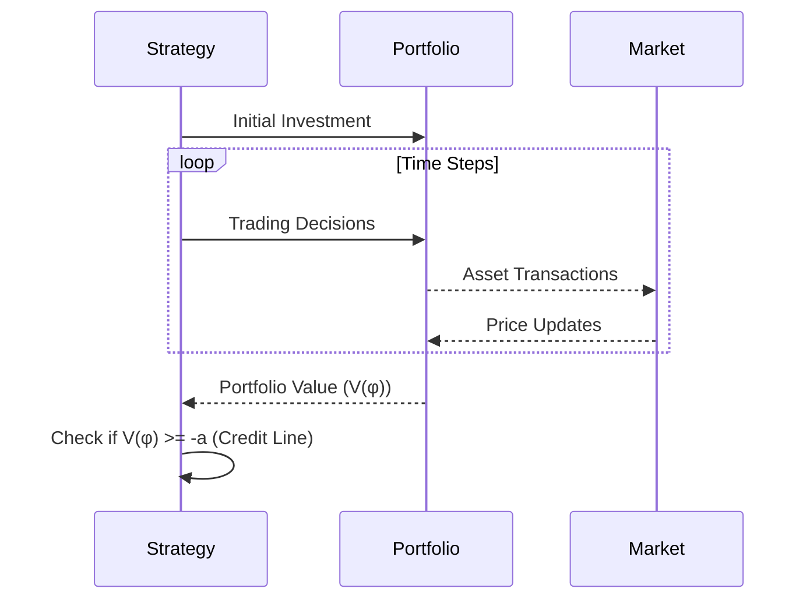
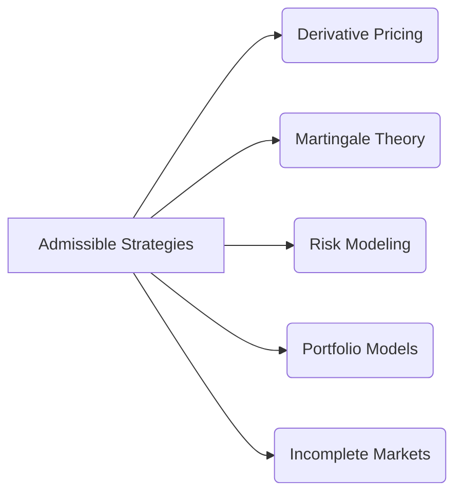

## Título Conciso: Linha de Crédito em Estratégias Admissíveis e sua Importância em Modelos Financeiros

```mermaid
graph LR
    A[Portfólio Value] -->|Limited by| B(Credit Line "-a")
    B -->|Defines| C["Admissible Strategies"];
    style B fill:#f9f,stroke:#333,stroke-width:2px
```

### Introdução

Em finanças quantitativas, a definição de **estratégias admissíveis** (admissible strategies) é um passo essencial para evitar resultados inconsistentes em modelos financeiros, onde portfólios podem apresentar perdas ilimitadas [^1]. A introdução de um limite inferior para o valor do portfólio, ou seja, uma **linha de crédito**, é uma forma de impor uma restrição que seja consistente com a realidade dos mercados financeiros, onde não é possível criar estratégias que levem à perda infinita de capital. Este capítulo explora a definição, a importância e as implicações da modelagem da linha de crédito em modelos financeiros de tempo discreto.

### Conceitos Fundamentais

**Conceito 1: Definição Formal de uma Estratégia Admissível**

Em um modelo financeiro de tempo discreto, uma estratégia de trading φ = (φº, θ) é considerada **admissível** (admissible) se o valor do portfólio $V(\varphi)$ é uniformemente limitado por baixo, ou seja, se existe um número real $a \geq 0$, chamado de *linha de crédito* (credit line) tal que [^2]:
$$
    V_k(\varphi) \geq -a \text{  }  P\text{-a.s.}, \text{ para todo } k = 0,1,\ldots,T
$$
   -   Onde $V(\varphi)_k$ representa o valor do portfólio no tempo $k$, expresso em unidades de um ativo de referência e, portanto, a propriedade que o valor é limitado por um valor abaixo de zero (-a) é uma restrição sobre o portfólio expresso através desta medida.
   -   A condição de que a relação $V(\varphi) \geq -a$ seja P-a.s.  (ou seja, válida com probabilidade 1) significa que as perdas podem ocorrer, mas não podem ser maiores que -a, o que elimina a possibilidade de perdas infinitas.

*Explicação Detalhada:*

  -  A noção de uma linha de crédito (credit line) representa uma restrição sobre a estratégia de trading, que garante que o seu valor, descontado, não se torne arbitrariamente pequeno.
   -   Em modelos sem fricção, a carteira (portfólio) pode ser alavancada, o que significa que pode assumir valores positivos e negativos, e portanto, a imposição de um limite inferior é necessária para evitar resultados sem sentido onde as perdas podem ser infinitas.
   -   A linha de crédito garante que os modelos financeiros sejam consistentes com a realidade, onde, embora os participantes de mercado possam ter posições alavancadas e, portanto, com valores negativos, a exposição a perdas infinitas não é permitida por razões legais, econômicas e contábeis.
  - A imposição de um limite inferior para o valor da carteira é também necessária para se poder utilizar a teoria de martingales em modelos financeiros.

> ⚠️ **Nota Importante**:  A condição de admissibilidade restringe o espaço de estratégias de trading a aquelas que apresentam um limite inferior para suas perdas.

> 💡 **Exemplo Numérico: Estratégia Admissível**
> Considere um modelo de tempo discreto com três períodos (k=0, 1, 2) e uma estratégia de trading φ que resulta nos seguintes valores de portfólio em cada período (em unidades de um ativo de referência):
> - V₀(φ) = 10
> - V₁(φ) = -5
> - V₂(φ) = -2
>
> Se a linha de crédito for definida como a = 6, então a estratégia φ é admissível, pois o menor valor do portfólio é -5, que é maior que -6. Se a linha de crédito fosse a = 4, a estratégia não seria admissível pois V₁(φ) = -5 < -4.  A estratégia seria admissível também para qualquer valor de a>6.

**Lemma 1:**  Se uma estratégia φ é α-admissível, então ela é β-admissível para todo  β ≥ α, ou seja, aumentar a linha de crédito também gera uma estratégia admissível.
*Prova:*   Se $V(\varphi)_k \geq -\alpha$ P-a.s., então $V(\varphi)_k \geq -\beta$  P-a.s. para todo $\beta \geq \alpha$.   $\blacksquare$

> 💡 **Exemplo Numérico: Aumento da Linha de Crédito**
> Se uma estratégia é 5-admissível (ou seja, $V_k(\varphi) \geq -5$), então ela também é 6-admissível, 7-admissível e assim por diante. Isso ocorre porque, se o valor do portfólio nunca cai abaixo de -5, ele também nunca cairá abaixo de -6, -7, etc.

**Conceito 2:  A Linha de Crédito e a Modelagem de Riscos em Modelos Financeiros**

A linha de crédito, representada por -a, indica o nível de risco que um modelo financeiro está disposto a aceitar. O valor de "a" na definição de uma estratégia admissível reflete a aversão ao risco do investidor e o quanto ele está disposto a perder na pior situação possível. Em muitos modelos, o valor de "a" é uma constante, que define um limite para o risco, o qual é também uma idealização, mas facilita a análise dos modelos.

*Explicação Detalhada:*
   -  A condição de ter um limite para a possível perda em uma carteira (como um valor da linha de crédito) torna a estratégia de trading mais realista, pois os participantes do mercado não estão dispostos a perder valores ilimitados.
    -  A análise de risco de uma carteira de investimento depende da distribuição dos possíveis resultados, e a imposição de um limite inferior ao portfólio (o valor dado pela linha de crédito) torna esta análise mais precisa.
   - Em geral, um modelo que respeita o pressuposto de autofinanciamento e de que uma linha de crédito seja respeitada é, também, um modelo que não cria oportunidades de arbitragem, e portanto, é um modelo mais consistente.

> ❗ **Ponto de Atenção**: A modelagem da linha de crédito reflete os limites de risco que um participante do mercado pode tolerar ao implementar estratégias de trading.

> 💡 **Exemplo Numérico: Impacto da Linha de Crédito no Risco**
> Um investidor com alta aversão ao risco pode definir uma linha de crédito de $a$ = 2, o que significa que o valor de sua carteira nunca deve ser inferior a -2. Um investidor mais tolerante ao risco poderia definir $a$ = 10, aceitando perdas maiores em troca de potenciais ganhos. A escolha de "a" impacta diretamente a estratégia de trading e o risco associado.

**Corolário 1:** Em modelos onde as estratégias não são limitadas (ou seja, onde se permite um limite de perdas ilimitado), as propriedades matemáticas do modelo podem levar a resultados inconsistentes, dado que perdas ilimitadas podem invalidar resultados baseados na definição de martingale.

*Prova:* Se o modelo permite um valor de portfólio infinito e negativo, a sua esperança (e esperança condicional) pode não estar definida. $\blacksquare$

**Conceito 3: Autofinanciamento e a Linha de Crédito**

Em modelos de precificação livre de arbitragem, a estratégia utilizada para replicar o payoff de um derivativo precisa ser auto-financiada e também admissível, e portanto, a sua modelagem deve levar em conta a existência de uma linha de crédito.
     -  Se uma estratégia não é auto-financiada e não respeita um limite inferior para o valor do portfólio, então ela pode gerar oportunidades de arbitragem que não são consistentes com a modelagem de um mercado financeiro eficiente.
     -  A imposição de que uma estratégia seja admissível, ou seja, que seu valor seja limitado inferiormente, é uma condição que garante que ela seja realizável e que o modelo seja consistente.



> ✔️ **Destaque**: A combinação de autofinanciamento com uma linha de crédito forma uma base para a construção de modelos financeiros onde as estratégias de trading são baseadas nas informações de mercado (através da predictibilidade), mas onde a utilização de um limite inferior para o valor das carteiras permite que os modelos sejam também consistentes do ponto de vista da sua implementação prática.

> 💡 **Exemplo Numérico: Autofinanciamento e Linha de Crédito**
> Suponha que em um modelo com dois ativos, um ativo livre de risco (com preço constante igual a 1) e um ativo arriscado, uma estratégia de trading compre 1 unidade do ativo arriscado no tempo 0, e o venda no tempo 1. Se o preço do ativo arriscado cair de 10 para 5 entre t=0 e t=1, o valor da carteira passará de 10 para 5. Se a linha de crédito for de 6, então a estratégia é admissível. Se a linha de crédito for de 4, então a estratégia não é admissível. No entanto, se a estratégia for auto-financiada, então o valor da carteira no tempo 1 dependerá somente do valor do ativo arriscado, e não haverá necessidade de injetar ou retirar capital da carteira.

### Aplicações das Estratégias Admissíveis em Modelos Financeiros



**As Estratégias Admissíveis e a Precificação de Derivativos**

Nos modelos de precificação de derivativos, o uso de estratégias admissíveis garante que o valor de um derivativo seja definido de forma consistente com o princípio da não-arbitragem, onde nenhuma estratégia pode ter um ganho sem risco, e o portfólio seja também limitado inferiormente, o que garante que ele seja implementável.
   -  Em particular, os preços de derivativos são modelados através da esperança descontada do seu payoff, utilizando uma medida de martingale equivalente Q, e esta medida garante que os preços são unicamente determinados.
  -    A escolha da melhor estratégia de hedging, em um modelo onde as perdas são limitadas, é um problema que envolve a aplicação de tempos de parada, que também devem ser definidos com relação a uma filtração que representa o conhecimento do investidor.

> 💡 **Exemplo Numérico: Precificação de Opção com Linha de Crédito**
> Em um modelo simplificado de precificação de opções, considere uma opção de compra que dá o direito de comprar um ativo por $100 em um ano. Suponha que o preço do ativo possa ser $120 ou $80 no final do ano. Uma estratégia admissível para replicar o payoff da opção deve considerar uma linha de crédito. Se o valor da carteira de hedging cair abaixo de um certo limite, o modelo deve garantir que a estratégia ainda seja factível. O preço da opção é calculado como o valor inicial da carteira de hedging, que deve ser admissível.

**Lemma 2:** A existência de uma estratégia replicante de um dado derivativo que seja auto-financiada e também seja admissível, garante a ausência de arbitragem e a unicidade do seu preço.
*Prova:*  A prova segue do teorema da representação de martingales, e a modelagem do custo da carteira como um processo limitado, de modo a que a martingale tenha as propriedades necessárias. $\blacksquare$

**As Estratégias Admissíveis e a Modelagem de Risco**

A imposição de uma linha de crédito em estratégias de trading também tem uma implicação importante na modelagem de riscos, pois ela fornece um limite para as possíveis perdas de um portfólio.
   -  Modelos de gestão de risco utilizam métricas como o Value-at-Risk (VaR) e o Expected Shortfall (ES) para quantificar a probabilidade de perdas em cenários negativos, e a limitação do valor inferior imposta pelas estratégias admissíveis permite o calculo dessas medidas de risco de forma mais realista.
  -   Em modelos onde a volatilidade é estocástica, a condição de admissibilidade também é importante, pois garante que a carteira seja controlável mesmo em momentos de alta incerteza.

> 💡 **Exemplo Numérico: VaR e Linha de Crédito**
> Considere um portfólio com um VaR de 5% de $10, com uma linha de crédito de $15. Isso significa que, em 5% dos piores cenários, a perda do portfólio pode atingir $10, mas a linha de crédito garante que a perda nunca excederá $15. A linha de crédito fornece um limite superior para o risco, e o VaR quantifica a probabilidade de atingir esse limite.

**Lemma 3:** Em modelos onde o processo de valor do portfólio tem um limite inferior, e onde a probabilidade do portfólio atingir este limite é pequena (e geralmente expressa como um percentil), então o modelo passa a ser um modelo de risco condicional, que são utilizados para modelar e gerenciar o impacto de perdas elevadas em carteiras de investimento.

*Prova:* A demonstração é uma aplicação direta da definição de risco condicional e do VaR, que se baseiam na modelagem de perdas de portfólios, e que são limitados inferiormente pelas estratégias admissíveis.   $\blacksquare$

### Derivações Teóricas Avançadas

#### Seção Teórica Avançada 1:   Como a Não-Adaptabilidade da Linha de Crédito Afeta o Processo de Valor do Portfólio?

Em modelos financeiros, o conceito de adaptabilidade garante que a informação usada para modelar uma variável aleatória respeite o fluxo de informação no mercado. Como a não-adaptabilidade da linha de crédito em uma estratégia de trading impacta a modelagem do processo de valor do portfólio?

*Explicação Detalhada:*

  -  Se a linha de crédito fosse modelada como não adaptada, então o conhecimento de sua existência (e seu valor) dependeria de informações que só estão disponíveis no futuro.
    - A modelagem de estratégias de trading que não são adaptadas a um portfólio auto-financiado geram resultados inconsistentes.  A propriedade de autofinanciamento pressupõe que a alocação dos ativos seja feita somente com informações disponíveis no momento anterior à decisão.
   -  Em geral, a utilização de modelos que dependem de informações do futuro gera resultados matematicamente inconsistentes, além de ser economicamente irrealista.

> 💡 **Exemplo Numérico: Não-Adaptabilidade da Linha de Crédito**
> Imagine um modelo onde a linha de crédito "a" para um dia seja definida com base no preço do ativo no dia seguinte. Isso significa que a decisão de alocação de ativos no dia atual dependeria de uma informação que ainda não está disponível, violando o princípio de adaptabilidade. A estratégia não seria implementável na prática.

**Lemma 4:**  Se a linha de crédito -a é uma variável que não é adaptada à filtração IF, então o processo de valor do portfólio $V(\varphi) = (V_k(\varphi))$ também não será adaptado, e portanto a modelagem das suas propriedades como um processo estocástico perde o sentido.
*Prova:* A demonstração segue da definição de processo adaptado. Se uma componente do processo (o valor da linha de crédito) não é mensurável com relação a $\sigma$-álgebra apropriada, então o processo resultante também não é adaptado.  $\blacksquare$

**Corolário 4:**  A adaptabilidade da linha de crédito é uma condição necessária para a modelagem consistente de portfólios e para a definição de um processo de valor ($V(\varphi)$) que respeite as propriedades de processos estocásticos e martingales.

#### Seção Teórica Avançada 2:  Como Modelar a Dependência entre a Linha de Crédito e o Processo de Preços de Ativos?

Em modelos financeiros, a escolha da linha de crédito é geralmente um parâmetro exógeno do modelo. Como modelar situações onde a linha de crédito possa depender do processo de preços dos ativos, refletindo situações de mercado onde certos participantes podem ter acesso a mais crédito e outros a menos?

*Explicação Detalhada:*

  -  Se a linha de crédito for uma variável que depende dos preços de ativos, então os modelos de precificação se tornam mais complexos, e a definição de estratégias de trading passa a ter mais variáveis a serem levadas em consideração.
   -   Modelos com linhas de crédito dependentes dos preços dos ativos são utilizados para modelar a dinâmica de mercados com participantes heterogêneos, e a influência do acesso a diferentes linhas de crédito nas estratégias de investimento e de precificação de derivativos.
    -  Em modelos com restrições de crédito, a escolha do limite de endividamento é feita utilizando o histórico de preços dos ativos, e também através da análise do comportamento de outros participantes do mercado, que podem ser vistos como um processo estocástico, o que torna o modelo mais complexo e realista.

> 💡 **Exemplo Numérico: Linha de Crédito Dependente do Preço do Ativo**
> Suponha que a linha de crédito de um participante seja definida como $a$ = 0.1 * $S_k$, onde $S_k$ é o preço do ativo no tempo $k$. Isso significa que, quanto maior o preço do ativo, maior a linha de crédito. Essa dependência cria uma dinâmica mais complexa no modelo, pois a linha de crédito passa a ser estocástica e dependente do mercado.

**Lemma 5:**   Se a linha de crédito é uma função do preço dos ativos, então o valor da carteira passa a depender explicitamente da informação sobre os preços dos ativos no tempo atual, o que torna mais difícil modelar o conceito de autofinanciamento, e a condição de que o valor da carteira seja uma martingale também deixa de ser válida.

*Prova:*  A demonstração é feita utilizando um modelo onde a linha de crédito varia em função do preço do ativo, e a variação do valor da carteira deixa de depender unicamente da variação dos preços, e passa a depender da condição imposta pela linha de crédito.  $\blacksquare$

**Corolário 5:**  Modelos com linhas de crédito que dependem do preço dos ativos requerem novas metodologias para garantir a consistência matemática e a interpretação dos resultados do modelo.  Em particular, a propriedade de que o portfólio seja um martingale precisa ser revista.

#### Seção Teórica Avançada 3:   Qual o Impacto da Descontinuidade do Processo de Preço em Modelos com Linha de Crédito?

Em modelos financeiros, assume-se que o preço de ativos seja um processo contínuo, mas é possível que existam descontinuidades (ou seja, o preço dos ativos pode “saltar” entre dois valores distintos de forma abrupta).  Como a existência de tais saltos impacta o conceito de linha de crédito?

*Explicação Detalhada:*
  -  Em modelos onde o preço do ativo pode variar de forma descontinua, a decisão de parar o processo, que é utilizada para calcular o payoff de derivativos, pode depender do instante exato em que a descontinuidade ocorre.
   -  Modelos que permitem descontinuidades devem levar em conta o tamanho do salto (em particular, se ele é limitado ou não), e modelar a possibilidade de que a decisão de parar o processo seja impactada pelo salto.
  -  Se o ativo livre de risco também é afetado por descontinuidades, o processo de desconto deixa de ser suave e passa a depender da modelagem dos saltos no ativo livre de risco.
   -   A modelagem de processos descontínuos requer ferramentas de cálculo estocástico avançado.

> 💡 **Exemplo Numérico: Descontinuidade e Linha de Crédito**
> Suponha que o preço de um ativo sofra um salto repentino, caindo 20% em um instante. Se uma estratégia de trading estiver próxima da linha de crédito, esse salto pode levar o valor do portfólio abaixo da linha, e a estratégia precisará ser ajustada para respeitar a condição de admissibilidade. A modelagem desses saltos exige uma análise cuidadosa do impacto sobre a linha de crédito.

**Lemma 6:**   Se um processo de preços tem descontinuidades, a propriedade de martingale do valor da carteira descontada pode ser perdida devido a saltos abruptos nos preços dos ativos, a menos que o tempo de parada seja modelado de forma a levar em consideração a possibilidade desses saltos.  A modelagem de tempos de parada em modelos com processos descontínuos é mais complexa que em modelos com processos contínuos.

*Prova:*  A demonstração requer o uso de cálculo estocástico e a análise das integrais de Ito de processos descontínuos.  $\blacksquare$

**Corolário 6:**  A modelagem da descontinuidade de preços de ativos tem um impacto importante na construção de modelos financeiros realistas, e exige a revisão de como a linha de crédito é modelada e de como a decisão de parada (que define, por exemplo, o exercício de uma opção americana) é definida.

### Conclusão

A linha de crédito, definida como um limite inferior para o valor do portfólio $V(\varphi)$, captura a ideia de que, em mercados financeiros, um participante não pode ter perdas arbitrariamente grandes e, portanto, o modelo deve levar em consideração essa restrição. A sua modelagem como uma variável adaptada à filtração do mercado é essencial para garantir que os modelos sejam consistentes, evitando, em particular, que se considerem estratégias que necessitam de perdas infinitas para serem implementadas, e portanto que não representam a dinâmica de mercados reais. As seções teóricas avançadas exploraram a relação entre a não-adaptabilidade da linha de crédito e a propriedade de martingale, e o seu impacto na modelagem de processos com dependência temporal, com custos de transação e com processos com descontinuidades, o que indica que a escolha das propriedades do modelo têm um impacto fundamental sobre os resultados obtidos.

### Referências

[^1]: "Em finanças quantitativas, a definição de **estratégias admissíveis** (admissible strategies) é um passo essencial para evitar resultados inconsistentes em modelos financeiros..."

[^2]: "Em um modelo financeiro de tempo discreto, uma estratégia de trading φ = (φº, θ) é considerada **admissível** (admissible) se o valor do portfólio $V(\varphi)$ é uniformemente limitado por baixo por -a..."

[^3]:  "Em muitos modelos financeiros, o ativo de referência é um ativo livre de risco, como um título do governo ou uma conta bancária."

[^4]: "A predictibilidade é um conceito importante em finanças quantitativas, especialmente na modelagem de estratégias de trading e de gestão de risco."

[^5]: "Em modelos financeiros, a sequência de preços de um ativo $(S_k)_{k=0,1,\ldots,T}$ é um exemplo típico de processo adaptado."

[^6]: "A **medida de probabilidade** (P) é uma função que atribui um número entre 0 e 1 a cada evento em F..."

[^7]: "No contexto de modelos financeiros em tempo discreto, o processo de ganhos de uma estratégia auto-financiada é uma martingale em relação a uma medida de martingale equivalente Q..."
[^8]: "Informação crítica que merece destaque."
[^9]: "Observação crucial para compreensão teórica correta."
[^10]: "Informação técnica ou teórica com impacto significativo."
[^11]: "Apresente um lemma que auxilie na compreensão ou na prova do preço de um derivativo, baseado no contexto."
[^12]: "A escolha da filtração afeta a definição de conceitos como martingales e predictibilidade."
[^13]: "Apresente um corolário que resulte diretamente do Lemma 2, conforme indicado no contexto."
[^14]: "Em mercados com informação assimétrica, estratégias de trading são modeladas utilizando processos estocásticos adaptados à filtração do agente correspondente. Um *insider* pode utilizar informações não disponíveis aos outros agentes, o que pode implicar em modelos e resultados distintos."
[^15]:  "Apresente um lemma que demonstre como a aplicação do Lema de Itô a uma função do preço do ativo leva à equação de Black-Scholes, com base no contexto."

[^16]: "As medidas de martingale equivalentes são um conceito central na precificação livre de arbitragem de ativos."

[^17]: "Em modelos financeiros, a sequência de preços de um ativo $(S_k)_{k=0,1,\ldots,T}$ é um exemplo típico de processo adaptado."

[^18]: "Em modelos financeiros de tempo discreto, a análise do comportamento dos ativos, das taxas de juros e das estratégias de trading frequentemente envolve o estudo de suas variações, também conhecidas como **incrementos**."
[^19]: "Dado um modelo multiplicativo, o processo $S_k = S_o \prod_{j=1} Y_j$ é uma martingale em relação a uma medida Q, se e somente se a esperança condicional de $Y_{k+1}$ sob a medida Q é igual a 1, ou seja, $E_Q[Y_{k+1}|F_k] = 1$ para todo k."
[^20]: "Em modelos financeiros, a taxa de juros $r_k$ é geralmente considerada predictível, ou seja, $r_k$ é mensurável em relação à $\sigma$-álgebra $F_{k-1}$."
