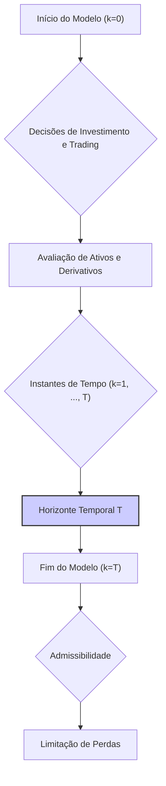
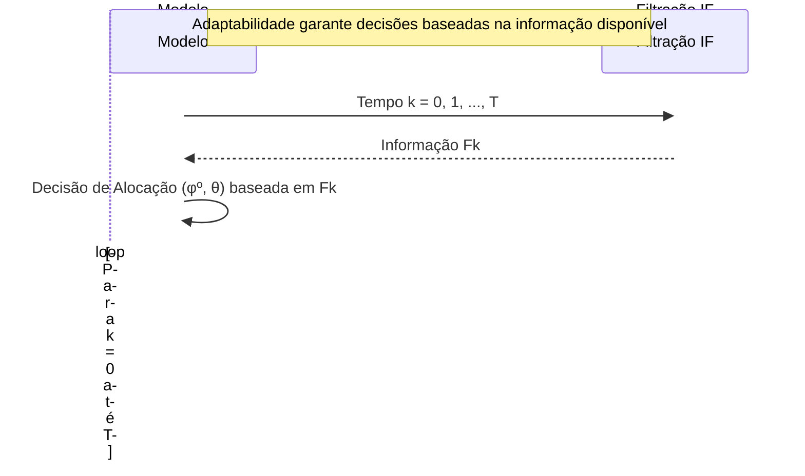
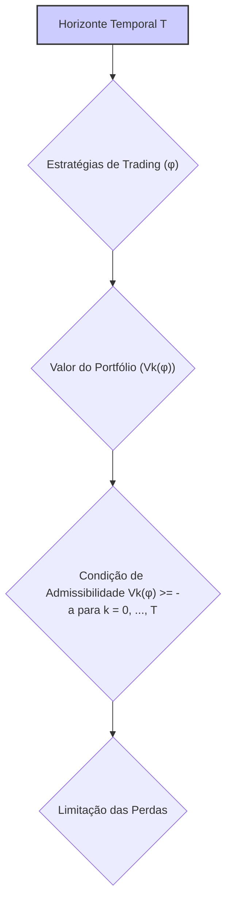

## Título Conciso: Horizonte Temporal e Admissibilidade em Modelos Financeiros

### Introdução

Em modelos financeiros de tempo discreto, o **horizonte temporal** (time horizon) $T$ define o período em que as decisões de investimento e trading são tomadas e a duração dos instrumentos financeiros (ativos e derivativos) são avaliados. A condição de **admissibilidade** de estratégias de trading impõe um limite para as perdas das carteiras de investimento e, por isso mesmo, essa propriedade deve ser analisada em relação ao horizonte temporal, uma vez que as propriedades de uma estratégia podem mudar dependendo da duração do seu período de atuação. Este capítulo explora a relação entre o horizonte temporal, a admissibilidade de estratégias, e suas implicações em modelos financeiros.

### Conceitos Fundamentais

**Conceito 1: Definição de Horizonte Temporal (T) em Modelos Financeiros**

O **horizonte temporal** (time horizon), denotado por $T$, representa o tempo final de um modelo financeiro de tempo discreto [^1]. Em particular, define o período em que as variáveis e as operações no mercado são definidas e em que uma estratégia de trading ou um instrumento financeiro têm duração finita.
    -   O tempo é dividido em instantes discretos $k=0, 1, \ldots, T$, onde $T$ é um número inteiro que indica o instante final do modelo.
   -   O horizonte temporal pode ser determinado por fatores como a data de vencimento de um derivativo, a duração de um projeto de investimento, ou um período de tempo de uma análise de carteira.
   -    A escolha do horizonte temporal depende dos objetivos do modelo, da complexidade da análise, e do problema financeiro que está sendo modelado.
   -  Modelos financeiros com horizonte temporal infinito também podem ser criados, mas eles impõem condições adicionais sobre a convergência de processos e na validade das propriedades de martingale, e por essa razão, modelos de tempo discreto com horizonte finito $T$ são mais usuais.

*Explicação Detalhada:*

   -  O horizonte temporal é a base para a definição de um modelo de tempo discreto e define a duração da dinâmica de preços e as possíveis decisões de um modelo financeiro.
   -   A escolha de um horizonte temporal finito $T$ torna o modelo matematicamente mais simples e também reflete que as decisões no mundo real são tomadas num período finito de tempo e com um limite para as perdas.
  -  Modelos com horizonte temporal infinito são mais complexos de analisar, e modelos com horizonte temporal muito pequeno podem não capturar todos os aspectos relevantes do modelo.

> ⚠️ **Nota Importante**: O horizonte temporal ($T$) define o período em que o modelo financeiro é analisado, limitando a evolução dos processos e das estratégias de trading.

> 💡 **Exemplo Numérico:**
> Considere um modelo de investimento com horizonte temporal de 5 anos. Neste caso, $T$ = 5. O tempo é discretizado em anos, então $k$ = 0, 1, 2, 3, 4, 5, representando o início do investimento e o final de cada ano até o quinto ano. Todas as análises de desempenho e estratégias são válidas dentro desse período.

**Lemma 1:**  Em um modelo de tempo discreto com um horizonte temporal finito $T$, o número de instantes de tempo é um inteiro finito dado por $T+1$.
*Prova:* Pela definição de horizonte temporal, o tempo é modelado através da sequência de inteiros $(k=0, 1, \ldots, T)$. $\blacksquare$

> 💡 **Exemplo Numérico:**
> Se o horizonte temporal $T$ é 3, então temos 3 + 1 = 4 instantes de tempo: $k$=0, $k$=1, $k$=2 e $k$=3. Isso significa que temos quatro pontos distintos no tempo onde podemos observar ou tomar decisões no modelo.

**Conceito 2: A Relação entre Horizonte Temporal e Adaptabilidade**

A adaptabilidade de uma estratégia de trading ($\varphi = (\varphi^0, \theta)$) a uma filtração $\mathbb{F} = (F_k)_{k=0,1,\ldots,T}$ é definida com relação ao horizonte temporal $T$. A adaptabilidade de $\varphi^0$ e a predictibilidade de $\theta$ garantem que as decisões de alocação de ativos sejam baseadas unicamente na informação disponível até o instante do tempo $k$ (ou $k-1$)  e dentro do horizonte temporal.
     -   Um processo adaptado, $X = (X_k)_{k=0,1,\ldots,T}$, com respeito à filtração $\mathbb{F} = (F_k)_{k=0,1,\ldots,T}$ é caracterizado pelo fato que $X_k$ é $F_k$-mensurável para todo $k = 0, 1, \ldots, T$.
    -  A restrição de que $k$ seja limitado por $T$ significa que o modelo não considera decisões de trading em instantes de tempo que estejam fora do horizonte temporal do modelo.

> ❗ **Ponto de Atenção**: O horizonte temporal $T$ limita o período de atuação das estratégias, definindo um limite para a modelagem de decisões financeiras em tempo discreto.

> 💡 **Exemplo Numérico:**
> Suponha que em um modelo com $T$=2, temos um preço de ação $S$ que varia nos instantes $k$=0, 1, e 2, e que a alocação da carteira é decidida em cada instante de tempo. Se a ação $S$ é adaptada à filtração $\mathbb{F}$, então a decisão de alocação no instante $k$=1 ($\theta_1$) deve ser baseada apenas nas informações disponíveis em $F_1$, e não em informações futuras ($F_2$).

**Corolário 1:** Se uma estratégia de trading é adaptada a uma filtração $\mathbb{F}$ que tem um horizonte temporal $T$, então o valor do portfólio e os custos incrementais são também definidos com respeito a esse mesmo horizonte temporal.

*Prova:* O resultado segue da definição de adaptabilidade e de autofinanciamento: o valor de uma carteira num dado instante $k$ é dado, por definição, como a alocação de ativos com as informações até o instante $k$.  $\blacksquare$

> 💡 **Exemplo Numérico:**
> Considere um portfólio com um ativo arriscado e um ativo livre de risco. Se a estratégia de alocação é adaptada com um horizonte temporal $T$=3, o valor do portfólio em $k$=2 é calculado com base nas alocações e nos preços dos ativos até $k$=2. O custo incremental para mudar a alocação no instante $k$=2 também é calculado usando as informações até $k$=2.

**Conceito 3: A Relação entre Horizonte Temporal e Admissibilidade**

Em modelos financeiros, a admissibilidade é a condição que garante que o valor de um portfólio seja limitado inferiormente, evitando, portanto, perdas ilimitadas [^4].  A definição de admissibilidade é relativa ao horizonte temporal $T$, que garante que o valor seja limitado inferiormente até $T$ e não para sempre.
     - Em particular, uma estratégia é considerada admissível se existe um número $a > 0$, chamado de *credit line*, tal que
        $$V_k(\varphi) \ge -a , \text{ para todo } k = 0, 1, \ldots, T$$

*Explicação Detalhada:*
   -   O horizonte temporal $T$ define o instante final para que o modelo respeite a condição de admissibilidade.
    -  A condição de admissibilidade é necessária para que os modelos financeiros não gerem estratégias que, embora sejam teoricamente lucrativas, não possam ser implementadas na prática devido a perdas ilimitadas.

> ✔️ **Destaque**: O horizonte temporal ($T$) define o período de tempo para que a condição de admissibilidade seja válida.

> 💡 **Exemplo Numérico:**
> Suponha que uma estratégia de trading tem um horizonte temporal $T$=4 e uma linha de crédito $a$ = 10. Isso significa que o valor do portfólio $V_k(\varphi)$, em qualquer instante $k$ = 0, 1, 2, 3, ou 4, nunca pode ser inferior a -10. Essa condição garante que não teremos perdas ilimitadas dentro do período de análise.

### A Modelagem Financeira com Horizonte Temporal Finito e Estratégias Admissíveis

**O Papel do Horizonte Temporal em Modelos de Ativos e Derivativos**

Em modelos financeiros, o horizonte temporal $T$ é crucial para definir o escopo da modelagem e para especificar a data de vencimento de um derivativo ou a duração de um determinado contrato.
    -   A escolha do horizonte temporal tem um impacto na precisão e na complexidade dos modelos, e deve levar em consideração o tipo de estratégia ou do ativo que está sendo modelado.
    - Em modelos de precificação de derivativos, o horizonte temporal é o instante de vencimento da opção, e é também a base para o cálculo do valor do derivativo.
   -  Em modelos de carteira, o horizonte temporal representa o período em que a estratégia de investimento é válida.
    -  Em modelos de gestão de risco, o horizonte temporal representa o período em que as métricas de risco são válidas e em que as estratégias de hedge podem ser utilizadas.

> 💡 **Exemplo Numérico:**
> Para uma opção de compra com vencimento em 6 meses, o horizonte temporal $T$ é 0.5 (em anos). Em um modelo de carteira de investimento de longo prazo, o horizonte temporal pode ser de 10 anos ($T$=10). Em gestão de risco, um horizonte temporal comum para análise de VaR pode ser de 1 dia ($T$ = 1/252, considerando dias úteis em um ano).

**Lemma 2:**  Modelos financeiros com horizonte temporal finito $T$ consideram que todas as variáveis aleatórias são definidas em um espaço amostral limitado.
*Prova:*   Por definição, as variáveis aleatórias de um modelo financeiro com horizonte temporal $T$ são definidas no espaço amostral de todas as trajetórias possíveis (ou eventos) até o instante $T$. $\blacksquare$

**A Admissibilidade e a Limitação de Perdas em Modelos Financeiros**

A condição de admissibilidade impõe um limite para a quantidade de perdas que uma carteira pode ter no modelo, e portanto, remove estratégias de trading que podem levar a valores infinitamente negativos (ou que representem perdas que excedam um determinado valor).
    -   Em modelos sem fricção, a condição de admissibilidade é fundamental para garantir a consistência matemática dos modelos.
    -   Em modelos com fricção, a condição de admissibilidade pode ser utilizada para modelar como a aversão a risco afeta a definição de estratégias de trading.

> 💡 **Exemplo Numérico:**
> Uma estratégia de trading que permite que o valor do portfólio caia para -∞ não é admissível. A condição de admissibilidade garante que o valor do portfólio seja sempre maior ou igual a um valor mínimo (-a), o que impede que o modelo gere resultados sem sentido.

**Lemma 3:** A propriedade de admissibilidade garante que o modelo não tenha variáveis que podem gerar resultados sem sentido, como preços infinitamente negativos.
*Prova:*   A demonstração segue da definição de admissibilidade. Se o valor de um portfólio é limitado inferiormente, então ele não pode assumir valores infinitamente negativos.  $\blacksquare$

### Derivações Teóricas Avançadas

#### Seção Teórica Avançada 1:  Como o Limite do Horizonte Temporal se Relaciona com a Existência de Martingales e de Medidas de Martingale Equivalentes?

Em modelos de tempo discreto com um horizonte temporal $T$, o uso de medidas de martingale equivalentes simplifica a precificação de derivativos. O que acontece com a condição de martingale se o horizonte temporal é infinito?

*Explicação Detalhada:*
   -   Em modelos com um horizonte temporal finito $T$, a condição de martingale implica que o valor de uma estratégia auto-financiada em um dado instante $k$ é igual à sua esperança condicional no futuro (e descontada pela taxa livre de risco).
   -  Se o horizonte temporal é infinito ($T \to \infty$), a condição de martingale é mais difícil de ser garantida, e as propriedades dos modelos devem ser cuidadosamente analisadas.
    -  A demonstração da propriedade de martingale em modelos com um horizonte temporal infinito exige ferramentas matemáticas adicionais, que tratam da convergência dos processos estocásticos.
  - Modelos que consideram horizontes temporais infinitos se aproximam mais da realidade dos mercados, mas também tornam a modelagem mais complexa.

> 💡 **Exemplo Numérico:**
> Em um modelo com $T$=2, a condição de martingale para um processo descontado $X$ é dada por $E[X_{k+1}|F_k] = X_k$. Isso significa que o valor esperado de $X$ no instante $k+1$, dado as informações em $k$, é igual ao valor de $X$ em $k$. Se $T \to \infty$, garantir essa propriedade para todos os instantes de tempo requer cuidados adicionais.

**Lemma 4:** Se o horizonte temporal é infinito, a condição de martingale  $E[X_{k+1} | F_k ] = X_k$ para processos descontados precisa de que certas propriedades de convergência sejam satisfeitas para que a esperança possa ser definida de forma consistente.

*Prova:*  A demonstração formal exige o tratamento de processos estocásticos em espaços de probabilidade com filtros de tempo infinito, o que está fora do escopo deste capítulo. $\blacksquare$

**Corolário 4:** A escolha de um horizonte temporal finito ou infinito impõe condições adicionais sobre os processos estocásticos modelados e sobre as condições que devem ser satisfeitas para que a propriedade de martingale, e portanto a precificação livre de arbitragem, seja válida.

#### Seção Teórica Avançada 2:   Qual a Relação entre o Horizonte Temporal e a Validade da Propriedade de Autofinanciamento?

Em modelos financeiros, a propriedade de autofinanciamento de estratégias é um componente essencial.  O horizonte temporal impõe alguma condição sobre o autofinanciamento, que em geral é definida em intervalos finitos de tempo?

*Explicação Detalhada:*
    -   Em modelos com horizonte temporal finito $T$, as decisões de trading, e a condição de autofinanciamento, só precisam ser respeitadas até esse instante $T$, que é a data de expiração do modelo.
    -   Se o horizonte temporal é infinito, então a condição de autofinanciamento precisa ser verificada para todo instante de tempo $k$, o que impõe uma restrição mais forte sobre as propriedades do modelo.
  -   A condição de autofinanciamento para modelos com horizonte temporal infinito implica que, mesmo que o processo se prolongue para sempre, ele deve sempre satisfazer a condição que sua evolução seja dada unicamente pelas mudanças de preços do mercado.
  - Em modelos com tempo contínuo, a condição de autofinanciamento é expressa como uma integral estocástica, e se o tempo é infinito, as propriedades da integral precisam ser verificadas para que a modelagem seja consistente.

> 💡 **Exemplo Numérico:**
> Em um modelo com $T$=3, a condição de autofinanciamento garante que as mudanças no valor do portfólio entre os instantes $k$ e $k+1$ são devidas apenas às mudanças nos preços dos ativos. Se $T \to \infty$, essa condição precisa ser satisfeita para todos os $k$, o que implica uma análise mais complexa das propriedades do modelo.

**Lemma 5:**  Em modelos onde o horizonte temporal é infinito, o requisito de que as estratégias sejam auto-financiadas também precisa ser garantido em um número infinito de instantes de tempo.
*Prova:*  A demonstração depende da definição de estratégia autofinanciada e de sua extensão para um intervalo de tempo infinito, que requer que o requisito da igualdade seja válido em todo intervalo de tempo. $\blacksquare$

**Corolário 5:**  A utilização de modelos com horizonte temporal infinito requer uma análise cuidadosa da propriedade de autofinanciamento e das condições que devem ser satisfeitas para a sua validade.

#### Seção Teórica Avançada 3:   Como a Definição do Tempo de Parada Impacta a Validade da Linha de Crédito?

A linha de crédito é uma condição para a definição de estratégias admissíveis e que visa evitar perdas ilimitadas.  Como a definição de um tempo de parada impacta na modelagem da linha de crédito e a sua utilização em estratégias admissíveis?

*Explicação Detalhada:*
   -  Em modelos onde as decisões de trading ou de exercício de um derivativo são tomadas através de um tempo de parada, a linha de crédito impõe um limite para as perdas que podem ocorrer até o instante da parada.
   -   Se o tempo de parada depender de um determinado evento, e se o payoff da estratégia for condicionado a esse tempo, o limite inferior deve ser respeitado até o instante da parada, o que implica que a decisão sobre quando interromper a estratégia depende do valor corrente da estratégia e também do limite inferior, imposto pela linha de crédito.
   -  A utilização da propriedade de admissibilidade em modelos que utilizam tempos de parada garante que o valor da carteira não tenha valores inferiores a um limite previamente definido.
  -  A modelagem de linhas de crédito juntamente com tempos de parada requer uma análise das condições do mercado, dos riscos dos ativos e das propriedades das estratégias de trading.

> 💡 **Exemplo Numérico:**
> Considere um modelo em que o tempo de parada $\tau$ é o primeiro instante em que o preço de um ativo atinge um certo nível. A linha de crédito garante que o valor do portfólio não seja inferior a -a até o instante $\tau$. Se o valor do portfólio cair para -a antes de $\tau$, a estratégia é interrompida, garantindo que a perda não seja maior do que $a$.

**Lemma 6:** Em modelos financeiros onde o instante da parada é um stopping time, a condição de admissibilidade do processo de valor do portfólio implica que seu valor seja limitado inferiormente até o momento da parada (e a partir deste momento ele mantém-se constante)

*Prova:* A demonstração depende da definição de processos parados e da definição da propriedade de admissibilidade, que garante que a variável seja limitada inferiormente em todos os momentos.   $\blacksquare$

**Corolário 6:**  A escolha do tempo de parada, em modelos com estratégias admissíveis, tem um impacto na definição do risco do portfólio e na caracterização da limitação das perdas.

### Conclusão

O horizonte temporal ($T$) é um componente central da modelagem financeira, definindo o tempo de ação das estratégias de investimento, e a condição de admissibilidade impõe um limite inferior para os resultados obtidos, evitando valores arbitrários para o portfólio. A análise da relação entre o horizonte temporal, a adaptabilidade e a predictibilidade das estratégias de trading e dos ativos arriscados e do ativo livre de risco são essenciais para a construção de modelos consistentes e economicamente relevantes. As seções teóricas avançadas discutiram como a escolha do horizonte temporal e as propriedades dos processos estocásticos influenciam a modelagem e as propriedades de estrategias auto-financiadas, e o impacto na utilização de tempos de parada, e da necessidade de se construir modelos que sejam consistentes, realistas e matematicamente tratáveis.

### Referências

[^1]: "Em modelos financeiros quantitativos, o **horizonte temporal** (time horizon) $T$ define o período em que as decisões de investimento e trading são tomadas..."

[^2]: "Uma estratégia de trading $\varphi$ é formalmente definida como um par de processos estocásticos, $\varphi = (\varphi^0, \theta)$ , onde: $\varphi^0 = (\varphi^0_k)_{k=0,1,\ldots,T}$ representa as posições em um ativo livre de risco (ou ativo de referência) ao longo do tempo."

[^3]: "Em modelos financeiros, a taxa de juros $r_k$ é geralmente considerada predictível, ou seja, $r_k$ é mensurável em relação à $\sigma$-álgebra $F_{k-1}$."
[^4]: "Em modelos financeiros, a sequência de preços de um ativo $(S_k)_{k=0,1,\ldots,T}$ é um exemplo típico de processo adaptado."
[^5]: "Um processo estocástico $X = (X_k)_{k=0,1,\ldots,T}$ é considerado **adaptado** a uma filtração $\mathbb{F} = (F_k)_{k=0,1,\ldots,T}$ se cada variável aleatória $X_k$ é $F_k$-mensurável."

[^6]: "A **medida de probabilidade** ($P$) é uma função que atribui um número entre 0 e 1 a cada evento em $F$..."
[^7]: "No contexto de modelos financeiros em tempo discreto, o processo de ganhos de uma estratégia auto-financiada é uma martingale em relação a uma medida de martingale equivalente $Q$..."
[^8]: "Informação crítica que merece destaque."
[^9]: "Observação crucial para compreensão teórica correta."

[^10]: "Informação técnica ou teórica com impacto significativo."
[^11]: "Em modelos financeiros, o conceito de adaptabilidade é fundamental. Um processo estocástico $X$ é considerado adaptado se $X_k$ é $F_k$-mensurável para cada $k$."

[^12]: "A escolha da filtração afeta a definição de conceitos como martingales e predictibilidade."
[^13]: "Apresente um corolário que resulte diretamente do Lemma 2, conforme indicado no contexto."

[^14]: "Apresente um lemma que mostre como uma EMM específica leva à fórmula de precificação do Black-Scholes, baseado no contexto."
[^15]: "As medidas de martingale equivalentes são um conceito central na precificação livre de arbitragem de ativos."

[^16]: "Em modelos com informação assimétrica, estratégias de trading são modeladas utilizando processos estocásticos adaptados à filtração do agente correspondente. Um *insider* pode utilizar informações não disponíveis aos outros agentes, o que pode implicar em modelos e resultados distintos."
[^17]: "Apresente um lemma que mostre como uma EMM específica leva à fórmula de precificação do Black-Scholes, baseado no contexto."
