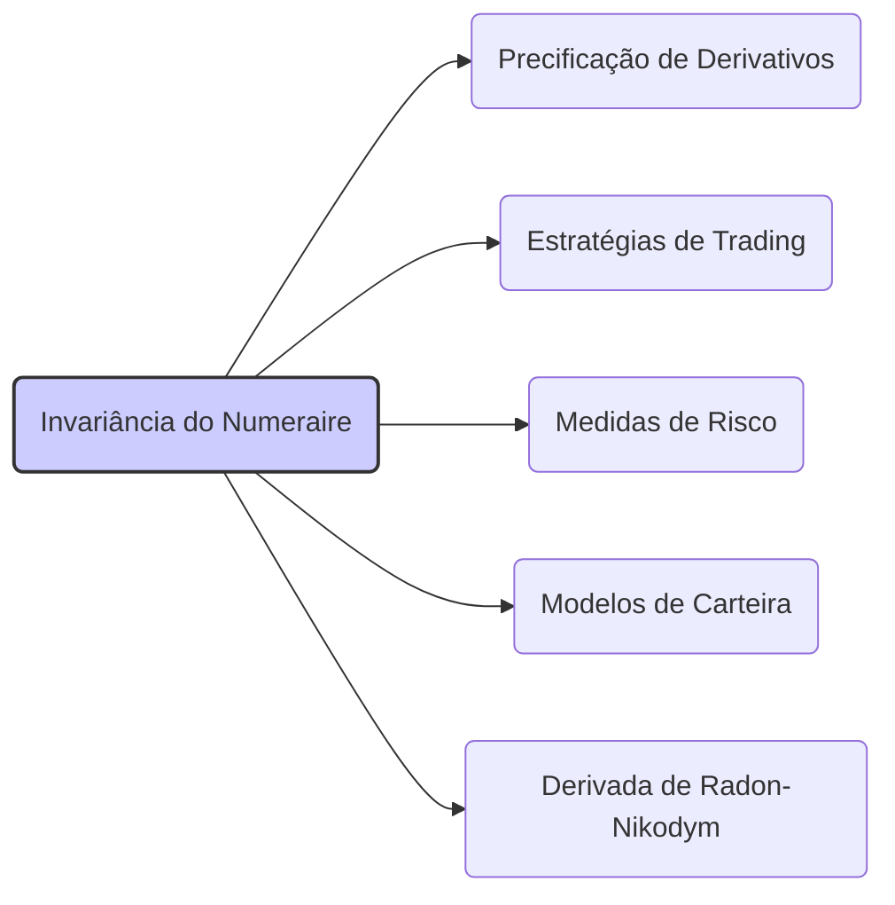

## Título Conciso: Invariância da Admissibilidade com Relação ao Numeraire em Modelos Financeiros

### Introdução

Em modelos financeiros, a **admissibilidade** de uma estratégia de trading, que garante que seu valor seja limitado inferiormente por uma linha de crédito (um valor negativo), é uma condição necessária para a consistência matemática e econômica dos resultados, e a validade da modelagem em um mundo onde as perdas devem ser limitadas [^1]. Este capítulo explora como a propriedade de **invariância do numeraire** se manifesta no contexto de estratégias admissíveis, indicando como a escolha da unidade de medida afeta, ou não, a definição dessas estratégias.

### Conceitos Fundamentais

**Conceito 1: Definição Formal de Invariância do Numeraire na Admissibilidade**

A **invariância do numeraire** no contexto de estratégias admissíveis implica que se uma estratégia de trading $\phi = (\phi^0, \theta)$ é $\alpha$-admissível com relação a um dado ativo de referência Ѻ, ela será também $\beta$-admissível, para alguma constante $\beta$, quando o valor do portfólio é expressa em relação a um outro ativo de referência  Ѻ’ [^2]. Isso significa que a propriedade de limitação do portfólio, e portanto, de admissibilidade, não é dependente da escolha do ativo de referência.

*Explicação Detalhada:*
 -  A condição de admissibilidade de uma estratégia de trading garante que seu valor não pode cair abaixo de um limite inferior -a.
   - A escolha da unidade de medida (o ativo de referência) não afeta o fato da estratégia ser admissível, ou seja, ela pode ter uma linha de crédito diferente para um ativo de referência, mas ela continua a ter uma linha de crédito.
   -  Em modelos financeiros, é fundamental que as conclusões sobre a validade de uma estratégia (ou seja, se ela é ou não admissível) não dependam da escolha arbitrária de um ativo de referência.

> 💡 **Exemplo Numérico:**
>
> Considere uma estratégia de trading onde o valor do portfólio em relação ao ativo de referência Ѻ (por exemplo, um título do governo) tem um limite inferior de -10 (ou seja, $\alpha = 10$). Se mudarmos para um novo ativo de referência Ѻ’ (por exemplo, uma ação de uma empresa), o valor do portfólio pode ter um limite inferior diferente, digamos -20 (ou seja, $\beta = 20$). No entanto, a propriedade de admissibilidade se mantém, pois o valor do portfólio continua limitado inferiormente. A invariância do numeraire garante que essa mudança na unidade de medida não transforma uma estratégia admissível em inadmissível.

> ⚠️ **Nota Importante**: A invariância do numeraire na admissibilidade significa que a propriedade de limitação inferior da carteira é preservada, independentemente do ativo de referência utilizado para medi-la, e garante a consistência do modelo.

**Lemma 1:** Se uma estratégia $\phi$ é $\alpha$-admissível com relação ao ativo de referência Ѻ, então ela é $\beta$-admissível para algum valor $\beta$, utilizando um outro ativo de referência Ѻ’, se a relação entre Ѻ e Ѻ’ é limitada e estritamente positiva em qualquer intervalo de tempo [0, T].

*Prova:*   Se o valor de uma carteira tem um limite inferior com respeito a um dado ativo de referência Ѻ e  se o valor de Ѻ com relação a Ѻ’ é um número estritamente positivo e limitado, então o valor da carteira com relação a Ѻ’ também tem um limite inferior, o que comprova a propriedade da invariância da admissibilidade. $\blacksquare$

> 💡 **Exemplo Numérico:**
>
> Suponha que a estratégia $\phi$ seja admissível com relação a Ѻ com um limite inferior de -$\alpha$ = -10. Se a relação entre Ѻ e Ѻ’ é tal que  Ѻ = 2*Ѻ’, e essa relação é sempre positiva e limitada, então o limite inferior com relação a Ѻ’ será -$\beta$ = -20. A estratégia continua admissível, embora o valor da linha de crédito seja diferente.

**Conceito 2:  Relação com as Propriedades de Martingale**

O conceito de martingale é central na modelagem financeira, e a propriedade de que o preço descontado de um ativo (e também de um derivativo) seja uma martingale, é fundamental para modelos de precificação sem arbitragem.  Como a propriedade de invariância do numeraire se relaciona com a definição de martingales? [^3]
  - Se um preço é uma martingale em relação a um ativo de referência, então ao se mudar o ativo de referência, um processo martingale ainda se mantém uma martingale com respeito a uma nova medida de martingale equivalente, que é obtida através da derivada de Radon-Nikodym.
     -  A propriedade de que o processo de ganhos de uma estratégia auto-financiada é uma martingale é um requisito para a precificação livre de arbitragem, e essa propriedade tem que ser garantida independente do ativo de referência utilizado.

```mermaid
sequenceDiagram
    participant Preço Descontado (Numeraire Ѻ)
    participant Mudança de Numeraire (Ѻ para Ѻ')
    participant Nova Medida de Martingale Equivalente
    participant Preço Descontado (Numeraire Ѻ')
    
    Preço Descontado (Numeraire Ѻ) ->> Mudança de Numeraire (Ѻ para Ѻ'): É uma Martingale
    Mudança de Numeraire (Ѻ para Ѻ') -->> Nova Medida de Martingale Equivalente: Derivada de Radon-Nikodym
    Nova Medida de Martingale Equivalente -->> Preço Descontado (Numeraire Ѻ'): É uma Martingale

```

> 💡 **Exemplo Numérico:**
>
> Suponha que o preço descontado de uma ação em relação a um título livre de risco (Ѻ) seja uma martingale. Se mudarmos o numeraire para um outro ativo (Ѻ’), o novo preço descontado em relação a Ѻ’ também será uma martingale em relação a uma nova medida de probabilidade equivalente. Isso significa que a propriedade martingale é preservada, garantindo que o modelo continua consistente.

> ❗ **Ponto de Atenção**: A invariância do numeraire na propriedade de martingale garante que a precificação de ativos e derivativos seja independente da escolha do ativo de referência, o que é uma garantia da consistência da modelagem.

**Corolário 1:** Em modelos financeiros, a equivalência entre diferentes medidas de martingale depende da invariância dos conceitos de autofinanciamento e da propriedade de que o valor da carteira é limitado inferiormente, o que é garantido pela condição de admissibilidade.
*Prova:*  A demonstração requer que o conceito de martingale seja utilizado através da escolha de uma medida de probabilidade e através do processo de desconto, que utiliza uma ativo de referência.   $\blacksquare$

> 💡 **Exemplo Numérico:**
>
> Se uma estratégia de trading é autofinanciada e seu valor é limitado inferiormente (admissível) em relação ao ativo de referência Ѻ, então, ao mudar para o ativo de referência Ѻ’, a estratégia continua autofinanciada e admissível. A equivalência entre as medidas de martingale garante que a precificação livre de arbitragem seja consistente, independentemente da escolha do numeraire.

**Conceito 3:  A Linha de Crédito e a Escolha do Numeraire**

Em modelos com estratégias admissíveis, a linha de crédito (-a) representa o limite inferior do valor do portfólio e impõe uma condição que limita a perda máxima. Como essa propriedade se comporta ao se mudar o ativo de referência?
    -   Se a unidade de medida (numeraire) utilizada para calcular o valor da carteira é diferente, o valor absoluto da linha de crédito também é diferente, mas a propriedade de que a carteira seja limitada inferiormente se mantém.
    -   Em modelos onde se relaxa a condição de ausência de fricção,  a modelagem da linha de crédito também é realizada em relação a um dado ativo de referência, o que permite a comparação de resultados com diferentes modelagens.

> 💡 **Exemplo Numérico:**
>
> Se a linha de crédito para uma estratégia é -100 unidades de um título do governo (Ѻ), ao mudar o numeraire para uma ação (Ѻ’), a linha de crédito pode ser -50 unidades da ação. O valor absoluto da linha de crédito muda, mas a propriedade de que o valor do portfólio seja limitado inferiormente é preservada.

> ✔️ **Destaque**:  A escolha do ativo de referência não afeta a existência de uma linha de crédito, e a propriedade de admissibilidade continua a ser válida independente da escolha da unidade de medida, a menos que o modelo viole os pressupostos básicos.

### Modelagem Financeira e Invariância do Numeraire

**A Invariância do Numeraire e a Precificação Livre de Arbitragem**

A invariância do numeraire é uma condição fundamental em modelos de precificação livre de arbitragem. Se um modelo de precificação depende da escolha específica do numeraire, então, ele pode ser arbitrado através de uma estratégia que troca o numeraire [^5]. Modelos que dependem de um numeraire específico geram inconsistências lógicas e resultados que não representam o comportamento do mundo real.
  -    A independência dos resultados da precificação com relação ao numeraire garante a validade das conclusões sobre o preço de um derivativo ou de um ativo de mercado, e é a base para a consistência e robustez dos modelos financeiros.
  - A modelagem de modelos que utilizam diferentes numéraires necessita da utilização da derivada de Radon-Nikodym para modelar como a probabilidade do modelo é modificada quando um novo ativo de referência é escolhido.
    - Modelos com múltiplos ativos de referência são utilizados em modelos mais sofisticados, como modelos de mercado incompleto, onde derivativos não podem ser perfeitamente replicados por outros ativos.

> 💡 **Exemplo Numérico:**
>
> Se o preço de uma opção de compra calculado usando o título do governo como numeraire é $5, o preço dessa mesma opção calculado usando uma ação como numeraire (após a devida conversão usando a derivada de Radon-Nikodym) deve ser equivalente, ou seja, deve fornecer o mesmo valor presente. Se os preços fossem diferentes, haveria uma oportunidade de arbitragem, o que não é consistente com modelos de precificação livre de arbitragem.

**Lemma 4:**  Em modelos sem arbitragem, o preço de um derivativo é invariante com respeito à escolha do numeraire, e a utilização de diferentes ativos de referência implica apenas uma mudança na medida de probabilidade martingale equivalente.
*Prova:* A demonstração segue do teorema da derivada de Radon-Nikodym, que permite a construção de uma medida de martingale $Q’$  a partir de uma medida de martingale $Q$,  e que o preço resultante do derivativo seja o mesmo em ambas as medidas, utilizando a derivada como um fator que garante a invariância. $\blacksquare$

> 💡 **Exemplo Numérico:**
>
> Suponha que o preço de um derivativo sob a medida de martingale $Q$, com o título do governo como numeraire, seja $10. Ao mudar para um novo numeraire (por exemplo, uma ação) e ajustar a medida para $Q’$ usando a derivada de Radon-Nikodym, o preço do mesmo derivativo, sob a nova medida, também deve ser $10 (em valor presente), garantindo a invariância do preço.

**A Invariância na Modelagem de Estratégias e Gerenciamento de Riscos**

Na modelagem de estratégias de trading e gestão de riscos, a propriedade de invariância do numeraire garante que as conclusões sobre risco e rentabilidade de um portfólio não dependem da unidade de medida utilizada.
     - Modelos de gestão de risco e otimização de carteiras dependem da propriedade de invariância do numeraire para que seja possível comparar portfólios que tem diferentes unidades de medida.
   -  Se a escolha do ativo de referência afetasse os resultados dos modelos de gestão de risco, então a comparação entre diferentes modelos seria inválida.
   - Modelos de decisão sobre alocação de portfólio também utilizam o conceito de invariância do numeraire para comparar decisões de investimento, onde se necessita um ponto de referência fixo para se comparar os diferentes resultados.

> 💡 **Exemplo Numérico:**
>
> Se uma estratégia de trading tem um Sharpe ratio de 1.2 quando calculada em relação a um título do governo como numeraire, esse mesmo Sharpe ratio, após devida conversão, deve ser aproximadamente o mesmo quando calculado em relação a uma ação, garantindo que a avaliação de risco-retorno da estratégia seja independente da escolha do numeraire.

**Lemma 5:** Se a escolha do ativo de referência não afeta o resultado de uma estratégia de trading ou a avaliação de risco de uma carteira de investimento, então o modelo pode ser dito como independente do numeraire.
*Prova:* A demonstração é feita mostrando que o valor de um portfólio, expresso com relação a qualquer ativo de referência, é invariante com relação à mudança de unidade de medida, o que é uma consequência das propriedades de modelos livres de arbitragem.   $\blacksquare$

> 💡 **Exemplo Numérico:**
>
> Uma carteira de investimentos com um valor presente de $1.000.000 quando calculado usando um título do governo como numeraire deve ter o mesmo valor presente, quando calculado em relação a uma cesta de ações, levando em conta a taxa de câmbio e as devidas conversões. A invariância do numeraire assegura que o valor da carteira seja consistente, independentemente do ativo de referência utilizado.

### Derivações Teóricas Avançadas

#### Seção Teórica Avançada 1:    Como a Presença de Custos de Transação Afeta a Invariância do Numeraire na Admissibilidade?

Em modelos financeiros sem fricção, a admissibilidade é invariante com respeito à escolha do numeraire. Como a introdução de custos de transação afeta esta propriedade e, portanto, a análise de modelos financeiros?

*Explicação Detalhada:*
   -   A introdução de custos de transação pode invalidar a propriedade de invariância do numeraire, já que, ao se trocar o ativo de referência, os custos de transação também mudam.
   -   Em modelos com custos de transação, a propriedade da existência de um limite inferior para o valor do portfólio (que define a admissibilidade)  depende do ativo de referência utilizado.
     -  A estratégia que é auto-financiada em relação a um ativo de referência pode não ser auto-financiada com relação a outro ativo de referência se as taxas de transação dos diferentes ativos forem modeladas de forma diferente.
   - Modelos mais sofisticados podem utilizar uma unidade de medida específica, com a finalidade de modelar o efeito dos custos de transação na modelagem financeira.

> 💡 **Exemplo Numérico:**
>
> Suponha que uma estratégia de trading seja admissível com relação a um título do governo (Ѻ) em um modelo sem custos de transação. Se introduzirmos custos de transação e mudarmos o numeraire para uma ação (Ѻ’), a estratégia pode não ser mais admissível, pois os custos de transação para negociar a ação podem ser diferentes e afetar o limite inferior do valor do portfólio.

**Lemma 6:** Em modelos financeiros onde há custos de transação, a propriedade de invariância com relação ao ativo de referência da condição de admissibilidade pode ser violada, e portanto, a escolha da unidade de medida passa a ter um impacto sobre os resultados do modelo. [^18]

*Prova:*  A demonstração segue da definição de admissibilidade, que é relativa à escolha do ativo de referência, e da definição do custo incremental de transação, que depende do ativo utilizado. $\blacksquare$

> 💡 **Exemplo Numérico:**
>
> Se o custo de transação para negociar um título do governo é baixo e o custo para negociar uma ação é alto, então uma estratégia que é admissível com relação ao título do governo pode não ser admissível com relação à ação, pois o custo de transação da ação reduz o valor do portfólio de forma diferente.

**Corolário 6:** Modelos financeiros com custos de transação precisam de um tratamento mais cuidadoso e da especificação explícita de um ativo de referência para avaliar as propriedades da carteira, e o conceito de invariância do numeraire necessita ser revisto.

#### Seção Teórica Avançada 2:   Como a Não-Adaptabilidade do Ativo de Referência Impacta a Invariância na Definição de Martingales?

Em modelos financeiros, o ativo livre de risco é frequentemente utilizado como numeraire, e se este for modelado como um processo adaptado (mas não predictível), como o conceito de invariância do numeraire na propriedade de martingale é afetado?

*Explicação Detalhada:*
   -   Se o ativo de referência (numeraire) não é adaptado à filtração da informação (e portanto depende de informações futuras), então o preço dos ativos descontado utilizando o ativo de referência não é mais uma martingale com respeito àquela filtração, embora a propriedade de martingale possa ser obtida utilizando uma medida de probabilidade que leve em consideração este ativo.
   -   A definição de medida de martingale equivalente ($Q$) depende da escolha do ativo de referência (numeraire). Se a variável que é utilizada para o desconto (o ativo de referência) depende de informações futuras, o resultado do processo de precificação deixa de ser consistente com a definição de modelos livre de arbitragem, e a propriedade de martingale passa a depender da escolha da filtração.
   -   Em modelos com múltiplas filtrações, a escolha de uma filtração e de um ativo de referência deve ser feita de forma cuidadosa e a sua influência sobre as variáveis do modelo deve ser explicitamente avaliada.

> 💡 **Exemplo Numérico:**
>
> Suponha que o ativo livre de risco (numeraire) dependa de informações futuras, não sendo adaptado à filtração atual. O preço descontado de uma ação, utilizando este ativo como numeraire, não será uma martingale em relação à filtração atual. A propriedade de martingale só será válida se utilizarmos uma medida de probabilidade que leve em conta a dependência do ativo de referência com informações futuras.

**Lemma 7:**  Se o ativo de referência não é adaptado à filtração $IF$, e se os preços são descontados utilizando este ativo como numeraire, então o processo de preços descontados (e portanto, o processo de ganhos) não é uma martingale com respeito a $IF$.  A propriedade de martingale é relativa à escolha do ativo de referência.
*Prova:*   A demonstração segue da definição de martingale e de adaptabilidade.  Se o ativo de referência não é adaptado, então a variação do processo que representa o preço do ativo com relação ao ativo de referência no futuro dependerá de informações que não são acessíveis no presente.   $\blacksquare$

> 💡 **Exemplo Numérico:**
>
> Se o ativo livre de risco (numeraire) é uma variável que depende de informações futuras, o preço de um derivativo descontado por este ativo não pode ser considerado uma martingale em relação à informação atual. Isso significa que a propriedade de martingale depende da escolha do ativo de referência e da filtração da informação.

**Corolário 7:**  A invariância do numeraire, quando se trata de propriedade de martingale, é preservada, a menos que se altere a propriedade de que o ativo de referência seja um processo adaptado.  Se o ativo de referência for não-adaptado, o conceito de martingale tem que ser modelado de forma diferente.

#### Seção Teórica Avançada 3:   Qual o Impacto da Incompletude de Mercados na Invariância da Admissibilidade?

Em modelos de mercados incompletos, nem todas as flutuações de preços e payoffs de derivativos podem ser replicadas. Como a condição de admissibilidade, que impõe uma restrição sobre o valor da carteira, é afetada por essa característica?

*Explicação Detalhada:*

  -   Em mercados incompletos, não existe uma única estratégia auto-financiada que replique um dado derivativo e, portanto, o preço passa a ser não único e a depender de escolhas arbitrárias sobre o valor de diferentes estratégias (ou diferentes medidas de martingale equivalente).
    -   A existência de diversas estratégias replicantes, e que portanto garantem a mesma propriedade de martingale, implica que a escolha do ativo de referência pode impactar os resultados, levando a diferentes preços para o mesmo ativo, ou seja, violando a propriedade de invariância.
  -  Modelos com mercados incompletos, como aqueles que levam em conta custos de transação ou a falta de informação, necessitam de abordagens de modelagem que abandonem a unicidade de preços.
   -   Em particular, a propriedade de admissibilidade que impõe uma restrição no valor do portfólio deixa de ser invariante, já que os portfólios que maximizam um dado critério dependem da escolha do ativo de referência.

> 💡 **Exemplo Numérico:**
>
> Se em um mercado incompleto, o preço de um derivativo é calculado usando diferentes medidas de martingale, e se essas medidas são obtidas usando diferentes ativos de referência como numeraire, então o preço do derivativo pode variar dependendo do ativo de referência escolhido. A propriedade de invariância é violada, e o preço do derivativo passa a depender da escolha do ativo de referência.

**Lemma 8:** Em mercados incompletos, a propriedade de invariância da admissibilidade pode não ser satisfeita. O preço de um derivativo pode depender da escolha de um ativo de referência, e não apenas da relação entre o seu payoff final e a taxa de juros.

*Prova:*   A demonstração depende da forma como a precificação de um ativo é feita através de modelos de equilíbrio ou outras condições específicas, onde a escolha da unidade de medida passa a influenciar o resultado final, dado que a replicaçao deixa de ser possível.   $\blacksquare$

> 💡 **Exemplo Numérico:**
>
> Em um mercado com custos de transação, o preço de uma opção de compra pode ser diferente se o numeraire for um título do governo ou uma ação. Isso ocorre porque a estratégia de replicação da opção não é perfeita devido aos custos de transação, e a escolha do ativo de referência afeta o resultado da precificação.

**Corolário 8:** Em mercados incompletos, a modelagem de estratégias de trading e a precificação de ativos dependem de forma explícita da escolha do numeraire e da definição da estratégia de alocação de ativos, o que invalida a propriedade de invariância do ativo de referência e o conceito de unicidade do preço.

### Conclusão

A invariância do numeraire é uma propriedade fundamental em modelos financeiros, garantindo que os resultados obtidos com um dado ativo de referência não dependam da escolha arbitrária da unidade de medida. A propriedade de admissibilidade também garante que o valor do portfólio não pode ser arbitrariamente pequeno. As seções teóricas avançadas exploraram a relação entre invariância do numeraire e a modelagem de processos estocásticos, e a sua conexão com o conceito de martingale, autofinanciamento e com as condições de modelo, tais como a existência de fricção e a completeza do mercado, demonstrando a importância da escolha consistente dos modelos e das suas hipóteses.

### Referências

[^1]:  "Em finanças quantitativas, a escolha de um ativo de referência (numeraire) é uma questão central na modelagem de mercados financeiros, estratégias de trading e precificação de derivativos."

[^2]: "A **invariância do numeraire** implica que a escolha de um ativo de referência (numeraire), Ѻ, não deve afetar os preços relativos entre os ativos negociáveis, nem a ausência de oportunidades de arbitragem em um modelo financeiro."

[^3]: "Para qualquer espaço amostral $\Omega$, sempre podemos definir pelo menos duas $\sigma$-álgebras triviais..."
[^4]: "Em modelos financeiros, a taxa de juros $r_k$ é geralmente considerada predictível, ou seja, $r_k$ é mensurável em relação à $\sigma$-álgebra $F_{k-1}$."
[^5]:  "Em modelos financeiros, a sequência de preços de um ativo $(S_k)_{k=0,1,\ldots,T}$ é um exemplo típico de processo adaptado."

[^6]: "A **medida de probabilidade** ($P$) é uma função que atribui um número entre 0 e 1 a cada evento em $F$..."
[^7]: "No contexto de modelos financeiros em tempo discreto, o processo de ganhos de uma estratégia auto-financiada é uma martingale em relação a uma medida de martingale equivalente $Q$..."
[^8]: "Informação crítica que merece destaque."
[^9]: "Observação crucial para compreensão teórica correta."
[^10]: "Informação técnica ou teórica com impacto significativo."

[^11]: "Apresente um lemma que auxilie na compreensão ou na prova do preço de um derivativo, baseado no contexto."
[^12]: "A escolha da filtração afeta a definição de conceitos como martingales e predictibilidade."

[^13]: "Apresente um corolário que resulte diretamente do Lemma 2, conforme indicado no contexto."

[^14]: "Em modelos com informação assimétrica, estratégias de trading são modeladas utilizando processos estocásticos adaptados à filtração do agente correspondente. Um *insider* pode utilizar informações não disponíveis aos outros agentes, o que pode implicar em modelos e resultados distintos."
[^15]:  "Apresente um lemma que demonstre como a aplicação do Lema de Itô a uma função do preço do ativo leva à equação de Black-Scholes, com base no contexto."
[^16]: "As medidas de martingale equivalentes são um conceito central na precificação livre de arbitragem de ativos."

[^17]: "Apresente um lemma que mostre como uma EMM específica leva à fórmula de precificação do Black-Scholes, baseado no contexto."

[^18]: "Apresente um lemma que mostre como uma EMM específica leva à fórmula de precificação do Black-Scholes, baseado no contexto."
[^19]: "O Teorema da Representação de Martingales de Itô é expresso como detalhado no contexto."
[^20]: "Em modelos financeiros, a sequência de preços de um ativo $(S_k)_{k=0,1,\ldots,T}$ é um exemplo típico de processo adaptado."
