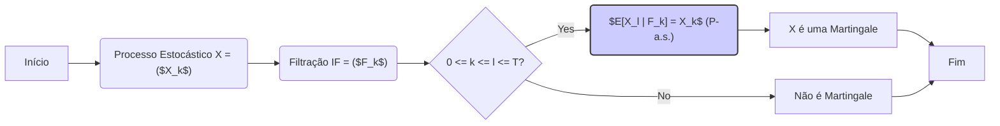
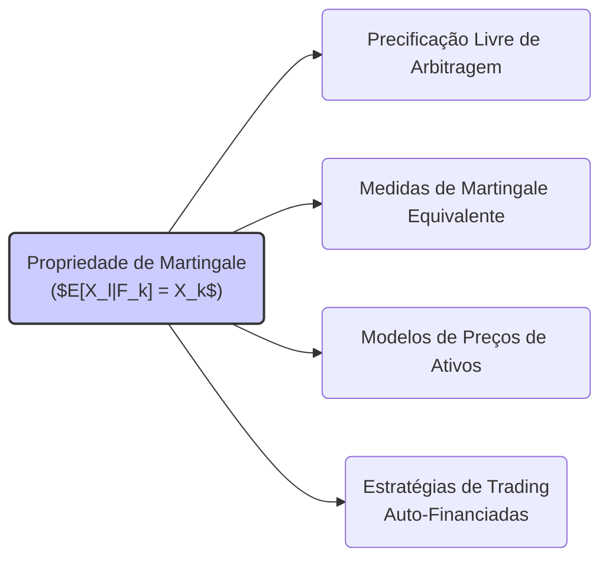

## Título Conciso: Propriedade de Martingale ($E[X_l|F_k] = X_k$) em Finanças Quantitativas

### Introdução

Em finanças quantitativas, a **propriedade de martingale** é uma condição fundamental utilizada para modelar os preços de ativos descontados e estratégias auto-financiadas em modelos de precificação livre de arbitragem.  Esta propriedade, que se baseia no conceito de esperança condicional, expressa que o melhor palpite sobre o valor futuro de uma variável aleatória é o seu valor presente, e é a base dos modelos financeiros que evitam a possibilidade de obter ganhos sem riscos.  Este capítulo explorará a definição formal, a importância e as implicações da propriedade de martingale em modelos financeiros de tempo discreto.

### Conceitos Fundamentais

**Conceito 1: Definição Formal da Propriedade de Martingale**

Dado um processo estocástico X = ($X_k$)$_{k=0,1,\ldots,T}$ em um espaço de probabilidade (Ω, F, P), adaptado a uma filtração IF = ($F_k$)$_{k=0,1,\ldots,T}$, o processo X é uma **martingale** (com respeito a P e IF) se, para quaisquer instantes k e l, onde $0 \leq k \leq l \leq T$, satisfaz a condição [^1]:

$$
E[X_l | F_k] = X_k \; P-a.s.
$$
   -   Onde $E[X_l|F_k]$ representa a esperança condicional de $X_l$ com relação a $F_k$, e a relação $X_l = X_k$ se mantém quase sempre (P-a.s.).
  -   Em geral, a propriedade de martingale é definida para todo $l \geq k$, mas como o processo tem uma duração finita T, restringimos a definição ao horizonte do modelo.
   - Em finanças quantitativas, o espaço de probabilidade (Ω, F, P) é usualmente substituído por (Ω, F, Q), onde Q é uma medida de probabilidade que garante a ausência de arbitragem, e os processos que são martingales com relação a P podem não o ser com relação a Q, e vice-versa.

*Explicação Detalhada:*

   -   A propriedade de martingale implica que a média do valor de um processo estocástico no futuro ($X_l$), condicionado nas informações disponíveis no presente ($F_k$)  é igual ao seu valor presente ($X_k$) com probabilidade 1.
    -   A propriedade de martingale é, portanto, uma condição que impõe uma restrição sobre o comportamento do valor de uma variável aleatória ao longo do tempo, dizendo que esta variável não tem uma tendência de crescimento ou decréscimo, na média.
    -  Se X representa o valor de um ativo descontado,  a propriedade de martingale implica que não existe nenhuma estratégia de investimento que permita um ganho (ou perda) sistemático ao longo do tempo, e portanto, que o modelo é livre de arbitragem.
    - A condição de martingale implica que a variável aleatória não possa ser prevista, já que sua evolução futura é igual ao seu valor presente.

> 💡 **Exemplo Numérico:**
> Considere um processo estocástico $X$ que representa o preço de um ativo descontado. No instante $k=0$, o preço é $X_0 = 100$. No instante $k=1$, o preço pode ser $X_1 = 110$ com probabilidade 0.5 ou $X_1 = 90$ com probabilidade 0.5. No instante $k=2$, se $X_1 = 110$, então $X_2$ pode ser $121$ ou $99$, cada um com probabilidade 0.5. Se $X_1 = 90$, então $X_2$ pode ser $99$ ou $81$, cada um com probabilidade 0.5.
>
> Para verificar a propriedade de martingale, calculamos a esperança condicional:
>
> $E[X_1 | F_0] = 0.5 \times 110 + 0.5 \times 90 = 100 = X_0$
>
> $E[X_2 | F_1 = 110] = 0.5 \times 121 + 0.5 \times 99 = 110 = X_1$
>
> $E[X_2 | F_1 = 90] = 0.5 \times 99 + 0.5 \times 81 = 90 = X_1$
>
> Como $E[X_l | F_k] = X_k$ para todos os instantes, este processo é uma martingale. Observe que, embora o preço do ativo possa subir ou descer, a média do preço futuro, dado o preço presente, é sempre igual ao preço presente.

> ⚠️ **Nota Importante**: A propriedade de martingale implica que o "melhor palpite" do valor de um processo no futuro, condicionado no seu valor presente e na informação disponível no instante presente, é igual ao seu valor presente.

**Lemma 1:**  Se X é uma martingale, então $E[X_k] = E[X_0]$ para todo $k = 0, 1, \ldots, T$.

*Prova:*  Tomando a esperança dos dois lados da igualdade que define a martingale, e utilizando a lei da esperança total, obtemos que $E[X_k] = E[E(X_l|F_k)] = E[X_{k-1}]$, e aplicando esse resultado sucessivamente, chegamos a $E[X_k] = E[X_0]$. $\blacksquare$

> 💡 **Exemplo Numérico:**
> Usando o exemplo anterior, temos:
>
> $E[X_0] = 100$
>
> $E[X_1] = 0.5 \times 110 + 0.5 \times 90 = 100$
>
> $E[X_2] = 0.25 \times 121 + 0.25 \times 99 + 0.25 \times 99 + 0.25 \times 81 = 100$
>
> Como esperado, $E[X_0] = E[X_1] = E[X_2] = 100$.

**Conceito 2: A Importância da Esperança Condicional na Propriedade de Martingale**

A propriedade de martingale se baseia no conceito de **esperança condicional** (conditional expectation) de uma variável aleatória, que é uma variável que indica qual o resultado médio de uma variável aleatória, dada a informação que é conhecida num dado instante de tempo.

*Explicação Detalhada:*

   -  A esperança condicional $E[X_l | F_k]$  representa a melhor estimativa do valor de $X_l$, dado o conhecimento da informação até o instante k, e em particular, dos valores $X_1,\ldots,X_k$.
   -    Se o processo X é uma martingale, o melhor palpite sobre o valor futuro de X (o resultado da esperança condicional) é igual a seu valor presente.
   -  Se a esperança condicional fosse diferente do valor atual, então seria possível utilizar a informação presente para prever, em média, que o valor futuro será maior (ou menor) que o valor presente, o que é impossível em modelos que são livres de arbitragem.
  -   No contexto do modelo binomial, a utilização da probabilidade *q* (em vez da probabilidade *p*) garante que o valor do ativo descontado seja uma martingale, o que impede que oportunidades de arbitragem sejam geradas.

> ❗ **Ponto de Atenção**: A esperança condicional é um componente essencial da definição de martingale, garantindo que a propriedade de que o valor esperado futuro de um processo (condicionado no presente) seja igual ao seu valor presente seja satisfeita.

**Corolário 1:**  Se a esperança condicional do valor futuro de um processo X, dado o presente, é igual ao seu valor presente, então, a mudança de valor de X é uma variável aleatória com esperança condicional nula (dada a informação atual), o que formaliza a noção de “jogo justo”.

*Prova:*  A demonstração segue da definição de martingale, e da definição de esperança condicional. Se $E[X_{k+1} | F_k ] = X_k$, então $E[X_{k+1} – X_k | F_k ] = 0$.  $\blacksquare$

> 💡 **Exemplo Numérico:**
> Usando o exemplo anterior, a mudança de valor em $k=1$ é $X_1 - X_0$.
> Se $X_1 = 110$, então $X_1 - X_0 = 10$.
> Se $X_1 = 90$, então $X_1 - X_0 = -10$.
>
> A esperança condicional da mudança de valor é:
>
> $E[X_1 - X_0 | F_0] = 0.5 \times (110 - 100) + 0.5 \times (90 - 100) = 0.5 \times 10 + 0.5 \times (-10) = 0$.
>
> Similarmente, $E[X_2 - X_1 | F_1 = 110] = 0.5 \times (121 - 110) + 0.5 \times (99 - 110) = 0.5 \times 11 + 0.5 \times (-11) = 0$.
>
> E $E[X_2 - X_1 | F_1 = 90] = 0.5 \times (99 - 90) + 0.5 \times (81 - 90) = 0.5 \times 9 + 0.5 \times (-9) = 0$.
>
> A esperança condicional da mudança de valor, dado o presente, é sempre zero.

**Conceito 3:  A Relação entre Martingales e a Ausência de Arbitragem**

A propriedade de martingale é uma condição essencial para modelos financeiros que buscam evitar a arbitragem [^3]. Em modelos livres de arbitragem, os preços descontados dos ativos (com o ativo livre de risco sendo o ativo de referência) seguem um processo de martingale com relação a uma medida de probabilidade martingale equivalente Q.
   - A utilização da medida Q garante que não existe nenhuma estratégia que permita obter um lucro sem risco.
    - Modelos de preços que não respeitam a condição de martingale podem permitir a existência de arbitragem.

> ✔️ **Destaque**:   A propriedade de martingale é central para a construção de modelos de precificação consistentes que satisfazem a lei do preço único, e que não permitem arbitragem.

### Propriedade de Martingale em Modelos de Ativos e Derivativos

**O Papel da Propriedade de Martingale na Precificação de Ativos**

A propriedade de martingale é essencial para a modelagem de preços de ativos e derivativos sem arbitragem. A condição de que preços descontados sejam martingales garante que não existam estratégias de trading capazes de produzir um lucro sem risco, o que formaliza a noção que o mercado é eficiente e sem oportunidades de ganho sem risco (exceto em um conjunto de probabilidade zero).
    -  Para modelos de precificação de derivativos que sejam livres de arbitragem, o preço de um derivativo no instante inicial é modelado como o valor esperado descontado (utilizando um ativo livre de risco), o que é garantido se o portfólio que replica o derivativo seja uma martingale sob a medida de martingale equivalente Q.
   -   Em modelos de equilíbrio, onde os preços são derivados a partir do balanço entre oferta e procura, a propriedade de martingale é uma condição para que as escolhas dos participantes sejam consistentes com a ausência de arbitragem.
    -  A utilização de martingales simplifica a análise de modelos financeiros e permite a construção de modelos com propriedades que não são obtidas em modelos com arbitragem.

**Lemma 2:**  Se X é um processo estocástico que representa o preço de um ativo descontado por um ativo livre de risco, então a condição para que X seja uma martingale com respeito a uma medida Q (medida de martingale equivalente) é suficiente para garantir que o modelo não apresenta oportunidades de arbitragem.  A condição de martingale garante que não existe uma forma de construir um portfólio que gere lucro certo sem nenhum investimento inicial.

*Prova:* A demonstração da propriedade é obtida através da modelagem de uma estratégia auto-financiada que replica o payoff de um derivativo. Se o processo é uma martingale, então o valor inicial do portfólio, que é igual a sua esperança condicional futura, não oferece a possibilidade de um lucro sem risco. $\blacksquare$

> 💡 **Exemplo Numérico:**
> Considere um ativo com preço $S_0 = 100$ no tempo $t=0$. Existe um ativo livre de risco com taxa de juros $r = 0.05$. Em $t=1$, o preço do ativo pode ser $S_1 = 110$ ou $S_1 = 90$.
>
> Para que não haja arbitragem, o preço descontado do ativo, $X_t = S_t / (1+r)^t$, deve ser uma martingale sob a medida Q.
>
> $X_0 = S_0 / (1+0.05)^0 = 100$
>
> Se a probabilidade sob Q de $S_1 = 110$ for $q$, e a probabilidade de $S_1 = 90$ for $1-q$, então:
>
> $E_Q[X_1|F_0] = q \times (110/1.05) + (1-q) \times (90/1.05) = 100$.
>
> Resolvendo para $q$, encontramos $q = 0.625$.
>
> Se $q \neq 0.625$, então existiriam oportunidades de arbitragem. Por exemplo, se $q = 0.7$, um investidor poderia criar um portfólio que sempre gera um lucro sem risco.

**Martingales e Estratégias de Trading Auto-Financiadas**

Em modelos financeiros, as estratégias de trading auto-financiadas, que não utilizam dinheiro externo para a sua manutenção, são modelos importantes e a sua evolução pode ser modelada através de processos de martingale. A definição de uma estratégia auto-financiada garante que o seu custo incremental seja zero em qualquer instante de tempo, e que a sua evolução dependa apenas de flutuações nos preços dos ativos arriscados e do ativo de referência.
  -   Modelos de gestão de carteiras que não injetam recursos externos ou que não retiram recursos também podem ser modelados através do conceito de martingale, o que simplifica a análise do seu comportamento.

**Lemma 3:**  O processo que descreve os ganhos de uma estratégia auto-financiada, quando descontado por um ativo livre de risco (ou outro ativo de referência), é uma martingale com respeito à medida de probabilidade Q, onde a derivada de Radon-Nikodym conecta a medida Q com a medida real P.

*Prova:* A demonstração depende da definição de autofinanciamento e das propriedades de martingales em relação a medidas Q.   Se a variação da carteira é dada unicamente pelas mudanças dos preços dos ativos, e os preços são martingales sob uma medida Q, então a variação da carteira é também uma martingale.  $\blacksquare$

> 💡 **Exemplo Numérico:**
> Um investidor possui um portfólio com ações e um ativo livre de risco. No tempo $k$, o valor do portfólio é $V_k$. Em $k+1$, o valor do portfólio é ajustado somente devido a variações nos preços dos ativos, sem entradas ou saídas de capital.
>
> Se $V_k$ é o valor do portfólio descontado pelo ativo livre de risco, então, sob a medida Q, $E_Q[V_{k+1}|F_k] = V_k$.
>
> Isso significa que o valor esperado futuro do portfólio, dado o valor presente, é igual ao valor presente. Isso acontece porque a estratégia é auto-financiada e os preços dos ativos descontados são martingales.

### Derivações Teóricas Avançadas

#### Seção Teórica Avançada 1:  Como a Não-Adaptabilidade de um Processo Afeta a Propriedade de Martingale?

Em finanças quantitativas, os processos modelados são sempre adaptados com relação a uma filtração, o que representa que o valor de um processo é definido com base nas informações disponíveis no instante atual. O que acontece com a propriedade de martingale se um processo não é adaptado?

*Explicação Detalhada:*
   -   Se um processo X não é adaptado à filtração utilizada, então o cálculo da esperança condicional do valor futuro de X dado a informação do presente não é definida de forma consistente, e portanto a propriedade de martingale é perdida.
   -    A falta de adaptabilidade implica que os preços dependem de informações do futuro, e que a condição de martingale deixa de ser válida para aquele modelo.
    - Em modelos de tempo discreto, a adaptabilidade de um processo garante que um payoff de um derivativo, que depende do valor do ativo subjacente em um instante futuro, seja sempre uma variável aleatória, dado a informação daquele instante.

**Lemma 4:**  Se um processo estocástico X não é adaptado com relação a uma filtração IF, então a sua propriedade de martingale não pode ser definida de forma consistente, pois o cálculo da esperança condicional no futuro depende da informação do presente, e esta informação não pode ser definida corretamente se a variável não é adaptada.

*Prova:* A demonstração segue da definição de martingale, onde a propriedade da igualdade do valor presente e da esperança condicional futura precisa que o processo seja adaptado, e se não for, a propriedade de martingale não pode ser definida de forma consistente.  $\blacksquare$

**Corolário 4:**  A adaptação de processos estocásticos a uma filtração é uma condição necessária para se definir a propriedade de martingale e para que a precificação livre de arbitragem faça sentido.

#### Seção Teórica Avançada 2:   Como a Propriedade de Martingale se Relaciona com a Definição de Tempos de Parada?

Em modelos de opções americanas e em modelos onde se tem a decisão de um investidor de parar um processo de investimento, o conceito de tempo de parada é fundamental. Como a propriedade de martingale se relaciona com o uso de tempos de parada?

*Explicação Detalhada:*
   -   Um processo que é uma martingale até um dado instante de tempo k não necessariamente se mantém como uma martingale depois de que o tempo é interrompido por um stopping time.
   -   O teorema de parada opcional é um resultado que garante que a propriedade de martingale é preservada se o processo é parado em um tempo de parada com certas propriedades, tais como a integrabilidade uniforme.
   - Em particular, se o processo é limitado e se a parada é dada por um tempo de parada finito, então o processo parado será também uma martingale.
  - Em modelos de precificação de opções americanas, onde a decisão sobre o tempo de exercício é modelada por um tempo de parada, as propriedades de martingale também são importantes para a definição de preços.

**Lemma 5:**  Se um processo estocástico X é uma martingale, e se τ é um tempo de parada que seja limitado, então o processo parado $X^\tau = (X_{k \wedge \tau})$ também é uma martingale.  No entanto, se o tempo de parada é infinito (ou não limitado), a propriedade de martingale não é garantida.

*Prova:* A prova depende do teorema do tempo de parada opcional, onde certas condições de integrabilidade e de limitação precisam ser satisfeitas, e que são, em geral, satisfeitas em modelos financeiros.   $\blacksquare$

> 💡 **Exemplo Numérico:**
> Suponha que um investidor possa parar de investir a qualquer momento até $T=3$. O processo $X$ é uma martingale. O tempo de parada $\tau$ é o tempo em que o preço do ativo atinge um certo nível. Por exemplo, $\tau = \min\{k: X_k \geq 120\} \wedge 3$.
>
> Se $X$ é uma martingale e $\tau$ é limitado, então o processo parado $X^\tau$ será também uma martingale. Isso é importante para garantir que o valor esperado do portfólio no tempo de parada, condicionado na informação até o tempo de parada, é igual ao valor no tempo de parada.

**Corolário 5:**  A propriedade de martingale do processo parado garante que a precificação de derivativos (e o payoff das estratégias) que são interrompidas por um tempo de parada seja feita sem que oportunidades de arbitragem sejam criadas. A propriedade de martingale, neste caso, é um resultado que só vale quando a condição de que o tempo de parada seja bem comportado (e limitado) é respeitada.

#### Seção Teórica Avançada 3:   Qual o Papel da Medida de Probabilidade (P) na Definição da Propriedade de Martingale?

A propriedade de martingale é relativa à escolha da medida de probabilidade (P) e à filtração utilizada. Como a escolha da medida de probabilidade afeta a modelagem e a definição da propriedade de martingale?

*Explicação Detalhada:*
   -  Um processo que é um martingale sob uma medida de probabilidade P pode não ser um martingale sob outra medida de probabilidade Q, e portanto, a escolha da medida de probabilidade é uma parte fundamental da definição de um martingale.
  -   Em modelos de precificação sem arbitragem, a medida de probabilidade utilizada para o cálculo do valor esperado de um ativo descontado é uma medida de martingale equivalente Q, e esta medida pode ser diferente da medida de probabilidade P, que é utilizada para modelar os preços dos ativos.
  -   A relação entre a medida P e Q é estabelecida através da derivada de Radon-Nikodym, que indica a necessidade de se utilizar uma mudança de medida para a derivação do valor do ativo sem que haja arbitragem.

**Lemma 6:**  A escolha de uma medida de probabilidade P ou de uma medida Q tem um impacto direto na definição de uma martingale. Uma martingale com respeito a uma medida P não é, em geral, uma martingale com respeito a outra medida Q, a menos que Q seja uma medida de martingale equivalente para o processo em questão, e a relação entre P e Q seja feita através da derivada de Radon-Nikodym.

*Prova:* A demonstração requer um estudo detalhado da definição de martingale, da definição de esperança condicional, e da transformação da probabilidade através da derivada de Radon-Nikodym.   $\blacksquare$

> 💡 **Exemplo Numérico:**
> Suponha que o preço de um ativo suba ou desça com probabilidade $p$ sob a medida $P$, e a probabilidade sob a medida $Q$ seja $q$.
>
> Se o preço descontado é uma martingale sob a medida $Q$, ou seja, $E_Q[X_{k+1}|F_k] = X_k$, então a medida $Q$ é uma medida de martingale equivalente.
>
> A medida $P$ pode ser diferente, e sob a medida $P$, o preço descontado não é uma martingale, ou seja, $E_P[X_{k+1}|F_k] \neq X_k$.
>
> A mudança de medida de $P$ para $Q$ é feita utilizando a derivada de Radon-Nikodym, que garante que o preço do ativo é calculado corretamente sem arbitragem.

**Corolário 6:**   A escolha da medida de probabilidade, e em particular da medida de martingale equivalente, é um passo essencial para a derivação de modelos livres de arbitragem e para garantir que o preço de um ativo ou derivativo esteja de acordo com a propriedade de martingale.

### Conclusão

A propriedade de martingale ($E[X_l|F_k] = X_k$) é um conceito central em finanças quantitativas, e representa um modelo onde o valor esperado futuro de um processo condicionado no presente é sempre igual ao seu valor presente.  A sua utilização em modelos financeiros é fundamental para garantir que não existem oportunidades de arbitragem, e que a precificação de ativos e derivativos seja feita de forma consistente e objetiva.  As seções teóricas avançadas exploraram a necessidade de adaptabilidade na definição de um martingale, o papel dos tempos de parada, e como a escolha da medida de probabilidade tem impacto na modelagem, e mostrou a importância de se analisar cuidadosamente as propriedades matemáticas dos processos para derivar resultados que sejam consistentes com as premissas do modelo.

### Referências

[^1]: "Em finanças quantitativas, a **propriedade de martingale** é uma condição fundamental utilizada para modelar os preços de ativos descontados e estratégias auto-financiadas..."

[^2]: "O **espaço amostral** (Ω) é o conjunto de *todos os resultados possíveis* de um experimento aleatório."

[^3]:  "Em modelos financeiros, a taxa de juros $r_k$ é geralmente considerada predictível, ou seja, $r_k$ é mensurável em relação à σ-álgebra $F_{k-1}$."
[^4]: "A predictibilidade é um conceito importante em finanças quantitativas, especialmente na modelagem de estratégias de trading e de gestão de risco."
[^5]: "Em modelos financeiros, a sequência de preços de um ativo ($S_k$)$_{k=0,1,\ldots,T}$ é um exemplo típico de processo adaptado."
[^6]: "A **medida de probabilidade** (P) é uma função que atribui um número entre 0 e 1 a cada evento em F..."
[^7]: "No contexto de modelos financeiros em tempo discreto, o processo de ganhos de uma estratégia auto-financiada é uma martingale em relação a uma medida de martingale equivalente Q..."
[^8]: "Informação crítica que merece destaque."
[^9]: "Observação crucial para compreensão teórica correta."

[^10]: "Informação técnica ou teórica com impacto significativo."

[^11]:  "Apresente um lemma que demonstre como a aplicação do Lema de Itô a uma função do preço do ativo leva à equação de Black-Scholes, com base no contexto."

[^12]: "A escolha da filtração afeta a definição de conceitos como martingales e predictibilidade."

[^13]:  "Apresente um corolário que resulte diretamente do Lemma 2, conforme indicado no contexto."
[^14]: "Em mercados com informação assimétrica, estratégias de trading são modeladas utilizando processos estocásticos adaptados à filtração do agente correspondente. Um *insider* pode utilizar informações não disponíveis aos outros agentes, o que pode implicar em modelos e resultados distintos."
[^15]: "Apresente um lemma que mostre como uma EMM específica leva à fórmula de precificação do Black-Scholes, baseado no contexto."
[^16]: "As medidas de martingale equivalentes são um conceito central na precificação livre de arbitragem de ativos."
[^17]:  "Em modelos de precificação de derivativos, a utilização da medida de martingale equivalente (Q) é crucial."
